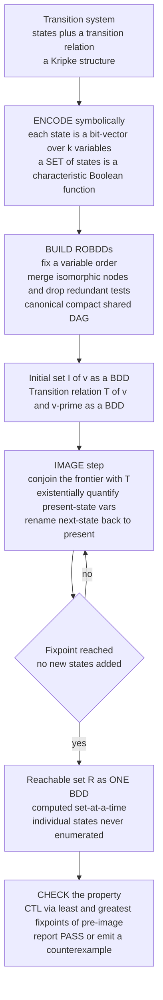

# 🧮 Symbolic Model Checking and BDDs

> [!abstract] TL;DR
> **Explicit-state** model checking explores a system one state at a time and slams into the **state-explosion wall** — a design with 100 bits already has more states than atoms on Earth. **Symbolic model checking** is the breakthrough that sidestepped this entirely: instead of enumerating states, it represents **enormous SETS of states** and the **transition relation** as **Boolean functions** (characteristic functions over the state bits) and manipulates whole sets at once with **Boolean algebra** — *set-at-a-time* exploration. The enabling data structure is the **(Reduced Ordered) Binary Decision Diagram — ROBDD** (Randal **Bryant, 1986**): a **canonical, maximally-shared DAG** for a Boolean function, obtained by fixing a **variable order** and applying two reductions — merge **isomorphic subgraphs** and delete **redundant tests**. Because ROBDDs are canonical, checking **equivalence, satisfiability, or tautology is constant-time**, and they are frequently astonishingly **compact** — but the **variable ORDER is make-or-break** (a good order gives a linear BDD, a bad one explodes exponentially; finding the optimum is **NP-hard**, and some functions like **multipliers** have no small BDD at all). Reachability and full **CTL** are computed as **fixpoints** of the **image** (post) and **pre-image** (pre) operators, iterated as pure BDD operations until they stabilize. This one idea let Ken **McMillan's SMV** verify systems with **10^20 states and beyond**, and it remains the backbone of industrial **hardware verification** (chip equivalence, cache-coherence protocols).

---

## Intuition

**Analogy — describe the beach, don't count the grains of sand.** Suppose someone asks "how many grains of sand are on this beach, and are any of them wet?" You would never pick them up one at a time — you would go mad before the tide came in. Instead you *describe* the sand with a compact rule: "everything below the high-water line is wet." One short **formula** stands in for **billions of grains**, and you can answer questions about the whole beach without ever touching a single grain. **Symbolic model checking** does exactly this with the states of a computer system. A "set of states" — even a set of size `10^20` — is not stored as a list; it is stored as a **Boolean formula** that is *true* precisely on the members of the set (its **characteristic function**). To take a step forward in time, you don't visit each state; you apply an **algebraic operation** to the whole formula and get the formula describing *all* the next states at once.

The catch is that a naive formula (or its truth table) can itself be astronomically large. The **magic ingredient** is the **BDD** — a super-compressed, canonical little diagram for a Boolean function. By fixing an order on the variables and then ruthlessly **sharing** every repeated sub-decision and **skipping** every variable that doesn't matter, a BDD can pack a function over hundreds of variables — a set of `10^20` states — into a few kilobytes. States become formulas, sets become BDDs, and *exploring the system becomes doing algebra on those BDDs until nothing changes* (a **fixpoint**). That conceptual leap is what turned model checking from a classroom toy into the tool that verifies real silicon.

---

## How It Works

### Core Mechanics

**1. Encode states as bit-vectors.** Give the system `k` Boolean state variables `v = (v0, ..., v_{k-1})`. A single state is one assignment; there are up to `2^k` of them. A **set** of states `S` is represented by its **characteristic function** `chi_S(v)`, the Boolean function that is `1` exactly on the members of `S`. The empty set is the constant `0`, the full set is `1`, union is `OR`, intersection is `AND`, complement is `NOT`.

**2. Encode the dynamics as one Boolean relation.** Introduce a *primed* copy `v' = (v0', ..., v_{k-1}')` for the next state. The entire **transition relation** becomes a single Boolean function `T(v, v')` that is `1` exactly when the system may step from `v` to `v'`. Nondeterminism, guards, and concurrency all fold into this one formula.

**3. Store every function as an ROBDD.** A **Binary Decision Diagram** is a rooted DAG. Each internal node tests one variable and has a *low* edge (variable `= 0`) and a *high* edge (variable `= 1`); two terminals are `0` and `1`. Fix a **variable order** and apply the two **reductions**:
- **Redundant-test elimination** — if a node's low and high edges point to the *same* child, the variable is irrelevant *there*; delete the node.
- **Isomorphic-subgraph sharing** — if two nodes test the same variable and have identical low/high children, they compute the same function; keep only one and redirect all references (a **unique table** — a hash table — enforces this on creation).

The result, the **ROBDD**, is **canonical**: for a fixed order, *every* Boolean function has *exactly one* ROBDD. So `f == g` iff they are the **same node** (constant-time!), `f` is a **tautology** iff it is the node `1`, and `f` is **satisfiable** iff it is *not* the node `0`.

**4. Move whole sets with the IMAGE operator.** The set of states reachable in one step from a frontier `R(v)` is the **image**:
`Image(R) = { v' : exists v. R(v) AND T(v, v') }`, then **rename** `v'` back to `v`. Every piece is a BDD operation: conjunction (`AND`), **existential quantification** of the present-state variables (cofactor on `0`, cofactor on `1`, then `OR` — the *relational product*), and a variable relabel. Going backward uses the **pre-image** instead.

**5. Explore by reaching a FIXPOINT.** Start from the initial set `I` and iterate `R_{n+1} = R_n OR Image(R_n)` until `R_{n+1} == R_n`. Canonicity makes the stop test a *pointer comparison*. The result is the **reachable set** — computed set-at-a-time, never touching an individual state. **CTL** properties are computed the same way as **least (EF, EU) and greatest (EG) fixpoints** of pre-image over the BDDs; a property fails exactly when the "bad" set intersects the reachable set, and the fixpoint trace yields a **counterexample**.

### Flow / Architecture



---

## Key Concepts

### Secondary (intuitive core)
- **Truth table vs formula.** A Boolean function can be written as a giant table of `2^n` rows, or captured by a compact *rule*. Symbolic methods always keep the rule, never the table.
- **A set of states = a yes/no test.** "Is state `s` in my set?" is a Boolean question, so a whole set is just a Boolean function that answers it. Union/intersection/complement of sets are `OR`/`AND`/`NOT` of functions.
- **BDD = a shared decision flowchart.** Ask about the variables in a fixed order; wherever two branches lead to the same future, glue them together; wherever a question doesn't change the answer, skip it. What's left is small and unique.

### Undergraduate (the machinery)
- **Shannon expansion.** `f = (NOT x AND f|x=0) OR (x AND f|x=1)`. This recursion, memoized, is exactly how BDD nodes and the **Apply** algorithm are built.
- **Reduced Ordered BDD (ROBDD).** *Ordered* = variables appear in the same order on every path; *Reduced* = the two reductions above. Together they force **canonicity**.
- **Constant-time queries.** Equivalence, tautology, satisfiability, and "is this the empty set?" all collapse to comparing against a single node — the payoff of canonicity.
- **Variable ordering is everything.** The same function can be **linear** in one order and **exponential** in another. The classic witness is `x1·y1 + x2·y2 + ... + xn·yn`: interleaved `x1,y1,x2,y2,...` is linear; all `x`'s then all `y`'s is exponential.
- **Apply and the unique table.** `Apply(op, f, g)` recurses on the top variable of `f` and `g`, memoizes on `(f, g)`, and creates nodes only through the hash-consed **unique table** — pure **memoization** over a **DAG**.

### Graduate (model-checking depth)
- **Image / pre-image as relational products.** `exists v. (R(v) AND T(v,v'))` is computed by BDD conjunction fused with existential quantification; smart schedulers use **conjunctive partitioning** and **early quantification** to keep intermediate BDDs small.
- **Fixpoint characterization of CTL (mu-calculus).** `EF p` and `E[p U q]` are **least fixpoints** (`mu`), `EG p` is a **greatest fixpoint** (`nu`), each a bounded iteration of pre-image over BDDs — Emerson-Clarke-Sistla / Tarski-Knaster.
- **Canonicity buys termination detection for free.** Because equal functions share a node, `R_{n+1} == R_n` is an `O(1)` identity check — the fixpoint is detected instantly.
- **Fundamental limits.** Optimal ordering is **NP-hard** to find; **dynamic reordering** (sifting) helps heuristically. Some functions (integer **multipliers**, hidden-weighted-bit) provably have **exponential** ROBDDs *in every order* — the hard core where symbolic methods stall.
- **Position in the toolbox.** BDD-based symbolic model checking (McMillan's **SMV**, then **NuSMV/nuXmv**) is complete and great for *proving* properties; it complements SAT-based **bounded model checking**, which unrolls the transition relation to a fixed depth and excels at *finding* deep bugs.

---

## Python Demo

```python
"""
Symbolic Model Checking and BDDs  (numpy + matplotlib)
======================================================
(a) A minimal ROBDD package showing the two REDUCTIONS and the
    make-or-break effect of VARIABLE ORDERING on the Bryant function
        f = (x1 AND y1) OR (x2 AND y2) OR ... OR (xn AND yn)
    Interleaved order -> LINEAR BDD; all-x-then-all-y -> EXPONENTIAL.

(b) SYMBOLIC REACHABILITY by fixpoint iteration of the IMAGE operator.
    A transition system is encoded as Boolean functions (BDDs): the
    initial set I(v) and the transition relation T(v, v'). The reachable
    set is grown SET-AT-A-TIME
        R_{n+1} = R_n  OR  rename( exists v. R_n(v) AND T(v, v') )
    until a fixpoint -- individual states are NEVER enumerated.
"""

import numpy as np
import matplotlib.pyplot as plt


class BDD:
    """Minimal Reduced Ordered Binary Decision Diagram package.

    Node ids are ints: 0 = terminal FALSE, 1 = terminal TRUE.
    Internal id -> (level, low, high); 'level' = position of the node's
    variable in the fixed order; edge low = var is 0, high = var is 1.
    The two ROBDD reductions live in mk():
        * redundant-test removal      (low == high -> return that child)
        * isomorphic-subgraph sharing (unique table keyed by the triple)
    Canonicity => two functions are equal IFF they share the same node id.
    """

    def __init__(self, order):
        self.order = list(order)
        self.var_level = {v: i for i, v in enumerate(self.order)}
        self.nvars = len(self.order)
        self.nodes = {}      # id -> (level, low, high)
        self.unique = {}     # (level, low, high) -> id   (the shared table)
        self.next_id = 2

    def mk(self, level, low, high):
        if low == high:                     # redundant test: variable irrelevant here
            return low
        key = (level, low, high)
        node = self.unique.get(key)         # isomorphic subgraph already built?
        if node is not None:
            return node
        node = self.next_id
        self.next_id += 1
        self.nodes[node] = (level, low, high)
        self.unique[key] = node
        return node

    def var(self, name):                    # characteristic function of one variable
        return self.mk(self.var_level[name], 0, 1)

    def _apply(self, op, a, b, cache):      # generic Shannon-recursion + memoization
        if a <= 1 and b <= 1:
            return 1 if op(a, b) else 0
        hit = cache.get((a, b))
        if hit is not None:
            return hit
        la = self.nodes[a][0] if a > 1 else self.nvars
        lb = self.nodes[b][0] if b > 1 else self.nvars
        lvl = min(la, lb)
        a_lo, a_hi = (self.nodes[a][1], self.nodes[a][2]) if la == lvl else (a, a)
        b_lo, b_hi = (self.nodes[b][1], self.nodes[b][2]) if lb == lvl else (b, b)
        res = self.mk(lvl,
                      self._apply(op, a_lo, b_lo, cache),
                      self._apply(op, a_hi, b_hi, cache))
        cache[(a, b)] = res
        return res

    def and_(self, a, b): return self._apply(lambda x, y: x and y, a, b, {})
    def or_(self, a, b):  return self._apply(lambda x, y: x or y,  a, b, {})

    def neg(self, f, memo=None):
        if memo is None: memo = {}
        if f == 0: return 1
        if f == 1: return 0
        hit = memo.get(f)
        if hit is not None: return hit
        lvl, lo, hi = self.nodes[f]
        res = self.mk(lvl, self.neg(lo, memo), self.neg(hi, memo))
        memo[f] = res
        return res

    def cube(self, assignment):             # BDD of a conjunction of literals {name: 0/1}
        res = 1
        for name, bit in assignment.items():
            lit = self.var(name) if bit else self.neg(self.var(name))
            res = self.and_(res, lit)
        return res

    def cofactor(self, f, level, value, memo):   # restrict variable at 'level' to value
        if f <= 1: return f
        lvl, lo, hi = self.nodes[f]
        if lvl > level:                     # that variable is absent below here
            return f
        hit = memo.get((f, value))
        if hit is not None: return hit
        if lvl == level:
            res = lo if value == 0 else hi
        else:
            res = self.mk(lvl,
                          self.cofactor(lo, level, value, memo),
                          self.cofactor(hi, level, value, memo))
        memo[(f, value)] = res
        return res

    def exists(self, f, levels):            # existentially quantify a set of levels
        for lvl in sorted(levels, reverse=True):
            f = self.or_(self.cofactor(f, lvl, 0, {}),
                         self.cofactor(f, lvl, 1, {}))
        return f

    def rename(self, f, level_map, memo=None):    # relabel variable levels
        if memo is None: memo = {}
        if f <= 1: return f
        hit = memo.get(f)
        if hit is not None: return hit
        lvl, lo, hi = self.nodes[f]
        res = self.mk(level_map.get(lvl, lvl),
                      self.rename(lo, level_map, memo),
                      self.rename(hi, level_map, memo))
        memo[f] = res
        return res

    def size(self, root):                   # internal nodes reachable from root
        seen, stack = set(), [root]
        while stack:
            n = stack.pop()
            if n <= 1 or n in seen: continue
            seen.add(n)
            _, lo, hi = self.nodes[n]
            stack.extend((lo, hi))
        return len(seen)


# ----------------------------------------------------------------------
# (a) REDUCTION + VARIABLE ORDERING on  f = OR_i (x_i AND y_i)
# ----------------------------------------------------------------------
def build_bryant(order, n):
    bdd = BDD(order)
    f = 0
    for i in range(1, n + 1):
        f = bdd.or_(f, bdd.and_(bdd.var(f"x{i}"), bdd.var(f"y{i}")))
    return bdd, f

ns = list(range(1, 11))
good_sizes, bad_sizes = [], []
for n in ns:
    good_order = [v for i in range(1, n + 1) for v in (f"x{i}", f"y{i}")]     # interleaved
    bad_order  = [f"x{i}" for i in range(1, n + 1)] + [f"y{i}" for i in range(1, n + 1)]
    bg, fg = build_bryant(good_order, n)
    bb, fb = build_bryant(bad_order, n)
    good_sizes.append(bg.size(fg))
    bad_sizes.append(bb.size(fb))

n0 = 5                                        # reduction headline: table vs BDD
b0, f0 = build_bryant([v for i in range(1, n0 + 1) for v in (f"x{i}", f"y{i}")], n0)
print(f"[reduction] f over {2*n0} vars: truth table = {2**(2*n0)} rows, "
      f"good-order ROBDD = {b0.size(f0)} nodes")
print(f"[ordering ] at n={ns[-1]}: good order {good_sizes[-1]} nodes "
      f"vs bad order {bad_sizes[-1]} nodes")

# ----------------------------------------------------------------------
# (b) SYMBOLIC REACHABILITY by fixpoint of the IMAGE operator
# ----------------------------------------------------------------------
k = 5                                         # 2^k states
N = 1 << k
order = [nm for i in range(k) for nm in (f"v{i}", f"v{i}p")]   # interleaved present/next
bdd = BDD(order)

# de Bruijn-style step: from v you may go to (2v) mod N or (2v+1) mod N.
# The reachable frontier from state 0 DOUBLES each step -> fixpoint in k steps.
T = 0
for v in range(N):
    for succ in ((2 * v) % N, (2 * v + 1) % N):
        a = {}
        for i in range(k):
            a[f"v{i}"]  = (v >> i) & 1
            a[f"v{i}p"] = (succ >> i) & 1
        T = bdd.or_(T, bdd.cube(a))           # transition relation as ONE BDD

I = bdd.cube({f"v{i}": 0 for i in range(k)})  # initial set = {state 0}
present    = [bdd.var_level[f"v{i}"] for i in range(k)]
prime2plain = {bdd.var_level[f"v{i}p"]: bdd.var_level[f"v{i}"] for i in range(k)}

def num_states(root):                          # count members of a present-state set
    cnt = 0
    for m in range(N):
        node = root
        while node > 1:
            lvl, lo, hi = bdd.nodes[node]
            bit = (m >> (lvl // 2)) & 1 if lvl % 2 == 0 else 0   # only present vars matter
            node = hi if bit else lo
        cnt += node
    return cnt

reach = I
sizes = [num_states(reach)]
while True:
    # IMAGE: conjoin frontier with T, quantify present vars, rename next->present
    img = bdd.rename(bdd.exists(bdd.and_(reach, T), present), prime2plain)
    nxt = bdd.or_(reach, img)
    sizes.append(num_states(nxt))
    if nxt == reach:                           # canonical BDDs => equal id means FIXPOINT
        break
    reach = nxt

print(f"[reachable] fixpoint after {len(sizes) - 1} image steps: "
      f"|Reach| = {sizes[-1]} of {N} states, final BDD = {bdd.size(reach)} nodes")

# ----------------------------------------------------------------------
# Plots
# ----------------------------------------------------------------------
fig, (axL, axR) = plt.subplots(1, 2, figsize=(12, 5))

axL.semilogy(ns, good_sizes, "o-", color="teal",
             label="good order (interleaved) - linear")
axL.semilogy(ns, bad_sizes, "s-", color="crimson",
             label="bad order (all x then all y) - exponential")
axL.set_xlabel("n  (number of x_i . y_i terms)")
axL.set_ylabel("ROBDD size (internal nodes, log scale)")
axL.set_title("Variable ordering is make-or-break")
axL.grid(True, which="both", alpha=0.3)
axL.legend()

it = np.arange(len(sizes))
axR.plot(it, sizes, "o-", color="darkorange")
axR.axhline(N, ls="--", color="gray", label=f"all {N} states")
axR.set_xlabel("image-operator iteration")
axR.set_ylabel("|reachable set|  (computed symbolically)")
axR.set_title("Symbolic reachability grows sets to a fixpoint")
axR.grid(True, alpha=0.3)
axR.legend()

plt.tight_layout()
plt.savefig("symbolic_model_checking_bdd_demo.png", dpi=120)
plt.show()
```

**What the demo shows.** The left panel is the whole story of BDDs in one picture: the *identical* Boolean function is **linear** in the interleaved order and **exponential** in the all-`x`-then-all-`y` order — the size curves diverge on a log axis. The console line `truth table = 1024 rows, good-order ROBDD = ~16 nodes` is the **reduction** at work: a table with `2^{2n}` rows collapses to a handful of shared nodes. The right panel runs **pure symbolic reachability** — each point is `|R_n|` after one **image** step (conjoin-quantify-rename, all BDD algebra), and the set doubles every iteration until it hits the fixpoint of all `2^k` states. Not once does the code loop over individual states; it computes with the *sets themselves*.

---

## Real-World Applications

- **Hardware equivalence checking.** Every synthesis and optimization step of a chip must preserve behavior. Comparing the two circuits reduces to `BDD(circuit_A) == BDD(circuit_B)` — a constant-time node comparison thanks to canonicity. This is standard in commercial EDA flows (Synopsys, Cadence).
- **Cache-coherence and bus protocols.** McMillan's original SMV work verified protocols like the **Gigamax** cache coherence and the **Futurebus+** standard, finding real bugs in an IEEE protocol — the "**10^20 states and beyond**" result (Burch, Clarke, McMillan, Dill, Hwang).
- **SMV / NuSMV / nuXmv.** The reference symbolic model checkers. You write a finite-state model plus **CTL/LTL** specs; the tool builds BDDs for `I`, `T`, and each property and evaluates fixpoints. NuSMV/nuXmv remain workhorses in academia and industry.
- **Sequential-circuit and controller verification.** Reachability over the state bits of an FSM (see [[Sequential_Circuits_and_FSMs]]) proves invariants like "no two grants are ever asserted together" without simulating vectors.
- **Beyond verification.** BDDs power **combinatorial counting** (model counting via satcount), **fault-tree analysis** in safety engineering, **regression-test minimization**, and **configuration/product-line** consistency (SAT-style feature models).

---

## Common Pitfalls

- **Confusing symbolic with explicit.** *Symbolic* means you represent **sets of states** as Boolean functions and move **set-at-a-time**; *explicit-state* (SPIN-style) visits states **one-at-a-time**. Symbolic wins on structured, hardware-like state spaces; explicit often wins on irregular software with lots of pointers.
- **Ignoring variable ordering.** The single biggest performance lever. A bad order turns a linear BDD exponential. Interleave related variables (e.g., present/next bits), keep tightly-coupled bits adjacent, and enable **dynamic reordering (sifting)** — but remember optimal ordering is **NP-hard**.
- **Expecting BDDs to always be small.** They are **not** a free lunch. Integer **multipliers**, and hidden-weighted-bit functions, have **exponential** ROBDDs in *every* order. If your relation embeds multiplication, BDDs will blow up — reach for SAT/SMT or abstraction instead.
- **Building a monolithic transition relation.** A single BDD for `T` over all variables can explode. Real tools use **conjunctive/disjunctive partitioning** and **early (conjunction-fused) quantification** to keep the intermediate BDDs of the relational product small.
- **Forgetting canonicity depends on a fixed order.** ROBDDs are canonical only *relative to one order*. Comparing BDDs built under different orders (or different variable maps) is meaningless — normalize first.
- **Treating BDDs as a silver bullet vs bounded model checking.** BDD symbolic MC *proves* properties and gives full reachability, but stalls on some designs; **bounded (SAT) model checking** unrolls `T` to depth `k` and is often far better at *finding* deep counterexamples. Modern flows combine both, plus **abstraction-refinement (CEGAR)**.
- **Mis-encoding existential quantification.** The image needs `exists v. (R AND T)` over the *present* variables, then a **rename** of next-state to present. Quantifying the wrong variable set, or skipping the rename, silently computes the wrong reachable set.

---

## Related Concepts

- [[Propositional_Logic_and_Boolean_Semantics]] — sets of states are **characteristic Boolean functions**; every BDD operation is propositional-logic algebra.
- [[Boolean_Algebra_and_Logic_Gates]] — BDDs are canonical representations of Boolean functions; **Shannon expansion** and gate-level semantics underlie the `Apply` algorithm.
- [[Combinational_Circuits]] — the equivalence-checking target: two combinational circuits are equal iff their ROBDDs are the same node.
- [[Sequential_Circuits_and_FSMs]] — the transition systems (Kripke structures) whose reachable states symbolic model checking computes.
- [[Space_Complexity_and_PSPACE]] — model checking (and reachability) is **PSPACE-complete**; symbolic methods attack the blow-up in practice, not in worst-case complexity.
- [[Binary_Tree_Fundamentals]] — a BDD is a **binary decision *tree* reduced into a shared DAG**; the reductions turn the tree into a compact graph.
- [[Memoization_vs_Tabulation]] — the `Apply` cache and the **unique table** are textbook **memoization** over a DAG, exactly what makes ROBDD operations polynomial in BDD size.
- [[Hash_Table_Fundamentals]] — the **unique table** is a hash table (hash-consing) that enforces maximal sharing and canonicity on node creation.
- [[Topological_Sort]] — BDDs are DAGs; bottom-up (post-order) processing of nodes underlies traversal, satcount, and reduction.
- [[Formal_Methods_Overview]] — where symbolic model checking sits in the broader verification landscape.

*Siblings in this section (prose references):* **Model_Checking_Fundamentals** (the explicit-state baseline and the state-explosion problem), **Linear_and_Branching_Temporal_Logic** (the CTL/LTL specs evaluated by BDD fixpoints), **Bounded_Model_Checking** (the SAT-based complement, better for bug-hunting), **Abstraction_Refinement_and_CEGAR** (how abstraction shrinks the state space symbolic MC must handle), and **SAT_Solving_and_DPLL** (the engine behind bounded model checking).

---

## Review Questions

1. **(Secondary)** Explain in plain terms why representing a set of `10^20` states as a Boolean formula, rather than a list, is what makes symbolic model checking possible. Use the "describe the beach, don't count the grains" idea.
2. **(Secondary/Undergraduate)** State the two reduction rules that turn an ordered binary decision *tree* into an ROBDD, and explain how each one shrinks the diagram.
3. **(Undergraduate)** Why does canonicity of ROBDDs make equivalence checking and tautology testing **constant-time**? What single assumption must hold for this to work?
4. **(Undergraduate)** For `f = x1·y1 + x2·y2 + ... + xn·yn`, sketch why the interleaved order `x1,y1,x2,y2,...` gives an `O(n)` BDD while `x1,...,xn,y1,...,yn` gives an exponential one. What must the BDD "remember" at the boundary between the x's and the y's?
5. **(Undergraduate/Graduate)** Write the image operator `Image(R)` in terms of `AND`, existential quantification, and renaming. Which variables are quantified, and why is the rename step necessary?
6. **(Graduate)** `EF p` is a **least** fixpoint and `EG p` is a **greatest** fixpoint of pre-image. Explain the difference operationally and why each iteration terminates on a finite Kripke structure.
7. **(Graduate — scenario)** Your BDD-based checker runs out of memory on a datapath containing a 32-bit multiplier, but a colleague's bounded model checker finds a bug at depth 12 in seconds. Explain both outcomes in terms of BDD blow-up and the strengths of SAT-based bounded model checking, and describe how CEGAR-style abstraction could rescue the symbolic approach.

---

## Sources

- Randal E. Bryant, "**Graph-Based Algorithms for Boolean Function Manipulation**," *IEEE Transactions on Computers*, C-35(8), 1986 — the ROBDD, canonicity, and Apply.
- J. R. Burch, E. M. Clarke, K. L. McMillan, D. L. Dill, L. J. Hwang, "**Symbolic Model Checking: 10^20 States and Beyond**," *Information and Computation* / LICS 1990 — the breakthrough scaling result.
- Kenneth L. McMillan, "**Symbolic Model Checking**," Kluwer, 1993 — SMV and the systematic symbolic approach.
- E. M. Clarke, O. Grumberg, D. A. Peled, "**Model Checking**," MIT Press, 1999 (2nd ed. Clarke, Henzinger, Veith, Bloem, 2018) — the standard textbook.
- Randal E. Bryant, "**Symbolic Boolean Manipulation with Ordered Binary-Decision Diagrams**," *ACM Computing Surveys*, 24(3), 1992 — accessible survey of BDD theory and practice.

---

#formal-methods #symbolic-model-checking #bdd #boolean-functions #reachability
