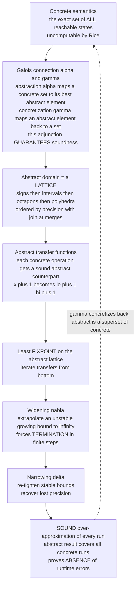

# 🔭 Abstract Interpretation

> [!abstract] TL;DR
> A program's **concrete** (exact) semantics — the precise set of all values every variable can take on every run — is **uncomputable** (Rice's theorem). **Abstract interpretation** (Cousot & Cousot, 1977) is the mathematical theory that makes sound static analysis possible anyway: instead of exact values, run the program over an **abstract domain** where each abstract element denotes a whole **set** of concrete values (its **sign**, its **interval** `[lo, hi]`, "is it null?"), so **one abstract execution soundly covers every concrete execution**. The abstract domain is a **lattice** ordered by precision; an **abstraction** map `α` and a **concretization** map `γ` form a **Galois connection** `(α, γ)` that *provably guarantees soundness* — the abstract answer always **over-approximates** the truth. The analysis result is the **least fixpoint** of abstract transfer functions on that lattice. On tall/infinite lattices a naive fixpoint iteration would never terminate (an interval grows `[0,1], [0,2], [0,3], …`), so a **widening** operator `∇` extrapolates the unstable bound to `+∞` to force **termination** in finitely many steps — trading precision for a guarantee — after which **narrowing** `Δ` recovers some precision. This framework **proves the absence of runtime errors**: the **Astrée** analyzer certified the Airbus A340/A380 fly-by-wire code has **zero** runtime errors. It is the unifying theory beneath dataflow analysis, WCET analysis, and pointer/shape analysis.

---

## Intuition

**Analogy — checking arithmetic by its SIGNS, not its digits.** You are handed a long multiplication, `-4823 × 917`, and asked whether the claimed answer, `+4,422,691`, could possibly be right. Redoing the multiplication exactly is expensive and error-prone. So you don't. You reason in a **coarse abstraction**: a *negative* number times a *positive* number must be **negative**, no matter what the digits are. The claimed answer is positive — so it is **definitely wrong**, and you knew it *without touching a single digit*. You replaced each exact number by just its **sign** — an abstraction that throws away almost everything yet is cheap to compute and still **soundly** catches a whole class of errors.

**Abstract interpretation is the mathematical theory of doing exactly this to programs.** Run the program not over exact values but over an **abstracted universe** — signs, or intervals `[lo, hi]`, or "definitely-null / maybe-null / non-null" — where every abstract value stands for a *set* of possible concrete values. Because each abstract value covers a whole set, a **single abstract run soundly accounts for all real runs at once**. If the abstract run says "at this array access the index is in `[0, 9]`," then it is in `[0, 9]` on *every* real execution — so an access `a[i]` with `a` of length 10 can **never** go out of bounds. That is precisely how a tool proved an Airbus flight-control program has **zero** runtime errors: not by testing a few flights, but by running the program once in an abstract universe that covers *all* flights.

---

## How It Works

### Core Mechanics

1. **The wall: concrete semantics is uncomputable.** The exact "collecting" semantics of a program — for each program point, the *set of all reachable states* — is not computable in general (Rice's theorem: any non-trivial semantic property of programs is undecidable). So you cannot just "compute the answer." You must **approximate** — and to be *useful for verification*, the approximation must be **sound**: it may say "maybe unsafe" when things are fine (a **false alarm**), but it must **never** say "safe" when a real error exists.

2. **Replace values by abstract descriptions.** Pick an **abstract domain** `A`: a set of symbolic descriptions, each denoting a set of concrete values. The **interval** domain describes a set of integers by its tightest enclosing `[lo, hi]`; the **sign** domain by one of `{neg, zero, pos, ...}`; the **nullness** domain by `{null, non-null, maybe}`. Each abstract element `a` concretizes (via `γ`) to the set of concrete values it stands for.

3. **The domain is a LATTICE ordered by precision.** Abstract elements are partially ordered by `⊑` ("is at least as precise / no larger a set than"). `[2,5] ⊑ [0,9]` because `{2..5} ⊆ {0..9}`. This order has a **join** `⊔` (least upper bound — used to *merge* information where control-flow paths meet) and a **bottom** `⊥` (the empty set, "unreachable") and **top** `⊤` ("no information"). Merging two branches `x∈[0,3]` and `x∈[7,9]` gives the join `[0,9]` — sound but coarser.

4. **The GALOIS CONNECTION guarantees soundness.** Two monotone maps tie the concrete and abstract worlds: **abstraction** `α` sends a concrete set to its best abstract description (`α{2,5,7} = [2,7]`), and **concretization** `γ` sends an abstract element back to the concrete set it denotes (`γ[2,7] = {2,3,4,5,6,7}`). They form a **Galois connection** `α(C) ⊑ a  ⟺  C ⊆ γ(a)`: `α` and `γ` are *adjoints*. This single algebraic condition **formally certifies** that computing in the abstract world only ever *over-approximates* the concrete world — soundness is not hoped for, it is **built into the maths**.

5. **Abstract transfer functions mimic each operation.** Every concrete operation gets a **sound abstract counterpart** on the lattice: `x = x + 1` becomes `[lo,hi] ↦ [lo+1, hi+1]`; a guard `x < 100` becomes "meet with `[-∞, 99]`". Soundness of each transfer means `α ∘ f_concrete ⊑ f_abstract ∘ α`: the abstract step never loses a real behaviour.

6. **The result is a LEAST FIXPOINT on the lattice.** The analysis solves `X = F(X)` where `F` bundles the transfers and joins for the whole control-flow graph. By Tarski/Kleene, the answer is the **least fixpoint** — reached by iterating `F` from `⊥` (see [[Domain_Theory_and_Fixed_Points]]). On a *finite-height* lattice this iteration terminates.

7. **WIDENING `∇` forces termination on tall/infinite lattices.** The interval lattice has **infinite ascending chains** (`[0,0] ⊏ [0,1] ⊏ [0,2] ⊏ …`), so plain iteration may **never converge**. The **widening** operator `∇` extrapolates: when a bound keeps *growing* between iterations, it jumps that bound straight to `+∞` (or `-∞`). This over-shoots to a **post-fixpoint** in *finitely many steps* — guaranteeing the **analysis itself terminates** — at the cost of precision.

8. **NARROWING `Δ` claws precision back.** After widening has over-shot (e.g. to `[0,+∞]`), a **narrowing** iteration re-applies the transfers *without* re-inflating stable bounds, tightening `+∞` back down to the real limit imposed by a guard (e.g. `[0,100]`). Narrowing recovers precision that widening threw away, without losing soundness.

### Flow / Architecture



The left-to-right spine is the pipeline: abstract the concrete world through a Galois connection, choose a lattice-shaped domain, give each operation a sound transfer, solve for the least fixpoint, then use widening to *terminate* and narrowing to *sharpen*. The dashed return edge is the soundness promise — concretizing the abstract answer always yields a **superset** of the true reachable states.

---

## Key Concepts

### Secondary (intuitive)
- **Abstract domain** — replace exact values by a cheap description: their **sign**, or an **interval** `[lo, hi]`, or "is it null?". Each description stands for a whole *set* of real values.
- **Sound over-approximation** — the abstract answer is always a *superset* of the truth. If the tool says "index in `[0, 9]`," it really is, on every run — so it can *prove* an array access is safe. It may raise **false alarms** but never misses a real bug.
- **One run covers all runs** — because an abstract value is a whole set, executing the program *once* in the abstract world accounts for *all* concrete executions at once.
- **Widening** — the "stop chasing a moving target" trick: when a bound keeps growing `0, 1, 2, 3, …` and would never settle, jump it to `+∞` so the analysis **terminates**.

### Undergraduate (formal)
- **Lattice `(A, ⊑, ⊔, ⊓, ⊥, ⊤)`** — abstract elements partially ordered by precision, with joins at control-flow merges and a bottom for "unreachable" (partial orders and lattices: [[Set_Theory_and_Relations]]).
- **Galois connection `(α, γ)`** — monotone `α : ℘(C) → A` and `γ : A → ℘(C)` with `α(S) ⊑ a ⟺ S ⊆ γ(a)`. Formally an **adjunction between posets** (`α ⊣ γ`) — see [[Adjunctions]]. This is what *certifies* soundness.
- **Abstract transfer function** — a sound over-approximation `f♯` of each concrete operation: `α(f(S)) ⊑ f♯(α(S))`. Composed over the control-flow graph they define `F`.
- **Least fixpoint semantics** — the analysis result is `lfp F`, computed by Kleene iteration `⊥, F(⊥), F²(⊥), …` (fixpoint theory: [[Domain_Theory_and_Fixed_Points]]).
- **Interval domain (non-relational)** — one interval `[lo, hi]` per variable, independently; cheap, but *cannot* express relations like `x = y`.
- **Widening `∇` and narrowing `Δ`** — `∇` guarantees termination by extrapolating unstable bounds to `±∞` (yielding a post-fixpoint that over-approximates `lfp F`); `Δ` then descends back toward the fixpoint to recover precision.

### Graduate (deep)
- **Soundness theorem.** If every transfer satisfies `α ∘ f ⊑ f♯ ∘ α` (local soundness) and the domain forms a Galois connection, then the computed post-fixpoint `γ`-concretizes to a **superset** of the concrete collecting semantics — global soundness follows *by construction*, no separate proof per program. This is the theorem that makes the framework a *methodology*, not a bag of tricks.
- **The domain hierarchy = precision/cost trade-off.** **Signs** (tiny) ⊏ **intervals** `[lo,hi]` (non-relational, linear) ⊏ **congruences** `x ≡ a (mod m)` ⊏ **octagons** `±x ± y ≤ c` (relational, `O(n²)` per point, `O(n³)` closure) ⊏ **polyhedra** (arbitrary linear inequalities `Σ aᵢxᵢ ≤ c`, relational, *exponential* in the worst case, most precise). **Relational** domains capture inter-variable invariants (`i ≤ n`) that non-relational ones cannot — essential for array-bounds proofs.
- **Widening is not unique and must be *sound* and *terminating*.** A widening operator `∇` must satisfy `a ⊑ a ∇ b`, `b ⊑ a ∇ b`, and *stabilize any ascending chain in finitely many steps*. Engineering choices — **widening with thresholds** (jump to the next relevant constant, e.g. `100`, before `+∞`), **delayed widening** (iterate a few times first), **widening up-to** — trade convergence speed against precision. Widening is applied only at loop heads (a set of **widening points** cutting every cycle in the CFG).
- **Completeness vs soundness.** Abstract interpretation is **sound** but generally **incomplete** — it can raise **false alarms** (a warning with no real error) because the abstraction is lossy. A domain is **`γ`-complete** for a property when no precision is lost for that property. Refining a domain (or a **reduced product** of several domains, which propagates each domain's findings into the others) reduces false alarms.
- **It generalizes and justifies dataflow analysis.** Classical **dataflow analysis** (reaching definitions, live variables, constant propagation) is an abstract interpretation over a *finite* lattice — which is why it needs *no* widening. The framework explains the **MOP vs MFP** gap (meet-over-all-paths vs maximal-fixpoint) and the exactness condition (distributive transfer functions). See [[Control_Flow_and_Data_Flow_Analysis]] and [[Effect_Systems_and_Program_Analysis]].
- **Undecidability is the reason it exists.** By Rice's theorem the concrete property is undecidable ([[The_Halting_Problem_and_Undecidability]]); abstract interpretation trades *exactness* for *decidable, terminating* over-approximation — the principled way to live within the halting-problem's limits.

---

## Python Demo

We build a tiny **interval abstract interpreter** and analyze the archetypal loop `x = 0; while x < N: x = x + 1` (with `N = 100`). **(a) The interval domain** assigns each program point an interval `[lo, hi]`; the abstract transfer for `x = x+1` is `[lo,hi] ↦ [lo+1,hi+1]`, the guard `x < N` is a **meet** with `[-∞, N-1]`, and the loop head **joins** the entry with the incremented body. **(b) Widening for termination:** a plain Kleene iteration makes the upper bound climb `0, 1, 2, 3, …` and would need `N` steps (and *never* converge for an unbounded loop) — so the **widening** operator `∇` jumps the growing bound to `+∞`, forcing the analysis to terminate in a handful of steps; then **narrowing** `Δ` tightens `+∞` back down to the true bound `100`. We plot the upper bound per iteration (no-widening ramp vs widen-then-narrow), and show the converged abstract interval **soundly bounding every concrete value**.

```python
# Abstract interpretation in the INTERVAL domain, on:  x = 0; while x < N: x = x + 1
#   (a) interval transfer functions + join at the loop head,
#   (b) WIDENING to force termination (else the upper bound grows 0,1,2,3,... forever),
#       then NARROWING to recover the precise sound bound.
import numpy as np
import matplotlib.pyplot as plt

NEG, POS = -np.inf, np.inf
BOTTOM = (POS, NEG)                     # empty interval = unreachable

def is_bottom(I): return I[0] > I[1]

def join(A, B):                         # least upper bound (used at merges)
    if is_bottom(A): return B
    if is_bottom(B): return A
    return (min(A[0], B[0]), max(A[1], B[1]))

def meet(A, B):                         # greatest lower bound (used for guards)
    if is_bottom(A) or is_bottom(B): return BOTTOM
    lo, hi = max(A[0], B[0]), min(A[1], B[1])
    return (lo, hi) if lo <= hi else BOTTOM

def add_const(I, c):                    # abstract transfer for  x = x + c
    if is_bottom(I): return BOTTOM
    return (I[0] + c, I[1] + c)

def widen(A, B):                        # standard interval widening  A ∇ B
    if is_bottom(A): return B
    if is_bottom(B): return A
    lo = NEG if B[0] < A[0] else A[0]   # lower bound moving down -> -inf
    hi = POS if B[1] > A[1] else A[1]   # upper bound moving up   -> +inf
    return (lo, hi)

def narrow(A, B):                       # standard interval narrowing  A Δ B
    if is_bottom(A): return B
    if is_bottom(B): return A
    lo = B[0] if A[0] == NEG else A[0]  # only re-tighten unbounded ends
    hi = B[1] if A[1] == POS else A[1]
    return (lo, hi)

N = 100
ENTRY      = (0.0, 0.0)                  # x = 0
GUARD_TRUE = (NEG, N - 1)               # x < N   ==>   x <= N-1

def F(I):                               # abstract semantics AT THE LOOP HEAD
    #   head = entry  JOIN  body(guard AND head) ;  body is x = x + 1
    return join(ENTRY, add_const(meet(I, GUARD_TRUE), 1))

def kleene(widening, steps):            # fixpoint iteration from BOTTOM
    I, seq = BOTTOM, []
    for _ in range(steps):
        Fi   = F(I)
        Inew = widen(I, Fi) if widening else Fi
        seq.append(Inew)
        if Inew == I: break             # reached a (post-)fixpoint
        I = Inew
    return seq, I

def narrowing(I, steps):                # descend from a post-fixpoint
    seq = [I]
    for _ in range(steps):
        Inew = narrow(I, F(I))
        seq.append(Inew)
        if Inew == I: break
        I = Inew
    return seq, I

# --- (b) run the three phases -------------------------------------------------
plain_seq,  _         = kleene(widening=False, steps=30)     # never settles in budget
widen_seq,  post_fix  = kleene(widening=True,  steps=30)     # terminates fast
narrow_seq, tight     = narrowing(post_fix, steps=10)        # recovers precision

plain_hi  = [s[1] for s in plain_seq]                        # 0,1,2,...,29 (still climbing)
widen_hi  = [s[1] for s in widen_seq]                        # 0, +inf, +inf
combo_hi  = widen_hi + [s[1] for s in narrow_seq[1:]]        # ..., 100, 100

print("Interval analysis of:  x = 0;  while x < %d:  x = x + 1" % N)
print("-" * 64)
print("no widening   : upper bound after 30 steps =", plain_hi[-1], "(needs N steps!)")
print("with widening : loop-head interval =", widen_seq[-1], " -> terminates fast")
print("after narrowing: loop-head interval =", tight, " = the tight sound invariant")
print("post-loop (guard false, x >= N):", meet(tight, (N, POS)))

# --- (a) concrete run: every value x takes at the loop head -------------------
def concrete_head_values(N):
    x, vals = 0, [0]
    while x < N:
        x += 1
        vals.append(x)
    return vals                          # 0,1,2,...,N
concrete = concrete_head_values(N)

SENT = N * 1.35                          # display sentinel for +inf
def disp(v): return SENT if np.isinf(v) else v

fig, ax = plt.subplots(1, 2, figsize=(15, 6))

# Panel (a): widening forces termination; narrowing recovers precision
ax[0].plot(range(len(plain_hi)), plain_hi, 'o-', color='#dc2626', lw=2,
           label='Kleene, NO widening: hi = 0,1,2,... (needs N steps / never for unbounded loop)')
xs = range(len(combo_hi))
ax[0].plot(xs, [disp(v) for v in combo_hi], 's-', color='#2563eb', lw=2.4,
           label='with widening then narrowing: converges in a few steps')
for k, v in enumerate(combo_hi):
    if np.isinf(v):
        ax[0].annotate('+inf', (k, SENT), textcoords='offset points', xytext=(4, 6),
                       color='#2563eb', fontsize=10, fontweight='bold')
ax[0].axhline(N, color='#16a34a', ls='--', lw=1.6)
ax[0].text(15.5, N + 3, 'true sound bound  x <= %d' % N, color='#16a34a', fontsize=9)
ax[0].axhline(SENT, color='gray', ls=':', lw=0.8)
ax[0].text(0.2, SENT + 2, 'widening jumps to +inf (post-fixpoint)', color='#2563eb', fontsize=8)
ax[0].set_xlabel('fixpoint iteration')
ax[0].set_ylabel('upper bound of x at the loop head')
ax[0].set_title('(a) WIDENING forces termination, NARROWING recovers precision\n'
                'without widening the interval grows without converging')
ax[0].legend(loc='center right', fontsize=8)
ax[0].set_ylim(-6, SENT + 14)

# Panel (b): the abstract interval soundly over-approximates all concrete values
ax[1].axhspan(tight[0], tight[1], color='#16a34a', alpha=0.15,
              label='abstract invariant  x in [%d, %d]' % (tight[0], tight[1]))
ax[1].scatter(range(len(concrete)), concrete, s=14, color='#dc2626', zorder=3,
              label='concrete values of x reached at the loop head')
ax[1].axhline(tight[0], color='#16a34a', lw=1.4)
ax[1].axhline(tight[1], color='#16a34a', lw=1.4)
ax[1].set_xlabel('concrete loop iteration')
ax[1].set_ylabel('value of x')
ax[1].set_title('(b) SOUND over-approximation\n'
                'one abstract interval covers EVERY concrete value')
ax[1].legend(loc='lower right', fontsize=9)

plt.tight_layout()
plt.savefig('abstract_interpretation_intervals.png', dpi=120)
plt.show()
```

Panel **(a)**: the red curve is a plain fixpoint iteration — the upper bound climbs `0, 1, 2, 3, …`, one per step, and after 30 iterations is *still* climbing; for this loop it would need `N = 100` steps, and for an **unbounded** loop it would **never** converge. The blue curve applies **widening**: the moment the bound is seen growing, `∇` slams it to `+∞`, reaching a post-fixpoint in ~2 steps; **narrowing** then descends `+∞ ↦ 100`, recovering the exact invariant `x ∈ [0, 100]`. Panel **(b)**: that converged abstract interval (green band) **contains every concrete value** `x` ever takes at the loop head (red dots `0 … 100`) — a visual proof of **soundness**: the single abstract answer over-approximates all real behaviour, so any property provable on the band (e.g. "`x` never exceeds 100") holds on *every* run.

---

## Real-World Applications

> **Example — Astrée on Airbus fly-by-wire (the landmark).** **Astrée** (Cousot's group, ENS/AbsInt) is an abstract interpreter specialized for the C used in flight control. Running over a stack of tailored abstract domains — **intervals**, **octagons** (`±x ± y ≤ c`, to relate sensor variables), digital-filter and floating-point-rounding domains — it computes sound invariants at every program point and **proved the total absence of runtime errors** (no overflow, no division-by-zero, no out-of-bounds, no invalid float) in the **Airbus A340 and A380** primary fly-by-wire control software: hundreds of thousands of lines, **zero** false alarms after domain tuning. This is verification, not testing — a guarantee over *all* inputs and all schedules.

- **Absence-of-runtime-error provers.** **Polyspace** (MathWorks), **Astrée** (AbsInt), and **Frama-C/EVA** (CEA) certify safety-critical C/Ada in avionics, automotive (ISO 26262), rail, and nuclear — proving no overflow / null-deref / out-of-bounds. Certification standards (DO-178C, IEC 61508) increasingly accept such proofs as evidence.
- **Scalable industrial analyzers.** **IKOS** (NASA JPL) analyzes flight software; **Infer** (Meta) uses abstract-interpretation-style analyses (including a separation-logic domain) on billions of lines across Facebook/Instagram/WhatsApp; **Sparta** and **CodeQL**-adjacent engines apply the same fixpoint machinery.
- **Timing and resources.** **WCET** (worst-case execution time) tools like **aiT** (AbsInt) use abstract interpretation over cache/pipeline states to bound execution time for hard-real-time certification — again a *sound over-approximation*.
- **Compilers.** Classical **dataflow analyses** (constant propagation, range/nullness analysis, alias analysis) that drive optimization are abstract interpretations over finite lattices — the theory that justifies the compiler's own reasoning ([[Control_Flow_and_Data_Flow_Analysis]]).
- **Smart contracts & security.** Numeric-overflow and taint analyses for EVM bytecode and for finding memory-safety bugs are cast as abstract interpretation over suitable domains.

---

## Common Pitfalls

- **Confusing *sound* with *complete* (treating every warning as a bug).** Abstract interpretation is **sound** (never misses a real error) but **incomplete** (raises **false alarms**), because abstraction is lossy. A warning means "I could not *prove* this safe," not "this is broken." Chasing false alarms as if they were bugs — or, worse, concluding the tool is useless — is the classic misread; the fix is a **more precise domain** (or a reduced product), not distrust.
- **Forgetting widening on an infinite/tall lattice.** The interval (and octagon, polyhedra) lattices have **infinite ascending chains**, so a plain fixpoint iteration **may never terminate**. Widening `∇` at every loop head is *mandatory* for termination — omitting it is not "more precise," it is a **non-terminating analysis**.
- **Widening too eagerly (precision collapse).** Applying `∇` on the very first iteration, or without **thresholds**, often jumps straight to `[-∞, +∞]` and loses everything. Mitigations: **delayed widening** (iterate a few times first), **widening with thresholds** (try the next relevant constant — `100` — before `+∞`), and always follow with **narrowing** to recover.
- **Expecting narrowing to always recover the lost precision.** Narrowing helps but is **not guaranteed** to reach the least fixpoint; some precision lost to widening is gone for good. Domain choice and widening strategy matter more than counting on narrowing to rescue you.
- **Using a non-relational domain for a relational property.** The **interval** domain treats each variable independently and **cannot** express `i ≤ n` or `x = y`. Trying to prove array-bounds safety (`i < length`) with intervals alone fails; you need a **relational** domain — **octagons** or **polyhedra** — at correspondingly higher cost.
- **Picking a domain whose cost you can't pay.** **Polyhedra** are the most precise numeric domain but are **worst-case exponential**; on large code they blow up. The art is choosing the *cheapest* domain (or combination) precise enough for the property — signs/intervals for many checks, octagons where relations matter, polyhedra sparingly.
- **Unsound abstract transfer functions.** If a transfer `f♯` violates `α ∘ f ⊑ f♯ ∘ α` (e.g. mishandling integer overflow wraparound, or a guard's effect), the whole soundness guarantee collapses silently — you get a "proof" that is wrong. Every transfer must be verified sound against the *concrete* semantics.

*(Sibling notes in this Formal Methods section — `Static_Program_Analysis`, `Dataflow_and_Pointer_Analysis`, `Abstraction_Refinement_and_CEGAR`, `Loop_Invariants_and_Termination_Proofs`, and `Symbolic_Execution` — extend these ideas: abstract interpretation is the unifying theory that CEGAR refines, that dataflow/pointer analyses instantiate on finite lattices, that supplies loop invariants automatically, and that trades over-approximation where symbolic execution trades path-explosion.)*

---

## Related Concepts

- [[Domain_Theory_and_Fixed_Points]] — the abstract semantics is a **least fixpoint on a lattice**; Kleene/Tarski fixpoint theory is exactly the engine abstract interpretation iterates (with widening added for termination).
- [[Adjunctions]] — a **Galois connection `α ⊣ γ`** *is* an adjunction between posets; this note names abstract interpretation as its canonical computer-science instance and soundness as the counit inequality.
- [[Control_Flow_and_Data_Flow_Analysis]] — classical **dataflow analysis** is abstract interpretation over a *finite* lattice (hence no widening needed); abstract interpretation generalizes and justifies it (MOP vs MFP).
- [[Effect_Systems_and_Program_Analysis]] — program analyses framed as abstract interpretations (`α ⊣ γ` between concrete and abstract domains) that infer effects, types, and safety properties.
- [[The_Halting_Problem_and_Undecidability]] — **Rice's theorem** makes the concrete semantic property undecidable; abstract interpretation is the principled sound over-approximation that lives within this limit.
- [[Denotational_Semantics]] — the fixpoint (denotational) view of program meaning that abstract interpretation *approximates*; abstract semantics is a computable abstraction of the concrete collecting semantics.
- [[Set_Theory_and_Relations]] — **partial orders and lattices**, the order-theoretic scaffolding (`⊑`, `⊔`, `⊓`, `⊥`, `⊤`) on which every abstract domain is built.

---

## Review Questions

**Secondary.** Using the "check the arithmetic by its **signs**, not its digits" analogy, explain what an *abstract domain* is and why running a program *once* in an abstracted universe can tell you something true about *all* of its runs. Why can such an analysis say "maybe unsafe" when the code is actually fine, but must **never** say "safe" when it is actually broken?

**Undergraduate.** Define a **Galois connection** `(α, γ)` between a concrete powerset and an abstract lattice, and state precisely which condition it guarantees (soundness). For the loop `x = 0; while x < 100: x = x + 1` in the **interval** domain, show that plain fixpoint iteration does not converge quickly, then compute what **widening** produces at the loop head and what **narrowing** recovers. Why does the **interval** domain need widening while a classical constant-propagation dataflow analysis does not?

**Graduate.** Explain why abstract interpretation is **sound but incomplete**, and how a **relational** domain (octagons/polyhedra) proves array-bounds properties that intervals cannot — quantifying the precision/cost trade-off across the domain hierarchy. State the three axioms a **widening** operator must satisfy and explain why widening is only sound because the result is a **post-fixpoint** that over-approximates `lfp F`. Finally, argue from **Rice's theorem** why no *complete* automatic analysis can exist, and describe how the Astrée analyzer nonetheless *proved* zero runtime errors in Airbus flight-control code.

---

## Sources

- Cousot, P. & Cousot, R. (1977). "Abstract Interpretation: A Unified Lattice Model for Static Analysis of Programs by Construction or Approximation of Fixpoints." *POPL '77*, 238–252. — the founding paper: domains, Galois connections, fixpoints.
- Cousot, P. (2021). *Principles of Abstract Interpretation*. MIT Press. — the definitive modern textbook by the founder.
- Miné, A. (2017). "Tutorial on Static Inference of Numeric Invariants by Abstract Interpretation." *Foundations and Trends in Programming Languages* 4(3–4), 120–372. — intervals, octagons, polyhedra, widening/narrowing in depth.
- Blanchet, B., Cousot, P., Cousot, R., Feret, J., Mauborgne, L., Miné, A., Monniaux, D. & Rival, X. (2003). "A Static Analyzer for Large Safety-Critical Software." *PLDI '03*. — the **Astrée** analyzer and the Airbus zero-runtime-error result.
- Rival, X. & Yi, K. (2020). *Introduction to Static Analysis: An Abstract Interpretation Perspective*. MIT Press. — a hands-on modern introduction.

---

#formal-methods #abstract-interpretation #widening #galois-connection #interval-analysis
