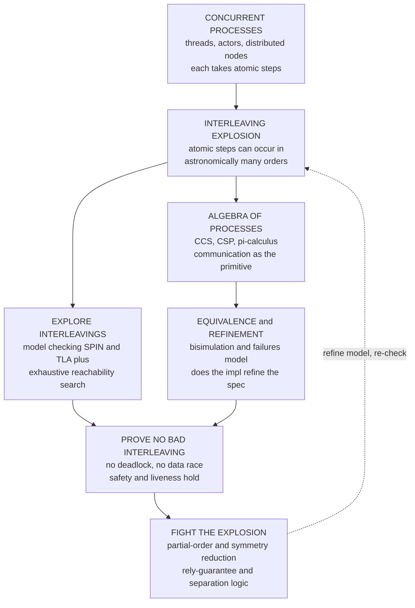

# 🔀 Concurrency Verification and Process Calculi

> [!abstract] TL;DR
> Concurrency bugs are the hardest bugs because they hide in **interleavings** — the astronomically many orders in which the atomic steps of parallel processes can be scheduled. A concurrent program can pass a million test runs and then, on the million-and-first schedule, **deadlock** (everyone waits in a circular chain), **race** (two threads touch shared state unsynchronized), livelock, or violate atomicity. These bugs are **non-deterministic, timing-dependent, and rarely reproducible** — "Heisenbugs" that vanish under a debugger. Concurrency *verification* therefore refuses to sample schedules and instead reasons about **all interleavings at once**. Two complementary weapons: (1) **process calculi** — algebraic languages (**CCS**, Milner; **CSP**, Hoare; the **π-calculus**, Milner–Parrow–Walker, which adds channel *mobility*) that describe communicating processes with a precise **labelled-transition operational semantics**, and whose central equivalences — **bisimulation** and **failures/refinement** (checked automatically by **FDR** for CSP) — answer "are these two systems observably the same, and does my implementation refine its spec?"; and (2) **interleaving model checking** (**SPIN/Promela**, **TLA+/TLC**) that exhaustively searches the reachable state graph and fights the **state-space explosion** with **partial-order reduction** and **symmetry reduction**. For *compositional* proofs — verifying one thread without enumerating the others — we use **rely-guarantee** reasoning and **concurrent separation logic** (ownership and resource transfer), and the correctness criterion for concurrent data structures is **linearizability**. This is the verification-focused companion to the PLT note [[Concurrency_and_Process_Calculi]], and the theory Amazon leans on when it TLA+-models S3 and DynamoDB.

---

## Intuition

**Analogy — two cooks and the last pan.** Picture two cooks sharing one kitchen. A thousand nights in a row they produce a flawless service: one reaches for the pan, the other waits, they hand off cleanly, dinner goes out. Then on the thousand-and-first night, by pure timing, **both reach for the last pan at the exact same instant** — each grabs one handle, neither will let go, and the whole kitchen grinds to a halt. Nothing about *either cook* changed. What changed was the **order** in which their independent actions happened to line up. That is a concurrency bug in miniature: the fault is not in any single process but in a particular **interleaving** of the processes' steps — and because there are astronomically many possible interleavings, the bad one hides for a very long time and strikes rarely and unpredictably. You cannot find it by watching one cook; you cannot find it reliably by running the kitchen more nights (testing). You can only find it by reasoning about **every possible order at once**.

That is exactly what concurrency verification does. Where testing runs *some* schedules and hopes, verification asks: over the **entire space of interleavings**, is there *any* order that deadlocks, that lets both cooks into the critical section, that loses an update? **Process calculi** give us an *algebra of communicating processes* — a notation precise enough to write the kitchen down and prove that no interleaving ever wedges — while **model checking** mechanically explores the interleaving graph and hands back the offending schedule as a **counterexample**. The shift, exactly as in sequential [[Modal_and_Temporal_Logic|temporal reasoning]], is from *"did it work the times we tried?"* to *"can it ever go wrong?"*

---

## How It Works

### Core Mechanics

**1. Why concurrency is hard — the interleaving explosion.** Model a concurrent system as processes that each take **atomic steps** and may touch shared state or exchange messages. A single global execution is one **interleaving** — a merge of the processes' step-sequences. For `n` processes of `m` atomic steps each, the number of distinct interleavings is the multinomial `(n·m)! / (m!)ⁿ`, which is already **34,650** for `n=2, m=4` steps and explodes past astronomical for a handful of threads. Concurrency bugs live somewhere in that space: a **data race** (two processes access shared memory concurrently with at least one write, unsynchronized), a **deadlock** (a reachable state where every process is blocked waiting on a resource another holds — a *circular wait* with no enabled transition), a **livelock** (busy but making no progress), or an **atomicity/ordering violation**. They are **non-deterministic** and **timing-dependent**, so they slip past tests and are dubbed **Heisenbugs**. Verification must therefore quantify over *all* interleavings, not sample them.

**2. Process calculi — an algebra of communicating processes.** Rather than shared memory, process calculi make **communication** the primitive and give each process an **operational semantics** as a **labelled transition system** (LTS): a graph whose edges `P --α--> P'` say "process `P` performs observable action `α` and becomes `P'`." The three canonical calculi:
   - **CCS** (Milner) — processes synchronize on **complementary actions** `a` and `ā`; a matched pair fires a silent internal step `τ`. The minimal algebra of synchronization.
   - **CSP** (Hoare) — communication over named **channels/events** with **external choice** (environment decides) versus **internal choice** (process decides), interpreted in the **failures–divergences** model. CSP's crucial verification handle is **refinement**, checked automatically by the **FDR** tool.
   - **π-calculus** (Milner–Parrow–Walker) — CCS plus **mobility**: channel *names themselves* can be sent as messages, so the communication topology reconfigures at runtime, letting you model dynamic networks, session delegation, and security protocols.

**3. Equivalence and refinement — when are two systems "the same"?** Because a concurrent system's meaning is its *behaviour*, not a return value, equality is behavioural.
   - **Bisimulation** is the finest, "right" equivalence, and it is **co-inductive** (a [[F_Coalgebras_and_Coinduction|coalgebraic]] notion): a relation `R` is a bisimulation if whenever `P R Q`, every step of `P` can be **matched** by a step of `Q` landing back in `R`, and symmetrically. **Trace equivalence** (same set of action sequences) is strictly weaker — it cannot see *when* a choice is committed, so it wrongly equates a vending machine that offers "tea-or-coffee then commits" with one that "commits first, then offers one." **Weak** bisimulation additionally hides internal `τ` steps.
   - **Refinement** flips the question to "does my **implementation** refine my **specification**?" In CSP this is **trace/failures refinement** `Spec ⊑ Impl`, decided automatically by **FDR** — the workhorse of industrial CSP verification.

**4. Interleaving model checking — search the whole graph.** Build the product LTS of all processes and **exhaustively explore** every reachable interleaving, checking each state against a property. **Safety** ("never two in the critical section," "no deadlock") is **reachability** — is any bad state reachable? **Liveness** ("every request eventually served") is **cycle detection** under fairness. **SPIN** (with the **Promela** language) does explicit-state, on-the-fly LTL checking of asynchronous protocols; **TLA+** with the **TLC** checker specifies and checks distributed algorithms. Both drown in the **state-space explosion**, tamed by **partial-order reduction** (independent, commuting interleavings are explored once) and **symmetry reduction** (identical processes collapsed).

**5. Compositional proof — verify a thread without its neighbours.** Enumeration does not scale, so we prove **modularly**: **rely-guarantee** reasoning annotates each thread with what it *relies* on the environment to preserve and what it *guarantees* in return, so threads are verified in isolation and composed. **Concurrent separation logic** goes further with **ownership**: a piece of heap is owned by one thread at a time and **transferred** on synchronization, so disjoint threads are reasoned about with the disjoint-conjunction `*` — the concurrency face of separation-logic heap reasoning. The correctness criterion for a concurrent data structure is **linearizability**: every operation *appears* to take effect atomically at some instant between its call and return, letting clients pretend the structure is sequential. Underneath it all sits the **memory model** and the **happens-before** relation that decide which reorderings hardware and compilers may perform.

### Flow / Architecture



---

## Key Concepts

### Secondary (intuitive core)
- **Interleaving.** One possible order in which the steps of parallel processes are shuffled together; the bug hides in a *bad* order, not in any one process.
- **Deadlock.** Everyone waits on everyone else in a circle, so nothing moves — the two cooks each holding one handle of the last pan.
- **Data race.** Two processes touch the same shared thing at once without coordinating, so the result depends on luck.
- **Heisenbug.** A concurrency bug that is rare, timing-dependent, and vanishes when you try to observe it — why testing is not enough.
- **Process calculus.** A tiny, precise language for writing down "who talks to whom, and in what order," so we can *reason* instead of guess.

### Undergraduate (formal machinery)
- **Labelled transition system (LTS).** States are processes; edges `P --α--> P'` are observable actions. The operational semantics of CCS/CSP/π is given this way.
- **The three calculi.** **CCS** (synchronize on complementary actions `a`/`ā`), **CSP** (channels, external vs internal choice, failures–divergences, refinement via **FDR**), **π-calculus** (mobility — send channel names).
- **Bisimulation vs trace equivalence.** Bisimulation matches each other's steps *co-inductively* and sees *where* choices happen; trace equivalence only compares action sequences and is too coarse. **Weak** bisimulation hides `τ`.
- **Refinement checking.** `Spec ⊑ Impl` in the trace/failures model — the automated correctness question FDR answers.
- **Safety vs liveness.** Safety = reachability of a bad state (deadlock, both-in-critical-section); liveness = a bad cycle under fairness. SPIN/Promela and TLA+/TLC search these.
- **Linearizability.** Each operation appears atomic at a single **linearization point** between its invocation and response — the correctness criterion for lock-free stacks, queues, maps.

### Graduate (the hard subtleties)
- **State-space explosion, quantitatively.** `(n·m)! / (m!)ⁿ` interleavings for `n` processes of `m` steps; **partial-order reduction** exploits independence (commuting transitions explored once), **symmetry reduction** quotients by process-permutation automorphisms — both provably preserve the properties checked.
- **Coalgebra of bisimulation.** Bisimilarity is the greatest fixpoint of a monotone functor on relations — an [[F_Coalgebras_and_Coinduction|F-coalgebraic]] final-semantics story; bisimilarity is a **congruence**, which is what licenses substituting one process for an equivalent one inside any context.
- **Compositional reasoning.** **Rely-guarantee** (Jones) decomposes a parallel proof into per-thread rely/guarantee pairs; **concurrent separation logic** (O'Hearn, Brookes) adds ownership-transferring resource invariants so disjoint threads compose via `*`. Modern variants (Iris, RGSep) unify both.
- **Weak memory.** Under TSO/ARM/C11 the executions are not simple interleavings of a sequential store — verification reasons over **partial orders** with an axiomatic **happens-before** and needs dedicated model checkers (e.g. `herd`, GenMC).
- **Impossibility and liveness in distributed settings.** Concurrency verification of protocols meets FLP-style impossibility and the safety/liveness split; TLA+ specifies both, and refinement mappings relate abstract to concrete algorithms — see [[The_Consensus_Problem]] and [[Linearizability_and_Sequential_Consistency]].

---

## Python Demo

We verify concurrency the way a real checker does: build two shared-state systems as **transition systems** and **exhaustively explore every interleaving** of their atomic steps. System 1 is a **non-atomic test-and-set lock** — the read-then-enter gap is a **TOCTOU data race**, and the search finds a schedule where **both processes enter the critical section**. System 2 acquires **two locks in opposite order** — the search finds a reachable **deadlock**: a state with *no enabled transition* where each process waits on the lock the other holds. In both cases we print and highlight the **counterexample interleaving** (the offending schedule). Part (b) plots the **interleaving explosion** `(n·m)!/(m!)ⁿ` versus processes and versus steps — the combinatorial blow-up that motivates **partial-order reduction**. Pure `numpy` + `matplotlib`.

```python
# Concurrency verification by EXHAUSTIVE interleaving search.
# (a) Two shared-state systems as transition systems; explore EVERY interleaving:
#       - a DATA RACE  : both processes in the critical section (non-atomic test-and-set)
#       - a DEADLOCK   : a reachable state with NO enabled step (two locks, opposite order)
#     Print + highlight the counterexample interleaving (the offending schedule).
# (b) INTERLEAVING EXPLOSION: #interleavings = (n*m)! / (m!)^n  vs processes and vs steps,
#     the combinatorial blow-up that motivates partial-order reduction.
import numpy as np
import matplotlib.pyplot as plt
from collections import deque
from math import factorial

# ---------- generic exhaustive interleaving explorer ------------------------
def explore(procs, keys, store0):
    """procs: list of processes; each process is a list of (label, guard, effect).
       guard(store_dict)->bool ;  effect(store_dict)->new store_dict.
       A global state = (program-counter tuple, store tuple aligned to `keys`).
       We do BFS over the FULL product of interleavings and classify terminals."""
    d2s = lambda d: tuple(d[k] for k in keys)
    s2d = lambda s: dict(zip(keys, s))
    start = (tuple(0 for _ in procs), d2s(store0))
    seen, edges, parent, order = {start}, [], {start: None}, [start]
    deadlocks, terminals = set(), set()
    q = deque([start])
    while q:
        st = q.popleft()
        pcs, store = st
        d = s2d(store)
        enabled = []
        for i, proc in enumerate(procs):
            pc = pcs[i]
            if pc >= len(proc):                      # process i already finished
                continue
            label, guard, effect = proc[pc]
            if guard(d):                             # this atomic step is enabled
                npcs = list(pcs); npcs[i] += 1
                nst = (tuple(npcs), d2s(effect(d)))
                enabled.append((f"P{i}.{label}", nst))
        if not enabled:                              # nobody can move: terminal
            done = all(pcs[i] >= len(procs[i]) for i in range(len(procs)))
            (terminals if done else deadlocks).add(st)   # all finished  vs  STUCK
        for lab, nst in enabled:
            edges.append((st, lab, nst))
            if nst not in seen:
                seen.add(nst); parent[nst] = (st, lab); order.append(nst); q.append(nst)
    return start, seen, edges, deadlocks, terminals, parent, order

def shortest_trace(parent, target):
    """Reconstruct the schedule (sequence of labels + states) from start to target."""
    steps, s = [], target
    while parent[s] is not None:
        prev, lab = parent[s]
        steps.append((lab, s)); s = prev
    steps.append(("<init>", s))
    return steps[::-1]

def first_bad(order, keys, is_bad):
    s2d = lambda s: dict(zip(keys, s))
    for st in order:                                 # BFS order => shortest witness first
        if is_bad(s2d(st[1])):
            return st
    return None

# ---------- system 1: DATA RACE -- non-atomic test-and-set lock (TOCTOU) -----
# Each process: (1) READ the lock into a private snapshot,
#               (2) if the SNAPSHOT was free, ENTER the critical section,
#               (3) LEAVE.  read-then-enter is NOT atomic  ->  both can enter.
RKEYS = ["lock", "r0", "r1", "cs0", "cs1"]
def race_proc(i):
    r, cs = f"r{i}", f"cs{i}"
    return [
        ("read",  lambda d: True,           lambda d, r=r:  {**d, r: d["lock"]}),
        ("enter", lambda d, r=r: d[r] == 0, lambda d, cs=cs: {**d, "lock": 1, cs: 1}),
        ("leave", lambda d: True,           lambda d, cs=cs: {**d, "lock": 0, cs: 0}),
    ]
RACE = [race_proc(0), race_proc(1)]
race_store0 = {"lock": 0, "r0": 0, "r1": 0, "cs0": 0, "cs1": 0}
race_bad = lambda d: d["cs0"] == 1 and d["cs1"] == 1     # mutual-exclusion violated

# ---------- system 2: DEADLOCK -- two locks acquired in OPPOSITE order --------
# 0 = free, 1 = held by P0, 2 = held by P1.  P0 wants A then B; P1 wants B then A.
DKEYS = ["A", "B"]
DEADLK = [
    [("lockA", lambda d: d["A"] == 0, lambda d: {**d, "A": 1}),
     ("lockB", lambda d: d["B"] == 0, lambda d: {**d, "B": 1}),
     ("freeB", lambda d: True,        lambda d: {**d, "B": 0}),
     ("freeA", lambda d: True,        lambda d: {**d, "A": 0})],
    [("lockB", lambda d: d["B"] == 0, lambda d: {**d, "B": 2}),
     ("lockA", lambda d: d["A"] == 0, lambda d: {**d, "A": 2}),
     ("freeA", lambda d: True,        lambda d: {**d, "A": 0}),
     ("freeB", lambda d: True,        lambda d: {**d, "B": 0})],
]
deadlk_store0 = {"A": 0, "B": 0}

# ---------- run both verifications ------------------------------------------
rs, rstates, redges, rdead, rterm, rpar, rorder = explore(RACE, RKEYS, race_store0)
ds, dstates, dedges, ddead, dterm, dpar, dorder = explore(DEADLK, DKEYS, deadlk_store0)

race_state = first_bad(rorder, RKEYS, race_bad)
race_trace = shortest_trace(rpar, race_state)
dead_state = min(ddead, key=lambda st: len(shortest_trace(dpar, st)))
dead_trace = shortest_trace(dpar, dead_state)

print("=== Exhaustive interleaving verification ===")
print(f"RACE system   : reachable states = {len(rstates):3d}   "
      f"mutual-exclusion violated = {race_state is not None}")
print("  counterexample schedule (BOTH reach the critical section):")
for lab, st in race_trace:
    print(f"    {lab:10s} -> pcs={st[0]}  store={dict(zip(RKEYS, st[1]))}")
print(f"DEADLOCK sys  : reachable states = {len(dstates):3d}   deadlocks found = {len(ddead)}")
print("  counterexample schedule (circular wait, NO step enabled at the end):")
for lab, st in dead_trace:
    print(f"    {lab:10s} -> pcs={st[0]}  store={dict(zip(DKEYS, st[1]))}")

# ---------- (b) interleaving explosion --------------------------------------
def n_interleavings(n, m):
    """Distinct interleavings of n processes with m atomic steps each."""
    return factorial(n * m) // (factorial(m) ** n)

n_vals = np.arange(1, 9);  m_fixed = 3
inter_vs_n = np.array([n_interleavings(n, m_fixed) for n in n_vals], dtype=float)
m_vals = np.arange(1, 9);  n_fixed = 3
inter_vs_m = np.array([n_interleavings(n_fixed, m) for m in m_vals], dtype=float)

# ============================== visualization ==============================
fig, axes = plt.subplots(2, 2, figsize=(15, 11))
(axD, axR), (axN, axM) = axes

def draw_graph(ax, start, states, edges, bad_set, trace, title):
    """Lay states out by interleaving depth = total atomic steps taken; highlight
       the counterexample path in red and bad/deadlock states in crimson."""
    lvl = {}
    for st in states:
        lvl.setdefault(sum(st[0]), []).append(st)
    pos = {}
    for L, grp in lvl.items():
        grp = sorted(grp)
        for k, st in enumerate(grp):
            pos[st] = (L, k - (len(grp) - 1) / 2.0)
    tstates = [st for _, st in trace]
    tedges = set(zip(tstates[:-1], tstates[1:]))
    for s, _, t in edges:
        hot = (s, t) in tedges
        (x1, y1), (x2, y2) = pos[s], pos[t]
        ax.annotate("", xy=(x2, y2), xytext=(x1, y1),
                    arrowprops=dict(arrowstyle="-|>",
                                    color="crimson" if hot else "0.8",
                                    lw=2.4 if hot else 0.8,
                                    alpha=1.0 if hot else 0.5,
                                    shrinkA=8, shrinkB=8,
                                    zorder=3 if hot else 1))
    for st, (x, y) in pos.items():
        if   st in bad_set:   c = "crimson"
        elif st == start:     c = "seagreen"
        elif st in tstates:   c = "orange"
        else:                 c = "steelblue"
        ax.scatter([x], [y], s=230, color=c, edgecolors="black", linewidths=0.6, zorder=4)
    ax.set_title(title, fontsize=10)
    ax.set_xlabel("interleaving depth = total atomic steps taken")
    ax.set_yticks([])
    for sp in ("top", "right", "left"):
        ax.spines[sp].set_visible(False)

draw_graph(axD, ds, dstates, dedges, ddead, dead_trace,
           "DEADLOCK: two locks in OPPOSITE order\n"
           "red path = schedule into a circular wait (crimson = stuck state)")
draw_graph(axR, rs, rstates, redges, {race_state}, race_trace,
           "DATA RACE: non-atomic test-and-set lock\n"
           "red path = schedule where BOTH enter the critical section")

axN.semilogy(n_vals, inter_vs_n, "o-", color="crimson", lw=2)
for x, y in zip(n_vals, inter_vs_n):
    axN.annotate(f"{int(y):,}", (x, y), textcoords="offset points",
                 xytext=(0, 7), ha="center", fontsize=7)
axN.set_title(f"INTERLEAVING EXPLOSION vs processes  (m={m_fixed} steps each)\n"
              r"$(n\,m)!\,/\,(m!)^{\,n}$  --  motivates partial-order reduction", fontsize=10)
axN.set_xlabel("number of concurrent processes  n")
axN.set_ylabel("distinct interleavings (log scale)")
axN.grid(True, which="both", ls=":", alpha=0.5)

axM.semilogy(m_vals, inter_vs_m, "s-", color="darkorange", lw=2)
for x, y in zip(m_vals, inter_vs_m):
    axM.annotate(f"{int(y):,}", (x, y), textcoords="offset points",
                 xytext=(0, 7), ha="center", fontsize=7)
axM.set_title(f"INTERLEAVING EXPLOSION vs steps  (n={n_fixed} processes)\n"
              "even a few atomic steps per thread is astronomically many orders", fontsize=10)
axM.set_xlabel("atomic steps per process  m")
axM.set_ylabel("distinct interleavings (log scale)")
axM.grid(True, which="both", ls=":", alpha=0.5)

fig.suptitle("Concurrency verification: exhaustively searching interleavings for races and "
             "deadlocks, and the explosion that makes it hard", fontsize=13)
fig.tight_layout(rect=[0, 0, 1, 0.96])
fig.savefig("concurrency_verification.png", dpi=130, bbox_inches="tight")
print("\nsaved figure -> concurrency_verification.png")
```

**What the run shows.** The race checker explores every interleaving of the two three-step processes and returns the schedule `P0.read, P1.read, P0.enter, P1.enter` — **both** read the lock as free *before* either writes it, then both enter — a textbook TOCTOU **data race** that no single test schedule is guaranteed to hit. The deadlock checker finds a reachable state `P0.lockA, P1.lockB` from which **no transition is enabled**: `P0` blocks on `lockB` (held by `P1`), `P1` blocks on `lockA` (held by `P0`) — a **circular wait**, the two-cooks-one-pan deadlock, proven reachable by exhaustive search rather than luck. The left plots draw each interleaving graph with the counterexample path in red and the bad/stuck states in crimson. The right plots then show *why* this is the exception rather than the rule: the number of interleavings `(n·m)!/(m!)ⁿ` climbs off the top of the log axis within a handful of processes or steps — the explosion that **partial-order** and **symmetry reduction** exist to fight, and that pushes real verification toward compositional **rely-guarantee** and **concurrent separation logic** proofs.

---

## Real-World Applications

> **Amazon Web Services runs TLA+ on its most critical concurrency.** AWS engineers wrote **TLA+** specifications of S3, DynamoDB, EBS, and internal replication/consensus protocols and used the **TLC** model checker to exhaustively explore interleavings *before* implementation — catching deep design bugs (subtle races in replication, a 35-step counterexample in a locking protocol) that were "impossible to find by any other means" and would have been near-unreproducible in production. This is [[Formal_Verification_TLA_Plus|TLA+]] applied exactly as this note describes: quantify over all interleavings, get a counterexample.

- **SPIN in mission-critical software.** Holzmann's **SPIN** (explicit-state, Promela, on-the-fly LTL, **partial-order reduction**) verified flight and mission software for NASA's **Mars Pathfinder**, **Deep Space 1**, and the **Cassini** probe, plus telephone call-processing at Bell Labs — finding priority-inversion and interleaving defects that testing missed.
- **CSP and FDR for hardware/protocols.** Roscoe's **FDR** refinement checker verified the **T9000 transputer's virtual channel processor**, cache-coherence and security protocols, by proving `Spec ⊑ Impl` in the failures–divergences model — refinement checking productized.
- **Linearizable concurrent data structures.** The correctness of lock-free stacks, queues (Michael–Scott), and concurrent maps in `java.util.concurrent` and the C++ standard library is stated and proven as **linearizability**; tools like **Lincheck** and **CDSChecker** exhaustively test/verify these against a sequential specification.
- **Weak-memory verification.** The **C11/C++11** and **RISC-V/ARM** memory models were formalized and checked with tools (`herd`, **GenMC**, RCMC) that reason over happens-before partial orders — verification of the reorderings hardware and compilers may legally perform.
- **Session-typed and verified protocols.** The applied **π-calculus** with **ProVerif** verifies cryptographic protocols; multiparty session types (Scribble) generate deadlock-free communication code — process-calculus verification shipped as a developer tool.

---

## Common Pitfalls

- **Trusting tests to find concurrency bugs.** **Data races, deadlock, livelock, and atomicity/ordering violations** live in specific **interleavings**; the schedule space is exponential and non-deterministic, so a passing test suite certifies nothing about the schedules you didn't hit. These are **Heisenbugs** — often gone under a debugger. Verification quantifies over *all* interleavings; testing samples them.
- **Reaching for shared-memory reasoning when process algebra is cleaner.** **Process calculi** (CCS synchronization, CSP channels/refinement, π-calculus mobility) give a **formal operational semantics** in which "who can communicate next" is explicit; forcing every concurrent argument into locks-and-flags often hides the very interleavings a channel model makes obvious.
- **Using trace equivalence where you need bisimulation.** Two systems with identical trace sets can still be told apart by an environment that observes **when a choice is committed** (the tea-or-coffee machine). If your correctness argument lets the environment interact *adaptively*, you need **bisimulation** or **failures** equivalence, not trace inclusion — and **refinement** (FDR) is the tool that decides it.
- **Ignoring the state-space explosion until it kills the checker.** Interleavings grow as `(n·m)!/(m!)ⁿ`; naive enumeration exhausts memory fast. Design for it: **partial-order reduction** (explore commuting interleavings once), **symmetry reduction** (collapse identical processes), and symbolic/bounded methods — not as a rescue but as the plan.
- **Proving each thread in isolation without a discipline.** You cannot soundly verify a thread while pretending the others don't interfere. Use a **compositional** method: **rely-guarantee** (state what you rely on and guarantee) or **concurrent separation logic** (own the heap you touch and *transfer* ownership on synchronization). Ad-hoc "it's probably fine in parallel" is where interference bugs enter.
- **Assuming sequential consistency under a weak memory model.** Real hardware and compilers reorder memory operations; "it works if steps interleave atomically" can be false when the memory model permits reorderings the interleaving model forbids. Reason with the actual **happens-before**/memory model, and verify **linearizability** for shared data structures rather than assuming atomicity.
- **Confusing safety with liveness.** "No deadlock / no two-in-critical-section" is **safety** (reachability of a bad state). "Every request is eventually served" is **liveness** (a bad cycle under fairness) and needs *fairness assumptions* and cycle detection — a bare invariant check proves nothing about progress.

---

## Related Concepts

- [[Concurrency_and_Process_Calculi]] — the PLT theory companion to this note: the language design and metatheory of CCS/CSP/π and session types, of which this is the *verification-focused* treatment (bisimulation/refinement/model checking against real bugs).
- [[Process_Synchronization_and_Race_Conditions]] — the OS treatment of the exact **data-race** hazard the interleaving explorer detects; critical sections and the need for mutual exclusion.
- [[Deadlocks_Detection_and_Avoidance]] — the OS four-conditions/resource-ordering theory of the **deadlock** this note proves reachable by exhaustive search; lock ordering is the fix.
- [[Locks_Semaphores_and_Monitors]] — the synchronization primitives whose *correct use* concurrency verification certifies and whose *misuse* produces the counterexamples here.
- [[Memory_Consistency_and_Concurrent_Data_Structures]] — weak memory models, happens-before, and **linearizability** — the correctness criterion for the concurrent structures this note verifies.
- [[Threads_and_Concurrency_Models]] — where CSP channels, actors, and shared-memory threads sit as concrete realizations of the abstract processes here.
- [[Formal_Verification_TLA_Plus]] — interleaving model checking applied to distributed algorithms; TLC exhaustively checks TLA+ specs, as AWS does for S3/DynamoDB.
- [[Linearizability_and_Sequential_Consistency]] — the consistency/correctness criteria for concurrent objects that this verification targets, distinguishing "appears atomic" from stronger/weaker guarantees.
- [[The_Consensus_Problem]] — a flagship concurrent/distributed protocol whose safety and liveness are verified with exactly these techniques (and bounded by FLP-style impossibility).
- [[Logical_Clocks_and_Happens_Before]] — the causal **happens-before** order underlying both memory-model reasoning and distributed interleaving analysis.
- [[Distributed_Mutual_Exclusion]] — the distributed analogue of the critical-section problem whose protocols are model-checked for safety and deadlock-freedom.
- [[Modal_and_Temporal_Logic]] — the LTL/CTL property language in which "no deadlock" (safety) and "eventually served" (liveness) are stated for model checking.
- [[F_Coalgebras_and_Coinduction]] — the categorical foundation of **bisimulation**: co-induction and final coalgebras give the behavioural equivalence its precise, greatest-fixpoint meaning.

*Siblings in the Formal Methods vault, referenced here in prose: **Model_Checking_Fundamentals** (the exhaustive state-search engine this note applies to concurrency), **Separation_Logic_and_Heap_Reasoning** (the sequential heap logic that **concurrent separation logic** extends with ownership transfer), **Protocol_and_Distributed_System_Verification** (the distributed-protocol face of these techniques), **Linear_and_Branching_Temporal_Logic** (the LTL/CTL properties checked over interleavings), and **Static_Program_Analysis** (abstraction that under-approximates the interleaving space to scale).*

---

## Review Questions

1. **(Secondary)** Using the "two cooks and the last pan" analogy, explain why a concurrent program can pass a million tests and still fail, and why finding the bug requires reasoning about *all* interleavings rather than running the program more times. What everyday name do we give such rare, timing-dependent bugs?
2. **(Undergraduate)** Distinguish a **data race** from a **deadlock** using the two systems in the demo. (a) Give the exact counterexample interleaving for each. (b) For the deadlock, name the property being violated and explain why the stuck state has *no enabled transition*. (c) State one design change to each system that eliminates the bug, and say which of *safety* or *liveness* each fix concerns.
3. **(Undergraduate)** Two systems have the same set of traces but a user can tell them apart. Give such a pair (e.g. a vending machine), explain why **trace equivalence** equates them, and show how **bisimulation** distinguishes them. Why does CSP-style **refinement checking** (FDR) need failures, not just traces?
4. **(Graduate / trade-off)** The interleaving count is `(n·m)!/(m!)ⁿ`. (a) Explain quantitatively why explicit model checking hits a wall. (b) Contrast **partial-order reduction** and **symmetry reduction** — one changes the *set of interleavings explored*, the other the *set of states* — and state what each must preserve to stay sound. (c) When would you abandon enumeration entirely for a **compositional** proof, and what do **rely-guarantee** and **concurrent separation logic** each contribute?
5. **(Graduate / synthesis)** You must certify a lock-free concurrent queue. (a) Why is **linearizability** the right correctness criterion, and what is a *linearization point*? (b) Sketch how you would verify it — a model checker over interleavings versus a concurrent-separation-logic proof — and the trade-offs. (c) How does a **weak memory model** complicate the picture, and why is "assume atomic interleaving" unsound there?

---

## Sources

- Robin Milner, *Communication and Concurrency*, Prentice Hall, 1989 — the definitive **CCS** text: labelled transition systems, strong/weak bisimulation, observation equivalence.
- Robin Milner, *Communicating and Mobile Systems: the π-Calculus*, Cambridge University Press, 1999 — the **π-calculus** and name mobility, with its operational and behavioural theory.
- C. A. R. Hoare, *Communicating Sequential Processes*, Prentice Hall, 1985 — the foundational **CSP** book ([free PDF](https://www.usingcsp.com/cspbook.pdf)).
- A. W. Roscoe, *The Theory and Practice of Concurrency*, Prentice Hall, 1997 (revised 2005) — CSP semantics, the failures–divergences model, **refinement**, and the **FDR** checker.
- Leslie Lamport, *Specifying Systems: The TLA+ Language and Tools for Hardware and Software Engineers*, Addison-Wesley, 2002 — **TLA+** specification and the **TLC** model checker for concurrent and distributed algorithms.
- Peter W. O'Hearn, "Resources, Concurrency and Local Reasoning," *Theoretical Computer Science* 375, 2007 — **concurrent separation logic** and ownership-transfer reasoning; complemented by Herlihy & Wing, "Linearizability," *ACM TOPLAS* 12(3), 1990.

---

#formal-methods #concurrency #process-calculi #deadlock #bisimulation
