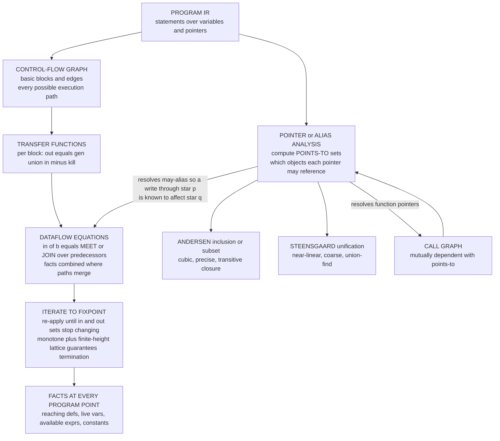

# 🧭 Dataflow and Pointer Analysis

> [!abstract] TL;DR
> **Dataflow analysis** computes, at *every* program point, a set of **facts** that hold along all (or some) execution paths reaching it — *which definitions reach here*, *which variables are still live*, *which expressions are already available* — by writing one **dataflow equation** per basic block over the **control-flow graph** and **iterating to a fixpoint**. Each block has a **transfer function** `out = gen ∪ (in − kill)`, and facts arriving on different paths are combined by a **meet/join** operator at merge points. The whole scheme is the **monotone dataflow framework** (Kildall), a concrete instance of **abstract interpretation**, whose termination is guaranteed by monotone transfer functions over a finite-height lattice; what iteration computes is the **MFP** (maximal fixed point), which under-approximates the ideal **MOP** (meet-over-all-paths) and *coincides* with it exactly for **distributive** frameworks. The hard prerequisite underneath almost every serious analysis is **pointer / alias analysis**: computing the **points-to sets** — which memory objects each pointer *may* reference — so downstream analyses know whether `*p` and `*q` can **alias** (a write through one affecting the other). The eternal tradeoff is **Andersen's** inclusion/subset-based analysis (precise, roughly cubic) versus **Steensgaard's** unification-based analysis (near-linear, much coarser), tuned further by **flow-, context-, and field-sensitivity**, and mutually entangled with **call-graph construction** for function pointers and virtual calls. Get aliasing wrong and *everything* downstream — optimization, bug finding, taint/security analysis, refactoring — silently rots; get it right at scale (billions of LOC via **Doop**, **SVF**, **WALA**) and static analysis becomes a superpower. This note is the **verification / pointer-analysis-depth** companion to the compiler-view [[Control_Flow_and_Data_Flow_Analysis]].

---

## Intuition

**Analogy — tracing rumors through an open-plan office.** Imagine a floor of desks connected by hallways, and you want to know, at *every* desk, which pieces of gossip *could possibly* have reached that desk from *anywhere* upstream. You cannot follow one person around; you must reason about *all* the ways a rumor could travel. So you write a simple rule for each desk — "the rumors known *here* are the union of the rumors leaving every desk that feeds into me, minus the ones I personally overwrite, plus the fresh ones I start" — and you keep re-running that rule floor-wide until nothing changes. That settling point is the answer: the set of facts that could be true at each spot along *all* the paths. **Dataflow analysis** is exactly this — the desks are basic blocks, the hallways are control-flow edges, and the rumors are facts like *which variable holds what* or *which assignment reaches here*.

The nastiest rumors involve **shared notebooks**. Suppose two colleagues secretly keep the *same* notebook (they **alias**): when one writes in it, the other's copy changes too, even though on paper they look independent. Now no rumor-tracing rule is trustworthy until you know *who might be sharing a notebook with whom*. **Pointer analysis** is the detective work of untangling "who might point to what" — computing, for every pointer, the set of memory objects it could reference. It is the unglamorous foundation the whole building rests on: if the detective is sloppy and declares "everyone might share every notebook," every downstream conclusion drowns in maybes; if precise, the rumor-tracing snaps into focus. Getting aliasing right is the make-or-break under almost every serious code analysis.

---

## How It Works

### Core Mechanics

1. **The CFG is the substrate.** Control-flow analysis carves the intermediate representation into **basic blocks** (maximal straight-line runs) and wires them with edges for every branch, yielding the **[[Graph_Representation|control-flow graph]]** (CFG). Dataflow analysis runs *over this graph*; it is [[DFS]]/[[BFS]] plus a lattice of facts.

2. **Transfer functions model each block.** A block transforms the incoming fact set into an outgoing one. For the *gen/kill* family the transfer function is `out[b] = gen[b] ∪ (in[b] − kill[b])`: `gen[b]` are facts the block *creates*, `kill[b]` are facts it *destroys*. This is the local, per-block semantics abstracted to fact sets.

3. **Merge points combine facts with meet/join.** Where multiple paths converge, incoming facts are combined by the framework's **meet operator** (∧). For *may* analyses the meet is **union** (a fact holds if it arrives on *any* path); for *must* analyses it is **intersection** (holds only if on *every* path). Direction and meet together classify the four classics:

   | Analysis | Direction | May/Must | Meet | Drives |
   |---|---|---|---|---|
   | Reaching definitions | forward | may | ∪ | use-def chains, const prop |
   | Available expressions | forward | must | ∩ | common-subexpr elimination |
   | Live variables | backward | may | ∪ | dead-code elim, register alloc |
   | Very-busy expressions | backward | must | ∩ | code hoisting |

4. **Solve by iterating to a fixpoint.** Initialize all sets (usually ⊥ = empty, or ⊤ for must-analyses), then repeatedly recompute `in`/`out` from neighbors until *nothing changes* — the **fixpoint**. For a forward may-analysis: `in[b] = ⋃_{p ∈ preds(b)} out[p]` and `out[b] = gen[b] ∪ (in[b] − kill[b])`.

5. **Termination is not luck — it is lattice theory.** Facts live in a **lattice** of finite height; transfer functions are **monotone**; the meet is associative/commutative/idempotent. By the **Knaster–Tarski** fixed-point theorem, monotone iteration over a finite-height lattice *must* converge, and in bounded rounds. This is the **monotone dataflow framework** of **Kildall (1973)** — and it is precisely a special case of **abstract interpretation**, where the concrete semantics is abstracted to the fact lattice via a Galois connection.

6. **MFP vs MOP — what you compute vs what you want.** The ideal answer is the **MOP** (meet-over-all-paths): meet the fact you would get along *every* individual path to a point. Iteration instead computes the **MFP** (maximal fixed point). In general `MFP ⊑ MOP` (MFP is a safe *over*-approximation — it may be less precise), and they **coincide exactly when the framework is distributive** (`f(x ∧ y) = f(x) ∧ f(y)`). Gen/kill analyses are distributive; **constant propagation is not**, so its MFP is strictly weaker than MOP — a fundamental precision limit, not a bug.

7. **Pointer/alias analysis is the hard enabler.** Every rule above assumed we knew what `x := *p` reads and what `*p := y` writes. With pointers we do not: we must first compute **points-to sets** `pts(p)` = the set of abstract memory objects `p` may reference. Then `*p` and `*q` **may-alias** iff `pts(p) ∩ pts(q) ≠ ∅`. Two dominant algorithms trade precision for speed:
   - **Andersen (inclusion/subset-based, 1994).** Model statements as **subset constraints** over points-to sets and compute their **transitive closure**:
     - `p = &x` ⇒ `x ∈ pts(p)` (base)
     - `q = p` ⇒ `pts(p) ⊆ pts(q)` (copy — a subset edge)
     - `*p = y` ⇒ `∀ o ∈ pts(p): pts(y) ⊆ pts(o)` (store)
     - `x = *p` ⇒ `∀ o ∈ pts(p): pts(o) ⊆ pts(x)` (load)
     Solving is essentially dynamic transitive closure of a constraint graph — worst case **cubic** `O(n³)`, but **flow-insensitively precise**. A key speedup: [[Strongly_Connected_Components|SCCs]] in the constraint graph have *equal* points-to sets, so **online cycle elimination** collapses them.
   - **Steensgaard (unification-based, 1996).** Instead of subset edges, **unify** (merge) the pointed-to nodes on every assignment using [[Union_Find|union-find]]. This makes points-to an equivalence relation solvable in **almost-linear** `O(n·α(n))` time — but far **coarser**: `q = p` forces `pts(p)` and `pts(q)` to become the *same* set, inventing spurious aliases Andersen would never report.

8. **Precision knobs.** Beyond the algorithm, precision is dialed by three orthogonal sensitivities: **flow-sensitivity** (respect statement order / compute per-program-point sets, vs one summary per variable), **context-sensitivity** (distinguish call sites — *k*-CFA, object-sensitivity — so `id(a)` and `id(b)` do not merge), and **field-sensitivity** (track `obj.f` and `obj.g` separately). Each multiplies precision *and* cost.

9. **Call graph ⇄ points-to are mutually recursive.** With function pointers / virtual dispatch, you cannot build the **call graph** without knowing what the callee pointer references — which needs points-to — which needs the call graph to model interprocedural flow. They must be solved *together* (on-the-fly call-graph construction).

### Flow / Architecture



---

## Key Concepts

### Secondary (intuitive core)
- **Fact.** A piece of information that might be true at a point in the program (e.g. "the assignment on line 3 could still be in effect here").
- **Flow along paths.** A fact holds at a point if it survives along the execution paths that reach it; where paths merge you **combine** what each brings.
- **Fixpoint.** Keep re-computing the facts everywhere until they stop changing — that stable answer is the analysis result.
- **Pointer / aliasing.** Two pointers **alias** when they might name the *same* memory; writing through one changes what the other sees. **Points-to analysis** works out who might point to what.
- **Precise vs cheap.** You can spend more effort to say *exactly* who aliases whom (Andersen), or answer fast but bluntly (Steensgaard) and over-report aliases.

### Undergraduate (formal machinery)
- **Gen/kill transfer function** `out = gen ∪ (in − kill)`; **forward** (reaching defs, available exprs) vs **backward** (live vars, very-busy exprs); **may** = union meet, **must** = intersection meet.
- **Iterative solver / worklist algorithm** initializing to ⊥ (or ⊤) and iterating over the CFG until the fixpoint.
- **Lattice + monotonicity ⇒ termination** (finite height + Knaster–Tarski); **MFP** is what iteration computes.
- **Points-to constraints** for Andersen: base `p=&x`, copy `q=p`, store `*p=y`, load `x=*p`; solving = transitive closure of a subset-constraint graph.
- **Steensgaard unification** via [[Union_Find]]: assignments *merge* nodes into one equivalence class — near-linear, coarse.
- **May-alias vs must-alias.** `may`: `pts(p) ∩ pts(q) ≠ ∅` (safe for *proving absence* of interference by its negation); `must`: `p` and `q` *always* reference the same single object (needed to *justify* a transformation).

### Graduate (the deep structure)
- **Monotone framework = abstract interpretation.** The fact lattice is an abstraction of the concrete collecting semantics via a **Galois connection**; transfer functions are the best (or sound) abstractions of concrete operations; **widening** handles infinite-height lattices (e.g. interval/constant domains) that gen/kill avoids.
- **MFP ⊑ MOP; equality iff distributive.** For non-distributive frameworks (constant propagation, general constraint domains) the iterative solution is *strictly less precise* than the path-ideal — Kam & Ullman's result; the gap is the price of merging at join points.
- **Andersen as CFL-reachability / cubic bottleneck.** Inclusion-based analysis is equivalent to a set-constraint / CFL-reachability problem; the `O(n³)` wall is attacked by **online cycle elimination** ([[Strongly_Connected_Components|SCC]] detection — nodes on a cycle share one points-to set), **wave/deep propagation**, **difference propagation**, and BDD-based set representation (**bddbddb**, **Doop**).
- **Context-sensitivity taxonomies.** **call-site sensitivity** (*k*-CFA), **object-sensitivity** (abstract by receiver allocation site — best for OO/Java), **type-sensitivity** (cheaper approximation of object-sensitivity), and **heap cloning** — each an axis of the precision/scalability frontier; unbounded context = undecidable, so `k` is a knob.
- **Field-sensitivity vs field-based vs array modeling.** Distinguishing `o.f` from `o.g`, and abstracting arrays (usually a single "array contents" cell), shape the heap abstraction; **allocation-site abstraction** (one abstract object per `new`) is the standard finite heap model.
- **Undecidability floor.** Exact may-alias / pointer analysis is **[[The_Halting_Problem_and_Undecidability|undecidable]]** (and even flow-insensitive precise alias analysis with dynamic memory is intractable), so *every* pointer analysis is a sound *over*-approximation — the design space is entirely about *how* to approximate.

---

## Python Demo

Two self-contained parts. **(a) Dataflow:** set up the **reaching-definitions** equations on a small looping CFG and iterate the `in`/`out` sets to a **fixpoint**, plotting how the fact sets stabilize round by round. **(b) Pointer analysis:** implement a tiny **Andersen** (inclusion-based) points-to solver from statements like `p=&x`, `q=p`, `*p=y`, compute the points-to sets by **transitive closure**, discover that `p` and `r` **may-alias**, and contrast the coarser **Steensgaard** (union-find) result that *invents* a spurious `p`/`q` alias. It draws the dataflow stabilization curve and the resulting **points-to graph**.

```python
# Dataflow fixpoint + Andersen/Steensgaard pointer analysis.  numpy + matplotlib only.
import numpy as np
import matplotlib.pyplot as plt

# ============================================================================
# (a) DATAFLOW: Reaching Definitions to a FIXPOINT
#     in[b]  = UNION over preds p of out[p]
#     out[b] = gen[b] UNION (in[b] - kill[b])
# ============================================================================
DEFS = ["d1: a=5", "d2: b=1", "d3: a=a+1", "d4: b=b*2"]   # the 4 tracked definitions
D = len(DEFS)

# CFG:  B0 -> B1 ;  B1 -> B2 ;  B2 -> B1 (loop back) ;  B1 -> B3 (exit)
blocks = [0, 1, 2, 3]
preds  = {0: [], 1: [0, 2], 2: [1], 3: [1]}

def bits(idxs):
    v = np.zeros(D, dtype=bool)
    for i in idxs:
        v[i] = True
    return v

gen  = {0: bits([0, 1]), 1: bits([]), 2: bits([2, 3]), 3: bits([])}
kill = {0: bits([2, 3]), 1: bits([]), 2: bits([0, 1]), 3: bits([])}

IN  = {b: np.zeros(D, dtype=bool) for b in blocks}
OUT = {b: np.zeros(D, dtype=bool) for b in blocks}

history, rounds, changed = [], 0, True
while changed:                                   # iterate the whole CFG until nothing changes
    changed = False
    for b in blocks:
        newin = np.zeros(D, dtype=bool)
        for p in preds[b]:
            newin |= OUT[p]                      # UNION over predecessors (a "may" analysis)
        newout = gen[b] | (newin & ~kill[b])     # out = gen U (in - kill)
        if (newin != IN[b]).any() or (newout != OUT[b]).any():
            changed = True
        IN[b], OUT[b] = newin, newout
    rounds += 1
    history.append({b: int(IN[b].sum()) for b in blocks})

print(f"[dataflow] reached FIXPOINT in {rounds} passes")
for b in blocks:
    reaching = [DEFS[i] for i in range(D) if IN[b][i]]
    print(f"  in[B{b}] = {{{', '.join(reaching) if reaching else 'empty'}}}")

# ============================================================================
# (b) POINTER ANALYSIS
#     Statements:  p=&x   q=&y   a=&w   r=p   r=q   *r=a
#     base p=&x : x in pts(p)        copy q=p : pts(p) subset pts(q)
#     store *p=y: for o in pts(p): pts(y) subset pts(o)
# ============================================================================
base  = [("p", "x"), ("q", "y"), ("a", "w")]     # address-of
copy  = [("r", "p"), ("r", "q")]                 # r = p ; r = q
store = [("r", "a")]                             # *r = a
pointers = ["p", "q", "r"]

# ---- Andersen: inclusion/subset constraints -> transitive closure ----------
varset = set()
for d, s in base + copy + store:
    varset.add(d); varset.add(s)
pts = {v: set() for v in varset}
for d, s in base:
    pts[d].add(s)                                # base constraints seed the sets

changed = True
while changed:                                   # least fixpoint of the subset constraints
    changed = False
    for d, s in copy:                            # pts(s) subset pts(d)
        if not pts[s] <= pts[d]:
            pts[d] |= pts[s]; changed = True
    for ptr, val in store:                       # for o in pts(ptr): pts(val) subset pts(o)
        for o in list(pts[ptr]):
            po = pts.setdefault(o, set())
            if not pts[val] <= po:
                po |= pts[val]; changed = True

print("\n[Andersen] points-to sets:")
for v in sorted(pts):
    if pts[v]:
        print(f"  pts({v}) = {{{', '.join(sorted(pts[v]))}}}")
and_alias = [(x, y) for i, x in enumerate(pointers) for y in pointers[i+1:]
             if pts[x] & pts[y]]
print(f"[Andersen]  may-alias pairs ({len(and_alias)}): {and_alias}")

# ---- Steensgaard: unification (union-find) -> coarse, near-linear ----------
parent = {}
def find(u):
    parent.setdefault(u, u)
    while parent[u] != u:
        parent[u] = parent[parent[u]]; u = parent[u]
    return u
def union(u, v):
    ru, rv = find(u), find(v)
    if ru != rv:
        parent[ru] = rv

target = {v: f"*{v}" for v in varset}            # each var gets one "pointee" node
for d, s in base:  union(target[d], s)           # d = &s  -> pointee(d) ~ s
for d, s in copy:  union(target[d], target[s])   # d = s   -> pointees unified (COARSE!)
for p, v in store: union(target[p], target[v])   # *p = v  -> pointee(p) ~ pointee(v)

steens_alias = [(x, y) for i, x in enumerate(pointers) for y in pointers[i+1:]
                if find(target[x]) == find(target[y])]
print(f"[Steensgaard] may-alias pairs ({len(steens_alias)}): {steens_alias}"
      f"   <-- note the SPURIOUS extra pair vs Andersen")

# ============================================================================
# VISUALIZATION
# ============================================================================
fig, (axL, axR) = plt.subplots(1, 2, figsize=(14, 5.6))

# ---- Left: dataflow in-set sizes stabilizing to the fixpoint ----
xs = np.arange(1, len(history) + 1)
for b in blocks:
    ys = [h[b] for h in history]
    axL.plot(xs, ys, "o-", lw=2, label=f"|in[B{b}]|")
axL.axvline(len(history) - 1 + 0.0, ls=":", color="0.6")
axL.text(len(history) - 0.9, 0.3, "fixpoint\n(no more change)", color="0.4", fontsize=9)
axL.set_xlabel("iteration pass")
axL.set_ylabel("number of reaching definitions in in[b]")
axL.set_title("DATAFLOW: reaching-definitions in-sets\niterate  in = U out[preds],  "
              "out = gen U (in - kill)  -> FIXPOINT")
axL.set_xticks(xs); axL.set_ylim(-0.3, D + 0.3)
axL.grid(True, ls=":", alpha=0.5); axL.legend(fontsize=9, loc="center right")

# ---- Right: Andersen points-to graph ----
pos = {"p": (0, 2.4), "q": (0, 1.2), "r": (0, 0.0),
       "x": (1.6, 2.7), "y": (1.6, 0.6), "w": (3.2, 1.6)}
edges = [(d, s) for d, s in [("p", "x"), ("q", "y"), ("r", "x"),
                             ("r", "y"), ("x", "w"), ("y", "w")]]
for s, t in edges:
    (x1, y1), (x2, y2) = pos[s], pos[t]
    axR.annotate("", xy=(x2, y2), xytext=(x1, y1),
                 arrowprops=dict(arrowstyle="-|>", color="#4c72b0", lw=2,
                                 shrinkA=20, shrinkB=20))
ptr_nodes = {"p", "q", "r"}
for n, (x, y) in pos.items():
    col = "#dd8452" if n in ptr_nodes else "#55a868"
    axR.scatter([x], [y], s=1500, color=col, edgecolors="black", zorder=4)
    axR.text(x, y, n, ha="center", va="center", color="white",
             fontsize=13, fontweight="bold", zorder=5)
# highlight the discovered aliasing: p and r both reach object x
axR.annotate("p and r may-alias\n(share object x)", xy=(1.6, 2.7), xytext=(1.2, 3.4),
             fontsize=9, color="#c44e52", fontweight="bold",
             arrowprops=dict(arrowstyle="->", color="#c44e52"))
axR.text(0.0, -0.9,
         f"Andersen alias pairs: {len(and_alias)}   "
         f"Steensgaard: {len(steens_alias)} (coarser)",
         fontsize=9, color="0.25")
axR.set_title("POINTER ANALYSIS: Andersen points-to graph\n"
              "orange = pointers, green = objects;  edge = 'may point to'")
axR.set_xlim(-0.6, 3.9); axR.set_ylim(-1.2, 3.8); axR.axis("off")

plt.tight_layout()
plt.savefig("dataflow_and_pointer_analysis.png", dpi=130, bbox_inches="tight")
print("\nsaved -> dataflow_and_pointer_analysis.png")
```

**What the run shows.** Part (a) drives the reaching-definitions equations around the loop: the `in`-sets grow monotonically and then **freeze** — `in[B1]` ends up containing all four definitions because the loop back-edge feeds `d3`/`d4` back to the header, exactly the "facts flowing along *all* paths" the analysis promises, and the curve visibly flattens at the fixpoint after a handful of passes (termination guaranteed by the finite lattice). Part (b) solves the same idea for *pointers*: Andersen's subset constraints close to `pts(p)={x}`, `pts(q)={y}`, `pts(r)={x,y}`, so it correctly reports **`p`–`r`** and **`q`–`r`** as may-alias but keeps **`p` and `q` distinct**. Steensgaard's unification merges the pointees on every copy, collapsing `x`, `y` (and `w`) into one class, so it *also* reports the **spurious `p`–`q` alias** — the concrete, visible cost of trading inclusion for near-linear unification.

---

## Real-World Applications

- **Production compilers (LLVM, GCC).** Every optimizer runs dataflow to a fixpoint — live-variable analysis for **register allocation** and **dead-code elimination**, available-expressions for **common-subexpression elimination**, constant/copy propagation — usually on **[[Static_Single_Assignment_Form|SSA]]** form, which makes many analyses *sparse* (def-use edges replace per-point sets). LLVM ships several alias analyses (`basic-aa`, a Steensgaard-style `cfl-steens-aa`, and an Andersen-style `cfl-anders-aa`) because optimizations like load/store forwarding and licm are only as good as their aliasing.
- **Whole-program points-to at scale — Doop, SVF, WALA.** **Doop** encodes context-sensitive Andersen-style analysis **declaratively in Datalog** (points-to *is* transitive closure of subset constraints), letting engineers dial `k`-CFA / object-sensitivity as rule variants; **SVF** builds sparse value-flow graphs on LLVM IR for C/C++; IBM's **WALA** powers Java analyses. These handle millions of lines by exploiting BDDs, cycle elimination, and demand-driven queries.
- **Security / taint analysis.** Tools such as **CodeQL**, **Coverity**, **Fortify**, and **FlowDroid** phrase *"can attacker-controlled data reach a sink?"* as an **interprocedural dataflow** (IFDS/IDE) problem *on top of* a points-to result — imprecise aliasing yields either missed vulnerabilities (unsound) or a flood of false positives (unusable), so pointer analysis quality directly gates the product.
- **Bug finders and refactoring IDEs.** Null-dereference, use-after-free, and resource-leak detectors, plus "rename / extract method / find all writes" refactorings, all need may/must-alias facts to know which references touch the same object.
- **The Steensgaard tradeoff in practice.** When a codebase is enormous and only a *rough* alias answer is needed (e.g., a fast pre-pass), unification-based analysis is chosen precisely because it is near-linear; when precision pays off (security, aggressive optimization), inclusion-based/context-sensitive analysis is worth the cost.

---

## Common Pitfalls

- **Wrong direction or wrong meet.** Reaching definitions and available expressions are **forward**; live variables and very-busy expressions are **backward**. **May** analyses meet with **union**, **must** with **intersection** — and must-analyses must initialize to ⊤ (full set), not ∅, or the fixpoint is wrong. Mixing these silently produces a sound-looking but incorrect result.
- **Iterating without a proper lattice.** Termination is *only* guaranteed by **monotone** transfer functions over a **finite-height lattice**. Ad-hoc domains (e.g., raw intervals) have infinite height and need **widening**; forgetting it makes iteration diverge. The monotone framework is a special case of **abstract interpretation** — treat it as such.
- **Assuming MFP = MOP.** Iteration computes the **MFP**, which equals the ideal **MOP** *only for distributive frameworks*. **Constant propagation is not distributive**, so merging at joins loses precision — do not claim path-precise results from a plain fixpoint solver.
- **Treating pointer analysis as optional.** Without points-to, `*p = y` could write *anywhere*, forcing every other analysis to assume the worst and become useless. Aliasing is the **hard enabler**; imprecise points-to sinks everything downstream.
- **Confusing may-alias with must-alias.** **May-alias** (`pts(p) ∩ pts(q) ≠ ∅`) is what you get by default; proving two pointers *never* alias (the negation) is what enables optimization. **Must-alias** (they *always* reference the same single object) is much rarer and stronger — needed to *justify* a rewrite, not merely to rule interference out.
- **Picking the wrong points-to engine.** **Andersen** (inclusion, ~cubic) is precise but can be slow; **Steensgaard** (unification, near-linear) is fast but merges sets and **invents spurious aliases** (as the demo shows for `p`/`q`). Choose by whether precision or throughput dominates — and remember cycle elimination via [[Strongly_Connected_Components|SCCs]] rescues much of Andersen's cost.
- **Ignoring the sensitivity knobs' cost.** **Flow-**, **context-** (*k*-CFA / object-sensitivity), and **field-sensitivity** each raise precision *and* blow up cost combinatorially. Cranking them blindly makes analysis intractable; too little makes results worthless. Sensitivity is a *budget* to allocate.
- **Building the call graph independently of points-to.** With function pointers / virtual dispatch, the **call graph and points-to are mutually recursive** — resolve them **together** (on-the-fly). A pre-built, imprecise call graph poisons the interprocedural dataflow that rides on it.
- **Forgetting the undecidability floor.** Exact aliasing is **[[The_Halting_Problem_and_Undecidability|undecidable]]**; *every* pointer analysis is a sound **over-approximation**. Expecting "the true alias set" is a category error — the only real questions are *how* to approximate and at what **scalability-vs-precision** point ([[Time_and_Space_Complexity|complexity]] matters: billions of LOC change which approximations are viable).

---

## Related Concepts

- [[Control_Flow_and_Data_Flow_Analysis]] — the **compiler-optimization** view of the same dataflow machinery (basic blocks, the four classic analyses, monotone framework); this note is its **verification / pointer-analysis-depth** counterpart, linking the two treatments.
- [[Intermediate_Representations]] — dataflow and points-to run *over* the IR (three-address code, IR-level pointers); the abstraction of the IR fixes what "objects" the analysis names.
- [[Static_Single_Assignment_Form]] — SSA makes many dataflow analyses **sparse** (def-use chains replace per-point sets) and underlies sparse pointer/value-flow analyses.
- [[Local_and_Global_Optimizations]] — the optimizations (DCE, CSE, register allocation, LICM) that consume live-variable / available-expression / alias facts; imprecise aliasing blocks them.
- [[Strongly_Connected_Components]] — **cycle elimination** in Andersen's constraint graph: nodes in one SCC share a single points-to set, taming the cubic cost.
- [[Union_Find]] — the disjoint-set engine behind **Steensgaard's** unification-based, near-linear pointer analysis.
- [[Floyd_Warshall]] — the canonical **transitive closure** algorithm; Andersen's inclusion-based points-to is essentially closure/reachability over a subset-constraint graph.
- [[DFS]] / [[BFS]] — the graph traversals underlying CFG construction, worklist ordering, and constraint-graph exploration.
- [[Graph_Representation]] — the CFG and the pointer-constraint graph are both graphs; representation choices drive the solver's cost.
- [[The_Halting_Problem_and_Undecidability]] — exact dataflow and alias analysis are undecidable, which is *why* every analysis is a sound over-approximation.
- [[Time_and_Space_Complexity]] — the Andersen (cubic) vs Steensgaard (near-linear) tradeoff and the scalability-vs-precision frontier are complexity statements.

*Siblings in this section (05 — Static Analysis & Abstraction), referenced here in prose: **Static_Program_Analysis** (the umbrella this engine sits under), **Abstract_Interpretation** (the general theory that subsumes the monotone framework), **Symbolic_Execution** (the path-sensitive alternative to merging at joins), **Separation_Logic_and_Heap_Reasoning** (the deductive, must-alias-precise heap discipline), and **Type_Based_Verification** (types as a lightweight, modular alternative to whole-program points-to).*

---

## Review Questions

1. **(Secondary)** Using the office-rumor analogy, explain in your own words what "iterating to a fixpoint" means and why the answer is trustworthy only after the fact sets *stop changing*. Then explain what **aliasing** is and why a rumor-tracer cannot be believed until it knows who shares a notebook.
2. **(Undergraduate)** Classify **reaching definitions**, **live variables**, **available expressions**, and **very-busy expressions** by *direction* (forward/backward) and *meet* (union/intersection). For live variables, write the two dataflow equations and explain what each set means and why the analysis runs backward.
3. **(Undergraduate)** Given `p = &x; q = &y; r = p; r = q; *r = z` with `z = &w`, hand-compute the **Andersen** points-to sets for `p`, `q`, `r`, `x`, `y`. Which pointers **may-alias**? Now say what **Steensgaard** would conclude and identify the *spurious* alias it introduces — and why unification causes it.
4. **(Graduate)** State the relationship between **MFP** and **MOP** and the exact condition under which they coincide. Give a concrete analysis for which they *differ* and explain, at the join point, precisely what precision is lost and why merging (rather than keeping paths separate, as symbolic execution does) is the culprit.
5. **(Graduate)** Explain why **call-graph construction and points-to analysis are mutually recursive** in the presence of function pointers / virtual dispatch, and how an on-the-fly solver breaks the circularity. Then describe how **context-sensitivity** (call-site *k*-CFA vs object-sensitivity) trades precision for scalability, and why *unbounded* context is undecidable.

---

## Sources

- Kildall, G. A. "A Unified Approach to Global Program Optimization." *POPL*, 1973 — the founding paper on the iterative, lattice-theoretic (monotone) dataflow framework.
- Andersen, L. O. *Program Analysis and Specialization for the C Programming Language.* PhD thesis, University of Copenhagen, 1994 — the inclusion/subset-based ("Andersen") points-to analysis.
- Steensgaard, B. "Points-to Analysis in Almost Linear Time." *POPL*, 1996 — the unification-based ("Steensgaard") near-linear pointer analysis.
- Nielson, F., Nielson, H. R. & Hankin, C. *Principles of Program Analysis.* Springer, 1999 — the standard text unifying dataflow, control-flow, and abstract-interpretation-based analyses.
- Hind, M. "Pointer Analysis: Haven't We Solved This Problem Yet?" *PASTE*, 2001 — the classic survey of the precision/scalability design space (flow-/context-/field-sensitivity).

---

#formal-methods #dataflow-analysis #pointer-analysis #points-to #alias-analysis
