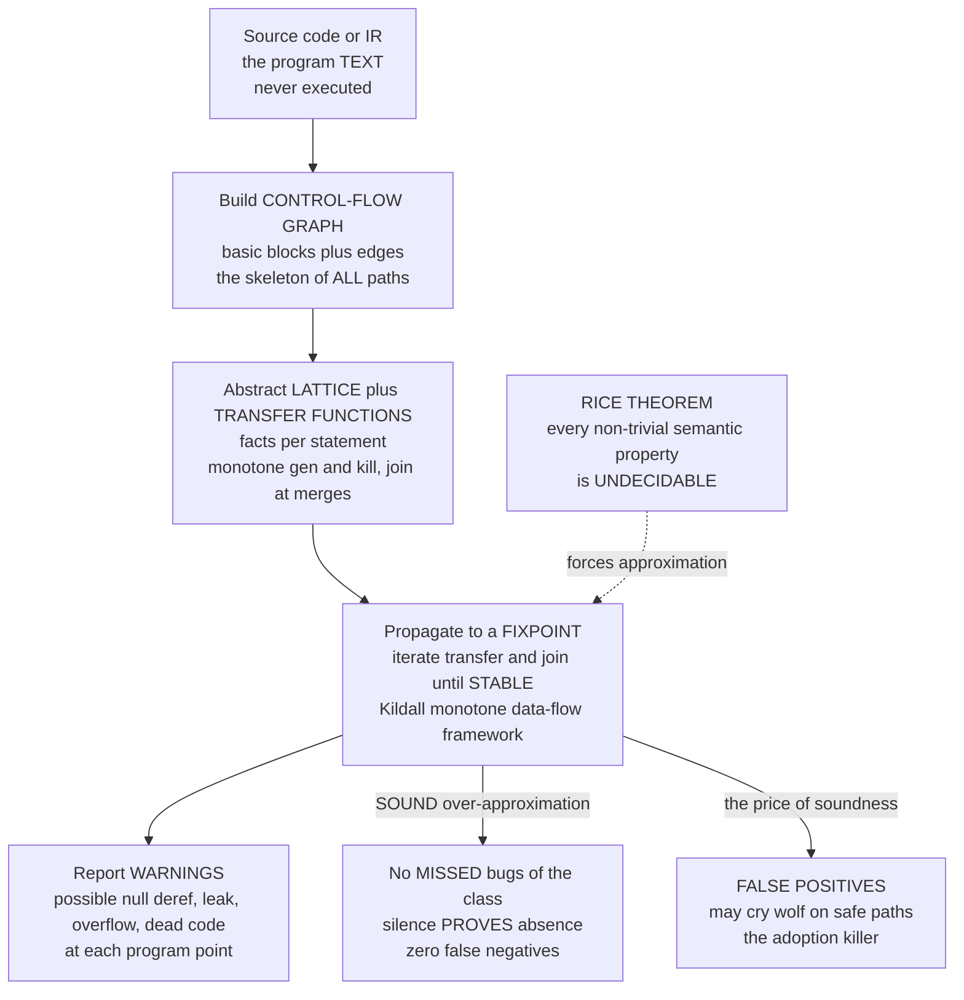

# 🔎 Static Program Analysis

> [!abstract] TL;DR
> **Static program analysis** examines a program's **source or intermediate representation *without running it*** — reasoning about *all* possible executions at once instead of the single path a test happens to take — and automatically flags whole classes of defects: null and uninitialized-variable use, buffer overflows, memory leaks, data races, dead code, and taint/security flaws. The engine is the **monotone data-flow / Kildall framework**: build a **control-flow graph (CFG)**, define an abstract **lattice** of facts and monotone **transfer functions** per statement, then **propagate facts to a fixpoint** — guaranteed to terminate because a finite-height (ascending-chain) lattice plus monotone functions cannot climb forever. But a hard wall from computability governs everything: **Rice's theorem** says every non-trivial semantic property of programs is **undecidable**, so *no* analysis can be exact — every static analysis must **approximate**. **Sound** analyses **over-approximate** the real behaviours: they have **no false negatives** (they catch *every* real bug of the class, and can therefore *prove absence*), at the cost of **false positives** (crying wolf on safe code); many practical bug-finders (linters, much of Coverity) deliberately trade soundness for a low false-positive rate, because it is the false-positive rate — not the theory — that makes or breaks adoption. This is the **automatic, scalable, "lightweight"** wing of formal methods — the most widely deployed formal technology on Earth (Coverity, Meta's Infer, CodeQL, SonarQube, the Clang analyzer, Astrée) — sitting opposite manual deductive proof and complemented by [[Control_Flow_and_Data_Flow_Analysis|the compiler's optimization-oriented data-flow analysis]] and, next in this section, by **abstract interpretation** as its unifying theory.

---

## Intuition

**Analogy — the spell-checker for an essay.** A spell-checker finds mistakes in an essay *without understanding what it means*. It never reads for argument, tone, or truth; it simply scans the text against a body of rules — a dictionary, grammar patterns, doubled words, "teh" for "the" — and instantly highlights the likely errors. It works on *any* essay, in seconds, before you ask a single reader to actually read the thing. That is exactly what makes it so useful: no execution of the ideas required, just a mechanical pass over the surface that surfaces probable defects across a whole document at once.

**Static program analysis is a spell-checker for code.** It reads the *source*, not the *running program*, and pattern-matches it against the rules of "what a correct program looks like" — every variable defined before use, every pointer checked before dereference, every opened file eventually closed, every lock released. In one automated pass it flags likely bugs across *millions* of lines, for *any* program, without anyone writing a test or launching the software. And the analogy carries the *catch*, too: a spell-checker sometimes red-underlines a perfectly good word — a name, a neologism, a technical term — because to be sure it *never misses* a real misspelling it must occasionally **cry wolf**. Static analysis faces the same trade, but sharpened into a theorem: perfectly deciding "is this line a bug?" is **literally impossible** (Rice's theorem), so to guarantee it never *misses* a real error, a sound analyzer must accept some **false alarms**. The whole craft is managing that unavoidable tension between *catching everything* and *not annoying the programmer*.

---

## How It Works

### Core Mechanics

Every static analysis, from a one-line linter rule to Astrée proving an Airbus flight controller free of runtime errors, is some instance of the same four-step recipe.

**1. Get a program representation — never run it.** The analyzer ingests the source, the AST, or (most often) a compiler **intermediate representation** ([[Intermediate_Representations]]) — three-address code, SSA ([[Static_Single_Assignment_Form]]), or LLVM IR. This is the defining move of *static* analysis: it reasons about the program *text* and therefore about **all** of its possible runs simultaneously, in contrast to *dynamic* analysis (testing, fuzzing, valgrind) which observes **one concrete execution at a time**.

**2. Build the control-flow graph (CFG).** Partition the IR into **basic blocks** (maximal straight-line runs, one entry, one exit) and wire them with an edge for every branch. The CFG is a directed graph ([[Graph_Representation]]), so the whole graph toolbox applies — reachability, [[DFS|depth-first]] ordering, and worklist traversal in reverse-postorder. This construction is *shared* with the optimizing compiler; the difference is the **question** we ask on top of it. See [[Control_Flow_and_Data_Flow_Analysis]] for the compiler's optimization-oriented treatment; **this** note is the verification-and-soundness-oriented reading of the same machinery.

**3. Define an abstract *lattice* of facts and monotone *transfer functions*.** You cannot track the *exact* value of every variable (that's undecidable and infinite). Instead you pick an **abstract domain** — a **lattice** of facts ordered from "most precise" to "least" — and, for each statement, a **transfer function** describing how it moves facts through. Classic domains:

- **Sign** — `{-, 0, +}` and their unions, for arithmetic-error detection.
- **Null-state** — `{NonNull, Null, MaybeNull, Unreachable}`, for null-dereference detection.
- **Initialization** — `{Defined, Undefined, Maybe}`, for use-before-init.
- **Intervals / octagons / polyhedra** — numeric ranges, for array-bounds and overflow (this is where **abstract interpretation** shines).

The **join** (meet) operator `⊔` combines facts where paths merge: `NonNull ⊔ Null = MaybeNull` — the analysis loses precision but stays *safe*. The lattice sits on the same order-theory as posets and partial orders ([[Set_Theory_and_Relations]]).

**4. Propagate to a *fixpoint* (the Kildall / monotone data-flow framework).** Attach a fact to each program point (`IN[B]`, `OUT[B]`), initialize, then **iterate** the transfer functions and joins until *nothing changes* — the **fixpoint**. Gary Kildall's 1973 insight was that reaching definitions, live variables, available expressions, and constant propagation are all *the same algorithm* over different lattices. **Termination is guaranteed** whenever the lattice has **finite height** (or satisfies the **ascending chain condition**) and the transfer functions are **monotone**: facts can only climb the lattice, and a chain that can only ascend in a finite-height lattice must stop. This is the same "iterate until stable" idea as a **fixpoint / dynamic-programming** solve — the analysis *converges*.

**5. Report warnings — and confront undecidability.** Read off the fixpoint: if a dereference site has fact `MaybeNull`, emit *"possible null dereference."* But here computability bites. By **Rice's theorem** ([[Decidability_and_Recognizability]]) and the **halting problem** ([[The_Halting_Problem_and_Undecidability]]), *every non-trivial semantic property* — "does this pointer dereference null?", "is this code dead?", "can this array index overflow?" — is **undecidable**. No algorithm can answer exactly for all programs. So the analyzer must **approximate**, and *which way* it rounds defines its character:

- A **sound** analysis **over-approximates** the set of real behaviours: it computes a *superset*. It therefore has **no false negatives** — if a bug of the tracked class exists, it *will* be flagged — which is exactly what lets it **prove the *absence*** of that bug class when it stays silent. The price is **false positives**: it may warn about a path that can never actually execute.
- A **complete but unsound** bug-finder **under-approximates**: it reports only what it is fairly sure about, tolerating **false negatives** (missed bugs) to keep **false positives** low. Many industrial linters and much of Coverity's heuristic core live here — because a tool that cries wolf too often gets **turned off**, and a turned-off analyzer catches nothing.

You cannot have both: soundness *and* completeness *and* automation *and* termination is ruled out by the same theorems the whole of [[Formal_Methods_Overview|formal methods]] lives under. Static analysis is the branch that keeps **automation and termination**, and gives ground on **exactness**.

### Flow / Architecture



*The program text becomes a CFG; an abstract lattice plus monotone transfer functions are propagated to a fixpoint; warnings are read off. Rice's theorem forces the whole pipeline to approximate — a **sound** analysis rounds toward over-approximation (no missed bugs, some false alarms), which is what lets silence **prove** a bug class absent.*

---

## Key Concepts

### Secondary (intuitive, no advanced background needed)

- **Static vs dynamic** — *static* = read the code, reason about **every** path, without running it (the spell-checker); *dynamic* = **run** the program and watch **one** path (testing, fuzzing). Static covers all inputs but approximates; dynamic is exact but samples.
- **A whole class of bugs at once** — one analysis pass flags *all* null-dereference sites, or *all* unclosed files, across the whole codebase — not one example a test tripped over.
- **False positive vs false negative** — a **false positive** is crying wolf (a warning on safe code); a **false negative** is a *missed* real bug. A spell-checker underlining a real word is a false positive.
- **Why it cries wolf** — to *never miss* a real bug it must sometimes over-warn. Being certain about every line is impossible, so it errs on the side of caution.

### Undergraduate (a first course)

- **The CFG + lattice + transfer function + fixpoint framework** — build the [[Control_Flow_and_Data_Flow_Analysis|control-flow graph]]; pick an abstract **lattice** of facts; give each statement a **transfer function**; iterate to a **fixpoint** with a **join** at merge points. Kildall's **monotone data-flow framework** unifies the classics: **reaching definitions**, **live variables**, **available expressions**, **constant propagation**.
- **Termination** — guaranteed by a **finite-height lattice** (or the **ascending chain condition**) plus **monotone** transfer functions: facts only climb, and a bounded climb must stop. This is the same convergence idea as a **fixpoint** iteration.
- **May vs must analyses** — *may* (union join) answers "could this be true on *some* path?"; *must* (intersection join) answers "is this true on *every* path?". Forward vs backward sets the propagation direction.
- **Soundness vs completeness** — **sound** = no false negatives (over-approximate; can prove absence); **complete/precise** = no false positives. Rice's theorem forbids having both automatically.
- **Static vs dynamic analysis** — complementary: static proves properties over all paths but over-approximates; dynamic (testing) is precise but path-limited. Real pipelines run both.

### Graduate (advanced)

- **Rice's theorem as the root cause** — *any* non-trivial property of the **partial function a program computes** is undecidable ([[Decidability_and_Recognizability]], [[Reductions_and_Undecidable_Problems]]). This is *why* approximation is not laziness but a mathematical necessity; abstract interpretation is the principled framework for approximating *soundly*.
- **The precision knobs** — each is more precise but costlier:
  - **Flow-sensitivity** — respect statement order (track facts per program point, not per procedure).
  - **Path-sensitivity** — reason about individual paths / branch conditions (kills the classic *guarded-deref* false positive, at exponential path cost).
  - **Context-sensitivity** — distinguish call sites so a callee's analysis isn't polluted across callers.
  - **Field-sensitivity** — track object fields separately rather than lumping an object into one fact.
- **The soundness spectrum in industry** — Astrée and Infer aim for **soundness** (prove absence of runtime errors / of certain leaks and null-derefs); Coverity and most linters are deliberately **"soundy"** — heuristic, unsound, optimized for a **low false-positive rate**. Dawson Engler's Coverity retrospective ("A Few Billion Lines of Code Later") is blunt: a checker's *usefulness is dominated by its false-positive rate*, because developers rapidly ignore or disable noisy tools.
- **Scalability vs precision** — the eternal dial. Whole-program, context-sensitive, path-sensitive pointer analysis is precise but can blow up super-linearly; production analyzers accept coarser abstractions (e.g. Andersen vs Steensgaard pointer analysis) to run on billions of lines nightly.
- **Position in formal methods** — static analysis is the **automatic, scalable, approximate** corner; **deductive proof** ([[Hoare_Logic_and_Axiomatic_Semantics]]) is the **precise, expressive, manual** corner; **model checking** is exhaustive over finite abstractions. **Abstract interpretation** (next section) is the *theory* that unifies data-flow analysis via **Galois connections** and **widening**; symbolic execution and type-based verification are siblings that trade the knobs differently.

---

## Python Demo

Two experiments, `numpy` + `matplotlib` only. **(a) A data-flow analysis reaching a fixpoint.** We run a **null-state analysis** over the tiny lattice `⊥ < {Null, NonNull} < Maybe(⊤)` on a small control-flow graph *with a loop*, iterate the monotone transfer functions to a **fixpoint**, and plot the facts **climbing and then stabilizing** (monotone convergence). The fixpoint shows a **`Maybe`** at a dereference site fed by an un-initialized branch — a **possible null-dereference bug**, caught without running anything. **(b) Soundness vs precision.** We show the analysis **over-approximates**: a coarse (path-*insensitive*) abstraction flags *every* dereference where the value *could* be null — catching **all** real bugs (zero false negatives) but also firing on **guarded** (safe) sites (**false positives**). Refining the abstraction (adding path-, then context-, then field-sensitivity) **removes false positives** while **recall stays pinned at 1.0** — the signature of a *sound* analysis: precision improves, but soundness (no missed bugs) is never sacrificed.

```python
# Static program analysis: fixpoint convergence + the soundness/precision trade-off.
# (a) Null-state DATA-FLOW analysis iterated to a FIXPOINT on a small CFG (with a loop);
#     detects a "possible null dereference" without executing the program.
# (b) SOUND over-approximation: a coarse abstraction flags guarded-safe sites (false
#     POSITIVES) but never misses a real bug (zero false NEGATIVES); refining the
#     abstraction removes false positives while recall stays fixed at 1.0.
# numpy + matplotlib only.

import numpy as np
import matplotlib.pyplot as plt

# ------------------------------------------------------------------ #
# (a) The null-state lattice:  BOT < {NULL, NONNULL} < MAYBE(top)     #
# ------------------------------------------------------------------ #
BOT, NULL, NONNULL, MAYBE = 0, 1, 2, 3
NAME   = {BOT: "Bot", NULL: "Null", NONNULL: "NonNull", MAYBE: "Maybe"}
HEIGHT = {BOT: 0, NULL: 1, NONNULL: 1, MAYBE: 2}   # lattice height, for plotting

def join(a, b):
    if a == BOT: return b
    if b == BOT: return a
    if a == b:   return a
    return MAYBE                                     # NULL join NONNULL = MAYBE (over-approx)

# A small CFG for variable x. Edges form a LOOP so the fixpoint takes several rounds:
#   B0: x = null            (const -> Null)
#   B1: loop head / merge   (pass-through join of preds B0 and B4)
#   B2: x = new Object()    (true branch -> NonNull)
#   B3: (do nothing)        (false branch -> x stays whatever it was)
#   B4: deref x  <-- BUG?   (pass-through; back-edge B4->B1)
#   B5: exit                (pass-through)
preds = {"B0": [], "B1": ["B0", "B4"], "B2": ["B1"],
         "B3": ["B1"], "B4": ["B2", "B3"], "B5": ["B4"]}
order = ["B0", "B1", "B2", "B3", "B4", "B5"]

def transfer(b, inv):
    if b == "B0": return NULL       # x = null
    if b == "B2": return NONNULL    # x = new Object()
    return inv                      # B1,B3,B4,B5 pass their input through

# Round-robin iteration to a fixpoint, recording each block's OUT-fact per round.
OUT = {b: BOT for b in order}
history = [dict(OUT)]
changed_per_round = []
for _ in range(12):
    changed = 0
    for b in order:
        inv = BOT
        for p in preds[b]:
            inv = join(inv, OUT[p])
        newout = transfer(b, inv)
        if newout != OUT[b]:
            changed += 1
        OUT[b] = newout
    changed_per_round.append(changed)
    history.append(dict(OUT))
    if changed == 0:
        break

# Read the fixpoint at the deref site B4:
deref_in = BOT
for p in preds["B4"]:
    deref_in = join(deref_in, OUT[p])
verdict = "POSSIBLE NULL DEREF" if deref_in in (NULL, MAYBE) else "safe"
print(f"(a) Fixpoint reached in {len(changed_per_round)} rounds.")
print(f"    Fact flowing into deref site B4 = {NAME[deref_in]}  ->  {verdict}")

# ------------------------------------------------------------------ #
# (b) Soundness vs precision across refinement levels 0..4            #
#     ground truth: some deref sites are real bugs, some are guarded  #
# ------------------------------------------------------------------ #
n_bugs, n_safe = 8, 40           # 8 genuine null-deref sites, 40 guarded-safe sites
levels = np.arange(0, 5)         # 0=flow-insensitive ... 4=path+context+field-sensitive
decay  = 0.45                    # each refinement resolves ~55% of remaining false positives

# A SOUND analysis always flags every real bug -> true positives = n_bugs, false negatives = 0.
tp = np.full(levels.shape, n_bugs)
fn = np.zeros(levels.shape, dtype=int)
# False positives: guarded-safe sites the coarse abstraction cannot yet distinguish.
fp = np.round(n_safe * decay ** levels).astype(int)

precision = tp / (tp + fp)
recall    = tp / (tp + fn)       # identically 1.0 -> soundness

print("\n(b) refinement | TP  FP  FN | precision  recall")
for L in levels:
    print(f"       level {L}  | {tp[L]:2d}  {fp[L]:2d}  {fn[L]:2d} |   {precision[L]:.3f}    {recall[L]:.3f}")

# ------------------------------------------------------------------ #
# Visualization                                                       #
# ------------------------------------------------------------------ #
fig, ax = plt.subplots(2, 2, figsize=(13, 9))

# (a1) Fixpoint convergence: each block's fact climbs the lattice, then stabilizes.
rounds = np.arange(len(history))
for b in order:
    h = [HEIGHT[hist[b]] for hist in history]
    ax[0, 0].plot(rounds, h, marker="o", lw=2, label=b)
ax[0, 0].set_title("(a1) Data-flow iterated to a FIXPOINT\n"
                   "facts climb the lattice monotonically, then STOP")
ax[0, 0].set_xlabel("iteration round"); ax[0, 0].set_ylabel("lattice height of fact")
ax[0, 0].set_yticks([0, 1, 2]); ax[0, 0].set_yticklabels(["Bot", "Null/NonNull", "Maybe"])
ax[0, 0].legend(ncol=3, fontsize=8, loc="lower right"); ax[0, 0].grid(alpha=0.3)

# (a2) Convergence proof: number of facts that changed per round -> 0 at the fixpoint.
xr = np.arange(1, len(changed_per_round) + 1)
ax[0, 1].bar(xr, changed_per_round, color="#55A868")
ax[0, 1].axhline(0, color="crimson", lw=1.5, ls="--", label="fixpoint: nothing changes")
ax[0, 1].set_title("(a2) Monotone framework TERMINATES\n"
                   "changed facts per round fall to zero (finite-height lattice)")
ax[0, 1].set_xlabel("iteration round"); ax[0, 1].set_ylabel("facts changed this round")
ax[0, 1].legend(loc="upper right"); ax[0, 1].grid(alpha=0.3, axis="y")

# (b1) Coarse (level 0) vs refined (level 4): TP / FP / FN.
groups = ["True positives\n(real bugs caught)", "False positives\n(cry wolf)",
          "False negatives\n(MISSED bugs)"]
x = np.arange(3); w = 0.38
coarse = [tp[0], fp[0], fn[0]]; refined = [tp[4], fp[4], fn[4]]
ax[1, 0].bar(x - w/2, coarse,  w, color="#C44E52", label="coarse (path-insensitive)")
ax[1, 0].bar(x + w/2, refined, w, color="#4C72B0", label="refined (path+context+field)")
ax[1, 0].set_title("(b1) SOUND over-approximation\n"
                   "false negatives = 0 for BOTH; refinement kills false positives")
ax[1, 0].set_xticks(x); ax[1, 0].set_xticklabels(groups, fontsize=8)
ax[1, 0].set_ylabel("count of deref sites"); ax[1, 0].legend(); ax[1, 0].grid(alpha=0.3, axis="y")

# (b2) Precision rises with refinement while recall stays pinned at 1.0 (soundness).
ax[1, 1].plot(levels, precision, marker="o", lw=2.5, color="#4C72B0",
              label="precision = TP / (TP+FP)")
ax[1, 1].plot(levels, recall, marker="s", lw=2.5, color="#55A868",
              label="recall = TP / (TP+FN)  (soundness)")
ax[1, 1].axhline(1.0, ls=":", color="gray", lw=1)
ax[1, 1].set_title("(b2) Precision vs recall as abstraction is refined\n"
                   "recall stays 1.0 (no missed bugs); precision climbs toward 1.0")
ax[1, 1].set_xlabel("refinement level  (flow -> path -> context -> field)")
ax[1, 1].set_ylabel("rate"); ax[1, 1].set_ylim(0, 1.05)
ax[1, 1].set_xticks(levels); ax[1, 1].legend(loc="lower right"); ax[1, 1].grid(alpha=0.3)

fig.suptitle("Static program analysis: fixpoint convergence and the soundness/precision trade-off",
             fontsize=14)
fig.tight_layout()
plt.savefig("static_program_analysis.png", dpi=120)
print("\nSaved figure to static_program_analysis.png")
```

**What it shows.** Panel (a1): every block's abstract fact for `x` **climbs the lattice** (`Bot → Null/NonNull → Maybe`) over a few rounds and then **freezes** — the **fixpoint**. Panel (a2): the number of facts that change per round drops to **zero**, the concrete witness that a **monotone framework over a finite-height lattice must terminate** (Kildall). The fixpoint puts `Maybe` into the dereference site `B4` because the `B3` branch never assigns `x` — a **possible null dereference**, found with zero executions. Panel (b1): the *coarse* analysis and the *refined* analysis both have **zero false negatives** (soundness — every real bug is caught), but the coarse one fires on many **guarded-safe** sites (false positives), which refinement removes. Panel (b2) is the punchline of the whole discipline: as you turn the precision knobs, **precision rises toward 1.0 while recall stays pinned at 1.0** — you *buy back* precision without ever giving up the soundness guarantee, which is exactly why over-approximating analyses can *prove* a bug class absent.

---

## Real-World Applications

> **Example — Meta's Infer on every code change.** Meta runs **Infer**, a static analyzer built on **separation logic** (the heap-reasoning discipline of [[Separation_Logic_and_Heap_Reasoning]]), as a bot on *every* pull request across its Android, iOS, and backend code. It builds the CFG, computes a sound-ish over-approximation of heap and null behaviour compositionally (per-method summaries so it scales to a monorepo), and comments *"possible null dereference / resource leak"* directly on the diff **before** the code merges. Crucially, Meta tuned it around the **false-positive** finding from Coverity's experience: developers fix a *diff-time* warning ~70% of the time but ignore a *batch* report of legacy warnings — placement and noise, not just the algorithm, decide impact.

- **Coverity** — the archetypal commercial analyzer; Bessey, Engler et al.'s *"A Few Billion Lines of Code Later"* (CACM 2010) reports running it across billions of lines of C/C++ in the wild and distills the hard lesson that a checker's **false-positive rate**, not its cleverness, determines whether engineers keep it on.
- **CodeQL (GitHub)** — treats the program as a **database** and lets you *query* for vulnerability patterns (taint from source to sink) in a declarative language; powers GitHub's code-scanning and large security audits (it found the variant bugs behind several CVEs).
- **SonarQube** — the ubiquitous CI-gate analyzer for code smells, bugs, and security hotspots across dozens of languages; the "quality gate" many teams block merges on.
- **Clang Static Analyzer** — path-sensitive symbolic-execution-style analysis shipped with LLVM, catching null derefs, leaks, and logic errors in C/C++/Objective-C.
- **Astrée** — the flagship *sound* analyzer built on **abstract interpretation**: it **proved the absence of runtime errors** (overflow, division-by-zero, out-of-bounds, invalid pointer) in the primary flight-control software of the **Airbus A340/A380** — the high-assurance, no-false-negatives end of the spectrum applied to safety-critical avionics C.
- **Security SAST** — the security-focused specialization ([[SAST_Static_Analysis]]) uses **taint analysis** to trace attacker-controlled data from *sources* (HTTP params) to dangerous *sinks* (SQL queries, shells), flagging [[SQL_and_NoSQL_Injection|injection]] and [[OWASP_Top_10|OWASP Top 10]] classes before deployment.

---

## Common Pitfalls

- **Confusing *static* with *dynamic* — "no execution, all paths" vs "run it, one path."** Static analysis reasons about **every** possible run of the program *without* running it, so it can prove universal properties but must approximate; dynamic analysis (testing, fuzzing, sanitizers) observes **one concrete execution** and is exact for *that* path only. They are complements, not rivals — but reviewers routinely conflate "the analyzer said it's fine" (over-approximate, may hide nothing) with "the tests passed" (one path). Neither alone is a proof of correctness.
- **Confusing *soundness* with *completeness* — and not knowing which your tool is.** A **sound** analysis **over-approximates**: **no false negatives**, so silence *proves absence* of the bug class, but it suffers **false positives**. A **complete/unsound** bug-finder **under-approximates**: few false positives but **misses** bugs. Astrée is sound; Coverity and most linters are deliberately "soundy." If you don't know which end your tool sits on, you don't know whether a *clean run* means "provably safe" or merely "nothing obvious found."
- **Expecting an *exact* analyzer — Rice's theorem forbids it.** Every non-trivial semantic property is **undecidable** ([[The_Halting_Problem_and_Undecidability]]), so a *zero-false-positive, zero-false-negative* analyzer for a real property **cannot exist**. Any tool claiming "no false positives *and* no false negatives" is either checking a *trivial/syntactic* property or lying. Approximation is mathematics, not a shortcoming.
- **The false-positive problem kills adoption.** This is the single biggest *practical* failure mode. An analyzer that cries wolf trains developers to ignore *all* its output — including the true bugs. Engler's Coverity experience is emphatic: usefulness is dominated by the false-positive rate and by *where/when* the warning appears (diff-time beats batch reports of legacy findings). Tuning noise is not polish; it is the product.
- **Forgetting the scalability–precision dial.** Each precision knob — flow-, path-, context-, field-sensitivity — improves accuracy but costs (path-sensitivity is exponential in branches). Turning them all on can make whole-program analysis blow up; production tools accept coarser pointer analysis (Steensgaard over Andersen) to finish overnight on billions of lines. Choosing the abstraction *is* the engineering.
- **Treating warnings as proof of a bug (or clean output as proof of correctness).** A `MaybeNull` warning means *the analysis could not rule it out on some over-approximated path* — it may be a **false positive** on an infeasible path. Conversely, a sound-but-narrow analyzer only proves *the properties it models*; an unmodelled bug class (e.g. a data race a null-checker never looks at) passes silently. "Verified by static analysis" is always relative to *which property* was checked and *which end of the soundness spectrum* the tool sits on.

---

## Related Concepts

- [[Formal_Methods_Overview]] — the parent map: static analysis is the **automatic, scalable, approximate** corner of the field, opposite manual deductive proof and complementing model checking.
- [[Control_Flow_and_Data_Flow_Analysis]] — the compiler-side, **optimization-oriented** treatment of the *same* CFG + lattice + transfer + fixpoint machinery; this note is the **verification/soundness-oriented** reading. Read them together.
- [[Intermediate_Representations]] — the IR (three-address code, LLVM IR) that most analyzers actually consume instead of raw source.
- [[Static_Single_Assignment_Form]] — SSA gives each variable one definition, making def-use chains explicit and many analyses cheaper and more precise.
- [[Local_and_Global_Optimizations]] — the optimizer built on data-flow facts (dead-code elimination, constant propagation) — the *other* payoff of the same fixpoints.
- [[The_Halting_Problem_and_Undecidability]] — via **Rice's theorem**, the root reason *no* static analysis can be exact and every one must approximate.
- [[Decidability_and_Recognizability]] — the precise decidable/undecidable line that separates "checkable syntactic property" from "undecidable semantic property."
- [[Reductions_and_Undecidable_Problems]] — how undecidability of program properties is *proved* (reduce the halting problem to "does this analysis answer exactly?").
- [[Hoare_Logic_and_Axiomatic_Semantics]] — the **precise, expressive, manual** pole: deductive verification, the counterweight to automatic-but-approximate static analysis.
- [[Separation_Logic_and_Heap_Reasoning]] — the heap logic underneath **Infer**'s compositional pointer/leak analysis.
- [[SMT_Solving_and_Satisfiability_Modulo_Theories]] — the solver engine beneath path-sensitive analysis and symbolic execution (encode a path condition, ask if it's feasible).
- [[Graph_Representation]] — the CFG *is* a directed graph; its representation and traversal underpin every analysis.
- [[DFS]] — depth-first ordering (reverse-postorder) is how forward analyses are propagated efficiently.
- [[Topological_Sort]] — the block ordering that speeds convergence of acyclic portions of the CFG worklist.
- [[Graph_Theory]] — reachability, cycles (loops), and dominators, the graph-theoretic backbone of flow analysis.
- [[Set_Theory_and_Relations]] — partial orders and lattices: the order-theory that makes "climb to a fixpoint" well-defined and terminating.
- [[SAST_Static_Analysis]] — the security-focused deployment (taint tracking, DevSecOps CI gates) of exactly this technology.
- [[SQL_and_NoSQL_Injection]] — the canonical **taint-analysis** target: source-to-sink data flow a static analyzer traces to flag injection.
- [[OWASP_Top_10]] — the vulnerability classes security SAST tools are tuned to detect.

*(Section siblings, referenced in prose and built out in later S05 notes: `Abstract_Interpretation` — the unifying theory via Galois connections and widening; `Dataflow_and_Pointer_Analysis`; `Symbolic_Execution`; `Type_Based_Verification`.)*

---

## Review Questions

### Secondary

1. Explain, using the spell-checker analogy, how a tool can find bugs in a program *without ever running it*. What is the code equivalent of the spell-checker "underlining a correctly spelled name" — and why can't the tool simply eliminate all such false alarms?
2. Give one example each of a **false positive** and a **false negative** for a null-dereference checker. Which one would make developers stop using the tool, and why?
3. The demo finds a "possible null dereference" without executing the code. In one sentence, what did the analysis look at instead of a running program, and why does that let it cover *all* inputs at once?

### Undergraduate

1. Describe the four ingredients of the **monotone data-flow framework** (CFG, lattice, transfer functions, fixpoint) for a **live-variables** *or* **null-state** analysis. Precisely *why* is the iteration guaranteed to **terminate**, and what would break if the lattice had infinite height?
2. Distinguish a **sound** analysis from a **complete** one in terms of false positives and false negatives. Why can a *sound* analyzer **prove the absence** of a bug class, and why does that same guarantee force it to sometimes warn about safe code?
3. Static analysis reasons about **all paths without running the program**; testing runs **one path exactly**. Give a concrete bug each technique catches that the other is likely to miss, and explain why real pipelines run both.

### Graduate

1. State **Rice's theorem** and use it to argue that no static analyzer can be simultaneously **sound**, **complete**, **automatic**, and **terminating** for a non-trivial property. For each of *a linter*, *Astrée*, and *an interactive theorem prover*, name which of these four it gives up.
2. You have a sound null-analysis producing an unacceptable number of **false positives** on guarded dereferences (`if (x != null) x.f`). Which **precision knob** (flow-, path-, context-, or field-sensitivity) most directly eliminates this class of false positive, what does it *cost*, and why does adding it never introduce a **false negative**?
3. Engler's Coverity retrospective claims a checker's value is dominated by its **false-positive rate**, not its theoretical power, and Meta places Infer at **diff-time** rather than in batch reports. Reconcile this with the *soundness* ideal of Astrée: under what deployment conditions is a deliberately **unsound, low-noise** analyzer the *better* engineering choice than a **sound** one, and vice versa?

---

## Sources

- F. Nielson, H. R. Nielson, C. Hankin. *Principles of Program Analysis*. Springer, 1999 (corrected 2005) — the standard graduate text on data-flow analysis, control-flow analysis, abstract interpretation, and type/effect systems.
- G. A. Kildall. "A Unified Approach to Global Program Optimization." *POPL*, 1973 — the foundational paper establishing the monotone data-flow framework and fixpoint iteration over lattices. <https://doi.org/10.1145/512927.512945>
- H. G. Rice. "Classes of Recursively Enumerable Sets and Their Decision Problems." *Transactions of the AMS* 74(2), 1953 — Rice's theorem: every non-trivial semantic property of programs is undecidable. <https://doi.org/10.2307/1990888>
- A. Bessey, K. Block, B. Chelf, A. Chou, B. Fulton, S. Hallem, C. Henri-Gros, A. Kamsky, S. McPeak, D. Engler. "A Few Billion Lines of Code Later: Using Static Analysis to Find Bugs in the Real World." *Communications of the ACM* 53(2), 2010 — the Coverity retrospective on scale, and why the false-positive rate governs adoption. <https://doi.org/10.1145/1646353.1646374>
- P. Cousot, R. Cousot. "Abstract Interpretation: A Unified Lattice Model for Static Analysis of Programs by Construction or Approximation of Fixpoints." *POPL*, 1977 — the theory unifying sound static analyses (built out in this section's `Abstract_Interpretation`). <https://doi.org/10.1145/512950.512973>

---

#formal-methods #static-analysis #dataflow-analysis #soundness #bug-finding
