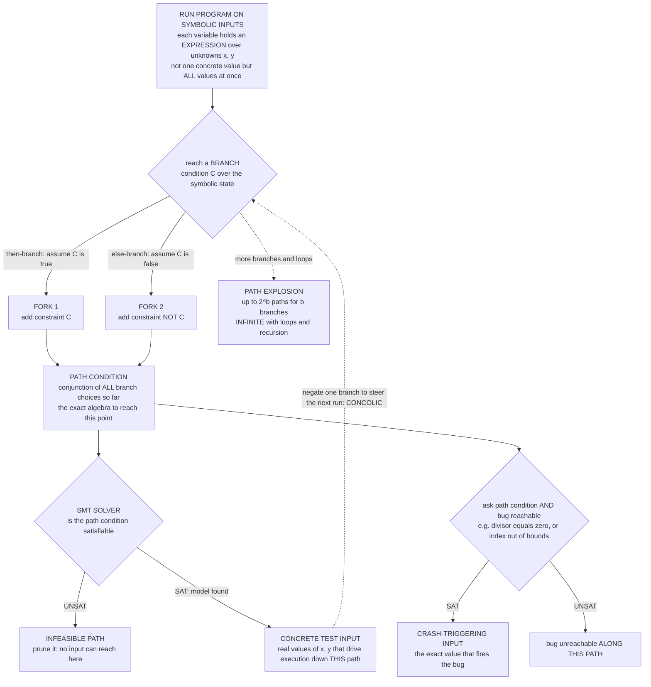

# 🧭 Symbolic Execution

> [!abstract] TL;DR
> **Symbolic execution** runs a program not on a *concrete* input like `7`, but on a **symbol** `x` — an unknown standing for *all* possible inputs at once. The program state maps every variable to a symbolic **expression** over the inputs, and at each **branch** the analysis **forks** into two, each accumulating a **path condition**: the conjunction of branch predicates that must hold to follow that path. Feed a path condition to an **SMT solver** and, if it is **satisfiable**, the solver's model *is* a **concrete input** that drives the program down that exact path; feed it `path condition ∧ bug-reachable` and a SAT answer hands you the precise value that triggers a divide-by-zero, assertion failure, or buffer overflow. This turns **bug-hunting into equation-solving** and powers automatic **test-case generation** and **crash reproduction** (KLEE, SAGE, angr). Its defining limitation is **path explosion** — the number of paths grows *exponentially* in the number of branches and is *infinite* with loops/recursion — which is why the practical variant, **concolic / dynamic symbolic execution** (DART, CUTE, SAGE), interleaves real concrete runs with symbolic constraint-collection to tame the blow-up, the environment, and the solver. It is **directed, path-precise testing**, not sound verification: finding no bug does not prove correctness, because unexplored paths remain.

---

## Intuition

**Analogy — instead of testing with one number, test with the *idea* of every number.** Ordinary testing feeds the program a concrete value like `7` and watches what happens on that single run. Symbolic execution instead feeds it the **symbol** `x` — a placeholder standing for *all* possible inputs simultaneously. As the program runs, it does not compute numbers; it builds up **algebra**: "we took the then-branch, so `x` must be greater than `5`; then we computed `x − 5` and divided by it." Every branch the code could take **splits the analysis into parallel universes**, and each universe carries the exact list of conditions needed to reach it. Then you can turn to a solver and ask a pointed question — *"in this universe, can `x` be `5` right here?"* — and if the answer is yes, you have not just found a bug in the abstract, you have the **precise input that triggers it**: a real value that walks the program straight into a divide-by-zero.

That reframes debugging as **solving equations**. Where testing gambles on which inputs to try and hopes to stumble onto the crash, symbolic execution reasons about *whole classes* of inputs at once and asks a constraint solver to manufacture the witness. It is exactly how modern automated tools generate crash-triggering inputs for real software — and why one symbolic run can subsume millions of concrete test cases.

---

## How It Works

### Core Mechanics

**1. Symbolic inputs and a symbolic store.** Instead of concrete values, the program's inputs are fresh **symbols** `α, β, …`. The execution engine maintains a **symbolic state** that maps each program variable to an **expression over those symbols** rather than a number: after `w = x - 5`, the store records `w ↦ α − 5`, not `w ↦ 1`. Every assignment updates expressions by substitution — this is essentially computing the **strongest postcondition** along the current path.

**2. Branches fork execution and add a constraint.** When control reaches a conditional `if C`, the engine cannot decide `C` (the inputs are unknown), so it **forks**: one successor assumes `C` is *true*, the other assumes it is *false*. Each successor **conjoins the corresponding predicate** onto its running record. The `then` fork adds `C`; the `else` fork adds `¬C`, both expressed over the input symbols.

**3. The path condition is the conjunction of choices.** For any single path, the accumulated constraint is the **path condition (PC)** — the logical *and* of every branch predicate taken to reach the current point, e.g. `α > 5 ∧ β = α − 5`. The PC is the **exact algebra of reachability**: any concrete input satisfying it will drive the real program down precisely this path, and any input violating it never will.

**4. The SMT solver decides feasibility and manufactures inputs.** At any program point the engine hands the PC to an **SMT solver** (satisfiability modulo theories — arithmetic, bit-vectors, arrays for memory). Three uses follow:
   - **Feasibility / pruning:** if the PC is **UNSAT**, the path is *infeasible* — no input can reach it — and the fork is discarded, saving work.
   - **Test generation:** if the PC is **SAT**, the solver's **model** is a **concrete input** exercising that path; collecting one model per feasible path yields a test suite with high path coverage.
   - **Bug-finding:** ask `PC ∧ (bug condition)` — e.g. `PC ∧ divisor = 0`, `PC ∧ index ≥ length`, or `PC ∧ ¬assertion`. A SAT answer returns the **crash-triggering input**; UNSAT proves that *bug unreachable along this path*.

**5. Path explosion — the defining limit.** Each branch potentially *doubles* the number of paths, so a straight-line program with `b` branches has up to `2^b` paths, and a **loop** whose body branches has an **unbounded** (effectively infinite) number of paths as it iterates. This **exponential-to-infinite blow-up** is the central obstacle: the engine must **bound loops/recursion**, **prune** infeasible paths, **merge** states, or **prioritize** which paths to explore with search heuristics rather than enumerate them all.

**6. Environment and solver costs.** Real programs call the operating system, libraries, and read files — the **environment** the pure symbolic engine cannot see through. Modeling syscalls and library behavior symbolically is hard and labor-intensive, and the constraint queries themselves can be **expensive** (nonlinear arithmetic, complex pointer/heap constraints), so solver time often dominates.

**7. The practical fix — concolic / dynamic symbolic execution.** **Concolic** execution (*conc*rete + symb*olic*: DART, CUTE, SAGE) runs the program on a **real concrete input** while *simultaneously* collecting the symbolic path condition. Whenever the concrete run hits the environment, the concrete value is used (no modeling needed); to explore a new path, the engine **negates one branch predicate** in the collected PC and solves for the next concrete input, steering the following run down an unexplored path. This tames environment modeling and solver blow-up and is what made **Microsoft's SAGE** "whitebox fuzzing" scale to find many Windows/Office bugs.

**8. Positioning — directed testing, not sound verification.** Symbolic execution finds **real bugs with concrete witnesses**, so a reported bug is never a false alarm. But because it cannot explore *all* the infinitely many paths, **finding no bug does not prove correctness** — absence of found bugs ≠ verified absence of bugs. It is *directed, path-precise testing* that complements over-approximate static analysis and exhaustive model checking rather than replacing them.

### Flow / Architecture



---

## Key Concepts

### Secondary (intuitive core)
- **Symbolic input.** Instead of a specific number, use the letter `x` standing for *every* possible input at once.
- **Path condition.** The list of yes/no branch choices — joined by "and" — that a real input would have to satisfy to follow one particular route through the code.
- **Solver.** A tool you ask "can these conditions all be true together, and if so give me an example" — its example is a concrete input.
- **Bug input.** Add "and here it divides by zero" to a path condition; if the solver says yes, it hands you the exact input that crashes the program.
- **Path explosion.** Every branch splits the search in two, so the number of routes grows explosively — and loops make it endless. This is the main thing that makes it hard.

### Undergraduate (formal machinery)
- **Symbolic store & strongest postcondition.** State maps variables to expressions over input symbols; walking a path computes its strongest postcondition, and the branch predicates accumulate into the PC.
- **Forking semantics.** At `if C`: successor states get `PC ∧ C` and `PC ∧ ¬C`. Feasibility of each is an [[SAT_Solving_and_DPLL|SAT]]/SMT query; UNSAT forks are pruned.
- **SMT theories in play.** Linear/nonlinear arithmetic, **bit-vectors** (faithful machine integers/overflow), and **arrays** (memory/heap) — see [[Decision_Procedures_and_Theories|decision procedures]].
- **Test generation vs bug-finding.** One SAT model per feasible path gives a coverage-maximizing test suite; `PC ∧ error` gives a crash witness (assertion failure, division-by-zero, out-of-bounds).
- **Loop handling.** Loops must be **bounded** (unroll to depth `k`) or given **invariants**; unbounded loops make the path set infinite.
- **Concolic loop.** Run concrete → record PC → **negate a suffix branch** → solve for the next input → repeat, systematically covering new paths (DART/CUTE).

### Graduate (the hard subtleties)
- **Path explosion, quantified.** `b` sequential branches yield up to `2^b` paths; loops give unboundedly many. Mitigations: **state merging** (join states with disjunctive PCs, trading solver hardness for fewer paths), **path pruning** via subsumption, **compositional / summary-based** execution (function summaries reused at call sites, à la SMART), and **search heuristics** that *prioritize* paths (coverage-guided, [[A_Star_Search|guided search]], generational search in SAGE).
- **Undecidability underneath.** Deciding exact reachability of an arbitrary program point reduces to the [[The_Halting_Problem_and_Undecidability|halting problem]]; symbolic execution is a *semi-decision* procedure — it can confirm reachability with a witness but cannot in general certify unreachability of every path.
- **Environment problem.** Syscalls, files, network, and library code break the symbolic model; solutions include **environment models** (KLEE's POSIX model), **concretization** (fix symbolic values to concrete ones at the boundary, at the cost of under-approximation), and **selective symbolic execution** (S2E: symbolic in-scope, concrete out-of-scope).
- **Solver cost & incrementality.** Query time dominates; engines exploit **constraint caching**, **counterexample/implied-value caching**, **independent-constraint slicing**, and **incremental SMT** to reuse solver work across forks.
- **Soundness vs completeness framing.** Symbolic execution under-approximates the reachable behaviors (it explores *some* paths precisely) — dual to over-approximate abstract interpretation, which reasons about *all* behaviors imprecisely. Neither alone is both sound-for-verification and precise; hybrids (e.g. **veritesting**) combine them.
- **Memory & pointers.** Symbolic pointers/aliasing force either **theory-of-arrays** encodings or **address concretization**; fully symbolic heaps (as in separation-logic-based engines) remain a research frontier.

---

## Python Demo

We build a **tiny symbolic executor** by hand. Part (a) takes a small function with **nested branches over symbolic inputs `x, y`** — containing a **hidden divide-by-zero** — represents it as a decision tree, and **enumerates every execution path**, building each path's **path condition** as a conjunction of branch predicates. For each path we "solve" the PC with a brute-force stand-in for an SMT solver to get a **concrete input** that follows it, and we **flag the bug path**, emitting the exact crash-triggering input. Part (b) plots the **path-explosion** curve — number of paths `= 2^branches` — the exponential blow-up that is symbolic execution's defining limitation, and annotates that **loops make the path count infinite**.

```python
# Symbolic execution by hand: enumerate paths, build path conditions, solve for inputs,
# flag the divide-by-zero path -- then show path explosion (2^branches, infinite with loops).
import numpy as np
import matplotlib.pyplot as plt

# ---- Symbolic program as a decision tree over inputs x, y --------------------------------
# The modelled function (a classic King-style example with a hidden divide-by-zero):
#     if x > 5:
#         w = x - 5
#         if y == w:            -> return 100 // (y - w)   # BUG: y - w == 0 -> DIV BY ZERO
#         else:                 -> return x + y
#     else:
#         if y > 0:             -> return x * y
#         else:                 -> return x - y
class Branch:
    def __init__(self, label, pred, t, f):
        self.label, self.pred, self.t, self.f = label, pred, t, f   # pred: (x,y)->bool
class Leaf:
    def __init__(self, label, bug=False):
        self.label, self.bug, self.pred = label, bug, None

tree = Branch("x > 5", lambda x, y: x > 5,
        Branch("y == x-5", lambda x, y: y == x - 5,
               Leaf("100 // (y-(x-5))  ->  DIVIDE BY ZERO", bug=True),
               Leaf("return x + y")),
        Branch("y > 0", lambda x, y: y > 0,
               Leaf("return x * y"),
               Leaf("return x - y")))

def enumerate_paths(node, pc, paths):
    """DFS the tree; pc = list of (label, effective-predicate) = the PATH CONDITION."""
    if isinstance(node, Leaf):
        paths.append((pc, node)); return
    enumerate_paths(node.t, pc + [(node.label, node.pred)], paths)          # then: add C
    neg = (lambda p: (lambda x, y: not p(x, y)))(node.pred)                  # else: add NOT C
    enumerate_paths(node.f, pc + [("NOT(" + node.label + ")", neg)], paths)

def smt_solve(pc, lo=-12, hi=12):
    """Stand-in for an SMT solver: search a small integer grid for a model of the conjunction."""
    for x in range(lo, hi + 1):
        for y in range(lo, hi + 1):
            if all(p(x, y) for _, p in pc):
                return (x, y)
    return None                                                             # UNSAT (infeasible)

paths = []
enumerate_paths(tree, [], paths)

print(f"symbolic execution enumerated {len(paths)} paths\n")
bug_input = None
for i, (pc, leaf) in enumerate(paths, 1):
    cond  = " AND ".join(lbl for lbl, _ in pc)
    model = smt_solve(pc)
    tag   = "  <-- BUG PATH" if leaf.bug else ""
    print(f"path {i}: PC = [{cond}]{tag}")
    print(f"        leaf : {leaf.label}")
    if model is None:
        print("        solve: UNSAT  (infeasible path, pruned)")
    else:
        print(f"        solve: SAT    concrete input x={model[0]}, y={model[1]}")
        if leaf.bug:
            bug_input = model
    print()

if bug_input:
    x, y = bug_input
    print(f">>> CRASH-TRIGGERING INPUT generated: x={x}, y={y}  "
          f"(then y-(x-5) = {y-(x-5)}  ->  divide-by-zero)")

# ---- (b) Path explosion: number of paths vs number of branches (2^b) --------------------
b = np.arange(0, 21)
paths_count = 2.0 ** b                                                       # balanced tree: 2^b leaves

# ============================== Visualization ==============================
fig, (axT, axE) = plt.subplots(1, 2, figsize=(15, 6.2))

# ---- Plot 1: the symbolic-execution tree with path conditions ----
def layout(node, depth, xcounter, pos, edges, parent=None, edge_lbl=None):
    if isinstance(node, Leaf):
        x = xcounter[0]; xcounter[0] += 1
        pos[id(node)] = (x, -depth, node.label, node.bug, True)
        if parent is not None: edges.append((parent, id(node), edge_lbl))
        return x
    xs = []
    xs.append(layout(node.t, depth + 1, xcounter, pos, edges, id(node), "T: " + node.label))
    xs.append(layout(node.f, depth + 1, xcounter, pos, edges, id(node), "F"))
    x = sum(xs) / len(xs)
    pos[id(node)] = (x, -depth, node.label, False, False)
    if parent is not None: edges.append((parent, id(node), edge_lbl))
    return x

pos, edges = {}, []
layout(tree, 0, [0], pos, edges)
for a, b_, lbl in edges:
    (x1, y1, *_), (x2, y2, *_) = pos[a], pos[b_]
    axT.plot([x1, x2], [y1, y2], "-", color="0.6", lw=1.3, zorder=1)
    axT.text((x1 + x2) / 2, (y1 + y2) / 2, lbl, fontsize=7.5, color="darkred",
             ha="center", va="center",
             bbox=dict(boxstyle="round,pad=0.15", fc="white", ec="none", alpha=0.85), zorder=2)
for nid, (x, y, label, bug, is_leaf) in pos.items():
    if bug:          col, tc = "crimson", "white"
    elif is_leaf:    col, tc = "steelblue", "white"
    else:            col, tc = "gold", "black"
    shape = "s" if is_leaf else "o"
    axT.scatter([x], [y], s=1700, marker=shape, color=col, edgecolors="black", zorder=3)
    axT.text(x, y, label, ha="center", va="center", fontsize=7.5, color=tc,
             fontweight="bold", zorder=4)
axT.set_title("SYMBOLIC EXECUTION TREE\neach branch FORKS + adds a constraint; leaves = paths; "
              "red = divide-by-zero bug path", fontsize=10)
axT.axis("off"); axT.margins(0.12)

# ---- Plot 2: path explosion ----
axE.semilogy(b, paths_count, "o-", color="crimson", lw=2.2, label=r"paths $= 2^{\,b}$")
axE.fill_between(b, 1, paths_count, color="crimson", alpha=0.08)
axE.axhline(paths_count[-1], ls=":", color="0.5", lw=1)
axE.annotate("loops / recursion:\npaths -> INFINITE",
             xy=(20, paths_count[-1]), xytext=(9.5, 3e4),
             fontsize=10, color="black", ha="center",
             arrowprops=dict(arrowstyle="->", color="black"))
axE.set_xlabel("number of branches  b  (or loop unrollings)")
axE.set_ylabel("number of execution paths (log scale)")
axE.set_title("PATH EXPLOSION\npaths grow EXPONENTIALLY in branches -> the defining limitation",
              fontsize=10)
axE.grid(True, which="both", ls=":", alpha=0.5)
axE.legend(loc="upper left", fontsize=10)

plt.tight_layout()
plt.savefig("symbolic_execution.png", dpi=130, bbox_inches="tight")
print("\nsaved figure -> symbolic_execution.png")
```

**What the run shows.** The executor enumerates **4 paths** through the nested branches. Three take ordinary return leaves and each yields a concrete satisfying input from the "solver" (for example `x > 5 ∧ y ≠ x−5` is solved by `x=6, y=0`). The fourth path carries the **path condition `x > 5 AND y == x−5`** and lands on the divide-by-zero leaf: the solver reports **SAT** and manufactures the exact **crash-triggering input** `x=6, y=1`, for which `y − (x−5) = 0`. That is symbolic execution's whole value in miniature — a path condition plus a bug predicate, handed to a solver, becomes a concrete failing test. The right panel plots why it does not scale for free: the number of paths is `2^b` in the branch count `b`, exploding exponentially, and the annotation marks that a single loop pushes the path set to **infinity** — the reason real engines bound loops, prune, merge, and prioritize rather than enumerate.

---

## Real-World Applications

- **KLEE (LLVM).** The canonical open-source symbolic executor: runs LLVM bit-code with symbolic inputs, models the POSIX environment, and auto-generates high-coverage tests. In its OSDI'08 debut it achieved higher line coverage than 15 years of hand-written tests on the GNU **COREUTILS** and found dozens of real bugs, including crashes in decades-old Unix utilities.
- **SAGE at Microsoft (whitebox fuzzing).** Godefroid's **concolic** engine ran on Windows and Office file parsers, negating branch constraints to reach deep code. SAGE found a large fraction of the security bugs in Windows 7 pre-release fuzzing — famously catching defects that traditional random/black-box fuzzers missed — and ran continuously on server farms.
- **angr and binary analysis.** The **angr** framework brings symbolic and concolic execution to *stripped binaries* (no source), used for vulnerability discovery, exploit generation, and CTF automation. It powered "Mayhem" and other systems in **DARPA's Cyber Grand Challenge**, where machines autonomously found, proved, and patched binary vulnerabilities.
- **Automatic exploit generation.** Symbolic execution over a program plus a memory-safety violation predicate can synthesize inputs that not only crash but **hijack control flow** (AEG, Mayhem) — the same machinery used defensively for [[Exploitation_Techniques|exploitability triage]] of crash reports.
- **Java PathFinder and unit-test generation.** JPF/**SPF** (Symbolic PathFinder) and tools like Pex/**IntelliTest** (whitebox for .NET) generate parameterized unit tests and high-coverage [[Test_Case_Design|test cases]] by solving path conditions, integrating symbolic reasoning directly into developer workflows.
- **S2E (selective symbolic execution).** Runs a whole system (kernel + drivers + libraries) with symbolic execution *only* where it matters and concrete execution elsewhere, used to test device drivers and performance/coverage properties of large, unmodified software stacks.

---

## Common Pitfalls

- **Expecting exhaustive verification.** Symbolic execution is **directed testing**, not a proof of correctness. A reported bug is real (it comes with a concrete witness), but **no bug found ≠ correct** — the infinitely many unexplored paths may still hide defects. Do not read a clean symbolic run as "verified."
- **Underestimating path explosion.** The path count is `2^b` in branches and **infinite** with loops/recursion; naive full enumeration dies quickly. Treat **loop bounding, pruning, state merging, and search prioritization** as first-class design choices, not afterthoughts — and pick a *search heuristic* deliberately.
- **Unbounded loops and recursion.** Without a depth bound or a loop invariant the engine forks forever and never terminates. Every practical run **bounds** iterations (and must accept that bugs requiring deeper iteration are missed).
- **Forgetting the environment.** Syscalls, file/network I/O, and third-party libraries are invisible to a pure symbolic engine. Failing to **model** or **concretize** them yields wrong or stuck paths; concretization restores progress but *under-approximates*, potentially masking behaviors.
- **Ignoring solver cost.** Rich path conditions (nonlinear arithmetic, deep bit-vector or array constraints, symbolic pointers) can make **SMT queries** the bottleneck. Without constraint caching, slicing, and incremental solving the analysis stalls on solver time, not path count.
- **Pure symbolic where concolic is needed.** For real-world code with heavy environment interaction, **concolic / dynamic symbolic execution** (concrete values through the messy parts, symbolic constraints collected alongside — DART/CUTE/SAGE) is usually the only thing that scales. Reaching for pure symbolic execution on such targets is a common misstep.
- **Confusing it with fuzzing or static analysis.** Coverage-guided **fuzzing** mutates concrete inputs (fast, shallow at hard branches); **static analysis / abstract interpretation** over-approximates *all* paths (sound but imprecise). Symbolic execution is the precise-but-under-approximating middle — best combined with the others (e.g. hybrid fuzzing), not treated as a drop-in replacement.
- **Assuming solver models are the *only* input.** A satisfying model exercises a path, but semantically equivalent inputs may behave differently under un-modeled state (time, randomness, concurrency). Reproducing a crash sometimes needs more than the PC captures.

---

## Related Concepts

- [[SAT_Solving_and_DPLL]] — the Boolean core beneath the SMT engine that decides each path condition's satisfiability and returns models; symbolic execution is one of SAT/SMT's biggest industrial consumers.
- [[Decision_Procedures_and_Theories]] — path conditions live in theories of arithmetic, bit-vectors, and arrays; the decision procedures for these theories are exactly what turn a PC into a concrete input or a "no such input."
- [[Hoare_Logic_and_Axiomatic_Semantics]] — walking a path and accumulating its condition is computing a **strongest postcondition**; symbolic execution is the operational, per-path cousin of axiomatic reasoning.
- [[Model_Checking_Fundamentals]] — the other automated bug-finder: model checking explores an abstracted *state* space exhaustively (and fights *state* explosion), while symbolic execution explores the *path* space precisely (and fights *path* explosion); both return concrete counterexamples.
- [[Control_Flow_and_Data_Flow_Analysis]] — the CFG and data-flow facts that engines like KLEE use to slice constraints, guide search, and identify feasible branches to fork on.
- [[Intermediate_Representations]] — symbolic executors operate over an IR (LLVM bit-code for KLEE, VEX for angr), where uniform instructions make symbolic interpretation and constraint generation tractable.
- [[The_Halting_Problem_and_Undecidability]] — exact reachability of a program point is undecidable, so symbolic execution is a *semi-decision* procedure: it can witness reachability but cannot generally certify unreachability of every path.
- [[Test_Case_Design]] — symbolic/concolic execution is *automated* whitebox test-case design, generating inputs that maximize path coverage far beyond hand-crafted boundary cases.
- [[Exploitation_Techniques]] — the same PC-plus-violation solving that generates crash inputs underlies automatic exploit generation and exploitability triage in offensive security.
- [[A_Star_Search]] — path-prioritizing search heuristics (coverage-guided, distance-to-target) decide *which* forks to explore first, the practical answer to path explosion — a search-strategy problem, not just a solver problem.

*Siblings in this section (05 — Static Analysis & Abstraction), referenced here in prose: **Static_Program_Analysis** (the over-approximate, all-paths counterpart), **Bounded_Model_Checking** (unroll to depth k and hand the whole thing to SAT — the same solving-based bug hunt from the state-space side), and, from earlier sections, **SMT_Solving_and_Satisfiability_Modulo_Theories** (the solver the path conditions are shipped to), **Weakest_Preconditions_and_Predicate_Transformers** (the dual, backward predicate-transformer view of the same path algebra), and **Formal_Methods_in_Security_and_Cryptography** (where symbolic execution powers vulnerability discovery and exploit generation).*

---

## Review Questions

1. **(Secondary)** Using the "test with the idea of every number instead of one number" analogy, explain what a *path condition* is and how a solver uses it to produce a single input that crashes the program. Why can one symbolic run stand in for many ordinary tests?
2. **(Undergraduate)** For the demo function, hand-derive the path condition of the divide-by-zero path and explain, predicate by predicate, why `x=6, y=1` satisfies it while `x=6, y=0` does not. What query would you send the solver to *prove* the bug is unreachable on a given path?
3. **(Undergraduate)** Distinguish **pure symbolic execution** from **concolic (dynamic symbolic) execution**. Give one concrete situation — involving the environment or the solver — where concolic execution succeeds and pure symbolic execution stalls, and explain the mechanism (concretization / branch negation).
4. **(Graduate)** Quantify **path explosion** for a program with `b` sequential branches and for one with a loop. Compare two mitigation strategies — **state merging** versus **search prioritization** — explaining what each trades away (solver hardness vs coverage/completeness) and why neither eliminates the problem.
5. **(Graduate)** Symbolic execution *under-approximates* reachable behavior while abstract interpretation *over-approximates* it. Explain why this makes symbolic execution **sound for bug-finding but unsound for verification**, connect the limitation to the undecidability of reachability, and describe how a hybrid (e.g. veritesting or hybrid fuzzing) tries to get the best of both.

---

## Sources

- King, J. C. "Symbolic Execution and Program Testing." *Communications of the ACM*, 19(7), 1976 — the founding paper introducing symbolic inputs, path conditions, and constraint-solving for test generation.
- Cadar, C., Dunbar, D. & Engler, D. "KLEE: Unassisted and Automatic Generation of High-Coverage Tests for Complex Systems Programs." *OSDI*, 2008 — the LLVM-based symbolic executor and its COREUTILS results.
- Godefroid, P., Klarlund, N. & Sen, K. "DART: Directed Automated Random Testing." *PLDI*, 2005 — the origin of concolic / dynamic symbolic execution (with CUTE, Sen et al.).
- Cadar, C. & Sen, K. "Symbolic Execution for Software Testing: Three Decades Later." *Communications of the ACM*, 56(2), 2013 — the definitive survey of techniques, tools (KLEE, SAGE, angr, S2E, JPF), and path-explosion mitigations.
- Godefroid, P., Levin, M. Y. & Molnar, D. "Automated Whitebox Fuzz Testing." *NDSS*, 2008 — SAGE and the concolic whitebox-fuzzing approach that scaled bug-finding at Microsoft.

---

#formal-methods #symbolic-execution #concolic-testing #path-conditions #test-generation
