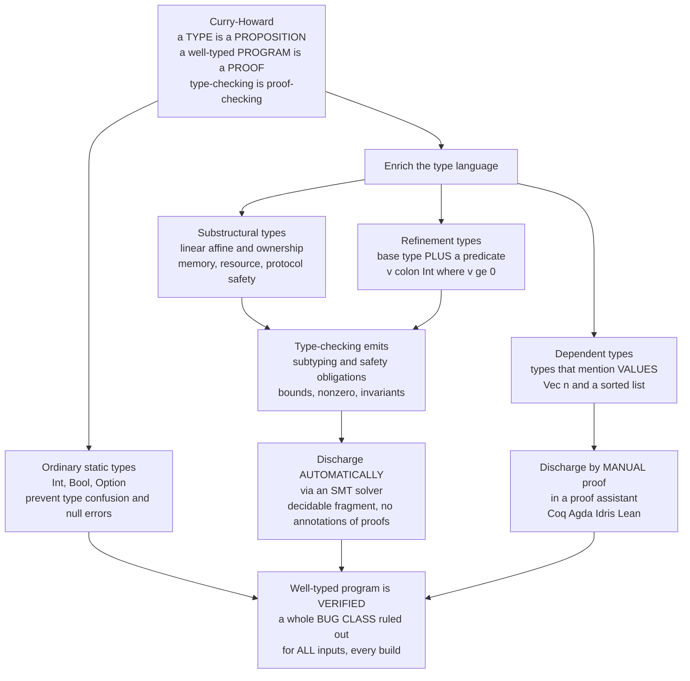

# 🏷️ Type-Based Verification

> [!abstract] TL;DR
> A **type checker is a proof you never realized you were writing.** When the compiler accepts a function as `Int -> Int`, it has *proven*, for **all inputs**, that the code will never confuse a number with a string — a small correctness theorem, discharged instantly and automatically on **every build**. **Type-based verification** is the deliberate exploitation of this fact: crank up the expressiveness of the type system and the *same* always-on, automatic, sound checking machinery starts proving *bigger* theorems. The engine is the **Curry-Howard correspondence** — **types are propositions, well-typed programs are proofs, type-checking is proof-checking** — and the theoretical guarantee is **soundness** (**progress + preservation** → *"well-typed programs don't go wrong"*). The technology spans a whole spectrum by type-system power: (1) **ordinary static types** prevent type confusion and, with `Option`/`Maybe`, null-dereference; (2) **substructural types** — **linear/affine & ownership/borrowing** (Rust), **session types** for protocols, **effect types** — enforce **memory and resource safety** with *no runtime cost*; (3) **refinement types** decorate a base type with an **SMT-checkable predicate** — `{v:Int | v >= 0}`, `{v:Int | 0 <= v < len a}` — so type-checking emits **subtyping / verification obligations** that a solver discharges **automatically** (LiquidHaskell, Liquid types, F\*, Dafny), catching array-bounds and division-by-zero for modest annotation; (4) **dependent types** let types mention **values** (`Vec n`, "a sorted list"), expressive enough for **full functional correctness** but checked by **manual proof** in assistants (Coq, Agda, Idris, Lean). The one iron law is the **expressiveness-vs-automation tradeoff**: refinement types are automatic but limited to a decidable fragment; dependent types can state anything but hand you the proof burden. This is the **most pervasive and gradual** verification technology in existence — the prover hidden inside the everyday act of type-checking.

---

## Intuition

**Analogy — a proof you never realized you were writing.** Every time you write a function and the compiler stamps it `int -> int`, something quietly remarkable has happened: the machine has *proven*, once and for all, that no execution of that function on *any* input will ever add a number to a string, index a record with a boolean, or call a method that doesn't exist. You did not write a proof. You did not run a prover. You wrote code, hit build, and got — for free, in milliseconds, on every single compile — **a small correctness theorem, mechanically checked**. That is what a type system *is*: a compile-time, automatic, sound proof system whose theorems you were collecting all along without noticing.

Now imagine giving those types more vocabulary. Instead of a type that can only say *"an integer,"* let it say *"an integer **between 0 and the array's length**,"* or *"a **positive** integer,"* or *"a list that is **sorted**."* Suddenly the same instant, automatic type-check is proving that your index is **in bounds**, that your divisor is **nonzero**, that your invariant **holds**. **Refinement types** and **dependent types** push type-checking all the way into full-blown verification — turning *"it compiles"* into *"it's proven correct"* — with the prover hidden inside the everyday, unglamorous act of getting your program to type-check. Intuition first: a type is already a theorem; verification is just teaching types to say more.

---

## How It Works

### Core Mechanics

1. **A type system is a sound, automatic proof system.** A **type judgment** `Γ ⊢ e : τ` is a *derivation* — a proof tree — that expression `e` has type `τ` under context `Γ`. The type checker *constructs* this proof mechanically. What makes it a genuine guarantee rather than a syntactic ritual is the **soundness** meta-theorem, proved as two lemmas: **progress** (a well-typed term is either a value or can take a step — it never gets *stuck*) and **preservation** / *subject reduction* (a step from a well-typed term lands in a well-typed term). Together: *"well-typed programs don't go wrong."* The class of "going wrong" is exactly the class of errors the type discipline rules out — for **all** inputs, without running the program.
2. **Curry-Howard turns types into propositions.** The correspondence is exact, not metaphorical: **implication ↔ function type**, **conjunction ↔ product/pair**, **disjunction ↔ sum**, **true ↔ unit**, **false ↔ the empty type**, **∀ ↔ dependent function (`Π`)**, **∃ ↔ dependent pair (`Σ`)**. So a **type is a proposition**, a **well-typed program of that type is a constructive proof**, and **type-checking is proof-checking**. The richer the type language, the bigger the propositions you can state — and prove — just by making your program type-check.
3. **Enrich types with predicates → refinement types.** A **refinement type** is a base type *plus a logical predicate*: `{v:Int | v >= 0}` (naturals), `{v:Int | 0 <= v < len a}` (valid indices into `a`), `{v:Int | v > 0}` (positives). A function's signature becomes a **contract in the type**: `head : {xs:List a | len xs > 0} -> a`, `div : Int -> {d:Int | d != 0} -> Int`. To type-check a use site, the checker performs **refinement subtyping**: to pass a value known to satisfy `{v | q(v)}` where `{v | p(v)}` is required, it must show `∀v. q(v) ⇒ p(v)`. Each such check is a **verification condition (VC)** — a logical formula whose validity means the use is safe.
4. **Discharge obligations automatically via SMT.** Because refinement predicates are drawn from a **decidable fragment** (linear arithmetic, arrays, uninterpreted functions), the VCs are shipped to an **SMT solver** (Z3, CVC5), which decides each one *automatically*. All VCs valid → the program is **well-typed = verified**: array accesses are provably in bounds, divisors provably nonzero, invariants provably maintained — with only lightweight annotation and **no runtime checks**. This is the LiquidHaskell / Liquid-types / F\* model.
5. **Enrich types with values → dependent types.** A **dependent type** mentions a *value*: `Vec n` (a vector of length exactly `n`), `Fin n`, `Sorted xs`. Now a type can express **any** proposition of predicate logic, so a program can be proven **fully functionally correct** — but checking may require *arbitrary* proofs, so the obligations are discharged by **interactive proving** in a proof assistant (Coq, Agda, Idris, Lean). Maximum expressiveness, maximum manual effort.
6. **The spectrum in between — substructural types.** Not all safety is about numbers. **Linear/affine types** track *how many times* a value may be used; **ownership/borrowing** (Rust) is affine typing applied to memory, giving **no use-after-free, no double-free, no data races** — checked at compile time with **zero runtime cost and no garbage collector**. **Session types** verify that a communication channel follows its protocol; **effect types** track which side effects a computation performs. These prove *resource and protocol* correctness that neither plain types nor pure arithmetic refinements reach.
7. **The governing tradeoff.** Everything above trades **expressiveness against automation and annotation burden.** Refinement types: automatic (SMT decides) but limited to a decidable predicate language. Dependent types: unlimited expressiveness but a human writes the proofs. Ordinary types: fully automatic, fully inferred (Hindley-Milner), but prove only shallow properties. You move along the spectrum by choosing how much you are willing to say — and pay for.

### Flow / Architecture



*Curry-Howard is the hinge: types are propositions. Ordinary types already verify a bug class automatically. Enriching the type language with predicates (refinement) or values (dependent) — or with usage discipline (substructural) — turns type-checking into obligation-generation. Refinement obligations go to an SMT solver automatically; dependent obligations need manual proof. Either way, a well-typed program is a verified one.*

---

## Key Concepts

### Secondary (intuitive, no advanced background needed)

- **Types already prove things.** `int -> int` is a proof that the function never confuses a number with a string, checked for *every* input on every build. You were writing proofs without knowing it.
- **A richer type says more.** *"An integer"* proves little. *"An integer that is a valid index of this array"* proves your program never reads out of bounds.
- **The prover is invisible.** With refinement types, you write almost-normal code plus a few annotations; a solver silently proves the hard parts while you just try to make it compile.
- **Rust's borrow checker is this idea shipped to millions.** Its rules about who *owns* a value are types that prove your program has no use-after-free and no data races — with no runtime cost.
- **Two flavors of "more."** *Predicates* (`v >= 0`) give **refinement types**, checked automatically. *Values in types* (`a list of length 5`) give **dependent types**, checked by hand-written proof.

### Undergraduate (a first course)

- **Curry-Howard correspondence.** Propositions *are* types; proofs *are* programs. Implication is `->`, "and" is `×`, "or" is `+`, false is the empty type, `∀` is the dependent function `Π`, `∃` is the dependent pair `Σ`. Type-checking = proof-checking.
- **Soundness = progress + preservation.** *Progress*: a well-typed term isn't stuck. *Preservation*: reduction keeps it well-typed. Together they yield **"well-typed programs don't go wrong,"** the theorem that makes a type-check a real guarantee.
- **Refinement types.** A base type refined by a predicate: `{v:Int | 0 <= v < len a}`. Function signatures become contracts (`div : Int -> {d | d != 0} -> Int`). Type-checking generates **subtyping VCs** `∀v. q(v) ⇒ p(v)`.
- **SMT discharge.** Refinement VCs live in a **decidable fragment** (linear arithmetic, arrays), so an **SMT solver** (Z3/CVC5) decides them automatically — this is what makes refinement checking *push-button*.
- **Dependent types.** Types indexed by values (`Vec n`, `Fin n`). Enough to state full functional correctness (`sort : (xs:List) -> {ys | Sorted ys ∧ Permutation xs ys}`), but generally requires interactive proof.
- **Inference vs annotation.** Ordinary Hindley-Milner types are *fully inferred*. Refinement types need some annotations (refinements on function boundaries); Liquid types **infer** many refinements via predicate abstraction. Dependent types need the most annotation and explicit proofs.
- **Substructural types.** **Linear** = use exactly once; **affine** = at most once. **Ownership/borrowing** (Rust) is affine typing over memory — the compile-time proof of memory safety without GC.

### Graduate (advanced)

- **Liquid types & predicate abstraction.** *Logically Qualified Data Types* achieve **inference** for refinement types: fix a finite set of **qualifiers** (candidate predicates), then solve the implication constraints as a fixpoint over conjunctions of qualifiers — decidable refinement inference, not just checking (Rondon-Kawaguchi-Jhala).
- **Refinement subtyping is entailment.** `⊢ {v | q} <: {v | p}` reduces to the SMT validity of `q ⇒ p` under the path/context assumptions; the type system's subsumption rule is where *all* the verification power enters. Contexts thread **path conditions** (branch guards) into the antecedent — flow-sensitive refinement.
- **Dependent function/pair types and the Calculus of Constructions.** `Π`/`Σ` types with a universe hierarchy give the CIC underlying Coq. Type equality requires **evaluating** type-level computation (`Vec (2+3) ≡ Vec 5`), demanding **strong normalization** and a **termination checker** — a nonterminating "proof" would inhabit every type and collapse the logic.
- **Effect & monadic types; F\*.** F\* unifies **dependent types + refinement types + a monadic effect system** with an SMT-backed weakest-precondition calculus, then *falls back* to interactive proof (or the Meta-F\* tactic engine) when SMT stalls — spanning the whole spectrum in one language. This is the tooling behind **verified crypto (HACL\*/EverCrypt)**.
- **Type-based vs external verification.** In type-based verification the specification lives **in the type** and the proof is the well-typed program (intrinsic, modular, always-on). External **deductive verification** keeps code and spec separate and generates VCs post-hoc. They meet in the middle: Dafny's specs, F\*'s refinements, and the deductive-verification toolchain all bottom out in the *same* SMT discharge.
- **Substructural logic ↔ resource types.** Rust's borrow checker is **affine logic** operationalized; **linear logic** (`⊗`, `⊸`, `!`) is the proof theory of "consume exactly once," and **session types** are a Curry-Howard image of linear logic for communication (Caires-Pfenning). Effects, ownership, and protocols are all one substructural family.
- **The soundness/expressiveness/decidability trilemma.** You can have automatic *and* sound (refinement, decidable fragment) or expressive *and* sound (dependent, undecidable checking with manual proof), but automatic + expressive + sound is impossible — a direct shadow of Gödel/Rice on the whole enterprise.

---

## Python Demo

We model **refinement types as base types plus an SMT-checkable predicate** and build a tiny **refinement checker**. For a small program (safe array indexing, a division, a `head` on a nonempty list) it **generates the subtyping / verification obligations** — "the index is provably in bounds," "the divisor is provably nonzero" — and **discharges** each one by checking it over the whole domain (a transparent stand-in for an SMT solver's `∀`-decision). It **accepts** the safe program and **rejects** an out-of-bounds / division-by-zero program, reporting the **failing obligation with a concrete counterexample**. Then it visualizes obligations discharged (safe) vs a violated obligation (unsafe), plus a schematic of the **type-as-proposition** idea.

```python
# Refinement types AS checkable specs: a tiny type-based verifier.
#  - A refinement type = base Int + a PREDICATE, e.g. Nat = {v:Int | v >= 0}.
#  - Type-checking a use site emits a SUBTYPING / SAFETY OBLIGATION (a VC).
#  - We DISCHARGE each VC over the whole domain (SMT stand-in for the forall).
#  - The SAFE program's VCs all hold -> ACCEPT; the UNSAFE program has a VC
#    that fails -> REJECT, with a concrete counterexample.
# numpy + matplotlib only.

import numpy as np
import matplotlib.pyplot as plt
from itertools import product

L = 5                      # length of the array `a` the program indexes into

# ---------- refinement predicates (base type Int + a predicate) ----------
Nat = lambda v: v >= 0     # {v:Int | v >= 0}
Pos = lambda v: v >  0     # {v:Int | v >  0}
Idx = lambda v: 0 <= v < L # {v:Int | 0 <= v < len(a)}   (a provably-safe index)

DOMAIN = list(range(0, L + 2))   # bounded integer domain 0..L+1 for the "forall"

# ---------- the discharger: a VC is VALID iff it holds for EVERY state the
#            refinement CONTEXT allows (this is the solver's forall check) ----------
def discharge(name, obligation, context, variables, domain=DOMAIN):
    for combo in product(domain, repeat=len(variables)):
        s = dict(zip(variables, combo))
        if all(c(s) for c in context):        # only states permitted by the refinements
            if not obligation(s):
                return (name, False, s)        # counterexample -> obligation UNSAFE
    return (name, True, None)                   # no violating state -> obligation SAFE

# ---------- the SAFE program ----------
#   given  i : {v | 0 <= v <= L-2}   -- an index with room for i+1
#   read   a[i]   and   a[i+1]        -- both must be provably in bounds
#   given  d : Pos                    -- a positive divisor
#   do     x / d                      -- divisor must be provably nonzero
#   given  m : Pos                    -- a nonempty list length
#   do     head(list of length m)     -- list must be provably nonempty
safe_program = [
    ("a[i]  in bounds",   lambda s: Idx(s["i"]),      [lambda s: 0 <= s["i"] <= L - 2], ["i"]),
    ("a[i+1] in bounds",  lambda s: Idx(s["i"] + 1),  [lambda s: 0 <= s["i"] <= L - 2], ["i"]),
    ("divisor d != 0",    lambda s: s["d"] != 0,      [lambda s: Pos(s["d"])],          ["d"]),
    ("head on nonempty",  lambda s: s["m"] >= 1,      [lambda s: Pos(s["m"])],          ["m"]),
]

# ---------- the UNSAFE program (two refinements too weak) ----------
#   given  i : {v | 0 <= v <= L-1}   -- a full index, NO room for i+1  -> a[i+1] can escape
#   given  d : Nat                   -- allows d == 0                   -> division by zero
unsafe_program = [
    ("a[i+1] in bounds",  lambda s: Idx(s["i"] + 1),  [lambda s: 0 <= s["i"] <= L - 1], ["i"]),
    ("divisor d != 0",    lambda s: s["d"] != 0,      [lambda s: Nat(s["d"])],          ["d"]),
    ("head on nonempty",  lambda s: s["m"] >= 1,      [lambda s: Pos(s["m"])],          ["m"]),
]

def check(title, program):
    print(f"\n=== {title} ===")
    results = [discharge(*ob) for ob in program]
    for name, ok, cex in results:
        tag = "VALID" if ok else f"FAILED   counterexample={cex}"
        print(f"    - {name:20s}: {tag}")
    accepted = all(ok for _, ok, _ in results)
    print("  TYPE-CHECK:", "ACCEPTED (well-typed = verified)" if accepted
          else "REJECTED  (refinement obligation unmet -> bug class present)")
    return results, accepted

safe_res,   safe_ok   = check("SAFE program   (refinements strong enough)", safe_program)
unsafe_res, unsafe_ok = check("UNSAFE program (refinements too weak)",       unsafe_program)

# ---------- visualization ----------
fig, (axL, axR) = plt.subplots(1, 2, figsize=(14, 6))

# (left) obligations discharged: safe vs unsafe
progs   = ["SAFE program\nACCEPTED", "UNSAFE program\nREJECTED"]
passed  = [sum(ok for _, ok, _ in safe_res),   sum(ok for _, ok, _ in unsafe_res)]
failed  = [sum(not ok for _, ok, _ in safe_res), sum(not ok for _, ok, _ in unsafe_res)]
x = np.arange(2)
axL.bar(x, passed, color="#55A868", label="obligations discharged VALID")
axL.bar(x, failed, bottom=passed, color="#C44E52", label="obligation that FAILED")
axL.set_xticks(x); axL.set_xticklabels(progs, fontsize=11)
axL.set_ylabel("verification / subtyping obligations")
axL.set_title("Refinement obligations: safe (all valid) vs unsafe (one violated)")
axL.legend(loc="upper right")
axL.text(0, passed[0] + 0.12, "well-typed\n= VERIFIED", ha="center",
         color="#2A6F3B", fontweight="bold")
cex = next(cx for _, ok, cx in unsafe_res if not ok)
failed_name = next(nm for nm, ok, _ in unsafe_res if not ok)
axL.text(1, passed[1] + failed[1] + 0.12,
         f"bug class present\n{failed_name}\ncounterexample {cex}", ha="center",
         color="#8B2E32", fontweight="bold", fontsize=9)
axL.set_ylim(0, max(len(safe_res), len(unsafe_res)) + 1.2)

# (right) schematic: type-as-proposition -> obligation -> discharge -> verified
axR.axis("off")
axR.set_title("Type-as-proposition: a refinement type is a checkable spec")
boxes = [
    (0.5, 0.86, "REFINEMENT TYPE\n{ v:Int | 0 <= v < len a }", "#4C72B0"),
    (0.5, 0.62, "read as a PROPOSITION  (Curry-Howard)\nfor all v in context,  0 <= v < len a", "#8172B3"),
    (0.5, 0.38, "type-check emits an OBLIGATION\nq(v)  =>  0 <= v < len a", "#DD8452"),
    (0.5, 0.14, "SMT discharges it  ->  WELL-TYPED = VERIFIED\n(array access provably in bounds)", "#55A868"),
]
for cx_, cy_, txt, col in boxes:
    axR.text(cx_, cy_, txt, ha="center", va="center", fontsize=10.5, color="white",
             bbox=dict(boxstyle="round,pad=0.5", facecolor=col, edgecolor="black"))
for y0, y1 in [(0.80, 0.68), (0.56, 0.44), (0.32, 0.20)]:
    axR.annotate("", xy=(0.5, y1), xytext=(0.5, y0),
                 arrowprops=dict(arrowstyle="-|>", lw=2, color="black"))

fig.suptitle("Type-based verification: enrich types with predicates, "
             "type-check = discharge proof obligations", fontsize=13)
fig.tight_layout()
plt.savefig("type_based_verification.png", dpi=120)
print("\nSaved figure to type_based_verification.png")
```

**What it shows.** The **safe** program's four obligations — two array-bounds VCs, a nonzero-divisor VC, a nonempty-list VC — are each **valid for every state the refinement context allows**, so the program **type-checks = is verified**: no runtime bounds check, no runtime null check, the theorem was proved at "compile time." The **unsafe** program weakens two refinements (`i` allowed up to `L-1` with no room for `i+1`; the divisor typed `Nat` instead of `Pos`), and the checker **rejects** it, surfacing the **failing obligation and a concrete counterexample** (e.g. `i = L-1` reads `a[L]` out of bounds; `d = 0` divides by zero) — exactly the signal LiquidHaskell or F\* gives. The right panel is the whole idea in one column: a **refinement type is a proposition**, type-checking **emits it as an obligation**, an **SMT solver discharges it**, and a **well-typed program is a verified one** with an entire bug class ruled out.

---

## Real-World Applications

> **Example — Rust's ownership types: memory safety, mainstream, zero-cost.** Rust's **borrow checker** is **affine/ownership typing** operationalized: every value has a single owner, borrows are tracked as shared-or-exclusive references, and **lifetimes** bound how long a reference may live. Type-checking *proves*, at compile time, that there are **no use-after-free, no double-free, no data races** — the guarantee C/C++ can only hope for via discipline and sanitizers — with **no garbage collector and no runtime overhead**. This is type-based verification of *resource safety* deployed at industrial scale, and the single biggest reason a substructural type system reached millions of everyday programmers.

- **LiquidHaskell.** Adds **refinement types** to GHC Haskell: annotate `{v:Int | v >= 0}`, `{-@ head :: {xs:[a] | len xs > 0} -> a @-}`, and an SMT solver proves totality, array-bounds, and termination on real libraries (`Data.Vector`, `bytestring`) — verification bolted onto a production language with modest annotation.
- **F\* / HACL\* / EverCrypt.** F\* fuses **dependent + refinement + effect types** with SMT discharge; the **HACL\*** verified crypto library (Curve25519, ChaCha20-Poly1305, SHA-2) is proven memory-safe, functionally correct, and constant-time — and *ships in Firefox, the Linux kernel, and mbedTLS*. Types carrying the spec, verified by checking.
- **Dafny & Liquid-type-style specs.** Dafny's `requires`/`ensures` and array-bounds reasoning are discharged by Z3 much like refinement obligations, powering **AWS's** verified authorization and cryptographic components.
- **TypeScript / typed languages at scale.** Even *ordinary* static typing is verification: literal types, `strictNullChecks`, and discriminated unions catch large classes of `undefined`-dereference and shape-mismatch bugs across giant codebases — the most widely deployed "type as lightweight proof" in the world.
- **Dependent types for certified software.** **Coq** (CompCert verified C compiler, the seL4-adjacent proofs), **Agda**, **Idris**, and **Lean** encode full functional-correctness specs *in types* and machine-check the proofs — the heavyweight end of the same spectrum.
- **Session-typed protocols & effect systems.** Session types (Scribble, Rust `session-types`, MPST tooling) verify that concurrent processes follow their communication protocol, and effect systems (Koka, F\*, OCaml effects) type *what a computation does* — protocol and effect correctness by typing.

---

## Common Pitfalls

- **Forgetting that types *are* lightweight proofs.** Programmers treat the type checker as a nag, not as the automatic prover it is. Every accepted `Int -> Int` is a Curry-Howard proof of a small theorem; the whole discipline is just *choosing how strong a theorem to prove*. Missing this framing makes the refinement/dependent leap look mysterious when it is a smooth continuation.
- **Confusing the points on the spectrum.** **Ordinary types** stop type confusion. **Substructural/ownership** types stop memory and resource errors. **Refinement types** (base + SMT-checkable predicate — LiquidHaskell, Liquid types, F\*) stop bounds/nonzero/invariant violations *automatically*. **Dependent types** (types depend on values — Coq/Agda/Idris/Lean) prove *full* correctness but *manually*. Reaching for the wrong tier wastes enormous effort — full dependent types to prove an array bound, or plain types where you needed a refinement.
- **Ignoring the expressiveness-vs-automation tradeoff.** Refinement types are automatic **only because** they live in a **decidable fragment**; push a predicate outside it (nonlinear arithmetic, unbounded quantifiers) and the SMT solver times out or says `unknown`. Dependent types express anything **only because** they hand you the **proof burden**. There is no free lunch — this is Rice's theorem wearing a type-theory costume.
- **Reading a solver timeout as a bug.** SMT over quantified/nonlinear obligations is only semi-decidable. `unknown`/timeout means *"I couldn't decide,"* **not** *"your code is wrong."* Distinguish a genuine counterexample (a real model) from a non-answer; stabilize with explicit qualifiers, simpler predicates, or helper lemmas.
- **Fighting inference vs annotation blindly.** Ordinary types are fully inferred (Hindley-Milner); refinement types need refinements at *boundaries* (Liquid types infer the interior via predicate abstraction); dependent types need heavy annotation and explicit proofs. Expecting global inference at the dependent end — or hand-annotating what Liquid inference would find — both waste effort.
- **Trusting soundness you don't actually have.** "Well-typed ⇒ can't-go-wrong" holds *only* for the errors in scope of the soundness proof and *only* if the type system is sound. Escape hatches (`unsafe` in Rust, `Obj.magic`/`assume` in F\*, `unsafeCoerce` in Haskell, gradual typing's dynamic boundary) **puncture** the guarantee; a single `unsafe` block can void memory-safety reasoning around it.
- **Treating types as a silver bullet.** Type-based verification proves the properties you *encoded in types*. It says nothing about specs you never wrote, about the compiler/runtime below the type system, or about the trusted core (the type checker, the SMT solver, the language's metatheory). It is the most *pervasive* verification technology, not a *complete* one — and it complements, rather than replaces, external deductive verification and interactive theorem proving.

*(Sibling notes in this section, referenced in prose and built out separately: `Static_Program_Analysis`, `Design_by_Contract_and_Assertions`, `Interactive_Theorem_Proving`, `Deductive_Verification_Tools`, `SMT_Solving_and_Satisfiability_Modulo_Theories` — the last is the engine that discharges refinement obligations, and the deductive tools share the same SMT back-end.)*

---

## Related Concepts

- [[Formal_Methods_Overview]] — the parent field; type-based verification is its *always-on, gradual* branch — proof hidden inside every compile rather than a separate proof activity.
- [[Type_Systems_Fundamentals]] — the base machinery: judgments, soundness (progress + preservation), inference — this note is what happens when you *turn up the power*.
- [[Dependent_Types_and_Advanced_Type_Systems]] — the PLT theory companion (`Π`/`Σ`, GADTs, the lambda cube); here we treat those types **as a verification tool** rather than as language design.
- [[The_Curry_Howard_Correspondence]] — the engine of the whole idea: types are propositions, programs are proofs, type-checking is proof-checking.
- [[Proof_Assistants_and_Dependent_Type_Theory]] — the heavyweight end: Coq/Agda/Idris/Lean discharge dependent-type obligations by interactive proof.
- [[Linear_Logic_and_Resource_Types]] — the proof theory behind substructural/linear/affine types — "use exactly once," the logic under ownership.
- [[Ownership_and_Borrowing]] — Rust's affine-ownership types: the mainstream success story of type-based *memory-safety* verification with zero runtime cost.
- [[Subtyping_and_Variance]] — refinement checking *is* a subtyping problem: `{v | q} <: {v | p}` reduces to the SMT entailment `q ⇒ p`.
- [[Type_Inference_and_Unification]] — the inference side; refinement (Liquid) types recover much of this via predicate abstraction, dependent types largely give it up.
- [[Simply_Typed_Lambda_Calculus]] — where progress + preservation and "well-typed programs don't go wrong" are first proved — the seed theorem this note scales up.
- [[Polymorphism_and_System_F]] — the "terms depend on types" axis; combined with the "types depend on values" axis it maps the lambda cube toward full dependency.
- [[Effect_Systems_and_Program_Analysis]] — effect types as another spectrum point: verifying *what a program does*, not just what it computes.
- [[Gradual_and_Optional_Typing]] — the pragmatic slider between dynamic and static (and between weak and rich) typing — and where soundness leaks at the boundary.
- [[Verified_and_Certified_Languages]] — languages (F\*, Idris, Dafny) built so verification-by-typing is first-class.
- [[Type_Theory_and_the_Foundations_of_Mathematics]] — the foundations view: dependent type theory as an alternative basis for mathematics, the deep end of "types as propositions."
- [[Intuitionistic_and_Constructive_Logic]] — the logic Curry-Howard mirrors: constructive proofs *are* the well-typed programs a type checker accepts.

---

## Review Questions

### Secondary

1. In what sense has the compiler already *proven a theorem* when it accepts a function as `int -> int`? What does that theorem say, and for how many inputs?
2. Explain the difference between a type that says *"an integer"* and one that says *"an integer that is a valid index of this array."* Which one rules out an out-of-bounds read, and why can that be checked without running the program?
3. Rust's borrow checker rejects some programs at compile time. What property is it *proving*, and what is the runtime cost of that proof?

### Undergraduate

1. State the **Curry-Howard correspondence** for `->`, `×`, `+`, `∀`, and `∃`. Using it, explain the slogan "type-checking is proof-checking."
2. Given `div : Int -> {d:Int | d != 0} -> Int`, describe the **verification obligation** generated at a call site `div x y`, and how an SMT solver discharges it. In the Python demo, *which* obligation fails in the unsafe program and what counterexample is returned?
3. Contrast **refinement types** and **dependent types** on three axes: what they can express, how their obligations are discharged (automatic vs manual), and the annotation burden. Give one real tool for each.

### Graduate

1. Explain why refinement types are **automatic but limited** while dependent types are **expressive but manual**, and connect this to the soundness/expressiveness/decidability trilemma. Why is "automatic + expressive + sound" unattainable in general?
2. Refinement subtyping `{v | q} <: {v | p}` reduces to the validity of `q ⇒ p` under path conditions. Explain how **Liquid types** achieve *inference* (not just checking) of such refinements via predicate abstraction over a fixed qualifier set, and what limits this.
3. Compare **type-based (intrinsic) verification** with **external deductive verification** (Hoare-logic VCs) and **interactive theorem proving**. For (a) a length-preserving vector operation, (b) an array-bounds guarantee across a hot loop, and (c) a fully verified sorting routine — which point on the spectrum would you choose, and what would each demand of you?

---

## Sources

- B. C. Pierce. *Types and Programming Languages.* MIT Press, 2002 — the canonical text on type systems, soundness (progress + preservation), and the Curry-Howard correspondence.
- P. M. Rondon, M. Kawaguchi, R. Jhala. "Liquid Types." *PLDI 2008* — logically qualified data types: refinement-type *inference* via predicate abstraction, discharged by SMT. <https://doi.org/10.1145/1375581.1375602>
- N. Vazou, E. L. Seidel, R. Jhala, D. Vytiniotis, S. Peyton Jones. "Refinement Types for Haskell (LiquidHaskell)." *ICFP 2014* — refinement types over a production language, verifying totality and safety. <https://doi.org/10.1145/2628136.2628161>
- N. Swamy et al. "Dependent Types and Multi-Monadic Effects in F\*." *POPL 2016* — unifying dependent types, refinement types, and effects with SMT-backed verification. <https://doi.org/10.1145/2837614.2837655>
- J. Protzenko et al. "Verified Low-Level Programming Embedded in F\* (HACL\*)." *ICFP 2017 / IEEE S&P 2020* — type-based verification producing deployed, high-assurance cryptography.

---

#formal-methods #type-systems #refinement-types #dependent-types #curry-howard
