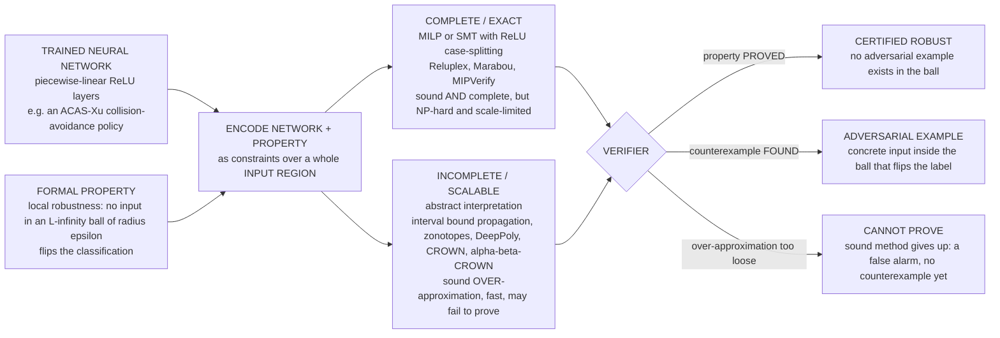

# 🤖 Formal Methods, Machine Learning, and Neural Network Verification

> [!abstract] TL;DR
> A neural network that classifies road signs at **99.9% accuracy** can be flipped from "stop" to "speed limit" by a few carefully placed stickers a human would never notice — an **adversarial example**. When such a network flies a plane or drives a car, *"usually right"* is not *"safe."* **Neural network verification** is the fast-growing frontier where **formal methods meets deep learning**: instead of measuring accuracy on a test set, it tries to **mathematically prove** properties of a *trained* network — most famously **local robustness** ("no input within an ε-ball of this point changes the answer — no adversarial example exists there"), and also **safety** (outputs stay in a safe set — e.g. the ACAS-Xu collision-avoidance network never advises a dangerous maneuver), **monotonicity**, and **fairness**. Because ReLU networks are **piecewise-linear**, exact verification is **NP-hard** (every ReLU is a case split), giving two families of tools: **complete/exact** methods that encode the problem as **mixed-integer linear programming (MILP)** or **SMT** and solve it precisely — *sound and complete but scale-limited* (**Reluplex**, **Marabou**, **MIPVerify**); and **incomplete/scalable** methods built on **abstract interpretation** — **interval bound propagation**, **zonotopes (AI²)**, **DeepPoly/CROWN/α,β-CROWN** — that compute a **sound over-approximation** of the reachable outputs — *fast and scalable but may report "can't prove"* (a false alarm), the recurring **VNN-COMP** champions. The street runs **both ways**: **formal methods FOR ML** (verify networks) and **ML FOR formal methods** (learned loop invariants, SAT/SMT branching heuristics, premise selection, and neural theorem proving). The honest limits: **robustness ≠ correctness**, the **specification gap** (what property even captures "safe"?), scale to frontier-size models, and the fact that verifying a component is not verifying the whole system.

---

## Intuition

**Analogy — a bridge inspector who checks not one truck, but *every* truck that could ever cross.** A classical ML evaluation is like weighing a handful of trucks, watching them cross safely, and declaring the bridge sound: it tests **specific inputs** and reports an average. But an adversary is not average. A network that recognizes stop signs correctly on millions of photos can be defeated by an input that is *visually identical* to a human yet lands in a tiny crack the training data never covered — a few pieces of tape, a shifted pixel, a whisper of noise. Verification refuses to trust the sample. It draws a **region around an input** — every image within a hair's breadth of this one, the whole "ε-ball" of near-identical pictures — and asks a question no amount of testing can answer: *"Over this entire infinite region, does the answer ever change?"* If it can **prove "no,"** you have a guarantee no test suite can give; if it finds a **"yes,"** it hands you the exact malicious input — a real crossing truck that breaks the bridge.

That reframes "is my model good?" from **statistics** into **proof**. Testing samples reality and hopes; verification reasons about *whole neighborhoods of inputs at once* and either certifies them or produces a counterexample. And because the same machinery — solvers, abstraction, search — is exactly what powers program verifiers, the encounter runs in two directions: we point our proof tools **at** neural networks, and we increasingly use neural networks **to power** our proof tools.

---

## How It Works

### Core Mechanics

**1. A property, not an accuracy number.** Verification starts from a *trained, frozen* network `f` and a **formal property** — a logical statement about `f`'s behavior over a *region* of inputs, not a single point. The canonical one is **local robustness**: for input `x₀` with correct label `c`, *for all* `x` with `‖x − x₀‖∞ ≤ ε`, the network still predicts `c`. Others: **safety** (outputs stay in a safe polytope for a whole input region — the ACAS-Xu specifications), **monotonicity** (raising a feature never lowers a risk score), **fairness** (flipping a protected attribute cannot change the decision), and **global** properties over structured input sets.

**2. Encode the network + property as constraints.** An affine layer `y = Wx + b` is a set of **linear** equalities. The pain is the **ReLU** `h = max(x, 0)`: it is **piecewise-linear**, i.e. two linear pieces glued at 0. Encoding it *exactly* requires a **case split** — "this neuron is active (`h = x, x ≥ 0`) OR inactive (`h = 0, x ≤ 0`)" — which is a **disjunction** (an integer/Boolean choice). A network with `n` ReLUs has up to `2ⁿ` activation patterns, and asking whether *any* of them violates the property is **NP-hard** (Katz et al. proved verifying ReLU networks NP-complete). This is the same case-split explosion that makes SAT/SMT hard — and it is no accident that the tools reuse that technology.

**3. Family A — complete / exact verifiers.** Encode the whole thing as a **MILP** (each ReLU gets a binary variable and big-M constraints — MIPVerify) or extend an **SMT / LP solver** with a ReLU decision procedure. **Reluplex** (Katz et al., 2017) extended the **simplex** algorithm with a *lazy* ReLU-splitting rule; its successor **Marabou** adds bound tightening and parallel search. These are **sound *and* complete**: if the property holds they prove it, and if it fails they return a genuine adversarial example. The cost is scale — exact case-splitting chokes on large networks.

**4. Family B — incomplete / scalable verifiers (abstract interpretation).** Instead of enumerating cases, **over-approximate**. Propagate not a point but a *set* through the network. The simplest is **interval bound propagation (IBP)**: carry an interval `[l, u]` for every neuron; push it through an affine layer with interval arithmetic and through a ReLU with the monotone rule `[max(l,0), max(u,0)]`. Tighter abstract domains keep *relational* information: **zonotopes** (AI², Gehr et al.) track linear correlations between neurons; **DeepPoly** (Singh et al.) and **CROWN** keep per-neuron linear lower/upper bounds; **α,β-CROWN** adds optimizable slopes and branch-and-bound and has **won the VNN-COMP** neural-network-verification competition repeatedly. All are **sound**: the true output set is *inside* the computed one. So if the abstraction proves the correct class always wins, the network *really is* robust. But the over-approximation can be **too loose** — it may fail to prove a property that actually holds, a **false alarm** ("can't certify"), never a false *guarantee*.

**5. The completeness–scalability trade-off, and how they combine.** Complete = *always answers, but slow*; incomplete = *fast, but sometimes shrugs*. **Branch-and-bound** unifies them: run a cheap incomplete bound; if it can't decide, **split** the hardest ReLU into its two linear cases and recurse, tightening bounds on each branch — exactly α,β-CROWN's strategy — trading solver time for the cases that matter and skipping the rest.

**6. Proving vs attacking — two ways to answer.** A **sound verifier** tries to *prove the absence* of any counterexample (over-approximate the reachable set; if it stays on the right side, done). An **adversarial attack** (FGSM, PGD) instead *searches* for a counterexample by gradient ascent; **finding one is an unsound but decisive proof of *vulnerability***, and finding none proves nothing. Verification and attack are the two poles: an attack gives a lower bound on vulnerability, a sound verifier gives an upper bound on it, and a **complete** method makes the two meet.

**7. Certified defenses — training to be provable.** You can also *train* for verifiability: **certified/IBP training** bakes the bound-propagation objective into the loss so the network is provably robust by construction; **randomized smoothing** (Cohen et al.) convolves the classifier with Gaussian noise and yields a *probabilistic* certified radius via a statistical test — scaling certification to ImageNet-size models.

**8. The other direction — ML FOR formal methods.** The same frontier runs backwards: learn **loop invariants** (data-driven invariant inference), learn **branching heuristics** for SAT/SMT and MILP, do **premise selection** (pick relevant lemmas for a proof), and **neural theorem proving / proof-search guidance** in interactive provers (GPT-f, HyperTree, and modern LLM tactic predictors). ML doesn't replace the proof — it *steers the search*, and the prover still checks every step.

### Flow / Architecture



---

## Key Concepts

### Secondary (intuitive core)
- **Adversarial example.** An input tweaked so slightly a human sees no change, yet the network's answer flips. The reason "99% accurate" is not "safe."
- **The ε-ball.** Instead of one image, consider *every* image within a tiny distance ε of it — a whole neighborhood of near-identical inputs.
- **Local robustness.** A guarantee that the answer stays the *same* everywhere in that neighborhood — proven, not tested.
- **Prove vs attack.** A **verifier** tries to prove *no bad input exists*; an **attack** tries to *find one*. Finding one settles it; failing to find one proves nothing.
- **Sound but sometimes silent.** A sound method never lies — if it says "robust," it is. But it may sometimes say "I can't tell" even when the network is fine.

### Undergraduate (formal machinery)
- **Piecewise-linear encoding.** Affine layers are linear constraints; each **ReLU** `max(x,0)` is a two-case disjunction, making exact verification a **MILP / SMT** problem that is **NP-hard**.
- **Complete verifiers.** [[Simplex_Method|Simplex]]-plus-ReLU (**Reluplex/Marabou**) and big-M **MILP** ([[Integer_Programming|integer programming]], MIPVerify): *sound and complete*, exact but exponential in the worst case.
- **Incomplete verifiers = [[Static_Program_Analysis|abstract interpretation]].** Propagate a *set* not a point: **interval bound propagation** (fast, loose), **zonotopes** (AI², linear correlations), **DeepPoly/CROWN** (per-neuron linear bounds). Sound over-approximation of the output set.
- **The robustness certificate.** Bound the **margin** `z_c − z_other` over the whole ε-ball; if its **lower bound > 0**, the correct class *provably* wins everywhere — a certificate.
- **Branch-and-bound.** When bounds are too loose, **split** a ReLU into its active/inactive cases and recurse — the bridge between incomplete and complete (α,β-CROWN).
- **Attacks & certified defenses.** **FGSM/PGD** find counterexamples; **adversarial training**, **IBP training**, and **randomized smoothing** train for provable/probabilistic robustness (see [[Adversarial_Robustness]]).

### Graduate (the hard subtleties)
- **Soundness vs completeness vs precision.** Over-approximation (interval/zonotope/DeepPoly) is **sound** but incomplete: "can't prove" is a *precision loss*, not a bug. Under-approximation (attacks) is **complete for falsification** but unsound for certification. Only exact MILP/SMT is both — at NP-hard cost. The **VNN-COMP** and its standardized formats (VNN-LIB, ONNX) benchmark exactly this trade-off frontier.
- **Convex relaxations & the LP duality view.** The tightest single-neuron ReLU relaxation is a **triangle** in (input, output) space; verifiers are **linear-programming relaxations** whose **[[LP_Duality|dual]]** yields sound bounds — CROWN is a closed-form dual, α,β-CROWN optimizes the relaxation. There is a **"convex relaxation barrier"** (Salman et al.): single-neuron LP relaxations have an intrinsic precision ceiling, which is why **multi-neuron** relaxations and branching are needed.
- **The ReLU split explosion.** `n` ReLUs → up to `2ⁿ` linear regions; the art is deciding **which** neurons to split (branching heuristics — themselves increasingly *learned*, closing the FM↔ML loop) and how to tighten per-branch bounds cheaply.
- **Specification is the hard part.** Local robustness in an ℓ∞-ball is a *proxy*. Real specs — "recognizes any legal stop sign under any lighting" — are semantic, high-dimensional, and largely unformalizable; the **specification gap** means a verified network can still be wrong. **Robustness ≠ correctness.**
- **System-level verification.** A certified perception network sits inside a controller, a plant, and an environment; **closed-loop / neural-network-controlled-system** verification (reachability of the whole loop, e.g. Verisig, NNV) is far harder than verifying the net in isolation.
- **ML for FM, rigorously.** Learned components (invariant guessers, premise selectors, tactic predictors) must be **checked** by a sound backend — the learning is a *heuristic oracle*, never trusted, so unsoundness in the model cannot corrupt the proof. This is the discipline that makes neural theorem proving safe.

---

## Python Demo

We verify **local robustness of a tiny ReLU network by hand**, showing both the **sound proof** and the **attack** side by side. First we train a small `2 → 16 → 2` ReLU classifier (numpy SGD) on the **XOR** pattern — a problem that *needs* a hidden layer, so the ReLUs matter. Then, for a chosen input `x₀`, we:

**(a) Verify** by **interval bound propagation**: build the ℓ∞ **input ball** `[x₀ − ε, x₀ + ε]`, propagate the interval through the affine + ReLU layers with sound abstract transformers, and compute a **lower bound on the classification margin** `z_c − z_other` over the *entire* ball. If that lower bound is `> 0`, the correct class provably wins everywhere → **certified robust**.

**(b) Attack** by searching the ball on a grid for a point whose predicted label flips → an **adversarial counterexample**.

Sweeping ε shows three regimes: **verified robust** (IBP proves it) → an **incompleteness gap** (IBP too loose to prove, but no attack succeeds yet) → **falsified** (an adversarial example appears). We plot the decision boundary with the verified and adversarial balls, and the **robust-radius curve** where the sound IBP bound and the empirical worst case cross zero at different ε — the picture of *soundness + incompleteness*.

```python
# Neural network verification by hand: IBP robustness certificate vs adversarial attack
# on a tiny ReLU net -- showing sound over-approximation and the completeness gap.
import numpy as np
import matplotlib.pyplot as plt

rng = np.random.default_rng(7)

# ---- 1. Tiny dataset: XOR (needs a hidden ReLU layer) ----------------------------------
centers = np.array([[1.,1.],[-1.,-1.],[1.,-1.],[-1.,1.]])
labels  = np.array([0, 0, 1, 1])                      # XOR-style 2-class problem
X = np.repeat(centers, 60, axis=0) + rng.normal(0, 0.25, (240, 2))
y = np.repeat(labels, 60)
Y = np.eye(2)[y]                                       # one-hot

# ---- 2. Train a 2 -> 16 -> 2 ReLU network with plain SGD (numpy) ------------------------
H = 16
W1 = rng.normal(0, np.sqrt(2/2),  (H, 2)); b1 = np.zeros(H)     # layer 1: (H,2)
W2 = rng.normal(0, np.sqrt(2/H),  (2, H)); b2 = np.zeros(2)     # layer 2: (2,H)

def softmax(Z):
    Z = Z - Z.max(1, keepdims=True); E = np.exp(Z); return E / E.sum(1, keepdims=True)

lr = 0.2
for step in range(6000):
    Z1 = X @ W1.T + b1; A1 = np.maximum(Z1, 0); Z2 = A1 @ W2.T + b2
    P  = softmax(Z2)
    dZ2 = (P - Y) / len(X)
    dW2 = dZ2.T @ A1;      db2 = dZ2.sum(0)
    dZ1 = (dZ2 @ W2) * (Z1 > 0)
    dW1 = dZ1.T @ X;       db1 = dZ1.sum(0)
    W2 -= lr*dW2; b2 -= lr*db2; W1 -= lr*dW1; b1 -= lr*db1

def logits(x):                                         # x: (2,) -> (2,) logits
    h = np.maximum(W1 @ x + b1, 0); return W2 @ h + b2
def predict(x): return int(np.argmax(logits(x)))
train_acc = np.mean([predict(xi) == yi for xi, yi in zip(X, y)])
print(f"trained tiny ReLU net -- train accuracy = {train_acc:.3f}")

# ---- 3a. VERIFY: interval bound propagation -> lower bound on the margin over the ball --
def ibp_margin_lb(x0, eps, c, other):
    """Sound lower bound of (z_c - z_other) over the L-inf ball of radius eps around x0."""
    l, u = x0 - eps, x0 + eps                          # input interval
    mu, r = (l + u) / 2, (u - l) / 2                   # center / radius form
    z1_c  = W1 @ mu + b1;  z1_r = np.abs(W1) @ r       # affine layer, interval arithmetic
    z1_l, z1_u = z1_c - z1_r, z1_c + z1_r
    h_l, h_u = np.maximum(z1_l, 0), np.maximum(z1_u, 0)  # ReLU abstract transformer (monotone)
    w = W2[c] - W2[other];  bconst = b2[c] - b2[other]   # margin as one linear output
    return float(np.sum(np.where(w >= 0, w * h_l, w * h_u)) + bconst)  # worst-case (lower) bound

# ---- 3b. ATTACK: search the ball for a label-flipping adversarial example ---------------
def find_adversarial(x0, eps, c, n=61):
    gx = np.linspace(x0[0]-eps, x0[0]+eps, n); gy = np.linspace(x0[1]-eps, x0[1]+eps, n)
    best, worst_margin = None, np.inf
    for a in gx:
        for b in gy:
            z = logits(np.array([a, b])); margin = z[c] - z[1-c]
            if margin < worst_margin:
                worst_margin = margin; best = (a, b, int(np.argmax(z)))
    adv = best[:2] if best[2] != c else None           # flipped label => adversarial
    return adv, worst_margin                            # empirical worst-case margin over ball

# ---- 4. Pick an input deep in class 0; sweep epsilon -----------------------------------
x0 = np.array([1.0, 1.0]); c = predict(x0); other = 1 - c
eps_grid   = np.linspace(0.0, 1.6, 90)
ibp_lb     = np.array([ibp_margin_lb(x0, e, c, other) for e in eps_grid])
emp_worst  = np.array([find_adversarial(x0, e, c)[1]   for e in eps_grid])

verified_r = eps_grid[ibp_lb > 0][-1]  if np.any(ibp_lb > 0)  else 0.0   # IBP proves robust
falsified_e= eps_grid[emp_worst < 0][0] if np.any(emp_worst < 0) else np.nan  # attack succeeds
print(f"input {x0.tolist()} classified as {c}")
print(f"CERTIFIED robust up to eps = {verified_r:.3f}   (IBP lower bound stays > 0)")
print(f"ADVERSARIAL example first appears at eps = {falsified_e:.3f}   (attack flips the label)")
print(f"INCOMPLETENESS GAP: {verified_r:.3f} < eps < {falsified_e:.3f} "
      f"-> sound method can't prove, but no attack succeeds")
adv_pt, _ = find_adversarial(x0, min(falsified_e + 0.15, 1.6), c)

# ================================ Visualization ================================
fig, (axB, axR) = plt.subplots(1, 2, figsize=(15, 6.2))

# ---- Plot 1: decision boundary + verified ball (green) + adversarial ball (red) ----
gx = np.linspace(-2.6, 2.6, 320); gy = np.linspace(-2.6, 2.6, 320)
GX, GY = np.meshgrid(gx, gy)
grid = np.stack([GX.ravel(), GY.ravel()], 1)
Zpred = np.array([np.argmax(logits(p)) for p in grid]).reshape(GX.shape)
axB.contourf(GX, GY, Zpred, levels=[-.5,.5,1.5], colors=["#cfe8ff","#ffd9cf"], alpha=0.9)
axB.contour(GX, GY, Zpred, levels=[0.5], colors="k", linewidths=1.4)
axB.scatter(X[y==0,0], X[y==0,1], s=10, c="steelblue", alpha=0.5)
axB.scatter(X[y==1,0], X[y==1,1], s=10, c="indianred",  alpha=0.5)

def square(ax, x0, eps, color, label):
    ax.add_patch(plt.Rectangle((x0[0]-eps, x0[1]-eps), 2*eps, 2*eps,
                 fill=False, ec=color, lw=2.4, label=label))
square(axB, x0, verified_r, "green", f"CERTIFIED ball  eps={verified_r:.2f}")
square(axB, x0, falsified_e, "red",   f"falsified ball  eps={falsified_e:.2f}")
axB.plot(*x0, "k*", ms=17, label="input x0")
if adv_pt is not None:
    axB.plot(adv_pt[0], adv_pt[1], "X", color="darkred", ms=15, mec="k",
             label="adversarial example (label flipped)")
axB.set_title("DECISION BOUNDARY + robustness balls\n"
              "green = provably class-constant; red = contains a label flip", fontsize=10)
axB.set_xlabel("x1"); axB.set_ylabel("x2"); axB.legend(loc="lower left", fontsize=7.5)
axB.set_xlim(-2.6, 2.6); axB.set_ylim(-2.6, 2.6)

# ---- Plot 2: robust-radius curve -- IBP sound bound vs empirical worst-case margin ----
axR.axhline(0, color="k", lw=1)
axR.plot(eps_grid, emp_worst, color="darkorange", lw=2.2,
         label="empirical worst-case margin (attack)")
axR.plot(eps_grid, ibp_lb,   color="navy", lw=2.2,
         label="IBP lower bound (sound certificate)")
axR.fill_between(eps_grid, -20, 20, where=eps_grid <= verified_r,
                 color="green",  alpha=0.12)
axR.fill_between(eps_grid, -20, 20, where=(eps_grid > verified_r) & (eps_grid < falsified_e),
                 color="gold",   alpha=0.18)
axR.fill_between(eps_grid, -20, 20, where=eps_grid >= falsified_e,
                 color="red",    alpha=0.10)
axR.axvline(verified_r,  ls="--", color="green", lw=1.4)
axR.axvline(falsified_e, ls="--", color="red",   lw=1.4)
axR.text(verified_r/2,  axR.get_ylim()[1]*0.0+ (ibp_lb.max()*0.7), "VERIFIED\nROBUST",
         ha="center", fontsize=9, color="darkgreen", fontweight="bold")
axR.text((verified_r+falsified_e)/2, ibp_lb.max()*0.7, "GAP\n(can't prove,\nno attack)",
         ha="center", fontsize=8.5, color="darkgoldenrod", fontweight="bold")
axR.text(min(falsified_e+0.25,1.5), ibp_lb.max()*0.7, "FALSIFIED\n(adversarial)",
         ha="center", fontsize=9, color="darkred", fontweight="bold")
axR.set_ylim(min(ibp_lb.min(), emp_worst.min())*1.1, emp_worst.max()*1.1)
axR.set_xlabel("perturbation radius  epsilon"); axR.set_ylabel("classification margin  (z_c - z_other)")
axR.set_title("ROBUST-RADIUS CURVE\nsound IBP bound <= true worst case: two zero-crossings = the gap",
              fontsize=10)
axR.legend(loc="lower left", fontsize=8.5); axR.grid(True, ls=":", alpha=0.5)

plt.tight_layout()
plt.savefig("nn_verification.png", dpi=130, bbox_inches="tight")
print("\nsaved figure -> nn_verification.png")
```

**What the run shows.** For the input `x₀ = (1, 1)` (deep in class 0), IBP proves the label is **constant over the entire ε-ball up to some verified radius** — a *guarantee*, not a test-set average. Push ε larger and two things happen in order: first the **navy IBP bound dips below zero** while the **orange empirical worst-case margin is still positive** — the sound method has become *too loose to prove* robustness even though the network is still robust there (the **incompleteness gap**, shaded gold); then at a larger ε the orange curve itself crosses zero and the grid search returns an **actual adversarial example** (red X) inside the ball — the network is genuinely broken there (shaded red). The key invariant is visible everywhere: **the navy sound bound always sits at or below the orange true worst case** — that is soundness (the certificate never over-claims), and the horizontal distance between their zero-crossings is exactly the price of using a fast, incomplete abstraction instead of an exact MILP/SMT solver.

---

## Real-World Applications

- **ACAS-Xu (aircraft collision avoidance).** The original killer app: a family of 45 deep networks compressing a huge collision-avoidance lookup table for unmanned aircraft. **Reluplex** and **Marabou** verified formal safety properties — e.g. *"if the intruder is far and slow, never advise a hard turn"* — over entire input regions, catching cases where the network violated the intended policy. This is *the* canonical safety-critical NN-verification benchmark.
- **VNN-COMP (the field's Olympics).** The annual **International Verification of Neural Networks Competition** standardizes benchmarks (VNN-LIB specs, ONNX models) and pits tools against each other; **α,β-CROWN** and relatives have dominated, driving order-of-magnitude scaling gains and making incomplete+branch-and-bound the practical mainstream.
- **Certified robustness for vision.** **Randomized smoothing** (Cohen et al.) gives *provable* ℓ₂ robustness certificates at **ImageNet scale** — the first certification method to reach frontier-size vision models — trading exactness for a probabilistic guarantee.
- **Airborne & automotive perception assurance.** Verification and certified training feed into safety cases for **autonomous driving** and **avionics** (aligning with DO-178C-style assurance), where regulators want more than a test-set accuracy number before a learned component controls a vehicle.
- **Fairness and monotonicity certification.** The same solvers certify **individual fairness** ("flipping a protected attribute cannot change the decision") and **monotonicity** ("more income never raises predicted default risk") — properties banks and insurers must *guarantee*, not merely observe (see [[AI_Bias_and_Fairness]]).
- **ML for the provers themselves.** Learned **premise selection** and tactic prediction (e.g. neural theorem proving in Lean/Isabelle/Coq, DeepMind's AlphaProof-style systems) speed up interactive proofs; learned **branching heuristics** accelerate SAT/SMT and MILP — with a sound kernel still checking every inference, so the learning can only ever *help*, never corrupt the result.

---

## Common Pitfalls

- **Confusing robustness with correctness.** A network can be *certified robust* around every training point and still compute the **wrong function** — robustness only says the answer doesn't *change* under small perturbations, not that it is *right*. Certification is necessary, not sufficient.
- **Reading "can't prove" as "vulnerable."** A **sound, incomplete** verifier (interval/DeepPoly/CROWN) that fails to certify has produced a **false alarm**, *not* a counterexample. Only an **attack** (or a complete method) that returns a concrete label-flipping input proves vulnerability. Never conflate "the over-approximation was too loose" with "an adversarial example exists."
- **Reading a failed attack as a proof of safety.** Symmetrically, PGD/FGSM finding *no* adversarial example proves **nothing** — a stronger attack or a sound verifier might still break it. Falsification is complete for finding bugs, useless for guaranteeing their absence.
- **Trusting complete verifiers to scale.** Exact **MILP/SMT** (Reluplex/Marabou/MIPVerify) is *sound and complete* but **NP-hard**; it does not scale to large modern networks. Choosing "complete" without a size budget is a recipe for timeouts.
- **Ignoring the specification gap.** An ℓ∞-ball robustness spec is a convenient *proxy*, not "safe." The genuinely hard, unglamorous problem is **writing a specification** that actually captures the intended behavior — and for perception tasks, that spec may be impossible to formalize fully.
- **Verifying the component, forgetting the system.** A certified perception net inside an uncertified controller/plant/environment gives a **false sense of safety**. Real guarantees require **closed-loop** verification of the whole system, which is dramatically harder.
- **Assuming certified defenses are free.** Adversarial/IBP training and randomized smoothing buy provable robustness at a real **clean-accuracy cost** and compute overhead; certified radii are often small. There is no robustness without a trade-off.
- **Forgetting the FM↔ML street runs both ways.** Teams pointing formal methods *at* models often overlook the reverse leverage — using ML to **learn invariants, guide branching, and select premises** — which is now a fast-growing subfield in its own right.

---

## Related Concepts

- [[Neural_Network_Basics]] — the piecewise-linear ReLU networks whose properties are being verified; understanding affine-plus-ReLU structure is the whole reason exact verification is NP-hard.
- [[Adversarial_Robustness]] — the AI-ML companion: the *attack* side (FGSM/PGD, adversarial examples) and empirical defenses (adversarial training) that verification turns into *guarantees*.
- [[Adversarial_ML_Attacks]] — the security/offensive view of the same perturbations, evasion and poisoning that motivate robustness certification.
- [[Integer_Programming]] — MILP with big-M ReLU encodings is the backbone of **complete** verifiers like MIPVerify; every ReLU becomes a binary variable.
- [[Simplex_Method]] — Reluplex extends the simplex algorithm with a lazy ReLU-splitting rule, the origin of complete NN verification.
- [[LP_Duality]] — CROWN and its relatives are LP-relaxation duals; the dual of the relaxed verification LP yields sound, closed-form output bounds.
- [[SAT_Solving_and_DPLL]] — the case-split/CDCL machinery beneath SMT-based verifiers; ReLU splitting is the same disjunctive search that makes SAT hard.
- [[Automated_Theorem_Proving]] — the target of the *reverse* direction: ML for FM (premise selection, proof-search guidance, neural theorem proving) accelerates provers while a sound kernel checks every step.
- [[Static_Program_Analysis]] — abstract interpretation, the parent framework of the **incomplete/scalable** verifiers (interval, zonotope, DeepPoly): sound over-approximation of a program's — or a network's — behavior.
- [[AI_Bias_and_Fairness]] — fairness and monotonicity are *verifiable* properties: the same solvers certify that protected-attribute changes cannot flip a decision.
- [[Responsible_AI]] — verification is one concrete, provable pillar of the broader responsible/safe-AI agenda.
- [[AI_Alignment_and_Existential_Risk]] — verification and formal guarantees are a central technical thread in the high-stakes AI-safety conversation.
- [[Formal_Methods_Overview]] — the umbrella: NN verification is formal methods' newest, fastest-growing application domain.

*Siblings in this section and vault, referenced here in prose: **SMT_Solving_and_Satisfiability_Modulo_Theories** (the solver technology Reluplex/Marabou extend with ReLU decision procedures), **Abstract_Interpretation** (the sound-over-approximation theory behind interval/zonotope/DeepPoly verifiers), **Model_Checking_Fundamentals** (exhaustive property checking, whose reachability spirit reappears in closed-loop NN-controlled-system verification), **Symbolic_Execution** (path-precise reasoning whose case-splitting mirrors ReLU splitting), and **The_Reach_and_Future_of_Formal_Methods** (where verified AI sits among the frontiers of the field).*

---

## Review Questions

1. **(Secondary)** Using the "inspect every truck, not one truck" analogy, explain the difference between reporting a network's **test-set accuracy** and **verifying its local robustness**. Why can a 99.9%-accurate stop-sign classifier still be *unsafe*, and what does an adversarial example look like?
2. **(Undergraduate)** In the demo, IBP certifies robustness up to a radius `verified_r`, but the first *actual* adversarial example only appears at a larger `falsified_e`. Explain, in terms of **sound over-approximation**, why these two radii differ, why `verified_r ≤ falsified_e` **always** holds, and what the gold "gap" region means. What would change if you replaced IBP with an exact MILP verifier?
3. **(Undergraduate)** Why is verifying a ReLU network **NP-hard**? Explain the role of the ReLU **case split**, and contrast a **complete** verifier (Reluplex/Marabou, MILP) with an **incomplete** one (interval/DeepPoly/CROWN) on the axes of soundness, completeness, and scalability.
4. **(Graduate)** Distinguish **soundness for certification** from **completeness for falsification**. Given a *sound but incomplete* verifier that returns "can't prove" and a *PGD attack* that finds no counterexample, what — precisely — can you conclude about the network's robustness, and what can you not? How does **branch-and-bound** (α,β-CROWN) move an incomplete method toward completeness?
5. **(Graduate)** "Robustness ≠ correctness, and verifying a component ≠ verifying the system." Unpack both claims using the **specification gap** and **closed-loop** verification. Then describe the *reverse* direction — **ML for formal methods** — and explain why a learned premise selector or branching heuristic can be *unsound* internally without ever compromising the soundness of the final proof.

---

## Sources

- Katz, G., Barrett, C., Dill, D., Julian, K. & Kochenderfer, M. "Reluplex: An Efficient SMT Solver for Verifying Deep Neural Networks." *CAV*, 2017 — founds complete NN verification (simplex + lazy ReLU splitting) and the ACAS-Xu case study; proves ReLU verification NP-complete.
- Gehr, T., Mirman, M., Drachsler-Cohen, D., Tsankov, P., Chaudhuri, S. & Vechev, M. "AI²: Safety and Robustness Certification of Neural Networks with Abstract Interpretation." *IEEE S&P*, 2018 — brings zonotope-based abstract interpretation to neural networks.
- Singh, G., Gehr, T., Püschel, M. & Vechev, M. "An Abstract Domain for Certifying Neural Networks (DeepPoly)." *POPL*, 2019 — the DeepPoly per-neuron linear-bound domain, a foundation for CROWN/α,β-CROWN.
- Cohen, J., Rosenfeld, E. & Kolter, Z. "Certified Adversarial Robustness via Randomized Smoothing." *ICML*, 2019 — provable ℓ₂ certification scaled to ImageNet.
- Brix, C., Müller, M. N., Bak, S., Johnson, T. T. & Liu, C. "The VNN-COMP Neural Network Verification Competition: Summary and Results." (2022–2024 reports) — standardized benchmarks (VNN-LIB/ONNX), tool rankings, and the α,β-CROWN-led state of the art.

---

#formal-methods #neural-network-verification #adversarial-robustness #reluplex #ai-safety
