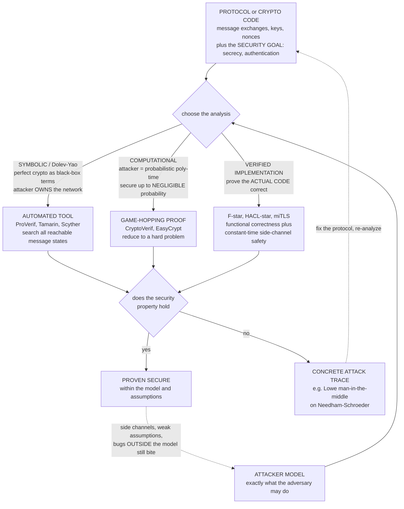

# 🛡️ Formal Methods in Security and Cryptography

> [!abstract] TL;DR
> **Security is adversarial**, so a protocol or cryptographic implementation must resist *every* attacker behaviour, not merely the ones its designers imagined — and history is a graveyard of "obviously secure" protocols quietly broken years later. **Formal methods** replace hand-waving with machine-checked guarantees along two complementary lines. The **symbolic / Dolev-Yao model** treats cryptography as *perfect black-box operations on terms* (you can only decrypt with the right key, only sign with the right key) and hands the **attacker total control of the network** — intercept, block, inject, replay, and recombine any message derivable from a growing **knowledge set** closed under the crypto operations; automatic tools (**ProVerif**, **Tamarin**, **Scyther**, **AVISPA**) then *exhaustively search* for an attack or prove none exists, and are superb at exposing logical flaws (replay, reflection, type-flaw, man-in-the-middle). This is exactly how Gavin **Lowe** used a model checker (**FDR**) in 1995 to find a man-in-the-middle attack on the **Needham-Schroeder public-key protocol** — *seventeen years* after it was published and believed secure. The **computational model** is stronger and closer to reality: the attacker is any **probabilistic polynomial-time** algorithm and "secure" means its advantage is **negligible**; such proofs are mechanized as **game-hopping** arguments in **CryptoVerif** and **EasyCrypt**, and **computational-soundness** theorems connect the two worlds. Finally, **verified implementations** (**Project Everest** / **HACL\***, **EverCrypt**, **miTLS** in **F\***) prove the *actual deployed code* functionally correct *and* constant-time — shipping in Firefox, Linux, and Windows. Formal analysis guided **TLS 1.3** and has been applied to **Signal**, **WireGuard**, **WPA2** (which surfaced **KRACK**), and **5G-AKA**. The catch: a proof holds only *within its model and assumptions* — side channels, broken crypto assumptions, and implementation bugs outside the model remain. Still, this is the rare corner of security where you can *prove* safety rather than merely *test* for its absence.

---

## Intuition

**Analogy — hand your protocol to the cleverest, most unscrupulous opponent who ever lived, one who is allowed to do *everything at once*, and see if it survives.** A security protocol is only as strong as its smartest attacker, and real attackers do things the designer never pictured: they *replay* a message captured last week, *impersonate both sides of a conversation simultaneously*, *splice* two separate sessions together, and *reflect* your own challenge back at you. For decades, protocols were declared secure on the strength of a plausible-sounding paragraph — and then broken years later by exactly such a trick. Formal methods change the game entirely. Instead of trusting the paragraph, you hand the protocol to a **tool that plays the role of an all-powerful adversary** who owns the network and explores *every* possible manipulation. The tool returns one of two verdicts: **"no attack exists"** (a proof, not a spot-check) or **"here is the exact attack"** — a concrete, step-by-step trace showing precisely how a secret leaks or an identity is spoofed.

That is not a thought experiment. When Roger Needham and Michael Schroeder published their public-key authentication protocol in 1978 it was used and cited as secure for **seventeen years** — until Gavin Lowe modelled it and its attacker in the **FDR** refinement checker and the machine handed back a man-in-the-middle attack no human had spotted. The reframing is the whole point: **security stops being a matter of belief and becomes a decidable question a machine can answer** — either proving your protocol safe against a defined adversary, or manufacturing the attack that breaks it.

---

## How It Works

### Core Mechanics

**1. Two ingredients: the artefact and the attacker.** Every formal security analysis starts by writing down two things precisely. First, the **protocol or cryptographic code** — the exact sequence of messages, the keys, the nonces (fresh random values), and the **security goal** you want (typically **secrecy**: a value never becomes known to the adversary; or **authentication / agreement**: if Bob finishes believing he spoke with Alice, then Alice really ran the protocol with Bob, on matching data). Second, and just as important, the **attacker model** — an explicit statement of what the adversary is allowed to do. *The verdict is only meaningful relative to that model.* Choosing the model is the central design decision, and there are two dominant choices.

**2. The symbolic / Dolev-Yao model — perfect crypto, omnipotent network.** Introduced by Dolev and Yao (1983), this model makes an idealizing abstraction: cryptography is a set of **perfect black-box operations on symbolic terms**. Encryption `enc(k, m)` can be undone *only* by someone holding the matching key; a nonce is an unguessable atom; there is no partial information, no algebraic structure to exploit (except what you deliberately model, e.g. Diffie-Hellman's `exp`). In exchange for that idealization, the **attacker is given complete control of the network**: it sees every message, can drop or delay any of them, and can **inject any message it can build** from its current **knowledge set** — the set of terms it has learned, *closed under the crypto operations*: pair and project, encrypt with any public key, and **decrypt with any key it knows**. Analysis is then a **reachability question over message states**: is there any interleaving of protocol sessions and attacker actions that reaches a state violating the goal? Automatic tools answer it — **ProVerif** (Blanchet; the protocol becomes **Horn clauses** derived from an applied-pi-calculus model, and a resolution engine proves secrecy/authentication or finds an attack, often for *unboundedly many* sessions), **Tamarin** (Meier, Schmidt, Cremers, Basin; **multiset-rewriting** with strong support for **Diffie-Hellman** equational theories and unbounded sessions, backwards-search with a proof or an attack graph), and **Scyther** / **AVISPA**. Their signature win is catching **logical** flaws — replay, reflection, type-flaw, and **man-in-the-middle** — the class Lowe's attack belongs to.

**3. The computational model — poly-time attacker, negligible advantage.** This is the standard of modern **provable cryptography** and is strictly more faithful. The adversary is *any* **probabilistic polynomial-time (PPT)** algorithm operating on actual bit-strings; "secure" means that its **advantage** — how much better it does than blind guessing at breaking secrecy or forging authentication — is a **negligible** function of the security parameter. Proofs are **reductions**: *if* an efficient attacker could break the protocol, *then* one could efficiently solve a problem believed hard (factoring, discrete log, or an assumption like DDH), contradiction. Because these arguments are long and error-prone by hand, they are mechanized as **game-hopping** (a.k.a. sequence-of-games) proofs — a chain of indistinguishable experiments from "real protocol" to "obviously secure ideal" — inside **CryptoVerif** (Blanchet; automated, computational, produces the game sequence) and **EasyCrypt** (Barthe et al.; an interactive proof assistant with a probabilistic relational Hoare logic, `pRHL`, for crypto games). See [[Provable_Security_and_Reductions]].

**4. Bridging the two — the symbolic-computational gap and computational soundness.** The symbolic model is *easy to automate* but idealizes crypto; the computational model is *faithful* but hard to mechanize. **Computational-soundness** theorems (Abadi-Rogaway and successors) establish, under stated conditions, that *a symbolic proof implies a computational one* — so an automatic Dolev-Yao verdict can carry real cryptographic weight. The gap is where subtle attacks hide: an attack invisible to the symbolic abstraction (because it exploits algebraic structure or partial leakage the black box hides) can still be real in the computational world.

**5. Verified implementations — proving the code, not just the design.** A perfect protocol can be undone by a buggy implementation (think **Heartbleed**, **goto fail**). **Project Everest** builds a *fully verified* HTTPS stack in **F\***: **HACL\*** and **EverCrypt** are verified, high-performance cryptographic primitives (Curve25519, ChaCha20-Poly1305, SHA, verified for **functional correctness**, **memory safety**, *and* **constant-time** execution to resist timing side channels), and **miTLS** is a verified TLS implementation. This code is not a prototype — HACL\* primitives ship in **Firefox (NSS)**, the **Linux kernel**, and Windows. Here the tools of deductive verification (Hoare-style reasoning, SMT discharge) meet cryptography: the theorem is about the running artefact.

**6. What a run produces.** From these three routes the output is binary in spirit: either a **security property proven** to hold (within the model and assumptions), or a **concrete counterexample** — for symbolic tools, an explicit **attack trace**: the exact messages the attacker intercepts, forges, and replays, and the moment the secret is derived or the impersonation completes. That trace is the deliverable that turns "we think it's fine" into either "it is provably fine" or "here is the bug, and here is the fix."

### Flow / Architecture



---

## Key Concepts

### Secondary (intuitive core)
- **Adversarial security.** A protocol must survive *every* attacker trick, not just the expected use — so you must reason about the worst case, not the typical case.
- **The all-powerful network attacker (Dolev-Yao).** Imagine an opponent who reads, blocks, and rewrites every message on the wire and can send anything it is able to construct from what it has learned.
- **Knowledge set.** The attacker's growing pile of things it knows; each captured message may let it *unlock* more (decrypt with a key it now holds), until it can build a secret.
- **Attack trace vs proof.** The tool either hands you the exact step-by-step attack, or certifies that *no* such attack exists.
- **Proven, not just tested.** Testing tries some attacks and finds none *this time*; a formal proof rules out *all* attacks in the model.

### Undergraduate (formal machinery)
- **Secrecy & authentication goals.** *Secrecy*: term `s` is never in the attacker's derivable knowledge. *Authentication / agreement*: Bob's "commit" event implies a matching Alice "running" event on the same data (Lowe's hierarchy of agreement).
- **The Dolev-Yao deduction system.** Knowledge closes under **pairing/projection**, **encryption with any public key**, and **decryption when the key is known** — formalized as `analz` (what you can *decompose*) and `synth` (what you can *build*), à la Paulson's inductive method.
- **Reachability as the analysis.** Symbolic protocol analysis is a state search: honest roles emit/accept messages; the attacker mediates the wire; the question is whether a bad state is reachable.
- **Nonces and freshness.** Replay and reflection attacks turn on whether a value is guaranteed *fresh* and *bound* to the right session and party.
- **Two attacker models.** *Symbolic* (terms, perfect crypto, network-omnipotent) vs *computational* (PPT algorithm on bit-strings, advantage must be negligible).
- **Tools by paradigm.** ProVerif (Horn clauses, applied pi-calculus), Tamarin (multiset rewriting, Diffie-Hellman), Scyther/AVISPA — symbolic; CryptoVerif, EasyCrypt — computational.

### Graduate (the hard subtleties)
- **Bounded vs unbounded verification & decidability.** Secrecy for unbounded sessions is undecidable in general; ProVerif uses a *sound over-approximation* (may report false attacks), Tamarin uses interactive/heuristic backward search — both trade completeness for reach. Bounded-session analysis is decidable (NP-style constraint solving).
- **Equational theories.** Modelling **Diffie-Hellman**, XOR, or blind signatures needs the deduction system extended with an **equational theory**; unification modulo those equations (AC, DH) is what makes Tamarin powerful and what makes soundness delicate.
- **Computational soundness.** Abadi-Rogaway-style theorems give conditions under which a symbolic secrecy proof *implies* computational security — but the hypotheses (which crypto primitives, which usage) are strict and often violated in practice.
- **Game-based proofs and `pRHL`.** EasyCrypt's probabilistic relational Hoare logic reasons about the statistical distance between adjacent games; CryptoVerif mechanizes the *observational-equivalence* game hops automatically. The art is finding the hop sequence and bounding each step's advantage.
- **Constant-time / side channels.** Functional correctness is not enough: **timing** and **cache** channels leak secrets outside the I/O model. Verified crypto adds a **constant-time** discipline (secret-independent branches and memory accesses), itself a formal property checked on the code.
- **Information-flow / noninterference.** A general security property — *low outputs are independent of high (secret) inputs* — proves *no secret leaks*; type systems and self-composition/relational logics discharge it.
- **The model boundary.** Every theorem is conditional on its **model and assumptions**. Attacks live in the gap: side channels, downgrade/negotiation flaws not modelled, weak randomness, or a broken hardness assumption (a future quantum computer for discrete log). "Proven secure" always means *proven secure against **this** attacker, under **these** assumptions.*

---

## Python Demo

We build a **tiny symbolic (Dolev-Yao) protocol analyzer by hand** and use it to rediscover the most famous result in the field. Part (a) models the **Needham-Schroeder public-key protocol** as message exchanges over a network **fully controlled by an attacker** `I` whose **knowledge set** grows and is *closed under* decrypt-with-known-keys / pairing / projection / encrypt-with-public-keys. Honest Alice `A` (initiator) starts a session with the dishonest party `I`; honest Bob `B` (responder) expects to talk to `A`. We **search the reachable states** — each honest step fires only if the attacker can *deliver* the message it expects, and the attacker *learns* every message sent — and the search **detects an attack**: Lowe's **man-in-the-middle**, where `I` splices the two sessions, learns the secret nonce `Nb`, and makes `B` commit to a run it thinks is with `A`. The program prints the **attack trace**. Part (b) tracks the **attacker's knowledge set growing** message by message until the secret is derived, and — to show formal methods also *produce fixes* — re-runs the search on **Lowe's repaired protocol** (bind the responder's identity into message 2) and confirms **no attack is reachable**. The figure plots the attack's message sequence and the attacker-knowledge growth to compromise.

```python
# Formal methods in security: a hand-built Dolev-Yao symbolic protocol analyzer.
# (a) model Needham-Schroeder PK over an attacker-controlled network; SEARCH reachable
#     states -> DETECT Lowe's man-in-the-middle; print the attack trace.
# (b) track the attacker's knowledge set growing until the secret Nb is derived;
#     re-run on Lowe's FIXED protocol and confirm NO attack is reachable.
import numpy as np
import matplotlib.pyplot as plt
from collections import deque

# ---------- Dolev-Yao message algebra (terms) ----------
def nonce(x): return ("nonce", x)
def agent(x): return ("agent", x)
def pk(x):    return ("pk", x)
def sk(x):    return ("sk", x)
def pair(a, b): return ("pair", a, b)
def enc(k, m):  return ("enc", k, m)          # public-key encryption {m} under key k

Na, Nb           = nonce("Na"), nonce("Nb")
A, B, I          = agent("A"), agent("B"), agent("I")
pkA, pkB, pkI    = pk("A"), pk("B"), pk("I")
SECRETS          = (Na, Nb)

def fmt(t):                                     # human-readable crypto notation
    tag = t[0]
    if tag in ("nonce", "agent"): return t[1]
    if tag == "pk": return "pk" + t[1]
    if tag == "sk": return "sk" + t[1]
    if tag == "pair": return fmt(t[1]) + ", " + fmt(t[2])
    if tag == "enc":  return "{" + fmt(t[2]) + "}" + fmt(t[1])
    return str(t)

# ---------- attacker deduction: analz (decompose/decrypt) and derivable (synth) ----------
def analz(K):
    """Close a knowledge set under projection and decrypt-with-known-key (Paulson's analz)."""
    K = set(K); changed = True
    while changed:
        changed = False
        for t in list(K):
            if t[0] == "pair":
                for c in (t[1], t[2]):
                    if c not in K: K.add(c); changed = True
            elif t[0] == "enc":
                owner = t[1][1]                 # key is ("pk", owner); need ("sk", owner)
                if sk(owner) in K and t[2] not in K:
                    K.add(t[2]); changed = True
    return K

def derivable(t, A):
    """Can the attacker CONSTRUCT term t from analz-set A? (synth over analz.)"""
    if t in A: return True
    if t[0] == "pair": return derivable(t[1], A) and derivable(t[2], A)
    if t[0] == "enc":  return (t[1] in A) and derivable(t[2], A)   # public key + plaintext
    return False

def secrets_known(K):
    A = analz(K); return frozenset(s for s in SECRETS if s in A)

# Attacker starts knowing all identities, all PUBLIC keys, and its OWN private key.
K0 = frozenset({A, B, I, pkA, pkB, pkI, sk("I")})

# ---------- protocol transition system (state = A-step, B-step, B's nonce, A's nonce, K) ----------
def transitions(st, FIX):
    a, b, bna, ay, K = st
    Aset = analz(K)
    outs = []
    # T1  A (initiator, partner I) -> {Na, A}pkI
    if a == 0:
        m1 = enc(pkI, pair(Na, A))
        nK = frozenset(analz(set(K) | {m1}))
        outs.append(("A_send1", [("A", "I", m1)], (1, b, bna, ay, nK)))
    # T2  B (responder) receives {n, A}pkB, records n, replies with its nonce Nb
    if b == 0:
        for n in SECRETS:
            inmsg = enc(pkB, pair(n, A))
            if derivable(inmsg, Aset):
                m2 = enc(pkA, pair(pair(n, Nb), B)) if FIX else enc(pkA, pair(n, Nb))
                nK = frozenset(analz(set(K) | {m2}))
                outs.append(("B_recv1", [("I", "B", inmsg), ("B", "I", m2)],
                             (a, 1, n, ay, nK)))
    # T3  A receives msg2 (partner nonce y), checks binding, replies {y}pkI
    if a == 1:
        for y in SECRETS:
            inmsg = (enc(pkA, pair(pair(Na, y), I)) if FIX     # A's partner is I: must read I
                     else enc(pkA, pair(Na, y)))               # broken: no identity binding
            if derivable(inmsg, Aset):
                m3 = enc(pkI, y)
                nK = frozenset(analz(set(K) | {m3}))
                outs.append(("A_recv2", [("I", "A", inmsg), ("A", "I", m3)],
                             (2, b, bna, y, nK)))
    # T4  B receives {Nb}pkB and COMMITS to a run it believes is with A
    if b == 1:
        inmsg = enc(pkB, Nb)
        if derivable(inmsg, Aset):
            outs.append(("B_commit", [("I", "B", inmsg)], (a, 2, bna, ay, K)))
    return outs

def search(FIX):
    """BFS over reachable states; a BAD state = B committed AND attacker knows the secret Nb."""
    s0 = (0, 0, None, None, K0)
    parent = {s0: None}
    q = deque([s0])
    bad = lambda st: st[1] == 2 and Nb in analz(set(st[4]))
    while q:
        st = q.popleft()
        if bad(st):
            trace, cur = [], st
            while parent[cur] is not None:
                prev, rec = parent[cur]; trace.append((rec, cur)); cur = prev
            return trace[::-1]
        for label, wire, nst in transitions(st, FIX):
            if nst not in parent:
                parent[nst] = (st, (label, wire)); q.append(nst)
    return None

# ================================ (a) find the attack ================================
attack = search(FIX=False)
print("=" * 72)
print("NEEDHAM-SCHROEDER PUBLIC-KEY  --  symbolic (Dolev-Yao) reachability analysis")
print("  A initiates with dishonest I;  B (responder) believes it is talking to A")
print("=" * 72)
if attack is None:
    print("no attack found")
else:
    print(f"ATTACK REACHED in {len(attack)} protocol actions  (Lowe man-in-the-middle):\n")
    for (label, wire), nst in attack:
        for (src, dst, msg) in wire:
            note = "   [I forwards, impersonating A]" if src == "I" else ""
            print(f"   {src} -> {dst:2s}:  {fmt(msg):<22s}{note}")
        learned = secrets_known(nst[4])
        if learned:
            print(f"        >> intruder knowledge now includes secret(s): "
                  f"{', '.join(fmt(s) for s in sorted(learned))}")
    print("\n   >>> B has COMMITTED, believing it shares secret Nb privately with A,")
    print("       but the intruder I holds Nb and A never ran the protocol with B.")

# ================================ (b) fixed protocol ================================
fixed = search(FIX=True)
print("\n" + "-" * 72)
print("LOWE'S FIX (bind responder identity into msg 2:  {Na, Nb, B}pkA):")
print("   result:", "attack STILL found" if fixed
      else "NO ATTACK REACHABLE  ->  proven secure in this symbolic model")
print("-" * 72)

# ================================ visualization ================================
if attack is not None:
    wire_all = [w for (lbl, wire), nst in attack for w in wire]
    # attacker-knowledge growth along the trace
    steps, known, labels = [0], [0], ["start"]
    for i, ((label, wire), nst) in enumerate(attack, 1):
        steps.append(i); known.append(len(secrets_known(nst[4]))); labels.append(label)

    fig, (axS, axK) = plt.subplots(1, 2, figsize=(15, 6.6))

    # ---- left: attack message-sequence diagram (three lifelines) ----
    xpos = {"A": 0.0, "I": 1.0, "B": 2.0}
    colr = {"A": "seagreen", "I": "crimson", "B": "steelblue"}
    n = len(wire_all); top = n + 0.5
    for name, x in xpos.items():
        axS.plot([x, x], [0.4, top], color=colr[name], lw=1.4, ls="--", alpha=0.6, zorder=1)
        tag = "  (intruder)" if name == "I" else ("  (initiator)" if name == "A" else "  (responder)")
        axS.text(x, top + 0.25, name + tag, ha="center", va="bottom",
                 fontsize=11, fontweight="bold", color=colr[name])
    for i, (src, dst, msg) in enumerate(wire_all):
        y = top - 1 - i
        x1, x2 = xpos[src], xpos[dst]
        axS.annotate("", xy=(x2, y), xytext=(x1, y),
                     arrowprops=dict(arrowstyle="-|>", color="black", lw=1.8))
        axS.text((x1 + x2) / 2, y + 0.12, f"{i+1}.  {fmt(msg)}", ha="center", va="bottom",
                 fontsize=9, bbox=dict(boxstyle="round,pad=0.15", fc="#fff6cc", ec="0.6"))
    axS.text(1.0, 0.05, "B commits: believes partner = A, secret = Nb\n"
                        "but intruder I holds Nb  ->  AUTHENTICATION BROKEN",
             ha="center", va="top", fontsize=9.5, color="crimson", fontweight="bold")
    axS.set_xlim(-0.7, 2.7); axS.set_ylim(-1.1, top + 1.2); axS.axis("off")
    axS.set_title("Lowe man-in-the-middle on Needham-Schroeder\n"
                  "found by Dolev-Yao state search  (primed msgs = I impersonating A)", fontsize=10)

    # ---- right: attacker knowledge growth ----
    axK.step(steps, known, where="post", color="crimson", lw=2.4, zorder=2)
    axK.scatter(steps, known, color="crimson", s=48, zorder=3)
    for x, y, lb in zip(steps, known, labels):
        axK.annotate(lb, (x, y), textcoords="offset points", xytext=(0, 10),
                     ha="center", fontsize=8.5, rotation=12)
    jump = next(i for i in range(1, len(known)) if known[i] == 2)
    axK.annotate("secret Nb DERIVED\nA re-encrypts partner nonce under pkI,\nintruder decrypts with skI",
                 xy=(steps[jump], 2), xytext=(0.25, 1.32), fontsize=9, color="black",
                 arrowprops=dict(arrowstyle="->", color="black"))
    axK.set_xlabel("protocol action (each intercepted message)")
    axK.set_ylabel("secret nonces known to the intruder")
    axK.set_yticks([0, 1, 2]); axK.set_ylim(-0.2, 2.6)
    axK.set_title("ATTACKER KNOWLEDGE GROWTH\nknowledge set closes under decrypt / project / pair\n"
                  "until the secret is derived", fontsize=10)
    axK.grid(True, ls=":", alpha=0.5)

    plt.tight_layout()
    plt.savefig("formal_methods_security_crypto.png", dpi=130, bbox_inches="tight")
    print("\nsaved figure -> formal_methods_security_crypto.png")
```

**What the run shows.** The state search reaches the bad state in **four honest protocol actions** and prints Lowe's man-in-the-middle in full: `A -> I : {Na, A}pkI` (A opens a session with the intruder, who decrypts and **learns `Na`**); `I -> B : {Na, A}pkB` (I *replays* A's nonce and identity to B, impersonating A); `B -> I : {Na, Nb}pkA` (B answers the "A" it believes it is talking to, but I intercepts); `I -> A : {Na, Nb}pkA` (I *relays* the untouched ciphertext to A, which fits A's own session perfectly); `A -> I : {Nb}pkI` — the fatal step: A re-encrypts B's secret nonce under the intruder's public key, so I decrypts and **learns `Nb`**; finally `I -> B : {Nb}pkB` makes B **commit**, convinced it shares the secret `Nb` privately with A. It does not — I knows `Nb` and A never spoke to B. The left plot draws that six-arrow splice across the `A / I / B` lifelines; the right plot shows the attacker's knowledge climbing from `{}` to `{Na}` to `{Na, Nb}` at exactly the re-encryption step. Then the program re-runs the search on **Lowe's fix** — message 2 becomes `{Na, Nb, B}pkA`, binding the responder's identity — and the search returns **no reachable attack**: A now checks that the responder identity is its intended partner `I`, the intruder cannot forge `{Na, Nb, I}pkA` (it never learns `Nb`), and the splice collapses. That is the entire discipline in miniature: the machine finds the real attack *and* certifies the repair.

---

## Real-World Applications

- **The founding case — Needham-Schroeder and Lowe (1995).** Roger Needham and Michael Schroeder's public-key protocol (1978) was trusted for **17 years**; Gavin **Lowe** encoded it and its Dolev-Yao attacker in the **FDR** refinement/model checker, which produced the man-in-the-middle attack above, and Lowe's paper *also* proved the identity-binding fix correct. This single result launched automated protocol verification as a field.
- **TLS 1.3 — verification that shaped the standard.** Unlike its ad-hoc predecessors, **TLS 1.3** was analyzed *during* design with **Tamarin**, **ProVerif**, and **CryptoVerif**, plus the verified **miTLS/RecordLayer** work — comprehensive symbolic and computational proofs of the handshake's secrecy and authentication guarantees fed directly back into IETF decisions. See [[TLS_and_Secure_Channels]] and [[TLS_Protocol_Deep_Dive]].
- **Signal, WireGuard, and messaging.** The **Signal** protocol (Double Ratchet, X3DH) received formal computational analysis; **WireGuard**'s handshake was proven in **Tamarin** and **CryptoVerif**; both results increased confidence in tools now used by billions. See [[Secure_Messaging_and_Signal_Protocol]].
- **Wi-Fi and cellular — attacks *and* assurance.** Formal modelling of **WPA2** exposed the **KRACK** key-reinstallation attack (Vanhoef-Piessens), and **Tamarin** analyses of **5G-AKA** authentication (Basin et al.) found weaknesses and guided the standard — showing formal methods finding *real, deployed-scale* flaws.
- **Verified crypto in your browser and kernel.** **Project Everest / HACL\*** and **EverCrypt** provide machine-checked, constant-time implementations of Curve25519, ChaCha20-Poly1305, and SHA-2/3; these ship in **Mozilla Firefox (NSS)**, the **Linux kernel** (WireGuard's crypto), and elsewhere — production code carrying proofs of correctness *and* side-channel resistance.
- **Kerberos, IKE/IPsec, EMV, and enclaves.** Symbolic tools have audited **Kerberos**, **IKEv2**, and payment (**EMV**) protocols, while information-flow and noninterference proofs underpin high-assurance separation kernels (**seL4**-adjacent efforts) and trusted-enclave designs.

---

## Common Pitfalls

- **Mistaking the symbolic (Dolev-Yao) verdict for a computational guarantee.** The symbolic model treats crypto as a *perfect black box* — no partial leakage, no algebraic structure beyond what you model. A protocol "proven secure" symbolically can still fall to a **computational** attack that exploits real cipher structure or advantage; only a **computational-soundness** theorem (with its strict hypotheses) bridges the gap. Know which model your proof lives in.
- **Forgetting that the model, not reality, was verified.** Every theorem is conditional on its **attacker model and assumptions**. **Side channels** (timing, cache, power), weak randomness, downgrade/negotiation flows you did not model, and a broken hardness assumption (a future quantum computer for discrete log) all live *outside* the proof. "Proven secure" always means *against this attacker, under these assumptions* — never absolutely.
- **Trusting a perfect design implemented by imperfect code.** **Heartbleed** and Apple's **goto fail** were implementation bugs beneath flawless protocol logic. Design-level proofs say nothing about the code — which is exactly why **verified implementations** (**HACL\***, **miTLS**, **EverCrypt**) prove the *running artefact*, including **constant-time** behaviour, rather than a paper model.
- **Ignoring identity/agreement — the Lowe lesson.** Needham-Schroeder failed because responses did not **bind the responder's identity**, letting the intruder splice two sessions. Confusing weak *aliveness* ("someone ran the protocol") with strong *agreement* ("Alice ran it, with Bob, on these exact values") is the recurring root cause of authentication flaws.
- **Under-modelling the attacker's knowledge closure.** The Dolev-Yao attacker's power is the **closure** of its knowledge under decrypt/pair/project/encrypt. Omitting a derivation rule (or an **equational theory** like Diffie-Hellman's `exp`, or XOR's algebra) can *hide* real attacks — the analysis is only as strong as the deduction system it searches over.
- **Believing "no attack found" without understanding the tool's completeness.** Unbounded-session secrecy is undecidable; **ProVerif** over-approximates (may cry wolf with a *false* attack) while bounded analyses only cover a fixed number of sessions. A clean symbolic run is meaningful, but you must know whether it was sound, complete, bounded, or heuristic.
- **Treating this like testing.** Fuzzing and pentests *sample* attacker behaviours and can only find bugs, never certify their absence. Formal methods here are the opposite: within the model, a proof rules out *all* attacks. This is **security you can prove, not merely test** — but only inside the boundary you drew.

---

## Related Concepts

- [[Cryptography/04_Protocols_and_Applications/Authentication_Protocols|Authentication Protocols]] — the exact objects verified here (challenge-response, key transport, mutual authentication); Needham-Schroeder is the canonical worked example, and identity-binding is the canonical fix.
- [[Provable_Security_and_Reductions]] — the **computational** side: security as a *reduction* to a hard problem with negligible advantage, the arguments that CryptoVerif and EasyCrypt mechanize as game hops.
- [[Public_Key_Cryptography_Foundations]] — the encrypt-with-public-key / decrypt-with-private-key operations the Dolev-Yao attacker's knowledge set closes over.
- [[Diffie_Hellman_and_Discrete_Log]] — the key-exchange whose **equational theory** (`exp`) is what makes Tamarin powerful and symbolic soundness delicate; central to TLS/Signal/WireGuard analyses.
- [[TLS_and_Secure_Channels]] — the flagship protocol whose secrecy and authentication were proven symbolically *and* computationally, guiding the TLS 1.3 design.
- [[TLS_Protocol_Deep_Dive]] — the engineering view of the same handshake whose formal analysis (miTLS, Tamarin, ProVerif) is discussed here.
- [[Secure_Messaging_and_Signal_Protocol]] — Signal's Double Ratchet / X3DH, a modern protocol subjected to computational proof; the applied target of these methods.
- [[Cryptography/05_Advanced_Cryptography/Zero_Knowledge_Proofs|Zero-Knowledge Proofs]] — another security notion (a proof leaks nothing beyond validity) whose *definitions* are formalized and whose implementations are increasingly machine-verified.
- [[Cybersecurity/01_Security_Foundations/Threat_Modeling|Threat Modeling]] — the informal-engineering counterpart of choosing an *attacker model*; formal methods make the threat model precise and then discharge it mathematically.
- [[Concurrency_and_Process_Calculi]] — the **applied pi-calculus** underneath ProVerif: protocols as concurrent processes over channels, with secrecy/authentication as observational properties.
- [[Formal_Verification_TLA_Plus]] — the same "specify the system + the property, then exhaustively check" philosophy applied to distributed protocols; a sibling verification style from the distributed-systems world.
- [[Formal_Methods_Overview]] — the vault entry point situating protocol verification within specification, model checking, deductive verification, and static analysis.

*Siblings in this section and the wider vault, referenced here in prose: **Model_Checking_Fundamentals** (Lowe used a refinement/model checker, FDR, to find the Needham-Schroeder attack — protocol analysis *is* reachability), **Concurrency_Verification_and_Process_Calculi** (the pi-calculus foundation of ProVerif and of protocols-as-processes), **Symbolic_Execution** (the code-level cousin, used for vulnerability discovery and exploit generation), **Verified_Compilers_and_Operating_Systems** (the same "verify the real artefact" ambition as HACL\*/miTLS, for compilers and kernels), and **Interactive_Theorem_Proving** (the proof-assistant engine — F\*, EasyCrypt build on it — that discharges the hard computational obligations).*

---

## Review Questions

1. **(Secondary)** Using the "hand your protocol to the cleverest possible opponent" analogy, explain what a *Dolev-Yao attacker* is allowed to do and why the fact that a protocol "was never broken in 17 years" is *not* a proof of security. What are the two things a formal tool can hand back?
2. **(Undergraduate)** In the Needham-Schroeder attack from the demo, identify the single message in which the intruder finally *learns* the secret `Nb`, and explain — in terms of the attacker's **knowledge set** closing under decryption — exactly why it can decrypt that message but not the earlier `{Na, Nb}pkA`. Why does binding `B`'s identity into message 2 block the whole attack?
3. **(Undergraduate)** Distinguish a **secrecy** goal from an **authentication/agreement** goal, and give the concrete form each takes in a symbolic analysis (an unreachable "attacker knows `s`" state vs a "commit implies matching run" event correspondence). Which one does Lowe's attack violate, and how?
4. **(Graduate)** Contrast the **symbolic / Dolev-Yao** and **computational** models along three axes: what the attacker *is*, what "secure" *means*, and how proofs are *mechanized* (ProVerif/Tamarin vs CryptoVerif/EasyCrypt). What does a **computational-soundness** theorem buy you, and what typically prevents you from invoking one?
5. **(Graduate)** A team proves their protocol secure in Tamarin *and* ships HACL\*-verified primitives, yet an attacker still recovers keys in the field. Give three *distinct* ways this can happen that are fully consistent with both proofs being correct, and name the formal notion (e.g. constant-time / noninterference, equational theory, negotiation/downgrade modelling) that each would require to be brought *inside* the model.

---

## Sources

- Lowe, G. "Breaking and Fixing the Needham-Schroeder Public-Key Protocol." *TACAS*, 1996 — the FDR model-checking discovery of the man-in-the-middle attack and its provably correct identity-binding fix.
- Dolev, D. & Yao, A. "On the Security of Public Key Protocols." *IEEE Trans. Information Theory*, 1983 — the foundational symbolic attacker model: perfect crypto, network-omnipotent adversary.
- Blanchet, B. "Modeling and Verifying Security Protocols with the Applied Pi Calculus and ProVerif." *Foundations and Trends in Privacy and Security*, 2016 — ProVerif (symbolic, Horn clauses) and, by the same author, CryptoVerif (computational, game-based).
- Meier, S., Schmidt, B., Cremers, C. & Basin, D. "The TAMARIN Prover for the Symbolic Analysis of Security Protocols." *CAV*, 2013 — multiset-rewriting, Diffie-Hellman equational theories, unbounded sessions.
- Barthe, G., Grégoire, B., Heraud, S. & Béguelin, S. Z. "Computer-Aided Security Proofs for the Working Cryptographer" (EasyCrypt). *CRYPTO*, 2011 — mechanized game-hopping computational proofs via probabilistic relational Hoare logic.
- Bhargavan, K., et al. "Everest: Towards a Verified, Drop-in Replacement of HTTPS" / HACL\* and miTLS (Project Everest). *SNAPL / IEEE S&P*, 2017 — verified, constant-time cryptographic primitives and a verified TLS stack deployed in Firefox and Linux.

---

#formal-methods #protocol-verification #cryptography #dolev-yao #verified-crypto
