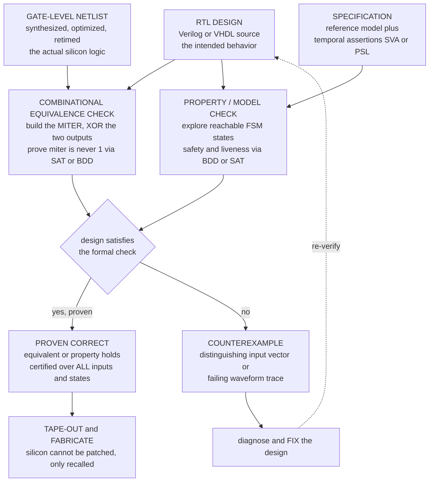

# 🔬 Hardware and Circuit Verification

> [!abstract] TL;DR
> **Hardware verification is where formal methods *won*** — the one domain where mathematical proof is not an academic luxury but a mandatory, mature, economically essential sign-off step. The reason is brutal and physical: **you cannot patch silicon.** A logic bug in a fabricated chip means a **recall**, and the field's rallying cry is the **1994 Pentium FDIV** floating-point-division flaw that cost Intel a **~$475M** write-off. Because exhaustive simulation of a modern chip is impossible, engineers replaced "we tested it a lot" with "**we proved it correct**" before tape-out. Two techniques dominate. **(1) Equivalence checking** proves two designs compute the *same* function: **combinational equivalence checking** takes the RTL and its synthesized/optimized gate-level netlist, builds a **MITER** (XOR the two circuits' outputs), and proves that miter can *never* be 1 using **SAT** or **BDD** engines — a routine step run on essentially every design. **(2) Property / model checking** verifies **temporal assertions** of sequential circuits — arbiters, pipelines, protocols — like *"never grant two masters"* or *"every request is eventually acked,"* via **symbolic (BDD)** and **SAT/bounded** model checking, with properties embedded in the design as **SystemVerilog Assertions (SVA)** or **PSL**. Hardware is a *sweet spot* because designs are **finite-state and bit-level** — no unbounded heap or pointers — so symbolic methods shine (the famous "10²⁰ states" results were hardware). The industry runs on commercial engines: **Cadence JasperGold**, **Synopsys VC Formal**, **Siemens/Mentor**. Hardware verification is the model of what verification can achieve — and the launchpad for the harder software, protocol, and security frontiers this section explores.

---

## Intuition

**Analogy — the bug you can never take back.** In 1994 a subtle flaw in Intel's **Pentium** chip made it divide certain numbers slightly wrong: `4195835 / 3145727` came out off in the fifth significant digit. It wasn't a typo in a manual or a driver you could update overnight — it was a handful of **missing entries in a lookup table baked into the silicon** of millions of chips already sitting in millions of PCs. There is no "push an update" for a fabricated transistor. Intel's only options were to argue the bug was rare (it tried, and the public revolted) or to **recall and replace the chips** — which it ultimately did, at a cost of roughly **half a billion dollars**.

That catastrophe is *why* hardware became formal methods' greatest success story. For ordinary software, a bug is embarrassing but recoverable: ship a patch. For hardware, a shipped bug is **permanent and physical** — a design error multiplied across a billion identical copies you can never reach. So the industry made a hard decision: before a chip is fabricated, its logic is **mathematically PROVEN correct** — every optimization is **equivalence-checked** against the reference, every safety and liveness assertion is **model-checked exhaustively** — because for hardware, *"we simulated a lot of vectors"* is nowhere near good enough. Testing samples a few of the astronomically many input patterns; a proof covers **all of them at once**. Hardware verification is the discipline of never having to say "we'll fix it in the next batch."

---

## How It Works

### Core Mechanics

Formal hardware verification answers one of two questions with a *proof*, not a sample: **"do these two circuits compute the same function?"** (equivalence checking) or **"does this circuit always obey this rule over time?"** (property/model checking).

**1. Why hardware is the sweet spot.** A digital circuit, unlike a general program, is **finite-state and bit-level**: there is no unbounded heap, no pointers, no recursion depth, no dynamically allocated memory. A combinational block is a pure Boolean function of its input bits; a sequential block is a **finite-state machine** over a fixed bundle of flip-flops. Finiteness means the whole behavior *can* be reasoned about exhaustively, and bit-level structure means **symbolic engines** — **BDDs** (Binary Decision Diagrams) and **SAT/SMT** solvers — are extraordinarily effective. The celebrated results verifying systems with **10²⁰-plus reachable states** were hardware precisely for this reason.

**2. Combinational equivalence checking (CEC) — the MITER.** The most-run formal step in all of chip design. You have a **reference** (the RTL you wrote in [[Hardware_Description_Languages|Verilog/VHDL]]) and an **implementation** (the synthesized, optimized, retimed gate-level netlist the tools produced). They *should* compute the same Boolean function, but synthesis is a complex transformation and could have introduced a flaw. To check, build a **miter**: feed the *same* inputs to both circuits, **XOR their corresponding outputs**, and OR the XORs together. The miter outputs `1` **exactly when the two circuits disagree** on some input. So the two designs are equivalent **iff the miter is unsatisfiable** — iff no input can drive it to `1`. Hand the miter to a **SAT/BDD** engine: `UNSAT` proves equivalence over *all* `2ⁿ` inputs; `SAT` returns a **distinguishing input** — a concrete counterexample vector where they differ. CEC scales to enormous designs because equivalent circuits share internal structure, letting the solver match up internal points and avoid the full exponential.

**3. Sequential and word-level equivalence.** When state is retimed or re-encoded, combinational matching no longer lines up register-for-register; **sequential equivalence checking** proves the two FSMs are I/O-equivalent across all cycles. **Word-level / RTL-vs-RTL** checking lifts the problem above single bits to **bit-vectors and arithmetic**, handing it to **[[SMT_Solving_and_Satisfiability_Modulo_Theories|SMT]]** theories (bit-vectors, arrays) so a 64-bit multiplier need not be bit-blasted naively.

**4. Property / model checking — temporal assertions.** Equivalence checking asks "same function?"; **model checking** asks "does this sequential circuit satisfy a *temporal property* on every possible run?" You express properties over the FSM's paths — **safety** ("something bad *never* happens": `never grant two masters`, `FIFO never overflows`, `state X and Y are mutually exclusive`) and **liveness** ("something good *eventually* happens": `every request is eventually acked`, `the pipeline never deadlocks`). A **safety** check reduces to **reachability** — is any state violating the invariant reachable from reset? A **liveness** check reduces to finding a bad **cycle** in the reachable state graph. This specializes the general theory developed in the sibling note `Model_Checking_Fundamentals` to finite, bit-level circuits.

**5. The engines — BDDs and SAT.** Classic **symbolic model checking** represents *sets* of states as **BDDs** and computes reachable-state fixpoints symbolically — Ken McMillan's **SMV** was born to verify hardware this way (the sibling `Symbolic_Model_Checking_and_BDDs`). **Bounded model checking** (the sibling `Bounded_Model_Checking`) unrolls the transition relation `k` cycles into one giant CNF and asks a **SAT** solver (the engine detailed in `SAT_Solving_and_DPLL`) for a property violation of length `≤ k` — superb at finding deep bugs fast, and complete once a computed bound is reached. Both exploit the finite, bit-level structure that makes hardware tractable.

**6. Assertion-Based Verification (ABV).** Rather than write properties in a separate tool, engineers **embed** them directly in the design using **SystemVerilog Assertions (SVA)** or **PSL** (Property Specification Language): `assert property (@(posedge clk) not (grant0 && grant1));`. The *same* assertions are checked two ways — dynamically during **simulation** (do they ever fire on the vectors we ran?) and statically by a **formal tool** (can they *ever* fire on *any* input?). This unifies simulation and formal into one property language and is the backbone of modern verification methodology (UVM + formal apps).

**7. The tools and "formal apps."** Commercial formal verification is standard tapeout infrastructure: **Cadence JasperGold**, **Synopsys VC Formal**, and **Siemens EDA (Mentor) Questa Formal**. They ship as push-button **formal apps** for specific jobs — **connectivity checking** (are these SoC pins wired correctly?), **register verification** (do control/status registers match the spec?), **X-propagation** (do unknown values leak?), **coverage closure**, and **security** (can secret data reach an untrusted output?).

**8. Where it matters most — arithmetic and coherence.** After FDIV, **floating-point and arithmetic-unit verification** became heavily formalized: Intel and others now *prove* IEEE-754 compliance of dividers, multipliers, and transcendental units, often with **theorem proving** for the deepest arithmetic (John Harrison's work at Intel). **Cache-coherence protocols** and **memory subsystems** — inherently concurrent FSMs with subtle races — are canonical model-checking targets ("two caches never both hold the line in Modified state"; see [[Cache_Coherence_MESI]]).

**9. Complementary, not a replacement for simulation.** Formal proves properties exhaustively but is bounded by property *coverage* — you only prove the properties you wrote. Simulation covers realistic end-to-end scenarios but samples inputs. Real sign-off uses **both**: formal for control logic, corner cases, and safety-critical invariants; simulation/emulation for full-chip system behavior and performance.

### Flow / Architecture



---

## Key Concepts

### Secondary (intuitive core)
- **You can't patch silicon.** A fabricated chip's logic is frozen; a bug means a recall, not a download. That single fact is why hardware demands *proof*, not just testing.
- **Equivalence checking.** Two versions of a circuit *should* do the same thing (the original and an "optimized" one). Checking asks: **is there any input where they disagree?** If not, they are proven identical.
- **The miter trick.** Wire the same inputs into both circuits and put an **XOR** on their outputs. The XOR lights up exactly when they differ — so proving "the XOR can never light up" proves the circuits are the same.
- **Property checking.** Instead of comparing two circuits, state a *rule* the circuit must always obey ("never turn both traffic lights green") and prove no sequence of events can ever break it.
- **Counterexample.** When a check fails you don't just get "wrong" — you get the exact input (or the exact sequence of clock cycles) that breaks it: a ready-made bug report.

### Undergraduate (formal machinery)
- **Combinational equivalence checking (CEC).** Reference and implementation are Boolean functions `f, g` of the same inputs; equivalence is `∀x. f(x) = g(x)`, refuted by the satisfiability of the **miter** `⋁ᵢ (fᵢ(x) ⊕ gᵢ(x))`. `UNSAT` ⇒ equivalent; `SAT` ⇒ distinguishing input. Structural matching of internal signals keeps it scalable.
- **RTL vs gate-level.** Synthesis maps [[Hardware_Description_Languages|HDL]] to a gate netlist; CEC is the standard **sign-off** that optimization/retiming preserved the function — no need to re-simulate.
- **Sequential circuits and FSMs.** A [[Sequential_Circuits_and_FSMs|sequential circuit]] is a finite-state machine `(S, s₀, δ)`; properties are checked by exploring **reachable states** from reset.
- **Safety vs liveness.** Safety = "never reach a bad state" (reachability); liveness = "always eventually reach a good state" (cycle detection under fairness). "Never grant both" is safety; "every request eventually acked" is liveness.
- **SVA / PSL assertions.** Temporal properties written *inside* the design (`assert property`, `cover property`), checked by both simulation and formal tools — one language, two engines.
- **BDD vs SAT engines.** BDDs canonically represent Boolean functions/state sets (great for symbolic reachability, sensitive to variable ordering); SAT drives **bounded model checking** (unroll `k`, solve one CNF, find deep bugs fast).

### Graduate (the hard subtleties)
- **Miter construction and internal equivalences.** Naive CEC is one big co-NP query; real tools find **internal equivalence points** and cut-points, proving equivalence *incrementally* through the circuit so the solver never faces the full `2ⁿ` cone — the reason CEC scales to designs simulation could never exhaust.
- **Word-level / SMT-based checking.** Bit-blasting a 64-bit multiplier is often intractable; **SMT** theories (bit-vectors, arrays, uninterpreted functions) reason at word level, and **algebraic / Gröbner-basis** methods verify arithmetic circuits (integer multipliers) that defeat pure SAT/BDD.
- **Symbolic reachability fixpoints.** Symbolic model checking computes `Reach = μZ. S₀ ∨ Post(Z)` over **BDD-encoded** state sets; the transition relation itself is a BDD, and the whole reachable set is manipulated without enumerating states — this is what delivered the 10²⁰-state results.
- **Bounded model checking and completeness.** BMC unrolls the transition relation `k` steps into CNF for a **SAT** solver; it is a *bug-finder* until you reach the **completeness threshold / diameter** (or add **k-induction / IC3-PDR**), after which absence of a `≤k` counterexample becomes a genuine proof.
- **Floating-point verification post-FDIV.** Proving **IEEE-754** compliance of division/sqrt/transcendentals blends model checking with **interactive theorem proving** (Harrison's HOL-Light work at Intel) because the correctness argument involves real-number error bounds, not just Boolean identities.
- **Assume-guarantee and abstraction.** Full SoCs exceed monolithic checking; **compositional** reasoning verifies blocks under environment **assumptions** discharged elsewhere, and **abstraction/CEGAR** collapses irrelevant datapath detail so the control logic can be proven.
- **Coverage of the proof.** Formal is only as strong as the **property set**: unchecked behaviors are unproven. **Formal coverage** metrics (e.g. COI/proof-core coverage) measure how much of the design a passing property actually constrains — guarding against "vacuous" proofs.

---

## Python Demo

Two experiments capture the two pillars. **(a) Combinational equivalence checking**: a reference bit-`carry` function (the majority `ab + bc + ca`) is compared against a **correct** algebraic optimization (`ab + c(a+b)`) and a **buggy** synthesized netlist (`ab + c·a` — a dropped fan-in). For each we build the **MITER** (XOR the outputs) and test *exhaustively* whether it can ever be `1` — exactly what a SAT/BDD engine does symbolically at scale — reporting **proven equivalent** or the **distinguishing input** counterexample. **(b) Sequential safety model checking**: a **2-master bus arbiter** is checked for the safety property *"never grant both."* We explore **all reachable states** under nondeterministic requests; a **correct** round-robin arbiter is proven safe over every reachable state, while a **buggy** arbiter that grants requesters independently yields a concrete **counterexample waveform**. `numpy` + `matplotlib`.

```python
# Hardware verification: (a) combinational EQUIVALENCE CHECKING via a miter,
#                        (b) sequential SAFETY model check of a 2-master arbiter.
# numpy + matplotlib only.
import numpy as np
import matplotlib.pyplot as plt
from itertools import product
from collections import deque

# ============================================================= #
# (a) COMBINATIONAL EQUIVALENCE CHECKING  (RTL vs "optimized")   #
#     carry-out of a bit: reference maj(a,b,c) = ab + bc + ca    #
# ============================================================= #
def ref(a, b, c):            # reference RTL: majority / carry-out
    return (a & b) | (b & c) | (c & a)

def opt_good(a, b, c):       # correct synthesis: ab + c(a+b)  -- provably equal
    return (a & b) | (c & (a | b))

def opt_bug(a, b, c):        # BUGGY netlist: dropped the 'b' fan-in -> ab + c*a
    return (a & b) | (c & a)

def equivalence_check(f, g, nins=3):
    """Build the MITER (XOR of the two outputs) and test if it can EVER be 1.
       Exhaustive here (finite, bit-level) -- exactly what a SAT/BDD engine does
       symbolically at scale. Returns (is_equivalent, miter_vector, rows, counterexamples)."""
    rows  = list(product([0, 1], repeat=nins))
    miter = np.array([f(*x) ^ g(*x) for x in rows])    # 1 wherever the outputs disagree
    cex   = [rows[i] for i in np.where(miter == 1)[0]] # distinguishing inputs
    return (miter.max() == 0), miter, rows, cex

eq_g, miter_g, rows, _      = equivalence_check(ref, opt_good)
eq_b, miter_b, _, cex_bug   = equivalence_check(ref, opt_bug)

print("(a) COMBINATIONAL EQUIVALENCE CHECKING (miter = XOR of outputs)")
print(f"    reference vs opt_good : {'EQUIVALENT (miter never 1)' if eq_g else 'NOT equivalent'}")
print(f"    reference vs opt_bug  : {'EQUIVALENT' if eq_b else 'NOT equivalent'}"
      f"  -> distinguishing input(s) (a,b,c) = {cex_bug}")

# ============================================================= #
# (b) SEQUENTIAL SAFETY MODEL CHECK of a 2-master bus arbiter    #
#     safety property:  NEVER grant both  ->  not(g0 and g1)     #
# ============================================================= #
def next_correct(state, req):
    """Round-robin arbiter: grants AT MOST ONE master -> safe by construction.
       state=(g0,g1,turn); req=(r0,r1)."""
    _, _, turn = state
    r0, r1 = req
    if r0 and (turn == 0 or not r1):
        return (1, 0, 1)
    elif r1:
        return (0, 1, 0)
    else:
        return (0, 0, turn)

def next_buggy(state, req):
    """BUGGY arbiter: grants each requester independently -> both when both ask."""
    r0, r1 = req
    return (r0, r1, 0)                 # g0=r0, g1=r1  (turn unused)

def reachable_check(next_fn, init):
    """Explore ALL reachable states under nondeterministic inputs (r0,r1) in {0,1}^2.
       Safety invariant: not(g0 and g1). Return (holds, states, parent, bad_state)."""
    parent = {init: (None, None)}     # state -> (prev_state, input)
    seen   = {init}
    q      = deque([init])
    bad    = lambda s: s[0] == 1 and s[1] == 1
    while q:
        s = q.popleft()
        if bad(s):
            return False, seen, parent, s
        for req in product([0, 1], repeat=2):
            t = next_fn(s, req)
            if t not in seen:
                seen.add(t); parent[t] = (s, req); q.append(t)
    return True, seen, parent, None

def trace_to(parent, bad_state):
    """Reconstruct the counterexample path: list of (state, input_that_led_here)."""
    path, s = [], bad_state
    while s is not None:
        prev, inp = parent[s]
        path.append((s, inp)); s = prev
    return path[::-1]

ok_c, states_c, _,     _   = reachable_check(next_correct, (0, 0, 0))
ok_b, states_b, par_b, bad = reachable_check(next_buggy,  (0, 0, 0))
cex_trace = trace_to(par_b, bad)

print("\n(b) SEQUENTIAL SAFETY MODEL CHECK  ('never grant both')")
status_c = f"HOLDS (proof over all {len(states_c)} reachable states)" if ok_c else "FAILS"
print(f"    correct arbiter: property {status_c}")
print(f"    buggy arbiter  : property {'HOLDS' if ok_b else 'FAILS'} -> counterexample trace:")
for k, (st, inp) in enumerate(cex_trace):
    g0, g1, _ = st
    tag  = "   <-- BOTH GRANTED (violation!)" if g0 and g1 else ""
    show = "(init)" if inp == (None, None) else f"req=(r0,r1)={inp}"
    print(f"      step {k}: {show:22s} ->  grants (g0,g1)=({g0},{g1}){tag}")

# ---- a concrete waveform for the CORRECT arbiter under constant double-request ----
s, wave = (0, 0, 0), []
for req in [(1, 1)] * 8:
    s = next_correct(s, req); wave.append(s)
wg0 = np.array([w[0] for w in wave]); wg1 = np.array([w[1] for w in wave])

# ============================== Visualization ==============================
fig, ax = plt.subplots(2, 2, figsize=(14, 9))
labels = ["".join(map(str, r)) for r in rows]

# (a1) miter for the CORRECT optimization -> all zero = EQUIVALENT
ax[0, 0].bar(range(len(rows)), miter_g, color="seagreen")
ax[0, 0].set_ylim(-0.05, 1.2); ax[0, 0].set_xticks(range(len(rows)))
ax[0, 0].set_xticklabels(labels, fontsize=8)
ax[0, 0].text(len(rows) / 2 - 0.5, 0.55, "miter never fires\nPROVEN EQUIVALENT",
              ha="center", color="seagreen", fontsize=11, fontweight="bold")
ax[0, 0].set_title("EQUIVALENCE CHECK: reference vs opt_good\n"
                   "miter = XOR of outputs is 0 for EVERY input -> equivalent")
ax[0, 0].set_xlabel("input (a,b,c)"); ax[0, 0].set_ylabel("miter output")

# (a2) miter for the BUGGY optimization -> spike at the distinguishing input
colors = ["crimson" if m else "0.7" for m in miter_b]
ax[0, 1].bar(range(len(rows)), miter_b, color=colors)
ax[0, 1].set_ylim(-0.05, 1.2); ax[0, 1].set_xticks(range(len(rows)))
ax[0, 1].set_xticklabels(labels, fontsize=8)
for i, m in enumerate(miter_b):
    if m:
        ax[0, 1].annotate("COUNTEREXAMPLE\n(a,b,c)=" + labels[i], (i, 1.0),
                          textcoords="offset points", xytext=(0, 6),
                          ha="center", fontsize=8, color="crimson", fontweight="bold")
ax[0, 1].set_title("EQUIVALENCE CHECK: reference vs opt_bug\n"
                   "miter = 1 somewhere -> NOT equivalent, distinguishing input found")
ax[0, 1].set_xlabel("input (a,b,c)"); ax[0, 1].set_ylabel("miter output")

# (b1) CORRECT arbiter waveform -> grants never overlap = safety HOLDS
t = np.arange(len(wave))
ax[1, 0].step(t, wg0 + 2.2, where="post", color="steelblue",  lw=2.4, label="grant g0")
ax[1, 0].step(t, wg1,       where="post", color="darkorange", lw=2.4, label="grant g1")
ax[1, 0].set_yticks([0.5, 2.7]); ax[1, 0].set_yticklabels(["g1", "g0"])
ax[1, 0].set_ylim(-0.3, 3.6)
ax[1, 0].set_title("CORRECT arbiter (round-robin), both masters requesting\n"
                   "grants ALTERNATE, never both high -> 'never grant both' HOLDS")
ax[1, 0].set_xlabel("clock cycle"); ax[1, 0].legend(loc="upper right", fontsize=8)
ax[1, 0].grid(alpha=0.3)

# (b2) BUGGY arbiter counterexample trace -> both grants high => violation
ct  = np.arange(len(cex_trace))
bg0 = np.array([st[0] for st, _ in cex_trace])
bg1 = np.array([st[1] for st, _ in cex_trace])
ax[1, 1].step(ct, bg0 + 2.2, where="post", color="steelblue",  lw=2.4, label="grant g0")
ax[1, 1].step(ct, bg1,       where="post", color="darkorange", lw=2.4, label="grant g1")
for k in ct:
    if bg0[k] and bg1[k]:
        ax[1, 1].axvline(k, color="crimson", ls="--", lw=1.6)
        ax[1, 1].annotate("BOTH GRANTED\n(violation)", (k, 1.35), color="crimson",
                          ha="center", fontsize=8, fontweight="bold")
ax[1, 1].set_yticks([0.5, 2.7]); ax[1, 1].set_yticklabels(["g1", "g0"])
ax[1, 1].set_ylim(-0.3, 3.6); ax[1, 1].set_xticks(ct)
ax[1, 1].set_title("BUGGY arbiter: model checker's COUNTEREXAMPLE trace\n"
                   "reachable state with g0 AND g1 -> 'never grant both' FAILS")
ax[1, 1].set_xlabel("step in counterexample"); ax[1, 1].legend(loc="upper right", fontsize=8)
ax[1, 1].grid(alpha=0.3)

fig.suptitle("Hardware & circuit verification: combinational equivalence checking (miter) "
             "+ sequential safety model checking (arbiter)", fontsize=13)
fig.tight_layout()
plt.savefig("hardware_verification.png", dpi=130, bbox_inches="tight")
print("\nsaved figure -> hardware_verification.png")
```

**What the run shows.** Part (a): the miter between the reference `carry` and the **correct** optimization is `0` for **all 8** input combinations — a *proof* of equivalence over the entire input space (no simulation could ever be this certain). The **buggy** netlist's miter spikes to `1` at input `(a,b,c) = (0,1,1)` — the checker hands back the exact **distinguishing input**, the one vector where the dropped fan-in changes the answer. Part (b): the **correct** round-robin arbiter's safety property `not(g0 and g1)` is proven to **hold across every reachable state** (only 4 states are reachable, and none grants both), and its waveform shows the two grants cleanly alternating. The **buggy** arbiter's exploration finds a reachable state where both masters requested and *both were granted*; the reconstructed **counterexample waveform** pins the exact cycle where mutual exclusion breaks — the same artifact a commercial tool would drop into a waveform viewer for the designer to debug.

---

## Real-World Applications

> **Example — Intel after FDIV, verifying the Core i7 execution engine.** Post-Pentium, Intel institutionalized formal verification. In the landmark case study *"Replacing Testing with Formal Verification in Intel Core i7 Processor Execution Engine Validation"* (Kaivola et al., **CAV 2009**), Intel reported that formal methods **replaced** traditional simulation-based validation as the *primary* proof of correctness for the entire execution cluster — datapath, arithmetic, and control — using symbolic simulation and model checking. This is the clearest statement of the field's victory: for a flagship CPU, *proof* became the sign-off, and testing the backup.

- **Combinational equivalence checking (CEC) at tape-out.** Every synthesis, optimization, retiming, and ECO (engineering change order) is followed by CEC (Synopsys Formality, Cadence Conformal) proving the netlist still matches the RTL — a routine, scalable, *mandatory* gate on the path to fabrication.
- **Floating-point and arithmetic units.** Directly born from FDIV: Intel, AMD, and IBM **prove IEEE-754 compliance** of dividers, square-root, multipliers, and transcendental functions, combining model checking with interactive theorem proving (John Harrison's HOL-Light proofs of Intel's floating-point algorithms).
- **Cache-coherence and memory-consistency protocols.** Concurrent FSMs with notoriously subtle races are model-checked for invariants like "no two caches simultaneously hold a line in Modified state" and for deadlock-freedom (see [[Cache_Coherence_MESI]]); this is one of hardware model checking's oldest and highest-value uses.
- **Assertion-Based Verification with SVA/PSL.** Modern SoC flows embed thousands of **SystemVerilog Assertions** checked by both simulation and formal, with dedicated **formal apps** in **Cadence JasperGold**, **Synopsys VC Formal**, and **Siemens Questa Formal** for connectivity, register, X-propagation, and datapath verification.
- **IBM's RuleBase / SixthSense.** IBM built industrial symbolic and sequential-equivalence model checkers used across its processor and ASIC lines, an early proof that formal scales to production hardware.
- **Security and safety-critical silicon.** Formal proves information-flow properties ("secret keys never reach a debug/observable port") in secure enclaves and verifies safety invariants in automotive (ISO 26262) and aerospace hardware where a field bug is catastrophic.

---

## Common Pitfalls

- **Treating hardware bugs like software bugs.** The whole premise is that **you cannot patch silicon** — a shipped logic error is a recall (Pentium FDIV, ~$475M), not a hotfix. This is *the* reason formal is mandatory in hardware and merely encouraged in software; internalize it or you will under-invest in proof.
- **Confusing "simulated exhaustively" with "verified."** Even a small block has more input/state combinations than can ever be simulated; passing a huge regression suite proves nothing about the *unsimulated* cases. Only a **formal proof** (equivalence UNSAT, or model check over all reachable states) covers *all* of them. FDIV slipped through *because* the buggy table entries were never hit in test.
- **Mixing up combinational equivalence and sequential/property checking.** **CEC** compares two circuits' *Boolean functions* (RTL vs gate-level) via a miter + SAT/BDD — a fast, routine sign-off. **Model/property checking** verifies *temporal behavior over time* of a sequential design (FSMs, arbiters, pipelines). They answer different questions with different engines; do not expect CEC to catch a temporal protocol bug or a model checker to be the tool for netlist sign-off.
- **Vacuous or under-constrained proofs.** A property can "pass" because its precondition is never satisfiable, or because your **constraints/assumptions** over-restrict the inputs so the interesting cases are excluded. Always check **formal coverage** and watch for vacuity — a green check on a property that can never fire proves nothing.
- **Forgetting the completeness bound in BMC.** **Bounded model checking** is a superb *bug-finder*, but "no counterexample up to depth `k`" is **not** a proof of absence until you reach the completeness threshold or switch to **k-induction / IC3-PDR**. Reporting a bounded pass as full verification is a classic error.
- **Ignoring BDD variable ordering and blow-up.** BDD size is exquisitely sensitive to variable ordering; a bad order turns a tractable function into an exponential monster, and some functions (notably **integer multipliers**) have *no* polynomial BDD in any order — which is exactly why arithmetic verification reaches for **SMT/algebraic** methods instead.
- **Bit-blasting everything.** Flattening 64-bit datapaths and multipliers to raw SAT throws away word-level structure and often explodes. Use **word-level SMT** (bit-vectors, arrays) or algebraic (Gröbner) engines for arithmetic-heavy blocks.
- **Believing formal replaces simulation entirely.** Formal excels at control logic, corner cases, and safety invariants but is bounded by the properties you write and by capacity limits on huge blocks. Full-chip system behavior, performance, and software interaction still need **simulation/emulation**; the two are **complementary**, and the harder **software-verification** problem (unbounded heaps, pointers, concurrency) remains far less tractable than the finite, bit-level hardware sweet spot.

---

## Related Concepts

- [[Formal_Methods_Overview]] — hardware verification is the domain where the whole discipline delivered its greatest, most economically essential industrial win; this note is the section-opener that grounds "why formal methods matter."
- [[SMT_Solving_and_Satisfiability_Modulo_Theories]] — word-level / RTL equivalence and datapath verification lift Boolean SAT to bit-vector and array theories so 64-bit arithmetic need not be naively bit-blasted.
- [[Linear_and_Branching_Temporal_Logic]] — LTL/CTL is the property language behind SVA/PSL assertions like "never grant both" (safety) and "every request eventually acked" (liveness).
- [[Boolean_Algebra_and_Logic_Gates]] — the algebra a combinational circuit *is*; equivalence checking proves two Boolean expressions denote the same function.
- [[Combinational_Circuits]] — the acyclic gate networks whose functional equivalence CEC certifies (RTL vs synthesized netlist).
- [[Sequential_Circuits_and_FSMs]] — flip-flop-based finite-state machines (arbiters, controllers, pipelines) whose temporal properties model checking verifies over reachable states.
- [[Arithmetic_Circuits_and_IEEE754]] — adders, multipliers, and dividers whose formal verification (IEEE-754 compliance) became mandatory after the FDIV recall.
- [[Hardware_Description_Languages]] — Verilog/VHDL RTL is both the reference in equivalence checking and the carrier of embedded SVA/PSL assertions.
- [[Cache_Coherence_MESI]] — coherence protocols are canonical concurrent FSMs whose invariants ("never two owners in Modified") are classic hardware model-checking targets.
- [[Propositional_Logic_and_Boolean_Semantics]] — the logical substrate: a miter's unsatisfiability is a propositional-logic statement, decided by the SAT engine.

*Siblings in this section and the model-checking chapters, referenced here in prose and woven through the section's narrative: `Model_Checking_Fundamentals` (the exhaustive-exploration foundation this specializes), `Symbolic_Model_Checking_and_BDDs` (BDD-encoded reachability, born for hardware), `Bounded_Model_Checking` (SAT-unrolling for deep hardware bugs), `SAT_Solving_and_DPLL` (the Boolean engine under the miter), and `Protocol_and_Distributed_System_Verification` (the next, harder frontier beyond finite silicon).*

---

## Review Questions

### Secondary
1. Using the Pentium FDIV story, explain in your own words why a hardware bug is fundamentally more dangerous than a typical software bug — and why that pushed chipmakers toward *proving* their designs instead of only testing them.
2. Two versions of a circuit are supposed to compute the same thing. Describe the **miter** idea (wire the same inputs into both, XOR the outputs) and explain what it means if the miter output can *never* become 1.
3. A traffic-light controller must never turn both directions green at once. Is this a "compare two circuits" problem or a "check a rule over time" problem, and what would a checker hand you if the controller could violate the rule?

### Undergraduate
1. Explain **combinational equivalence checking** as a satisfiability problem: given reference `f` and implementation `g`, what formula do you hand the solver, and what do `UNSAT` versus `SAT` each tell you? Why does structural similarity between the two circuits make this scale far beyond `2ⁿ` brute force?
2. Distinguish a **safety** property from a **liveness** property for a bus arbiter, giving one concrete example of each. For each, name the graph-search problem a model checker solves (reachability vs cycle detection).
3. Why is hardware a "sweet spot" for symbolic (BDD) and SAT-based methods in a way that general software is not? Reference the finite-state, bit-level nature of circuits versus unbounded heaps and pointers.

### Graduate
1. **Bounded model checking** reports "no counterexample up to depth `k`." Under what conditions is this a genuine *proof* of the property rather than merely evidence of no shallow bug? Discuss the completeness threshold and the role of k-induction / IC3-PDR.
2. Integer-multiplier circuits are notorious for defeating BDD-based equivalence checking. Explain why (BDD-size lower bounds independent of variable ordering) and describe an alternative verification approach (word-level SMT or algebraic/Gröbner methods) and why it succeeds where BDDs fail.
3. After FDIV, proving **IEEE-754** compliance of a divider required more than Boolean equivalence checking. Explain why the correctness argument reaches into **interactive theorem proving** and real-number error bounds, and how model checking and theorem proving are combined in industrial floating-point verification.

---

## Sources

- Clarke, E. M., Grumberg, O. & Peled, D. *Model Checking.* MIT Press, 1999 — foundational treatment of symbolic (BDD) model checking, reachability, and its hardware applications.
- Kropf, T. *Introduction to Formal Hardware Verification.* Springer, 1999 — dedicated textbook on equivalence checking, property checking, and the hardware-verification methodology.
- Kaivola, R. et al. "Replacing Testing with Formal Verification in Intel Core i7 Processor Execution Engine Validation." *CAV 2009*, LNCS 5643 — the landmark industrial case study where formal became the primary sign-off. <https://doi.org/10.1007/978-3-642-02658-4_32>
- Harrison, J. "Floating-Point Verification using Theorem Proving." *Formal Methods for Hardware Verification (SFM 2006)*, LNCS 3965, Springer — Intel's post-FDIV IEEE-754 division/transcendental proofs in HOL-Light. <https://doi.org/10.1007/11757283_8>
- McMillan, K. L. *Symbolic Model Checking.* Kluwer Academic, 1993 — the SMV system and BDD-based symbolic reachability that made 10²⁰-state hardware verification possible.
- Biere, A., Cimatti, A., Clarke, E. & Zhu, Y. "Symbolic Model Checking without BDDs." *TACAS 1999*, LNCS 1579 — the origin of SAT-based **bounded model checking**, now standard in EDA. <https://doi.org/10.1007/3-540-49059-0_14>

---

#formal-methods #hardware-verification #equivalence-checking #model-checking #eda
