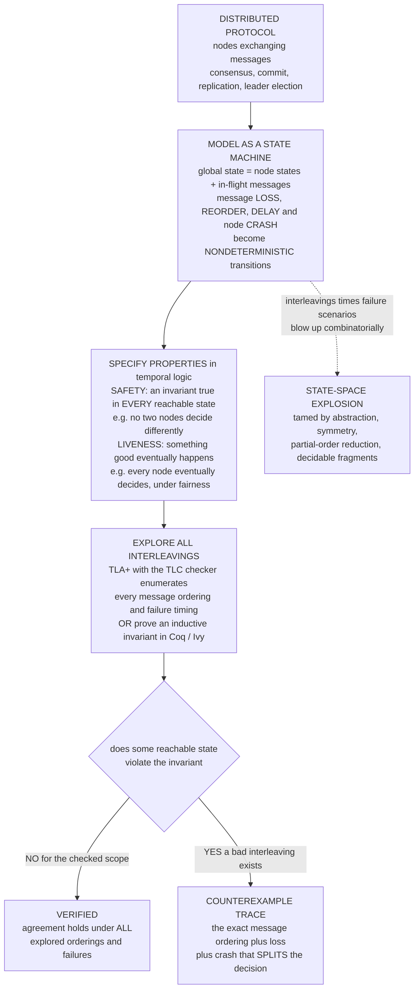

# 🛰️ Protocol and Distributed System Verification

> [!abstract] TL;DR
> **Protocol and distributed-system verification** applies formal methods to the *hardest* place software can break: concurrent, message-passing, partially-failing systems where **messages drop, reorder, and arrive late**, **nodes crash or stall**, and everything runs **asynchronously**. The number of possible executions — every interleaving of messages crossed with every failure scenario — is **astronomical**, and the fatal bugs (lost data, split-brain, two conflicting decisions) live in rare orderings that **no test suite ever hits**. The remedy is to model a protocol as a **state machine over global states** (each node's local state *plus* the bag of in-flight messages), turn message loss/reorder/delay and crashes into **nondeterministic transitions**, and then either **model-check every interleaving** (exhaustively) or **prove invariants for all sizes**. Properties split into **SAFETY** ("never two conflicting decisions," "no lost update," linearizability — an invariant true in *every* reachable state) and **LIVENESS** ("eventually decides / terminates" — progress, which needs **fairness** and a **failure model** because the **FLP impossibility** forbids guaranteed async consensus with even one crash). The flagship tool is **TLA+** with the **TLC** model checker (Leslie Lamport); its landmark industrial win is Amazon's use of TLA+ to find deep, real bugs in **S3, DynamoDB**, and internal replication protocols that had survived design review and years of testing. The frontier — parameterized verification (correct for *any* N nodes) is undecidable in general; the field fights it with abstraction, symmetry, decidable fragments (Ivy), and interactive proof (Coq/IronFleet, Verdi).

---

## Intuition

**Analogy — coordinating a heist where the crew can only pass notes.** Picture planning a bank job where the crew is scattered across the city and the *only* way to communicate is by passing hand-written notes. The notes sometimes get **lost** in the crowd, sometimes arrive **out of order** (the "go now" note beats the "wait" note it was supposed to follow), and sometimes show up **hours late**. Worse, any crew member might **faint at any moment** — mid-plan, mid-note, right before the critical step. And yet, despite all this, the whole crew must still act on **one single plan**: if half the crew thinks "the vault is open, grab it" while the other half thinks "abort, we were spotted," the job — and everyone in it — is finished.

Distributed protocols live in *exactly* this nightmare. Messages drop, reorder, and delay; nodes crash; clocks disagree; yet the system must still **agree on one answer** — commit or abort, this leader or that one, this value in the log. The catastrophic bugs hide in bizarre timing corners that no test ever thinks to hit: the twelfth message arriving *just before* the crash everyone assumed would come *after*. This is precisely why Amazon writes its most critical protocols in **TLA+** and lets a **model checker** mechanically explore *millions* of message orderings and failure timings — catching, in minutes, flaws that had survived years of code review. The lesson of the field in one line: **testing samples a vanishing fraction of the executions; verification explores all of them (within a checked scope).** (This note is the formal-methods-vault companion to the distributed-systems-vault view in [[Distributed_Systems_Theory/06_Advanced_Topics_and_Frontiers/Formal_Verification_TLA_Plus|Formal Verification and TLA+]].)

---

## How It Works

### Core mechanics

**1. Model the protocol as a state machine over *global* states.** The core move — shared with `Model_Checking_Fundamentals` and with process calculi (`Concurrency_Verification_and_Process_Calculi`) — is to describe the whole system as a transition system. A **global state** is *every node's local state* (program counter, log, chosen value) **plus the multiset of in-flight messages** (the notes still in transit). An **initial predicate** fixes the legal start states; a **next-state relation** is a disjunction of **actions**, each an enabled before-and-after step.

**2. Turn the network's cruelty into nondeterminism.** The three horsemen of distribution become ordinary nondeterministic transitions:
   - **Message reorder** — any in-flight message may be delivered next, in any order.
   - **Message loss** — an in-flight message may simply be dropped.
   - **Message delay / duplication** — a message may linger arbitrarily long, or be delivered more than once.
   - **Crashes** — a node may stop (crash-stop), or stop and later restart (crash-recovery), or behave arbitrarily (**Byzantine**). Which faults are allowed is the **failure model**, declared up front.
   The model checker then explores *every* enabled choice, which is exactly what makes it explore *every* interleaving and failure scenario a real network could produce.

**3. State the correctness properties in temporal logic.** Following Lamport's foundational split (developed in `Linear_and_Branching_Temporal_Logic` and the modal-logic note), essentially every property is a conjunction of two shapes:
   - **SAFETY** — "*nothing bad ever happens*." An **invariant** true in *every* reachable state. Examples: "**never two nodes decide differently**" (agreement), "**a committed update is never lost**," "**never two leaders in one term**," "**linearizable history**." A safety property is refuted by a **finite** bad trace, written `[]Invariant` ("always").
   - **LIVENESS** — "*something good eventually happens*." Examples: "**every node eventually decides**," "**a leader is eventually elected**," "**the protocol terminates**." Refuted by an **infinite** non-progressing run, written `<>Good` ("eventually"). It needs **fairness** assumptions (a continuously-enabled action is not ignored forever) — otherwise the do-nothing behaviour refutes everything.

**4. Model-check all interleavings, OR prove invariants.** Two complementary regimes:
   - **Model checking** (TLA+/**TLC**, SPIN/Promela): bound the instance (e.g. 3 nodes, small value domain), then do exhaustive breadth-first search of the reachable global-state graph, checking the invariant at every state and searching for bad liveness cycles. On failure it returns the **exact shortest counterexample interleaving** — a debugging gift no failed test provides.
   - **Deductive proof** (Coq/**Verdi**, Dafny/**IronFleet**, TLAPS, **Ivy**): prove the invariant holds for *all* sizes by finding an **inductive invariant** and discharging it — unbounded, but far more effort. Interactive proof is the subject of `Interactive_Theorem_Proving`; end-to-end verified implementations are the subject of `Verified_Compilers_and_Operating_Systems`.

**5. The FLP wall dictates the shape of every guarantee.** The **FLP impossibility** proves that in a fully asynchronous system, *no* deterministic protocol can guarantee consensus if even **one** node may crash — you cannot have safety *and* guaranteed termination. So real protocols keep **safety always** and buy **liveness** only under extra assumptions (partial synchrony, failure detectors, randomization). Verification makes this precise: you check safety unconditionally and check liveness *under the declared fairness and failure model*.

### Flow / Architecture



---

## Key Concepts

### Secondary (intuitive level)
- A **distributed protocol** is a plan carried out by machines that can only **pass messages**, where messages may be **lost, reordered, or delayed** and machines may **crash**.
- **Testing** tries a handful of runs and hopes to hit the bug. **Verification** explores *every* possible ordering and failure — or *proves* the bug cannot occur.
- **Safety** = "a bad thing never happens" (never two conflicting decisions). **Liveness** = "a good thing eventually happens" (everyone eventually decides).
- **TLA+** is the language distributed-systems engineers at **Amazon/AWS** use to write a protocol down so a **model checker** can inspect every corner of it.

### Undergraduate (mechanism level)
- **Global state** — every node's local state *plus* the multiset of **in-flight messages**; the unit the model checker enumerates.
- **Nondeterministic network actions** — deliver-any-message (reorder), drop-a-message (loss), delay, duplicate; **crash-stop / crash-recovery / Byzantine** for node failures — collectively the **failure model**.
- **Safety invariant** — a predicate true in every reachable state (agreement, no-lost-update, linearizability); refuted by a **finite** counterexample interleaving.
- **Liveness + fairness** — an eventually-property refuted by an **infinite** stalling run; requires **weak/strong fairness** so trivial stuttering does not refute it.
- **TLC model checking** vs **inductive-invariant proof** — bounded-but-automatic exhaustive search versus unbounded-but-manual proof.
- **State-space explosion** — global states grow combinatorially in nodes × messages × values; the central scaling obstacle.

### Graduate (research level)
- **The FLP impossibility** — no deterministic asynchronous protocol solves consensus with one crash fault; formally, safety is keepable but termination (liveness) is not guaranteeable without added assumptions (partial synchrony, `Ω` failure detectors, randomization).
- **Inductive invariants** — model checking finds bugs; unbounded proof needs an invariant `I` with `Init => I`, `I /\ Next => I'`, `I => Safe`. Discovering `I` (often much stronger than the target) is the hard creative step; **Ivy** helps by restricting to a **decidable fragment** (effectively-propositional, EPR) so implication checks stay push-button and counterexamples-to-induction are concrete.
- **Parameterized verification** — proving correctness for *any* number `N` of nodes is **undecidable in general** (reductions from the halting problem); tractable only via **cutoffs** (small N suffices), **well-structured transition systems**, or hand-crafted parameterized invariants.
- **Explosion-fighting** — **symmetry reduction** (interchangeable nodes → one representative), **partial-order reduction** (commuting message deliveries explored once), abstraction/CEGAR, and **symbolic** checking (Apalache compiles TLA+ to SMT).
- **Fault-model spectrum** — crash-stop ⊂ crash-recovery ⊂ omission ⊂ **Byzantine**; PBFT/blockchain consensus verification must quantify over adversarial message behaviour, sharply raising the interleaving count.
- **Refinement & compositional proof** — implementation ⊑ specification (stuttering-invariant refinement in TLA+); **IronFleet** layers `Host` ⊑ `Protocol` ⊑ `Spec`; **Verdi** lifts a proof under an idealized network to one under a lossy/reordering network via verified system transformers.

---

## Python Demo

> [!note] A tiny **distributed-protocol model checker**, in the spirit of TLA+/TLC.
> We model a **message-passing agreement protocol** as a transition system over **global states** — each node's decision *plus the set of in-flight messages*. An initiator commits value `C` and **broadcasts** it; each follower either **delivers** the message (and agrees) or, buggily, **times out to a default `A`bort** if its message was **lost**. Message **loss** is a nondeterministic transition. We exhaustively explore all reachable global states and check the **safety invariant** *"no two nodes decide differently"* (agreement). Under message loss the invariant is **violated**, and the checker extracts the **exact counterexample interleaving**. Part (b) plots the **state-space explosion** — reachable global states vs number of nodes — motivating abstraction/symmetry. numpy + matplotlib, pure stdlib BFS (no external solver).

```python
"""
A distributed-protocol model checker in the spirit of TLA+/TLC.
Protocol: an initiator broadcasts a COMMIT; followers either DELIVER it (agree)
or, if their message is LOST, buggily TIME OUT to a default ABORT -> disagreement.
We BFS the reachable GLOBAL states (node decisions + in-flight message set),
check the AGREEMENT safety invariant, and extract the shortest COUNTEREXAMPLE.
"""
import numpy as np
import matplotlib.pyplot as plt
from matplotlib.patches import FancyArrowPatch
from collections import deque

UNDECIDED, ABORT, COMMIT = -1, 0, 1          # per-node decision
SYM = {UNDECIDED: "?", ABORT: "A", COMMIT: "C"}

# ---------------------------------------------------------------------------
# 1. THE PROTOCOL as (init, next-state relation) over GLOBAL states.
#    global state = (decisions tuple, frozenset of followers with an in-flight msg)
#    node 0 = initiator; nodes 1..n-1 = followers.
# ---------------------------------------------------------------------------
def init_state(n):
    return ((UNDECIDED,) * n, frozenset())

def successors(state, n):
    d, pending = state
    out = []
    # (a) initiator decides COMMIT and BROADCASTS to every follower
    if d[0] == UNDECIDED:
        nd = list(d); nd[0] = COMMIT
        out.append(("init_bcast", (tuple(nd), frozenset(range(1, n)))))
    for t in range(1, n):
        # (b) DELIVER: follower receives its message and agrees (COMMIT)
        if t in pending and d[t] == UNDECIDED:
            nd = list(d); nd[t] = COMMIT
            out.append((f"deliver_{t}", (tuple(nd), pending - {t})))
        # (c) LOSS: the network drops an in-flight message (nondeterministic)
        if t in pending:
            out.append((f"loss_{t}", (d, pending - {t})))
        # (d) TIMEOUT (the BUG): protocol started, msg already lost -> decide ABORT
        if d[0] == COMMIT and d[t] == UNDECIDED and t not in pending:
            nd = list(d); nd[t] = ABORT
            out.append((f"timeout_{t}", (tuple(nd), pending)))
    return out

def agreement_holds(state):
    """SAFETY invariant: no two DECIDED nodes hold different values."""
    decided = [x for x in state[0] if x != UNDECIDED]
    return len(set(decided)) <= 1

# ---------------------------------------------------------------------------
# 2. GENERIC MODEL CHECKER: exhaustive BFS over reachable global states.
#    First invariant-violating state dequeued is closest to init (BFS order),
#    so its parent chain is the SHORTEST counterexample interleaving.
# ---------------------------------------------------------------------------
def model_check(n):
    s0 = init_state(n)
    parent = {s0: None}                      # state -> (prev_state, action_label)
    seen, order, q = {s0}, [s0], deque([s0])
    violation = None
    while q:
        s = q.popleft()
        if violation is None and not agreement_holds(s):
            violation = s
        for label, t in successors(s, n):
            if t not in seen:
                seen.add(t); parent[t] = (s, label); order.append(t); q.append(t)
    return seen, parent, order, violation

def trace_to(parent, bad):
    steps, s = [], bad
    while parent[s] is not None:
        prev, label = parent[s]
        steps.append((label, s)); s = prev
    steps.append(("<INIT>", s))
    return list(reversed(steps))

# ---------------------------------------------------------------------------
# 3. RUN on a 2-node instance (initiator + 1 follower): find the counterexample.
# ---------------------------------------------------------------------------
N = 2
seen, parent, order, viol = model_check(N)
print("=" * 70)
print(f"Message-passing agreement protocol, n={N} nodes")
print(f"  reachable global states : {len(seen)}")
print(f"  agreement invariant     : {'HOLDS' if viol is None else 'VIOLATED'}")
cex = trace_to(parent, viol)
print("  COUNTEREXAMPLE interleaving (the exact ordering that splits the decision):")
for k, (label, st) in enumerate(cex):
    d, pend = st
    tag = "   <-- SPLIT DECISION (C vs A)" if not agreement_holds(st) else ""
    print(f"    step {k}: {label:12s} decisions={''.join(SYM[x] for x in d)} "
          f"in_flight={sorted(pend) if pend else '-'}{tag}")
print("  ^ initiator COMMITs, the follower's message is LOST, it TIMES OUT to ABORT.")

# ---------------------------------------------------------------------------
# 4. STATE-SPACE EXPLOSION: reachable global states vs number of nodes.
# ---------------------------------------------------------------------------
ns = np.arange(2, 8)
counts = np.array([len(model_check(int(n))[0]) for n in ns])
print("\nState-space growth:")
for n, c in zip(ns, counts):
    print(f"  {n} nodes -> {c:5d} reachable global states")

# ---------------------------------------------------------------------------
# 5. VISUALIZE: (left) global-state graph for n=2 with counterexample path,
#    (right) the state-space explosion curve.
# ---------------------------------------------------------------------------
def lbl(st):
    d, pend = st
    p = "".join(str(t) for t in sorted(pend)) or "-"
    return "".join(SYM[x] for x in d) + "\nmsg:" + p

def depth_of(st):
    d = 0
    while parent[st] is not None:
        st = parent[st][0]; d += 1
    return d

# layer states by BFS depth for a clean layout
layers = {}
for st in seen:
    layers.setdefault(depth_of(st), []).append(st)
pos = {}
for dep, states in layers.items():
    states.sort(key=lbl)
    xs = np.linspace(-1, 1, len(states)) if len(states) > 1 else np.array([0.0])
    for x, st in zip(xs, states):
        pos[st] = (float(x), -float(dep))

cex_states = {st for _, st in cex}
cex_edges = {(a, b) for (_, a), (_, b) in zip(cex, cex[1:])}

fig, (axG, axE) = plt.subplots(1, 2, figsize=(15, 6.5))

# --- left: reachable global-state graph with counterexample highlighted ---
for u in seen:
    for _, v in successors(u, N):
        if v in pos:
            hot = (u, v) in cex_edges
            axG.add_patch(FancyArrowPatch(
                pos[u], pos[v], arrowstyle="-|>", mutation_scale=14,
                color="#d94f2b" if hot else "#c9c9c9",
                lw=2.8 if hot else 1.1, zorder=3 if hot else 1,
                shrinkA=20, shrinkB=20, connectionstyle="arc3,rad=0.06"))
for st, (x, y) in pos.items():
    if not agreement_holds(st):   col = "#c0392b"    # safety violation
    elif st == init_state(N):     col = "#27ae60"    # initial state
    elif st in cex_states:        col = "#e67e22"    # on the counterexample
    else:                         col = "#2e73b8"
    axG.scatter([x], [y], s=1900, color=col, edgecolors="black", linewidths=1.3, zorder=4)
    axG.text(x, y, lbl(st), ha="center", va="center", color="white",
             fontsize=8, fontweight="bold", zorder=5)
axG.set_title("Reachable GLOBAL-state graph (n=2)\n"
              "red path = shortest COUNTEREXAMPLE, red node = agreement violated\n"
              "label = decisions (C=commit A=abort ?=undecided) + in-flight msgs",
              fontsize=10, fontweight="bold")
axG.axis("off"); axG.margins(0.15)

# --- right: state-space explosion ---
axE.semilogy(ns, counts, "o-", color="#8e44ad", lw=2.5, markersize=9)
for n, c in zip(ns, counts):
    axE.annotate(str(int(c)), (n, c), textcoords="offset points",
                 xytext=(0, 9), ha="center", fontsize=9, fontweight="bold")
axE.set_xlabel("number of nodes  n"); axE.set_ylabel("reachable global states (log scale)")
axE.set_title("STATE-SPACE EXPLOSION\ninterleavings x failures blow up combinatorially\n"
              "-> motivates abstraction / symmetry reduction", fontsize=10, fontweight="bold")
axE.set_xticks(ns); axE.grid(True, which="both", ls=":", alpha=0.5)

fig.suptitle("Model-checking a distributed protocol: exhaustive search finds the "
             "exact message ordering + loss that TESTING would miss",
             fontsize=12, fontweight="bold")
fig.tight_layout()
plt.savefig("distributed_protocol_verification.png", dpi=125, bbox_inches="tight")
print("\nsaved figure -> distributed_protocol_verification.png")
```

**What you observe.** The checker explores the *entire* reachable global-state graph. On the 2-node instance it reports the safety invariant **VIOLATED** and prints the exact 3-step counterexample: `init_bcast -> loss_1 -> timeout_1` — the initiator commits `C`, the follower's message is **lost**, and the follower buggily **times out to `A`bort**, so the two nodes decide *differently*. That concrete interleaving *is* the bug report — no test that happened to deliver the message would ever have found it. The left plot highlights this shortest path in red ending at the red violating state; the right plot shows the **reachable global-state count exploding** as nodes are added — the very reason real checkers need symmetry reduction, partial-order reduction, and small scopes. This is TLC's loop in miniature: enumerate every global state, check the invariant, and on failure hand back the shortest violating trace.

---

## Real-World Applications

- **Amazon Web Services (the canonical industrial win).** Newcombe et al., *"How Amazon Web Services Uses Formal Methods"* (CACM 2015), report using **TLA+** across **S3, DynamoDB, EBS**, and internal replication/locking services. TLC found subtle design bugs — including one that could **corrupt data** and one that surfaced only in a **35-step** interleaving no human imagined — in designs that had passed extensive review and testing. TLA+ is now part of AWS's design process for critical distributed protocols (see [[Distributed_Systems_Theory/06_Advanced_Topics_and_Frontiers/Formal_Verification_TLA_Plus|Formal Verification and TLA+]]).
- **Consensus protocols themselves.** **Raft** ships with an official TLA+ specification (Ongaro); **Paxos**/**Multi-Paxos** have well-known TLA+ models by Lamport. These are the reference artifacts people study to understand [[Distributed_Systems_Theory/03_Consensus_and_Agreement/Raft_Consensus|Raft]] and [[Distributed_Systems_Theory/03_Consensus_and_Agreement/Paxos|Paxos]] rigorously; **IronFleet** (Microsoft) proved a Paxos-based replicated store *end-to-end*, and **Verdi** produced a machine-checked **Raft** implementation in Coq.
- **Azure Cosmos DB & cloud databases.** The Cosmos DB team specified its **five consistency levels** in TLA+ and model-checked that the implementation honours them; **MongoDB** and **CockroachDB** maintain TLA+ specs of their replication/transaction layers to validate corner cases before shipping.
- **Decidable protocol verification with Ivy.** Padon et al.'s **Ivy** verifies distributed protocols (leader election, Paxos variants, cache coherence) by restricting reasoning to a **decidable logic fragment (EPR)** so implication checks stay automatic and counterexamples-to-induction are concrete — a different point on the automation/generality trade-off from TLC.
- **The P language (Microsoft/Amazon).** **P** is an event-driven state-machine language used to model and systematically test asynchronous systems — from USB device drivers in Windows to Amazon's storage and networking services — catching interleaving bugs before deployment.
- **Byzantine & blockchain consensus.** [[Distributed_Systems_Theory/03_Consensus_and_Agreement/Byzantine_Agreement_and_PBFT|BFT protocols (PBFT)]] and modern blockchain consensus push verification hardest — the adversary controls message behaviour — making safety/liveness under malicious faults a prime target for both model checking and interactive proof.

---

## Common Pitfalls

- **Believing testing can cover it.** Distributed bugs hide in message **reordering / loss / delay** crossed with node **crashes** and async timing — an **astronomical** number of interleavings. Testing samples a vanishing fraction; a green test suite says almost nothing about the rare fatal ordering. Verification (esp. model checking) is the only tool that explores *all* of them within a scope.
- **Confusing safety and liveness.** **Safety** (agreement, consistency — *never* two conflicting decisions) is an invariant refuted by a **finite** trace. **Liveness** (progress, termination — *eventually* decide) is refuted by an **infinite** stalling run and needs **fairness** *and* a **failure model**. Trying to state "eventually terminates" as an invariant is a category error — and the **FLP impossibility** guarantees you cannot have both unconditionally under asynchrony with a crash.
- **Forgetting fairness (liveness fails instantly).** Without weak/strong fairness, the do-nothing behaviour trivially refutes every liveness property. A liveness check that "fails immediately" almost always means you forgot to declare fairness on the relevant actions.
- **"Verified" means "for the checked scope," not all sizes.** TLC proves the property for the *finite* instance you bounded (e.g. 3 nodes, 2 values). That is strong evidence (small-model hypothesis) but **not** a proof for 300 nodes — **parameterized verification** (any N) is **undecidable in general** and needs cutoffs, decidable fragments (Ivy), or interactive proof (Coq/IronFleet).
- **State-space explosion left unmanaged.** Global states grow combinatorially in nodes × in-flight messages × values; naive enumeration dies. Reach for **symmetry reduction**, **partial-order reduction**, abstraction, and symbolic/SMT checking (**Apalache**) *by design*, not as a rescue.
- **Modelling at the wrong abstraction level.** Specifying byte layouts and TCP details explodes the state space and buries the design bug. TLA+'s power comes from abstracting to the **essential protocol logic** — nodes, messages, decisions — not the wire format.
- **Trusting the spec-to-code gap.** Model checking the *design* does not verify your *implementation* matches it. AWS's own caveat: TLA+ finds **design** bugs; coding bugs still need tests, and closing the gap fully needs **Verdi/IronFleet**-style refinement proofs. Verification and testing are complementary, not substitutes.

---

## Related Concepts

- [[Distributed_Systems_Theory/06_Advanced_Topics_and_Frontiers/Formal_Verification_TLA_Plus|Formal Verification and TLA+]] — the distributed-systems-vault companion to this note: TLA+/TLC mechanics, PlusCal, and the AWS story in depth. This note is the formal-methods-vault view.
- [[Distributed_Systems_Theory/03_Consensus_and_Agreement/The_Consensus_Problem|The Consensus Problem]] — the protocols most worth verifying; consensus **agreement** (safety) and **termination** (liveness) are exactly the invariant/liveness pair the tools express.
- [[Distributed_Systems_Theory/03_Consensus_and_Agreement/FLP_Impossibility_Result|FLP Impossibility Result]] — why liveness needs assumptions: no deterministic async consensus with one crash, so real protocols keep safety always and buy liveness under partial synchrony.
- [[Distributed_Systems_Theory/03_Consensus_and_Agreement/Paxos|Paxos]] — specified in TLA+ by Lamport and proven end-to-end by IronFleet; the archetype of "consensus you can actually verify."
- [[Distributed_Systems_Theory/03_Consensus_and_Agreement/Raft_Consensus|Raft Consensus]] — ships with an official TLA+ spec and a full Coq/Verdi machine-checked implementation.
- [[Distributed_Systems_Theory/03_Consensus_and_Agreement/Byzantine_Agreement_and_PBFT|Byzantine Agreement and PBFT]] — the hardest fault model; verifying safety/liveness under adversarial messages, the frontier that reaches into blockchain consensus.
- [[Distributed_Systems_Theory/03_Consensus_and_Agreement/Atomic_Commitment|Atomic Commitment (2PC/3PC)]] — two- and three-phase commit are textbook TLA+/PlusCal exercises; model checking exposes 2PC blocking and the "no node commits while another aborts" invariant, exactly the agreement bug the demo reproduces.
- [[Distributed_Systems_Theory/01_Foundations_and_Models/Failure_Models|Failure Models]] — crash-stop / crash-recovery / Byzantine: the declared failure model that verification quantifies over.
- [[Distributed_Systems_Theory/04_Consistency_and_Replication/Linearizability_and_Sequential_Consistency|Linearizability and Sequential Consistency]] — the consistency guarantees (as in Cosmos DB) that are specified and checked as TLA+ invariants over histories.
- [[Mathematical_Logic/06_Frontiers_and_Foundations/Modal_and_Temporal_Logic|Modal and Temporal Logic]] — the temporal-logic property language (`[]` always, `<>` eventually) in which safety and liveness are stated and checked.
- [[Operating_Systems/06_Distributed_and_Modern_OS/Distributed_Operating_Systems|Distributed Operating Systems]] — the systems whose replication, locking, and RPC protocols are the practical targets of this verification.
- [[Blockchain/01_Blockchain_Fundamentals/Consensus_Mechanisms|Consensus Mechanisms]] — Byzantine-fault-tolerant and Nakamoto consensus whose safety/liveness under adversarial networks is an active verification frontier.

*Formal-methods-vault siblings referenced in prose above (developed in their own notes): **Model_Checking_Fundamentals** (the exhaustive-search engine), **Linear_and_Branching_Temporal_Logic** (LTL/CTL property language), **Concurrency_Verification_and_Process_Calculi** (the concurrency-theory foundation), **Interactive_Theorem_Proving** (the unbounded-proof end), and **Verified_Compilers_and_Operating_Systems** (end-to-end machine-checked systems).*

---

## Review Questions

1. **(Secondary)** Using the heist-with-notes analogy, explain why *testing* a distributed protocol can pass thousands of times and still ship a catastrophic bug, whereas *model checking* does not. In your answer, define **safety** and **liveness** in plain language with one everyday example of each, and say why "the crew must act on one plan" is a *safety* requirement.
2. **(Undergraduate)** In the Python demo the counterexample is `init_bcast -> loss_1 -> timeout_1`. Walk through what each step does to the `decisions` and `in_flight` message set, and pinpoint *exactly* why allowing a follower to **time out to a default** is what breaks agreement. What single design change would make the protocol safe (hint: what must a follower do *before* deciding alone), and why does message **loss** rather than reordering trigger this particular bug?
3. **(Undergraduate)** The checker explores the reachable global-state graph **breadth-first**. Explain why BFS (not DFS) guarantees the reported counterexample interleaving is the **shortest**, and why a short trace is so valuable when debugging a distributed protocol.
4. **(Graduate)** State the **FLP impossibility** precisely and explain how it shapes what you can even *ask* a verifier to prove: which of safety and liveness can be established unconditionally, and what extra assumptions (partial synchrony, failure detectors, fairness, randomization) must you add to check the other? Tie this to why the demo's invariant is a *safety* property.
5. **(Graduate)** You must gain confidence in a new replication protocol. Argue when you would reach for **model checking (TLC/Apalache)** versus **inductive-invariant proof (Ivy)** versus **interactive theorem proving (Coq/IronFleet)**, framing your answer around the automation-vs-generality trade-off, the small-model hypothesis, the undecidability of **parameterized** verification (any N nodes), and the **spec-to-code gap**. Reference Verdi or IronFleet to illustrate the high-assurance end.

---

## Sources

- Newcombe, C., Rath, T., Zhang, F., Munteanu, B., Brooker, M., & Deardeuff, M. (2015). *How Amazon Web Services Uses Formal Methods.* Communications of the ACM, 58(4), 66–73. [DOI](https://doi.org/10.1145/2699417)
- Lamport, L. (2002). *Specifying Systems: The TLA+ Language and Tools for Hardware and Software Engineers.* Addison-Wesley. [Book PDF](https://lamport.azurewebsites.net/tla/book.html)
- Fischer, M. J., Lynch, N. A., & Paterson, M. S. (1985). *Impossibility of Distributed Consensus with One Faulty Process.* Journal of the ACM, 32(2), 374–382. [DOI](https://doi.org/10.1145/3149.214121)
- Padon, O., McMillan, K. L., Panda, A., Sagiv, M., & Shoham, S. (2016). *Ivy: Safety Verification by Interactive Generalization.* PLDI 2016, 614–630. [DOI](https://doi.org/10.1145/2908080.2908118)
- Ongaro, D., & Ousterhout, J. (2014). *In Search of an Understandable Consensus Algorithm (Raft).* USENIX ATC 2014 — ships with an official TLA+ specification. [Paper](https://raft.github.io/raft.pdf)

---

#formal-methods #distributed-systems #tla-plus #consensus #protocol-verification
