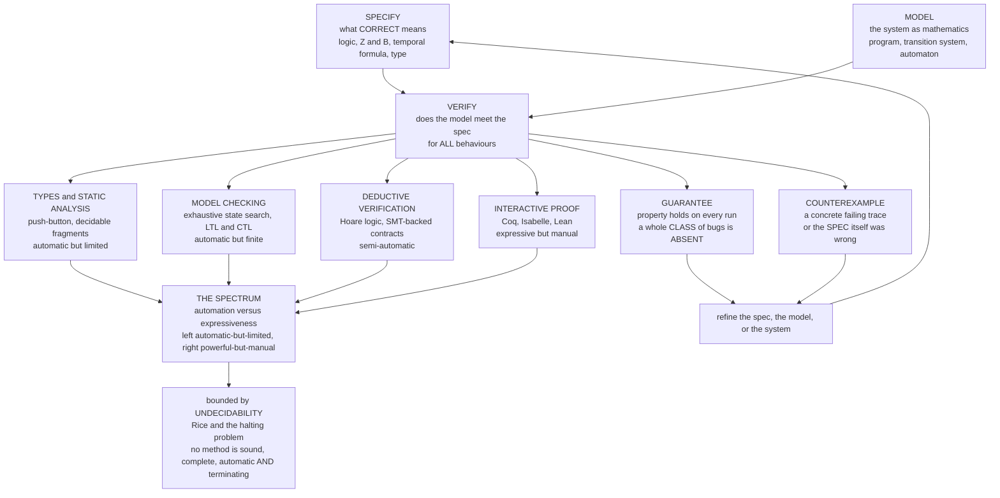

# 🏛️ The Reach and Future of Formal Methods

> [!abstract] TL;DR
> For most of engineering history, a bridge stood because the **mathematics said so** — but software was built by trial and error, shipped, and patched when it broke. **Formal methods** are software engineering finally growing up: replacing *"we tested it and it seems fine"* with *"we **proved** it correct."* This capstone steps back over the whole 36-note vault and draws out its **unifying spine**: every technique — from a [[Type_Based_Verification|type checker]] to a machine-checked [[Interactive_Theorem_Proving|proof of an OS kernel]] — does the same three things (**specify → model → verify**) and lives somewhere on one eternal **spectrum** running from *automatic-but-limited* ([[Type_Based_Verification|types]], [[Static_Program_Analysis|static analysis]], [[Model_Checking_Fundamentals|model checking]]) to *powerful-but-manual* ([[Interactive_Theorem_Proving|interactive proof]]). That spectrum exists because the field is **one long negotiation with computability** — the [[The_Halting_Problem_and_Undecidability|halting problem]] and Rice's theorem forbid any method that is simultaneously sound, complete, automatic, and terminating. The recurring foe is **state-space explosion**, fought with [[Symbolic_Model_Checking_and_BDDs|symbolic]], [[Bounded_Model_Checking|bounded]], and [[Abstraction_Refinement_and_CEGAR|abstraction]] techniques. Once an academic dream too costly to use, formal methods now quietly guarantee the chips in your phone, the code flying planes, the cloud storing your data, and the crypto guarding your messages — while their limits (the **spec gap**, the **trusted base**, and undecidability itself) remain honestly unclosed. This is the **hub** of the vault; it wikilinks liberally across all six sections.

---

## Intuition

**Analogy — the discipline that grew up.** For most of history, engineering *trusted its calculations*. A bridge stands because a structural engineer wrote down the loads, the stresses, and the material strengths and **proved** — before a single beam was welded — that it holds for every load within spec. Nobody drives a thousand trucks across to "test" it and hopes. But software, for its first half-century, was built the *other* way: write it, run it on a few inputs, ship it, and patch it in production when a customer trips over the bug you never tried. We normalized shipping broken things because the "material" felt weightless and the fixes felt cheap.

**Formal methods are software engineering finally growing up** — the move from *"we tested it and it seems fine"* to *"we **proved** it correct."* A test is one truck; a proof is the engineer's calculation. Once this was an academic dream, elegant but far too costly for real code. It is no longer. Verified compilers and kernels, model-checked cloud protocols, formally analyzed avionics, and machine-proven cryptography now sit quietly beneath the technology you use every hour. This capstone is the step back: it sees the *whole discipline* at once — its unifying ideas, its hard-won victories, its permanent limits, and where "proving software correct" goes next.

---

## How It Works

### The whole vault, synthesized

Six sections, one idea. Every note in this vault is a way of doing the *same three activities* — **specify** what correct means, **model** the system mathematically, **verify** that the model meets the spec for *all* behaviours — and every technique sits somewhere on *one spectrum* forced into being by *one theorem* about the limits of computation.

**1. Specification and refinement — pinning down "correct" (Section 1).** Everything downstream proves *"the system meets **this**"*, so the spec is the anchor. [[Formal_Specification_Languages|Formal specification languages]] replace ambiguous English with math that has exactly one meaning: [[Set_Based_Specification_Z_and_B|set-based Z and B]], [[State_Based_Modeling_and_Invariants|state machines with invariants]], and [[Algebraic_Specification_and_Abstract_Data_Types|algebraic specs]] of abstract data types. [[Refinement_and_Correctness_by_Construction|Refinement]] then builds a chain of ever-more-concrete models, each provably preserving the last — *correct by construction*, ending at running code.

**2. Logic, proof, and solvers — the engine room (Section 2).** [[Logic_for_Program_Verification|Logic]] is the substrate. Proof comes in two flavours: [[Interactive_Theorem_Proving|interactive theorem proving]] (Coq, Isabelle, Lean — a human guides, the machine checks) and [[Automated_Theorem_Proving|automated theorem proving]]. Beneath modern automation sit the industrial workhorses: [[SAT_Solving_and_DPLL|SAT solvers with DPLL]], [[SMT_Solving_and_Satisfiability_Modulo_Theories|SMT solvers]] that add theories of arithmetic, arrays, and bit-vectors, and the [[Decision_Procedures_and_Theories|decision procedures]] that make specific logical fragments *automatable*.

**3. Deductive program verification — proving a program line by line (Section 3).** [[Hoare_Logic_and_Axiomatic_Semantics|Hoare logic]]'s `{P} C {Q}` triples and Dijkstra's [[Weakest_Preconditions_and_Predicate_Transformers|weakest preconditions]] turn "this program is correct" into a logical formula a solver can discharge — provided a human supplies the [[Loop_Invariants_and_Termination_Proofs|loop invariants and termination measures]]. [[Separation_Logic_and_Heap_Reasoning|Separation logic]] extends this to the pointer-manipulating heap, and [[Deductive_Verification_Tools|deductive tools]] like Dafny and Why3 package it for practitioners.

**4. Model checking and temporal logic — exhaustive automatic search (Section 4).** [[Model_Checking_Fundamentals|Model checking]] explores a system's *entire* reachable state space, returning a proof or a concrete **counterexample trace**. Properties are stated in [[Linear_and_Branching_Temporal_Logic|LTL and CTL]] (safety and liveness), checked via [[Automata_on_Infinite_Words|Büchi automata]] over infinite runs. Its enemy, state-space explosion, is fought with [[Symbolic_Model_Checking_and_BDDs|symbolic BDD-based methods]], [[Bounded_Model_Checking|SAT-based bounded model checking]], and [[Abstraction_Refinement_and_CEGAR|counterexample-guided abstraction refinement]].

**5. Static analysis and abstraction — scalable approximation (Section 5).** [[Static_Program_Analysis|Static analysis]] and [[Abstract_Interpretation|abstract interpretation]] compute a **sound over-approximation** of all runs *without running them*, scaling to millions of lines at the cost of false alarms; [[Dataflow_and_Pointer_Analysis|dataflow and pointer analysis]] and [[Symbolic_Execution|symbolic execution]] fill in the machinery, and [[Type_Based_Verification|type-based verification]] is the most widely deployed formal method on Earth.

**6. Applications and frontiers — where it all lands (Section 6, this section).** Verified hardware, distributed protocols in TLA+, verified compilers and kernels (CompCert, seL4), security and cryptographic proofs, and the newest frontier — verifying **machine-learning and neural-network** systems. *(Section-6 sibling notes on hardware verification, protocol/distributed verification, verified compilers and OS, security/crypto, and ML/neural-net verification are referenced in prose throughout; wikilinks are added as those notes land on disk.)*

### The five unifying ideas

- **The shared workflow.** *Specify → model → verify → guarantee-or-counterexample.* Every technique is a way of doing this loop; they differ only in *how* they verify.
- **The eternal spectrum.** From **automatic-but-limited** (types, static analysis, model checking — push-button, decidable fragments) to **powerful-but-manual** (interactive proof — undecidable, rich logic). The dial you turn is **automation vs expressiveness**.
- **Undecidability forces the trade-off.** By the [[The_Halting_Problem_and_Undecidability|halting problem]] and Rice's theorem ([[Decidability_and_Recognizability|decidability]]), *no* algorithm decides every non-trivial semantic property of every program. So automatic methods must give ground — restrict the property, the language, or precision — and full generality demands a human. The field is one long negotiation with computability.
- **State-space explosion is the recurring foe.** A `k`-bit system has `2^k` states; `n` threads interleave combinatorially. Symbolic, bounded, abstraction, and compositional/assume-guarantee methods are all counter-attacks.
- **Absence, not sampling.** Testing exhibits the *presence* of bugs on inputs it happens to try; a proof shows their *absence* across the whole space. This is Dijkstra's point, and the reason the field exists.

### Flow / Architecture



*The whole field in one loop: requirements split into a **spec** and a **model**; verification asks whether the second meets the first for **all** runs, returning a universal **guarantee** or a **counterexample**. The four engines fan out along the **automation-vs-expressiveness spectrum**, whose extent is fixed forever by **undecidability**.*

---

## Key Concepts

### Secondary (the big ideas in plain words)
- **Prove, don't just test.** Testing drives a few trucks across the bridge; a proof is the engineer's calculation that it holds for *every* load. Formal methods bring that certainty to software.
- **One spectrum.** Some methods are *push-button but shallow* (a type checker); some are *deep but hand-crafted* (a full proof of a kernel). Same goal, different effort.
- **You can't automate everything.** There is a mathematical law (the halting problem) that forbids a single tool from perfectly checking every program automatically. That law shapes the entire field.
- **Verified means "against a spec."** A proof guarantees the system matches the *spec you wrote*. If the spec is wrong, the proof is worthless — writing the right spec is the hard human part.
- **It already runs the world.** Chips, planes, cloud databases, and encryption apps ship with formal guarantees today; most users never notice.

### Undergraduate (the machinery)
- **The three activities.** *Specify* (logic, Z/B, temporal formulas, types), *model* (transition systems, programs with semantics), *verify* (proof, model checking, static analysis).
- **Safety vs liveness.** *Safety* = "nothing bad ever happens"; *liveness* = "something good eventually happens." [[Linear_and_Branching_Temporal_Logic|LTL and CTL]] express both; [[Automata_on_Infinite_Words|Büchi automata]] give liveness its automata-theoretic teeth.
- **Deductive vs algorithmic.** [[Hoare_Logic_and_Axiomatic_Semantics|Hoare logic]] + [[Weakest_Preconditions_and_Predicate_Transformers|weakest preconditions]] *construct a proof*; [[Model_Checking_Fundamentals|model checking]] *searches a state space*; [[Abstract_Interpretation|abstract interpretation]] *over-approximates* — three points on the spectrum.
- **The solver stack.** [[SAT_Solving_and_DPLL|SAT]] under [[SMT_Solving_and_Satisfiability_Modulo_Theories|SMT]] under [[Bounded_Model_Checking|bounded model checking]] and [[Symbolic_Execution|symbolic execution]]: a shared "reduce verification to a satisfiability query" backbone.
- **State-space explosion.** `2^k` states from `k` bits; the central scalability wall, attacked by [[Symbolic_Model_Checking_and_BDDs|BDDs]], bounding, and [[Abstraction_Refinement_and_CEGAR|CEGAR]].
- **Decidability limits.** Rice's theorem + the [[The_Halting_Problem_and_Undecidability|halting problem]] mean no tool is simultaneously **sound, complete, automatic, and terminating** for all programs; every method sacrifices at least one.

### Graduate (the deep structure)
- **The automation/expressiveness duality is fundamental, not incidental.** It is the software-engineering face of the [[Decidability_and_Recognizability|decidable/semi-decidable/undecidable]] trichotomy: propositional validity is decidable (SAT), first-order validity is semi-decidable, arithmetic truth is neither. Each verification technique picks a rung and inherits its guarantees and its costs.
- **Soundness, completeness, and *relative* completeness.** Hoare logic is sound but only *relatively* complete (Cook): the residual gap is inherited from arithmetic via [[Godels_Incompleteness_Theorems|Gödel's incompleteness]], not a defect of the rules. Static analyzers choose *soundness* (no missed bugs, hence false positives); bug-finders choose *completeness of reports* (no false positives, hence missed bugs). You cannot have all four.
- **Symbolic verification as the great equalizer.** Representing state sets as *formulas* (BDDs, SAT/SMT clauses) rather than *enumerations* is what pushed model checking from `10^6` to `10^{100+}` reachable states — the single biggest practical lever against explosion, echoing the "checking a certificate" duality of [[The_Class_NP_and_Verification|NP verification]].
- **Refinement and compositionality as scaling strategies.** [[Refinement_and_Correctness_by_Construction|Correctness by construction]] and assume-guarantee reasoning tame explosion by *never building the monolith* — the discipline behind seL4's proof and TLA+ specs at cloud scale.
- **The trusted computing base is irreducible.** A proof is only as trustworthy as the prover kernel, the modelling-language semantics, the compiler, and the hardware. Verified toolchains (CompCert + seL4 + verified hardware) *shrink* this base; the [[The_Curry_Howard_Correspondence|Curry–Howard correspondence]] lets the proof and the program be the *same object*, collapsing "does the proof match the code?" entirely.
- **Verifying learned systems.** Neural networks turn verification into *checking a property over a high-dimensional non-linear function* — reachability and robustness reduce to SMT/MILP queries (Reluplex, Marabou), and the frontier runs *both* ways: ML to *automate* verification (learned invariants, neural premise selection, LLM-assisted proof) and verification to *certify* ML (AI safety).

---

## Python Demo

A single **formal-methods synthesis dashboard** tying the whole vault together in four panels: **(1)** the **verification spectrum** — techniques placed on axes of *automation* vs *expressiveness/effort*, from push-button types/analysis to hand-crafted interactive proof; **(2)** the **decidability ladder** — what is automatable, from propositional SAT (decidable) up through SMT theories and first-order logic (semi-decidable) to the halting problem (undecidable); **(3)** **state-space explosion and the frontier** — the reachable states verifiable per decade as symbolic, bounded, and abstraction methods pushed the wall outward; **(4)** the **coverage gap** — a proof covers *all* inputs by construction while testing samples a vanishing fraction. Self-contained `numpy` + `matplotlib`.

```python
# The Formal Methods vault in one dashboard:
# (1) the AUTOMATION vs EXPRESSIVENESS spectrum of techniques,
# (2) the DECIDABILITY ladder of what is automatable,
# (3) STATE-SPACE EXPLOSION and how symbolic/bounded/abstraction pushed the frontier,
# (4) the TESTING-vs-PROOF coverage gap.
# numpy + matplotlib only.

import numpy as np
import matplotlib.pyplot as plt
from matplotlib.patches import FancyArrowPatch

fig, ax = plt.subplots(2, 2, figsize=(15, 11))
fig.suptitle("Formal Methods: Spectrum | Decidability | Explosion | Coverage",
             fontsize=15, fontweight="bold")

# ------------------------------------------------------------------ #
# (1) THE VERIFICATION SPECTRUM: automation vs expressiveness/effort  #
#     x = how automatic (push-button -> manual)                       #
#     y = how expressive / how much a passing result guarantees       #
# ------------------------------------------------------------------ #
a = ax[0, 0]
techniques = [
    # name,                automation(0..1), expressiveness(0..1)
    ("Type checking",             0.97, 0.20),
    ("Static analysis /\nabstract interp.", 0.90, 0.35),
    ("Model checking\n(symbolic)", 0.75, 0.55),
    ("Bounded MC / SMT",          0.68, 0.50),
    ("Deductive verif.\n(Dafny, Why3)", 0.45, 0.78),
    ("Interactive proof\n(Coq, Isabelle, Lean)", 0.12, 0.98),
]
xs = [t[1] for t in techniques]
ys = [t[2] for t in techniques]
colors = plt.cm.plasma(np.linspace(0.1, 0.85, len(techniques)))
a.scatter(xs, ys, s=260, c=colors, edgecolor="k", zorder=3)
for (name, x, y), c in zip(techniques, colors):
    a.annotate(name, (x, y), textcoords="offset points", xytext=(0, 14),
               ha="center", fontsize=8, fontweight="bold")
# the trade-off frontier: more automatic <=> less expressive
a.plot([0.05, 1.0], [1.02, 0.15], ls="--", color="gray", lw=1.5, zorder=1)
a.text(0.55, 0.72, "the fundamental\ntrade-off frontier", fontsize=8,
       color="gray", rotation=-24, ha="center")
a.set_xlabel("more AUTOMATIC  (push-button)  -->", fontsize=9)
a.set_ylabel("more EXPRESSIVE / stronger guarantee  -->", fontsize=9)
a.set_title("1) THE SPECTRUM: automation vs expressiveness\n"
            "you buy power with human effort", fontsize=10, fontweight="bold")
a.set_xlim(0, 1.05); a.set_ylim(0.05, 1.15); a.grid(alpha=0.3)

# ------------------------------------------------------------------ #
# (2) THE DECIDABILITY LADDER: what can be automated at all          #
# ------------------------------------------------------------------ #
a = ax[0, 1]
a.set_xlim(0, 1); a.set_ylim(0, 1); a.axis("off")
a.set_title("2) DECIDABILITY: the ladder of the automatable\n"
            "decidable  <  semi-decidable  <  undecidable",
            fontsize=10, fontweight="bold")
rungs = [
    ("Halting / arbitrary program property", "UNDECIDABLE  (Rice's theorem)", "#fca5a5"),
    ("First-order logic validity", "semi-decidable  (proof search may not halt)", "#fde68a"),
    ("SMT: arithmetic, arrays, bit-vectors", "decidable fragments  (often NP-hard+)", "#bfdbfe"),
    ("Presburger arithmetic (+ only)", "decidable  (but doubly-exponential)", "#a7f3d0"),
    ("Propositional SAT", "DECIDABLE  (NP-complete, yet fast in practice)", "#86efac"),
]
y = 0.05
for name, tag, color in rungs:
    a.add_patch(plt.Rectangle((0.05, y), 0.9, 0.165, fc=color, ec="#334155"))
    a.text(0.08, y + 0.115, name, fontsize=9, fontweight="bold", va="center")
    a.text(0.08, y + 0.05, tag, fontsize=8, va="center", color="#334155")
    y += 0.19
a.annotate("", xy=(0.02, 0.98), xytext=(0.02, 0.03),
           arrowprops=dict(arrowstyle="->", lw=2))
a.text(0.005, 0.5, "harder to automate", rotation=90, va="center",
       ha="center", fontsize=8)

# ------------------------------------------------------------------ #
# (3) STATE-SPACE EXPLOSION and the frontier pushed by symbolic/etc. #
#     reachable states verifiable per era (order-of-magnitude)       #
# ------------------------------------------------------------------ #
a = ax[1, 0]
eras = ["1981\nexplicit\nenumeration", "1992\nsymbolic\nBDDs", "1999\nbounded MC\nSAT",
        "2003\nCEGAR /\nabstraction", "2015+\nSMT + IC3\ncompositional"]
log_states = [6, 20, 60, 100, 180]   # log10 of reachable states routinely handled
bars = a.bar(range(len(eras)), log_states,
             color=plt.cm.viridis(np.linspace(0.15, 0.9, len(eras))),
             edgecolor="k", zorder=3)
a.axhline(80, ls="--", color="crimson", lw=1.5,
          label="atoms in the observable universe  (10^80)")
for i, v in enumerate(log_states):
    a.text(i, v + 3, f"10^{v}", ha="center", fontsize=9, fontweight="bold")
a.set_xticks(range(len(eras))); a.set_xticklabels(eras, fontsize=7.5)
a.set_ylabel("log10( reachable states verifiable )", fontsize=9)
a.set_title("3) STATE-SPACE EXPLOSION vs the frontier\n"
            "symbolic/bounded/abstraction blew past the physical universe",
            fontsize=10, fontweight="bold")
a.set_ylim(0, 205); a.legend(loc="upper left", fontsize=8); a.grid(axis="y", alpha=0.3)

# ------------------------------------------------------------------ #
# (4) COVERAGE: testing samples, a proof covers ALL inputs           #
# ------------------------------------------------------------------ #
a = ax[1, 1]
DOMAIN = 1e9                      # a modest 30-bit input space: 10^9 inputs
test_suites = {
    "unit tests\n(1e2)":      1e2,
    "big suite\n(1e5)":       1e5,
    "fuzzing\n(1e8)":         1e8,
    "PROOF /\nexhaustive":    DOMAIN,
}
labels = list(test_suites.keys())
covered_frac = [n / DOMAIN for n in test_suites.values()]
cols = ["#94a3b8", "#94a3b8", "#94a3b8", "#16a34a"]
bars = a.bar(range(len(labels)), covered_frac, color=cols, edgecolor="k", zorder=3)
for i, (n, f) in enumerate(zip(test_suites.values(), covered_frac)):
    txt = "100%\nALL inputs" if f >= 1.0 else f"{100*f:.5f}%"
    a.text(i, min(f, 1.0) + 0.02, txt, ha="center", fontsize=8.5, fontweight="bold")
a.set_xticks(range(len(labels))); a.set_xticklabels(labels, fontsize=8.5)
a.set_ylabel("fraction of the input space covered", fontsize=9)
a.set_title("4) COVERAGE GAP: testing SAMPLES, a proof COVERS ALL\n"
            "even a billion fuzz inputs cover 10% of a 30-bit space",
            fontsize=10, fontweight="bold")
a.set_ylim(0, 1.15); a.grid(axis="y", alpha=0.3)

print("Coverage of a 10^9-input space:")
for name, n in test_suites.items():
    print(f"  {name.splitlines()[0]:<12}: {n:>12.0f} inputs -> {100*min(n/DOMAIN,1):.5f}%")
print("A proof discharges the property as a THEOREM over all inputs at once.")

plt.tight_layout(rect=[0, 0, 1, 0.96])
plt.savefig("formal_methods_synthesis_dashboard.png", dpi=120)
plt.show()
```

The four panels are the vault in miniature: the **spectrum** panel places every technique on the same automation-vs-expressiveness frontier you cannot cheat; the **decidability ladder** shows *why* that frontier exists — SAT is decidable, first-order logic only semi-decidable, the halting problem undecidable; the **explosion** panel shows the field's central engineering victory, symbolic and bounded methods dragging the verifiable frontier from `10^6` states past `10^{180}`; and the **coverage** panel restates Dijkstra's slogan quantitatively — a billion fuzz inputs still miss 90% of a mere 30-bit space, while a proof discharges *all* of it as a single theorem.

---

## Real-World Applications

> **Example — the verified stack you never see.** Boot a high-assurance device and you may be running the **seL4** microkernel, whose C implementation carries a machine-checked [[Interactive_Theorem_Proving|Isabelle/HOL]] proof that it [[Refinement_and_Correctness_by_Construction|refines]] its abstract spec — no null dereferences, no buffer overflows, correct security enforcement across ~10,000 lines of C ([[Operating_Systems_Overview]]). Compile with **CompCert**, whose [[Interactive_Theorem_Proving|Coq]] proof of *semantic preservation* means the generated assembly cannot miscompile your source — Csmith fuzzing found bugs in GCC and LLVM but none in CompCert's verified core ([[Verified_and_Certified_Languages]]). This is the maturation of the craft: a stack proven, not merely tested.

- **Hardware sign-off.** After the 1994 Pentium FDIV bug cost ~$475M, Intel built [[Automated_Theorem_Proving|theorem proving]] and [[Symbolic_Model_Checking_and_BDDs|symbolic model checking]] into chip design; arithmetic and cache-coherence circuits are now formally verified before tape-out at Intel, ARM, and AMD. Model checking's home turf.
- **Aerospace and avionics.** DO-178C's formal-methods supplement (DO-333) admits proof as certification evidence. Airbus runs the [[Abstract_Interpretation|abstract-interpretation]] analyzer **Astrée** to prove the *absence of runtime errors* across millions of lines of A340/A380 flight-control C — scalable, automatic, sound.
- **Cloud and distributed systems.** AWS engineers specify S3, DynamoDB, and EBS protocols in **TLA+** and model-check them, catching concurrency bugs *"that would have taken years of testing to find"* before writing code ([[Formal_Verification_TLA_Plus]], [[The_Reach_and_Future_of_Distributed_Systems]]). Amazon also deploys SMT-backed reasoning (Zelkova) to *prove* IAM access policies safe.
- **Compilers and OS.** **CompCert** and **seL4** above; the CakeML verified ML compiler; verified file systems (FSCQ) using [[Separation_Logic_and_Heap_Reasoning|separation logic]].
- **Security and cryptography.** [[Automated_Theorem_Proving|Protocol provers]] Tamarin and ProVerif verified **TLS 1.3**; AWS's **s2n** TLS was checked with SAW; **HACL\*** and Project Everest ship *formally verified* crypto (Curve25519, AES-GCM) into Firefox and the Linux kernel — see [[Cryptography_Overview]] and cryptography's own [[Provable_Security_and_Reductions|provable-security]] tradition.
- **Blockchain and smart contracts.** Because a bug is *directly monetizable*, smart-contract verification (Certora, the K-framework, the Move prover) and formal models of consensus are among the fastest-growing adoption fronts.
- **AI safety and neural-network verification.** The newest frontier: tools like **Reluplex/Marabou** encode robustness and reachability of neural nets as SMT/MILP queries to *prove* an aircraft collision-avoidance network (ACAS Xu) safe over input regions — verification meeting [[Adversarial_Robustness|adversarial robustness]] and [[Responsible_AI|responsible AI]], while ML in turn learns invariants and guides proof search.

---

## Common Pitfalls

- **The specification gap — the deepest limit.** Formal methods prove a system meets its **spec**; they *cannot* tell you the spec is what you actually wanted, or that it is complete. A vacuous precondition (`false`) or a trivial postcondition (`true`) "verifies" anything. *Garbage spec in, garbage guarantee out.* Getting the spec right is the hard, human, un-automatable core — and it is where verified systems most often still surprise their builders.
- **"Verified" is relative to a model, assumptions, and a trusted base.** Every proof rests on the modelling language's semantics, the prover kernel, the compiler, the hardware, and unmodelled environment assumptions. A verified program can still fail on a bad *timing model*, a hardware fault, or an unmodelled side channel. Verification *shrinks* the circle of trust; it never closes it.
- **Undecidability bounds full automation — forever.** By Rice and the [[The_Halting_Problem_and_Undecidability|halting problem]], the automation/expressiveness trade-off is not an engineering shortcoming to be fixed; it is a *theorem*. Any pitch of a tool that is sound, complete, automatic, and terminating for all programs is selling perpetual motion.
- **False positives and annotation burden throttle adoption.** Sound static analyzers cry wolf; deductive verifiers demand invariants and contracts humans find tedious. Real-world uptake lives or dies on *false-positive rates* and *annotation cost*, not on theoretical power — the usability gap, not the logic, is the bottleneck.
- **Cost vs criticality — not everything needs proof.** seL4's proof cost tens of person-years: justified for a security kernel, absurd for a to-do app. The right question is *cost of verification vs cost of failure*. Reaching for full functional-correctness proofs where a type or an assertion suffices wastes the effort that should go where failure is lethal.
- **Formal methods complement testing — they do not replace it.** Proof covers the *modelled* behaviours; testing exercises the *real* system against the messy world the model abstracted away. Mature practice *layers* them: proofs for the classes of bugs testing provably cannot reach ([[Test_Types_and_Strategies]], [[QA_Overview]]), tests for everything outside the model.
- **The demo-to-practice gap, and over-claiming.** The field's history is littered with impressive one-off demonstrations that never became pervasive practice; and "formally verified" is routinely over-read as "bug-free." It means *"proved to satisfy this property, relative to these assumptions."* Forgetting the qualifier — at either extreme, blind faith or reflexive dismissal — is the recurring failure mode.

---

## Related Concepts

**The six vault sections, synthesized here (this is the hub):**

*Section 1 — Foundations and Specification:*
- [[Formal_Methods_Overview]] — the entry point this capstone closes the loop on; the six-pillar map made concrete.
- [[Formal_Specification_Languages]] — the languages (Z, B, VDM, TLA+) that make "correct" mean exactly one thing.
- [[Set_Based_Specification_Z_and_B]] — set-and-predicate specification; the schema calculus.
- [[State_Based_Modeling_and_Invariants]] — systems as state machines guarded by invariants.
- [[Algebraic_Specification_and_Abstract_Data_Types]] — specifying behaviour by equational axioms.
- [[Refinement_and_Correctness_by_Construction]] — proving a chain from abstract spec to code; the paradigm behind seL4 and the B-method.

*Section 2 — Logic, Proof, and Solvers:*
- [[Logic_for_Program_Verification]] — the logical substrate of every technique.
- [[Interactive_Theorem_Proving]] — Coq/Isabelle/Lean; the expressive, manual end of the spectrum.
- [[Automated_Theorem_Proving]] — proof search without a human in the loop.
- [[SAT_Solving_and_DPLL]] — the decidable propositional engine beneath modern verification.
- [[SMT_Solving_and_Satisfiability_Modulo_Theories]] — SAT plus theories; the industrial workhorse.
- [[Decision_Procedures_and_Theories]] — the fragments that are actually automatable, and why.

*Section 3 — Deductive Program Verification:*
- [[Hoare_Logic_and_Axiomatic_Semantics]] — `{P} C {Q}`; correctness as a logical formula.
- [[Weakest_Preconditions_and_Predicate_Transformers]] — Dijkstra's calculus turning programs into proof obligations.
- [[Loop_Invariants_and_Termination_Proofs]] — the human-supplied insight automation cannot invent.
- [[Separation_Logic_and_Heap_Reasoning]] — scaling deductive proof to pointers and the heap.
- [[Deductive_Verification_Tools]] — Dafny, Why3, and friends that package it for practitioners.

*Section 4 — Model Checking and Temporal Logic:*
- [[Model_Checking_Fundamentals]] — exhaustive automatic search returning a proof or a counterexample.
- [[Linear_and_Branching_Temporal_Logic]] — LTL/CTL, the languages of safety and liveness.
- [[Automata_on_Infinite_Words]] — Büchi automata, the automata-theoretic core of liveness checking.
- [[Symbolic_Model_Checking_and_BDDs]] — representing state *sets* as formulas to beat explosion.
- [[Bounded_Model_Checking]] — unrolling to depth `k` and handing it to a SAT solver.
- [[Abstraction_Refinement_and_CEGAR]] — counterexample-guided abstraction, the great scaling lever.

*Section 5 — Static Analysis and Abstraction:*
- [[Static_Program_Analysis]] — sound reasoning about all runs without running them.
- [[Abstract_Interpretation]] — the theory of sound over-approximation behind Astrée.
- [[Dataflow_and_Pointer_Analysis]] — the classical analyses under compilers and linters.
- [[Symbolic_Execution]] — path conditions as SMT queries; the bug-finding workhorse.
- [[Type_Based_Verification]] — types as the most widely deployed formal method on Earth.

*Section 6 — Applications and Frontiers (siblings referenced in prose until on disk):* hardware and circuit verification; protocol and distributed-system verification; verified compilers and operating systems; formal methods in security and cryptography; formal methods for machine learning and neural-network verification.

**Cross-vault — the theoretical roots and applied destinations:**
- [[The_Halting_Problem_and_Undecidability]] and [[Decidability_and_Recognizability]] — the computability results that force the automation/expressiveness trade-off.
- [[Godels_Incompleteness_Theorems]] and [[Mathematical_Logic_Overview]] — why Hoare logic is only *relatively* complete; the logical bedrock.
- [[The_Reach_and_Future_of_Mathematical_Logic]] — the sibling capstone: logic as the DNA beneath verification.
- [[The_Class_NP_and_Verification]] and [[NP_Completeness_and_the_Cook_Levin_Theorem]] — the "checking a certificate" duality that SAT/SMT engines exploit.
- [[Axiomatic_Semantics_and_Hoare_Logic]] and [[The_Curry_Howard_Correspondence]] — the PLT view: proofs-as-programs, collapsing "does the proof match the code?"
- [[Verified_and_Certified_Languages]] and [[Type_Systems_Fundamentals]] — verification carried into language design (F*, Dafny) and lightweight types.
- [[Concurrency_and_Process_Calculi]] — the formal models beneath protocol and concurrent-system verification.
- [[Formal_Verification_TLA_Plus]] and [[The_Reach_and_Future_of_Distributed_Systems]] — TLA+ and model-checked distributed protocols, as at Amazon.
- [[Operating_Systems_Overview]] — the kernels (seL4) heavyweight verification has proven correct.
- [[Cryptography_Overview]] and [[Provable_Security_and_Reductions]] — the verified-crypto and provable-security destinations (HACL\*, TLS proofs).
- [[Adversarial_Robustness]] and [[Responsible_AI]] — the AI-safety frontier: verifying learned systems.
- [[QA_Overview]] and [[Test_Types_and_Strategies]] — the complement, not the rival: testing samples reality; proof covers the model.

---

## Review Questions

**Secondary.** Formal methods are described as "software engineering growing up." Using the bridge analogy, explain what it means to *prove* software correct rather than *test* it, and give one everyday technology (in your phone, a plane, the cloud, or an encryption app) that already relies on a formal guarantee. Why is calling a system "verified" not the same as calling it "bug-free"?

**Undergraduate.** (a) Every technique in this vault does the same three activities — name them. (b) Place *type checking*, *symbolic model checking of a protocol*, and *proving an OS kernel correct in Isabelle* on the automation-vs-expressiveness spectrum and justify the order. (c) What single theorem from computability *forces* that spectrum to exist, and what does it forbid? (d) Explain state-space explosion and name two techniques from Section 4 that fight it.

**Graduate.** (a) Argue that "the automation/expressiveness trade-off is fundamental, not incidental," connecting it precisely to the decidable / semi-decidable / undecidable trichotomy — give a verification technique that lives at each rung. (b) A team proves in Coq that their C code refines its spec, yet the deployed system still fails in the field. Identify **three distinct** places in the trusted computing base where the failure could originate *despite a correct proof*, and state what "verified" therefore does and does not guarantee. (c) The frontier runs both ways between ML and formal methods: describe one way ML is used to *automate* verification and one way verification is used to *certify* ML, and explain why the **specification gap** is the hardest limit for the second direction. (d) Given seL4 (tens of person-years) and Astrée (push-button on millions of lines), articulate the *cost-vs-criticality* principle that decides which to reach for.

---

## Sources

- J. Woodcock, P. G. Larsen, J. Bicarregui, J. Fitzgerald. "Formal Methods: Practice and Experience," *ACM Computing Surveys* 41(4), 2009 — the landmark survey of real-world adoption, successes, and barriers. <https://doi.org/10.1145/1592434.1592436>
- E. M. Clarke, O. Grumberg, D. Peled. *Model Checking*, 2nd ed. MIT Press, 2018 — the definitive reference on temporal logic, automata-theoretic and symbolic model checking, and state-space reduction.
- R. Jhala, R. Majumdar. "Software Model Checking," *ACM Computing Surveys* 41(4), 2009 — the survey unifying abstraction, CEGAR, and predicate abstraction across the analysis/checking landscape. <https://doi.org/10.1145/1592434.1592438>
- G. Klein et al. "seL4: Formal Verification of an OS Kernel," *SOSP* 2009 (and X. Leroy, "Formal Verification of a Realistic Compiler," *CACM* 52(7), 2009) — the retrospectives on the two landmark full-functional-correctness proofs. <https://doi.org/10.1145/1629575.1629596>
- C. Newcombe et al. "How Amazon Web Services Uses Formal Methods," *CACM* 58(4), 2015 — the report that made industrial TLA+ model checking a mainstream success story. <https://doi.org/10.1145/2699417>

---

#formal-methods #capstone #verification #correctness #software-engineering
