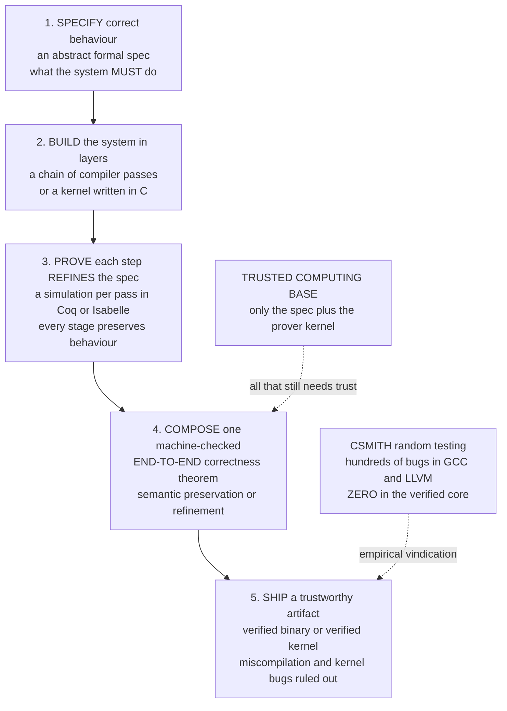

# 🏛️ Verified Compilers and Operating Systems

> [!abstract] TL;DR
> You can prove your **source code** flawless — but the **compiler** that turns it into machine code can introduce bugs of its own (real ones routinely do), silently corrupting a *proven-correct* program into a *buggy binary*; and the **operating system** your program trusts may itself be riddled with holes. **Verified compilers and operating systems** close that gap all the way to the metal. **CompCert** (Xavier Leroy, in **Coq**) is a moderately-optimizing **C compiler proven correct** — its central theorem, **semantic preservation**, says the generated assembly behaves *exactly* as the C source's semantics prescribe, established by a chain of ~a dozen intermediate languages each proven to preserve behaviour by **simulation**; the **Csmith** fuzzer found *hundreds* of miscompilation bugs in GCC/LLVM but **zero** in CompCert's verified core. **seL4** (Gerwin Klein, Gernot Heiser et al., in **Isabelle/HOL**) is the first general-purpose OS **microkernel** with a complete **functional-correctness** proof — its C implementation *refines* an abstract spec — plus **integrity** and **confidentiality** proofs, carried down to the compiled **binary**, at a cost near **200,000 person-hours** for ~10k lines of C. These are among the most complex verified artifacts ever built; the price is person-*decades* of effort, the payoff is **machine-checked zero-bug** infrastructure and a **Trusted Computing Base** that shrinks to *the spec plus the proof assistant's kernel*.

---

## Intuition

**Analogy — a flawless blueprint handed to a crooked print shop.** Imagine an architect who mathematically *proves* a bridge design will never collapse — every load, every joint, checked. Then the blueprint goes to a print shop that photocopies it onto the builder's plans. If the copier smudges a dimension — a `9` printed as a `4` — the builders faithfully construct a *different, unsafe* bridge from a *provably-safe* design. Worse, the **ground** the bridge stands on (the operating system beneath your program) might be quietly full of sinkholes. Proving the design is not enough: you must also prove the *copier* never distorts, and that the *ground* is solid.

The compiler is that copier: it translates provably-correct source into machine code, and a compiler bug can turn a correct program into a wrong executable — undetected until, say, a flight-control loop misbehaves. The operating system is that ground: your program trusts the kernel for memory isolation and scheduling, and a kernel bug undermines everything above it. Researchers did the seemingly impossible: they proved an **entire C compiler** never mis-translates a program (**CompCert**), and proved an **entire OS microkernel** has *zero* bugs down to the machine code (**seL4**) — with mathematical certainty. These are the crown jewels of formal methods: full-scale, real, machine-checked correct systems that close the trust gap all the way to the metal.

---

## How It Works

### Core Mechanics

Both CompCert and seL4 follow the *same* recipe — **specify, build, prove-by-refinement, compose, ship** — differing only in whether the "system" is a compiler or a kernel.

1. **Specify the correct behaviour formally.** Write an **abstract specification** in mathematics — not English prose that engineers misread, but a definition precise enough to *prove theorems about*. For a compiler, this is a **formal semantics** for the source language and the target machine ([[Operational_Semantics]]). For a kernel, it is an abstract state machine describing every system call's effect on kernel state.

2. **Build the real system in structured layers.** A verified compiler is not one giant leap from C to assembly; it is a **chain of ~a dozen intermediate languages** ([[Intermediate_Representations]]), each pass doing one job (constant propagation, register allocation, instruction selection). A verified kernel is ~10k lines of real **C**. Structuring the system into small, well-defined steps is what makes the proof *tractable*.

3. **Prove each step refines the spec, in a proof assistant.** This is the heart. Each compiler pass is shown to satisfy **semantic preservation** — the output program's observable behaviour is among the source program's allowed behaviours — proven by exhibiting a **simulation** (a.k.a. **refinement**) relation: whatever the source does in one step, the target *simulates* in zero or more steps while the relation is maintained. Every proof is **machine-checked** by an interactive prover — **Coq** for CompCert, **Isabelle/HOL** for seL4 (both are proof assistants; see the sibling note *Interactive_Theorem_Proving*).

4. **Compose the per-step proofs into one end-to-end theorem.** Simulation relations **compose transitively**: if pass 1 preserves behaviour and pass 2 preserves behaviour, their sequence does too. Chaining every pass yields a single **machine-checked correctness theorem** for the *whole* compiler ("compiled assembly behaves as the C source specifies") or the *whole* kernel ("the binary refines the abstract spec"). This is the **refinement chain**: abstract spec → C → binary (the *correctness-by-construction* idea; see the sibling note *Refinement_and_Correctness_by_Construction*).

5. **Ship a trustworthy artifact — and shrink the Trusted Computing Base.** What remains to trust is *not* the tens of thousands of lines of compiler/kernel code, nor the enormous proof scripts (those are re-checked mechanically). It is only the **specification** (does it say what you meant?) and the **proof assistant's tiny kernel**. Everything else is verified. The **TCB** collapses from "the entire toolchain" to "a spec plus a few-thousand-line checker."

**Why source-only verification is not enough.** Even a perfectly verified program is only as trustworthy as the compiler beneath it. Real compilers *do* miscompile: the **Csmith** random-program fuzzer generated undefined-behaviour-free C programs and found **hundreds** of distinct miscompilation bugs in GCC and LLVM. Verifying the compiler — or the lighter **translation validation**, which checks each individual compile run instead of the compiler once — is what carries the guarantee down to the binary.

### Flow / Architecture



---

## Key Concepts

**Secondary (explain to a curious beginner).**
- A **compiler** turns your code into machine instructions; even if your code is perfect, a **compiler bug** can secretly make the machine do the wrong thing.
- A **verified compiler** comes with a mathematical **proof** — not just tests — that its output always means the same as its input. **CompCert** is a real one, used in aircraft software.
- A **verified operating system** (**seL4**) has been *proven* to have no bugs, down to the actual machine code — the strongest guarantee any OS kernel has ever had.

**Undergraduate (requires a CS background).**
- **Semantic preservation** — the correctness statement for a compiler: *every* behaviour of the compiled program is an allowed behaviour of the source, for *all* inputs (a proof, not a test suite).
- **Simulation / refinement** — the proof technique: a relation `R` between source and target states such that each source step is matched by target step(s) with `R` preserved. Relations **compose**, so per-pass proofs chain into a whole-compiler theorem.
- **Functional correctness** (seL4) — the C implementation **refines** an abstract specification: every concrete behaviour corresponds to an abstract one.
- **Translation validation** — a lighter alternative: rather than prove the compiler correct once, validate *each* compile run's output against its input (as LLVM's Alive2 does for peephole rules).
- **Trusted Computing Base (TCB)** — everything you must trust *without* proof; verification shrinks it to the spec + the prover's kernel.

**Graduate (system-level thinking).**
- **The refinement chain** — abstract spec → C source → compiled **binary**; seL4 extends functional correctness through the compiler to the binary so the proof survives to what actually runs (closing the compiler gap that CompCert independently fills).
- **CompCert's architecture** — ~a dozen intermediate languages (Clight → Cminor → RTL → LTL → … → assembly), each pass carrying its *own* semantic-preservation lemma proven by forward/backward simulation; behaviours are modelled as traces of observable events to handle non-determinism and I/O ([[Code_Generation_and_Instruction_Selection]]).
- **Security properties beyond correctness** — seL4 proves **integrity** (no unauthorized writes) and **confidentiality** (no unauthorized information flow) on top of functional correctness, over a **capability-based** access-control model.
- **Curry–Howard foundation** — Coq/Isabelle rest on *propositions-as-types, proofs-as-programs* ([[The_Curry_Howard_Correspondence]]); a verified compiler *is* a program whose type is its correctness theorem, extractable to runnable OCaml.
- **The effort–assurance frontier** — CompCert took person-*years*; seL4 ~200,000 person-hours. The open question is *proof engineering*: making these proofs cheaper to build and to maintain under change (proof rot).

---

## Python Demo

We build **CompCert-in-miniature**. A tiny imperative language (**arithmetic, `if`, `while`**) is given **two meanings**: a reference **interpreter** (the source semantics) and a **compiler** to a **stack-machine bytecode** with its own VM. **(a) Semantic preservation:** run *both* on hundreds of random programs and check the **observable results match** — the CompCert theorem in miniature. Then we inject a **buggy optimization** (a peephole that eliminates *every* constant multiply, not just `×1`) and watch differential testing **catch the miscompilation**. **(b) Refinement diagram:** we draw the **simulation** picture — one source step simulated by several target steps, with the relation `R` holding before and after. `numpy` + `matplotlib`.

```python
# CompCert in miniature: a tiny imperative language (arithmetic / if / while)
# gets a reference INTERPRETER and a COMPILER to stack bytecode. We check
# SEMANTIC PRESERVATION on random programs, then inject a BUGGY optimization
# and watch differential testing catch the MISCOMPILATION. numpy + matplotlib.
import random
import numpy as np
import matplotlib.pyplot as plt
from matplotlib.patches import FancyBboxPatch, FancyArrowPatch

M = 256  # machine-int modulus: BOTH meanings wrap identically -> well-defined

# ---------- Abstract syntax (expressions and statements) ----------
def num(k):       return ('num', k % M)
def var(x):       return ('var', x)
def binop(o,l,r): return ('bin', o, l, r)     # o in + - *
def cmp(o,l,r):   return ('cmp', o, l, r)     # o in < > ==  -> 0/1

# ---------- 1. Reference interpreter = the SOURCE semantics ----------
def ev_expr(e, st):
    t = e[0]
    if t == 'num': return e[1]
    if t == 'var': return st.get(e[1], 0)                 # unset var reads as 0
    if t == 'bin':
        a, b = ev_expr(e[2], st), ev_expr(e[3], st)
        return {'+': (a+b) % M, '-': (a-b) % M, '*': (a*b) % M}[e[1]]
    if t == 'cmp':
        a, b = ev_expr(e[2], st), ev_expr(e[3], st)
        return int({'<': a < b, '>': a > b, '==': a == b}[e[1]])
    raise ValueError(e)

def run_interp(s, st, budget):
    steps = [0]
    def go(s):
        if steps[0] > budget: raise TimeoutError
        steps[0] += 1
        t = s[0]
        if t == 'skip':   return
        if t == 'assign': st[s[1]] = ev_expr(s[2], st); return
        if t == 'seq':    go(s[1]); go(s[2]); return
        if t == 'if':     go(s[2] if ev_expr(s[1], st) else s[3]); return
        if t == 'while':
            while ev_expr(s[1], st):
                if steps[0] > budget: raise TimeoutError
                steps[0] += 1
                go(s[2])
            return
        raise ValueError(s)
    go(s)
    return st

# ---------- 2. Compiler: source -> stack-machine bytecode ----------
def compile_expr(e):
    t = e[0]
    if t == 'num': return [('PUSH', e[1])]
    if t == 'var': return [('LOAD', e[1])]
    if t == 'bin': return compile_expr(e[2]) + compile_expr(e[3]) + [('BIN', e[1])]
    if t == 'cmp': return compile_expr(e[2]) + compile_expr(e[3]) + [('CMP', e[1])]
    raise ValueError(e)

_lbl = [0]
def newlabel():
    _lbl[0] += 1
    return _lbl[0]

def compile_stmt(s):
    t = s[0]
    if t == 'skip':   return []
    if t == 'assign': return compile_expr(s[2]) + [('STORE', s[1])]
    if t == 'seq':    return compile_stmt(s[1]) + compile_stmt(s[2])
    if t == 'if':
        Le, Ld = newlabel(), newlabel()
        return (compile_expr(s[1]) + [('JZ', Le)] + compile_stmt(s[2])
                + [('JMP', Ld), ('LABEL', Le)] + compile_stmt(s[3]) + [('LABEL', Ld)])
    if t == 'while':
        Ls, Ld = newlabel(), newlabel()
        return ([('LABEL', Ls)] + compile_expr(s[1]) + [('JZ', Ld)]
                + compile_stmt(s[2]) + [('JMP', Ls), ('LABEL', Ld)])
    raise ValueError(s)

def resolve(code):                       # strip LABEL markers, fix jump targets
    pcs, out = {}, []
    for ins in code:
        if ins[0] == 'LABEL': pcs[ins[1]] = len(out)
        else: out.append(ins)
    return [(k, pcs[a]) if k in ('JMP', 'JZ') else (k, a)
            for (k, a) in ((i[0], i[1] if len(i) > 1 else None) for i in out)]

def run_vm(code, st, budget):
    stack, pc, steps = [], 0, 0
    while pc < len(code):
        if steps > budget: raise TimeoutError
        steps += 1
        k, arg = code[pc]
        if   k == 'PUSH':  stack.append(arg); pc += 1
        elif k == 'LOAD':  stack.append(st.get(arg, 0)); pc += 1
        elif k == 'STORE': st[arg] = stack.pop(); pc += 1
        elif k == 'BIN':
            b, a = stack.pop(), stack.pop()
            stack.append({'+': (a+b) % M, '-': (a-b) % M, '*': (a*b) % M}[arg]); pc += 1
        elif k == 'CMP':
            b, a = stack.pop(), stack.pop()
            stack.append(int({'<': a<b, '>': a>b, '==': a==b}[arg])); pc += 1
        elif k == 'JMP':   pc = arg
        elif k == 'JZ':    pc = arg if stack.pop() == 0 else pc + 1
        else: raise ValueError(k)
    return st

# ---------- 3. An OPTIMIZATION pass: eliminate multiply-by-ONE ----------
# Correct: drop the multiply only when the constant factor is EXACTLY 1.
# Buggy : forget the "== 1" check -> drop EVERY constant multiply -> WRONG.
def opt_expr(e, buggy):
    t = e[0]
    if t in ('num', 'var'): return e
    if t == 'bin':
        l, r = opt_expr(e[2], buggy), opt_expr(e[3], buggy)
        if e[1] == '*':
            if r[0] == 'num' and (buggy or r[1] == 1): return l   # x * 1 -> x
            if l[0] == 'num' and (buggy or l[1] == 1): return r   # 1 * x -> x
        return ('bin', e[1], l, r)
    if t == 'cmp':
        return ('cmp', e[1], opt_expr(e[2], buggy), opt_expr(e[3], buggy))
    return e

def opt_stmt(s, buggy):
    t = s[0]
    if t == 'assign': return ('assign', s[1], opt_expr(s[2], buggy))
    if t == 'seq':    return ('seq', opt_stmt(s[1], buggy), opt_stmt(s[2], buggy))
    if t == 'if':     return ('if', opt_expr(s[1], buggy),
                              opt_stmt(s[2], buggy), opt_stmt(s[3], buggy))
    if t == 'while':  return ('while', opt_expr(s[1], buggy), opt_stmt(s[2], buggy))
    return s

# ---------- 4. Random program generator (guaranteed-terminating loops) ----------
VARS = ['a', 'b', 'c', 'd']
_kc = [0]
def counter():
    _kc[0] += 1
    return 'k%d' % _kc[0]                 # loop counters live in a separate namespace

def gen_expr(d):
    if d <= 0 or random.random() < 0.4:
        return num(random.randint(0, 5)) if random.random() < 0.5 else var(random.choice(VARS))
    return binop(random.choice(['+', '-', '*']), gen_expr(d-1), gen_expr(d-1))

def gen_stmt(d):
    if d <= 0 or random.random() < 0.35:
        return ('assign', random.choice(VARS), gen_expr(2))
    r = random.random()
    if r < 0.45:
        return ('seq', gen_stmt(d-1), gen_stmt(d-1))
    if r < 0.75:
        c = cmp(random.choice(['<', '>', '==']), gen_expr(1), gen_expr(1))
        return ('if', c, gen_stmt(d-1), gen_stmt(d-1))
    k = counter()                          # while ALWAYS decrements a fresh counter
    body = ('seq', gen_stmt(d-1), ('assign', k, binop('-', var(k), num(1))))
    return ('seq', ('assign', k, num(random.randint(1, 4))),
                   ('while', cmp('>', var(k), num(0)), body))

# ---------- 5. Differential test: does compilation PRESERVE meaning? ----------
random.seed(2026)
N, budget = 500, 50000
scalar = lambda st: sum(st.values()) % M
xs, y_ok, y_bug = [], [], []
ok_match = bug_match = used = 0
for _ in range(N):
    p = gen_stmt(4)
    try:
        ref  = run_interp(p, {}, budget)
        good = run_vm(resolve(compile_stmt(opt_stmt(p, False))), {}, budget)
        bad  = run_vm(resolve(compile_stmt(opt_stmt(p, True))),  {}, budget)
    except TimeoutError:
        continue
    used += 1
    xs.append(scalar(ref)); y_ok.append(scalar(good)); y_bug.append(scalar(bad))
    ok_match  += (ref == good)    # full-store equality = observable equivalence
    bug_match += (ref == bad)

print("=== semantic preservation on %d random programs ===" % used)
print("  verified/correct compiler : %d/%d agree  (%.1f%%)"
      % (ok_match,  used, 100*ok_match/used))
print("  buggy-optimized compiler  : %d/%d agree  (%.1f%%)  <- miscompilations caught"
      % (bug_match, used, 100*bug_match/used))

# ---------- 6. Visualization ----------
xs, y_ok, y_bug = np.array(xs), np.array(y_ok), np.array(y_bug)
fig, (ax1, ax2) = plt.subplots(1, 2, figsize=(13.5, 5.2))

# (a) source-vs-compiled agreement + the caught miscompilation
lo, hi = 0, M
ax1.plot([lo, hi], [lo, hi], '--', color='gray', label="perfect agreement  y = x")
ax1.scatter(xs, y_ok, s=26, color='#2ca02c', alpha=0.6,
            label="verified compiler  (all on y=x)")
mis = y_bug != xs
ax1.scatter(xs[~mis], y_bug[~mis], s=20, color='#8c8c8c', alpha=0.3)
ax1.scatter(xs[mis], y_bug[mis], s=60, marker='x', color='#d62728', linewidths=1.6,
            label="buggy pass MISCOMPILED  (off y=x)")
ax1.set_xlabel("result of reference INTERPRETER  (source semantics)")
ax1.set_ylabel("result of COMPILED stack machine")
ax1.set_title("(a) Semantic preservation\nverified compiler agrees; buggy optimization is caught")
ax1.legend(loc='upper left', fontsize=8); ax1.grid(alpha=0.3)

# (b) refinement / simulation diagram: one source step ~ several target steps
ax2.axis('off'); ax2.set_xlim(0, 9.6); ax2.set_ylim(0, 6)
def box(x, y, w, h, text, fc):
    ax2.add_patch(FancyBboxPatch((x, y), w, h, boxstyle="round,pad=0.04",
                                 fc=fc, ec='black'))
    ax2.text(x + w/2, y + h/2, text, ha='center', va='center', fontsize=9)
box(0.4, 4.2, 2.3, 1.0, "source\nstate  s0", '#cfe8ff')
box(7.0, 4.2, 2.3, 1.0, "source\nstate  s1", '#cfe8ff')
ax2.add_patch(FancyArrowPatch((2.7, 4.7), (7.0, 4.7), arrowstyle='-|>',
                              mutation_scale=16, color='#1f77b4'))
ax2.text(4.85, 5.05, "ONE source step", ha='center', color='#1f77b4', fontsize=9)
tx = [0.4, 2.65, 4.9, 7.15]
for x, lb in zip(tx, ["t0", "t1", "t2", "t3"]):
    box(x, 0.6, 1.7, 0.9, "target\n" + lb, '#ffe0b3')
for i in range(len(tx) - 1):
    ax2.add_patch(FancyArrowPatch((tx[i] + 1.7, 1.05), (tx[i+1], 1.05),
                                  arrowstyle='-|>', mutation_scale=12, color='#d67d00'))
ax2.text(4.85, 0.05, "several target steps simulate the one source step",
         ha='center', color='#d67d00', fontsize=9)
for xt, xb, lab_x in [((1.5, 4.2), (1.25, 1.5), 0.35), ((8.15, 4.2), (8.0, 1.5), 8.45)]:
    ax2.add_patch(FancyArrowPatch(xt, xb, arrowstyle='<->', linestyle='--',
                                  mutation_scale=12, color='gray'))
    ax2.text(lab_x, 2.9, "R", color='gray', fontsize=12, fontweight='bold')
ax2.set_title("(b) Refinement / simulation: the diagram COMMUTES\n"
              "R holds before AND after  ->  semantics preserved")

plt.tight_layout()
plt.savefig("verified_compilers_demo.png", dpi=120)
print("\nsaved verified_compilers_demo.png")
```

**What it shows.** The console reports that the **verified/correct compiler agrees with the interpreter on 100% of programs** — the miniature semantic-preservation theorem, demonstrated empirically — while the **buggy optimization** (drop *every* constant multiply, not just `×1`) diverges on a sizeable fraction. Panel (a) makes this visual: green points (verified compiler) all lie on `y = x`; red crosses (buggy pass) fall *off* the diagonal — each is a **miscompilation** that differential testing caught, exactly how **Csmith** exposes GCC/LLVM bugs. Panel (b) is the proof technique itself: one **source step** is *simulated* by several **target steps**, and the **refinement relation `R`** holds *before and after* — so the diagram **commutes** and behaviour is preserved. A real verified compiler replaces this 500-program *test* with a **Coq proof** that the relation holds for *every* program and *every* input; seL4 uses the same commuting-diagram idea to prove its C kernel refines its abstract spec.

---

## Real-World Applications

> **Example — seL4, a verified microkernel (Isabelle/HOL).** The **seL4** microkernel carries a machine-checked proof that its ~10k lines of **C** *refine* an abstract specification — full **functional correctness** — extended to **integrity** and **confidentiality**, and pushed through the compiler down to the **binary** so the guarantee survives to what actually executes. The effort was roughly **200,000 person-hours**; the result is the strongest assurance any OS kernel has ever had: not "we tested it hard," but a proof that the code does *exactly* what the spec says, with the **[[OS_Structure_and_Kernel_Architectures|microkernel architecture]]** deliberately kept small to make verification feasible. It now runs in avionics, automotive, defence, and secure-communications devices.

- **CompCert in safety-critical avionics.** Airbus and other aerospace suppliers use the verified **CompCert** C compiler so that DO-178C certification can rest on "the compiler *provably* did not corrupt the code," alongside sound static analyzers like Astrée. CompCert is the flagship **verified compiler** and the companion deep-dive is [[Formal_Semantics_and_Verified_Compilers]].
- **CakeML — verified to the metal.** **CakeML** is a verified implementation of a substantial subset of Standard ML with an *end-to-end* proof from source semantics down to **machine code**, including a verified parser, type checker, and runtime — a strictly larger verified surface than CompCert (see [[Verified_and_Certified_Languages]]).
- **CertiKOS — verified *concurrent* kernels.** **CertiKOS** (Yale) verifies a concurrent OS kernel using *compositional* certified abstraction layers (CCAL), extending kernel verification from seL4's single-core setting toward multicore concurrency.
- **Verified distributed systems.** **IronFleet** (Microsoft Research) and **Verdi** (Washington) verify distributed protocols — Paxos-style replication, fault tolerance — proving safety and liveness of systems notoriously hard to test.
- **Verified cryptography and TLS.** **Project Everest / HACL\* / miTLS** ship formally-verified, constant-time crypto and a verified **TLS** stack (used in Firefox, Linux, WireGuard); see [[TLS_and_Secure_Channels]] and the sibling note *Formal_Methods_in_Security_and_Cryptography*.

---

## Common Pitfalls

- **"My source is proven, so my program is safe."** Not until the *compiler* is trustworthy. Real compilers miscompile: **Csmith** found *hundreds* of bugs in GCC/LLVM. Either use a **verified compiler** (CompCert: zero bugs in its verified core) or **translation validation** (check each compile run), or the proof stops at the source and a buggy binary can still ship.
- **Confusing testing with proof.** Passing a million differential tests (like the demo's 500 programs) is *evidence*, not a *guarantee*. Only a machine-checked proof quantifies over *all* inputs. Fuzzing finds bugs; it can never certify their absence.
- **"Verified" is scoped, not absolute.** CompCert is correct *relative to* its formal model of C and the hardware; seL4 is correct *relative to* its spec and assumptions (e.g., correct hardware, disabled DMA into kernel memory, a trusted assembler/boot code). Verification **moves the trust boundary** to the spec + prover kernel — the **Trusted Computing Base** — it does not delete it. A wrong *spec* still yields a "correct" wrong system.
- **Underestimating the effort — and proof rot.** These are person-*decade* efforts (seL4 ~200k hours; CompCert person-years, with proofs many times larger than the code). Worse, proofs are **brittle under change**: modifying the compiler or kernel forces the proof to be re-established, often the dominant maintenance cost — which is why verified systems evolve slowly. Shrinking this cost is the central research frontier (see the sibling note *The_Reach_and_Future_of_Formal_Methods*).
- **Forgetting the refinement chain must reach the binary.** Proving the *C* correct is not enough if the *compiler* then miscompiles it — this is precisely why seL4 pushes its refinement proof to the binary and why CompCert exists. A verified kernel compiled by an *unverified* compiler reopens the very gap it closed.
- **Undefined behaviour silently breaks preservation.** If the source semantics leaves behaviour *undefined* (signed overflow, data races), the compiler is *permitted* to do anything, so "the optimizer changed my result" may be *correct* per the semantics — the bug is your reliance on UB. Fuzzers must generate UB-free programs precisely so a mismatch really means a compiler bug.

---

## Related Concepts

- [[Formal_Semantics_and_Verified_Compilers]] — the companion Compilers deep-dive on semantic preservation, the three styles of semantics, and CompCert/CakeML in detail.
- [[Verified_and_Certified_Languages]] — the Programming-Language-Theory view: languages and compilers designed so correctness proofs are part of the artifact.
- [[Operational_Semantics]] — the small-step/big-step "meaning as execution steps" that a verified compiler must *preserve*; the source semantics in the demo.
- [[The_Curry_Howard_Correspondence]] — propositions-as-types, proofs-as-programs — the foundation of Coq/Isabelle, so a verified compiler *is* a program whose type is its correctness theorem.
- [[Intermediate_Representations]] — CompCert's ~dozen ILs; each pass between IRs carries its own semantic-preservation lemma that composes into the whole-compiler theorem.
- [[OS_Structure_and_Kernel_Architectures]] — the microkernel design seL4 verifies; a *small* kernel is what makes full functional-correctness proof feasible.
- [[OS_Security_and_Isolation]] — seL4's integrity and confidentiality proofs turn OS isolation from "best effort" into a machine-checked theorem.
- [[TLS_and_Secure_Channels]] — Project Everest / miTLS extend full-system verification to the TLS stack, a sibling milestone to CompCert and seL4.

*(Siblings referenced in prose within this Formal_Methods vault: Interactive_Theorem_Proving, Refinement_and_Correctness_by_Construction, Deductive_Verification_Tools, Formal_Methods_in_Security_and_Cryptography, The_Reach_and_Future_of_Formal_Methods.)*

---

## Review Questions

1. **(Secondary)** A team proves their flight-control *source code* has no bugs, then compiles and ships it. Explain, in plain terms, why the running aircraft could *still* misbehave — and what CompCert adds that closes this gap.
2. **(Undergraduate)** State the **semantic-preservation** theorem in your own words, and explain why proving it *per compiler pass* (with a **simulation** relation) lets you conclude correctness of the *whole* compiler. Why is 10 million passing differential tests strictly weaker than this proof?
3. **(Graduate)** seL4 cost ~200,000 person-hours to verify ~10k lines of C. Justify when that price is worth paying, then describe *precisely* what remains in the **Trusted Computing Base** after the proof — and give two concrete ways a fully "verified" seL4 or CompCert could still exhibit wrong behaviour in production despite the machine-checked proof.

---

## Sources

- Xavier Leroy, "Formal Verification of a Realistic Compiler" (CompCert), *Communications of the ACM*, 2009. <https://xavierleroy.org/publi/compcert-CACM.pdf>
- Gerwin Klein et al., "seL4: Formal Verification of an OS Kernel," *SOSP 2009*. <https://sel4.systems/Info/Docs/seL4-SOSP09.pdf>
- Yang, Chen, Eide, Regehr, "Finding and Understanding Bugs in C Compilers" (Csmith), *PLDI 2011*. <https://www.flux.utah.edu/paper/yang-pldi11>
- Kumar, Myreen, Norrish, Owens, "CakeML: A Verified Implementation of ML," *POPL 2014*. <https://cakeml.org/>
- Gu et al., "CertiKOS: An Extensible Architecture for Building Certified Concurrent OS Kernels," *OSDI 2016*. <https://flint.cs.yale.edu/certikos/>

---

#formal-methods #compcert #sel4 #verified-compiler #verified-os
