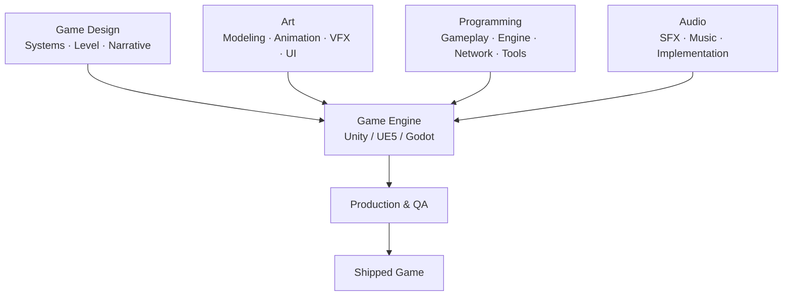

# Game Development Overview

> [!abstract] TL;DR
> Game development spans multiple disciplines—design, programming, art, audio, and production—unified by engines that abstract hardware complexity. Understanding genres, the game loop, and coordinate systems is foundational to every game project.

## Game Development Disciplines

Modern game development is a multidisciplinary endeavor. Each discipline contributes a distinct layer to the final product, and professionals often overlap across boundaries—especially in smaller teams.

**Game Design** is the creative backbone. It encompasses:
- *Systems design*: rules, economy, progression loops, balance
- *Level design*: spatial layout, pacing, encounter placement
- *Narrative design*: story, dialogue, branching logic, worldbuilding

**Programming** divides into specializations:
- *Gameplay programming*: character controllers, AI behaviors, game mechanics
- *Engine programming*: rendering pipelines, memory management, job systems
- *Tools programming*: editor extensions, pipeline automation, asset importers
- *Network programming*: multiplayer synchronization, lag compensation, matchmaking

**Art** production covers concept art (ideation and style guides), 3D modeling and texturing, rigging and animation, VFX (particles, shaders), and UI/UX design. Most studios follow a pipeline: concept → blockout → model → UV → texture → rig → animate → integrate.

**Audio** has two branches: *content* (sound effects, music composition) and *implementation* (wiring audio to game events via middleware like FMOD or Wwise, managing spatial audio, compression).

**Production** coordinates everything: project management (milestones, sprints), QA (testing, bug tracking), localization, platform certification, and release management.

### Indie vs. AAA

| Dimension      | Indie             | AAA                     |
|---------------|-------------------|-------------------------|
| Team size      | 1–10              | 200–1,000+              |
| Budget         | $0–$500K          | $50M–$300M+             |
| Time to market | 6 months–3 years  | 3–7 years               |
| Scope          | Single genre, lean| Multi-system, high fidelity |
| Distribution   | Steam, itch.io    | Console + PC day-one    |

## Game Engines Overview

An engine provides the foundational systems—rendering, physics, audio, scripting, asset management—so developers can focus on the game itself rather than raw hardware APIs.

| Engine        | Language        | License         | Best For                         |
|--------------|-----------------|-----------------|----------------------------------|
| Unity         | C#              | Proprietary     | Indie, mobile, XR, 2D/3D        |
| Unreal Engine 5 | C++ / Blueprint | Source-available | AAA, film, high-fidelity 3D    |
| Godot 4       | GDScript / C#   | MIT (free)      | Indie, 2D, open-source pipelines |
| GameMaker     | GML             | Proprietary     | 2D-focused indie, rapid prototyping |
| Bevy          | Rust            | MIT             | ECS-first, systems programming  |

**Unity** dominates indie and mobile markets with its massive Asset Store and excellent cross-platform export (iOS, Android, PC, console, WebGL). **Unreal Engine 5** introduces Nanite (virtualized geometry) and Lumen (dynamic global illumination), raising the bar for real-time visuals. **Godot** is the go-to for developers who want a lightweight, truly open-source option—the entire editor is under 100 MB. **Bevy** is gaining traction among Rust developers for its compile-time-safe ECS.

## Game Genres and Technical Challenges

Genre choice heavily shapes the technical architecture required:

- **FPS (First-Person Shooter)**: Fast raycasting for hit detection, client-side prediction and lag compensation in netcode, occlusion culling for dense environments.
- **RTS (Real-Time Strategy)**: Pathfinding for hundreds of simultaneous units (typically A* with flow fields), fog-of-war visibility systems, large-world streaming.
- **RPG**: Persistent save systems, dialogue tree state machines, inventory and equipment systems with data-driven item definitions.
- **Platformer**: Sub-pixel-precise collision detection, coyote time, input buffering, camera smoothing.
- **Mobile**: Touch and gesture input, battery-budget constraints, small download sizes (<150 MB for soft launch), agressive LOD.
- **Simulation**: Large-world chunk streaming, economic simulation systems, agent-based AI with thousands of actors.

## The Game Loop

Every game at its core runs the same loop: collect input, update simulation, render frame. Separating these phases cleanly is essential.

```
while running:
    process_input()
    update(delta_time)
    render()
```

The critical insight is that movement and physics must be **tied to `deltaTime`**, not to frame count. A game running at 30 FPS must move characters the same distance per second as one running at 144 FPS.

```csharp
// Wrong — speed is frame-rate dependent
transform.position += Vector3.forward * speed;

// Correct — speed is time-based
transform.position += Vector3.forward * speed * Time.deltaTime;
```

For physics, a **fixed timestep** (e.g., 50 Hz in Unity's `FixedUpdate`) provides determinism: the simulation advances by the same dt every physics tick regardless of rendering frame rate. The render loop interpolates between physics states for smooth visuals.

## Coordinate Systems

Understanding coordinate spaces prevents constant confusion when combining engine APIs, shaders, and physics code.

**2D:**
- *Screen space*: pixels, origin at top-left, Y increases downward (most UI frameworks)
- *World space*: game units (e.g., meters), Y increases upward, origin wherever the designer sets it

**3D engines differ in handedness and up-axis:**

| Engine / API   | Handedness   | Up Axis |
|---------------|--------------|---------|
| Unity          | Left-handed  | Y-up    |
| Unreal Engine  | Left-handed  | Z-up    |
| OpenGL / Vulkan | Right-handed | Y-up    |
| Blender        | Right-handed | Z-up    |

When importing assets between tools, mismatched conventions cause objects to appear rotated 90° or mirrored. Most exporters provide axis-remapping options.



## Common Pitfalls

- **Tying game speed to frame rate** instead of `deltaTime`—objects move faster on high-end machines and slower on low-end ones.
- **Picking the wrong engine for the genre**—using Unreal for a tiny 2D mobile game incurs unnecessary complexity; using Godot for a AAA open world hits engine limits.
- **Skipping production planning in indie projects**—scope creep is the #1 cause of indie games never shipping; a simple Trello board or milestone plan prevents it.
- **Confusing screen space with world space**—UI elements rendered in world space drift off-screen on different aspect ratios; physics queries in screen space return nonsensical results.
- **Ignoring platform constraints early**—designing for PC then porting to mobile forces painful rearchitecting of rendering, input, and monetization.

## Review Questions

1. You are building a 2D mobile platformer with a team of two. Which engine would you choose from the table above, and what are the two most important criteria driving that choice?
2. A character moves 10 units per second at 60 FPS but 5 units per second at 30 FPS. What is the root cause and how do you fix it in code?
3. An asset exported from Blender (right-handed, Z-up) appears rotated 90° when imported into Unity (left-handed, Y-up). Explain why and describe one way to correct it.

## Related Concepts

- [[_MOC_Game_Development_Master|↑ Game Development MOC]]

#GameDev
