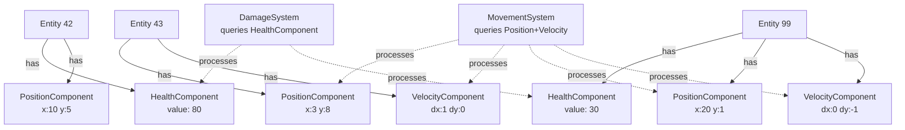

# Game Loop and Architecture

> [!abstract] TL;DR
> The game loop drives everything. Fixed timestep for physics, variable for rendering. ECS (Entity-Component-System) separates data from logic for cache-friendly, scalable game architecture. Object pooling and spatial partitioning prevent performance cliffs.

## Fixed vs Variable Timestep

The game loop must advance the simulation at a predictable rate while rendering at whatever rate the hardware allows. These two concerns—**simulation fidelity** and **visual smoothness**—require different update strategies.

**Variable timestep** (`Update` in Unity) runs once per rendered frame. The elapsed time between calls varies depending on current frame rate. It is appropriate for input, AI decisions, UI updates, and gameplay logic where exact timing is flexible.

**Fixed timestep** (`FixedUpdate` in Unity, default 50 Hz = 0.02s per tick) runs at a constant interval, independent of frame rate. The engine accumulates elapsed time and drains it in fixed-size chunks. Physics simulation *must* use fixed timestep because:
- Numerical integration methods (semi-implicit Euler) diverge with variable `dt`
- Determinism is required for replay systems and networked games
- Collision detection can miss fast-moving objects if `dt` is too large

```csharp
// Physics forces — use FixedUpdate
void FixedUpdate() {
    rb.AddForce(Vector3.forward * thrustForce);   // deterministic at 50 Hz
    rb.AddForce(Vector3.down * gravityScale, ForceMode.Acceleration);
}

// Movement without physics — use Update with deltaTime
void Update() {
    float horizontal = Input.GetAxis("Horizontal");
    transform.Translate(Vector3.right * horizontal * speed * Time.deltaTime);
}
```

**The accumulator pattern** (used internally by most engines):

```csharp
float accumulator = 0f;
const float FIXED_DT = 0.02f;

void Loop(float frameTime) {
    accumulator += frameTime;
    while (accumulator >= FIXED_DT) {
        PhysicsUpdate(FIXED_DT);
        accumulator -= FIXED_DT;
    }
    float alpha = accumulator / FIXED_DT;  // interpolation factor for smooth rendering
    Render(alpha);
}
```

The `alpha` factor allows rendering to interpolate between the last two physics states, eliminating visible stutter even when render rate and physics rate differ.

## Game Loop Phases

A well-structured game loop separates concerns into distinct phases executed in a defined order:

```csharp
while (running) {
    float delta = ComputeDeltaTime();

    // 1. Collect and dispatch device input
    InputSystem.Process();

    // 2. Run fixed-timestep physics (internal accumulator)
    Physics.StepSimulation(delta);

    // 3. Update gameplay systems with variable dt
    foreach (var entity in entities)
        entity.Update(delta);

    // 4. Late update — camera follow, IK solve (after entity positions settled)
    foreach (var entity in entities)
        entity.LateUpdate(delta);

    // 5. Render the frame
    Renderer.Draw(camera, scene);

    // 6. Audio tick
    AudioSystem.Update();
}
```

Unity mirrors this structure: `FixedUpdate` → `Update` → `LateUpdate` → rendering. Camera follow logic goes in `LateUpdate` so it reads the player's final position after all gameplay movement resolves.

## ECS Architecture

**Entity-Component-System (ECS)** is an architectural pattern that replaces inheritance hierarchies with pure composition. It emerged from the need to scale to tens of thousands of entities without the CPU cache misses inherent in traditional OOP.

- **Entity**: a plain integer ID—nothing more. It carries no data and no logic.
- **Component**: a plain data struct associated with an entity ID. No methods except constructors.
- **System**: logic that queries for entities possessing a specific set of components, then processes them.

**Why ECS is cache-friendly:** In traditional OOP, objects are heap-allocated and scattered in memory. When a system iterates over 10,000 enemies, it chases pointers across the heap—a cache miss storm. In ECS, all `HealthComponent` data lives in a contiguous array; iterating it is a sequential memory access, one of the fastest operations modern CPUs can do.

```csharp
// --- COMPONENTS (pure data) ---
public struct PositionComponent : IComponentData {
    public float3 Value;
}

public struct VelocityComponent : IComponentData {
    public float3 Value;
}

public struct HealthComponent : IComponentData {
    public float Value;
    public float Max;
}

// --- SYSTEM (pure logic) ---
public partial class MovementSystem : SystemBase {
    protected override void OnUpdate() {
        float dt = SystemAPI.Time.DeltaTime;

        // Burst-compiled, runs on worker threads automatically
        Entities
            .WithAll<PositionComponent, VelocityComponent>()
            .ForEach((ref PositionComponent pos, in VelocityComponent vel) => {
                pos.Value += vel.Value * dt;
            })
            .ScheduleParallel();
    }
}

public partial class DamageSystem : SystemBase {
    protected override void OnUpdate() {
        Entities.ForEach((ref HealthComponent hp) => {
            hp.Value -= 1f * SystemAPI.Time.DeltaTime;
        }).Schedule();
    }
}
```

## ECS vs OOP MonoBehaviour

Both have a place. The decision hinges on team size, entity count, and iteration speed.

| Criterion              | OOP MonoBehaviour            | ECS (DOTS)                         |
|-----------------------|------------------------------|------------------------------------|
| Prototype speed        | Fast — just add components   | Slower — more boilerplate          |
| Entity count           | ~1,000 before frame drops    | 100,000+ with Burst + jobs          |
| Readability            | High — self-contained class  | Requires ECS mental model           |
| Multi-threading        | Manual (Thread safety issues)| Built-in (job system)               |
| Hot-reload             | Excellent                    | Limited                             |
| Best use case          | Prototyping, UI, small games | Simulation, crowds, projectile spam |

Classic Unity approach scales well for most games. ECS shines in bullet-hell shooters, large crowds (e.g., an open-world city), or physics-heavy simulations.

## Object Pooling

`Instantiate` and `Destroy` are expensive: they allocate memory, trigger the garbage collector, and serialize/deserialize component data. Spawning 200 projectiles per second without pooling will create noticeable GC spikes.

**Object pooling** pre-allocates a fixed set of objects at startup and recycles them:

```csharp
public class ObjectPool : MonoBehaviour {
    [SerializeField] private GameObject prefab;
    [SerializeField] private int initialSize = 20;

    private Stack<GameObject> pool = new Stack<GameObject>();

    void Awake() {
        for (int i = 0; i < initialSize; i++) {
            GameObject obj = Instantiate(prefab);
            obj.SetActive(false);
            pool.Push(obj);
        }
    }

    public GameObject Get(Vector3 position, Quaternion rotation) {
        GameObject obj = pool.Count > 0
            ? pool.Pop()
            : Instantiate(prefab);   // grow pool on demand
        obj.transform.SetPositionAndRotation(position, rotation);
        obj.SetActive(true);
        return obj;
    }

    public void Return(GameObject obj) {
        obj.SetActive(false);
        pool.Push(obj);
    }
}
```

Unity 2021+ ships `UnityEngine.Pool.ObjectPool<T>` with the same semantics but with built-in capacity management and optional max-size enforcement.

## Spatial Partitioning

Checking all `N` objects against all `N` objects for collisions is `O(N²)`—catastrophic at scale. Spatial partitioning structures divide the world to reduce candidate pairs.

- **Uniform Grid**: world divided into fixed-size cells. Objects are registered in the cells they overlap. Collision check: only test against objects in the same and neighboring cells. Fast for uniformly distributed objects; wasteful if objects cluster.
- **Quadtree (2D) / Octree (3D)**: recursively subdivide space when a node contains more than a threshold number of objects. Adapts to non-uniform distributions. Requires re-insertion when objects move.
- **BVH (Bounding Volume Hierarchy)**: build a binary tree of bounding volumes from the bottom up. Each leaf wraps one object; each internal node wraps its children. GPU ray tracing uses BVH as its acceleration structure. Physics engines (PhysX, Bullet) maintain dynamic BVHs for broad-phase collision.



## Common Pitfalls

- **Physics in `Update()` instead of `FixedUpdate()`**: `AddForce` called in `Update` applies an inconsistent impulse per frame. At 120 FPS an object accelerates twice as fast as at 60 FPS.
- **Creating/destroying many objects per frame without pooling**: destroys frame pacing with GC spikes. Profile with Unity Profiler or Unreal Insights to catch allocations.
- **Deep MonoBehaviour inheritance trees** (e.g., `Enemy → Character → MovingObject → GameObject`): breaks composition, makes testing painful, and introduces coupling. Prefer shallow hierarchies with interfaces.
- **Not using fixed timestep for networked games**: non-deterministic physics makes state synchronization impossible. Always run physics at a fixed tick on both client and server.
- **Forgetting `LateUpdate` for camera follow**: reading the player's position in `Update` means the camera sometimes runs one frame behind the player, causing micro-jitter.

## Review Questions

1. A physics simulation behaves correctly at 60 FPS but objects pass through floors at 15 FPS. Identify the root cause and explain two mechanisms the engine uses to mitigate it.
2. You have a game with 50,000 simultaneously active projectiles. Describe why classic OOP MonoBehaviour struggles here and what specific ECS properties (data layout, threading) address the bottleneck.
3. What is the purpose of the `alpha` interpolation factor in the accumulator game loop pattern, and what visual artifact does it prevent?

## Related Concepts

- [[_MOC_Game_Development_Master|↑ Game Development MOC]]

#GameDev
