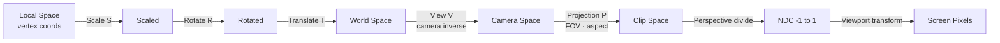

# Game Math Fundamentals

> [!abstract] TL;DR
> Vectors, matrices, and quaternions are the backbone of all game math. Mastering dot product, cross product, TRS matrices, and quaternion interpolation unlocks correct physics, camera systems, and smooth animations.

## Vectors

A **vector** encodes both magnitude (length) and direction. In 3D, it is a triple `(x, y, z)`. Geometrically, it is an arrow from the origin to that point—or equivalently, an offset between any two points.

**Key operations:**

| Operation         | Formula / Description                                          | Game Use Case                   |
|------------------|----------------------------------------------------------------|---------------------------------|
| Addition          | `(a+b)` tip-to-tail                                           | Combine velocity + knockback    |
| Subtraction       | `b - a` = direction from a to b                               | Facing vector toward target     |
| Scalar multiply   | `s * v` scales length                                         | Speed scaling                   |
| Magnitude         | `|v| = sqrt(x²+y²+z²)`                                       | Distance checks                 |
| Normalization     | `v / |v|` → unit vector (length = 1)                         | Direction without speed baked in|
| Dot product       | `a·b = |a||b|cosθ = ax*bx + ay*by + az*bz`                   | Angle, facing, projection       |
| Cross product     | `a×b` = perpendicular to both (right-hand rule)               | Surface normals, torque axis    |

The **dot product** is invaluable for facing checks: if `Dot(forward, toEnemy) > 0`, the enemy is in front. If it equals 0, the vectors are perpendicular; if negative, behind.

The **cross product** produces a vector perpendicular to both inputs. In 3D, `right × up = forward` in a left-handed system.

```csharp
Vector3 a = new Vector3(1, 0, 0);    // right
Vector3 b = new Vector3(0, 1, 0);    // up

float dot     = Vector3.Dot(a, b);         // 0 — perpendicular
Vector3 cross = Vector3.Cross(a, b);       // (0, 0, 1) — forward
Vector3 norm  = a.normalized;              // (1,0,0) — already unit length

// Facing check: is enemy in front?
Vector3 toEnemy = (enemy.position - transform.position).normalized;
bool inFront = Vector3.Dot(transform.forward, toEnemy) > 0.0f;

// Distance check (cheaper than Vector3.Distance — avoids sqrt)
float distSq = (enemy.position - transform.position).sqrMagnitude;
if (distSq < detectionRange * detectionRange) { /* in range */ }
```

## Matrices

A **4×4 homogeneous matrix** unifies translation, rotation, and scale into a single multiply—critical for the GPU transform pipeline.

The **TRS matrix** combines three transforms:

```
M = T × R × S
```

Order matters: scale first, then rotate, then translate. Reversing this (e.g., SRT) produces incorrect results—a scaled-then-translated object ends up in the wrong position relative to its pivot.

**The MVP (Model-View-Projection) pipeline:**

1. **Model matrix (M)**: local space → world space (the object's TRS)
2. **View matrix (V)**: world space → camera space (inverse of camera's transform)
3. **Projection matrix (P)**: camera space → clip space (perspective divide bakes in FOV and aspect ratio)

```
clipPosition = P × V × M × localPosition
```

In a vertex shader this is computed per vertex. `M × localPosition` gives world position; multiplying by `V` gives camera-relative position; `P` applies perspective.

## Quaternions

A **quaternion** is a 4-component number `(x, y, z, w)` that represents a rotation in 3D space. The `w` component is the scalar part; `(x, y, z)` is the vector part encoding the rotation axis times `sin(θ/2)`.

**Why use quaternions over Euler angles?**

- **No gimbal lock**: Euler angles (pitch/yaw/roll) lose a degree of freedom when two axes align. Quaternions don't have this problem.
- **Better interpolation**: Slerp (spherical linear interpolation) between two quaternions produces the shortest smooth path. Lerping Euler angles can take the long way around.
- **Composition**: Multiplying two quaternions combines rotations; Euler composition is order-dependent and non-intuitive.

```csharp
// Construct from Euler angles (editor-friendly input)
Quaternion rot = Quaternion.Euler(0, 90, 0);          // 90° around Y
transform.rotation = rot;

// Point toward a target
Vector3 direction = (target.position - transform.position).normalized;
Quaternion look = Quaternion.LookRotation(direction);
transform.rotation = look;

// Combine rotations: first rotate by rot, then apply extra
Quaternion combined = extra * rot;   // note: quaternion multiply is right-to-left

// Rotate a vector by a quaternion
Vector3 rotatedDir = rot * Vector3.forward;
```

## Interpolation

**Lerp (Linear Interpolation):** `result = a + (b - a) * t` where `t ∈ [0,1]`. Fast, constant speed. Used for positions, colors, floats.

**Slerp (Spherical Lerp):** Interpolates along the surface of a unit sphere—correct for rotations and direction vectors where magnitude must remain 1.

```csharp
// Smooth camera follow (position)
transform.position = Vector3.Lerp(
    transform.position,
    target.position,
    Time.deltaTime * followSpeed   // exponential decay — asymptotically approaches target
);

// Smooth rotation toward target
transform.rotation = Quaternion.Slerp(
    transform.rotation,
    targetRotation,
    Time.deltaTime * rotSpeed
);

// Lerp a float (e.g., health bar fill)
healthBar.fillAmount = Mathf.Lerp(healthBar.fillAmount, targetFill, Time.deltaTime * 5f);
```

> [!warning] Using `Time.deltaTime` as the `t` parameter in Lerp/Slerp creates **exponential decay**, not linear. This produces a pleasing "ease out" effect but never exactly reaches the target. For precise arrival, clamp `t` with an accumulator or use `Vector3.MoveTowards`.

## Trigonometry for Movement

Circular motion uses sin and cos to convert an angle into a 2D offset:

```csharp
// Orbit around a point
float angle += angularSpeed * Time.deltaTime;
float x = center.x + radius * Mathf.Cos(angle);
float y = center.y + radius * Mathf.Sin(angle);
transform.position = new Vector3(x, y, 0);

// Bob up and down (sinusoidal)
float y = baseY + amplitude * Mathf.Sin(Time.time * frequency);

// Convert angle to direction vector
Vector3 dir = new Vector3(Mathf.Sin(angleDeg * Mathf.Deg2Rad), 0,
                           Mathf.Cos(angleDeg * Mathf.Deg2Rad));
```

`Mathf.Atan2(y, x)` is the inverse operation: given a direction vector, it returns the angle in radians, correctly handling all four quadrants.

## AABB Collision Math

An **Axis-Aligned Bounding Box (AABB)** is defined by its minimum and maximum corners. Two AABBs overlap if and only if they overlap on **all axes simultaneously** (this is a direct consequence of the Separating Axis Theorem for axis-aligned shapes):

```
Overlap if:
  minA.x <= maxB.x  AND  maxA.x >= minB.x   // X axis
  minA.y <= maxB.y  AND  maxA.y >= minB.y   // Y axis
  minA.z <= maxB.z  AND  maxA.z >= minB.z   // Z axis (3D only)
```

**Circle/sphere collision** is even simpler: two circles collide when the distance between centers is less than the sum of their radii.

```csharp
// AABB 2D overlap test
bool AABBOverlap(Vector2 minA, Vector2 maxA, Vector2 minB, Vector2 maxB) {
    return minA.x <= maxB.x && maxA.x >= minB.x
        && minA.y <= maxB.y && maxA.y >= minB.y;
}

// Circle collision
bool CirclesOverlap(Vector2 posA, float rA, Vector2 posB, float rB) {
    float distSq = (posA - posB).sqrMagnitude;
    float radSum = rA + rB;
    return distSq <= radSum * radSum;   // avoid sqrt for performance
}
```



## Common Pitfalls

- **Applying TRS in wrong order** (e.g., SRT instead of TRS): scaling after translation moves the object away from its intended pivot point, producing unexpected offsets.
- **Lerping Euler angles for rotation**: interpolating from `(0,350,0)` to `(0,10,0)` goes the long way around (340°) instead of 20°. Always use `Quaternion.Slerp`.
- **Not normalizing direction vectors before multiplying by speed**: if the direction vector's magnitude is 2.5, the object moves 2.5× too fast.
- **Using `Vector3.Lerp` to rotate**: Lerp on two direction vectors does not maintain unit length and produces non-uniform angular speed; use Slerp for directions too.
- **Forgetting `Mathf.Deg2Rad`**: `Mathf.Sin` and `Mathf.Cos` take radians, not degrees. Passing degrees silently produces wrong results near zero.

## Review Questions

1. You have a player's forward vector `(0,0,1)` and a vector to an enemy `(0.7, 0, 0.7)`. Use the dot product formula to calculate the cosine of the angle between them. Is the enemy in the player's front hemisphere?
2. What specific rendering or animation artifact occurs when you interpolate rotation using Euler angles rather than quaternions, and under what axis configuration does it appear?
3. Write the AABB 3D overlap condition in plain English (no code), then explain why checking all three axes is required rather than just one or two.

## Related Concepts

- [[_MOC_Game_Development_Master|↑ Game Development MOC]]

#GameDev
