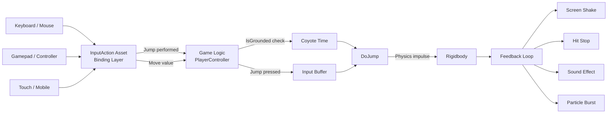

# Input Systems and Game Feel

> [!abstract] TL;DR
> Good input handling abstracts devices behind actions; great game feel turns mechanical correctness into satisfaction. Coyote time, input buffering, screen shake, and hit stop are industry-standard techniques that make games feel alive.

## Input Devices and Abstraction

Every input device speaks a different language: keyboard scancodes, mouse deltas and buttons, gamepad analog axes (−1 to +1), triggers (0 to 1), and touch contacts (position, pressure, gesture).

Hardcoding device-specific inputs directly into game logic creates a maintenance nightmare: changing "W to move forward" requires touching gameplay code, remapping breaks everything, and adding controller support requires rewriting each system.

The solution is an **abstraction layer** that maps physical inputs to **logical actions**. The game only knows about actions: `"Move"`, `"Jump"`, `"Fire"`, `"Interact"`. Any physical device can be bound to any action. Benefits:

- **Rebindable controls** — swap bindings at runtime without touching gameplay code
- **Multi-device support** — same action fires whether triggered by keyboard, gamepad, or touch
- **Context switching** — different action maps for gameplay vs. UI vs. cutscenes
- **Testing** — inject synthetic input events without physical hardware

**Unity New Input System** uses `InputAction` assets. **Unreal Enhanced Input** uses `InputAction` assets with `InputMappingContext`. Both follow the same principle: physical device → binding → action → C# event.

## Unity New Input System

The New Input System (introduced in Unity 2019, stable in 2021) replaces the legacy `Input.GetKey` polling API with an event-driven, asset-based system.

```csharp
using UnityEngine;
using UnityEngine.InputSystem;

public class PlayerController : MonoBehaviour {
    [SerializeField] private InputActionAsset inputActions;
    [SerializeField] private float jumpForce = 8f;
    [SerializeField] private float moveSpeed = 5f;

    private InputAction moveAction;
    private InputAction jumpAction;
    private Rigidbody rb;
    private bool isGrounded;

    void Awake() {
        rb = GetComponent<Rigidbody>();
        var gameplay = inputActions.FindActionMap("Gameplay");
        moveAction = gameplay.FindAction("Move");
        jumpAction = gameplay.FindAction("Jump");

        // Event-driven — called exactly once per press, no polling needed
        jumpAction.performed += ctx => OnJump();
    }

    void OnEnable()  { moveAction.Enable(); jumpAction.Enable(); }
    void OnDisable() { moveAction.Disable(); jumpAction.Disable(); }

    void FixedUpdate() {
        // ReadValue returns Vector2 from WASD, left stick, or D-pad — same call
        Vector2 input = moveAction.ReadValue<Vector2>();
        Vector3 move = new Vector3(input.x, 0, input.y) * moveSpeed;
        rb.MovePosition(rb.position + move * Time.fixedDeltaTime);
    }

    void OnJump() {
        if (isGrounded)
            rb.AddForce(Vector3.up * jumpForce, ForceMode.Impulse);
    }

    void OnCollisionStay(Collision col) {
        if (col.contacts[0].normal.y > 0.5f) isGrounded = true;
    }
    void OnCollisionExit(Collision col) => isGrounded = false;
}
```

The same `moveAction` returns the correct `Vector2` whether the player uses WASD, an Xbox left stick, a Switch D-pad, or mobile touch joystick—provided the bindings are configured in the `InputAction` asset.

## Input Buffering

**Input buffering** queues a player's input for a short window (typically 100–200 ms) and replays it as soon as the game reaches a state that can honor it.

**Why it matters:** Without buffering, if a player presses Jump 80ms before landing, the input fires during the airborne frame (where jumping is not allowed), is discarded, and nothing happens. The player blames the game for "not responding." With buffering, the jump fires the moment the character touches ground.

This technique is ubiquitous in platformers and critical in fighting games (where combo inputs must be buffered across animation frames).

```csharp
public class BufferedJumpController : MonoBehaviour {
    [SerializeField] private float jumpForce = 8f;
    [SerializeField] private float jumpBufferTime = 0.15f;

    private Rigidbody rb;
    private bool isGrounded;
    private float jumpBufferCounter = 0f;

    void Awake() => rb = GetComponent<Rigidbody>();

    void Update() {
        // Record jump press and start the buffer window
        if (Input.GetButtonDown("Jump"))
            jumpBufferCounter = jumpBufferTime;
        else
            jumpBufferCounter -= Time.deltaTime;

        // Fire jump if buffer is active AND we're grounded
        if (jumpBufferCounter > 0f && isGrounded) {
            DoJump();
            jumpBufferCounter = 0f;  // consume the buffered input
        }
    }

    void DoJump() => rb.AddForce(Vector3.up * jumpForce, ForceMode.Impulse);
}
```

For fighting game combos, maintain a queue of timestamped input events and check sequences: `[LightAttack, HeavyAttack]` within 200ms triggers a special move.

## Coyote Time

**Coyote time** (named after Wile E. Coyote running off cliffs) gives players a brief window to jump after walking off a ledge without pressing jump while still grounded. Typically 100–150 ms.

Without coyote time, a player walking at speed over a ledge edge will have one frame of `isGrounded = false` before they realize they stepped off, and the jump input in that frame is rejected. The game feels like it stole a jump. Coyote time is one of the highest-ROI polish techniques in platformers.

```csharp
public class CoyoteJumpController : MonoBehaviour {
    [SerializeField] private float jumpForce = 8f;
    [SerializeField] private float coyoteTime = 0.15f;
    [SerializeField] private float jumpBufferTime = 0.15f;

    private Rigidbody rb;
    private float coyoteCounter = 0f;
    private float jumpBufferCounter = 0f;

    void Awake() => rb = GetComponent<Rigidbody>();

    void Update() {
        // Coyote timer: reset when grounded, count down when airborne
        if (IsGrounded())
            coyoteCounter = coyoteTime;
        else
            coyoteCounter -= Time.deltaTime;

        // Input buffer
        if (Input.GetButtonDown("Jump"))
            jumpBufferCounter = jumpBufferTime;
        else
            jumpBufferCounter -= Time.deltaTime;

        // Jump if: buffer active AND (currently grounded OR within coyote window)
        bool canJump = coyoteCounter > 0f;
        if (jumpBufferCounter > 0f && canJump) {
            rb.AddForce(Vector3.up * jumpForce, ForceMode.Impulse);
            coyoteCounter = 0f;      // consume coyote window
            jumpBufferCounter = 0f; // consume buffer
        }
    }

    bool IsGrounded() {
        return Physics.Raycast(transform.position, Vector3.down, 0.1f + 0.05f);
    }
}
```

Note: resetting `coyoteCounter = 0f` immediately upon jumping prevents "double coyote"—jumping, falling, then jumping again mid-air within the timer window.

## Game Feel (Juice)

**Game feel** (also called "juice") is the collection of layered feedback that makes moment-to-moment interaction feel satisfying beyond mere mechanical correctness. It is the difference between a game that works and a game that delights.

Key techniques:

**Screen Shake (Trauma-based):** Rather than applying fixed offset magnitudes, accumulate a `trauma` value (0–1) and square it for the shake intensity. This gives fine control: low trauma = almost imperceptible subtle movement; high trauma = violent shaking. Squaring creates a non-linear falloff that feels more organic than linear decay.

```csharp
public class CameraShake : MonoBehaviour {
    [SerializeField] private float maxOffset = 0.3f;
    [SerializeField] private float maxRoll = 5f;
    [SerializeField] private float frequency = 25f;
    [SerializeField] private float decaySpeed = 1.5f;

    private float trauma = 0f;
    private float seed;

    void Awake() => seed = Random.value * 100f;

    public void AddTrauma(float amount) {
        trauma = Mathf.Clamp01(trauma + amount);
    }

    void Update() {
        // Decay trauma over time
        trauma = Mathf.MoveTowards(trauma, 0f, decaySpeed * Time.deltaTime);
        float shake = trauma * trauma;  // square for non-linear feel

        // Perlin noise gives smooth random offsets (unlike pure Random)
        float x = maxOffset * shake * (Mathf.PerlinNoise(seed + 0f, Time.time * frequency) * 2 - 1);
        float y = maxOffset * shake * (Mathf.PerlinNoise(seed + 1f, Time.time * frequency) * 2 - 1);
        float roll = maxRoll * shake * (Mathf.PerlinNoise(seed + 2f, Time.time * frequency) * 2 - 1);

        transform.localPosition = new Vector3(x, y, 0f);
        transform.localEulerAngles = new Vector3(0f, 0f, roll);
    }
}
```

**Hit Stop (Time Freeze):** Freeze the game for 3–8 frames on a heavy impact. The pause makes the hit feel weighty. Implemented by temporarily setting `Time.timeScale = 0` and restoring it after a real-time delay.

```csharp
IEnumerator HitStop(float duration = 0.06f) {
    Time.timeScale = 0f;
    yield return new WaitForSecondsRealtime(duration);
    Time.timeScale = 1f;
}
```

**Squash and Stretch:** Non-uniform scale on impact (scale Y down, scale XZ up) and on jumps (scale Y up, XZ down). The total volume stays roughly constant but the deformation conveys energy transfer. Applied to the mesh renderer's transform, not the collider.

**Acceleration Curves:** Ease-in movement (starts slow, accelerates) feels heavy and deliberate—good for tanks, heavy characters. Ease-out (starts fast, decelerates) feels snappy and responsive—good for melee combos. Use `AnimationCurve` assets in Unity to author custom curves and sample them with `curve.Evaluate(t)`.

**Particle Bursts + Sound:** Visual and audio feedback must happen at the exact same frame as impact—any perceptible delay (>16ms) breaks the illusion. Pool particles, trigger them from `OnCollision/OnTriggerEnter`, and use event-based audio (not AudioSource.Play calls scattered in Update).



## Common Pitfalls

- **Reading input in `FixedUpdate()`**: `FixedUpdate` runs at 50 Hz; a button press that lasts a single frame at 60+ FPS will be missed. Always read `GetButtonDown`/`performed` events in `Update` and store state for `FixedUpdate` to consume.
- **Hardcoding device-specific keys** (`Input.GetKey(KeyCode.Space)`): breaks with controller input, prevents rebinding, and requires code changes to support new platforms. Use the abstraction layer from day one.
- **No coyote time or input buffer in a platformer**: the game feels stiff and unforgiving even when physics is technically correct. These are not "nice to haves"—they are baseline expectations for the genre, established by Mario 64 (1996).
- **Screen shake with linear trauma decay**: linear decay feels abrupt and mechanical. Squaring the trauma value creates the smooth "after-shock" feel. Using `Random.value` instead of Perlin noise creates jittery, twitchy shaking rather than the smooth rolling motion of a real camera.
- **Large hit stop durations**: more than ~100ms of frozen time shifts from "satisfying impact" to "lag." Keep hit stops between 3–8 frames (50–133ms at 60 FPS). Scale duration with hit severity (light attack: 3 frames, heavy finisher: 8 frames).

## Review Questions

1. A player in your platformer says "the jump feels unresponsive near ledge edges—I press jump but nothing happens." Identify which two techniques from this note address this complaint, describe what each does mechanically, and give a typical time window for each.
2. Your game currently reads all input via `Input.GetKey(KeyCode.W)` scattered across multiple scripts. List three concrete maintenance or design problems this creates, then describe the one architectural change that solves all three.
3. Explain why squaring the `trauma` value (rather than using it directly) produces a more organic-feeling screen shake, and why Perlin noise is preferred over `Random.value` for the offset calculation.

## Related Concepts

- [[_MOC_Game_Development_Master|↑ Game Development MOC]]

#GameDev
