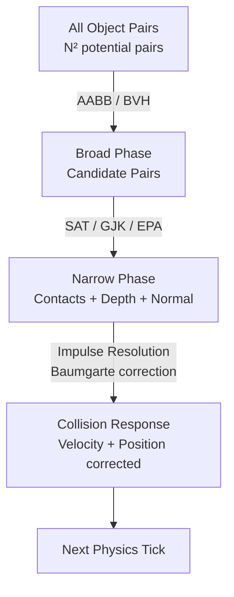

# Physics and Collision Detection

> [!abstract] TL;DR
> Game physics simulates rigid body dynamics using force integration. Collision detection has two phases: broad (AABB sweep) and narrow (SAT/GJK). Understanding impulse resolution, raycasting, and engine APIs lets you build physically believable worlds.

## Rigid Body Dynamics

A **rigid body** is a physics object that does not deform under forces—all internal distances remain constant. Its complete state at any moment is:

- **Position** `x` — center of mass in world space
- **Orientation** `q` — quaternion representing rotation
- **Linear velocity** `v` — rate of change of position
- **Angular velocity** `ω` — rate of rotation around an axis
- **Force accumulator** `F` — net force applied this tick (cleared after integration)
- **Torque accumulator** `τ` — net torque this tick

**Newton's second law** drives linear motion: `F = ma`, so acceleration `a = F / m`. For rotation, `τ = Iα`, where `I` is the inertia tensor (a 3×3 matrix for 3D bodies) and `α` is angular acceleration. The inertia tensor resists rotation proportionally to how mass is distributed around the rotation axis—a rod spun around its long axis has very low resistance; spun around a perpendicular axis, much higher.

In Unity, the `Rigidbody` component exposes: `mass`, `drag` (linear damping), `angularDrag`, `constraints` (freeze position/rotation axes), `isKinematic` (driven by code, not forces), and `interpolation` (smooths rendered position between physics ticks).

## Integration Methods

Integration advances the physics state from time `t` to `t + dt`. Different methods trade accuracy for computational cost.

**Explicit (Forward) Euler** — simplest, but accumulates error and is unstable at large `dt`:
```
velocity += acceleration * dt
position += velocity * dt       // uses OLD velocity
```

**Semi-Implicit (Symplectic) Euler** — update velocity first, then position with the new velocity. Conserves energy better; used by PhysX, Havok, Box2D:
```
velocity += acceleration * dt
position += velocity * dt       // uses NEW velocity
```

**Verlet Integration** — position-based, implicitly stable, no explicit velocity storage:
```
pos_new = 2 * pos_current - pos_previous + acceleration * dt²
```

Verlet is popular for cloth and soft-body simulations (Jakobsen's position-based dynamics) because it handles constraints elegantly.

**RK4 (Runge-Kutta 4th order)** — evaluates four derivative samples per step, dramatically reduces error, but is 4× more expensive. Used in high-accuracy orbital simulations, rarely in real-time games.

```csharp
// Manual semi-implicit Euler (illustrative — normally you use engine Rigidbody)
public class ManualRigidbody : MonoBehaviour {
    public float mass = 1f;
    private Vector3 velocity = Vector3.zero;
    private Vector3 forceAccumulator = Vector3.zero;

    public void AddForce(Vector3 force) => forceAccumulator += force;

    void FixedUpdate() {
        Vector3 acceleration = forceAccumulator / mass;
        velocity += acceleration * Time.fixedDeltaTime;          // velocity first
        transform.position += velocity * Time.fixedDeltaTime;   // then position
        forceAccumulator = Vector3.zero;                          // clear accum
    }
}
```

## Collision Detection Phases

Collision detection runs in two sequential phases to balance correctness against cost.

### Broad Phase

The broad phase quickly **eliminates pairs that cannot possibly be colliding**. It runs cheap, approximate tests on all object pairs to produce a small candidate list.

- **AABB sweep-and-prune**: sort objects by their AABB minimum on one axis. Pairs whose AABBs don't overlap on that axis are immediately rejected. Maintains sorted lists between frames using insertion sort (fast when objects move slowly).
- **BVH traversal**: descend the bounding volume hierarchy, skipping entire subtrees whose bounding volumes don't overlap.
- **Spatial grid**: place objects in grid cells; only test objects sharing at least one cell.

### Narrow Phase

For the candidate pairs that survived broad phase, the narrow phase performs **exact intersection tests**.

- **SAT (Separating Axis Theorem)**: for two convex shapes, if any axis exists along which their projections don't overlap, they are separated. Test all face normals and edge cross-products as candidate axes. Fast (a few dozen dot products), but only works on convex shapes.
- **GJK (Gilbert-Johnson-Keerthi)**: iteratively builds a simplex in Minkowski difference space to find the minimum distance between two convex shapes. More general than SAT. Requires `O(n)` support function calls.
- **EPA (Expanding Polytope Algorithm)**: extends GJK to compute collision depth and contact normal when GJK reports overlap. Used with GJK as a pair.

For **concave** meshes: decompose into convex hulls offline (V-HACD algorithm), then run GJK/SAT on each hull pair. Never run narrow-phase tests directly on concave triangle soups at runtime.

## Collision Response

Once a collision is detected with penetration depth `d` and contact normal `n`, the engine resolves it by applying **impulses** that push the bodies apart and adjust their velocities.

**Coefficient of restitution** `e` controls bounciness:
- `e = 0` → perfectly inelastic (objects stick together, no bounce)
- `e = 1` → perfectly elastic (full kinetic energy conserved)
- `e = 0.3–0.6` → typical game objects

**Impulse resolution** (simplified, no rotation):

```csharp
void ResolveCollision(Rigidbody rb1, Rigidbody rb2, Vector3 normal, float e = 0.5f) {
    Vector3 relativeVelocity = rb2.velocity - rb1.velocity;
    float velAlongNormal = Vector3.Dot(relativeVelocity, normal);

    // Only resolve if objects are approaching (not already separating)
    if (velAlongNormal > 0) return;

    // Compute scalar impulse magnitude
    float j = -(1 + e) * velAlongNormal / (1f / rb1.mass + 1f / rb2.mass);

    // Apply impulse along contact normal
    Vector3 impulse = j * normal;
    rb1.velocity -= impulse / rb1.mass;
    rb2.velocity += impulse / rb2.mass;
}
```

After velocity correction, a **positional correction** nudges overlapping objects apart to prevent sinking (a common "Baumgarte stabilization" technique applies a fraction of the penetration depth each step).

## Raycasting

A **raycast** fires a mathematical ray from an origin point in a direction and returns the first (or all) physics objects it intersects. It is one of the most-used physics queries in games.

Common applications:
- **Shooting/line of sight**: fire ray from gun muzzle, check what it hits, apply damage via interface
- **Mouse picking**: convert screen cursor to a world-space ray using the camera's inverse VP matrix, find the clicked object
- **Ground detection**: cast downward from character feet to determine if grounded, find slope angle
- **Vision cones**: cast multiple rays in a fan to determine what an AI can see

```csharp
// Single raycast — hit the first object
if (Physics.Raycast(firePoint.position, firePoint.forward, out RaycastHit hit, maxRange, enemyLayerMask)) {
    Debug.DrawLine(firePoint.position, hit.point, Color.red, 0.1f);

    // Apply damage through interface — decoupled from enemy class
    hit.collider.GetComponent<IDamageable>()?.TakeDamage(damage);

    // Spawn impact VFX at hit position/normal
    Instantiate(impactFX, hit.point, Quaternion.LookRotation(hit.normal));
}

// SphereCast — like raycast but with radius (useful for projectiles)
if (Physics.SphereCast(origin, 0.3f, direction, out hit, maxRange)) { }

// OverlapSphere — find all colliders within a radius (e.g., explosion AoE)
Collider[] inBlast = Physics.OverlapSphere(explosionCenter, blastRadius, damageMask);
foreach (var col in inBlast) {
    col.GetComponent<IDamageable>()?.TakeDamage(blastDamage);
}
```

## Unity Physics API

Unity wraps PhysX and exposes a high-level API:

| API                        | Description                                              |
|---------------------------|----------------------------------------------------------|
| `Rigidbody.AddForce`       | Apply a force this fixed step                           |
| `ForceMode.Force`          | Continuous force (accounts for mass, per FixedUpdate)   |
| `ForceMode.Impulse`        | Instant velocity change (accounts for mass)             |
| `ForceMode.VelocityChange` | Instant velocity change (ignores mass)                  |
| `OnCollisionEnter()`       | Physics contact — bodies respond normally               |
| `OnTriggerEnter()`         | Detection only — no physics response, just event        |
| `Physics.Raycast`          | Single ray query                                        |
| `Physics.OverlapSphere`    | All colliders in a radius                               |
| `Physics.IgnoreLayerCollision` | Disable collision between two layers             |



## Common Pitfalls

- **Moving Rigidbodies via `Transform.position`**: teleports the body bypassing velocity integration—PhysX doesn't compute a swept trajectory, so fast-moving objects can tunnel through thin walls. Use `Rigidbody.MovePosition` for kinematic bodies or let forces drive dynamic ones.
- **Using MeshCollider on all objects**: concave MeshColliders are expensive and cannot collide with each other (only with convex primitives). Replace with primitive collider composites or convex hull approximations.
- **Not setting up Physics Layer matrix**: without filtering, every object tests against every other object in broad phase. Configure `Physics → Layer Collision Matrix` so bullets only test against enemies, player only tests against world, etc.
- **Euler integration diverging at low frame rates**: if someone runs at 10 FPS with explicit Euler and large `dt`, energy accumulates—objects accelerate indefinitely. Fixed timestep + semi-implicit Euler mitigates this.
- **Applying forces in `Update` instead of `FixedUpdate`**: forces applied once per render frame scale with frame rate, producing inconsistent behavior.

## Review Questions

1. Explain the difference between SAT and GJK for narrow-phase collision detection. In what scenario would GJK be preferred over SAT, and why?
2. Two rubber balls collide. Ball A has mass 1 kg and velocity `(2, 0, 0)`. Ball B has mass 2 kg and velocity `(-1, 0, 0)`. With coefficient of restitution `e = 1` (elastic), calculate the post-collision velocity of Ball A using the impulse formula.
3. A developer moves an enemy Rigidbody using `transform.position += direction * speed * Time.deltaTime` every Update. What two specific physics problems does this cause, and what is the correct API call to use instead?

## Related Concepts

- [[_MOC_Game_Development_Master|↑ Game Development MOC]]

#GameDev
