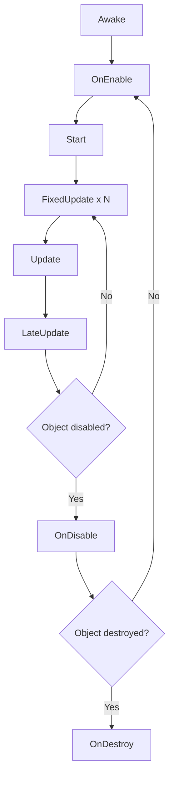

# Unity Fundamentals

> [!abstract] TL;DR
> Unity's editor is built around GameObjects and Components. Every behavior is a MonoBehaviour attached to a GameObject. Understanding the lifecycle methods, prefab system, and Unity's left-handed Y-up coordinate system is essential before writing any game logic.

## Unity Editor Overview

The Unity editor is divided into several panels that together give you full control over your project. Understanding each panel's purpose prevents confusion and speeds up iteration.

**Scene View** is your 3D (or 2D) working viewport. You manipulate GameObjects here using gizmos — the move, rotate, and scale handles. Press **W** to switch to the Move tool, **E** for Rotate, **R** for Scale, and **T** for the Rect tool used in 2D/UI work. Press **F** with an object selected to focus the camera on it. Hold **Alt** and drag to orbit the scene camera. The Scene view also provides Gizmos toggles in the top-right corner to show/hide lighting, physics shapes, particle emitters, and other overlays.

**Game View** shows exactly what the active camera renders — this is your player's perspective. You can set an aspect ratio or resolution to test different screen sizes. The Stats overlay in Game view shows real-time rendering stats: draw calls, triangles, FPS. This is invaluable for quick performance sanity checks.

**Hierarchy** is the scene graph — a tree of every GameObject in the currently open scene. Parent-child relationships are shown as indentation. Dragging one object onto another parents it, meaning the child's Transform becomes relative to the parent. Renaming, duplicating (Ctrl+D), and grouping objects are all done here.

**Inspector** shows the properties of the currently selected object. Every Component attached to a GameObject appears as a panel in the Inspector. Serialized fields from your C# scripts appear here, letting designers tweak values without touching code. This is the primary bridge between programmers and designers in Unity.

**Project** browser shows all assets in your `Assets/` folder — scripts, prefabs, textures, audio clips, materials. Assets are not scenes; they live on disk and can be referenced across multiple scenes. Organizing assets into clearly named subfolders (`Scripts/Player/`, `Prefabs/Enemies/`, `Art/Textures/`) is critical as projects grow.

**Console** displays Debug.Log output, warnings, and errors. Clicking a log entry navigates to the line of code that produced it. Use `Debug.LogWarning()` for non-critical issues and `Debug.LogError()` for failures that should be fixed before shipping. The Console also shows compile errors — Unity won't enter Play mode if any script has a compile error.

Key shortcuts: **Ctrl+Z** / **Ctrl+Y** undo/redo, **Ctrl+D** duplicate, **Ctrl+P** enter/exit Play mode, **Ctrl+Shift+P** pause Play mode.

## GameObject-Component Architecture

Unity's architecture is composition-based rather than inheritance-based. There is no "Enemy" base class that you extend — instead, there is a generic `GameObject` container, and you attach components to it to define behavior.

A "Player" GameObject might have the following components:
- `Transform` — always present; defines position, rotation, and scale in 3D space
- `Rigidbody` — makes the object simulated by Unity's PhysX physics engine
- `CapsuleCollider` — defines the physical shape for collision detection
- `PlayerController` — your custom MonoBehaviour script handling input and movement
- `AudioSource` — plays sound effects (footsteps, jump sounds, etc.)
- `Animator` — drives animation state machines

Components communicate with each other via `GetComponent<T>()`. This call searches the GameObject's component list for a component of type T and returns it. If no component of that type exists, it returns null.

```csharp
public class PlayerController : MonoBehaviour {
    private Rigidbody rb;
    private Animator anim;
    private AudioSource audioSource;

    void Awake() {
        // Cache component references — never call GetComponent in Update
        rb          = GetComponent<Rigidbody>();
        anim        = GetComponent<Animator>();
        audioSource = GetComponent<AudioSource>();
    }

    void Update() {
        float h = Input.GetAxis("Horizontal");
        float v = Input.GetAxis("Vertical");
        anim.SetFloat("Speed", new Vector2(h, v).magnitude);
    }
}
```

The `[RequireComponent(typeof(Rigidbody))]` attribute forces Unity to add a Rigidbody whenever the script is added to a GameObject, preventing null reference errors caused by missing dependencies.

## MonoBehaviour Lifecycle

Unity calls lifecycle methods on your MonoBehaviour scripts in a well-defined order. Misunderstanding this order is one of the most common sources of bugs for beginners.

```csharp
public class EnemyAI : MonoBehaviour {
    private Rigidbody rb;
    private PlayerController player;

    // Awake: called first, even if the component/GameObject is disabled.
    // Use for self-initialization that doesn't depend on other GameObjects.
    void Awake() {
        rb = GetComponent<Rigidbody>();
        Debug.Log("Awake called — component references initialized");
    }

    // OnEnable: called every time the object becomes active in the hierarchy.
    // Pair subscriptions here with unsubscriptions in OnDisable.
    void OnEnable() {
        EventBus.Subscribe(OnDamaged);
        Debug.Log("OnEnable — subscribed to events");
    }

    // Start: called once before the first Update, but AFTER all Awakes have run.
    // Safe to reference other GameObjects here because their Awakes have already run.
    void Start() {
        player = FindObjectOfType<PlayerController>();
        Debug.Log("Start — cross-component references resolved");
    }

    // Update: called every rendered frame. deltaTime varies based on FPS.
    // Use for input, non-physics movement, gameplay logic.
    void Update() {
        MoveTowardPlayer();
    }

    // FixedUpdate: called on a fixed timestep (default 0.02s = 50 calls/sec).
    // Always use for Rigidbody physics to get deterministic simulation.
    void FixedUpdate() {
        Vector3 dir = (player.transform.position - transform.position).normalized;
        rb.AddForce(dir * 5f);
    }

    // LateUpdate: runs after all Update calls have completed for the frame.
    // Use for camera follow, UI that tracks world positions, post-movement adjustments.
    void LateUpdate() {
        UpdateHealthBarPosition();
    }

    // OnDisable: called every time the object is deactivated.
    // Always undo what OnEnable did to prevent memory leaks.
    void OnDisable() {
        EventBus.Unsubscribe(OnDamaged);
        Debug.Log("OnDisable — unsubscribed from events");
    }

    // OnDestroy: final cleanup before the object is fully removed from memory.
    void OnDestroy() {
        Debug.Log("Enemy destroyed");
    }

    void MoveTowardPlayer() { /* AI movement logic */ }
    void UpdateHealthBarPosition() { /* world-space UI update */ }
    void OnDamaged() { /* respond to damage event */ }
}
```

**Lifecycle order summary:**



The key distinction: **Awake** is for self-setup (component caching), **Start** is for cross-object wiring (finding other GameObjects). If every script caches its own components in Awake, they are all ready by the time Start runs on any of them.

## Prefabs

A **Prefab** is a reusable template stored as an asset. Once you drag a configured GameObject into the Project window, it becomes a Prefab. You can then instantiate as many copies as you need at runtime or in the editor. Each instance is linked to the Prefab definition — changes to the Prefab propagate to all instances (unless an instance has a local override).

**Prefab Variants** work like OOP inheritance for GameObjects. A "BossEnemy" variant can extend a "BaseEnemy" prefab, overriding only its health value and mesh while inheriting all other components and settings. This avoids duplicating setup across similar objects.

**Nested Prefabs** allow one prefab to contain another — a "Turret" prefab can contain a "Bullet" spawn point prefab, and editing the "Bullet" prefab updates it everywhere it is nested.

```csharp
public class WeaponController : MonoBehaviour {
    [SerializeField] private GameObject bulletPrefab;
    [SerializeField] private Transform firePoint;
    [SerializeField] private float bulletDamage = 25f;
    [SerializeField] private float bulletSpeed  = 20f;

    public void Fire() {
        // Instantiate creates a clone of the prefab at a given position/rotation
        GameObject bulletObj = Instantiate(bulletPrefab, firePoint.position, firePoint.rotation);

        // Initialize the spawned instance
        if (bulletObj.TryGetComponent<Bullet>(out var bullet)) {
            bullet.Init(bulletDamage, bulletSpeed);
        }

        // Parent to a container to keep Hierarchy clean
        bulletObj.transform.SetParent(BulletContainer.Instance.transform);
    }

    void OnDestroy() {
        // Prefab reference itself is unaffected — only the instance is destroyed
    }
}
```

To destroy instantiated objects, call `Destroy(gameObject)` or `Destroy(gameObject, delaySeconds)`. For performance-critical spawning (bullets, particles, enemies), use an **Object Pool** instead of Instantiate/Destroy — covered in the Optimization note.

## Coordinate System

Unity uses a **left-handed, Y-up** coordinate system:
- **X** = right
- **Y** = up
- **Z** = forward (into the screen)

This differs from some other engines (Unreal uses left-handed Z-up) and from OpenGL (right-handed). The cross product of X and Y gives Z in Unity's system.

**World Space vs Local Space** is a critical distinction:
- `transform.position` — position in world space (absolute)
- `transform.localPosition` — position relative to parent
- `transform.forward` — the object's local Z axis expressed in world space
- `transform.right` — local X in world space
- `transform.up` — local Y in world space

```csharp
// Move forward in the direction the object is facing (local space)
transform.position += transform.forward * speed * Time.deltaTime;

// Move in world Z direction regardless of rotation
transform.position += Vector3.forward * speed * Time.deltaTime;

// Convert a local point to world space
Vector3 worldPos = transform.TransformPoint(localOffset);

// Convert a world point to local space
Vector3 localPos = transform.InverseTransformPoint(worldPos);
```

`Vector3.Distance(a, b)` and `Vector3.Lerp(a, b, t)` are frequently used utilities. Use `Vector3.SqrMagnitude` instead of `Vector3.Magnitude` when comparing distances (avoids a square root operation).

## Common Pitfalls

- **Calling GetComponent every frame** — GetComponent performs a hash table lookup every call. Cache all component references in Awake, not in Update. One call per component reference at startup vs. 60+ calls per second at runtime.
- **FindObjectOfType in Update** — This searches the entire scene graph every frame and is O(n) in the number of scene objects. Call it at most once in Start and cache the result.
- **Awake runs even on disabled objects** — Unity calls Awake when an object is loaded, regardless of whether it or its parent is active. If your Awake code depends on a scene being fully loaded, it may run earlier than you expect. Use Start for post-scene-load logic.
- **Modifying localPosition when you mean position** — If a GameObject is parented, `transform.localPosition = Vector3.zero` moves it to the parent's origin, not the world origin. Always know which space you are working in.
- **Modifying transform directly on physics objects** — Setting `transform.position` on a Rigidbody bypasses the physics engine, causing tunneling and incorrect collision responses. Use `Rigidbody.MovePosition` for kinematic moves.

## Review Questions

1. What is the difference between `Awake` and `Start`? When should you use each?
2. Why should camera follow logic go in `LateUpdate` rather than `Update`?
3. What is the difference between a Prefab instance and a Prefab variant?
4. What does `transform.forward` return, and how is it different from `Vector3.forward`?
5. If `Script A` and `Script B` both have `Start()` methods, can you guarantee which runs first?

## Related Concepts

- [[_MOC_Game_Development_Master|↑ Game Development MOC]]

#GameDev
