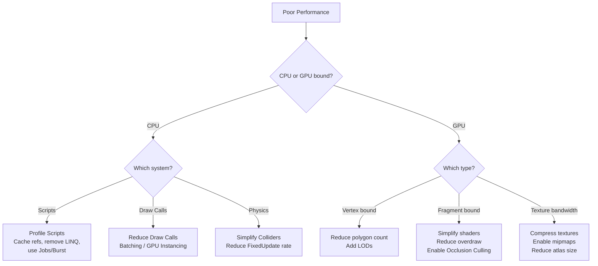

# Unity Performance Optimization

> [!abstract] TL;DR
> Unity performance is profiled through the built-in Profiler. Key wins come from reducing draw calls (batching, GPU instancing), avoiding per-frame allocations (no LINQ/boxing in Update), using Object Pooling, LOD, Occlusion Culling, and Unity Jobs/Burst for CPU-heavy logic.

## The Profiler

The single most important rule of optimization: **never optimize without first profiling**. Guessing at bottlenecks wastes time and often makes code worse. Unity's Profiler gives precise, frame-by-frame measurements.

Open it: **Window → Analysis → Profiler** (Ctrl+7).

**CPU Usage module** — Shows a flame graph of time spent per system per frame. Key categories:
- `Rendering` — CPU overhead for draw call submission, culling
- `Physics.Processing` — PhysX simulation time
- `Scripts.Update` / `Scripts.FixedUpdate` — your MonoBehaviour scripts
- `GC.Alloc` / `GarbageCollector` — managed memory allocation and collection spikes

**GPU module** — Shows shader execution time, overdraw (pixels drawn multiple times), fillrate usage.

**Memory module** — Shows total managed and native memory, and critically, **per-frame GC allocations**. Any allocation in a hot path shows up here. Even small allocations (a few bytes) cause eventual GC pauses that manifest as stutter.

**Rendering module** — SetPass calls (shader state changes), Draw calls, total triangle count, shadow casters rendered.

Best practices:
1. Profile in a **Development Build**, not in the editor (editor overhead inflates all numbers significantly)
2. Profile on your **target device** — a PC profile tells you nothing about mobile performance
3. Use **Deep Profile** to see per-method costs, but note it adds ~10–100x overhead itself; use it to identify, then turn off
4. The **Profile Analyzer** package (Window → Analysis → Profile Analyzer) lets you compare two sessions to verify a change actually helped

```csharp
// Mark custom regions for the Profiler to track
using Unity.Profiling;

static readonly ProfilerMarker s_AIUpdateMarker = new ProfilerMarker("EnemyAI.Update");

void Update() {
    using (s_AIUpdateMarker.Auto()) {
        // Your expensive code here — shows up as named block in Profiler
        UpdatePathfinding();
        EvaluateCombat();
    }
}
```

## Draw Calls and Batching

A draw call is a command from the CPU to the GPU to render a mesh with a given material. Each draw call has fixed CPU overhead (driver API calls, state validation). On mobile, keeping draw calls under 100 is a hard target. On PC, 1000–2000 is typical budget.

**Why draw calls are expensive:** The CPU must package draw command data, the GPU driver validates state, the GPU fetches shader programs and textures. Even if a mesh is tiny, the per-call overhead is the same.

**Batching strategies:**

**Static Batching** — Mark GameObjects as "Static" (top-right checkbox in Inspector). Unity pre-combines all static meshes that share a material into one large mesh at build time. This is a one-time cost: zero CPU overhead at runtime, but higher memory usage (combined mesh stored in RAM). Best for environments — trees, rocks, buildings.

**Dynamic Batching** — Unity automatically combines moving objects at runtime if they share a material and each has fewer than ~300 vertices (with strict shader attribute requirements). The combine happens every frame, so it has CPU cost. Less useful in practice but works for small dynamic objects like coins, bullets with a shared material.

**GPU Instancing** — Renders many instances of the same mesh+material in a single draw call using a special instanced shader. Each instance can have different per-instance properties (position, color, scale) stored in a small GPU buffer. Enable via the Material's "Enable GPU Instancing" checkbox. Use `MaterialPropertyBlock` for per-instance variation without breaking instancing:

```csharp
public class EnemySpawner : MonoBehaviour {
    [SerializeField] private Renderer enemyRendererPrefab;

    // Shared across all enemy instances — only allocate once
    private static readonly int BaseColorProp = Shader.PropertyToID("_BaseColor");
    private MaterialPropertyBlock mpb;

    void Awake() => mpb = new MaterialPropertyBlock();

    // Call this when spawning each enemy
    public void SetEnemyColor(Renderer enemyRenderer, Color teamColor) {
        // Get any existing block values (don't overwrite unrelated properties)
        enemyRenderer.GetPropertyBlock(mpb);

        // Modify only what we need
        mpb.SetColor(BaseColorProp, teamColor);

        // Apply — does NOT create a new material instance, preserves instancing
        enemyRenderer.SetPropertyBlock(mpb);
    }

    // WRONG: creates a unique material instance per object, breaks batching entirely
    void WrongApproach(Renderer r, Color c) {
        r.material.color = c;  // r.material creates a new Material instance!
    }
}
```

**Sprite Atlas** — For 2D games: combine multiple sprites into a single texture atlas. Each sprite on the atlas shares the same material, enabling batching across all sprites using that atlas.

## Unity Jobs and Burst Compiler

Unity's **Jobs System** provides structured multithreading. Jobs run on worker threads from a shared thread pool, and the **Burst Compiler** (`com.unity.burst`) compiles job code to highly optimized native machine code using LLVM with auto-vectorization (SIMD instructions).

Use cases: thousands of agents updating pathfinding, procedural terrain generation, particle system logic, large-scale physics simulation.

Jobs use **NativeArray** and other native containers (NativeList, NativeHashMap, etc.) that live in unmanaged memory — accessible from both main thread and worker threads, and not subject to GC pressure.

```csharp
using Unity.Collections;
using Unity.Jobs;
using Unity.Burst;
using Unity.Mathematics;

// [BurstCompile] attribute enables Burst compilation for this struct
[BurstCompile]
public struct FlockingJob : IJobParallelFor {
    // ReadOnly: safe to read from multiple threads simultaneously
    [ReadOnly] public NativeArray<float3> positions;
    [ReadOnly] public NativeArray<float3> velocities;
    [ReadOnly] public float               deltaTime;
    [ReadOnly] public float               separationRadius;
    [ReadOnly] public float               alignmentRadius;

    // WriteOnly (no ReadOnly): each index is written by exactly one thread
    public NativeArray<float3> newVelocities;

    // Execute is called once per index, potentially on different threads
    public void Execute(int i) {
        float3 separation = float3.zero;
        float3 alignment  = float3.zero;
        float3 cohesion   = float3.zero;
        int    neighbors  = 0;

        for (int j = 0; j < positions.Length; j++) {
            if (i == j) continue;
            float dist = math.distance(positions[i], positions[j]);

            if (dist < separationRadius) {
                separation += math.normalize(positions[i] - positions[j]) / dist;
            }
            if (dist < alignmentRadius) {
                alignment += velocities[j];
                cohesion  += positions[j];
                neighbors++;
            }
        }

        if (neighbors > 0) {
            alignment /= neighbors;
            cohesion   = (cohesion / neighbors) - positions[i];
        }

        newVelocities[i] = math.normalizesafe(velocities[i] + separation + alignment * 0.3f + cohesion * 0.1f);
    }
}

// Scheduling and completing the job on the main thread
public class FlockingManager : MonoBehaviour {
    private NativeArray<float3> positions;
    private NativeArray<float3> velocities;
    private NativeArray<float3> newVelocities;
    private JobHandle flockingHandle;

    void OnEnable() {
        int count = 500;
        positions    = new NativeArray<float3>(count, Allocator.Persistent);
        velocities   = new NativeArray<float3>(count, Allocator.Persistent);
        newVelocities = new NativeArray<float3>(count, Allocator.Persistent);
    }

    void Update() {
        // Schedule — dispatches job to worker threads, returns immediately
        var job = new FlockingJob {
            positions       = positions,
            velocities      = velocities,
            newVelocities   = newVelocities,
            deltaTime       = Time.deltaTime,
            separationRadius = 1.5f,
            alignmentRadius  = 5f
        };

        // Third argument: batch size — how many indices per job chunk
        // Larger = less scheduling overhead; smaller = better load balancing
        flockingHandle = job.Schedule(positions.Length, 32);

        // JobHandle.ScheduleBatchedJobs() — explicitly flush to worker threads
        JobHandle.ScheduleBatchedJobs();
    }

    void LateUpdate() {
        // Complete: blocks main thread until job finishes
        // MUST call before reading newVelocities or reassigning NativeArrays
        flockingHandle.Complete();

        // Now safe to read results and apply to transforms
        for (int i = 0; i < positions.Length; i++) {
            velocities[i] = newVelocities[i];
            positions[i] += velocities[i] * Time.deltaTime;
            // Apply to actual Transform...
        }
    }

    void OnDisable() {
        flockingHandle.Complete(); // Ensure job isn't running before dispose
        positions.Dispose();
        velocities.Dispose();
        newVelocities.Dispose();
    }
}
```

**Burst Compiler constraints** — Burst only compiles code that meets strict requirements:
- No managed heap allocations (`new List<T>()`, `new string()`, etc.)
- No calls to non-Burst-compatible managed APIs (most Unity APIs, Debug.Log, etc.)
- No virtual method calls
- Structs only — no class instances
- `math.*` from `Unity.Mathematics` instead of `Mathf.*`
- No exceptions — use error codes instead

The reward for these constraints: job code often runs 10–100x faster than equivalent single-threaded managed code.

## LOD (Level of Detail)

LOD (Level of Detail) automatically swaps a high-polygon model for simpler versions as the object gets farther from the camera. The GPU's bottleneck at range is often fillrate and vertex throughput, not model quality visible to the player.

Add a **LODGroup** component to a GameObject and configure:

```
LOD 0: 0-15% screen height  → Full detail mesh (5000 triangles)
LOD 1: 15-40% screen height → Medium mesh (800 triangles)
LOD 2: 40-70% screen height → Low mesh (120 triangles)
Culled: 70-100%             → Not rendered at all
```

```csharp
public class LODDebugger : MonoBehaviour {
    private LODGroup lodGroup;

    void Awake() {
        lodGroup = GetComponent<LODGroup>();
    }

    // Programmatically force LOD level (useful for cutscenes, preview)
    void ForceLOD(int level) {
        lodGroup.ForceLOD(level);  // -1 to disable override
    }

    // Adjust LOD bias globally — higher = uses higher detail at greater distances
    void SetHighQualityMode() {
        QualitySettings.lodBias = 2f; // Default is 1.0
    }
}
```

For characters with Skinned Mesh Renderers, LOD is especially important — skeletal animation is expensive and lower LODs can have fewer bones. The lower LOD mesh can even be a static mesh for very distant characters.

## Occlusion Culling

Frustum culling (Unity does this automatically) skips objects outside the camera's field of view. But objects behind walls are still inside the frustum — they waste GPU time rendering pixels that are immediately overdrawn.

**Occlusion Culling** bakes a spatial data structure that tracks what's visible from any point in the scene. At runtime, Unity queries this structure and skips rendering objects confirmed to be hidden behind solid geometry.

Setup:
1. Mark large solid objects (walls, terrain) as **Occluder Static**
2. Mark objects that should be hidden as **Occludee Static**
3. Open **Window → Rendering → Occlusion Culling**, adjust cell size, click **Bake**
4. Enable on the camera: `Camera.useOcclusionCulling = true` (default true)

Occlusion culling is most valuable for indoor environments (corridors, rooms) and dense urban scenes. It provides little benefit for open landscapes.

## Memory Allocation Pitfalls

Garbage collection in Unity is a stop-the-world operation (though incremental GC in newer Unity versions reduces pauses). Any allocation in a hot path eventually triggers a GC cycle and causes a visible stutter. The Profiler Memory module shows allocations per frame in the "GC Alloc" column.

```csharp
// === BAD: multiple GC allocations every frame ===
void Update_Bad() {
    // FindObjectsOfType: scans entire scene, allocates array — O(n) every frame
    var enemies = FindObjectsOfType<Enemy>();

    // LINQ: Where(), Select(), ToList() all allocate new collections
    var alive = enemies.Where(e => e.IsAlive).OrderBy(e => e.hp).ToList();

    // String concatenation: creates a new string object each time
    string msg = "Alive: " + alive.Count + " / " + enemies.Length;
    debugText.text = msg;

    // Boxing: struct (int, float, Vector3) → object allocation
    object boxed = alive.Count; // int boxed to object
}

// === GOOD: zero allocations in hot path ===
// Pre-allocated collections
private List<Enemy> aliveEnemies  = new List<Enemy>(128);  // pre-capacitated
private StringBuilder sb          = new StringBuilder(64);

// Register/unregister enemies via events, not FindObjectsOfType
public static readonly List<Enemy> AllEnemies = new List<Enemy>(128);
// Enemy.OnEnable(): AllEnemies.Add(this); Enemy.OnDisable(): AllEnemies.Remove(this);

void Update_Good() {
    aliveEnemies.Clear();  // Clears without deallocating the backing array
    foreach (var e in AllEnemies) {
        if (e.IsAlive) aliveEnemies.Add(e);
    }

    // StringBuilder: reuse, no allocation after initial creation
    sb.Clear();
    sb.Append("Alive: ");
    sb.Append(aliveEnemies.Count);
    sb.Append(" / ");
    sb.Append(AllEnemies.Count);
    debugText.text = sb.ToString(); // One allocation: the final string for the text component
}
```

**Common allocation sources to audit:**
- `string + string` or `$"interpolated {var}"` in Update — use StringBuilder or pre-formatted strings
- LINQ (`.Where`, `.Select`, `.ToList`, `.FirstOrDefault`) — use foreach loops over pre-allocated lists
- `new List<T>()`, `new T[]` inside loops — pre-allocate at Awake/Start
- `Enum.GetValues()`, `Enum.HasFlag()` — can allocate; use cached arrays
- `params T[]` arguments — passing to a `params` method allocates an array every call
- Boxing (passing struct as interface, `object`, or generic without constraint)

## Object Pooling

Instantiate and Destroy are expensive: they allocate/free memory, trigger the full MonoBehaviour lifecycle, and cause GC pressure. For frequently spawned/despawned objects (bullets, enemies, particles, UI elements), use an Object Pool.

```csharp
using UnityEngine.Pool;

public class BulletPool : MonoBehaviour {
    [SerializeField] private GameObject bulletPrefab;
    [SerializeField] private int defaultCapacity = 50;
    [SerializeField] private int maxSize         = 200;

    private ObjectPool<Bullet> pool;

    void Awake() {
        pool = new ObjectPool<Bullet>(
            createFunc:    CreateBullet,
            actionOnGet:   OnBulletGet,
            actionOnRelease: OnBulletRelease,
            actionOnDestroy: OnBulletDestroy,
            collectionCheck: true,   // Debug: throws if releasing already-released object
            defaultCapacity: defaultCapacity,
            maxSize: maxSize
        );
    }

    Bullet CreateBullet() {
        var obj = Instantiate(bulletPrefab);
        var bullet = obj.GetComponent<Bullet>();
        bullet.SetPool(pool);  // So bullet can return itself
        return bullet;
    }

    void OnBulletGet(Bullet b)     => b.gameObject.SetActive(true);
    void OnBulletRelease(Bullet b) => b.gameObject.SetActive(false);
    void OnBulletDestroy(Bullet b) => Destroy(b.gameObject);

    public void Fire(Vector3 pos, Quaternion rot, float damage) {
        Bullet bullet = pool.Get();
        bullet.transform.SetPositionAndRotation(pos, rot);
        bullet.Init(damage);
    }
}

public class Bullet : MonoBehaviour {
    private ObjectPool<Bullet> pool;
    private float damage;

    public void SetPool(ObjectPool<Bullet> p) => pool = p;

    public void Init(float dmg) {
        damage = dmg;
        // Reset state, start movement
    }

    void OnCollisionEnter(Collision col) {
        // Deal damage...
        pool.Release(this); // Return to pool instead of Destroy
    }

    // Return to pool after time limit
    IEnumerator AutoReturn(float delay) {
        yield return new WaitForSeconds(delay);
        pool.Release(this);
    }
}
```

`UnityEngine.Pool.ObjectPool<T>` (Unity 2021+) is Unity's built-in generic pool. For older Unity versions, implement a simple queue-based pool.

## Texture and Asset Optimization

**Texture compression** reduces GPU memory and bandwidth:
- **ASTC** (mobile): Adaptive Scalable Texture Compression, best quality-per-size on modern mobile
- **DXT/BC** (PC): DXT1 (no alpha, 4:1), DXT5 (with alpha, 8:1), BC7 (high quality)
- Enable mipmaps for anything rendered at varying distances — Unity auto-generates them and the GPU picks the appropriate mip level

**Texture atlases** combine multiple small textures into one large texture. This reduces draw calls (all sprites on the same atlas share one material) and reduces texture memory (power-of-two textures are more GPU-friendly).

**Addressable Assets** (package: `com.unity.addressables`) enable loading large content on demand and unloading it when no longer needed:

```csharp
using UnityEngine.AddressableAssets;
using UnityEngine.ResourceManagement.AsyncOperations;

public class AssetLoader : MonoBehaviour {
    [SerializeField] private AssetReference levelEnvironmentRef;

    private AsyncOperationHandle<GameObject> loadHandle;

    public async void LoadEnvironmentAsync() {
        loadHandle = Addressables.InstantiateAsync(levelEnvironmentRef);
        await loadHandle.Task;

        if (loadHandle.Status == AsyncOperationStatus.Succeeded) {
            Debug.Log("Environment loaded and instantiated");
        }
    }

    void OnDestroy() {
        // Release the handle to allow unloading
        if (loadHandle.IsValid()) Addressables.ReleaseInstance(loadHandle);
    }
}
```

**Performance bottleneck decision tree:**



## Common Pitfalls

- **Optimizing before profiling** — The Profiler frequently reveals that the actual bottleneck is not where you assumed. Always measure first, then fix the measured problem.
- **Not testing on target device** — Editor performance is completely unrepresentative of mobile hardware. A PC with a GPU 50× more powerful than your target phone will mask all GPU bottlenecks.
- **Using `material.color` instead of `MaterialPropertyBlock`** — Accessing `renderer.material` creates a new unique Material instance on the GameObject, permanently breaking batching and GPU instancing for that object. Always use `MaterialPropertyBlock` for per-instance variation.
- **`GetComponent` in Update** — Even though it's a hash lookup, it's called 60+ times per second. Cache all component references in Awake.
- **Reading from NativeArray before `JobHandle.Complete()`** — Job data is being written to on worker threads. Reading it before completion causes undefined behavior (race condition). Always call `handle.Complete()` before accessing job output, and Dispose NativeArrays when no longer needed.
- **`FindObjectsOfType` or LINQ in hot paths** — Both allocate managed memory that feeds the GC. Manage object registries manually via events (Add on OnEnable, Remove on OnDisable) and iterate pre-built lists.

## Review Questions

1. What is the difference between Static Batching and GPU Instancing? When would you use each?
2. Why does string concatenation in `Update()` cause performance issues?
3. What does `[BurstCompile]` do and what constraints does it impose on code?
4. Why should you call `JobHandle.Complete()` in `LateUpdate` rather than at the end of `Update`?
5. What is the difference between frustum culling and occlusion culling? Which does Unity perform automatically?

## Related Concepts

- [[_MOC_Game_Development_Master|↑ Game Development MOC]]

#GameDev
