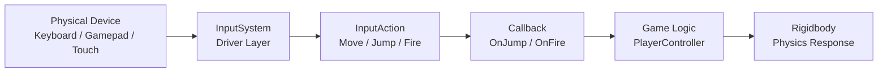

# Unity Physics and Input

> [!abstract] TL;DR
> Unity's PhysX wrapper provides Rigidbody and Collider components for realistic physics. The new Input System abstracts devices behind InputAction assets. Use `Rigidbody.MovePosition` for kinematic movement, `Physics.Raycast` for queries, and always put physics code in FixedUpdate.

## Rigidbody Component

The `Rigidbody` component hands control of a GameObject's position and rotation over to Unity's PhysX simulation engine. Without a Rigidbody, an object is purely static from the physics engine's perspective — it can be a collider that other things bounce off, but it will never move due to forces or gravity.

Key Rigidbody properties and their meanings:

| Property | Effect |
|---|---|
| `mass` | Kilograms. Affects how forces move the object and momentum in collisions. |
| `drag` | Linear air resistance. High values make objects slow down quickly. |
| `angularDrag` | Rotational resistance. Default 0.05 prevents infinite spinning. |
| `useGravity` | Toggles gravity. Turn off for floating objects, spacecraft, top-down games. |
| `isKinematic` | Script controls movement; physics engine still detects collisions but applies no forces to this body. |
| `constraints` | Freeze individual position/rotation axes. Lock rotation X/Z on a character controller. |
| `interpolation` | Smooths between FixedUpdate positions (important for cameras following physics objects). |
| `collisionDetection` | Discrete (default), Continuous (fast-moving objects), ContinuousSpeculative (best for kinematics). |

Applying forces correctly:

```csharp
public class PlayerMotor : MonoBehaviour {
    [SerializeField] private float moveSpeed   = 8f;
    [SerializeField] private float jumpForce   = 7f;
    [SerializeField] private float thrustForce = 20f;

    private Rigidbody rb;
    private Vector2   moveInput;
    private bool      jumpQueued;

    void Awake() => rb = GetComponent<Rigidbody>();

    void FixedUpdate() {
        // Continuous force (like a jetpack thrust)
        if (thrustActive) rb.AddForce(Vector3.up * thrustForce);

        // Instant impulse — ignores frame rate, ideal for jumps
        if (jumpQueued) {
            rb.AddForce(Vector3.up * jumpForce, ForceMode.Impulse);
            jumpQueued = false;
        }

        // VelocityChange: like Impulse but ignores mass entirely
        // Good for precise directional dash ability
        if (dashQueued) {
            rb.AddForce(dashDirection * dashSpeed, ForceMode.VelocityChange);
            dashQueued = false;
        }

        // Direct velocity control — best for character controllers
        // Preserve vertical velocity (gravity) while controlling horizontal
        Vector3 targetVelocity = new Vector3(
            moveInput.x * moveSpeed,
            rb.linearVelocity.y,     // preserve Y from gravity/jumps
            moveInput.y * moveSpeed
        );
        rb.linearVelocity = targetVelocity;
    }

    void Update() {
        // Queue input in Update (every frame), apply in FixedUpdate
        if (Input.GetKeyDown(KeyCode.Space)) jumpQueued = true;
        moveInput = new Vector2(Input.GetAxis("Horizontal"), Input.GetAxis("Vertical"));
    }
}
```

The four `ForceMode` values: `Force` — continuous, affected by mass and Time.fixedDeltaTime; `Acceleration` — continuous, ignores mass; `Impulse` — instant, affected by mass; `VelocityChange` — instant, ignores mass.

## Collider Types and Compound Colliders

Unity provides several collider shapes. Performance cost differs significantly between types, and choosing the right one matters especially on mobile targets.

**Primitive colliders** (fast, PhysX has analytical solutions):
- `BoxCollider` — rectangles, crates, floors
- `SphereCollider` — balls, character proximity checks
- `CapsuleCollider` — characters (height + radius)

**Mesh colliders** (slow, arbitrary geometry):
- `MeshCollider` (Convex off) — static scenery only; cannot move; exact shape
- `MeshCollider` (Convex on) — can be on Rigidbodies; limited to ~255 polygons; approximates shape

**Compound colliders** give you complex shapes using only primitives. Create child GameObjects under your Rigidbody, attach primitive Colliders to each child — no Rigidbody on children. The parent's single Rigidbody drives the entire compound shape:

```
Player (Rigidbody + no collider)
  ├── BodyCollider (CapsuleCollider — main body)
  ├── HeadCollider (SphereCollider — headshot detection)
  └── FeetCollider (BoxCollider — footstep detection)
```

**Physics Material** (`PhysicsMaterial` asset) sets `bounciness` (0–1, restitution) and `dynamicFriction` / `staticFriction`. Assign to Collider's `Material` slot. A rubber ball needs bounciness ≈ 0.8; an ice floor needs friction ≈ 0.05.

## Collision and Trigger Callbacks

Unity calls methods on your MonoBehaviour when physics events occur. There are two categories: **Collider** (physics response + callbacks) and **Trigger** (no physics response, only callbacks). Toggle "Is Trigger" on the Collider component to switch modes.

**Collision rules:** at least one object must have a non-kinematic Rigidbody for callbacks to fire.

```csharp
public class Projectile : MonoBehaviour {
    [SerializeField] private float damage = 25f;
    [SerializeField] private LayerMask hitLayers;

    // Called when two non-trigger colliders first touch
    void OnCollisionEnter(Collision collision) {
        // collision.contacts[0].point — exact contact point
        // collision.relativeVelocity.magnitude — impact speed
        float impactForce = collision.relativeVelocity.magnitude;

        if (collision.gameObject.TryGetComponent<IDamageable>(out var target)) {
            target.TakeDamage(damage);
        }

        // Spawn impact effect at contact point
        SpawnImpactEffect(collision.contacts[0].point, collision.contacts[0].normal);
        Destroy(gameObject);
    }

    // OnCollisionStay: every frame while in contact
    // OnCollisionExit: when contact is broken

    // Trigger: called when another collider enters this trigger volume
    void OnTriggerEnter(Collider other) {
        if (other.TryGetComponent<Item>(out var item)) item.Collect();
        if (other.CompareTag("Checkpoint")) GameManager.Instance.SaveCheckpoint();
    }
}

// Physics queries — great for ground checks, line-of-sight, hit detection
public class GroundCheck : MonoBehaviour {
    [SerializeField] private LayerMask groundLayer;
    [SerializeField] private float checkDistance = 0.15f;

    public bool IsGrounded { get; private set; }

    void FixedUpdate() {
        // Simple raycast downward
        IsGrounded = Physics.Raycast(
            transform.position,
            Vector3.down,
            checkDistance,
            groundLayer
        );

        // SphereCast: thicker ray, better for walking off ledge edges
        Physics.SphereCast(
            transform.position, 0.3f, Vector3.down,
            out RaycastHit hit, checkDistance, groundLayer
        );

        // OverlapSphere: returns all colliders in a radius (area effect)
        Collider[] nearbyEnemies = Physics.OverlapSphere(transform.position, blastRadius, enemyLayer);
        foreach (var col in nearbyEnemies) {
            col.GetComponent<IDamageable>()?.TakeDamage(explosionDamage);
        }

        // CheckSphere: boolean-only, cheapest
        bool isNearWall = Physics.CheckSphere(transform.position, 0.5f, wallLayer);
    }
}
```

## Kinematic Movement

A **kinematic** Rigidbody (`isKinematic = true`) is not moved by physics forces but still participates in collision detection. Script controls position and rotation directly. This is ideal for elevators, moving platforms, animated doors, and character controllers that need exact movement but still need to push dynamic objects.

```csharp
public class MovingPlatform : MonoBehaviour {
    [SerializeField] private Transform pointA, pointB;
    [SerializeField] private float speed = 2f;

    private Rigidbody rb;
    private Transform currentTarget;

    void Awake() {
        rb = GetComponent<Rigidbody>();
        // isKinematic must be true in Inspector or set here
        rb.isKinematic = true;
        currentTarget = pointB;
    }

    void FixedUpdate() {
        // CORRECT: MovePosition respects physics, allows Rigidbody callbacks
        Vector3 newPos = Vector3.MoveTowards(rb.position, currentTarget.position, speed * Time.fixedDeltaTime);
        rb.MovePosition(newPos);
        rb.MoveRotation(Quaternion.RotateTowards(rb.rotation, targetRotation, rotSpeed * Time.fixedDeltaTime));

        if (Vector3.Distance(rb.position, currentTarget.position) < 0.01f) {
            currentTarget = currentTarget == pointB ? pointA : pointB;
        }
    }
}
```

```csharp
// WRONG: bypasses physics engine — objects on the platform don't get carried,
// collision callbacks may miss, tunneling can occur
void Update() {
    transform.position = Vector3.MoveTowards(transform.position, target, speed * Time.deltaTime);
}
```

## New Input System

Unity's **New Input System** (package: `com.unity.inputsystem`) abstracts physical controls behind logical "actions". An `InputAction` represents something like "Jump", and you bind it to Spacebar, Gamepad South Button, and Touch simultaneously. Switching controller support is configuration, not code changes.

Workflow:
1. Create an Input Action Asset (`.inputactions` file) via the Project window
2. Define Action Maps (groups like "Player", "UI", "Vehicle")
3. Define Actions within each map (Move, Jump, Fire, Look)
4. Bind actions to controls (keyboard keys, gamepad axes, touch gestures)
5. Generate a C# wrapper class from the asset (click "Generate C# Class" in the Inspector)

```csharp
using UnityEngine;
using UnityEngine.InputSystem;

public class PlayerInputHandler : MonoBehaviour {
    // Generated C# class from the Input Action Asset
    private PlayerInputActions inputActions;

    private Vector2 moveInput;
    private Vector2 lookInput;
    private bool    jumpQueued;

    void Awake() {
        inputActions = new PlayerInputActions();
    }

    void OnEnable() {
        inputActions.Player.Enable();

        // Callback-based (fires when action fires, not every frame)
        inputActions.Player.Jump.performed += OnJump;
        inputActions.Player.Fire.performed += OnFire;
        inputActions.Player.Fire.canceled  += OnFireReleased;

        // Read value continuously via callback
        inputActions.Player.Move.performed += ctx => moveInput = ctx.ReadValue<Vector2>();
        inputActions.Player.Move.canceled  += ctx => moveInput = Vector2.zero;
        inputActions.Player.Look.performed += ctx => lookInput = ctx.ReadValue<Vector2>();
    }

    void OnDisable() {
        // Always unsubscribe — prevents memory leaks and phantom callbacks
        inputActions.Player.Jump.performed -= OnJump;
        inputActions.Player.Fire.performed -= OnFire;
        inputActions.Player.Fire.canceled  -= OnFireReleased;
        inputActions.Player.Disable();
    }

    void OnJump(InputAction.CallbackContext ctx) {
        jumpQueued = true;
        Debug.Log($"Jump! Device: {ctx.control.device.displayName}");
    }

    void OnFire(InputAction.CallbackContext ctx) => weapon.BeginFiring();
    void OnFireReleased(InputAction.CallbackContext ctx) => weapon.StopFiring();

    // Can also poll current action value in Update if preferred
    void Update() {
        // InputAction.ReadValue<T>() — current frame value
        Vector2 directPoll = inputActions.Player.Move.ReadValue<Vector2>();
    }
}
```

**Input System data flow:**



The `PlayerInput` component (add to the same GameObject) can auto-route actions to `OnMove(InputValue)`, `OnJump(InputValue)` methods by naming convention, without manual subscription — good for rapid prototyping.

## Physics Layers

Unity supports 32 named physics layers. The **Physics Layer Collision Matrix** (Project Settings → Physics) controls which layers can collide with which other layers. Use this to prevent the player from colliding with projectiles they fire, or prevent UI elements from interfering with world physics.

```csharp
// Define which layers we care about per use case — set in Inspector
[SerializeField] private LayerMask groundLayer;   // "Ground", "Platform"
[SerializeField] private LayerMask enemyLayer;    // "Enemy", "Boss"
[SerializeField] private LayerMask interactLayer; // "Interactable"

void FixedUpdate() {
    // Only detect ground collision, ignore enemies/projectiles/etc.
    bool grounded = Physics.Raycast(transform.position, Vector3.down, 0.2f, groundLayer);
}

// Build a LayerMask at runtime from layer names
int combinedMask = LayerMask.GetMask("Ground", "Platform", "Terrain");

// Check what layer an object is on
if (other.gameObject.layer == LayerMask.NameToLayer("Enemy")) { ... }

// Set an object's layer
gameObject.layer = LayerMask.NameToLayer("Projectile");
```

Using LayerMasks in raycasts is critical for both correctness and performance — filtering at the physics layer level is far cheaper than checking tags in callbacks.

## Common Pitfalls

- **Physics code in Update() instead of FixedUpdate()** — Physics simulation runs on a fixed timestep. Applying forces in Update means unpredictable physics based on frame rate. Always use FixedUpdate for anything touching Rigidbody.
- **Using Transform.position directly on Rigidbodies** — Setting `transform.position` teleports the object, bypassing the physics engine. Fast-moving objects will tunnel through thin colliders. Use `Rigidbody.MovePosition` for kinematic bodies; apply forces for dynamic bodies.
- **MeshCollider on moving objects** — MeshCollider (non-convex) can only be used on static objects. Using it on a moving Rigidbody causes errors and severe performance hits. Use convex MeshCollider or a compound of primitives.
- **Not disabling the old Input System** — If you install the New Input System package without disabling the old one in Project Settings → Player → Active Input Handling, both run simultaneously and you may get confusing double-input or conflicts.
- **Forgetting to call `handle.Complete()`** — If using the Jobs System (next note), reading NativeArray data before the job completes causes undefined behavior. Always call `JobHandle.Complete()` before accessing job output data.

## Review Questions

1. What is the difference between `ForceMode.Force` and `ForceMode.Impulse`?
2. Why must physics code go in `FixedUpdate()` and not `Update()`?
3. What is the difference between `OnCollisionEnter` and `OnTriggerEnter`?
4. When should you use a kinematic Rigidbody vs. a dynamic Rigidbody?
5. Why is it important to unsubscribe from InputAction callbacks in `OnDisable`?

## Related Concepts

- [[_MOC_Game_Development_Master|↑ Game Development MOC]]

#GameDev
