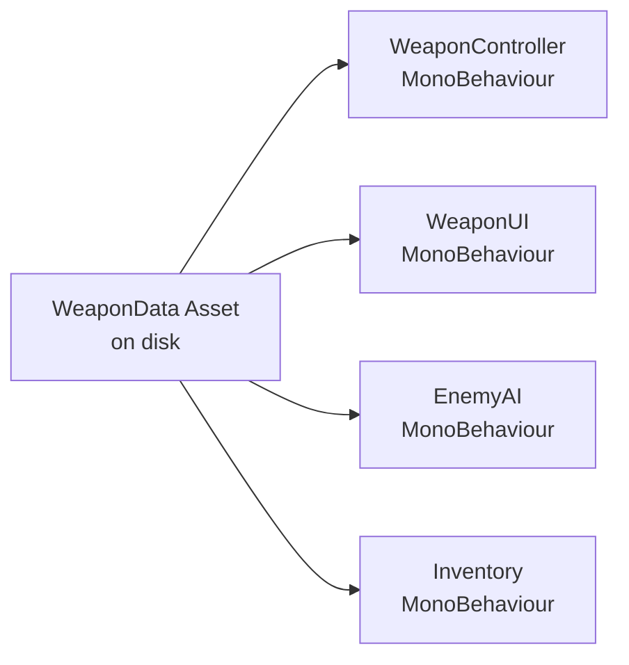

# Unity Scripting with C#

> [!abstract] TL;DR
> Unity C# scripting uses attributes to bridge the editor-code gap, ScriptableObjects for data-driven design, Coroutines for async-like behavior, and UnityEvents for decoupled communication. Mastering these patterns eliminates spaghetti code in medium-large projects.

## Unity Attributes

Attributes in C# are metadata annotations placed in square brackets above declarations. Unity defines a rich set of attributes that modify how fields, classes, and methods behave in the editor and at runtime. They are the primary tool for making your code designer-friendly without requiring a custom editor GUI.

The most important attributes to know:

```csharp
using UnityEngine;

[RequireComponent(typeof(AudioSource))]  // Auto-adds AudioSource when this script is added
[DisallowMultipleComponent]              // Prevents adding this script twice to one GameObject
public class WeaponConfig : MonoBehaviour {

    [Header("=== Stats ===")]            // Section header in Inspector
    [SerializeField] private float damage = 10f;          // Expose private field to Inspector
    [Range(0.1f, 5f)] public float fireRate = 1f;         // Slider with min/max bounds
    [Tooltip("Spread angle in degrees")] public float spread = 5f; // Hover tooltip in Inspector
    [Min(0f)] public float reloadTime = 1.5f;             // Enforce minimum value

    [Header("=== References ===")]
    [SerializeField] private ParticleSystem muzzleFlash;
    [SerializeField] private AudioClip shootSound;

    [Space(10)]                          // Vertical spacing in Inspector
    [Multiline(3)]                       // Multi-line text field
    public string weaponDescription;

    [HideInInspector] public bool isReloading; // Public but hidden in Inspector

    // [NonSerialized] prevents a public field from appearing AND being saved
    [System.NonSerialized] public float runtimeCooldown;
}
```

The `[SerializeField]` attribute is particularly important: it lets you keep fields `private` (good encapsulation) while still exposing them to the Inspector and Unity's serialization system so their values persist across Play mode sessions and prefab instantiation.

`[CreateAssetMenu]` is covered in the ScriptableObject section below, but it is another critical attribute that adds an entry to the Assets → Create menu in the Project browser.

## GetComponent and Caching

`GetComponent<T>()` is one of Unity's most frequently called APIs, yet it is often misused. Internally, it searches the component list of a GameObject by type. While fast for a single call, calling it every frame for dozens of objects creates measurable overhead. The solution is simple: cache component references in `Awake`.

```csharp
public class CharacterController3D : MonoBehaviour {
    // Cached references — assigned once, used many times
    private Rigidbody rb;
    private Animator anim;
    private CapsuleCollider col;
    private AudioSource audioSource;

    void Awake() {
        // GetComponent on self
        rb          = GetComponent<Rigidbody>();
        anim        = GetComponent<Animator>();
        col         = GetComponent<CapsuleCollider>();

        // TryGetComponent: non-allocating, safe null check
        if (TryGetComponent<AudioSource>(out audioSource)) {
            audioSource.playOnAwake = false;
        }

        // GetComponentInChildren: search self and children
        var childRenderer = GetComponentInChildren<SkinnedMeshRenderer>();

        // GetComponentInParent: search self and ancestors
        var parentHealth = GetComponentInParent<Health>();

        // GetComponents: all components of a type
        Collider[] allColliders = GetComponents<Collider>();
    }

    void Update() {
        // These are now just field accesses — essentially free
        anim.SetFloat("Speed", rb.linearVelocity.magnitude);
    }
}
```

`TryGetComponent<T>` is preferred over `GetComponent<T>` when the component might not exist, because it does not allocate a temporary object on a miss (unlike the null-returning overload of GetComponent in older Unity versions).

## Coroutines

Coroutines let you write time-based or condition-based logic that spans multiple frames without blocking. They use C#'s `IEnumerator` / `yield` mechanism. Unity resumes a Coroutine at the `yield` point on the appropriate frame or moment.

```csharp
public class Enemy : MonoBehaviour {
    private Renderer rend;
    private Color originalColor;

    void Awake() {
        rend = GetComponent<Renderer>();
        originalColor = rend.material.color;
    }

    // Coroutine: blink red when hit
    IEnumerator DamageBlink(int blinkCount = 3) {
        for (int i = 0; i < blinkCount; i++) {
            rend.material.color = Color.red;
            yield return new WaitForSeconds(0.07f);     // Wait 70ms real time
            rend.material.color = originalColor;
            yield return new WaitForSeconds(0.07f);
        }
    }

    // Wait for end of current frame (useful for reading latest physics state)
    IEnumerator WaitOneFrame() {
        yield return new WaitForEndOfFrame();
        Debug.Log("This runs after all rendering this frame");
    }

    // Wait until condition is true (checked every frame)
    IEnumerator WaitUntilGrounded() {
        yield return new WaitUntil(() => isGrounded);
        Debug.Log("Player is grounded again");
    }

    // WaitForFixedUpdate: resume after the next FixedUpdate
    IEnumerator SmoothPhysicsApply() {
        yield return new WaitForFixedUpdate();
        rb.AddForce(Vector3.up * 500f, ForceMode.Impulse);
    }

    // Starting and stopping
    public void TakeDamage(float amount) {
        hp -= amount;
        StartCoroutine(DamageBlink(3));
    }

    public void CancelBlink() {
        StopCoroutine(nameof(DamageBlink));     // Stop by name
        StopAllCoroutines();                     // Stop all on this MonoBehaviour
        rend.material.color = originalColor;    // Restore state manually
    }
}
```

Important: Coroutines are tied to their MonoBehaviour. If the GameObject is **disabled** (`SetActive(false)`) or the MonoBehaviour is disabled, all coroutines on it are silently stopped. If the GameObject is **destroyed**, coroutines also stop. If you need time-based logic independent of object lifetime, consider a Coroutine runner singleton or Unity's newer `async/await` with `UniTask`.

## ScriptableObject

ScriptableObjects are data containers that live as `.asset` files in your Project — they are not components attached to GameObjects, and they persist outside of any scene. This makes them ideal for configuration data, item databases, AI behavior definitions, and game settings.

```csharp
// Define the ScriptableObject type
[CreateAssetMenu(fileName = "NewWeapon", menuName = "Game/Weapon Data", order = 1)]
public class WeaponData : ScriptableObject {
    [Header("Identity")]
    public string weaponName;
    [Multiline] public string description;

    [Header("Combat Stats")]
    [Min(0)] public float damage        = 25f;
    [Min(0)] public float range         = 30f;
    [Range(0.05f, 10f)] public float fireRate = 2f;
    [Min(0)] public int   magazineSize  = 30;
    [Min(0)] public float reloadTime    = 2f;

    [Header("Assets")]
    public GameObject prefab;
    public Sprite     icon;
    public AudioClip  shootSound;
    public AudioClip  reloadSound;
    public ParticleSystem muzzleFlashEffect;
}
```

```csharp
// Consuming the ScriptableObject
public class WeaponController : MonoBehaviour {
    [SerializeField] private WeaponData weaponData; // Drag asset into Inspector

    private int currentAmmo;
    private float nextFireTime;

    void Start() => currentAmmo = weaponData.magazineSize;

    public void TryShoot() {
        if (Time.time < nextFireTime || currentAmmo <= 0) return;

        nextFireTime = Time.time + (1f / weaponData.fireRate);
        currentAmmo--;

        Debug.Log($"Fired {weaponData.weaponName}: {weaponData.damage} damage | {currentAmmo}/{weaponData.magazineSize}");
        // Spawn effect, play sound, etc.
    }
}
```

**ScriptableObject data flow:**



Multiple MonoBehaviours across multiple scenes reference the same asset. Change the `damage` value in the asset and it propagates everywhere instantly. ScriptableObjects also naturally prevent the "magic number scattered everywhere" problem — all tuning values live in one place.

A common advanced pattern is the **ScriptableObject Event** — a ScriptableObject that represents a game event. Scripts subscribe to it via a UnityEvent list it maintains, and other scripts raise it. This decouples sender and receiver without a Service Locator or Singleton.

## UnityEvent for Decoupled Communication

A `UnityEvent` is a serializable event that you wire up in the Inspector — no code needed on the subscriber side. It prevents the "everything knows about everything" dependency problem that arises when scripts call each other directly.

```csharp
using UnityEngine;
using UnityEngine.Events;

public class Health : MonoBehaviour {
    [SerializeField] private float maxHP = 100f;
    private float currentHP;

    // These appear in Inspector — designers can wire any response
    [Header("Events")]
    [SerializeField] private UnityEvent           onDeath;
    [SerializeField] private UnityEvent<float>    onDamageTaken;   // passes damage amount
    [SerializeField] private UnityEvent<float>    onHPChanged;     // passes new HP ratio (0-1)
    [SerializeField] private UnityEvent           onFullHeal;

    void Start() => currentHP = maxHP;

    public void TakeDamage(float amount) {
        if (currentHP <= 0) return;

        currentHP = Mathf.Max(0, currentHP - amount);
        onDamageTaken.Invoke(amount);
        onHPChanged.Invoke(currentHP / maxHP);

        if (currentHP <= 0) {
            onDeath.Invoke();
        }
    }

    public void Heal(float amount) {
        bool wasInjured = currentHP < maxHP;
        currentHP = Mathf.Min(maxHP, currentHP + amount);
        onHPChanged.Invoke(currentHP / maxHP);
        if (wasInjured && Mathf.Approximately(currentHP, maxHP)) onFullHeal.Invoke();
    }
}
```

In the Inspector, `onDeath` can be wired to: `Animator.SetTrigger("Die")`, `AudioSource.Play()`, `ParticleSystem.Play()`, `ScoreManager.AddKillScore()` — all without `Health.cs` importing or knowing any of those types. This is the core advantage: **Health only knows about health**. The response logic is defined in the scene by a designer.

For runtime subscriptions via code (not Inspector), use `AddListener` and always remove it in `OnDisable` or `OnDestroy`:

```csharp
[SerializeField] private Health playerHealth;
void OnEnable()  => playerHealth.onDeath.AddListener(OnPlayerDied);
void OnDisable() => playerHealth.onDeath.RemoveListener(OnPlayerDied);
void OnPlayerDied() => GameManager.Instance.TriggerGameOver();
```

## Singletons and PlayerPrefs

The Singleton pattern provides a globally accessible instance of a MonoBehaviour manager. It's convenient but should be used sparingly — overuse creates hidden dependencies that are painful to test and refactor.

```csharp
public class GameManager : MonoBehaviour {
    public static GameManager Instance { get; private set; }

    [Header("Game State")]
    public int  score  = 0;
    public int  lives  = 3;
    public bool isPaused = false;

    void Awake() {
        // Prevent duplicate instances when scene reloads
        if (Instance != null && Instance != this) {
            Destroy(gameObject);
            return;
        }
        Instance = this;
        DontDestroyOnLoad(gameObject); // Persist across scene loads
    }

    public void AddScore(int points) {
        score += points;
        PlayerPrefs.SetInt("HighScore", Mathf.Max(score, PlayerPrefs.GetInt("HighScore", 0)));
        PlayerPrefs.Save(); // Flush to disk (call sparingly, not every frame)
    }
}
```

**PlayerPrefs** is Unity's built-in simple key-value store backed by the OS registry (Windows) or `plist` (macOS/iOS):

```csharp
// Writing
PlayerPrefs.SetInt("HighScore", 9999);
PlayerPrefs.SetFloat("MasterVolume", 0.75f);
PlayerPrefs.SetString("PlayerName", "Karan");
PlayerPrefs.Save(); // Explicit flush; call after important saves

// Reading (second arg is default if key not found)
int   highScore = PlayerPrefs.GetInt("HighScore", 0);
float volume    = PlayerPrefs.GetFloat("MasterVolume", 1.0f);
string name     = PlayerPrefs.GetString("PlayerName", "Player");

// Checking and deleting
bool hasSave = PlayerPrefs.HasKey("HighScore");
PlayerPrefs.DeleteKey("HighScore");
PlayerPrefs.DeleteAll(); // Wipes all stored data
```

For anything beyond simple primitives (inventory, level state, progression), use JSON serialization with `JsonUtility` or a third-party solution like Newtonsoft.Json, writing to `Application.persistentDataPath`.

## Common Pitfalls

- **Singletons everywhere** — Using a Singleton for every manager creates a web of hidden global dependencies. Prefer dependency injection (pass references through constructors or serialized fields) or ScriptableObject-based event architecture for better testability.
- **Coroutines silently stopping on disable** — When a GameObject is deactivated, all its coroutines terminate without warning. If you have a timed sequence that must complete regardless of object state, handle the disable case explicitly or use a separate runner object.
- **Modifying ScriptableObject instances at runtime in the editor** — Calling `weaponData.damage = 50f` at runtime modifies the actual asset file in the editor (not in builds). Wrap runtime modifications with `Instantiate(weaponData)` to get a per-instance copy if needed.
- **Not unsubscribing from events** — If a subscriber object is destroyed but the event publisher still holds a reference to it via `AddListener`, the garbage collector cannot collect the subscriber. Always pair `AddListener` in `OnEnable` with `RemoveListener` in `OnDisable`.
- **Using the wrong attribute** — `[HideInInspector]` hides a public field but it is still serialized. `[System.NonSerialized]` makes a public field neither visible nor serialized. Use the right one based on your intent.

## Review Questions

1. Why use `ScriptableObject` instead of a static class for game configuration data?
2. What happens to a running Coroutine if the GameObject is disabled?
3. How does `UnityEvent` enable decoupled architecture compared to direct method calls?
4. What does `[SerializeField]` do? Why is it preferable to making fields public?
5. When would you use `WaitForFixedUpdate` in a Coroutine instead of `WaitForSeconds(0.02f)`?

## Related Concepts

- [[_MOC_Game_Development_Master|↑ Game Development MOC]]

#GameDev
