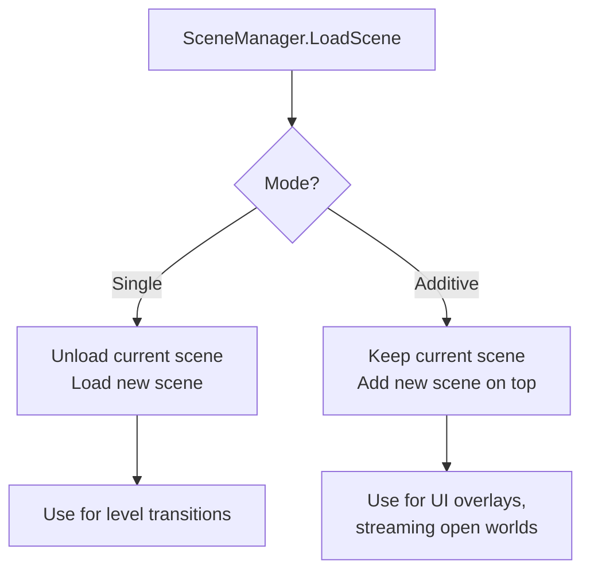

# Unity UI and Scene Management

> [!abstract] TL;DR
> Unity offers two UI systems: the legacy Canvas system (uGUI) for game UIs and the newer UI Toolkit for editor tools and modern game UIs. Scene management handles level loading, additive scenes for streaming, and DontDestroyOnLoad for persistent managers.

## Canvas System (uGUI)

The Canvas is Unity's legacy (but still dominant in 2026) UI rendering system. Every UI element must be a child of a Canvas. The Canvas has three render modes:

- **Screen Space — Overlay**: Canvas renders on top of everything, always facing the camera, at pixel-perfect screen coordinates. Best for HUDs, menus, and any UI that should always be visible. Zero relationship to world position.
- **Screen Space — Camera**: Canvas is drawn at a configurable distance from a specified camera, projected in 3D. Allows UI to be partially occluded or have perspective. Good for world-positioned name tags above characters' heads that still face the camera.
- **World Space**: Canvas is an ordinary GameObject in 3D space. It can be behind walls, rotated, scaled. Used for in-game computer screens, books, world-space health bars attached to enemies.

The **Canvas Scaler** component is critical for multi-resolution support. Set the UI Scale Mode to **Scale with Screen Size**, enter your reference resolution (e.g., 1920×1080), and set the Match slider to balance between width and height adaptation. Without this, your UI will be enormous on a 4K display and tiny on a phone.

**Key uGUI components:**

| Component | Purpose |
|---|---|
| `Image` | Renders a sprite. Supports Simple, Sliced (9-slice), Tiled, Filled modes. |
| `RawImage` | Renders a Texture2D directly (render textures, webcam feeds). |
| `TextMeshPro - Text (UI)` | High-quality distance field text rendering. Always prefer over legacy Text. |
| `Button` | Clickable element with Normal/Highlighted/Pressed/Disabled color states. |
| `Toggle` | Boolean checkbox with group support for radio buttons. |
| `Slider` | Float value input with min/max range. |
| `ScrollRect` | Scrollable container for long lists. Combine with Content Size Fitter. |
| `CanvasGroup` | Controls alpha, raycast blocking, and interactability for an entire subtree. |
| `LayoutGroup` | Horizontal/Vertical/Grid layout — auto-arranges children. |

## Rect Transform and Anchors

Every UI element uses a `RectTransform` instead of a regular `Transform`. The anchor system defines how the element repositions or stretches when the parent (or screen) size changes.

Anchors are defined by two normalized coordinates (0–1) `anchorMin` and `anchorMax`:
- **Same point** (e.g., both at 0.5, 0.5): element has a fixed size, repositions as screen changes. Anchor to center-bottom for a health bar that stays above the screen bottom.
- **Different points** (e.g., min 0,0 and max 1,0): element stretches horizontally with the screen. Use for full-width banners.
- **All four corners** (min 0,0 and max 1,1): element stretches to fill the entire parent.

```csharp
public class HealthBarController : MonoBehaviour {
    [SerializeField] private Image healthFillImage;      // Filled type Image
    [SerializeField] private RectTransform healthBarRect;

    // Option 1: Image Fill Amount (simplest for bar-style progress)
    public void SetHealth(float current, float max) {
        healthFillImage.fillAmount = Mathf.Clamp01(current / max);
    }

    // Option 2: Anchor-based scaling (anchored to left edge, grows right)
    public void SetHealthByAnchor(float current, float max) {
        float ratio = Mathf.Clamp01(current / max);
        healthBarRect.anchorMax = new Vector2(ratio, healthBarRect.anchorMax.y);
    }

    // Smooth bar with Lerp
    private float displayedHP;
    void Update() {
        displayedHP = Mathf.Lerp(displayedHP, targetHP, Time.deltaTime * 8f);
        healthFillImage.fillAmount = displayedHP / maxHP;
    }
}
```

## UI Events and TextMeshPro

```csharp
using UnityEngine;
using UnityEngine.UI;
using TMPro;
using UnityEngine.EventSystems;

public class MainMenuUI : MonoBehaviour, IPointerEnterHandler, IPointerExitHandler {
    [Header("Buttons")]
    [SerializeField] private Button startButton;
    [SerializeField] private Button settingsButton;
    [SerializeField] private Button quitButton;

    [Header("Text")]
    [SerializeField] private TMP_Text titleText;
    [SerializeField] private TMP_Text versionText;
    [SerializeField] private TMP_InputField playerNameInput;

    [Header("Controls")]
    [SerializeField] private Slider   masterVolumeSlider;
    [SerializeField] private Toggle   fullscreenToggle;

    void Start() {
        // Wire buttons via code (or use Inspector — both work)
        startButton.onClick.AddListener(OnStartClicked);
        settingsButton.onClick.AddListener(() => panelManager.ShowPanel("Settings"));
        quitButton.onClick.AddListener(Application.Quit);

        // Sliders and toggles
        masterVolumeSlider.onValueChanged.AddListener(OnVolumeChanged);
        fullscreenToggle.onValueChanged.AddListener(isOn => Screen.fullScreen = isOn);

        // Input field
        playerNameInput.onEndEdit.AddListener(OnNameEntered);

        // Rich text with TextMeshPro
        titleText.text = "<color=#FFD700><b>MY GAME</b></color>";
        versionText.text = $"v{Application.version}";
    }

    void OnStartClicked() {
        string name = playerNameInput.text.Trim();
        if (string.IsNullOrEmpty(name)) name = "Player";
        PlayerPrefs.SetString("PlayerName", name);
        SceneManager.LoadScene("GameScene");
    }

    void OnVolumeChanged(float value) {
        AudioListener.volume = value;
        PlayerPrefs.SetFloat("MasterVolume", value);
    }

    void OnNameEntered(string value) => Debug.Log($"Name set to: {value}");

    // Implementing EventSystem interfaces for hover effects
    public void OnPointerEnter(PointerEventData eventData) => GetComponent<Image>().color = hoverColor;
    public void OnPointerExit(PointerEventData eventData)  => GetComponent<Image>().color = normalColor;
}
```

`TMP_Text` supports rich text tags inline: `<b>bold</b>`, `<i>italic</i>`, `<color=#RRGGBBAA>`, `<size=24>`, `<sprite=0>` (inline icons from a sprite atlas), `<link="url">`. This is vastly more powerful than legacy `Text` and renders at any resolution without blurring.

## Scene Management

Unity organizes content into scenes. A scene contains a set of GameObjects and their component values. Scene management controls loading, unloading, and transitioning between scenes.

**Scene load modes:**



```csharp
using UnityEngine;
using UnityEngine.SceneManagement;

public class SceneController : MonoBehaviour {
    // Simple synchronous load (brief hitch — only ok for tiny scenes or loading screens)
    public void LoadLevel(string sceneName) {
        SceneManager.LoadScene(sceneName);
    }

    // Async load with progress feedback — production standard
    public IEnumerator LoadSceneAsync(string sceneName) {
        // Start loading in background (scene not yet activated)
        AsyncOperation operation = SceneManager.LoadSceneAsync(sceneName);
        operation.allowSceneActivation = false;  // Hold at 90% until we're ready

        // Show loading screen / progress
        loadingScreen.SetActive(true);

        while (operation.progress < 0.9f) {
            // progress goes 0.0 → 0.9 then stops (0.9 = fully loaded, waiting for activation)
            float displayProgress = operation.progress / 0.9f;
            progressBar.fillAmount = displayProgress;
            loadingText.text = $"Loading... {Mathf.RoundToInt(displayProgress * 100)}%";
            yield return null;
        }

        // Optional: wait for player input or minimum display time
        progressBar.fillAmount = 1f;
        yield return new WaitForSeconds(0.5f);

        // Fade out transition
        yield return StartCoroutine(FadeOut(0.5f));

        // Activate the loaded scene
        operation.allowSceneActivation = true;
    }

    // Additive scene loading — for persistent systems or streaming
    public void LoadZoneAdditive(string zoneName) {
        // Zone loads alongside current scene — both active simultaneously
        SceneManager.LoadSceneAsync(zoneName, LoadSceneMode.Additive);
    }

    // Unload an additively loaded scene when player leaves the zone
    public void UnloadZone(string zoneName) {
        SceneManager.UnloadSceneAsync(zoneName);
    }

    // Get/set the active scene (determines which scene new objects are created in)
    public void SetActiveScene(string sceneName) {
        Scene scene = SceneManager.GetSceneByName(sceneName);
        SceneManager.SetActiveScene(scene);
    }

    IEnumerator FadeOut(float duration) {
        float elapsed = 0;
        while (elapsed < duration) {
            elapsed += Time.deltaTime;
            fadePanel.color = new Color(0, 0, 0, elapsed / duration);
            yield return null;
        }
    }
}
```

## DontDestroyOnLoad and Persistent Objects

By default, all GameObjects in a scene are destroyed when a new scene loads. Managers that need to persist across scenes (audio manager, game state, player inventory) must call `DontDestroyOnLoad`.

```csharp
public class AudioManager : MonoBehaviour {
    public static AudioManager Instance { get; private set; }

    [Header("Music")]
    [SerializeField] private AudioSource musicSource;
    [SerializeField] private AudioClip[] trackList;

    [Header("SFX")]
    [SerializeField] private AudioSource sfxSource;

    void Awake() {
        // Singleton pattern with duplicate prevention
        if (Instance != null && Instance != this) {
            // Scene was reloaded — destroy the new duplicate, keep original
            Destroy(gameObject);
            return;
        }
        Instance = this;
        DontDestroyOnLoad(gameObject); // Move to "DontDestroyOnLoad" pseudo-scene

        // Subscribe to scene load events for adaptive music
        SceneManager.sceneLoaded += OnSceneLoaded;
    }

    void OnDestroy() {
        SceneManager.sceneLoaded -= OnSceneLoaded; // Clean up subscription
    }

    void OnSceneLoaded(Scene scene, LoadSceneMode mode) {
        // Change music track based on which scene loaded
        switch (scene.name) {
            case "MainMenu": PlayTrack(0); break;
            case "Level_01": PlayTrack(1); break;
            case "BossFight": PlayTrack(3); break;
        }
    }

    public void PlaySFX(AudioClip clip, float volume = 1f) {
        sfxSource.PlayOneShot(clip, volume);
    }

    private void PlayTrack(int index) {
        if (index >= trackList.Length) return;
        musicSource.clip = trackList[index];
        musicSource.Play();
    }
}
```

The `DontDestroyOnLoad` objects live in a special "DontDestroyOnLoad" pseudo-scene visible in the Hierarchy at runtime. When you load a scene, these objects survive. When you exit the application, they are finally destroyed.

## UI State Machine Pattern

Managing multiple UI panels (main menu, HUD, pause menu, game over screen) is cleanly handled with a state machine. Each state activates exactly one panel set, and the state machine handles transitions.

```csharp
public enum UIState { None, MainMenu, Playing, Paused, Settings, GameOver, Victory }

public class UIManager : MonoBehaviour {
    public static UIManager Instance { get; private set; }

    [Header("Panels")]
    [SerializeField] private GameObject mainMenuPanel;
    [SerializeField] private GameObject hudPanel;
    [SerializeField] private GameObject pausePanel;
    [SerializeField] private GameObject settingsPanel;
    [SerializeField] private GameObject gameOverPanel;
    [SerializeField] private GameObject victoryPanel;

    [Header("HUD Elements")]
    [SerializeField] private TMP_Text   scoreText;
    [SerializeField] private TMP_Text   timerText;
    [SerializeField] private Image      healthBar;

    private UIState currentState = UIState.None;

    void Awake() {
        if (Instance != null) { Destroy(gameObject); return; }
        Instance = this;
        DontDestroyOnLoad(gameObject);
    }

    public void SetState(UIState newState) {
        if (currentState == newState) return;

        // Deactivate all panels first
        mainMenuPanel.SetActive(false);
        hudPanel.SetActive(false);
        pausePanel.SetActive(false);
        settingsPanel.SetActive(false);
        gameOverPanel.SetActive(false);
        victoryPanel.SetActive(false);

        // Activate the relevant panel
        switch (newState) {
            case UIState.MainMenu: mainMenuPanel.SetActive(true); break;
            case UIState.Playing:  hudPanel.SetActive(true);      break;
            case UIState.Paused:
                hudPanel.SetActive(true);    // Keep HUD visible behind pause
                pausePanel.SetActive(true);
                break;
            case UIState.Settings: settingsPanel.SetActive(true); break;
            case UIState.GameOver: gameOverPanel.SetActive(true);  break;
            case UIState.Victory:  victoryPanel.SetActive(true);   break;
        }

        // Manage time scale for pause
        Time.timeScale = (newState == UIState.Paused) ? 0f : 1f;
        currentState = newState;
    }

    // Called by GameManager when game events occur
    public void OnGameStart()  => SetState(UIState.Playing);
    public void OnGamePause()  => SetState(UIState.Paused);
    public void OnGameResume() => SetState(UIState.Playing);
    public void OnGameOver()   => SetState(UIState.GameOver);

    public void UpdateScore(int score)     => scoreText.text = $"{score:N0}";
    public void UpdateHealth(float ratio)  => healthBar.fillAmount = ratio;
}
```

## UI Toolkit

UI Toolkit is Unity's modern, web-inspired UI framework. UXML (like HTML) defines structure, USS (like CSS) defines styling, and C# queries and modifies elements at runtime. It is currently recommended for editor tools and complex data-driven UIs; uGUI remains common for game UIs.

```csharp
using UnityEngine;
using UnityEngine.UIElements;

public class InventoryUI : MonoBehaviour {
    private UIDocument uiDocument;
    private VisualElement root;

    void OnEnable() {
        uiDocument = GetComponent<UIDocument>();
        root = uiDocument.rootVisualElement;

        // Query elements by name (like getElementById)
        Button closeBtn    = root.Q<Button>("close-button");
        Label  titleLabel  = root.Q<Label>("inventory-title");
        ScrollView itemList = root.Q<ScrollView>("item-list");

        // Query by class (like getElementsByClassName)
        var allSlots = root.Query<VisualElement>(className: "inventory-slot").ToList();

        // Wire events
        closeBtn.clicked += () => SetVisible(false);
        titleLabel.text = "Inventory";

        // Dynamically build UI from data
        foreach (var item in playerInventory.items) {
            var slot = new VisualElement();
            slot.AddToClassList("inventory-slot");
            slot.style.backgroundImage = new StyleBackground(item.icon);
            slot.RegisterCallback<ClickEvent>(evt => OnSlotClicked(item));
            itemList.Add(slot);
        }
    }

    void SetVisible(bool visible) {
        root.style.display = visible ? DisplayStyle.Flex : DisplayStyle.None;
    }
}
```

USS example (stored as `.uss` file, referenced by UXML):

```css
.inventory-slot {
    width: 64px;
    height: 64px;
    border-width: 2px;
    border-color: rgba(255, 255, 255, 0.3);
    margin: 4px;
}
.inventory-slot:hover {
    border-color: yellow;
    scale: 1.05;
}
```

## Common Pitfalls

- **Not using Canvas Scaler** — Without "Scale with Screen Size", your UI designed at 1920×1080 will render at tiny pixel sizes on 4K screens and overflow on 720p. Always add and configure Canvas Scaler.
- **Using legacy Text instead of TextMeshPro** — Legacy Text uses bitmap fonts that become blurry when scaled. TextMeshPro uses signed distance field rendering and looks sharp at any size. `using TMPro;` and replace `Text` with `TMP_Text`.
- **LoadScene in same frame as gameplay code** — `SceneManager.LoadScene` destroys the current scene immediately. Any code that runs after it in the same frame that references scene objects will cause null reference exceptions. Use async load or ensure LoadScene is the final call.
- **Duplicate persistent managers from DontDestroyOnLoad** — If you don't check for an existing Instance in Awake and destroy the duplicate, reloading a scene that contains the manager prefab creates a second instance. The check-and-destroy pattern in the Singleton examples above prevents this.
- **Setting Time.timeScale to 0 and forgetting to reset** — When you pause with `Time.timeScale = 0`, all Update calls still run but `Time.deltaTime` returns 0. `WaitForSeconds` coroutines are paused. Always restore `Time.timeScale = 1` on resume, and use `Time.unscaledDeltaTime` for UI animations that should run during pause (fade panels, etc.).

## Review Questions

1. What is the difference between Screen Space Overlay and World Space canvas render modes? Give a real example use case for each.
2. Why use `LoadSceneAsync` with `allowSceneActivation = false` for scene transitions?
3. How does the UI State Machine pattern simplify managing multiple game screens?
4. What problem does `DontDestroyOnLoad` solve, and what bug can it cause if you forget the duplicate check?
5. What is the key advantage of UI Toolkit over uGUI for complex, data-driven UIs?

## Related Concepts

- [[_MOC_Game_Development_Master|↑ Game Development MOC]]

#GameDev
