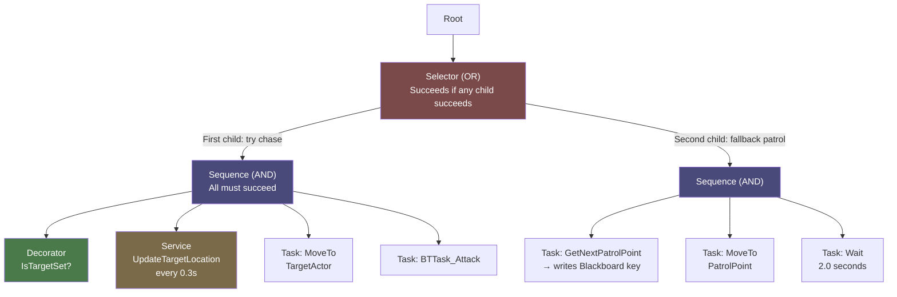

# Unreal Engine AI, Animation, and Polish

> [!abstract] TL;DR
> UE5's AI toolkit combines Behavior Trees, Blackboards, and NavMesh for believable NPC behavior. Animation Blueprints with state machines and blend spaces drive character motion. Niagara, post-process volumes, and MetaSounds handle visual and audio polish that transforms a game from prototype to product.

## Navigation Mesh

The **Navigation Mesh (NavMesh)** is a simplified polygon representation of walkable surfaces that the AI pathfinding system uses. Without a NavMesh, AI characters cannot navigate the level — they simply stop or teleport.

In the editor, add a **Nav Mesh Bounds Volume** from Place Actors → Volumes and scale it to cover your entire playable level. Press **P** in the Viewport to visualize the generated NavMesh (green areas are walkable). Build the NavMesh: Build → Build Paths. The generation accounts for the Character's capsule radius and step height automatically — configure these in Project Settings → Navigation Mesh.

For levels that change at runtime (exploding walls, destructible geometry), the NavMesh can rebake dynamically. Set `ProjectSettings → Navigation → Runtime Generation = Dynamic`. NavModifierVolumes can mark regions as non-walkable (lava pit, restricted zone) without destroying geometry.

```cpp
// SimpleMoveToActor — quickest approach, uses navigation system
#include "Blueprint/AIBlueprintHelperLibrary.h"

void AEnemyController::ChasePlayer(AActor* Target)
{
    UAIBlueprintHelperLibrary::SimpleMoveToActor(this, Target);
}

// MoveToActor via AAIController — more control over acceptance radius and result
#include "AIController.h"
#include "Navigation/PathFollowingComponent.h"

void AEnemyController::MoveTo(AActor* Target)
{
    FAIMoveRequest MoveRequest;
    MoveRequest.SetGoalActor(Target);
    MoveRequest.SetAcceptanceRadius(80.f);      // stop 80cm from target
    MoveRequest.SetUsePathfinding(true);
    MoveRequest.SetReachTestIncludesGoalRadius(true);

    FNavPathSharedPtr NavPath;
    MoveTo(MoveRequest, &NavPath);
}

// Check if a location is reachable before committing
#include "NavigationSystem.h"

bool AEnemyController::IsLocationReachable(FVector TargetLocation) const
{
    UNavigationSystemV1* NavSys =
        UNavigationSystemV1::GetCurrent(GetWorld());
    if (!NavSys) return false;

    FNavLocation ProjectedLoc;
    return NavSys->ProjectPointToNavigation(TargetLocation, ProjectedLoc,
        FVector(50.f, 50.f, 100.f)); // query extent
}
```

## Behavior Trees

The **Behavior Tree (BT)** is a hierarchical task system that encodes NPC decision-making as a tree of nodes. It replaces ad-hoc state machines and finite automata for complex AI and is used in virtually every commercial UE game.

Execution begins at the **Root** and traverses left-to-right, top-to-bottom. The tree is evaluated every tick (default tick rate is configurable per BT asset).

**Node types**:

- **Selector** (blue): tries children left-to-right. Succeeds as soon as ONE child succeeds. Fails only if ALL children fail. Logical OR. Use for fallback chains: "try to attack, if that fails, try to flee, if that fails, stand still."
- **Sequence** (grey): runs children left-to-right. Fails as soon as ONE child fails. Succeeds only if ALL children succeed. Logical AND. Use for multi-step plans: "move to cover AND crouch AND wait."
- **Task** (green): leaf node with concrete behavior (MoveTo, Wait, PlayAnimation, custom BTTask). Returns Succeeded, Failed, or InProgress.
- **Decorator** (white banner on node): precondition that gates whether a node can be entered. "BlackboardValueIsSet(TargetActor)" blocks the attack sequence if no target is known. "IsTargetInRange(200cm)" enables melee attack only in close range.
- **Service** (banner on Composite): runs on a regular interval while its parent composite is active. Use for polling (update target location every 0.25s, check ammo every 1s). Services run independently of task execution.

**Blackboard**: a key-value data store owned by the AI Controller. The Behavior Tree reads and writes Blackboard keys. Keys can be Object, Class, Float, Integer, Boolean, Vector, Rotator, Name, String. All tasks, decorators, and services share the same Blackboard, enabling communication without direct coupling.

**Common BT pattern — patrol and chase**:
```
Root
└── Selector
    ├── Sequence [Chase — succeeds if target is visible and we can reach it]
    │   ├── [Decorator: IsTargetSet]
    │   ├── [Service: UpdateTargetLocation every 0.3s]
    │   ├── Task: MoveTo(TargetActor)
    │   └── Task: BTTask_Attack
    └── Sequence [Patrol — fallback when no target]
        ├── Task: BTTask_GetNextPatrolPoint → writes PatrolPoint key
        ├── Task: MoveTo(PatrolPoint)
        └── Task: Wait(2.0s)
```

## Custom BT Task in C++

While Blueprint BT Tasks work for simple behaviors, C++ Tasks are required for performance-critical AI (many enemies) or complex logic.

```cpp
// BTTask_Attack.h
#pragma once
#include "CoreMinimal.h"
#include "BehaviorTree/BTTaskNode.h"
#include "BTTask_Attack.generated.h"

UCLASS()
class MYGAME_API UBTTask_Attack : public UBTTaskNode
{
    GENERATED_BODY()
public:
    UBTTask_Attack();

    // Blackboard key selector — configured in BT editor, allows designers to choose key
    UPROPERTY(EditAnywhere, Category="Attack")
    FBlackboardKeySelector TargetActorKey;

    UPROPERTY(EditAnywhere, Category="Attack")
    float AttackRange = 150.f;

protected:
    // Called when the task is activated
    virtual EBTNodeResult::Type ExecuteTask(
        UBehaviorTreeComponent& OwnerComp, uint8* NodeMemory) override;

    // Called when the task needs to be aborted mid-execution
    virtual EBTNodeResult::Type AbortTask(
        UBehaviorTreeComponent& OwnerComp, uint8* NodeMemory) override;
};

// BTTask_Attack.cpp
#include "BTTask_Attack.h"
#include "BehaviorTree/BlackboardComponent.h"
#include "AIController.h"
#include "AEnemy.h"

UBTTask_Attack::UBTTask_Attack()
{
    NodeName = TEXT("Attack Target");
    // bNotifyTick = true;  // Uncomment if this task spans multiple frames
}

EBTNodeResult::Type UBTTask_Attack::ExecuteTask(
    UBehaviorTreeComponent& OwnerComp, uint8* NodeMemory)
{
    AAIController* AIC = OwnerComp.GetAIOwner();
    if (!AIC) return EBTNodeResult::Failed;

    AEnemy* Enemy = Cast<AEnemy>(AIC->GetPawn());
    if (!Enemy) return EBTNodeResult::Failed;

    // Read the target from the Blackboard
    UBlackboardComponent* BB = OwnerComp.GetBlackboardComponent();
    AActor* Target = Cast<AActor>(BB->GetValueAsObject(TargetActorKey.SelectedKeyName));
    if (!IsValid(Target)) return EBTNodeResult::Failed;

    // Check we're actually in range before attacking
    float DistToTarget = FVector::Dist(Enemy->GetActorLocation(), Target->GetActorLocation());
    if (DistToTarget > AttackRange) return EBTNodeResult::Failed;

    // Trigger the attack — AttackTarget handles animation, damage, etc.
    Enemy->AttackTarget(Target);

    // Succeeded — tree will advance to next node
    return EBTNodeResult::Succeeded;
}

EBTNodeResult::Type UBTTask_Attack::AbortTask(
    UBehaviorTreeComponent& OwnerComp, uint8* NodeMemory)
{
    // Cancel any ongoing attack state
    if (AAIController* AIC = OwnerComp.GetAIOwner())
    {
        if (AEnemy* Enemy = Cast<AEnemy>(AIC->GetPawn()))
        {
            Enemy->CancelAttack();
        }
    }
    return EBTNodeResult::Aborted;
}
```

To write to the Blackboard from C++ (e.g., in a Perception update):

```cpp
// In AAIController's OnTargetPerceptionUpdated:
void AEnemyController::OnTargetPerceptionUpdated(
    AActor* Actor, FAIStimulus Stimulus)
{
    if (Stimulus.WasSuccessfullySensed())
    {
        BlackboardComponent->SetValueAsObject(TEXT("TargetActor"), Actor);
    }
    else
    {
        BlackboardComponent->ClearValue(TEXT("TargetActor"));
    }
}
```

## Animation Blueprint

The **Animation Blueprint (ABP)** bridges the gameplay layer and the Skeletal Mesh animation system. It runs on a separate animation thread and evaluates every frame to determine the final bone transforms.

The ABP has two main graphs:

**Event Graph**: standard Blueprint logic that runs on the game thread. Use it to read gameplay variables (character speed, is in air, is attacking) and write them to the ABP's own variables. Keep this fast — no complex logic.

**AnimGraph**: a node graph that evaluates animation poses and blends them. Driven by a **State Machine** for locomotion, with **Blend Nodes** for transitions and overrides.

**State Machine** — Idle → Walk → Run → Jump → Fall. Each state plays a looping animation. Transitions are driven by variables set in the Event Graph:

```
State: Idle
    [Transition: Speed > 10] → Walk
State: Walk
    [Transition: Speed > 300] → Run
    [Transition: Speed < 5] → Idle
State: Jump
    Entry: IsInAir = true
    [Transition: !IsInAir] → Fall or Idle
```

**Blend Spaces** interpolate between multiple animations along one or two axes. BlendSpace1D(Speed) blends between Walk(150cm/s) and Run(600cm/s) at intermediate speeds. BlendSpace2D(Speed, Direction) blends between forward walk, strafe left, strafe right, and backward walk for full directional locomotion.

**Animation Montages** are non-looping animation clips that layer on top of the state machine. Use for attacks, hit reactions, death animations, and any action that should briefly override locomotion. Montages use Montage Slots (e.g., "UpperBody") to blend with lower-body locomotion.

```cpp
// Trigger an attack montage from the Character
#include "Animation/AnimInstance.h"
#include "Animation/AnimMontage.h"

void AEnemy::PlayAttackMontage()
{
    UAnimInstance* AnimInst = GetMesh()->GetAnimInstance();
    if (!AnimInst || !AttackMontage) return;

    // Montage_Play returns 0.0 if it couldn't play (no valid slot, etc.)
    float Duration = AnimInst->Montage_Play(AttackMontage, 1.0f);
    if (Duration <= 0.f)
    {
        UE_LOG(LogTemp, Warning, TEXT("AttackMontage failed to play"));
        return;
    }

    // Bind an end delegate to know when the attack finishes
    FOnMontageEnded MontageEndedDelegate;
    MontageEndedDelegate.BindUObject(this, &AEnemy::OnAttackMontageEnded);
    AnimInst->Montage_SetEndDelegate(MontageEndedDelegate, AttackMontage);
}

void AEnemy::OnAttackMontageEnded(UAnimMontage* Montage, bool bInterrupted)
{
    if (Montage == AttackMontage)
    {
        bIsAttacking = false;
        // Return to state machine control
    }
}

// Read character speed and pass to ABP from ABP's Event Graph (inside ABP):
// EventBlueprintUpdateAnimation → Get Owning Pawn → Cast to AMyCharacter
// → Get Velocity → Vector Length → Set Speed variable
// This pattern is the standard way to feed gameplay data to the ABP
```

## Niagara Particle System

**Niagara** replaced Cascade as UE5's particle system. It is data-driven, scriptable, and GPU-accelerated. Niagara is organized into three levels:

- **System**: the top-level asset placed in the level or spawned at runtime. Contains one or more Emitters.
- **Emitter**: one logical particle source (spark emitter, smoke emitter, blood splatter). Has its own spawn rate, lifetime, and modules.
- **Module**: individual behavior (Initialize Particle, Add Velocity, Drag, Color over Life, Sphere Location, Collision). Stack modules in the emitter stack — they execute in order.

**Key modules for common effects**:
- `Spawn Rate`: particles per second (continuous) or burst count (one-shot)
- `Initialize Particle`: set initial size, lifetime (0.5-2s), color
- `Sphere/Cone/Cylinder Location`: randomize spawn positions within a shape
- `Add Velocity`: initial direction and speed with randomness
- `Gravity Force`: apply downward acceleration
- `Drag`: slow down over lifetime (embers flutter to rest)
- `Scale Color by Life`: fade alpha to 0 at end of lifetime
- `Collision (Scene Query)`: particles bounce off world geometry

```cpp
// Spawn a one-shot Niagara system at world location (e.g., on bullet impact)
#include "NiagaraFunctionLibrary.h"
#include "NiagaraSystem.h"
#include "NiagaraComponent.h"

void AProjectile::OnHit(UPrimitiveComponent* HitComp, AActor* OtherActor,
    UPrimitiveComponent* OtherComp, FVector NormalImpulse, const FHitResult& Hit)
{
    if (ImpactVFX)
    {
        // SpawnSystemAtLocation — fire-and-forget one-shot effect
        UNiagaraFunctionLibrary::SpawnSystemAtLocation(
            GetWorld(),
            ImpactVFX,
            Hit.ImpactPoint,
            Hit.ImpactNormal.Rotation()  // align to surface normal
        );
    }

    // For continuous attached effects (engine exhaust, character aura):
    if (EngineFlameVFX)
    {
        UNiagaraComponent* NiagaraComp =
            UNiagaraFunctionLibrary::SpawnSystemAttached(
                EngineFlameVFX,
                GetMesh(),            // attach to mesh
                TEXT("ExhaustSocket"),// socket name
                FVector::ZeroVector,
                FRotator::ZeroRotator,
                EAttachLocation::SnapToTarget,
                true                  // auto-destroy when finished
            );

        // Set parameters at runtime (change emitter color, intensity)
        NiagaraComp->SetVariableFloat(TEXT("EmissionRate"), 200.f);
        NiagaraComp->SetVariableLinearColor(TEXT("FlameColor"),
            FLinearColor(1.f, 0.4f, 0.f, 1.f));
    }
}
```

**GPU vs CPU particles**: CPU particles support collision, UObject interactions, and per-particle Blueprint logic but max out at ~10,000 particles. GPU particles handle millions of particles but cannot interact with UObjects. Use CPU for gameplay-relevant particles (arrows that stick to walls), GPU for purely visual effects (massive fire, dust storms).

## Post-Process Volumes

Post-Process Volumes apply full-screen image effects over the camera's render output. An **unbound** volume affects the entire world. A bounded volume creates a zone of effect (entering a cave darkens the image, exiting into sunlight blooms).

Key settings available in the Details panel:

| Category | Key Settings |
|---|---|
| **Bloom** | Intensity, Threshold, Kernel Size — add glow to bright areas |
| **Depth of Field** | Focal Distance, Aperture (f-stop), Focal Region — cinematic focus blur |
| **Color Grading** | Saturation, Contrast, Gamma per shadow/midtone/highlight channel |
| **Vignette** | Intensity — darken screen edges |
| **Chromatic Aberration** | Intensity — color fringing at screen edges (trauma, hallucination effect) |
| **Motion Blur** | Amount, Max — streaking on fast movement |
| **Ambient Occlusion** | Intensity, Radius — contact shadows in crevices |
| **Lens Flare** | Intensity — light source artifact effect |

Each setting has a corresponding `bOverride_*` boolean. Settings only take effect when their override flag is true — this is a common source of confusion.

```cpp
// Modify post-process at runtime (e.g., getting hit → screen flash)
#include "Engine/PostProcessVolume.h"

void AMyCharacter::OnTakeDamage(float Amount)
{
    if (!PostProcessVolume) return;

    // Enable chromatic aberration for hit feedback
    PostProcessVolume->Settings.bOverride_SceneFringeIntensity = true;
    PostProcessVolume->Settings.SceneFringeIntensity = 5.0f;

    // Enable vignette darkening
    PostProcessVolume->Settings.bOverride_VignetteIntensity = true;
    PostProcessVolume->Settings.VignetteIntensity = 0.8f;

    // Lerp back to normal over 0.5 seconds using a timer
    FTimerHandle RestoreHandle;
    GetWorldTimerManager().SetTimer(RestoreHandle, [this]()
    {
        PostProcessVolume->Settings.SceneFringeIntensity = 0.f;
        PostProcessVolume->Settings.VignetteIntensity    = 0.4f;
    }, 0.5f, false);
}

// For smooth transitions, use a custom UMaterialParameterCollection
// and drive post-process material parameters via timeline curves
```

**Low-health effect pattern**: bind a Timeline in Blueprints or a tick-driven Lerp in C++ that drives Saturation toward 0 (desaturate to grey) and Vignette toward 1 as health decreases below 30%.

## MetaSounds

**MetaSounds** is UE5's procedural audio graph system, replacing Sound Cues. A MetaSound is a DSP program — you build the audio signal from primitives (samplers, oscillators, modulation nodes, math nodes) rather than connecting pre-made effect nodes.

Benefits over Sound Cues: parameter-driven audio at runtime (vary pitch/speed based on gameplay), procedural variation that never repeats exactly, complex audio logic without Blueprint overhead.

**Sound Class and Sound Mix** govern global volume management. Create Sound Classes (Music, SFX, UI, Voice, Ambient) and assign each sound to a class. Sound Mix allows ducking (lower SFX volume when voice plays) and master volume sliders (expose to settings menu).

**Sound Attenuation** asset controls how sound behaves with distance: inner radius (full volume), falloff distance, attenuation shape (sphere, capsule, box), attenuation function (linear, logarithmic, custom curve). Assign the Attenuation asset to any spawned sound:

```cpp
// Play a 3D sound with attenuation at an impact location
#include "Kismet/GameplayStatics.h"

void AExplosion::TriggerExplosion()
{
    // SpawnSoundAtLocation: fire-and-forget 3D sound
    UGameplayStatics::SpawnSoundAtLocation(
        this,
        ExplosionSound,          // USoundBase* or UMetaSoundSource*
        GetActorLocation(),
        FRotator::ZeroRotator,
        1.0f,                    // volume multiplier
        1.0f,                    // pitch multiplier
        0.f,                     // start time
        ExplosionAttenuation,    // USoundAttenuation* asset
        nullptr,                 // USoundConcurrency* — limit max simultaneous sounds
        nullptr                  // owning actor for occlusion
    );
}

// Attach a persistent looping sound to a component
UAudioComponent* AudioComp = UGameplayStatics::SpawnSoundAttached(
    EngineLoopSound,
    GetMesh(),
    TEXT("AudioSocket"),
    FVector::ZeroVector,
    FRotator::ZeroRotator,
    EAttachLocation::SnapToTarget,
    false    // do NOT auto-destroy — we'll stop it manually
);

// Set a MetaSound parameter at runtime (e.g., engine RPM drives pitch)
AudioComp->SetFloatParameter(TEXT("EngineRPM"), CurrentRPM);
```

**Occlusion**: sounds behind walls should be muffled. Enable "Enable Occlusion" on the Attenuation asset. UE5 performs line traces from the sound source to the listener and applies a low-pass filter when occluded. For custom occlusion logic, implement manual line traces and set a low-pass filter frequency on the AudioComponent.

## Behavior Tree Execution Diagram



## Common Pitfalls

- **Not building NavMesh**: the most common beginner mistake. AI controllers call MoveTo and nothing happens — the character stands still with no error. Always verify NavMesh coverage (press P) before testing AI. In streaming levels, ensure Nav Mesh Bounds Volume covers the loaded tile.
- **Running Behavior Tree before NavMesh is built**: in streaming levels with dynamic NavMesh, the BT may start before the nav tile is ready. Check `UNavigationSystemV1::IsNavigationBeingBuilt(GetWorld())` before running the BT, or use the built-in AIPerception warmup delay.
- **Playing montages without checking AnimInstance validity**: `GetMesh()->GetAnimInstance()` can return null if the skeletal mesh is not assigned or the mesh is not yet initialized. Always null-check before calling `Montage_Play`.
- **Running Niagara GPU particles on mobile**: GPU simulation requires Compute Shaders, which are not available on all mobile GPUs. Use CPU particles for mobile, or provide a low-particle-count fallback system. Check platform capabilities in the Niagara system settings.
- **Forgetting `bOverride_` flags**: changing PostProcess settings at runtime without setting the corresponding `bOverride_*` to true has no effect. Every PostProcess property is disabled by default until its override flag is enabled. This is a silent failure with no log output.
- **Playing the same audio cue simultaneously without concurrency**: 10 enemies firing at once can spawn 10 audio components for the same gunshot sound. Use `USoundConcurrency` assets to limit simultaneous instances (max 3, oldest stops first) and prevent audio spam.
- **Evaluating BT every tick without AbortDecorators**: by default, Decorators are evaluated at transition time. Enable "Observer Aborts" on decorators that check dynamic conditions (like target visibility) to force mid-execution reevaluation. Without this, the AI may chase a target behind a wall for seconds before the sequence naturally ends.

## Review Questions

1. What is the difference between a Behavior Tree Selector and a Sequence node? What is the logical equivalent of each?
2. How does the Blackboard component facilitate communication between the AI Controller and the Behavior Tree? What types of data can Blackboard keys hold?
3. What is the difference between an Animation State Machine and an Animation Montage? When would you use each?
4. What is the difference between a Niagara Service, a Niagara Emitter, and a Niagara System? How do they relate hierarchically?
5. Why do Post-Process Volume property changes at runtime have no effect without the `bOverride_*` flag? Name two properties and their corresponding override flags.

## Related Concepts

- [[_MOC_Game_Development_Master|↑ Game Development MOC]]

#GameDev
