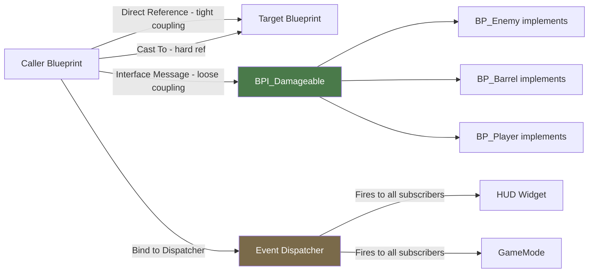

# Unreal Engine Blueprints

> [!abstract] TL;DR
> Blueprints are UE5's visual scripting language built on C++. Event Graphs handle gameplay flow, Function Graphs handle pure logic, and Blueprint Interfaces enable decoupled communication. Master debugging (breakpoints, watch values) and know when to migrate logic to C++ to avoid performance pitfalls.

## Blueprint Types

Unreal Engine offers several Blueprint asset types, each serving a distinct purpose. Choosing the right one is the first decision you make when opening the Blueprint editor.

**Class Blueprint** is the most common type. It extends any C++ class — `AActor`, `APawn`, `ACharacter`, `UUserWidget`, `UActorComponent`, etc. When you create a "BP_Enemy" Blueprint, you are creating a class that inherits from your C++ `AEnemy` class (or directly from AActor). All instances placed in the level are instances of that Blueprint class.

**Level Blueprint** is a special Blueprint that exists once per level. It is ideal for level-specific events that should not be reused: triggering a cutscene when the player reaches a location, opening a door after activating three switches, playing a boss encounter cinematic. Level Blueprints can directly reference Actors placed in the level — a feature no other Blueprint type has.

**Widget Blueprint** drives UI using UMG (Unreal Motion Graphics). Each Widget Blueprint is a combination of a visual Designer canvas (drag-and-drop layout) and an Event Graph for behavior. Bind UI elements (health bar, ammo counter) to game data using Property Bindings or manually from C++.

**Animation Blueprint** controls a Skeletal Mesh's animation state machine. The AnimGraph contains states (Idle, Walk, Run, Jump) connected by transitions driven by variables you set in the Event Graph every frame. These variables — Speed, IsInAir, IsAttacking — bridge gameplay and animation systems.

**Data-Only Blueprint** is a Blueprint with no custom logic, only overridden default properties. These are used for item variants: BP_Sword_Iron, BP_Sword_Flame, BP_Sword_Ice all inherit from BP_Sword_Base but override damage values and material without duplicating logic.

## Event Graph vs Function Graph

The Blueprint editor contains two main graph types, and mixing them up leads to frustration.

The **Event Graph** is driven by **events** — nodes with a red header that fire when something happens (BeginPlay, Tick, OnComponentHit, custom GameplayEvents). Execution flows right from the event pin through action nodes. Event Graph nodes can be **latent** (async) — Delay, MoveToActor, PlayAnimation — which pause execution and resume after completion. You cannot use latent nodes in Functions.

A **Function Graph** is a named, callable block of logic. It has explicit input and output pins. Functions are synchronous (no latent nodes), re-entrant, and can be marked Pure (no execution pin, like a getter — use for math helpers, string formatters). Functions are the Blueprint equivalent of methods — extract repeated logic here to avoid copy-pasting node networks.

**Macros** look like functions but expand inline at compile time. They can have multiple execution inputs and outputs (useful for a "debug print if dev build" macro), and they can use latent nodes. However, macros can't be overridden by child Blueprints — use functions for that.

**Custom Events** are like function entries but live in the Event Graph and can be called with delays between calls. They are also the mechanism for RPC (Remote Procedure Calls) in multiplayer — mark a Custom Event "Run On Server" or "Multicast" in its details.

```
Event Graph:
  [BeginPlay] → [Set Is Alive = True] → [Start Patrol Timer]
                                                ↓
  [Timer Callback] → [Get Next Patrol Point] → [Move To Location] (latent)
                                                          ↓
                                             [Reached Destination] → [Wait 2s] (latent)
                                                                              ↓
                                                                    [Loop Back]

Function Graph (GetHealthPercent - Pure):
  [Health] ÷ [MaxHealth] → [Return Node: Float]
```

## Variables and Properties

Variables in Blueprints are created in the **My Blueprint** panel on the left. Give them descriptive names in PascalCase. Choose the type from the dropdown — common types include:

- **Boolean**: true/false for state flags (bIsAlive, bIsGrounded)
- **Integer** / **Float**: numeric values
- **Vector** / **Rotator** / **Transform**: spatial data
- **Object Reference**: a pointer to a specific class instance (e.g., "Enemy Reference" of type `AEnemy`)
- **Class Reference**: a type itself, used for spawning ("Enemy Class" → SpawnActor)
- **Structure (Struct)**: a bundle of related variables defined in a separate Data Asset. Use FItemData, FWeaponStats — avoids parameter bloat in function calls.

To make a variable visible and editable in the Details panel for placed instances, check **Instance Editable** (eye icon next to the variable). For read-only display, check **VisibleAnywhere** instead. This maps directly to `UPROPERTY(EditAnywhere)` and `UPROPERTY(VisibleAnywhere)` in C++.

**Collections**: Blueprint supports Arrays (TArray), Maps (TMap), and Sets (TSet). For an inventory, use `Array of FItemData`. For a dictionary of stats, use `Map of Name → Float`. Maps in Blueprint require the key type to be "Blittable" (Boolean, Integer, Float, Name, String, Enum — not Object references as keys).

## Blueprint Communication Patterns

Choosing the wrong communication pattern is the most common Blueprint architecture mistake. Here are the four patterns and when to use each:

**Direct Reference** — Hold a typed reference to another Blueprint and call its functions or get its variables directly. Simple and fast. Use for tightly coupled objects that always exist together: a Character holding a reference to its equipped Weapon, or a UI widget holding a reference to the PlayerController that created it.

**Blueprint Interface (BPI)** — Define a set of function signatures in a standalone Interface asset. Any Blueprint (enemy, player, destructible barrel, breakable crate) can implement the interface and provide its own behavior. The caller does not need to know the concrete type — it sends the interface message to any actor. Critically, this avoids hard references, which means the target can be loaded/unloaded by the streaming system independently.

```
BPI_Damageable:
  Function: TakeDamage(Amount: Float, DamageCauser: Actor)
  Function: GetCurrentHealth() → Float

BP_Enemy implements BPI_Damageable → takes damage, plays hurt animation
BP_Barrel implements BPI_Damageable → explodes at zero health
BP_Player implements BPI_Damageable → reduces shield first

Caller: "Does Actor Implement Interface?" → send TakeDamage → polymorphic dispatch
```

**Event Dispatchers** — The Blueprint equivalent of C# delegates or Unity's UnityEvent. An object (the Player) declares an Event Dispatcher called "OnHealthChanged". Other objects (the HUD Widget, the GameMode) bind to it in their own BeginPlay. When the Player's health changes, it calls the dispatcher — all subscribers fire without the Player knowing who is listening. Excellent for UI reacting to gameplay without the gameplay system knowing the UI exists.

**Cast To** — Verify that an Actor Reference is of a specific Blueprint type, then access its properties. Use sparingly — every Cast To creates a **hard reference** between the two assets. If BP_Enemy is referenced by BP_Player via Cast To, both assets are loaded into memory together, preventing independent streaming. Use when you know the types are always loaded together and need fast direct access.

## Common Blueprint Nodes

Knowing the right node saves you from writing tangled spaghetti:

| Node | Purpose |
|---|---|
| **Branch** | If/Else — condition splits execution into True/False paths |
| **Sequence** | Execute multiple outputs in order from a single input — cleaner than chaining |
| **ForEachLoop** | Iterate an array — provides Array Element and Array Index pins |
| **DoOnce** | First time execution reaches this node, it fires. Then closes until Reset |
| **DoN** | Fire N times then close — useful for limited burst effects |
| **Gate** | Open/Close execution flow — Open allows through, Close blocks |
| **FlipFlop** | Alternates between A and B outputs on each call — toggle pattern |
| **Timeline** | Animates a float/vector/color value over time (like a Tween). Has Play, Reverse, Loop |
| **Delay** | Latent node — waits N seconds then continues. Event Graph only |
| **GetAllActorsOfClass** | Find all actors of a type — expensive, never call in Tick |
| **LineTraceByChannel** | Raycast — returns Hit Result with impact point, normal, hit actor |
| **DrawDebugLine/Sphere** | Visualize debug info in viewport during PIE — remove before shipping |

## Debugging Blueprints

Blueprint debugging is one of UE5's strongest features compared to other visual scripting systems.

**Breakpoints**: Click any node in PIE (or set one before launching). Press **F9** on a selected node in the graph to toggle a breakpoint (red ring appears). When execution reaches that node during PIE, the game pauses. Use the toolbar to **Step Over** (advance one node), **Step Into** (enter a function), or **Resume** (continue running). The current execution position is shown with a white arrow indicator on the active node.

**Watch Values**: Right-click any variable node → **Watch this value**. A live readout appears next to the variable in the graph during PIE. For array or struct variables, the watch expands to show all fields. This is faster than Print String for inspecting state.

**Print String**: The quickest debug tool. Print String outputs text to the in-game viewport (top-left by default) and to the Output Log. Use `Append` nodes to include variable values. Prints disappear after a configurable duration. Disable "Print to Screen" and "Print to Log" independently. Always remove or gate behind a `bDebugMode` variable before shipping.

**Blueprint Debugger Panel**: Window → Blueprint Debugger. Shows the current call stack of executing Blueprint functions, active breakpoints, and watched variables. Particularly useful for tracking Event Dispatcher chains and identifying where execution is stalling.

**Output Log**: Window → Output Log. UE_LOG from C++ and Print String output both appear here. Filter by category (LogTemp, LogAI, LogNet) using the search bar. Always check the Output Log for warnings (yellow) and errors (red) before investigating further.

## Converting Blueprint to C++

As a project matures, you will encounter Blueprints that have grown too complex or too slow. Recognizing migration signals early saves refactor pain later.

**Signs a Blueprint should become C++**:
- Tick event with non-trivial logic called on many instances (AI scanning, physics checks)
- Complex loops over large arrays called frequently
- Blueprint is too large to navigate (>200 nodes) — break into systems first, then migrate
- Logic needs to be unit tested
- Feature requires engine internals not exposed to Blueprint

**Migration workflow**:
1. In the Content Browser, right-click the Blueprint → **Create C++ class from this Blueprint** (available in UE5.1+) to generate a stub.
2. Move logic piece by piece — start with pure functions (math helpers, getters) as they have no side effects.
3. Re-expose the new C++ functions with `UFUNCTION(BlueprintCallable)`.
4. The Blueprint now inherits from the C++ class and calls its parent implementations.
5. Delete moved nodes from Blueprint, verify behavior in PIE.

Keep designer-facing configuration as `UPROPERTY(EditAnywhere)` in C++. The goal is logic in C++, configuration in Blueprint.

## Blueprint Communication Pattern Diagram



## Common Pitfalls

- **Cast To everywhere**: every Cast To creates a hard asset reference. If BP_Player casts to BP_Enemy to grab stats, both must be loaded in memory together. In a large game with streaming, this defeats the streaming system entirely. Use Blueprint Interfaces for cross-type communication.
- **Tick in Blueprint**: Blueprint Tick is significantly slower than C++ Tick due to VM overhead. An AI Blueprint running pathfinding in Tick at 60fps on 50 enemies is 3,000 Blueprint VM calls per second. Move any Tick logic that runs on many instances to C++.
- **Circular event dispatchers**: A fires a dispatcher → B responds and fires its own dispatcher → A responds and fires again → stack overflow. Always draw the event flow before implementing dispatchers; ensure chains are acyclic.
- **Everything in Event Graph**: putting all logic directly in the Event Graph creates unreadable node spaghetti. Extract reusable logic into Functions immediately. The threshold: if you find yourself duplicating a node network twice, make it a function.
- **Not checking object validity**: Blueprint does not null-check by default. If an Object Reference is invalid (actor was destroyed) and you call a function on it, UE5 will crash or log a warning. Use the **Is Valid** node before accessing any object that might not exist.
- **Large GetAllActorsOfClass in Tick**: this function iterates every actor in the world. Calling it in Tick is O(n) every frame. Use overlap events, maintain your own TArray of registered actors, or call it in BeginPlay and cache the result.

## Review Questions

1. What is the difference between a Blueprint Interface and an Event Dispatcher? When would you use each?
2. Why is "Cast To" considered a tight-coupling pattern? What is the alternative for decoupled communication between actors of different types?
3. What types of logic should be migrated from Blueprint to C++ for performance, and what is the recommended migration workflow?
4. What is the difference between an Event Graph and a Function Graph? What can you do in an Event Graph that you cannot do in a Function Graph?
5. How do you set a breakpoint in Blueprint during PIE, and what does "Step Over" do when you hit one?

## Related Concepts

- [[_MOC_Game_Development_Master|↑ Game Development MOC]]

#GameDev
