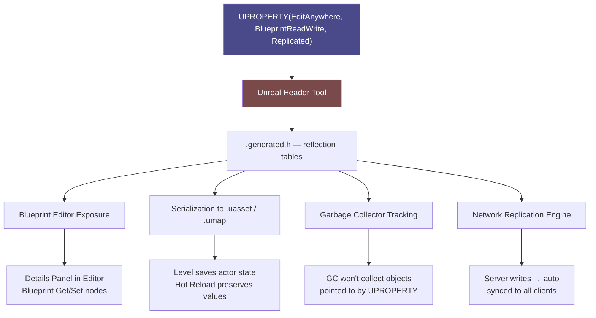

# Unreal Engine C++ Basics

> [!abstract] TL;DR
> UE5 C++ extends standard C++ with a reflection and garbage collection system driven by UCLASS/UPROPERTY/UFUNCTION macros. Unreal containers (TArray, TMap) replace STL. FString/FName/FText serve different text purposes. Mastering the reflection system and Enhanced Input in C++ unlocks full engine power.

## Project Structure

Understanding how UE5 organizes C++ source code is essential before writing your first line. Unlike Unity, Unreal uses a **module system** — the engine itself is split into modules (Core, Engine, Slate, InputCore, EnhancedInput, etc.), and your game code is its own module.

```
MyGame/
├── MyGame.uproject               — project descriptor, lists plugins and modules
├── Source/
│   └── MyGame/
│       ├── MyGame.Build.cs       — module build rules (add dependencies here)
│       ├── MyGame.h / .cpp       — module startup/shutdown
│       ├── MyGameGameMode.h/.cpp — generated starter class
│       ├── Player/
│       │   ├── MyCharacter.h
│       │   └── MyCharacter.cpp
│       └── AI/
│           ├── EnemyController.h
│           └── EnemyController.cpp
├── Content/                      — assets: meshes, textures, Blueprints
└── Intermediate/
    └── Build/                    — generated reflection code (never edit)
```

The **Build.cs** file is the critical configuration file. When you use a new engine feature, you must declare its module dependency here or you will get linker errors that look unrelated to the actual problem:

```csharp
// Source/MyGame/MyGame.Build.cs
public class MyGame : ModuleRules
{
    public MyGame(ReadOnlyTargetRules Target) : base(Target)
    {
        PCHUsage = PCHUsageMode.UseExplicitOrSharedPCHs;

        PublicDependencyModuleNames.AddRange(new string[] {
            "Core",
            "CoreUObject",
            "Engine",
            "InputCore",
            "EnhancedInput",    // Required for Enhanced Input system
            "AIModule",         // Required for AAIController, BehaviorTree
            "NavigationSystem", // Required for UNavigationSystemV1
            "Niagara",          // Required for UNiagaraFunctionLibrary
            "UMG",              // Required for UUserWidget
        });

        PrivateDependencyModuleNames.AddRange(new string[] {
            "Slate",
            "SlateCore",
        });
    }
}
```

After modifying Build.cs, regenerate project files: right-click the .uproject → Generate Visual Studio Project Files.

**Include discipline**: Unreal's `#include` chain can balloon compile times. Use forward declarations in headers whenever you only need a pointer/reference. Only `#include` full headers in .cpp files:

```cpp
// MyCharacter.h — forward declare, don't include
class USkeletalMeshComponent;
class UCameraComponent;
class USpringArmComponent;

// MyCharacter.cpp — include what you actually use
#include "MyCharacter.h"
#include "Components/SkeletalMeshComponent.h"
#include "Camera/CameraComponent.h"
#include "GameFramework/SpringArmComponent.h"
```

## UCLASS, UPROPERTY, and UFUNCTION Macros

These macros are not just documentation — they feed Unreal's **Unreal Header Tool (UHT)**, which runs before the C++ compiler and generates reflection data in `.generated.h` files. This reflection data powers four engine systems simultaneously:

1. **Blueprint exposure**: annotated properties/functions appear in the Blueprint editor
2. **Serialization**: annotated properties are saved to .uasset files and level .umap files
3. **Garbage Collection**: UPROPERTY pointers are tracked so the GC knows not to destroy referenced objects
4. **Replication**: UPROPERTY(Replicated) sends values over the network automatically

```cpp
// UInventoryComponent.h
#pragma once
#include "CoreMinimal.h"
#include "Components/ActorComponent.h"
#include "ItemData.h"         // FItemData struct definition
#include "UInventoryComponent.generated.h"  // ALWAYS last include

UCLASS(ClassGroup="Gameplay", meta=(BlueprintSpawnableComponent))
class MYGAME_API UInventoryComponent : public UActorComponent
{
    GENERATED_BODY()  // Required — expands to reflection boilerplate

public:
    UInventoryComponent();

    // EditAnywhere: editable on CDO and placed instances
    // BlueprintReadWrite: read and write from Blueprint
    // Category: organizes into a named group in Details panel
    UPROPERTY(EditAnywhere, BlueprintReadWrite, Category="Inventory|Config")
    int32 MaxSlots = 20;

    // VisibleAnywhere: shown in Details but greyed out (not editable in editor)
    // BlueprintReadOnly: Blueprint can read but not assign
    UPROPERTY(VisibleAnywhere, BlueprintReadOnly, Category="Inventory|State")
    TArray<FItemData> Items;

    // Replicated: value is synced from server to clients automatically
    UPROPERTY(ReplicatedUsing=OnRep_Gold, BlueprintReadOnly, Category="Inventory")
    int32 Gold = 0;

    // BlueprintCallable: appears as a node in Blueprint event/function graphs
    UFUNCTION(BlueprintCallable, Category="Inventory")
    bool AddItem(const FItemData& Item);

    // BlueprintPure: callable node with no execution pin (getter-style)
    // const is required for BlueprintPure
    UFUNCTION(BlueprintPure, Category="Inventory")
    int32 GetItemCount() const { return Items.Num(); }

    // BlueprintImplementableEvent: C++ declares; Blueprint implements visually
    // The C++ body is auto-generated (no implementation in .cpp)
    UFUNCTION(BlueprintImplementableEvent, Category="Inventory")
    void OnItemAdded(const FItemData& Item);

    // ReplicatedUsing: called on client when replicated variable changes
    UFUNCTION()
    void OnRep_Gold();

    // Override for replication setup
    virtual void GetLifetimeReplicatedProps(
        TArray<FLifetimeProperty>& OutLifetimeProps) const override;
};

// UInventoryComponent.cpp
#include "UInventoryComponent.h"
#include "Net/UnrealNetwork.h"  // for DOREPLIFETIME macro

UInventoryComponent::UInventoryComponent()
{
    PrimaryComponentTick.bCanEverTick = false;
    SetIsReplicatedByDefault(true);  // Component participates in replication
}

bool UInventoryComponent::AddItem(const FItemData& Item)
{
    if (Items.Num() >= MaxSlots) return false;
    Items.Add(Item);
    OnItemAdded(Item);  // Calls Blueprint implementation
    return true;
}

void UInventoryComponent::GetLifetimeReplicatedProps(
    TArray<FLifetimeProperty>& OutLifetimeProps) const
{
    Super::GetLifetimeReplicatedProps(OutLifetimeProps);
    DOREPLIFETIME(UInventoryComponent, Gold);   // replicate Gold
    DOREPLIFETIME(UInventoryComponent, Items);  // replicate Items array
}

void UInventoryComponent::OnRep_Gold()
{
    // Called on client when Gold changes — update UI here
    UE_LOG(LogTemp, Log, TEXT("Gold updated to: %d"), Gold);
}
```

**UPROPERTY specifier reference** (most common combinations):

| Specifier | Effect |
|---|---|
| `EditAnywhere` | Editable in both Blueprint defaults AND placed instances |
| `EditDefaultsOnly` | Editable in Blueprint Class Defaults only — not on placed instances |
| `EditInstanceOnly` | Editable on placed instances only — not in Blueprint defaults |
| `VisibleAnywhere` | Shown in Details, not editable (useful for components) |
| `BlueprintReadWrite` | Blueprint can get and set |
| `BlueprintReadOnly` | Blueprint can get only |
| `Transient` | Not serialized (reset on load) — use for runtime-only state |
| `SaveGame` | Included in save game serialization |

## Unreal Containers

Unreal's containers are designed to work with the UObject GC system. **Do not use `std::vector`, `std::map`, or `std::unordered_map` for UObject pointers** — the GC tracks ownership only through UPROPERTY and Unreal containers. Using STL containers with UObject pointers can cause objects to be garbage collected while you still hold a pointer to them.

```cpp
// TArray — dynamic array, equivalent to std::vector
TArray<AActor*> Enemies;

// Adding
Enemies.Add(NewEnemy);
Enemies.AddUnique(NewEnemy);   // only adds if not already present
Enemies.Insert(NewEnemy, 0);   // insert at index 0

// Removing
Enemies.Remove(DeadEnemy);                                      // first match
Enemies.RemoveAt(2);                                            // by index
Enemies.RemoveAll([](AActor* A) { return !IsValid(A); });       // lambda predicate
Enemies.Empty();                                                // clear all

// Querying
int32 Count = Enemies.Num();                                    // NOT .size()
bool bFound = Enemies.Contains(SomeEnemy);
int32 Idx   = Enemies.Find(SomeEnemy);                         // -1 if not found
AActor** Ptr = Enemies.FindByPredicate([](AActor* A) {
    return A->Tags.Contains(FName("Boss")); });

// Iterating
for (AActor* Enemy : Enemies)                        { /* range-for */ }
for (int32 i = 0; i < Enemies.Num(); ++i)            { /* index loop */ }
Enemies.Sort([](const AActor& A, const AActor& B) {
    return A.GetName() < B.GetName(); });             // sort with comparator

// TMap — hash map, equivalent to std::unordered_map
TMap<FName, float> CharacterStats;
CharacterStats.Add(TEXT("Strength"), 10.f);
CharacterStats.Add(TEXT("Agility"),  8.f);

float* StrPtr = CharacterStats.Find(TEXT("Strength")); // returns pointer; null if missing
if (StrPtr) *StrPtr += 5.f;                             // always null-check!

float Str = CharacterStats.FindOrAdd(TEXT("Strength")); // adds 0.0 default if missing
bool  bHas = CharacterStats.Contains(TEXT("Agility"));
CharacterStats.Remove(TEXT("Agility"));

for (auto& Pair : CharacterStats)
{
    UE_LOG(LogTemp, Log, TEXT("%s = %.1f"), *Pair.Key.ToString(), Pair.Value);
}

// TSet — unordered set of unique values
TSet<int32> VisitedRoomIDs;
VisitedRoomIDs.Add(42);
bool bVisited = VisitedRoomIDs.Contains(42);  // O(1) average
```

**Memory note**: `TArray<UObject*>` without `UPROPERTY` will NOT prevent GC. Always mark arrays of UObject pointers with `UPROPERTY()` even if you don't need any specifiers:

```cpp
UPROPERTY()
TArray<AActor*> TrackedActors;  // GC will not delete these while this array exists
```

## Text Types: FString, FName, FText

UE5 has three string types and choosing the wrong one is a common mistake:

| Type | Storage | Comparison | Use Case |
|---|---|---|---|
| `FString` | Heap-allocated, mutable | O(n) char compare | Runtime string manipulation, debug output, file paths |
| `FName` | Global name table, immutable, case-insensitive | O(1) integer compare | Asset names, socket names, gameplay tags, map keys |
| `FText` | Localization table entry | Expensive | Display strings shown to the player (UI labels) |

```cpp
// FString — mutable string operations
FString PlayerName = TEXT("Karan");
FString Message    = FString::Printf(TEXT("Welcome, %s! HP: %d"), *PlayerName, 100);
FString Upper      = PlayerName.ToUpper();                   // "KARAN"
bool    bEnds      = Message.EndsWith(TEXT("100"));          // true
int32   Len        = PlayerName.Len();                       // 5
FString Sub        = PlayerName.Mid(0, 3);                   // "Kar"

// Log output: * dereferences FString to const TCHAR*
UE_LOG(LogTemp, Warning, TEXT("Message: %s"), *Message);
GEngine->AddOnScreenDebugMessage(-1, 5.f, FColor::Yellow, Message);

// FName — for identifiers, tags, asset paths
FName WeaponTag  = FName(TEXT("Weapon.Sword"));
FName SameName   = FName(TEXT("weapon.sword")); // FName is case-insensitive
bool  bEqual     = (WeaponTag == SameName);      // true — compares internal integer IDs
FString AsStr    = WeaponTag.ToString();          // convert to FString for display

// FText — for UI display, respects localization
FText WelcomeText   = LOCTEXT("WelcomeKey", "Welcome to the game!");
FText DynamicText   = FText::Format(
    LOCTEXT("ScoreKey", "Score: {0}"), FText::AsNumber(Score));

// Conversions between types
FString S = TEXT("Hello");
FName   N = FName(*S);          // FString → FName via *
FText   T = FText::FromString(S); // FString → FText (loses localization)
FString FromName = N.ToString(); // FName → FString
```

**Performance rule**: Never use `FName` as a value you build at runtime with `FName(TEXT(...))` inside Tick — every construction does a global name table lookup. Cache FName values as member variables.

## Timers and FMath

UE5's timer system is far safer than raw `std::chrono` or manual countdowns because timers are automatically invalidated when their owning UObject is garbage collected.

```cpp
// Header — declare timer handles
FTimerHandle HealthRegenTimerHandle;
FTimerHandle InvincibilityTimerHandle;

// BeginPlay — start a repeating timer (regen 5hp every 1 second)
void AMyCharacter::BeginPlay()
{
    Super::BeginPlay();

    // SetTimer(Handle, Object, Function, Rate, bLooping, InitialDelay)
    GetWorldTimerManager().SetTimer(
        HealthRegenTimerHandle,
        this,
        &AMyCharacter::RegenHealth,
        1.0f,   // fire every 1 second
        true,   // looping
        3.0f    // start after 3 second delay
    );

    // Lambda timer — anonymous function, fire once after 0.5s
    FTimerHandle TempHandle;
    GetWorldTimerManager().SetTimer(TempHandle, [this]()
    {
        bIsInvincible = false;
    }, 0.5f, false);
}

void AMyCharacter::RegenHealth()
{
    Health = FMath::Min(Health + 5.f, MaxHealth);
}

// Cancel a timer
void AMyCharacter::OnDeath()
{
    GetWorldTimerManager().ClearTimer(HealthRegenTimerHandle);
}

// Query timer state
bool bIsActive    = GetWorldTimerManager().IsTimerActive(HealthRegenTimerHandle);
float TimeRemaining = GetWorldTimerManager().GetTimerRemaining(HealthRegenTimerHandle);
```

**FMath utility functions** — the Unreal math library covers most game math needs:

```cpp
// Clamping and interpolation
float Clamped   = FMath::Clamp(Value, 0.f, 100.f);
float Lerped    = FMath::Lerp(0.f, 100.f, 0.5f);                    // 50.f
float SmoothLerp = FMath::SmoothStep(0.f, 100.f, Alpha);            // smoothstep ease
float Mapped    = FMath::GetMappedRangeValueClamped(
    FVector2D(0.f, 100.f),    // input range
    FVector2D(0.f, 1.f),      // output range
    CurrentHP);               // map HP to 0-1 for UI bar

// Vector math
FVector AToB    = (B - A).GetSafeNormal();  // normalized direction
float   Dist    = FVector::Dist(A, B);
float   DistSq  = FVector::DistSquared(A, B); // cheaper than Dist if comparing
float   Dot     = FVector::DotProduct(Dir1, Dir2); // -1 to 1
FVector Cross   = FVector::CrossProduct(Forward, Right);

// Angles and rotation
float AngleDeg  = FMath::RadiansToDegrees(FMath::Atan2(Y, X));
FRotator LookAt = UKismetMathLibrary::FindLookAtRotation(FromLoc, ToLoc);
FVector Forward = FRotationMatrix(GetActorRotation()).GetScaledAxis(EAxis::X);

// Random
float RandFloat  = FMath::FRandRange(0.f, 1.f);
int32 RandInt    = FMath::RandRange(1, 6);              // dice roll
FVector RandDir  = FMath::VRand();                       // random unit vector
```

## Enhanced Input System in C++

The Enhanced Input system (default since UE5.1) replaces the legacy Input Settings and supports contextual input mapping, multiple simultaneous input mappings, and complex trigger conditions (hold, double tap, chord).

**Setup steps**:
1. Add `"EnhancedInput"` to PublicDependencyModuleNames in Build.cs
2. Create `UInputMappingContext` assets in the Content Browser (one per context: "IMC_OnFoot", "IMC_InVehicle")
3. Create `UInputAction` assets (IA_Move, IA_Jump, IA_Fire) — define the value type (Bool, Float, Vector2D, Vector3D)
4. In the IMC, map keyboard/gamepad inputs to actions (WASD → IA_Move)

```cpp
// AMyCharacter.h
#pragma once
#include "CoreMinimal.h"
#include "GameFramework/Character.h"
#include "InputActionValue.h"
#include "AMyCharacter.generated.h"

class UInputMappingContext;
class UInputAction;

UCLASS()
class MYGAME_API AMyCharacter : public ACharacter
{
    GENERATED_BODY()
public:
    AMyCharacter();

    virtual void SetupPlayerInputComponent(UInputComponent* PlayerInputComponent) override;
    virtual void BeginPlay() override;

protected:
    // Assign these in the Blueprint child class (set the asset references)
    UPROPERTY(EditDefaultsOnly, BlueprintReadOnly, Category="Input")
    UInputMappingContext* DefaultMappingContext;

    UPROPERTY(EditDefaultsOnly, BlueprintReadOnly, Category="Input")
    UInputAction* MoveAction;      // Value type: Vector2D (X=right, Y=forward)

    UPROPERTY(EditDefaultsOnly, BlueprintReadOnly, Category="Input")
    UInputAction* LookAction;      // Value type: Vector2D (X=yaw, Y=pitch)

    UPROPERTY(EditDefaultsOnly, BlueprintReadOnly, Category="Input")
    UInputAction* JumpAction;      // Value type: Boolean

    UPROPERTY(EditDefaultsOnly, BlueprintReadOnly, Category="Input")
    UInputAction* SprintAction;    // Value type: Boolean

    void Move(const FInputActionValue& Value);
    void Look(const FInputActionValue& Value);
    void StartSprint();
    void StopSprint();
};

// AMyCharacter.cpp
#include "AMyCharacter.h"
#include "EnhancedInputComponent.h"
#include "EnhancedInputSubsystems.h"
#include "InputMappingContext.h"

void AMyCharacter::BeginPlay()
{
    Super::BeginPlay();

    // Register the mapping context with the local player's input subsystem
    if (APlayerController* PC = Cast<APlayerController>(GetController()))
    {
        if (UEnhancedInputLocalPlayerSubsystem* Subsystem =
            ULocalPlayer::GetSubsystem<UEnhancedInputLocalPlayerSubsystem>(
                PC->GetLocalPlayer()))
        {
            // Priority 0 = lowest; higher priority contexts override lower on conflict
            Subsystem->AddMappingContext(DefaultMappingContext, 0);
        }
    }
}

void AMyCharacter::SetupPlayerInputComponent(UInputComponent* PlayerInputComponent)
{
    // Cast to Enhanced version — this always succeeds if EnhancedInput plugin is active
    UEnhancedInputComponent* EIC =
        CastChecked<UEnhancedInputComponent>(PlayerInputComponent);

    // ETriggerEvent::Triggered fires every frame the input is held (for Move, Look)
    EIC->BindAction(MoveAction,   ETriggerEvent::Triggered, this, &AMyCharacter::Move);
    EIC->BindAction(LookAction,   ETriggerEvent::Triggered, this, &AMyCharacter::Look);

    // ETriggerEvent::Started fires once when first pressed
    EIC->BindAction(JumpAction,   ETriggerEvent::Started,   this, &AMyCharacter::Jump);
    EIC->BindAction(SprintAction, ETriggerEvent::Started,   this, &AMyCharacter::StartSprint);

    // ETriggerEvent::Completed fires once when released
    EIC->BindAction(SprintAction, ETriggerEvent::Completed, this, &AMyCharacter::StopSprint);
}

void AMyCharacter::Move(const FInputActionValue& Value)
{
    FVector2D MovementVector = Value.Get<FVector2D>();

    if (Controller)
    {
        // Get camera yaw to make movement camera-relative
        const FRotator Rotation    = Controller->GetControlRotation();
        const FRotator YawRotation = FRotator(0, Rotation.Yaw, 0);

        const FVector ForwardDir = FRotationMatrix(YawRotation).GetUnitAxis(EAxis::X);
        const FVector RightDir   = FRotationMatrix(YawRotation).GetUnitAxis(EAxis::Y);

        AddMovementInput(ForwardDir, MovementVector.Y);
        AddMovementInput(RightDir,   MovementVector.X);
    }
}

void AMyCharacter::Look(const FInputActionValue& Value)
{
    FVector2D LookAxisVector = Value.Get<FVector2D>();
    AddControllerYawInput(LookAxisVector.X);
    AddControllerPitchInput(LookAxisVector.Y);
}
```

**Swapping contexts at runtime** — for vehicle, swimming, or UI states:

```cpp
void AMyCharacter::EnterVehicle(UInputMappingContext* VehicleContext)
{
    if (UEnhancedInputLocalPlayerSubsystem* Sub = GetInputSubsystem())
    {
        Sub->RemoveMappingContext(DefaultMappingContext);
        Sub->AddMappingContext(VehicleContext, 0);
    }
}
```

## UPROPERTY Reflection System Diagram



## Common Pitfalls

- **Forgetting `GENERATED_BODY()`**: this macro expands to reflection boilerplate. Without it, you get cryptic linker errors like "unresolved external symbol" pointing to auto-generated symbols. It must appear immediately after the class opening brace.
- **Header include bloat**: including full headers in other headers cascades recompilation across the whole project. A change to any included file causes everything that transitively includes it to recompile. Prefer forward declarations in .h files and `#include` in .cpp files.
- **Raw pointers for optional UObject references**: if you store `AActor* WeakRef` without `UPROPERTY()`, the GC can delete the actor while you hold the pointer. Use `TWeakObjectPtr<AActor>` for non-owning references, or `UPROPERTY()` for strong references (prevents GC).
- **Missing module in Build.cs**: adding a dependency on a class from a module you haven't declared in Build.cs compiles fine (if the header happens to be included transitively) but fails at link time with confusing "unresolved external" errors. Always explicitly add the module.
- **Calling gameplay code in constructor**: the constructor runs to create the Class Default Object (CDO) when the editor loads. Code that calls `GetWorld()`, `SpawnActor`, or accesses game state will crash the editor. Reserve constructors for component creation and default value initialization only.
- **Using FName(TEXT(...)) in Tick**: constructing an FName from a string does a global hash table lookup every call. Declare your FNames as static local variables or class member variables: `static const FName BossTag(TEXT("Boss"));`.

## Review Questions

1. What does `UPROPERTY(EditAnywhere, BlueprintReadWrite)` actually enable at runtime? Name three engine systems it affects.
2. When should you use `FName` vs `FString`? What are the performance implications of using `FName` in a Tick function?
3. What is the purpose of the `GENERATED_BODY()` macro? What happens if you omit it?
4. Why should you not use `std::vector<UObject*>` in Unreal? What should you use instead, and why?
5. What is the difference between `ETriggerEvent::Triggered` and `ETriggerEvent::Started` in the Enhanced Input system?

## Related Concepts

- [[_MOC_Game_Development_Master|↑ Game Development MOC]]

#GameDev
