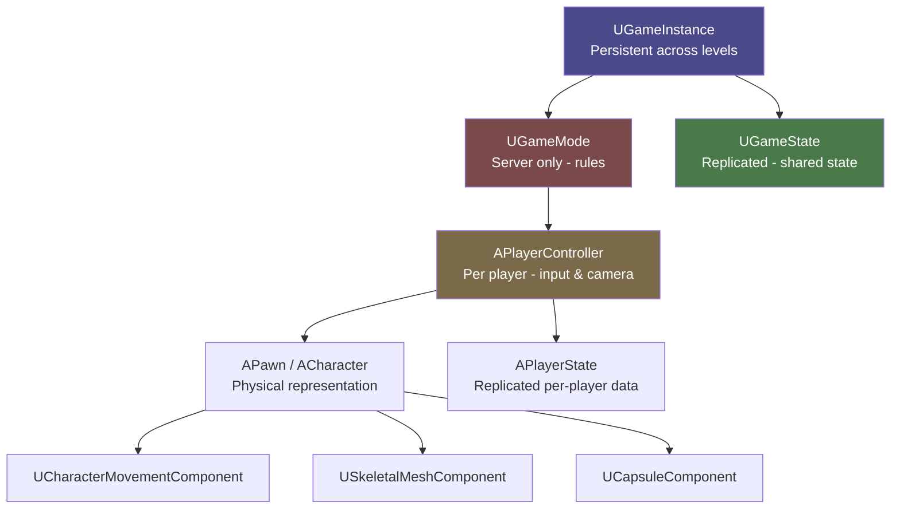

# Unreal Engine 5 Fundamentals

> [!abstract] TL;DR
> UE5's editor is organized around Actors and Components. Blueprints offer visual scripting while C++ provides performance. The UWorld/UGameMode/APlayerController hierarchy defines game rules and player management. Nanite and Lumen deliver next-gen visuals automatically with minimal configuration.

## UE5 Editor Overview

The Unreal Engine 5 editor is divided into several core panels that you will use constantly. Understanding what each panel does and how they relate to each other is the first step toward productive development.

The **World Outliner** (top-right by default) is a hierarchical list of every Actor currently placed in your level. You can parent Actors here by dragging one onto another, and you can use the search bar to find actors in large scenes. Think of it as the scene graph.

The **Details Panel** (right side) shows all properties of the currently selected Actor or Component. UPROPERTY macros in C++ determine what appears here and whether it is editable or read-only. This is where designers configure actor behavior without touching code.

The **Content Browser** (bottom) is your asset manager. Everything — textures, meshes, sounds, Blueprints, materials — lives here organized in folders. You drag assets from the Content Browser into the Viewport to place them. Use the Filters button to limit the type shown. Right-click a folder to create new assets.

The **Viewport** is the 3D view of your level. Navigation: hold **RMB** and use WASD to fly, hold **Alt+LMB** to orbit, scroll wheel to zoom. You can switch between Perspective, Top, Left, and Front orthographic views. The toolbar at the top of the viewport controls transforms (translate W, rotate E, scale R) and surface snapping.

The **Main Menu Bar** contains Build (bake lighting, build navigation mesh, compile shaders), Edit (project settings, preferences), and Window (open additional panels like the Output Log, which is your console for UE_LOG messages).

**Coordinate system**: UE5 uses a left-handed coordinate system with Z pointing up. Units are centimeters — a default capsule character is 192 cm tall. When positioning objects, keep this in mind: 100 UU (Unreal Units) = 1 meter.

Source Control (Git or Perforce) integrates directly via Edit → Source Control → Connect. This enables checkout, diff, and submit operations without leaving the editor.

## Actor-Component Model

Everything visible or interactive in a UE5 level is an **AActor**. An Actor by itself is just a container — it has a position in the world, can be spawned/destroyed, and participates in BeginPlay/Tick/EndPlay. Behavior and visual representation come from **Components** attached to the Actor.

There are two base component types:
- **UActorComponent**: pure logic, no transform (e.g., HealthComponent, InventoryComponent). It exists to encapsulate a system.
- **USceneComponent**: has a 3D transform (position, rotation, scale), can be attached to a parent component in a hierarchy. All visual/collision components derive from this.

The **Root Component** is the top-level USceneComponent that defines the Actor's world-space transform. Setting `RootComponent = Mesh` means the mesh's position IS the actor's position.

```cpp
// AEnemy.h
#pragma once
#include "CoreMinimal.h"
#include "GameFramework/Actor.h"
#include "Components/SphereComponent.h"
#include "Components/StaticMeshComponent.h"
#include "AEnemy.generated.h"

UCLASS()
class MYGAME_API AEnemy : public AActor
{
    GENERATED_BODY()

public:
    AEnemy();

    virtual void BeginPlay() override;
    virtual void Tick(float DeltaTime) override;

    UPROPERTY(VisibleAnywhere, BlueprintReadOnly, Category="Components")
    UStaticMeshComponent* Mesh;

    UPROPERTY(VisibleAnywhere, BlueprintReadOnly, Category="Components")
    USphereComponent* DetectionSphere;

    UPROPERTY(EditAnywhere, BlueprintReadWrite, Category="Combat")
    float Health = 100.f;

    UPROPERTY(EditAnywhere, BlueprintReadWrite, Category="Combat")
    float MaxHealth = 100.f;
};

// AEnemy.cpp
#include "AEnemy.h"

AEnemy::AEnemy()
{
    PrimaryActorTick.bCanEverTick = true;

    // CreateDefaultSubobject MUST be called in constructor
    Mesh = CreateDefaultSubobject<UStaticMeshComponent>(TEXT("Mesh"));
    RootComponent = Mesh;

    DetectionSphere = CreateDefaultSubobject<USphereComponent>(TEXT("DetectionSphere"));
    DetectionSphere->SetupAttachment(RootComponent);    // parent to root
    DetectionSphere->SetSphereRadius(500.f);
    DetectionSphere->SetCollisionProfileName(TEXT("Trigger"));
}

void AEnemy::BeginPlay()
{
    Super::BeginPlay();  // ALWAYS call Super first
    UE_LOG(LogTemp, Log, TEXT("Enemy spawned with %.0f HP"), Health);
}

void AEnemy::Tick(float DeltaTime)
{
    Super::Tick(DeltaTime);
    // DeltaTime: seconds since last frame — use for frame-rate-independent movement
}
```

Components can also have their own logic. An `ACharacter` in UE5 already has a `UCapsuleComponent` (collision), `USkeletalMeshComponent` (visual), and `UCharacterMovementComponent` (physics/locomotion) — you do not create these yourself; they come with the class.

## Blueprint vs C++

Unreal's power comes from the seamless integration between Blueprint and C++. Understanding when to use each is critical for productive teams.

**Blueprints** are visual node graphs compiled to bytecode interpreted by the UE VM. Their advantages: immediate iteration (no compile step for Blueprint-only changes), visual debugging during PIE, accessible to non-programmers, and excellent for high-level gameplay flow, UI logic, and configuration. Their disadvantages: slower execution than native C++, harder to version control (binary format), limited debugging for complex logic, no templates or generics.

**C++** compiles to native machine code. Advantages: full performance, access to all engine internals, STL-like templates, proper source control diffs, complex data structures. Disadvantage: recompile required after changes (Hot Reload mitigates this but has edge cases).

The **best practice** is a clear split: implement systems, algorithms, and data structures in C++. Expose configuration knobs and event hooks to Blueprint. This gives designers creative freedom while keeping the codebase maintainable.

```cpp
// In the .h file — exposing C++ systems to Blueprint
UCLASS(Blueprintable)
class MYGAME_API AWeapon : public AActor
{
    GENERATED_BODY()
public:
    // BlueprintCallable: designer can call this from Blueprint
    UFUNCTION(BlueprintCallable, Category="Combat")
    void Fire();

    // BlueprintImplementableEvent: C++ declares the signature,
    // Blueprint provides the implementation (visual effect on hit, etc.)
    UFUNCTION(BlueprintImplementableEvent, Category="Combat")
    void OnHitEnemy(AActor* HitActor);

    // BlueprintNativeEvent: has a C++ default implementation,
    // Blueprint can override it
    UFUNCTION(BlueprintNativeEvent, Category="Combat")
    float GetDamage() const;
    virtual float GetDamage_Implementation() const { return BaseDamage; }

    UPROPERTY(EditDefaultsOnly, BlueprintReadOnly, Category="Combat")
    float BaseDamage = 25.f;
};
```

The `EditDefaultsOnly` specifier means the property can only be edited in the Class Defaults (the Blueprint editor), not on placed instances. This is typical for balance values — you set them once per weapon type, not per instance.

## Game Framework Classes

UE5's game framework is a hierarchy of classes that divide responsibility for game rules, player management, and state. Understanding this hierarchy is essential before building any multiplayer-aware game.

| Class | Lifetime | Purpose |
|---|---|---|
| `UGameInstance` | Entire game session | Persistent data (player profile, save data, online subsystem) |
| `UGameMode` | Per level, server only | Rules (respawn logic, win/lose, player joining) |
| `UGameState` | Per level, replicated | Shared game state (scores, time remaining, match phase) |
| `APlayerController` | Per player, server+client | Input handling, camera, HUD, possesses Pawn |
| `APawn` / `ACharacter` | As needed | Physical representation the player controls |
| `APlayerState` | Per player, replicated | Per-player data (score, ping, team) |

**Spawn flow**: When a player connects, GameMode creates a PlayerController. GameMode's `ChoosePlayerStart()` picks a spawn point. GameMode then calls `SpawnDefaultPawnFor()` to create the Pawn, and PlayerController possesses it. This is all automatic — you customize it by overriding these virtual functions.

`UGameInstance` is the right place to store data that must survive level transitions (e.g., unlocked achievements, total currency). It is created once when the game starts and destroyed when the game exits. Access it anywhere with `GetGameInstance<UMyGameInstance>()`.

`UGameMode` only exists on the server (or in single-player). Never read gameplay rules from GameMode on a client in a multiplayer game — use GameState instead, which is replicated to all clients.

## BeginPlay, Tick, and EndPlay

Every AActor and UActorComponent goes through a well-defined lifecycle:

1. **Constructor**: called at editor load/CDO creation, NOT at runtime spawn. Use for component creation only. Never call gameplay code here.
2. **PostInitializeComponents**: all components have been created and initialized. Safe to call component functions here.
3. **BeginPlay**: called after the actor is fully initialized and the level has started. This is your runtime startup code — bind delegates, initialize AI, start timers.
4. **Tick(float DeltaTime)**: called every frame. `DeltaTime` is seconds since last frame — always multiply movement/velocity by DeltaTime for frame-rate independence.
5. **EndPlay(EEndPlayReason)**: called before the actor is destroyed or the level unloads. Clean up timers, release resources, unbind delegates.

```cpp
void AMyActor::BeginPlay()
{
    Super::BeginPlay();  // Required — initializes engine subsystems

    // Bind overlap delegate
    DetectionSphere->OnComponentBeginOverlap.AddDynamic(
        this, &AMyActor::OnDetectionOverlap);
}

void AMyActor::EndPlay(const EEndPlayReason::Type EndPlayReason)
{
    // Clear any running timers to prevent callbacks on destroyed object
    GetWorldTimerManager().ClearAllTimersForObject(this);
    Super::EndPlay(EndPlayReason);
}
```

Disable Tick on actors that do not need per-frame updates. In large scenes with hundreds of actors, unnecessary Tick calls are a major CPU bottleneck:

```cpp
AMyActor::AMyActor()
{
    PrimaryActorTick.bCanEverTick = false;  // Opt out of ticking
}
```

Use `SetActorTickInterval(0.1f)` to tick at a lower frequency (10 times/sec instead of 60+) for systems like AI perception that don't need per-frame updates.

## Nanite and Lumen

UE5 introduced two revolutionary rendering systems that change how you think about content creation.

**Nanite** is a virtualized micropolygon geometry system. It streams and rasterizes only the geometry details that are visible at the current pixel density — no manual LOD creation required. You can import a 50-million-polygon scan and Nanite handles it. Enable it per-mesh in the Static Mesh editor (check "Enable Nanite Support"). Nanite works only with opaque materials on Static Meshes; it does not support Skeletal Meshes, translucency, or masked materials.

**Lumen** is a fully dynamic global illumination (GI) and reflection system. It traces rays through a Scene Representation of signed distance fields and surface caches. The result: accurate indirect lighting, area light soft shadows, and real reflections — all without baking. No Lightmaps required. Enable both in Project Settings → Rendering → Global Illumination and Reflections.

Both systems have significant GPU cost. For PC/console targets they are the default. Disable both for mobile projects and use baked lighting (Lightmass) instead.

## Game Framework Hierarchy Diagram



## Common Pitfalls

- **Forgetting `Super::BeginPlay()`**: skipping the super call breaks engine initialization for that actor. The compiler will not warn you — it silently causes subtle bugs. Always call it as the first line.
- **Enabling Tick on all actors**: every ticking actor has CPU overhead. Hundreds of idle enemies all ticking wastes significant frame time. Use event-driven design (delegates, timers) instead of polling in Tick.
- **Creating components in BeginPlay**: `CreateDefaultSubobject` must be called in the constructor. Calling it in BeginPlay causes a crash. Components added at runtime use `NewObject` + `RegisterComponent` instead.
- **Not calling `SetupAttachment`**: if you create a child USceneComponent and forget `SetupAttachment(RootComponent)`, it floats at world origin instead of following the actor.
- **Putting gameplay code in the constructor**: constructors run in the editor to create Class Default Objects (CDOs). Gameplay code (getting world, spawning actors) in constructors causes editor crashes.
- **Confusing `EditAnywhere` and `EditDefaultsOnly`**: `EditAnywhere` allows per-instance override on placed actors (useful for unique instance customization). `EditDefaultsOnly` locks it to the Blueprint class defaults (better for balance values that should be the same for all instances of a type).

## Review Questions

1. What is the difference between `AActor` and `UActorComponent`? When would you use `UActorComponent` vs `USceneComponent`?
2. What is the role of `UGameMode` vs `UGameState` in UE5's game framework? Which is accessible on clients in multiplayer?
3. Why is it best practice to implement systems in C++ and expose them to Blueprint rather than implementing everything directly in Blueprint?
4. What does `PrimaryActorTick.bCanEverTick = false` do, and why is it important for performance in scenes with many actors?
5. What are the key differences between Nanite and traditional LOD systems? What types of meshes does Nanite NOT support?

## Related Concepts

- [[_MOC_Game_Development_Master|↑ Game Development MOC]]

#GameDev
