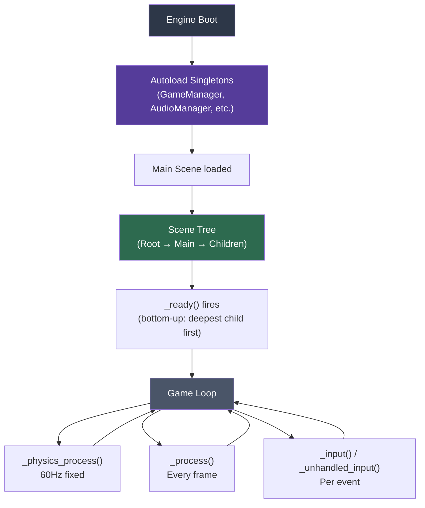

# GDScript Programming

> [!abstract] TL;DR
> GDScript is Godot's Python-like scripting language with optional static typing, built-in vector/transform types, and seamless engine integration. @export exposes variables to the editor, @onready caches node references, and autoloads serve as singletons for global systems.

## GDScript Basics

GDScript uses **indentation-based syntax** (like Python) and extends a Godot node type. Every script file corresponds to one class, and the first line declares what node type it extends:

```gdscript
extends CharacterBody2D
```

GDScript is **dynamically typed by default** but supports optional static type hints. Static typing improves IDE autocompletion, enables compile-time error detection, and provides a ~15% JIT performance improvement. Prefer typed code in any non-trivial project:

```gdscript
extends CharacterBody2D

# Untyped — flexible but no IDE support, no compile-time checks
var speed = 200

# Typed — preferred for maintainability and performance
var speed: float = 200.0
var player_name: String = "Hero"
var is_alive: bool = true
var health: int = 100
var inventory: Array[Item] = []         # typed array — elements must be Item

# Constants — compile-time, cannot be changed
const MAX_HEALTH: int = 100
const GRAVITY_MULTIPLIER: float = 1.5

# Enums — named integer constants with a type-safe container
enum State { IDLE, RUNNING, JUMPING, ATTACKING, DEAD }
var current_state: State = State.IDLE

# Dictionaries
var stats: Dictionary = { "strength": 10, "agility": 8, "intelligence": 5 }

# Null safety — use typed variables to avoid null reference errors
var optional_target: Node2D = null
if is_instance_valid(optional_target):
    optional_target.take_damage(10)
```

## @export and Inspector Integration

The `@export` annotation exposes a variable to the Godot Inspector panel in the editor. This is one of GDScript's most useful features: you can tune values, assign node references, and configure Resources without touching code.

```gdscript
extends Node2D

# Basic types — shown as editable fields in Inspector
@export var health: int = 100
@export var speed: float = 200.0
@export var jump_force: float = 400.0
@export var player_name: String = "Hero"

# Node references — drag a node from the scene tree into the slot
@export var sprite: Sprite2D
@export var animation_player: AnimationPlayer

# Array of Resources — assign multiple data objects
@export var weapons: Array[WeaponData]
@export var patrol_points: Array[Marker2D]

# Constrained types with helper annotations
@export_range(0.0, 1.0, 0.01) var volume: float = 1.0           # shows a slider
@export_range(1, 100) var level: int = 1                          # int slider
@export_enum("Easy", "Normal", "Hard", "Nightmare") var difficulty: int = 1
@export_multiline var description: String = ""                    # multiline text box
@export_file("*.json") var config_path: String = ""              # file picker, filtered

# Grouping — organizes the Inspector visually
@export_group("Movement")
@export var walk_speed: float = 150.0
@export var run_speed: float = 300.0
@export var acceleration: float = 800.0

@export_group("Combat")
@export var damage: float = 10.0
@export var attack_range: float = 50.0
@export var attack_cooldown: float = 0.5

@export_subgroup("Projectile")
@export var bullet_scene: PackedScene
@export var bullet_speed: float = 500.0
```

At runtime, exported values are the ones set in the Inspector, not the defaults in code. This is intentional — the Inspector overrides code defaults. When duplicating scenes, each instance gets its own copy of exported values.

## @onready and Node References

The `@onready` annotation tells GDScript to resolve the assignment after `_ready()` fires (i.e., after the node has entered the scene tree). Without it, `$NodePath` evaluated at the top of the class would fail because child nodes aren't yet in the tree.

```gdscript
extends Node2D

# @onready — resolves $NodePath AFTER _ready, safe to use immediately in _ready()
@onready var sprite: Sprite2D = $Sprite2D
@onready var anim: AnimationPlayer = $AnimationPlayer
@onready var collision: CollisionShape2D = $CollisionShape2D
@onready var timer: Timer = $AttackCooldownTimer

# Unique node name (% prefix) — node must be marked "Access as Unique Name" in editor
# Works from anywhere in the scene, not just direct parent-child path
@onready var health_bar: ProgressBar = %HealthBar
@onready var score_label: Label = %ScoreLabel

func _ready() -> void:
    # Safe to use @onready references here — they are already resolved
    sprite.modulate = Color.WHITE
    timer.timeout.connect(_on_attack_cooldown_timeout)

# Dynamic node access — when you don't know the path at compile time
func get_nearest_enemy() -> Node2D:
    # Walk the tree with get_node()
    var enemy = get_node_or_null("../Enemies/Enemy_01")
    # Or query by group
    var enemies = get_tree().get_nodes_in_group("enemies")
    if enemies.is_empty():
        return null
    return enemies[0] as Node2D

# Instantiate a scene at runtime
func spawn_bullet() -> void:
    var bullet: Node2D = bullet_scene.instantiate()
    bullet.global_position = $BulletSpawnPoint.global_position
    bullet.direction = transform.x                   # facing direction
    get_tree().root.add_child(bullet)                # add to scene tree
    # or: get_parent().add_child(bullet)
```

## Built-in Types

Godot's built-in types are **value types** — they are copied on assignment, not passed by reference. This means modifying a copy does not affect the original. They are highly optimized in the engine's core.

```gdscript
# Vector2 / Vector3 — position, direction, velocity
var pos: Vector2 = Vector2(100.0, 200.0)
var pos3: Vector3 = Vector3(1.0, 2.0, 3.0)

# Common constants
var right: Vector2 = Vector2.RIGHT    # (1, 0)
var up: Vector2 = Vector2.UP          # (0, -1)  — Godot Y-axis is DOWN
var zero: Vector2 = Vector2.ZERO      # (0, 0)

# Operations
var distance: float = pos.distance_to(Vector2(0, 0))
var direction: Vector2 = (target - pos).normalized()     # unit vector
var midpoint: Vector2 = pos.lerp(target, 0.5)            # linear interpolation
var clamped: Vector2 = pos.limit_length(max_speed)       # cap magnitude
var dot: float = Vector2.RIGHT.dot(direction)            # -1 to 1, direction similarity
var angle: float = direction.angle()                     # radians

# Color — RGBA 0.0–1.0
var red: Color = Color(1.0, 0.0, 0.0, 1.0)
var transparent_blue: Color = Color(0.0, 0.0, 1.0, 0.5)
var named: Color = Color.GREEN
var from_html: Color = Color.html("#FF8800")

# Rect2 — axis-aligned rectangle (position + size)
var bounds: Rect2 = Rect2(Vector2(0, 0), Vector2(100, 100))
var contains: bool = bounds.has_point(player.position)
var expanded: Rect2 = bounds.grow(10.0)

# Transform2D — position + rotation + scale (basis + origin)
var identity: Transform2D = Transform2D.IDENTITY
var moved: Transform2D = identity.translated(Vector2(100, 0))

# NodePath — reference to a node path, used in animations and @export
var path: NodePath = ^"Enemies/Enemy_01"
```

## Functions and Lambdas

```gdscript
extends CharacterBody2D

# Standard instance function
func move_toward_target(target: Vector2, move_speed: float) -> void:
    var direction: Vector2 = (target - global_position).normalized()
    velocity = direction * move_speed
    move_and_slide()

# Return value function with early exit
func try_open_door(key_type: String) -> bool:
    if not inventory.has(key_type):
        print("No key of type: ", key_type)
        return false
    inventory.erase(key_type)
    $Door.open()
    return true

# Static function — belongs to the class, not an instance. Call as ClassName.func_name()
static func calculate_damage(base_damage: float, crit_multiplier: float, 
                              armor: float) -> float:
    var raw: float = base_damage * crit_multiplier
    return max(1.0, raw - armor)

# Variadic-style using Array
func deal_aoe_damage(damage: float, targets: Array[Node2D]) -> void:
    for target in targets:
        target.take_damage(damage)

# Async function with await
func play_death_animation() -> void:
    $AnimationPlayer.play("death")
    await $AnimationPlayer.animation_finished     # suspend until signal fires
    queue_free()                                  # then remove from tree

# Lambda (Callable type) — anonymous function
var on_timeout: Callable = func() -> void:
    print("Timer finished!")
$Timer.timeout.connect(on_timeout)

# Inline lambda with captured variables
var multiplier: float = 2.0
var scaled_damage = func(base: float) -> float: return base * multiplier

# Higher-order functions on arrays
var items: Array[Item] = get_inventory()
var weapons: Array[Item] = items.filter(func(item: Item) -> bool:
    return item.type == ItemType.WEAPON
)
var damage_values: Array = weapons.map(func(w: Item) -> float: return w.damage)
var total_damage: float = damage_values.reduce(func(acc, val): return acc + val, 0.0)
```

## Autoloads (Singletons)

Autoloads are scripts (or scenes) that are loaded once when the game starts and persist for the entire session. They are accessible globally by name from any script. Configure them in Project Settings → Autoload.

Autoloads are the right choice for truly global systems: game state, audio manager, input manager, save system. Avoid using them as a catch-all — too many autoloads create hidden coupling.

```gdscript
# GameManager.gd — added as Autoload with name "GameManager"
extends Node

var score: int = 0
var level: int = 1
var is_paused: bool = false

signal score_changed(new_score: int)
signal game_paused(paused: bool)

func add_score(points: int) -> void:
    score += points
    score_changed.emit(score)

func toggle_pause() -> void:
    is_paused = !is_paused
    get_tree().paused = is_paused
    game_paused.emit(is_paused)

func reset() -> void:
    score = 0
    level = 1

# AudioManager.gd — Autoload for centralized sound control
extends Node

@onready var music_player: AudioStreamPlayer = $MusicPlayer
@onready var sfx_player: AudioStreamPlayer = $SFXPlayer

var master_volume: float = 1.0
var music_volume: float = 0.8

func play_sfx(clip: AudioStream, volume_db: float = 0.0) -> void:
    sfx_player.stream = clip
    sfx_player.volume_db = volume_db
    sfx_player.play()

# Accessing Autoloads from any script:
func _on_enemy_killed() -> void:
    GameManager.add_score(100)
    AudioManager.play_sfx(kill_sound)
    GameManager.score_changed.connect(_on_score_updated)
```

## Resources and preload/load

**Resources** are data objects that can be saved to disk (`.tres` text format or `.res` binary). They are reference-counted objects shared across instances. Define custom Resources by extending the `Resource` class:

```gdscript
# WeaponData.gd — custom Resource class
class_name WeaponData
extends Resource

@export var weapon_name: String = "Unnamed Weapon"
@export var damage: float = 10.0
@export var fire_rate: float = 1.0           # shots per second
@export var clip_size: int = 30
@export var bullet_scene: PackedScene
@export_enum("Ballistic", "Energy", "Explosive") var damage_type: int = 0
@export var icon: Texture2D

# EnemyData.gd — data-driven enemy configuration
class_name EnemyData
extends Resource

@export var enemy_name: String = ""
@export var max_health: float = 100.0
@export var move_speed: float = 80.0
@export var detection_range: float = 200.0
@export var drop_table: Array[ItemDrop] = []
```

Loading resources:

```gdscript
# preload() — resolved at compile time, path must be a string literal.
# Use for resources you KNOW you need — loaded when script loads.
const SWORD_DATA: WeaponData = preload("res://data/weapons/sword.tres")
const PLAYER_SCENE: PackedScene = preload("res://scenes/Player.tscn")

# load() — resolved at runtime. Path can be a variable.
# Returns null if file not found (check with is_instance_valid or != null).
func load_weapon(path: String) -> WeaponData:
    var data: WeaponData = load(path) as WeaponData
    if data == null:
        push_error("Failed to load weapon: " + path)
    return data

# ResourceLoader.load_threaded_request() — async background loading (Godot 4)
func preload_level(level_path: String) -> void:
    ResourceLoader.load_threaded_request(level_path)

func check_load_progress(level_path: String) -> void:
    var progress: Array = []
    var status = ResourceLoader.load_threaded_get_status(level_path, progress)
    if status == ResourceLoader.THREAD_LOAD_LOADED:
        var level: PackedScene = ResourceLoader.load_threaded_get(level_path)
        $World.add_child(level.instantiate())
```

## GDScript Execution Architecture



## Common Pitfalls

- **Using `free()` instead of `queue_free()`**: `free()` destroys the node immediately. If called during `_process()` or while iterating a list that includes this node, it causes use-after-free crashes. Always use `queue_free()` — it safely defers deletion to end of frame.
- **Forgetting type hints on signals**: in GDScript 4, `signal my_signal(value)` with no type is valid but emitting a wrong type causes silent runtime errors. Use `signal my_signal(value: int)` for compile-time safety.
- **Comparing object instances with `==`**: use `node_a == node_b` to check if two variables point to the same object (reference equality). Use `node_a is NodeType` to check the type. For null check, `if node == null` works but `if not is_instance_valid(node)` also handles freed nodes.
- **Modifying an Array while iterating it**: `for item in array: array.erase(item)` skips elements and causes bugs. Iterate a copy: `for item in array.duplicate(): ...` or collect indices to remove and erase afterward.
- **@export on a property that uses @onready**: `@onready` and `@export` are mutually exclusive in typical use. `@export` is for values set at edit time in the Inspector; `@onready` is for runtime node references resolved when the scene enters the tree. You can have both annotations but the `@onready` assignment will override the exported value.

## Review Questions

1. What is the difference between `@export` and `@onready`? Can a variable have both annotations, and what happens if it does?
2. When should you use an Autoload (singleton) vs passing node references between nodes via `@export` or function parameters?
3. What is the difference between `preload()` and `load()`? Which would you use for a level scene that changes based on player progress, and why?

## Related Concepts

- [[_MOC_Game_Development_Master|↑ Game Development MOC]]

#GameDev
