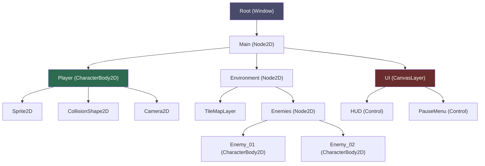

# Godot 4 Fundamentals

> [!abstract] TL;DR
> Godot 4 is a free, open-source engine where everything is a Node and games are trees of Nodes organized into Scenes. Signals provide decoupled event communication. The lightweight ~100MB download and MIT license make it ideal for indie developers and learning.

## Godot 4 Overview

Godot 4 is an open-source, cross-platform game engine released by the Godot Foundation, a nonprofit organization. Its defining traits set it apart from commercial competitors:

- **MIT license**: ship commercial games for free. Zero royalties, no revenue share, no engine fee. You own your game completely.
- **~100MB download**: the entire editor with all tools, templates, and documentation fits in roughly 100MB, compared to Unity's multi-gigabyte installer and Unreal's 60+ GB installation. This makes it fast to try and easy to run on modest hardware.
- **Multiple scripting options**: GDScript (Python-like, designed for fast iteration), C# (for developers coming from Unity or needing .NET ecosystem access), and C++ via GDExtension (for performance-critical native plugins).
- **First-class web export**: games can be exported to WebGL/WebAssembly and run in the browser without plugins. Mobile (iOS, Android), desktop (Windows, macOS, Linux), and console exports are also supported.
- **Editor is a Godot project**: the Godot editor is itself built with Godot. This means the editor's UI is made of the same Nodes, Scenes, and scripts you use in your game — a uniquely self-referential and educational design.
- **Godot Foundation (nonprofit)**: governed by a community foundation, not a VC-funded corporation. Engine direction is driven by community proposals (GDEPs) rather than investor priorities.

## Everything Is a Node

The most important concept in Godot is the **Node**. Everything in your game is a Node:

- **Node**: the fundamental building block. Has a name, can have child nodes, and can run scripts. Provides lifecycle callbacks: `_ready()`, `_process()`, `_input()`, etc.
- **Scene**: a saved tree of nodes stored as a `.tscn` (text) or `.scn` (binary) file. A Scene is a reusable template — you can instance the same Scene multiple times (multiple enemies, multiple bullets).
- **Scene Tree**: the live hierarchy of all currently active scenes. There is one Root node, and everything branches from it.

Composition is preferred over inheritance. Instead of `class Player extends HumanoidCharacter extends MovableEntity`, you build a Player scene from composable nodes: CharacterBody2D + Sprite2D + CollisionShape2D + Camera2D + AnimationPlayer. Each node does one thing well.

The hierarchy of built-in node types reflects this philosophy:

```
Node (base)
├── Node2D         ← 2D spatial base, has Transform2D
│   ├── Sprite2D
│   ├── AnimatedSprite2D
│   ├── CollisionObject2D
│   │   ├── Area2D
│   │   └── PhysicsBody2D
│   │       ├── StaticBody2D
│   │       ├── RigidBody2D
│   │       └── CharacterBody2D
│   └── Camera2D
├── Node3D         ← 3D spatial base, has Transform3D
│   ├── MeshInstance3D
│   ├── Camera3D
│   └── DirectionalLight3D
└── Control        ← UI base
    ├── Label
    ├── Button
    └── ProgressBar
```

## Key Node Types

Understanding which node to reach for is one of the most important skills when starting with Godot. Here are the essential types for 2D games:

| Node | Purpose |
|------|---------|
| **Node2D** | Base for all 2D nodes with a transform (position, rotation, scale). Has no visual or physics by default. |
| **Sprite2D** | Draws a texture. Set the `texture` property to an image resource. |
| **AnimatedSprite2D** | Frame-based animation. Uses `SpriteFrames` resource that holds named animation sequences. |
| **Area2D** | Detects overlaps and entering/exiting with other CollisionObjects. Has NO physics simulation — does not move or push other objects. Perfect for triggers (door zones, damage zones, item pickups). |
| **StaticBody2D** | A physics body that does not move. Used for floors, walls, and platforms. |
| **RigidBody2D** | Fully physics-simulated body. Engine controls movement based on forces, gravity, and collisions. Good for crates, barrels, debris. |
| **CharacterBody2D** | Kinematic body for player-controlled or scripted movement. Use `move_and_slide()` for collision-resolved movement. The standard for player characters and enemies. |
| **CollisionShape2D** | Must be a child of a physics body or Area2D. Holds a `Shape2D` resource (RectangleShape2D, CircleShape2D, CapsuleShape2D) that defines the collision boundary. |
| **Camera2D** | Follows a node, supports smooth lag, limits, and zoom. The viewport renders whatever the current Camera2D sees. |
| **TileMapLayer** | Renders a level from a tile set. Each cell is a tile from a `TileSet` resource. Supports physics layers, custom data, and animated tiles. |

## Signals

Signals are Godot's built-in event system and one of its most powerful features. They provide **decoupled communication**: a node can emit a signal without knowing or caring who is listening. Any number of other nodes can connect to that signal and respond.

This is far superior to direct method calls for most inter-node communication because:
1. The sender does not need a reference to the receiver.
2. Adding or removing listeners requires no changes to the sender.
3. The dependency graph stays clean — nodes point inward (to their children), not outward (to arbitrary other nodes).

```gdscript
# In Player.gd — define and emit signals
extends CharacterBody2D

signal health_changed(new_health: int)  # Godot 4 typed signal
signal player_died

var health: int = 100

func take_damage(amount: int) -> void:
    health -= amount
    health_changed.emit(health)       # Godot 4 emit syntax
    if health <= 0:
        player_died.emit()

# In HUD.gd — connect and respond to signals
extends CanvasLayer

@onready var health_bar: ProgressBar = $HealthBar
@onready var player: CharacterBody2D = $"../Player"

func _ready() -> void:
    player.health_changed.connect(_on_health_changed)
    player.player_died.connect(_on_player_died)

func _on_health_changed(new_hp: int) -> void:
    health_bar.value = new_hp

func _on_player_died() -> void:
    $GameOverScreen.show()
```

Godot also provides many built-in signals on nodes: `Area2D.body_entered`, `Button.pressed`, `Timer.timeout`, `AnimationPlayer.animation_finished`. Connect them in the editor (Node panel → Signals tab) or in code.

## Lifecycle Methods

Every node has access to lifecycle callbacks. You override them in your script to add behavior:

```gdscript
extends Node2D

func _init() -> void:
    # Called before the node enters the scene tree.
    # Equivalent to a constructor. Avoid accessing other nodes here
    # because the tree is not ready yet.
    pass

func _ready() -> void:
    # Called when this node (and all its children) have entered the scene tree.
    # This is the standard place to initialize: get node references,
    # connect signals, load data. Equivalent to Unity's Start().
    pass

func _process(delta: float) -> void:
    # Called every rendered frame. `delta` is seconds since last frame.
    # Use for: input handling, visual updates, non-physics movement.
    # Frame rate dependent — always multiply by delta for consistent behavior.
    pass

func _physics_process(delta: float) -> void:
    # Called at a fixed physics timestep (default 60Hz, configurable in
    # Project Settings). Delta is constant (1/60 ≈ 0.01667).
    # Use for: physics movement, collision checks, velocity updates.
    # CharacterBody2D.move_and_slide() must be called here.
    pass

func _input(event: InputEvent) -> void:
    # Called for every input event (key press, mouse click, gamepad button).
    # Stops propagating up the tree if you call get_viewport().set_input_as_handled().
    pass

func _unhandled_input(event: InputEvent) -> void:
    # Like _input but only fires if no Control node consumed the event first.
    # Prefer this for gameplay input so UI elements can capture clicks first.
    pass

func _notification(what: int) -> void:
    # Low-level notification system. Useful for specific engine events.
    if what == NOTIFICATION_WM_CLOSE_REQUEST:
        # Window close button pressed
        get_tree().quit()
```

## Groups

Groups are a tag-based system for querying and messaging multiple nodes at once. A node can belong to any number of groups. Add nodes to groups in the editor (Node panel → Groups tab) or in code.

```gdscript
# Adding to a group
add_to_group("enemies")
add_to_group("damageable")

# Remove from group
remove_from_group("enemies")

# Check membership
if is_in_group("enemies"):
    print("I am an enemy")

# Query all nodes in a group from anywhere in the tree
var enemies: Array[Node] = get_tree().get_nodes_in_group("enemies")
for enemy in enemies:
    enemy.alert_to_player(player.global_position)

# Call a method on ALL nodes in a group (fire and forget, no return value)
get_tree().call_group("enemies", "alert_to_player", player.global_position)

# Deferred call (safe during physics step)
get_tree().call_group_flags(SceneTree.GROUP_CALL_DEFERRED, "damageable", "update_ui")
```

Groups are ideal for: alerting all enemies when a player is spotted, applying area-of-effect damage to all `"damageable"` nodes, pausing all `"pauseable"` nodes simultaneously.

## Scene Tree Structure



## Common Pitfalls

- **Accessing `$NodePath` before `_ready()`**: Node references via `$` are not valid until the node has entered the scene tree. Never access child nodes in `_init()`. Use `_ready()` or `@onready`.
- **Connecting signals multiple times**: calling `.connect()` twice on the same signal/callable pair creates two listeners and fires the handler twice. Check with `.is_connected()` or use `connect()` in `_ready()` only (which runs once).
- **Calling `free()` instead of `queue_free()`**: `free()` immediately destroys the node mid-frame, which can crash if other code still holds a reference. Always use `queue_free()` — it defers deletion to the end of the frame.
- **Confusing Area2D with physics bodies**: Area2D detects overlaps but does not physically block movement. To make a floor the player stands on, use StaticBody2D. Area2D is for triggers, pickups, and detection zones only.
- **Scene instancing order**: when a scene is instanced at runtime (`load("res://...").instantiate()`), its children's `_ready()` methods fire bottom-up (deepest child first, then parent). Don't assume a parent's `_ready()` has run when a child's runs.

## Review Questions

1. What is the difference between a Node and a Scene in Godot? How does a Scene relate to instancing?
2. Why are Signals preferred over direct method calls for inter-node communication? What problem do they solve architecturally?
3. What is the difference between `_process(delta)` and `_physics_process(delta)`? When should each be used, and why does physics code belong in the physics callback?

## Related Concepts

- [[_MOC_Game_Development_Master|↑ Game Development MOC]]

#GameDev
