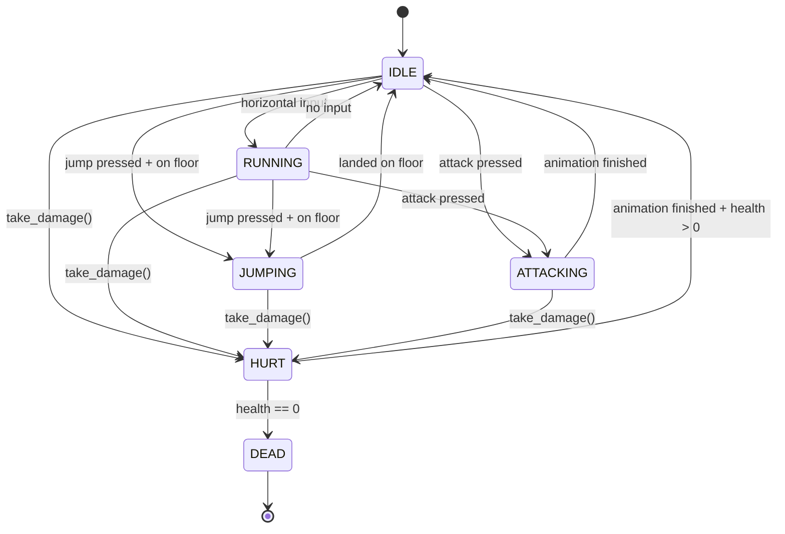

# Godot Game Systems

> [!abstract] TL;DR
> CharacterBody2D with move_and_slide is the foundation for 2D platformers. TileMapLayer handles level creation. AnimationPlayer drives complex sequences while Tween handles simple property animations. A state machine pattern in GDScript keeps character logic maintainable.

## CharacterBody2D Movement

`CharacterBody2D` is the standard node for player characters and scripted-movement enemies in 2D. Unlike `RigidBody2D` (which the physics engine controls), you drive `CharacterBody2D` by setting its `velocity` each physics frame and calling `move_and_slide()`.

`move_and_slide()` handles all collision resolution: it moves the body by its velocity, detects collisions, and slides along surfaces. It also updates `is_on_floor()`, `is_on_wall()`, and `is_on_ceiling()` automatically.

```gdscript
extends CharacterBody2D

@export var speed: float = 200.0
@export var jump_velocity: float = -400.0   # negative = upward (Y axis points DOWN)
@export var coyote_time: float = 0.1        # seconds player can jump after leaving platform

# Fetch gravity from project settings — keeps physics consistent
var gravity: float = ProjectSettings.get_setting("physics/2d/default_gravity")
var coyote_timer: float = 0.0

func _physics_process(delta: float) -> void:
    # --- Gravity ---
    if not is_on_floor():
        velocity.y += gravity * delta
        coyote_timer = max(0.0, coyote_timer - delta)
    else:
        velocity.y = 0.0      # reset vertical velocity when grounded
        coyote_timer = coyote_time

    # --- Jump ---
    # Coyote time: allow jump briefly after walking off a ledge
    if Input.is_action_just_pressed("jump") and coyote_timer > 0.0:
        velocity.y = jump_velocity
        coyote_timer = 0.0

    # Jump buffering: queue jump input slightly before landing
    # (implement with a separate timer for full polish)

    # --- Horizontal Movement ---
    var direction: float = Input.get_axis("move_left", "move_right")
    if direction != 0.0:
        velocity.x = direction * speed
        $Sprite2D.flip_h = direction < 0.0    # face correct direction
    else:
        # Decelerate to 0 without sliding (move_toward is frame-independent)
        velocity.x = move_toward(velocity.x, 0.0, speed)

    move_and_slide()    # applies velocity, handles collision, updates is_on_floor()

    # Post-move checks
    if is_on_wall() and not is_on_floor():
        _handle_wall_slide()

func _handle_wall_slide() -> void:
    velocity.y = min(velocity.y, 50.0)    # limit fall speed while wall sliding
```

## Collision Layers and Masks

Godot has 32 collision layers. Every `CollisionObject2D` (Area2D, StaticBody2D, RigidBody2D, CharacterBody2D) has:
- **Layer**: "I exist on layer X" — which layers this object occupies.
- **Mask**: "I detect objects on layer X" — which layers this object cares about.

A typical setup:

| Layer # | Name | Used by |
|---------|------|---------|
| 1 | World | StaticBody2D (floors, walls) |
| 2 | Player | Player CharacterBody2D |
| 3 | Enemies | Enemy CharacterBody2D |
| 4 | PlayerProjectiles | Player bullets/attacks |
| 5 | EnemyProjectiles | Enemy bullets/attacks |
| 6 | Triggers | Area2D trigger zones |

An enemy hitbox Area2D: `collision_layer = 3 (Enemy), collision_mask = 4 (PlayerProjectiles)`. This Area2D fires `body_entered` only when a player projectile enters it — enemy projectiles and the world are ignored.

```gdscript
# Set collision layers via code using bit flags
func setup_collision() -> void:
    # Player body: layer 2, detects World (1) + Enemies (3) + EnemyProjectiles (5)
    collision_layer = 0b000010      # bit 2 = layer 2
    collision_mask  = 0b010101      # bits 1, 3, 5

    # Player hitbox Area2D: layer 2, detects only EnemyProjectiles (5)
    $HitboxArea.collision_layer = 0b000010
    $HitboxArea.collision_mask  = 0b010000

    # Simpler: set by layer number (1-indexed)
    set_collision_layer_value(2, true)
    set_collision_mask_value(1, true)

# Connecting Area2D signals
func _ready() -> void:
    $HitboxArea.body_entered.connect(_on_hitbox_body_entered)
    $HitboxArea.area_entered.connect(_on_hitbox_area_entered)

func _on_hitbox_body_entered(body: Node2D) -> void:
    if body.is_in_group("enemy_projectiles"):
        take_damage(body.damage)
        body.queue_free()
```

## AnimationPlayer and Tween

Godot provides two complementary animation systems:

**AnimationPlayer**: timeline-based, can animate any property on any node. Stores named animations (`.play("walk")`, `.play("attack")`). Can call methods at keyframe points. Best for complex multi-track sequences (animate position + sprite frame + particle burst + sound cue simultaneously).

**Tween**: code-driven, procedural property animation. Created at runtime, no editor setup. Best for simple one-off transitions (UI slide in, object flash red, fade out on death).

```gdscript
extends CharacterBody2D

@onready var anim: AnimationPlayer = $AnimationPlayer
@onready var sprite: Sprite2D = $Sprite2D

# ---- AnimationPlayer examples ----

func update_animation() -> void:
    if not is_on_floor():
        if velocity.y < 0:
            anim.play("jump_rise")
        else:
            anim.play("jump_fall")
    elif abs(velocity.x) > 10.0:
        anim.play("run")
    else:
        anim.play("idle")

func play_attack() -> void:
    anim.play("attack")
    await anim.animation_finished    # suspend coroutine until animation completes
    # Continue code after animation
    $AttackHitbox.monitoring = false

# Cross-fade between animations smoothly
func transition_to_hurt() -> void:
    anim.play("hurt", -1, 1.0, false)   # blend time = 0.1 seconds
    # or use anim.play_with_capture()

# ---- Tween examples ----

func death_animation() -> void:
    # create_tween() automatically adds tween to scene tree, no cleanup needed
    var tween: Tween = create_tween()
    tween.set_parallel(false)                        # chain sequentially
    tween.tween_property(self, "modulate:a", 0.0, 0.5).set_ease(Tween.EASE_IN)
    tween.tween_property(self, "scale", Vector2.ZERO, 0.3).set_ease(Tween.EASE_IN)
    tween.tween_callback(queue_free)                 # called after all tweens complete

# Bounce effect using sequential tweens
func bounce_item_pickup() -> void:
    var tween: Tween = create_tween().set_trans(Tween.TRANS_BOUNCE)
    tween.tween_property(sprite, "position:y", -20.0, 0.2).set_ease(Tween.EASE_OUT)
    tween.tween_property(sprite, "position:y", 0.0, 0.3).set_ease(Tween.EASE_IN)

# Parallel tweens — run simultaneously
func flash_damage() -> void:
    var tween: Tween = create_tween().set_parallel(true)
    tween.tween_property(sprite, "modulate", Color.RED, 0.05)
    tween.tween_property(self, "position", position + Vector2(5, 0), 0.05)
    # Chain a sequential second phase after parallel completes
    tween.chain().tween_property(sprite, "modulate", Color.WHITE, 0.1)
    tween.chain().tween_property(self, "position", position, 0.1)
```

## TileMapLayer for 2D Levels

Godot 4.3+ uses `TileMapLayer` nodes (the older `TileMap` with multiple layers is deprecated). Each `TileMapLayer` has a `TileSet` resource that defines tiles from an atlas texture.

Key concepts:
- **TileSet**: the shared resource defining all possible tiles (texture atlas, physics shapes, custom data, animation).
- **Atlas**: a sprite sheet image; tiles are defined as regions within it.
- **Physics layers on tiles**: automatically generate collision shapes per tile pattern.
- **Custom data layers**: add arbitrary typed data to tiles (e.g., `tile_type: int`, `is_slippery: bool`, `damage_per_second: float`).

```gdscript
extends Node2D

@onready var ground_layer: TileMapLayer = $GroundLayer
@onready var decoration_layer: TileMapLayer = $DecorationLayer

# Convert world position to tile cell coordinates
func get_tile_at_world_pos(world_pos: Vector2) -> Vector2i:
    return ground_layer.local_to_map(ground_layer.to_local(world_pos))

# Read custom data from a tile (e.g., for hazards or terrain effects)
func get_tile_damage(world_pos: Vector2) -> float:
    var cell: Vector2i = get_tile_at_world_pos(world_pos)
    var tile_data: TileData = ground_layer.get_cell_tile_data(cell)
    if tile_data == null:
        return 0.0
    return tile_data.get_custom_data("damage_per_second")

# Place or remove tiles at runtime (procedural generation, destruction)
func break_tile(world_pos: Vector2) -> void:
    var cell: Vector2i = get_tile_at_world_pos(world_pos)
    ground_layer.erase_cell(cell)          # remove tile
    spawn_debris_particles(world_pos)

func place_tile(cell: Vector2i, source_id: int, atlas_coords: Vector2i) -> void:
    ground_layer.set_cell(cell, source_id, atlas_coords)

# Find all cells using a specific tile (e.g., spawn points marked with a tile)
func find_spawn_points() -> Array[Vector2]:
    var spawn_cells: Array[Vector2i] = ground_layer.get_used_cells_by_id(
        spawn_source_id, spawn_atlas_coords
    )
    return spawn_cells.map(func(cell: Vector2i) -> Vector2:
        return ground_layer.map_to_local(cell)
    )
```

## State Machine Pattern

As character behavior grows beyond walk/jump, nested `if` statements become unmaintainable. A state machine pattern isolates each behavior into its own function. Transitions are explicit and debuggable.

```gdscript
extends CharacterBody2D

# ---- State Machine ----
enum State { IDLE, RUNNING, JUMPING, ATTACKING, HURT, DEAD }
var state: State = State.IDLE
var previous_state: State = State.IDLE

@export var speed: float = 200.0
@export var jump_velocity: float = -400.0
@export var damage: int = 10

var gravity: float = ProjectSettings.get_setting("physics/2d/default_gravity")
var health: int = 100

@onready var anim: AnimationPlayer = $AnimationPlayer
@onready var hitbox: Area2D = $AttackHitbox

func _physics_process(delta: float) -> void:
    match state:
        State.IDLE:     _state_idle(delta)
        State.RUNNING:  _state_running(delta)
        State.JUMPING:  _state_jumping(delta)
        State.ATTACKING: _state_attacking(delta)
        State.HURT:     _state_hurt(delta)
        State.DEAD:     pass    # no movement while dead

func _state_idle(_delta: float) -> void:
    anim.play("idle")
    apply_gravity(_delta)
    var dir: float = Input.get_axis("move_left", "move_right")
    if dir != 0.0:
        transition_to(State.RUNNING)
    elif Input.is_action_just_pressed("jump") and is_on_floor():
        transition_to(State.JUMPING)
    elif Input.is_action_just_pressed("attack"):
        transition_to(State.ATTACKING)

func _state_running(delta: float) -> void:
    anim.play("run")
    apply_gravity(delta)
    var dir: float = Input.get_axis("move_left", "move_right")
    velocity.x = dir * speed
    if dir == 0.0:
        transition_to(State.IDLE)
    elif Input.is_action_just_pressed("jump") and is_on_floor():
        transition_to(State.JUMPING)
    elif Input.is_action_just_pressed("attack"):
        transition_to(State.ATTACKING)
    move_and_slide()

func _state_jumping(delta: float) -> void:
    apply_gravity(delta)
    var dir: float = Input.get_axis("move_left", "move_right")
    velocity.x = dir * speed
    if is_on_floor():
        transition_to(State.IDLE)
    move_and_slide()

func _state_attacking(_delta: float) -> void:
    # Animation drives the attack; transition back when it finishes
    # (set via AnimationPlayer method track or check is_playing)
    if not anim.is_playing():
        transition_to(State.IDLE)

func _state_hurt(_delta: float) -> void:
    if not anim.is_playing():
        if health <= 0:
            transition_to(State.DEAD)
        else:
            transition_to(State.IDLE)

func transition_to(new_state: State) -> void:
    previous_state = state
    state = new_state
    # Run entry logic for the new state
    match new_state:
        State.JUMPING:
            velocity.y = jump_velocity
            anim.play("jump_rise")
        State.ATTACKING:
            anim.play("attack")
            hitbox.monitoring = true
            await anim.animation_finished
            hitbox.monitoring = false
            if state == State.ATTACKING:   # check we weren't interrupted
                transition_to(State.IDLE)
        State.HURT:
            anim.play("hurt")
        State.DEAD:
            anim.play("death")
            await anim.animation_finished
            queue_free()

func apply_gravity(delta: float) -> void:
    if not is_on_floor():
        velocity.y += gravity * delta

func take_damage(amount: int) -> void:
    if state == State.DEAD: return
    health -= amount
    if health <= 0:
        health = 0
        transition_to(State.DEAD)
    else:
        transition_to(State.HURT)
```

## Save/Load with FileAccess

```gdscript
extends Node

const SAVE_PATH: String = "user://save.json"
# "user://" maps to: 
#   Windows: %APPDATA%/Godot/app_userdata/<project_name>/
#   macOS: ~/Library/Application Support/Godot/<project_name>/
#   Linux: ~/.local/share/godot/app_userdata/<project_name>/
# "res://" is read-only at runtime (embedded in exported builds)

func save_game(player: CharacterBody2D) -> void:
    var data: Dictionary = {
        "version": 2,
        "timestamp": Time.get_datetime_string_from_system(),
        "player": {
            "position_x": player.global_position.x,
            "position_y": player.global_position.y,
            "health": player.health,
            "score": GameManager.score,
        },
        "inventory": player.inventory.map(func(item: Item) -> String:
            return item.resource_path
        ),
        "unlocked_areas": player.unlocked_areas,
    }
    var file: FileAccess = FileAccess.open(SAVE_PATH, FileAccess.WRITE)
    if file == null:
        push_error("Could not open save file: " + error_string(FileAccess.get_open_error()))
        return
    file.store_string(JSON.stringify(data, "\t"))
    # file is automatically closed when it goes out of scope (RAII)

func load_game() -> Dictionary:
    if not FileAccess.file_exists(SAVE_PATH):
        return {}
    var file: FileAccess = FileAccess.open(SAVE_PATH, FileAccess.READ)
    if file == null:
        return {}
    var result: Variant = JSON.parse_string(file.get_as_text())
    if not result is Dictionary:
        push_error("Corrupt save file")
        return {}
    return result

func apply_save(data: Dictionary, player: CharacterBody2D) -> void:
    if data.is_empty(): return
    player.global_position = Vector2(
        data.player.position_x,
        data.player.position_y
    )
    player.health = data.player.health
    GameManager.score = data.player.score
    for resource_path in data.inventory:
        var item: Item = load(resource_path) as Item
        if item: player.inventory.append(item)
```

## State Machine Transition Diagram



## Common Pitfalls

- **Using `position` instead of `global_position`**: if a node has a parent with a non-zero transform, `position` is relative to the parent. Use `global_position` when comparing positions across different branch nodes (e.g., player vs enemy distance checks).
- **Forgetting to call `move_and_slide()`**: setting `velocity` alone does nothing — the body only moves when `move_and_slide()` is called. It must be called every physics frame to take effect.
- **`await` on `animation_finished` without validity check**: if the node is freed (e.g., the enemy dies mid-animation) while a coroutine is awaiting `animation_finished`, the coroutine resumes on a freed object and crashes. Guard with `if not is_instance_valid(self): return` or use `anim.animation_finished.connect(...)` instead of `await`.
- **TileMap vs TileMapLayer API mismatch**: Godot 4.0–4.2 uses the `TileMap` node. Godot 4.3+ deprecates it in favor of `TileMapLayer`. The APIs are similar but not identical (`get_cell_tile_data` signature differs). Check your Godot version before copying examples.
- **State machine re-entry without guard**: calling `transition_to(State.ATTACKING)` while already in `State.ATTACKING` restarts the attack animation. Guard transitions: `if state == new_state: return` at the top of `transition_to()` if re-entry is undesirable.

## Review Questions

1. What does `move_and_slide()` return and what does it handle automatically? What would happen if you set `velocity` but never called it?
2. Why is a state machine pattern better than nested if/else for character behavior? What specific problems does it solve as complexity grows?
3. What is the difference between `user://` and `res://` path prefixes in Godot? Why can't you write to `res://` in an exported game?

## Related Concepts

- [[_MOC_Game_Development_Master|↑ Game Development MOC]]

#GameDev
