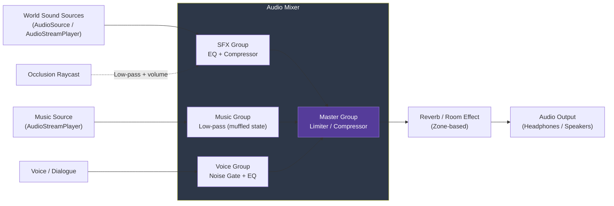

# Game Audio and Sound Design

> [!abstract] TL;DR
> Game audio spans spatial 3D sound, dynamic music systems, and middleware (FMOD/Wwise) for complex audio mixing. Understanding diegetic vs non-diegetic sound, audio occlusion, and compression formats helps build immersive soundscapes that enhance gameplay without dominating the mix.

## Spatial (3D) Audio

Spatial audio gives sound a physical location in the game world, letting players use hearing to locate threats, objects, and events. The fundamental property is **attenuation**: volume decreases with distance.

**Attenuation models:**
- **Linear**: volume decreases proportionally with distance. Predictable but unnatural (`v = 1 - dist/maxDist`).
- **Inverse square (physically accurate)**: volume drops by 1/r² as in the real world. Sounds quiet too quickly for gameplay purposes.
- **Logarithmic (perceptually accurate)**: matches how human hearing perceives loudness. The default in most engines. Best for immersion.
- **Custom curve**: artist-defined rolloff curve per sound. Full control for gameplay tuning (footsteps heard further, gunshots heard very far).

**Spatialization (panning):**
- Stereo panning: balance L/R based on horizontal angle to listener. Simple, low CPU.
- HRTF (Head-Related Transfer Function): applies a frequency-domain filter modeling how sound reflects off the pinna (outer ear) for full 3D positional audio including elevation. Critical for headphone VR audio. High CPU cost; usually optional.

**Parameters in Unity AudioSource:**
- `Min Distance`: within this radius, volume is always 1.0 (full).
- `Max Distance`: beyond this radius, volume reaches 0 (or the rolloff curve's minimum).
- `Spatial Blend`: 0 = fully 2D (no spatialization, ignores position), 1 = fully 3D. Use 0 for UI/music, 1 for world sounds, 0.8 for ambient sounds with slight directionality.
- `Doppler Level`: 0 = no Doppler effect, 1 = physically accurate pitch shift for moving sources.

## Unity Audio Setup

```csharp
using UnityEngine;

public class PlayerAudio : MonoBehaviour {
    [Header("References")]
    [SerializeField] private AudioSource mainSource;        // for continuous/looping audio
    [SerializeField] private AudioSource footstepSource;    // separate source for footsteps

    [Header("SFX Clips")]
    [SerializeField] private AudioClip[] footstepSounds;    // array for randomization
    [SerializeField] private AudioClip jumpSound;
    [SerializeField] private AudioClip landSound;
    [SerializeField] private AudioClip shootSound;
    [SerializeField] private AudioClip reloadSound;
    [SerializeField] private AudioClip[] hurtSounds;

    [Header("Settings")]
    [SerializeField] private float footstepInterval = 0.4f;
    private float footstepTimer = 0f;

    void Update() {
        if (IsMovingOnGround()) {
            footstepTimer -= Time.deltaTime;
            if (footstepTimer <= 0f) {
                PlayFootstep();
                footstepTimer = footstepInterval;
            }
        }
    }

    void PlayFootstep() {
        if (footstepSounds.Length == 0) return;
        // Random clip selection prevents repetition fatigue
        AudioClip clip = footstepSounds[Random.Range(0, footstepSounds.Length)];
        // Pitch variation: 5–10% makes footsteps sound natural
        footstepSource.pitch = Random.Range(0.92f, 1.08f);
        // PlayOneShot: plays without interrupting other one-shots, no AudioSource.clip overwrite
        footstepSource.PlayOneShot(clip, 0.6f);   // volumeScale: 60% of source volume
    }

    public void PlayShoot() {
        mainSource.pitch = Random.Range(0.97f, 1.03f);
        mainSource.PlayOneShot(shootSound, 1.0f);
    }

    public void PlayHurt() {
        if (hurtSounds.Length == 0) return;
        var clip = hurtSounds[Random.Range(0, hurtSounds.Length)];
        mainSource.PlayOneShot(clip, 0.9f);
    }

    // For fire-and-forget sounds at a world position (no AudioSource required)
    public static void PlayImpact(AudioClip impactClip, Vector3 worldPos) {
        AudioSource.PlayClipAtPoint(impactClip, worldPos, 1.0f);
        // Internally creates a temporary AudioSource, plays it, then destroys the GO
    }

    bool IsMovingOnGround() {
        // Implement based on your character controller
        return true;
    }
}

// Audio Mixer routing example
public class AudioMixerController : MonoBehaviour {
    [SerializeField] private UnityEngine.Audio.AudioMixer masterMixer;

    public void SetMusicVolume(float sliderValue) {
        // Slider range: 0.0001–1.0 (avoids -infinity dB at 0)
        masterMixer.SetFloat("MusicVolume", Mathf.Log10(sliderValue) * 20);
    }

    public void SetSFXVolume(float sliderValue) {
        masterMixer.SetFloat("SFXVolume", Mathf.Log10(sliderValue) * 20);
    }

    public void TriggerCombatSnapshot() {
        // Snapshots: preset AudioMixer states (e.g., duck music, boost SFX)
        // Transition over 0.5 seconds
        masterMixer.FindSnapshot("CombatMix").TransitionTo(0.5f);
    }

    public void TriggerPeaceSnapshot() {
        masterMixer.FindSnapshot("DefaultMix").TransitionTo(2.0f);
    }
}
```

## Audio Middleware: FMOD and Wwise

Professional games with complex audio requirements use dedicated audio middleware rather than engine audio systems alone.

**FMOD Studio:**
- **Event-based**: audio designers create Events in FMOD Studio (a DAW-like authoring tool). Events contain audio logic — randomization, parameter-driven blending, multi-layer sounds.
- **Parameters**: real-time variables that drive audio mixing. `CombatIntensity` parameter blends between calm and intense music automatically.
- **Snapshots**: capture a mixer state (e.g., "UnderwaterMix" with heavy low-pass filter). Transition between snapshots smoothly.
- **Adaptive music**: timeline + parameters + transitions = music that responds to gameplay without developer intervention.
- **Licensing**: free for indie studios with < $200K USD revenue. Unity and Unreal official plugins available.

**Wwise (Audiokinetic):**
- Industry standard for AAA games. More complex authoring, more powerful.
- **States** (global): "MainMenu" vs "InGame" vs "Combat" — changes audio behavior globally.
- **Switches** (per-object): "CharacterOnGround" vs "CharacterInAir" — selects different assets per-object context.
- **RTPCs** (Real-Time Parameter Controls): continuous float values, e.g., `player_health` drives music tension; `engine_rpm` drives engine sound pitch.
- **Spatial audio with rooms and portals**: automatic occlusion/reverb based on room geometry.

```csharp
// FMOD Studio Unity integration example
using FMODUnity;
using FMOD.Studio;

public class MusicSystem : MonoBehaviour {
    [EventRef] public string explorationMusicEvent = "event:/Music/Exploration";
    [EventRef] public string combatMusicEvent = "event:/Music/Combat";

    private EventInstance musicInstance;

    void Start() {
        // Start exploration music
        musicInstance = RuntimeManager.CreateInstance(explorationMusicEvent);
        musicInstance.start();
    }

    // Call when entering combat
    public void OnCombatStart() {
        // Crossfade to combat music (FMOD handles the transition via its timeline logic)
        musicInstance.setParameterByName("CombatIntensity", 1.0f);
    }

    public void OnCombatEnd() {
        musicInstance.setParameterByName("CombatIntensity", 0.0f);
    }

    // Update RTPC every frame (e.g., drive music tension from player health)
    void Update() {
        float healthNormalized = (float)playerHealth / maxHealth;
        musicInstance.setParameterByName("PlayerHealthTension", 1.0f - healthNormalized);
    }

    void OnDestroy() {
        musicInstance.stop(FMOD.Studio.STOP_MODE.ALLOWFADEOUT);
        musicInstance.release();
    }
}

// One-shot SFX via FMOD (simplest usage)
public void PlayFootstepFMOD(string surfaceType) {
    var instance = RuntimeManager.CreateInstance("event:/SFX/Footstep");
    instance.setParameterByName("SurfaceType", surfaceType == "Grass" ? 0.0f : 1.0f);
    instance.set3DAttributes(RuntimeUtils.To3DAttributes(transform.position));
    instance.start();
    instance.release();   // released after playback completes automatically
}
```

## Dynamic Music Systems

Static looping background music is the minimum viable approach. Dynamic systems make the music respond to gameplay:

**Horizontal re-sequencing**: jump between music sections based on game state. An exploration cue transitions to a "danger stinger" when an enemy is nearby, then into a full combat loop, then a "victory sting" on kill, back to exploration. Each transition point is aligned to a musical bar or phrase.

**Vertical layering (stems)**: the music track is split into multiple simultaneous layers (stems). Layers are added or removed by fading them in/out:
- Stem 1 (always on): ambient pad, gentle melody.
- Stem 2 (enemies nearby): tension pulse, muted strings.
- Stem 3 (in combat): drums, full orchestra hit.
- Stem 4 (boss fight): heroic brass, choir.

**Stingers**: short musical accents triggered by events — chest opening, key item discovered, enemy spotted, level clear. They play over the current music without interrupting it.

**Interactive music via parameters (FMOD/Wwise)**: a single event contains all states; a float parameter (`CombatIntensity`: 0.0–1.0) crossfades between stems or sections in real time. The audio designer controls the crossfade curves; the programmer just sets the parameter value.

```csharp
// Godot 4 simple dynamic music with stems
public class DynamicMusicManager : Node {
    [Export] AudioStreamPlayer ambienceLayer;
    [Export] AudioStreamPlayer tensionLayer;
    [Export] AudioStreamPlayer combatLayer;

    float targetTension = 0.0f;
    float targetCombat = 0.0f;

    public override void _Process(double delta) {
        // Smoothly crossfade stem volumes
        float t = (float)delta * 2.0f;  // crossfade speed
        tensionLayer.VolumeDb = Mathf.Lerp(tensionLayer.VolumeDb,
            targetTension > 0 ? 0.0f : -80.0f, t);
        combatLayer.VolumeDb = Mathf.Lerp(combatLayer.VolumeDb,
            targetCombat > 0 ? 0.0f : -80.0f, t);
    }

    public void SetCombatIntensity(float intensity) {
        targetTension = intensity > 0.0f ? 1.0f : 0.0f;
        targetCombat = intensity > 0.5f ? 1.0f : 0.0f;
    }
}
```

## Audio Occlusion and Reverb

**Occlusion**: a wall between the listener and sound source reduces volume and removes high frequencies. The listener hears a muffled, quieter sound even at the same distance. Implementation:
- Raycast from listener to sound source; if it hits a wall, apply a low-pass filter (AudioMixer Effect in Unity, FMOD's built-in occlusion API, Wwise Obstruction/Occlusion RTPC).
- Simple version: cast one ray, 0 or 1 occlusion. Advanced: cast multiple rays, compute partial occlusion from hit ratio.

**Obstruction**: partial occlusion (doorway, half-wall). Partial high-frequency reduction.

**Reverb zones** (Unity `AudioReverbZone`): a trigger volume that applies reverb to all sounds heard within it. Presets: Cave (heavy reverb, long tail), Forest (small reverb, early reflections), Hallway (medium reverb, distinct echo), Outdoor (very small reverb).

**Unity Audio Mixer groups**: route different audio categories through separate mixer groups, each with its own effects chain:

```
Master
├── Music Group         → Compressor → Low-pass (during muffled states)
├── SFX Group           → EQ (cut harsh frequencies)
│   ├── Footsteps Group → Subtle reverb
│   ├── Gunshots Group  → Compressor (sidechain ducks music on fire)
│   └── UI Group        → No spatialization, no reverb
└── Voice Group         → EQ, noise gate, compression
```

## Sound Design Principles

**Diegetic sound**: exists within the game world. Characters can hear it. Examples: footsteps, gunshots, NPC dialogue, ambient wind, doors opening. Diegetic sound grounds the player in the world.

**Non-diegetic sound**: exists only for the player. Characters cannot hear it. Examples: background music, score jingles, narrator voiceover, UI click sounds, low health heartbeat effect.

**Layering**: complex sounds are built from 3–5 simpler sounds combined:
- Gunshot = mechanical click (action cycling) + chamber crack (gas expansion) + distant tail (reverberant echo) + sub-bass thump (physical impact feel).
- Explosion = primary shockwave (low percussive hit) + debris scatter (crackling mid-high frequencies) + rumble tail (bass rumble) + ambient reverb (room sense).

**Pitch variation + randomization**: playing the same footstep sound repeatedly is grating. Pitch variance of ±5–10% and a pool of 3–6 variants eliminates repetition fatigue while maintaining character.

**Sweetening**: adding sounds that enhance physical impact without realism — a deep sub-bass "whump" on sword swings, an electrical crackle on magic attacks. Players respond more viscerally to sweetened sounds even though they're physically inaccurate.

**Mix hierarchy**: the most critical audio (voice, action sound feedback) should dominate the mix. Background music should sit in a supporting role. Ducking (sidechain compression) automatically reduces music volume when important SFX or dialogue plays.

## Compression Formats

| Format | Quality | CPU Decode | Best For |
|--------|---------|------------|----------|
| **Vorbis (.ogg)** | Good | Medium | Default Godot format; music and long ambient loops |
| **Opus** | Better at low bitrate | Medium | Voice chat, compressed voice lines |
| **MP3** | Lower than Vorbis at same bitrate | Low | Legacy; avoid for new projects |
| **PCM/WAV** | Uncompressed (lossless) | None | Short SFX played very frequently (ui clicks, short loops) |
| **ADPCM** | Lossy but fast decode | Very low | Mobile games; high-frequency short SFX |

**Unity load type settings:**
- **Decompress On Load**: decompresses the entire clip into RAM at load time. Zero CPU during playback. Use for short SFX played frequently (gunshots, footsteps, UI sounds). RAM cost = clip duration × sample rate × channels × 4 bytes.
- **Compressed In Memory**: stored compressed, decompressed per-play. Best balance for medium-length clips. Use for most SFX.
- **Streaming**: reads from disk during playback. Zero RAM cost. Use for music and long ambient tracks (> 5 seconds). Small disk seek latency; not suitable for triggers requiring instant playback.

## Audio Signal Flow



## Common Pitfalls

- **Using Decompress On Load for large audio files**: a 3-minute music track at 44100Hz stereo PCM costs ~60MB RAM. Use Streaming for any clip longer than a few seconds.
- **Not setting Max Distance on AudioSources**: a gunshot with default Max Distance = infinity is audible across the entire level. Set Max Distance appropriately; sounds heard from unrealistic distances break immersion.
- **Not routing audio through an Audio Mixer**: without a mixer, players cannot independently control music and SFX volume. This is a basic accessibility requirement. Always route through a Mixer with at least Music, SFX, and Voice groups.
- **Abrupt scene-change music cuts**: transitioning to a new scene without fading out music creates a jarring cut. Fade music out over 0.3–1 second before the scene loads, or use a persistent audio node (DontDestroyOnLoad in Unity, Autoload in Godot).
- **Overusing reverb**: adding heavy reverb to every sound makes everything sound like it's in a cathedral. Reverb should be selective and tied to actual environment. Outdoors has almost no reverb; small rooms have tight early reflections; caves have long decay.

## Review Questions

1. What is the difference between diegetic and non-diegetic sound? Give a concrete example of each in a game you've played, and explain why the distinction matters for immersion.
2. What is vertical layering (stems) in dynamic music and how does it respond to gameplay events without requiring separate tracks for each game state?
3. When should you use Vorbis compression vs PCM/WAV for audio assets in a game? What factors determine the right choice?

## Related Concepts

- [[_MOC_Game_Development_Master|↑ Game Development MOC]]

#GameDev
