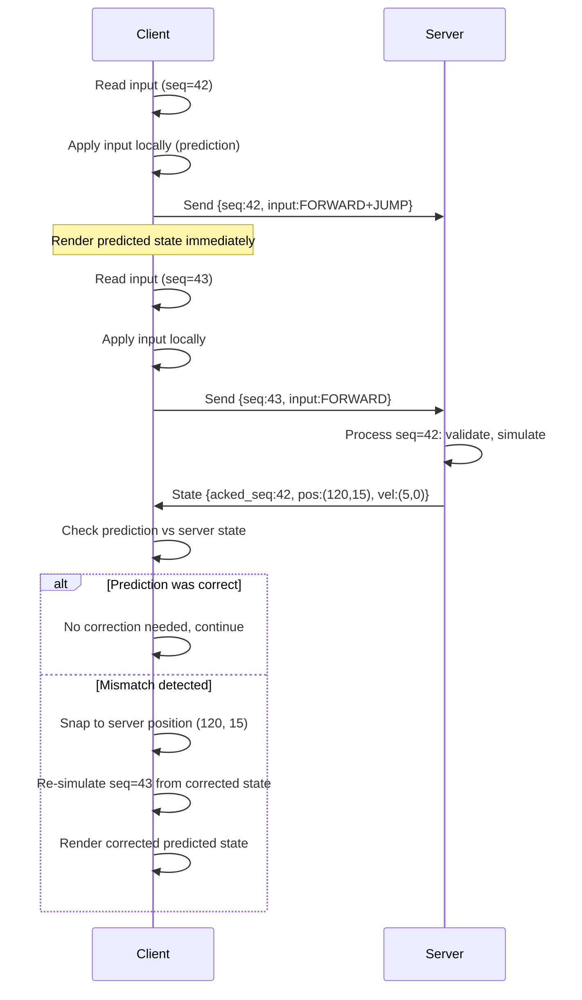

# Game Networking

> [!abstract] TL;DR
> Authoritative servers prevent cheating by making the server the source of truth. Client-side prediction hides latency. Rollback netcode (GGPO) is the gold standard for fighting games. Understanding UDP vs TCP, interpolation, and lag compensation is essential for any multiplayer game.

## Authoritative Server Architecture

In any competitive multiplayer game, the server must be the **authoritative source of truth**. The alternative — trusting clients — is fundamentally broken: any client-side modification can change the game's outcome, enabling teleportation, unlimited ammo, instant kills, and speed hacks.

**How authoritative servers work:**
1. Clients send **inputs** (key presses, mouse direction, actions) — never positions or game state.
2. The server runs the **canonical simulation**: it processes all inputs, advances the game state, and determines outcomes.
3. The server broadcasts **authoritative state** back to all clients.
4. Clients render the server's state, possibly with client-side prediction layered on top.

**Dedicated server vs. listen server (P2P with host):**
- Dedicated server: no player has the physical hosting machine. Equal latency fairness. Required for competitive games. Higher infrastructure cost.
- Listen server: one player also runs the server process. The host has ~0ms RTT, giving a significant unfair advantage. Simpler/cheaper to deploy. Acceptable for cooperative games.

**Client authority (anti-pattern)**: never trust a client with damage calculation, position validation, item spawning, or score incrementation. Even well-intentioned clients can be intercepted by proxies. All authoritative state must live on the server.

## Client-Side Prediction

With a 100ms round-trip time, waiting for server confirmation before showing movement makes the game feel unresponsive. Client-side prediction solves this: **apply the player's own input immediately on the client, then reconcile with the server's authoritative response**.

```
CLIENT PREDICTION LOOP (per frame):
1.  Read local input
2.  Save input with sequence_number
3.  Apply input to local simulation → update predicted position
4.  Send {sequence_number, input, timestamp} to server
5.  Receive server state {acked_sequence, authoritative_position, ...}
6.  Find saved state for acked_sequence in history buffer
7.  If predicted_position ≠ authoritative_position:
        a. Snap local state to authoritative_position
        b. Re-simulate all unacknowledged inputs (inputs after acked_sequence)
8.  Render from current predicted state
```

The critical insight: **reconciliation re-simulates all buffered inputs** from the corrected server state forward. This means the client instantly corrects without visible "snapping" most of the time — the re-simulation happens within the same frame.

Reconciliation triggers ("server correction") happen when:
- The client's physics diverges from the server (floating point differences, lag spike, packet loss).
- An anti-cheat detects an anomalous client position.
- Another player's action changes the outcome (explosion pushes player to a different position than predicted).

```csharp
// Unity client prediction sketch
public class PlayerController : MonoBehaviour {
    private Queue<InputState> inputHistory = new Queue<InputState>();
    private int sequenceNumber = 0;
    
    void Update() {
        var input = new InputState {
            sequence = sequenceNumber++,
            moveX = Input.GetAxis("Horizontal"),
            jump = Input.GetButtonDown("Jump"),
            timestamp = Time.time
        };
        
        // Apply locally (prediction)
        ApplyInput(input);
        inputHistory.Enqueue(input);
        
        // Send to server
        networkClient.Send(input);
    }
    
    void OnServerState(ServerState state) {
        // Remove acknowledged inputs from history
        while (inputHistory.Count > 0 && inputHistory.Peek().sequence <= state.ackedSequence)
            inputHistory.Dequeue();
        
        // Check for mismatch (tolerate small epsilon for float drift)
        if (Vector3.Distance(transform.position, state.position) > 0.1f) {
            // Correction: snap and re-simulate
            transform.position = state.position;
            foreach (var input in inputHistory) {
                ApplyInput(input);   // re-simulate all pending inputs
            }
        }
    }
    
    void ApplyInput(InputState input) {
        // Deterministic physics application
        Vector3 velocity = new Vector3(input.moveX * speed, rb.velocity.y, 0);
        if (input.jump && IsGrounded()) velocity.y = jumpForce;
        rb.velocity = velocity;
    }
}
```

## Lag Compensation

In a networked game, clients render the world at a point in the past relative to the server — they interpolate between received server snapshots. A player fires at an enemy's rendered position, but that rendered position is 50–150ms behind the server's current time.

**Lag compensation** (also called "rewind and replay"): when the server processes a shooting event, it **rolls back the game state to the timestamp of the client's fire**, evaluates the hit at that historical time, then continues with the present state.

This gives the benefit of the doubt to the shooter: if they aimed correctly at what they saw on their screen, the server confirms the hit even though the target has moved since then. Used in: Valve Source Engine, Unreal Engine's shooter template, every major FPS engine.

The trade-off: high-latency players (200ms+) may appear to shoot through cover from the victim's perspective ("getting shot around corners"). The victim was safely behind cover from their own view, but lag compensation confirmed the hit using the historical state where they were exposed.

Most competitive games cap lag compensation at 200ms. Players with ping > 200ms get no extra compensation, forcing them to lead their shots manually.

## Rollback Netcode (GGPO)

Rollback netcode is used in games where **precise synchronization and instant input response are critical** — primarily fighting games, but also some real-time strategy and platformer multiplayer games.

**Key idea**: both clients simulate ahead using **predicted inputs** for remote players (usually: "repeat their last known input"). When the true input arrives and differs from the prediction, **roll back to the last confirmed state and fast-forward** through the corrected simulation.

```
ROLLBACK NETCODE LOOP (per frame, 2-player fighting game):
Frame N:
  - Local input: received ✓
  - Remote input for frame N: NOT YET RECEIVED (35ms behind)
  - Predict remote input: copy frame N-1's remote input
  - Simulate frame N with {local_input, predicted_remote_input}
  - Render frame N

Frame N+2:
  - Remote input for frame N arrives (was delayed)
  - Compare with prediction: MISMATCH (remote pressed jump, we predicted walk)
  - Roll back to confirmed state (frame N-1)
  - Re-simulate frame N with {local_input_N, TRUE_remote_input_N}
  - Re-simulate frame N+1, N+2 (fast-forward)
  - Render corrected state for frame N+2
```

**Requirements for rollback to work:**
- **Deterministic simulation**: given the same inputs and initial state, both machines produce identical output. This means: no `Random.value` without shared seeds, no floating-point non-determinism (use fixed-point math or identical hardware), no frame-rate-dependent physics.
- **Save/load state**: the game state must be snapshot-able and restorable in microseconds. Character positions, animations, physics velocities, projectile states — all must be serializable.
- **Fast simulation**: re-simulating 8 frames per rendered frame means the game logic runs at 8× speed for those frames. Expensive simulations (complex physics, large particle systems) make rollback prohibitive.

**GGPO** (Good Game Peace Out) is the open-source rollback networking library. Used in: Street Fighter IV, Mortal Kombat 11, Guilty Gear Strive, Skullgirls.

## Interpolation and Extrapolation

Remote players' positions arrive in discrete server snapshots (e.g., 20 per second). Rendering them at raw snapshot positions causes jitter. Smooth motion requires either interpolation or extrapolation.

**Interpolation**: render remote entities at a time slightly in the past (e.g., T - 100ms), smoothly blending between the two most recent received snapshots. The entity always moves between two known positions — smooth, no misprediction artifacts. **Drawback**: introduces a perception delay equal to the interpolation buffer (100ms). You see enemies slightly behind their true position.

**Extrapolation (Dead Reckoning)**: project the entity forward from its last known position using last known velocity. No delay, but prediction errors cause visible "rubber-banding" when the true state arrives and snaps the entity back. Better for slow-moving or highly predictable objects (vehicles on a road). Poor for characters that change direction rapidly.

**Hybrid approach** (most AAA games): interpolate for all remote entities (smooth), extrapolate only as a fallback when interpolation buffer runs out (packet loss), combine with lag compensation for hitscan weapons.

```csharp
// Interpolation buffer example
public class RemotePlayerRenderer : MonoBehaviour {
    private List<(float time, Vector3 pos, Quaternion rot)> stateBuffer = new();
    private float interpolationDelay = 0.1f; // render 100ms in the past

    public void OnStateReceived(Vector3 pos, Quaternion rot) {
        stateBuffer.Add((Time.time, pos, rot));
        // Keep buffer manageable
        while (stateBuffer.Count > 30) stateBuffer.RemoveAt(0);
    }

    void Update() {
        float renderTime = Time.time - interpolationDelay;
        // Find the two snapshots bracketing renderTime
        for (int i = 0; i < stateBuffer.Count - 1; i++) {
            var (t0, p0, r0) = stateBuffer[i];
            var (t1, p1, r1) = stateBuffer[i + 1];
            if (renderTime >= t0 && renderTime <= t1) {
                float t = (renderTime - t0) / (t1 - t0);
                transform.position = Vector3.Lerp(p0, p1, t);
                transform.rotation = Quaternion.Slerp(r0, r1, t);
                return;
            }
        }
    }
}
```

## UDP vs TCP

| Property | TCP | UDP |
|----------|-----|-----|
| Reliability | Guaranteed delivery | Fire-and-forget |
| Ordering | Guaranteed order | Out-of-order possible |
| Error correction | Automatic retransmit | None built-in |
| Head-of-line blocking | Yes — one lost packet holds up all following | No |
| Latency overhead | High (ACKs, retransmit, Nagle algorithm) | Low |
| Use case | File transfers, chat, RPCs | Real-time game state |

The fatal flaw of TCP for real-time games: **head-of-line blocking**. If packet #47 is lost, TCP blocks all subsequent packets (48, 49, 50...) until #47 is retransmitted and delivered in order. By the time it arrives, packets 48–50 contain old game state that is now irrelevant. The retransmission delay adds unpredictable spikes to latency.

UDP solves this: if a state packet is lost, the next state packet arrives immediately, carrying newer data. Games can simply skip the lost packet. For truly reliable events (RPCs: "player opened chest", "item spawned"), implement a lightweight reliability layer on top of UDP (sequence numbers + ACKs for critical messages only).

**WebSocket**: TCP-based, works through firewalls and NAT. Used for browser games (HTML5). WebRTC DataChannel provides UDP-like semantics in browsers (used by Netcode for GameObjects' WebRTC transport).

## Networking Solutions by Engine

**Unity:**
- **Netcode for GameObjects (NGO)**: Unity's official solution. Component-based (`NetworkObject`, `NetworkVariable`, `ServerRpc`, `ClientRpc`). Works with Unity Relay for NAT traversal.
- **Mirror**: popular open-source NGO alternative. Drop-in replacement for the deprecated HLAPI. Supports multiple transports (KCP, Telepathy, WebSockets).
- **Photon Fusion**: cloud-relay PaaS. Handles matchmaking + relay + state sync. Easy setup, costs money at scale.
- **Fish-Net**: newer open-source alternative, well-regarded for performance.

**Unreal Engine 5:**
- Built-in replication system, very mature. Actors mark properties as `Replicated` and functions as RPCs.

```cpp
// Unreal Engine 5 — replication example
UCLASS()
class AMyCharacter : public ACharacter {
    GENERATED_BODY()
    
    UPROPERTY(Replicated)
    float Health;
    
    UFUNCTION(Server, Reliable, WithValidation)
    void Server_FireWeapon(FVector Origin, FVector Direction);
    
    UFUNCTION(NetMulticast, Unreliable)
    void Multicast_PlayFireEffect();
};
```

**Godot 4:**
- Built-in high-level multiplayer API using `MultiplayerPeer` (ENet, WebSocket, WebRTC).
- `@rpc` annotation for RPCs with configurable authority, transfer mode, and call direction.

```gdscript
# Godot 4 RPC example
extends CharacterBody2D

@rpc("any_peer", "call_local", "reliable")
func take_damage(amount: float) -> void:
    # "any_peer" = any client can call this
    # "call_local" = also execute on the caller's machine
    # "reliable" = guaranteed delivery (TCP-like)
    health -= amount
    if health <= 0:
        die.rpc()

@rpc("authority", "call_local", "reliable")
# "authority" = only the multiplayer authority (server by default) can call
func die() -> void:
    anim.play("death")
    await anim.animation_finished
    queue_free()

# Calling an RPC
func _on_hit(attacker_id: int) -> void:
    take_damage.rpc_id(multiplayer.get_unique_id(), 25.0)  # call on this peer only
    # or: take_damage.rpc(25.0)   -- call on all peers
```

## Client-Side Prediction Flow



## Common Pitfalls

- **Sending `Transform.position` instead of inputs**: sending positions is both bandwidth-heavy and cheat-prone. The server cannot validate positions without re-simulating the physics — making the client authoritative. Always send inputs (direction, button presses) and let the server simulate.
- **Not handling clock drift**: server time and client time diverge over hours. Without NTP-style clock synchronization, lag compensation timestamps become meaningless. Implement clock sync (send timestamps, measure RTT, compute offset).
- **Trusting clients for damage calculations**: if the client tells the server "I hit the enemy for 500 damage," any client mod can change that value. Server must calculate all damage from first principles (bullet origin, direction, target hitbox).
- **Integer overflow in sequence numbers**: a `uint16` sequence number wraps at 65535. After 65535 inputs at 60 inputs/second, that's ~18 minutes. Use modular arithmetic in comparisons: `(seq_a - seq_b + 65536) % 65536 < 32768` (half-space comparison).
- **Not handling player disconnection**: a disconnected player's object must be cleaned up on all clients. Server should broadcast a disconnect event, and clients should remove the player from interpolation buffers, clear AI targeting, etc. Failing to do this leaves ghost entities.

## Review Questions

1. Why does client-side prediction need a reconciliation step? What specific scenario makes reconciliation necessary, and what does it do?
2. What is the difference between interpolation and extrapolation for remote player movement? Which produces smoother results and why?
3. Why is UDP preferred over TCP for real-time game state updates? What specific TCP mechanism causes the most problems for games, and how does UDP avoid it?

## Related Concepts

- [[_MOC_Game_Development_Master|↑ Game Development MOC]]

#GameDev
