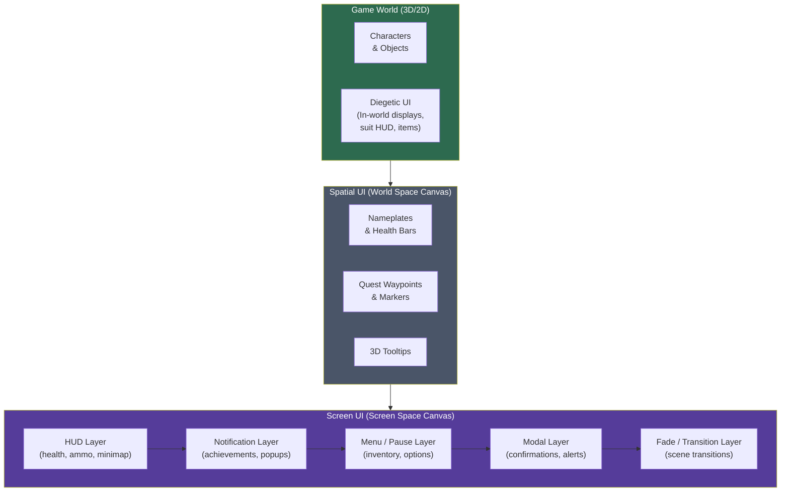

# Game UI and UX Design

> [!abstract] TL;DR
> Game UI communicates critical information while staying out of the way. Diegetic UI integration enhances immersion. Accessibility features (colorblind modes, subtitles, remappable controls) expand your audience. A well-designed save system prevents frustration and trust destruction.

## HUD Design Principles

The **HUD (Heads-Up Display)** is the persistent screen-space overlay that communicates the game state to the player without interrupting play. Its primary tension is between information density (player needs data) and visual noise (UI competes with the game world).

**Three design philosophies:**

**Maximalist**: all relevant information visible at all times. Used in RTS games (StarCraft II), MOBAs (League of Legends), and flight simulators. Players expect complexity; hiding information would reduce competitiveness and control.

**Minimalist**: only the most critical information, or none at all. Used in Journey, Firewatch, and many exploration/walking-simulator games. Immersion is the priority; players trade tactical awareness for cinematic experience.

**Contextual (adaptive)**: show information when it becomes relevant, hide it otherwise. Used in The Legend of Zelda: Breath of the Wild (minimap fades when no marker active), God of War (health bar only appears when taking damage), and most modern AAA action games. Best of both worlds — available when needed, invisible when not.

**Visual hierarchy:**
- Most critical information (health, lives remaining, time) = largest, highest contrast, center or lower-left of visual attention.
- Important but not urgent (ammo, mana, ability cooldowns) = medium size, lower visual prominence.
- Reference information (minimap, inventory, score) = smallest, corners.

**Conventional corner placement** (players expect this layout globally):
- Top-left: score, level, level timer.
- Top-right: minimap, radar.
- Bottom-left: health bar, shields.
- Bottom-right: hotbar, ammo counter, ability cooldowns.

Breaking convention requires players to relearn the layout. Only do so intentionally for aesthetic or diegetic reasons.

## Diegetic vs Non-Diegetic UI

UI in games falls into four spatial categories:

**Non-diegetic (screen space)**: overlaid on the screen. Characters in the game world cannot see it. The player sees it, not the character. Traditional health bars, ammo counters, minimaps, score displays. Most games use this for secondary or tertiary information. Advantage: readable at a glance. Disadvantage: breaks the "fourth wall" — reminds the player they're playing a game.

**Diegetic (world space)**: exists within the game world. The character can hypothetically "see" or experience it. Famous examples:
- Dead Space: Isaac Clarke's health bar is displayed on his suit's spine — the bar is part of the character model.
- Alien: Isolation: the motion tracker is a physical prop the player holds.
- GTA V: characters check their in-world phones for maps.

Advantage: deep immersion. Disadvantage: harder to read quickly; difficult for information that has no physical analog (score).

**Spatial (world-space UI panels)**: interface elements anchored in 3D space near objects. Floating health bars above enemies, waypoint markers, DOOM's enemy health bars appearing over demon heads. Reads more naturally in 3D environments than pure screen-space overlays.

**Meta (implied by world state)**: UI communicated through game-world visual effects rather than explicit panels. Low health shown by red vignette + heartbeat sound (many CoD games). Cracked screen = low health. Desaturation = near death. Advantage: pure immersion. Disadvantage: can be missed or confusing.

Most games mix all four types. Choose the category that best serves each piece of information.

## Affordances and Visual Communication

An **affordance** is a visual or interactive cue that tells the player how to interact with something. Well-designed affordances communicate function without explicit instruction.

**Visual affordances in games:**
- Glowing outline/highlight = interactable object (Tomb Raider, Uncharted)
- Bright yellow/white = climbable surface (Uncharted's painted ledges, Mirror's Edge's runner's vision)
- Red glow = dangerous / enemy weak point
- Floating pickup animation = collectable item
- Tutorial hand prompt = controller/keyboard input expected here

**Consistent iconography**: establish a visual language once (key = opens doors, lightning bolt = electricity hazard, skull = death zone) and apply it consistently throughout the entire game. Players learn your iconography in the first 30 minutes and apply it for the rest of the game. Inconsistency destroys this learned trust.

**Color semantics (cross-cultural conventions in games):**
- Green = health, positive state, go
- Red = damage, danger, stop, enemy
- Yellow/Gold = currency, warning, collectible
- Blue = mana, magic, shield, stamina
- White = neutral, ammunition, common items
- Purple = rare/epic items (RPG loot systems)

**Never use color as the ONLY differentiator** for critical information — this is the root cause of colorblind accessibility failures.

## Tutorial Design

Poorly designed tutorials are one of the most common sources of player drop-off. The goal is to transfer knowledge efficiently without insulting or boring the player.

**Progressive disclosure**: teach only the mechanic the player needs right now. A player's first room should teach walk + jump. Introduce combat only when combat is about to be needed. Don't present all mechanics upfront.

**Contextual hints vs tooltip dumps:**
- Tooltip dump: wall of text before first play ("Press A to jump. Press B to attack. Press X..."). Players skip it, don't retain it.
- Contextual hint: a prompt appears the first time the relevant situation arises. "Press [SPACE] to jump" appears when the player encounters their first gap. They read it because they immediately apply it.

**"Just-in-time" teaching**: the most effective tutorial moment is immediately before the player needs the skill. Teaching wall-jumping right before the first wall-jump section means 100% retention because the player immediately practices what they just learned.

**Tutorial room vs integrated first mission:**
- Tutorial room: separate, safe space (training grounds, prologue mission). Telegraphed as "this is tutorial." Some players skip these.
- Integrated tutorial: core mechanics are taught within the actual opening mission without breaking the fiction. Preferred when done well (Half-Life, Portal, The Last of Us). Much higher retention.

**Never block play with unskippable tutorials**: players replay games, speedrunners exist, some players already know the genre. Always allow experienced players to skip. Add "Skip Tutorial?" confirmation if the tutorial is part of the story.

## Accessibility Features

**Accessibility is not a niche feature** — it is a significant portion of your potential audience. The Xbox Accessibility Guidelines (XBAG) and Game Accessibility Guidelines (gameaccessibilityguidelines.com) are comprehensive references.

**Colorblind modes:**
- Approximately 8% of males and 0.5% of females have some form of color vision deficiency.
- **Deuteranopia** (most common): red-green deficiency, green weakness.
- **Protanopia**: red-green deficiency, red weakness.
- **Tritanopia** (rare): blue-yellow deficiency.
- Solution: use shape, pattern, or position as a secondary channel alongside color. A team indicator can be both blue/red (color) AND circle/triangle (shape). A colorblind mode can apply a post-processing shader to shift the palette.

**Subtitles:**
- Speaker name label above each subtitle.
- Font size option (minimum 32px equivalent).
- Background opacity slider (some players need high-contrast backing; others find it distracting).
- Vertical position control (some players have visual impairment in the bottom portion of their vision).
- Sound effect captions: "[DOOR CREAKING]", "[GUNSHOT IN DISTANCE]" — important for deaf/HoH players and players in noisy environments.

**Remappable controls:** every single input action should be rebindable. This is non-negotiable for players with motor disabilities. Avoid required simultaneous multi-button inputs (they exclude players who can only use one hand). Offer toggle vs hold options for sustained actions.

**Scalable UI**: provide UI scale options (75%, 100%, 125%, 150%) for players with visual impairments using TV-distance screens.

**Motor accessibility**: auto-aim with adjustable strength, movement assist, simplified control modes (aim assist, button remapping), button mashing alternatives (hold to charge instead of rapid press).

**Photosensitivity toggle**: screen shake intensity slider (0–100%), option to disable camera shake entirely. Disable or reduce full-screen flashing effects (explosions, lightning, screen-flashes on damage).

```csharp
// Unity accessibility system example
using UnityEngine;
using UnityEngine.Rendering;
using UnityEngine.Rendering.Universal;

public class AccessibilityManager : MonoBehaviour {
    public enum ColorblindMode { Normal, Deuteranopia, Protanopia, Tritanopia }
    
    [SerializeField] private Volume postProcessVolume;
    [SerializeField] private ColorAdjustments colorAdjustments;
    [SerializeField] private GameObject subtitlePanel;
    [SerializeField] private TMPro.TextMeshProUGUI subtitleText;

    private static readonly int ColorblindModeID = Shader.PropertyToID("_ColorblindMode");

    void Awake() {
        // Load saved preferences
        ApplyColorblindMode((ColorblindMode)PlayerPrefs.GetInt("ColorblindMode", 0));
        SetSubtitlesEnabled(PlayerPrefs.GetInt("SubtitlesEnabled", 1) == 1);
        SetUIScale(PlayerPrefs.GetFloat("UIScale", 1.0f));
    }

    public void ApplyColorblindMode(ColorblindMode mode) {
        // Pass mode to a global shader keyword or HLSL uniform
        Shader.SetGlobalInt(ColorblindModeID, (int)mode);
        PlayerPrefs.SetInt("ColorblindMode", (int)mode);
    }

    public void SetSubtitlesEnabled(bool enabled) {
        subtitlePanel.SetActive(enabled);
        PlayerPrefs.SetInt("SubtitlesEnabled", enabled ? 1 : 0);
    }

    public void DisplaySubtitle(string speaker, string text, float duration) {
        subtitleText.text = $"<b>{speaker}:</b> {text}";
        // Auto-dismiss after duration using Coroutine
    }

    public void SetUIScale(float scale) {
        // Scale the root CanvasScaler
        GetComponent<UnityEngine.UI.CanvasScaler>().scaleFactor = scale;
        PlayerPrefs.SetFloat("UIScale", scale);
    }

    public void SetScreenShakeIntensity(float intensity) {
        // 0.0 = no shake, 1.0 = full shake — broadcast to all camera shake systems
        CameraShake.GlobalIntensityMultiplier = intensity;
        PlayerPrefs.SetFloat("ScreenShakeIntensity", intensity);
    }
}
```

## Save System Design

A poor save system destroys player trust. Hours of progress lost to a bad save decision = player abandons game and leaves a negative review.

**Checkpoint saves**: the game saves automatically at predefined story points. Checkpoints are guaranteed to be reasonable starting positions. Player cannot save freely. Advantages: no save-scumming (exploiting saves to bypass difficulty), tight control of player progression pacing. Disadvantages: if a checkpoint is far from the player's current position, death causes frustrating repeated content. Must be carefully placed.

Intentionally sparse checkpoints (Dark Souls/Elden Ring Bonfires) are a **deliberate design choice** — the tension of losing progress is a core game mechanic. This only works when the gameplay density justifies it.

**Autosave**: game saves automatically on significant events — room entered, item picked up, important dialogue completed, objective achieved. Minimizes progress loss without requiring player action. Best practice: always show an autosave indicator ("Saving..." icon) so players know when it's safe to quit. Never autosave during combat or while a hazard is immediately present (player wakes up dead).

**Manual save**: player saves at any time (menu → Save). Maximum player agency. Respects player time. Combine with autosave for best experience. Multiple named slots allow experimentation.

**Multiple save slots**: three or more slots. Players want to try alternate builds, let a family member play, or start over without losing progress. Never put save slots behind a paywall or DLC.

**Save versioning**: game updates often change save data structure. Handle version mismatches gracefully — attempt migration if possible, warn the player if the save is incompatible, never silently corrupt the save. Always increment a version field in the save data.

```csharp
using System;
using System.IO;
using UnityEngine;

[Serializable]
public class SaveData {
    public int version = 2;           // increment when save format changes
    public string saveSlotName;
    public string timestamp;
    public float[] playerPosition;   // float[] instead of Vector3 — must be serializable
    public float[] playerRotation;
    public int health;
    public int maxHealth;
    public string[] unlockedAbilities;
    public string currentScene;
    public SerializableInventory inventory;
}

public class SaveSystem : MonoBehaviour {
    private const int CURRENT_VERSION = 2;
    private const int MIN_COMPATIBLE_VERSION = 1;   // saves older than this cannot be loaded

    private string GetSavePath(int slot) =>
        Path.Combine(Application.persistentDataPath, $"save_slot_{slot}.json");

    public void Save(int slot, CharacterController player) {
        var data = new SaveData {
            version = CURRENT_VERSION,
            saveSlotName = $"Slot {slot}",
            timestamp = DateTime.Now.ToString("yyyy-MM-dd HH:mm"),
            playerPosition = new[] { player.transform.position.x,
                                     player.transform.position.y,
                                     player.transform.position.z },
            health = player.Health,
            currentScene = UnityEngine.SceneManagement.SceneManager.GetActiveScene().name,
        };
        string json = JsonUtility.ToJson(data, prettyPrint: true);
        File.WriteAllText(GetSavePath(slot), json);
        Debug.Log($"Game saved to slot {slot}");
    }

    public SaveData Load(int slot) {
        string path = GetSavePath(slot);
        if (!File.Exists(path)) return null;

        string json = File.ReadAllText(path);
        SaveData data = JsonUtility.FromJson<SaveData>(json);

        if (data.version < MIN_COMPATIBLE_VERSION) {
            Debug.LogWarning($"Save slot {slot} is version {data.version}, too old to load.");
            return null;
        }
        if (data.version < CURRENT_VERSION) {
            MigrateSave(data);  // upgrade old save format
        }
        return data;
    }

    void MigrateSave(SaveData data) {
        // Handle format changes between versions
        if (data.version == 1) {
            // Version 1 → 2: maxHealth was added
            data.maxHealth = 100;
            data.version = 2;
        }
    }
}
```

## Response Time and Feedback Loops

Human perception thresholds for input latency:
- **< 16ms**: instant — feels physical, zero perceptible lag.
- **< 100ms**: responsive — players don't consciously notice lag but subconsciously enjoy the snappiness.
- **100–200ms**: perceivable — competitive players notice this; casual players may not.
- **> 200ms**: frustrating — clearly laggy, breaks the illusion of control.

Every player action needs a **feedback loop**: a confirmation signal that the action was received and processed.
- Button pressed → immediate visual change (button depresses, highlights).
- Jump pressed → character moves upward on the same frame (never the next frame).
- Attack → hit confirmation on enemy (knockback, flash, sound, damage number).
- Failed action → explanation ("Locked. Requires a key card."), not silent failure.

**Loading screens**: unavoidable in large games but must be handled well.
- Show a progress bar (accurate or animated — never a static graphic that doesn't move).
- Display gameplay tips, lore, or controls on loading screens.
- Allow pressing a button to advance past a complete load screen immediately.
- For procedural loading (open-world streaming), hide with environment-appropriate transitions (doors, elevators, cut-to-black) rather than raw loading screens.

**Menu transitions**: animate state changes. A slide or fade transition (50–150ms) communicates that the interface responded. Static instant transitions feel broken. Transitions > 300ms feel sluggish.

## UI Architecture Layers



The fade/transition layer always renders on top of everything else — it must be able to cover the entire screen during scene transitions. Modal dialogs must block interaction with all layers beneath them. The HUD is the lowest UI layer (closest to the game world), above only spatial UI.

## Common Pitfalls

- **Using color as the only differentiator**: if an enemy is "red team" and ally is "blue team" with no shape/pattern distinction, 8% of male players cannot reliably distinguish them. Always pair color with a secondary non-color channel.
- **Unskippable cutscenes and tutorials**: even one unskippable 3-minute sequence on a second playthrough makes players reluctant to replay. Add skip options to everything, even if you add a confirmation dialog.
- **Autosave without an indicator**: players cannot know when it is safe to close the game. An autosave that happens mid-quit can save in a broken state. Always show a brief "Saving..." icon and never save-on-quit without warning.
- **Not testing UI at extreme resolutions**: a UI that looks perfect at 1080p may have text overflowing boxes at 720p, or have gigantic scaled UI on a 4K TV-distance screen. Test at 720p, 1080p, 1440p, and 4K with both controller and mouse+keyboard.
- **Putting critical game information only on the minimap**: if the only way to know an enemy is approaching is to look at the minimap, players spend time watching the minimap instead of the game world. Use directional threat indicators, audio cues, or proximity alerts so players can keep their eyes on the main action.

## Review Questions

1. What is the difference between diegetic and non-diegetic UI? Give a real game example of each type. Why might you choose diegetic UI for a key game element?
2. Why should colorblind accessibility use shape or pattern alongside color as a secondary differentiator, rather than simply swapping colors? What does this say about using color as the only information channel?
3. What are the trade-offs between checkpoint saves, autosave, and manual save systems? In what genre is each most appropriate, and why?

## Related Concepts

- [[_MOC_Game_Development_Master|↑ Game Development MOC]]

#GameDev
