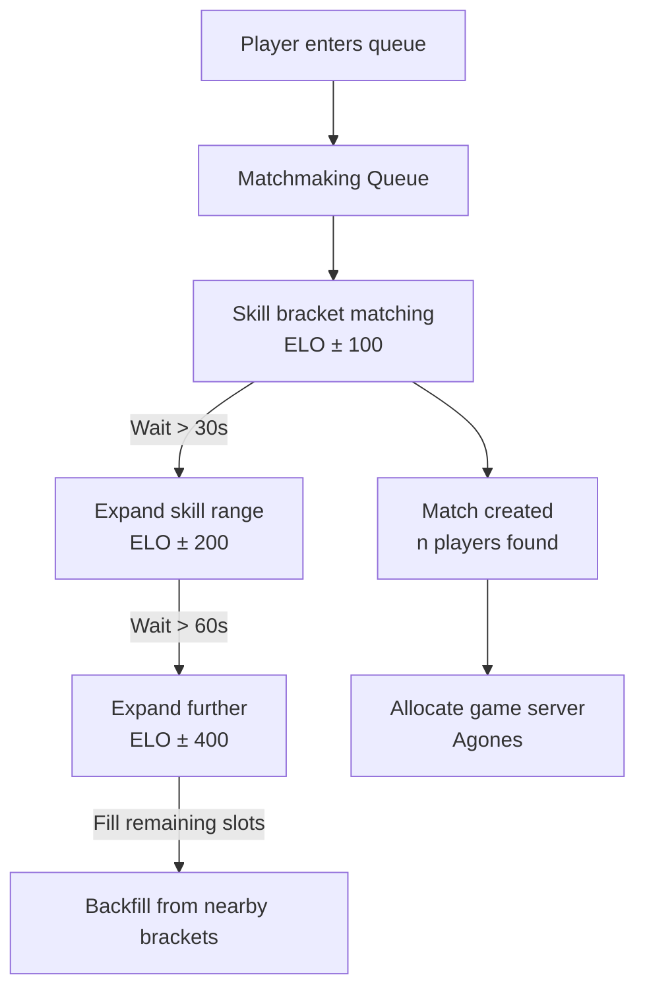
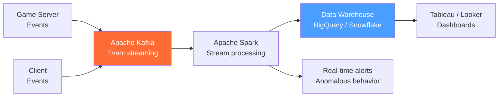

# Game Backend Services

> [!abstract] TL;DR
> Beyond the game server itself, online games require a suite of backend services: matchmaking (ELO/MMR rating, skill bracket pairing, wait time vs quality trade-offs), leaderboards (Redis Sorted Sets for real-time ranking, DynamoDB for persistence), session management, analytics pipelines, and anti-cheat. Live ops infrastructure (feature flags, A/B testing) allows game balance changes without client updates.

## Matchmaking

Matchmaking pairs players into balanced matches. The key tension: **match quality vs wait time**.



### ELO / MMR Rating

```python
def calculate_new_elo(player_elo: float, opponent_elo: float, won: bool, k: float = 32) -> float:
    """
    Elo formula: E_A = 1 / (1 + 10^((R_B - R_A) / 400))
    New rating: R_A' = R_A + K * (S_A - E_A)
    """
    expected = 1 / (1 + 10 ** ((opponent_elo - player_elo) / 400))
    score = 1.0 if won else 0.0
    return player_elo + k * (score - expected)

# Example: 1500 ELO player beats 1600 ELO player
new_elo = calculate_new_elo(1500, 1600, won=True)  # → ~1519 (more gain for beating higher)
new_elo_loss = calculate_new_elo(1500, 1400, won=False)  # → ~1477 (more loss for losing to lower)
```

**K-factor tuning:**
- High K (32): ELO changes quickly — good for new players, volatile for veterans
- Low K (16): ELO changes slowly — stable for veterans, slow for calibration
- Most systems use high K for first N matches (calibration), then lower K

### Team Matchmaking (Multiple Players per Side)

For team games, match **average MMR** of both teams, then minimize **MMR variance within each team**:

```python
def match_teams(team_a: list[Player], team_b: list[Player]) -> float:
    avg_a = sum(p.mmr for p in team_a) / len(team_a)
    avg_b = sum(p.mmr for p in team_b) / len(team_b)
    balance_score = abs(avg_a - avg_b)  # lower = better match

    # Also penalize high variance within teams
    variance_a = statistics.stdev(p.mmr for p in team_a)
    variance_b = statistics.stdev(p.mmr for p in team_b)

    return balance_score + 0.5 * (variance_a + variance_b)
```

### Backfill

When a player leaves a running match, **backfill** replaces them from the queue rather than ending the match:

```python
# Player disconnects mid-match
def handle_disconnect(match_id: str, player_id: str):
    match = get_match(match_id)
    match.remove_player(player_id)

    if match.needs_player():
        # Post backfill request to matchmaking
        backfill_request = BackfillRequest(
            match_id=match_id,
            required_count=1,
            min_mmr=match.avg_mmr - 150,
            max_mmr=match.avg_mmr + 150,
            server_join_token=match.join_token,
        )
        matchmaking_queue.post_backfill(backfill_request)
```

---

## Leaderboard Architecture

### Redis Sorted Set — Real-Time Leaderboard

Redis Sorted Sets are the canonical data structure for real-time ranked leaderboards:

```python
import redis

r = redis.Redis()

# Add/update score (O(log N))
r.zadd('leaderboard:global', {'player:alice': 15420})
r.zadd('leaderboard:global', {'player:bob': 12800})

# Increment score
r.zincrby('leaderboard:global', 500, 'player:alice')

# Get rank (0-indexed, lower = better rank = higher score)
rank = r.zrevrank('leaderboard:global', 'player:alice')  # → 0 (1st place)

# Get top 10 with scores
top10 = r.zrevrange('leaderboard:global', 0, 9, withscores=True)
# [('player:alice', 15920.0), ('player:bob', 12800.0), ...]

# Get player's score
score = r.zscore('leaderboard:global', 'player:alice')

# Get players around a given player (rank ± 5)
rank = r.zrevrank('leaderboard:global', 'player:alice')
nearby = r.zrevrange('leaderboard:global', max(0, rank-5), rank+5, withscores=True)
```

### Time-Bucketed Leaderboards

```python
from datetime import datetime

def get_bucket_key(period: str) -> str:
    now = datetime.utcnow()
    if period == 'daily':
        return f"leaderboard:daily:{now.strftime('%Y-%m-%d')}"
    elif period == 'weekly':
        week = now.isocalendar()
        return f"leaderboard:weekly:{week.year}-W{week.week:02d}"
    elif period == 'monthly':
        return f"leaderboard:monthly:{now.strftime('%Y-%m')}"
    return "leaderboard:alltime"

def add_score(player_id: str, score: int, period: str = 'daily'):
    key = get_bucket_key(period)
    r.zadd(key, {player_id: score})
    r.expire(key, 7 * 24 * 3600)  # auto-expire old buckets
```

### DynamoDB for Persistent Leaderboards

Redis is ephemeral (in-memory). For historical leaderboards (all-time rankings, season records), persist to DynamoDB:

```python
import boto3
from decimal import Decimal

dynamodb = boto3.resource('dynamodb')
table = dynamodb.Table('Leaderboard')

def persist_score(player_id: str, score: int, period: str):
    table.put_item(Item={
        'pk': f"LEADERBOARD#{period}",
        'sk': f"PLAYER#{player_id}",
        'score': Decimal(score),
        'player_id': player_id,
        'updated_at': datetime.utcnow().isoformat(),
    })

# Query top 100 (requires GSI on score)
response = table.query(
    IndexName='score-index',
    KeyConditionExpression='pk = :pk',
    ExpressionAttributeValues={':pk': 'LEADERBOARD#alltime'},
    ScanIndexForward=False,  # descending by score
    Limit=100,
)
```

---

## Player Session Management

```python
import jwt
import uuid
from datetime import datetime, timedelta

SECRET = "your-secret"

def create_session(player_id: str, match_server_url: str) -> dict:
    """Create a JWT session for a player connecting to a game server."""
    session_id = str(uuid.uuid4())
    payload = {
        'sub': player_id,
        'session_id': session_id,
        'server': match_server_url,
        'iat': datetime.utcnow(),
        'exp': datetime.utcnow() + timedelta(hours=2),
    }
    token = jwt.encode(payload, SECRET, algorithm='HS256')
    return {'token': token, 'session_id': session_id}

def validate_session(token: str) -> dict | None:
    try:
        return jwt.decode(token, SECRET, algorithms=['HS256'])
    except jwt.ExpiredSignatureError:
        return None
    except jwt.InvalidTokenError:
        return None
```

**Session affinity:** game servers are stateful. Once a player connects to server instance `game-server-42`, all subsequent reconnects must route to the same instance. Use the session token to encode which server to reconnect to.

---

## Game Analytics Pipeline



### Event Schema Design

```json
{
  "event_type": "player_killed",
  "game_id": "match-abc123",
  "player_id": "player-456",
  "killer_id": "player-789",
  "weapon": "assault_rifle",
  "position": { "x": 145.3, "y": 200.1, "z": 0.0 },
  "timestamp": 1706400000000,
  "server_tick": 4096,
  "session_id": "session-xyz",
  "region": "us-east-1"
}
```

**Key events to track:**
- Match start/end (with result, duration, player list)
- Player kills/deaths (with weapon, position, killer context)
- Economy events (item purchases, currency earned)
- Session events (login, logout, disconnect with reason)
- UI events (menu interactions, tutorial completions)

---

## Anti-Cheat Approaches

| Layer | Approach | Catches |
|---|---|---|
| **Server validation** | Server never trusts client position/state | Speed hacks, teleport hacks |
| **Server-side hit detection** | Lag-compensated hitbox check on server | Aim bot misses rejected |
| **Statistical anomaly detection** | Headshot rate > 95% → flag for review | Aimbots |
| **Replay analysis** | Store all inputs; offline ML analysis | Subtle cheats missed real-time |
| **Client-side (VAC, EAC)** | Scan process/memory for known cheat signatures | Known commercial cheats |
| **BattleEye / Easy Anti-Cheat** | Kernel-level driver | Memory injection, DLL injection |

**Statistical detection (statistical model):**
```python
def is_suspicious(player_stats: dict) -> bool:
    headshot_rate = player_stats['headshots'] / max(player_stats['kills'], 1)
    reaction_time_avg = player_stats['avg_reaction_time_ms']
    accuracy = player_stats['shots_hit'] / max(player_stats['shots_fired'], 1)

    # Flag for review if multiple stats are abnormal
    flags = 0
    if headshot_rate > 0.80: flags += 1   # avg human: ~20-30%
    if reaction_time_avg < 80: flags += 1  # avg human: 200-250ms
    if accuracy > 0.95: flags += 1         # pro players: ~30-50%

    return flags >= 2  # trigger manual review
```

---

## Live Ops Infrastructure

### Feature Flags for Game Balance

```python
# LaunchDarkly / GrowthBook / custom feature flags
class FeatureFlags:
    def __init__(self, player_id: str):
        self.flags = fetch_flags(player_id)

    def get_weapon_damage(self, weapon: str) -> float:
        # Allows tuning damage without a client patch
        override = self.flags.get(f"weapon_damage_{weapon}")
        return override if override is not None else WEAPON_DEFAULTS[weapon]

    def is_new_map_enabled(self) -> bool:
        return self.flags.get('enable_map_highland', False)
```

### A/B Testing Store Items / Prices

```python
def get_item_price(player_id: str, item_id: str) -> int:
    """A/B test: control group = 500 gold, treatment = 400 gold."""
    variant = get_ab_variant(player_id, experiment='item_pricing_test')

    if variant == 'treatment':
        return 400
    return 500  # control

def get_ab_variant(player_id: str, experiment: str) -> str:
    hash_val = int(hashlib.md5(f"{player_id}:{experiment}".encode()).hexdigest(), 16)
    return 'treatment' if (hash_val % 100) < 50 else 'control'
```

---

## Common Pitfalls

- **ELO inflation in open queues.** New players start at 1000 ELO. If 100 new players join and lose to existing players, those existing players accumulate ELO without the system adding new "ELO mass." Use provisional periods and ELO resets per season.
- **Redis leaderboard without persistence.** Redis is in-memory; a restart clears the leaderboard unless AOF/RDB persistence is configured. Always persist to a durable store periodically.
- **Session tokens without server binding.** A session token that any server accepts allows a player to replay the token to connect to a different match. Bind tokens to specific server IDs.
- **Analytics hot path impact.** Logging every event synchronously on the game server adds latency to the tick. Write analytics to a local queue, flush async.
- **VAC/EAC with Linux servers.** Kernel-level anti-cheat often requires Windows. Linux-based dedicated servers cannot run kernel anti-cheat — rely on server-side detection instead.

---

## Review Questions

1. A matchmaking system pairs players purely by ELO. After 90 seconds in queue, no match is found. What should the system do, and why?
2. What data structure does Redis use for leaderboards, and what is the time complexity of adding a score and querying top-N?
3. You're building a weekly leaderboard that resets every Monday. Describe the Redis key naming scheme and expiry strategy.
4. A player has a 97% headshot rate across 500 kills. Describe the anti-cheat response: automatic ban, flag for review, or ignore? Justify your answer.
5. What is a feature flag in live ops, and how does it allow game balance changes without a client patch?
