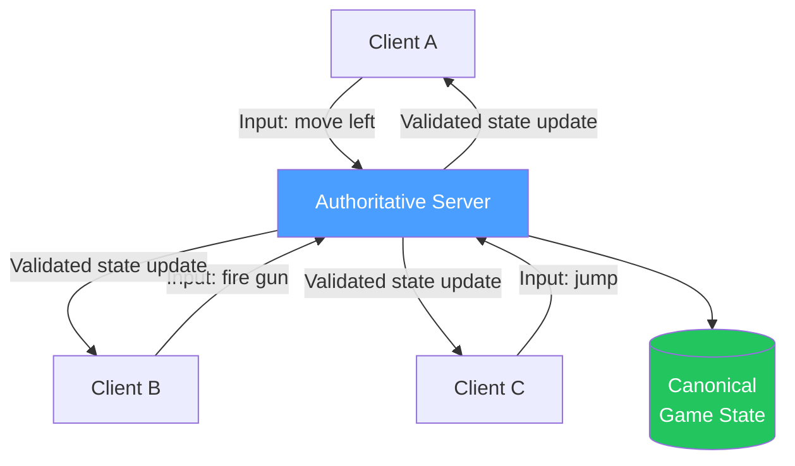
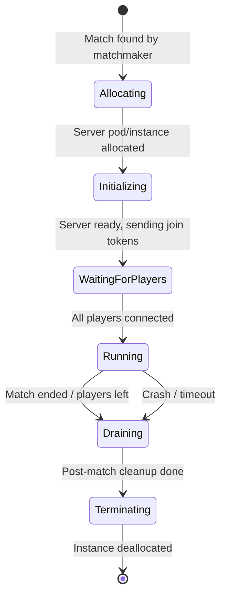

# Game Server Architecture

> [!abstract] TL;DR
> Authoritative game servers hold the canonical game state and validate all client actions — clients cannot cheat because the server never trusts input blindly. Unlike stateless web servers that spin up and down freely, game servers are stateful (hold live match state), have lifecycle management (allocate → run → teardown), run at specific tick rates (20–128Hz), and are orchestrated at scale via Agones on Kubernetes.

## Authoritative Server Model



**Why authoritative servers:**
- Server validates every action (speed hacks detected: "you moved 3x faster than physics allows → reject")
- Server resolves conflicts (two clients claim they killed each other simultaneously)
- Canonical state prevents divergence between clients

**What clients send:** inputs, not state
```
Client sends:  { action: "move", direction: "left", timestamp: 1234567890 }
NOT:           { position: { x: 145, y: 200 } }  ← client cannot set its own position
```

---

## Server Topology Options

### Dedicated Server

A server process running independently of any client:

```
Game Developer hosts servers → Players connect to dedicated server
                             → Server is authoritative
```

**Pros:** most reliable, anti-cheat friendly, consistent experience  
**Cons:** costs money (server hosting), requires server fleet management  
**Used in:** CS2, Valorant, Apex Legends, most competitive shooters

### Peer-to-Peer (P2P)

One player's game acts as the server ("host"):

```
Player A hosts ──→ Player B connects
              └──→ Player C connects
```

**Pros:** no server hosting cost  
**Cons:** "host advantage" (host has 0 latency), if host disconnects everyone drops, cheating easier  
**Used in:** older console games, some casual titles

### Relay Server

Server only relays messages; clients are still peers:

```
Client A → Relay → Client B
Client B → Relay → Client A
```

**Pros:** works through NAT/firewalls without hosting dedicated compute  
**Cons:** not truly authoritative (relay doesn't validate state)  
**Used in:** fallback when direct P2P fails (Steam networking, Unity Relay)

---

## Match Server Lifecycle



**Lifecycle stages:**

| Stage | Duration | What happens |
|---|---|---|
| **Allocating** | 0–30s | Orchestrator provisions game server pod |
| **Initializing** | 0–5s | Server loads map, game config, initial state |
| **WaitingForPlayers** | 0–60s | Clients connect with tokens from matchmaker |
| **Running** | 5min–2hrs | Live match; server processes inputs, sends state |
| **Draining** | 0–30s | Match over; server saves results, disconnects clients |
| **Terminating** | 0–10s | Resources released; pod deleted |

---

## Game Server vs Web Server

| Concern | Web Server | Game Server |
|---|---|---|
| State | Stateless (designed to scale horizontally) | Stateful (holds live match state in memory) |
| Connections | Short-lived HTTP requests | Long-lived UDP/WebSocket connections |
| Scaling | Add any pod; load balancer routes traffic | Each match pinned to a specific server instance |
| Session affinity | Not needed | Required — clients always reconnect to same server |
| Lifecycle | Indefinite uptime | Bounded by match duration (finite lifetime) |
| Failure impact | Single request fails | Entire match disrupted |

---

## Tick Rate

**Tick rate** is how frequently the server processes input and sends state updates:

| Tick Rate | Updates/sec | Use Case |
|---|---|---|
| 10–20 Hz | Low | Casual/turn-based, mobile |
| 30 Hz | Medium | Most multiplayer games (Fortnite) |
| 64 Hz | High | Competitive shooters (CS2 matchmaking) |
| 128 Hz | Very high | Professional play (CS2 FACEIT) |

**Trade-offs:**

```
Higher tick rate → More responsive → More bandwidth + CPU cost
  20Hz: server processes input every 50ms → 50ms input lag
  64Hz: server processes every 15.6ms → 15.6ms input lag
 128Hz: server processes every 7.8ms  → 7.8ms input lag
```

**Fixed-step game loop:**

```cpp
const double TICK_RATE = 64.0; // Hz
const double TICK_INTERVAL = 1.0 / TICK_RATE; // 15.625ms

double accumulator = 0.0;
double lastTime = getCurrentTime();

while (running) {
    double currentTime = getCurrentTime();
    double deltaTime = currentTime - lastTime;
    lastTime = currentTime;
    accumulator += deltaTime;

    // Process all accumulated ticks
    while (accumulator >= TICK_INTERVAL) {
        processInputs();   // read client inputs
        updateGameState(); // physics, hit detection, AI
        sendStateToClients(); // snapshot broadcast
        accumulator -= TICK_INTERVAL;
    }

    // Sleep until next tick
    double sleepTime = TICK_INTERVAL - accumulator;
    if (sleepTime > 0) sleep(sleepTime);
}
```

---

## Agones — Kubernetes Game Server Lifecycle

[Agones](https://agones.dev) is an open-source Kubernetes extension (from Google) for managing game server lifecycle:

```yaml
# GameServer resource definition
apiVersion: agones.dev/v1
kind: GameServer
metadata:
  name: my-game-server
spec:
  ports:
    - name: default
      portPolicy: Dynamic   # Agones allocates a port
      containerPort: 7777
      protocol: UDP
  template:
    spec:
      containers:
        - name: server
          image: my-game-server:1.0.0
          resources:
            requests:
              memory: 512Mi
              cpu: 500m
```

```yaml
# Fleet — pool of ready game servers
apiVersion: agones.dev/v1
kind: Fleet
metadata:
  name: fleet-example
spec:
  replicas: 5   # keep 5 warm servers ready
  template:
    spec:
      ports:
        - name: default
          containerPort: 7777
```

**Agones SDK in server code (Go example):**

```go
// Signal to Agones that server is ready for players
sdk.Ready()

// Reserve for 30 seconds (allocated but match not started yet)
sdk.Reserve(30 * time.Second)

// Allocate — mark as in use
sdk.Allocate()

// Shutdown — match over, Agones will clean up the pod
sdk.Shutdown()

// Health — send heartbeat every 5s (if missed, Agones marks unhealthy)
go func() {
    for { sdk.Health(); time.Sleep(5 * time.Second) }
}()
```

---

## Player Capacity Planning

```
Peak concurrent players (PCU): 100,000
Average match size: 10 players
Average match duration: 20 minutes
Match start rate: PCU / avg_duration = 100,000 / 20 = 5,000 matches starting/min

Servers needed at peak:
  = PCU / match_size = 100,000 / 10 = 10,000 concurrent servers

Add 20% buffer for warm servers (avoid cold start delay):
  = 10,000 × 1.2 = 12,000 servers needed at peak

Servers per node (64 players/node, 6.4 servers/node):
  = 12,000 / 6 = 2,000 Kubernetes nodes needed at peak
```

**Fleet auto-scaling with Agones:**

```yaml
apiVersion: autoscaling.agones.dev/v1
kind: FleetAutoscaler
spec:
  fleetName: fleet-example
  policy:
    type: Buffer
    buffer:
      bufferSize: 5        # always keep 5 warm servers ready
      minReplicas: 5
      maxReplicas: 1000
```

---

## Common Pitfalls

- **Trusting client position.** If clients send `position: {x, y}` and the server accepts it, speed hacks trivially bypass the server. Always process inputs (direction + velocity), never positions.
- **Synchronous state broadcast.** Sending full game state to all clients every tick at 128Hz for 64 players overwhelms bandwidth. Use delta compression and interest management (see [[Network_Protocol_Design]]).
- **No server-side hit detection.** If hit detection runs on the client and the client reports its own kills, aimbots work trivially. Validate hit boxes server-side with lag compensation.
- **Fixed fleet size.** A fleet without auto-scaling wastes money during off-peak and fails to serve players at peak. Always configure Agones FleetAutoscaler.
- **Not persisting match results on crash.** If the server crashes during the Draining phase without saving, all match data is lost. Save incrementally during Running phase.

---

## Review Questions

1. Why does an authoritative server receive inputs from clients rather than positions?
2. A 64Hz server processes 1,000 concurrent players. How does this compare in load to a stateless web API handling 1,000 req/s?
3. What is the difference between "allocating" and "running" in the Agones game server lifecycle?
4. A game has 500,000 PCU with 5-player matches lasting 10 minutes average. Estimate the number of concurrent game server instances needed (include a 20% warm buffer).
5. What is "host advantage" in peer-to-peer games, and why does dedicated server architecture eliminate it?
