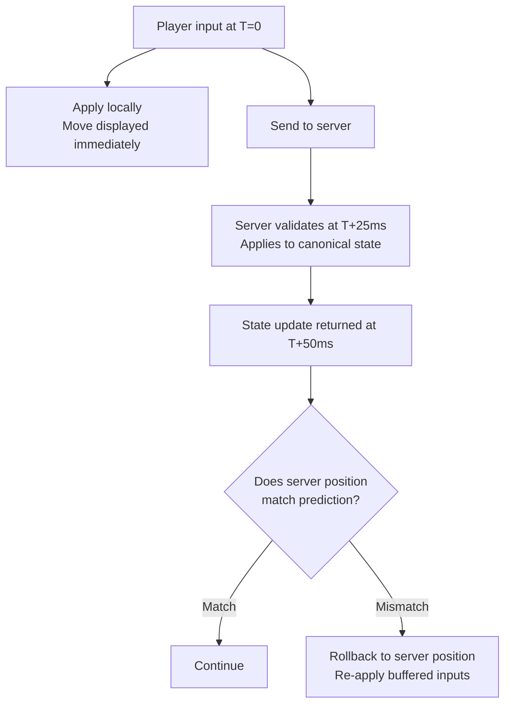
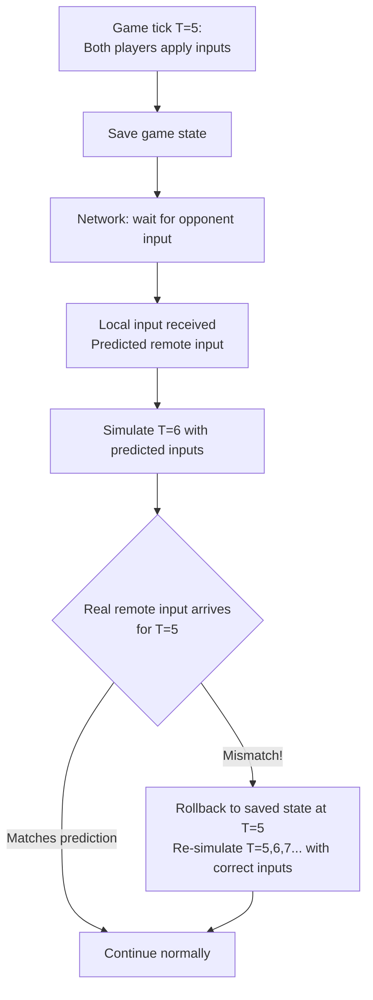

# Game State Synchronization

> [!abstract] TL;DR
> The core challenge of multiplayer games is making distributed clients feel responsive despite network latency. Three techniques dominate: **client-side prediction + server reconciliation** (apply inputs locally, correct when server disagrees — used in shooters), **rollback netcode** (save state, reverse on mismatch, re-simulate — used in fighting games), and **snapshot interpolation** (buffer recent server states, interpolate smoothly — used for remote players in shooters). Choice depends on game genre and tolerable inconsistency.

## The Fundamental Problem

```
Player presses "move left" at time T.
Server is 50ms away (25ms each direction).
Server processes input at T+25ms.
State update returns at T+50ms.

Without prediction: input feels 50ms delayed → unplayable
With prediction: apply move locally at T+0ms → update server at T+25ms → correct at T+50ms
```

The goal: **make the game feel responsive** (low input lag) while **keeping state consistent** (no cheating, fair collision detection).

---

## Client-Side Prediction + Server Reconciliation

The dominant technique for first-person shooters and action games.



### Implementation

```typescript
interface PlayerInput {
  sequenceNumber: number;
  timestamp: number;
  moveX: number;
  moveY: number;
  jump: boolean;
}

class ClientPrediction {
  private pendingInputs: PlayerInput[] = [];
  private predictedPosition = { x: 0, y: 0 };
  private sequenceNumber = 0;

  applyInput(input: Omit<PlayerInput, 'sequenceNumber'>): void {
    const seqInput = { ...input, sequenceNumber: ++this.sequenceNumber };

    // Apply immediately locally (prediction)
    this.predictedPosition.x += seqInput.moveX;
    this.predictedPosition.y += seqInput.moveY;

    // Save for potential reconciliation
    this.pendingInputs.push(seqInput);

    // Send to server
    sendToServer(seqInput);
  }

  reconcile(serverState: { position: { x: number; y: number }; lastProcessedInput: number }): void {
    // Discard acknowledged inputs
    this.pendingInputs = this.pendingInputs.filter(
      i => i.sequenceNumber > serverState.lastProcessedInput
    );

    // Reset to server-authoritative position
    this.predictedPosition = { ...serverState.position };

    // Re-apply all unacknowledged inputs (re-simulate from server state)
    for (const input of this.pendingInputs) {
      this.predictedPosition.x += input.moveX;
      this.predictedPosition.y += input.moveY;
    }

    // If predictedPosition now matches (or is very close to) original prediction → no visible correction
    // If significant difference → rubber-band correction (player snaps back slightly)
  }
}
```

**When reconciliation differs significantly:** the player "snaps" or "rubber-bands." Common causes:
- Collision with another player (server knows; client didn't predict)
- Speed hack rejection by server
- Lag spike causing large state divergence

---

## Snapshot Interpolation

Used for **other players' positions** (not the local player). Rather than predict where remote players are, buffer recent server snapshots and interpolate between them with a deliberate rendering delay:

```
Time:           T=0    T=50   T=100  T=150  T=200
Server sends:   S1     S2     S3     S4     S5

Client rendering delay: 100ms
At T=200, client renders between S1(T=0) and S2(T=50) position
At T=250, client renders between S2(T=50) and S3(T=100) position
```

**Why the rendering delay:** ensures the client always has two snapshots to interpolate between. Without delay, if a snapshot is late, rendering stutters.

```typescript
class SnapshotBuffer {
  private snapshots: Array<{ time: number; state: WorldState }> = [];
  private renderDelay = 100; // ms behind real time

  addSnapshot(state: WorldState): void {
    this.snapshots.push({ time: Date.now(), state });
    // Keep only last 30 snapshots (~500ms at 64Hz)
    if (this.snapshots.length > 30) this.snapshots.shift();
  }

  getInterpolatedState(): WorldState {
    const renderTime = Date.now() - this.renderDelay;

    // Find two snapshots bracketing renderTime
    const older = this.snapshots.filter(s => s.time <= renderTime).at(-1);
    const newer = this.snapshots.find(s => s.time > renderTime);

    if (!older || !newer) return this.snapshots.at(-1)!.state;

    const t = (renderTime - older.time) / (newer.time - older.time); // 0..1
    return interpolateStates(older.state, newer.state, t);
  }
}

function interpolateStates(a: WorldState, b: WorldState, t: number): WorldState {
  return {
    players: a.players.map((pa, i) => {
      const pb = b.players[i];
      return {
        ...pa,
        x: lerp(pa.x, pb.x, t),
        y: lerp(pa.y, pb.y, t),
        z: lerp(pa.z, pb.z, t),
      };
    }),
  };
}
```

**Trade-off:** remote players appear 100ms in the past. This is fine for observing other players — but creates a mismatch for shooting (you shoot where you SEE the player, which is 100ms old). Resolved by **lag compensation**.

---

## Lag Compensation

When a player fires, the server rewound time to check hitboxes at the time the player saw the target (not current server time):

```
Client sees player at position P_old (100ms delay)
Client fires at P_old at T=200
Server receives fire event at T=225 (25ms travel)
Server checks: "Where was the target at T=125 (200 - 75ms lag)?"
Server rolls back target hitbox to P_old position
Server detects hit → valid kill

Without lag compensation:
Server checks target at T=225 → target is at P_new (100ms further)
Server says "miss" → player correctly aimed but shot didn't register → frustrating
```

**Implementation:** server stores position history for each entity for the last N milliseconds (ringbuffer). On receiving a fire event with timestamp, rewind to that timestamp and run hit detection.

```
History buffer: 512ms of position history
At 64Hz: 32 positions per player stored
Memory: 32 × N_players × (position size) per server
```

**Lag compensation limit:** only rewind up to a maximum (e.g., 200ms). Very high-latency players cannot shoot as if they have zero latency.

---

## Rollback Netcode (GGPO-style)

The dominant technique for **fighting games** and **RTS/MOBA games**. Works best with deterministic simulation.



### Why Rollback Works for Fighting Games

1. **Small game state:** a fighting game's state is ~10KB (two characters, health, position). Rolling back and re-simulating 10 frames takes < 1ms.
2. **Deterministic simulation:** given the same inputs in the same order, every machine produces the same output — rollback re-simulation is safe.
3. **Input prediction is simple:** hold the last received input (if no input from remote, assume they pressed nothing or the same as last frame).

### GGPO Open-Source Library

```c
// Register rollback callbacks
GGPOSessionCallbacks cbs;
cbs.save_game_state = [](unsigned char** buffer, int* len, int* checksum, int frame) {
    *buffer = malloc(sizeof(GameState));
    memcpy(*buffer, &game_state, sizeof(GameState));
    *len = sizeof(GameState);
    *checksum = fletcher32_checksum(&game_state, sizeof(GameState));
    return true;
};
cbs.load_game_state = [](unsigned char* buffer, int len) {
    memcpy(&game_state, buffer, len);
    return true;
};
cbs.advance_frame = [](int flags) {
    // simulate one frame
    update_game_state(inputs[0], inputs[1]);
    return true;
};
```

### Rollback vs Prediction + Reconciliation

| Aspect | Rollback (GGPO) | Prediction + Reconciliation |
|---|---|---|
| Game type | Fighting, RTS, MOBA | Shooter, action |
| State size | Small (rollback needs fast save/load) | Medium-large |
| Determinism required | Yes | No |
| Perceived input lag | Near-zero (local inputs applied immediately) | Near-zero (client prediction) |
| Network model | P2P or server | Server-authoritative |
| Mismatch handling | Rollback + re-simulate | Teleport/lerp to server pos |

---

## Deterministic Lockstep

All clients advance together — no client simulates frame N+1 until inputs from all clients for frame N are received.

```
Frame N: collect all inputs from all clients → ALL simulate frame N → advance to N+1
```

**Used in:** Starcraft, Age of Empires, older MOBAs.

**Requirements:**
- **Deterministic simulation:** floating-point math must be identical across CPUs/OS. Use fixed-point math or specific IEEE 754 deterministic operations.
- **Hash check:** each client computes a hash of game state; if hashes diverge, a desync is detected (Starcraft's "desync" error).

**Problem:** if one client is slow (high latency), everyone waits. Works well for 2–8 players with < 100ms latency between all players; breaks down for large player counts or high variance latency.

---

## Common Pitfalls

- **No input buffering for prediction.** If the client doesn't buffer unacknowledged inputs, it can't reconcile — it just teleports to the server position (rubber banding).
- **Reconciliation threshold too tight.** Snapping for 1cm differences looks jittery. Use a reconciliation threshold (only snap if difference > X units).
- **Rolling back too far.** If lag compensation rewinds 500ms, a player with 400ms ping has a near-guaranteed hit. Cap compensation at 200ms.
- **Non-deterministic floating point in lockstep.** Different CPU architectures handle denormalized floats differently. Using `float` across platforms causes lockstep desyncs — use fixed-point or specifically controlled floating-point modes.
- **Snapshot buffer too small for interpolation.** If the buffer holds only 100ms of snapshots and the render delay is 100ms, a single late packet causes the buffer to run dry and rendering to stutter.

---

## Review Questions

1. A player presses "jump." With client-side prediction, describe the sequence of events from button press to seeing the jump on screen to server validation.
2. What is the purpose of the rendering delay in snapshot interpolation? What happens without it?
3. Why is rollback netcode more common in fighting games than first-person shooters? What property makes fighting games well-suited?
4. Lag compensation rewinds server state to check hitboxes. What is the maximum lag compensation window, and why is there a limit?
5. Deterministic lockstep requires deterministic floating-point math. Why does standard IEEE 754 float arithmetic fail across different CPU architectures?
