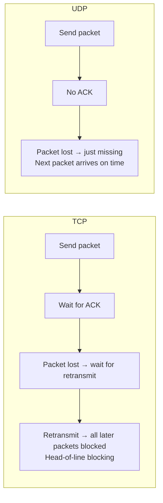

# Network Protocol Design

> [!abstract] TL;DR
> Games use UDP over TCP because low latency beats reliability — a dropped position update is better than one that arrives 200ms late. Custom UDP protocol layers add selective reliability (ack old packets, retransmit critical data only), ordering, and fragmentation on top. Message serialization uses compact binary formats (Protobuf, MessagePack) for the hot path. Delta compression and interest management reduce bandwidth as player counts grow.

## UDP vs TCP for Games



| Property | TCP | UDP |
|---|---|---|
| Reliability | Guaranteed delivery | Best-effort (packets can be lost) |
| Ordering | In-order delivery | Unordered |
| Head-of-line blocking | Yes — lost packet blocks later ones | No — later packets arrive independently |
| Latency impact | High on packet loss | Low (no retransmit delay) |
| Congestion control | Built-in | Manual (implement yourself or ignore) |
| Use in games | Chat, login, lobby, telemetry | Game state, player positions, inputs |

**Why head-of-line blocking kills games:**
```
TCP: packets 1,2,3,4 sent. Packet 3 lost.
     Packets 4,5,6 wait in buffer until 3 is retransmitted (~100ms delay).
     Player appears frozen even though packets 4,5,6 contain newer data.

UDP: packets 1,2,3,4 sent. Packet 3 lost.
     Packets 4,5,6 arrive immediately.
     Position is slightly stale but game keeps moving.
```

For a 10ms-old position update, being slightly stale (UDP) is better than being 100ms delayed (TCP retransmit).

---

## Custom Reliable UDP

Games build their own reliability layer on top of UDP for data that must arrive (chat messages, item pickups, match events) while leaving position updates unreliable:

```
+------------------+
|  Custom Layer    |  Selective reliability, ordering, fragmentation
+------------------+
|      UDP         |  Unreliable, unordered, connectionless
+------------------+
|      IP          |
+------------------+
```

### Packet Header Design

```
Packet header (8 bytes):
+--------+--------+--------+--------+
| seq_id (2 bytes, wrapping uint16) |  Packet sequence number
+--------+--------+--------+--------+
| ack_id (2 bytes)                  |  Last seq_id received from remote
+--------+--------+--------+--------+
| ack_bits (4 bytes)                |  Bitfield: which of last 32 packets received
+--------+--------+--------+--------+
```

### Reliability via ACK Bitfield

```
Remote sends us seq_ids: 0, 1, 2, 3, 4, 5, 6, 7
We receive:              0, 1, 3, 4, 5, 6, 7 (packet 2 dropped)

Our next packet header:
  ack_id = 7              ← highest received
  ack_bits = 0b11111011   ← 1=received, 0=missing; bit 1 is 0 (packet 5 ago = seq 2)

Remote reads ack_bits → knows packet 2 wasn't received → retransmits only packet 2
```

This approach has zero overhead for unreliable messages — you get selective retransmit with minimal header cost.

### Sequence Wrap-Around

```c
// 16-bit sequence numbers wrap at 65535 → 0
// Need to handle wrap when comparing:
bool isMoreRecent(uint16_t a, uint16_t b) {
    // Returns true if 'a' is more recent than 'b'
    return (a > b) && (a - b <= 32768) ||
           (b > a) && (b - a > 32768);
}
```

---

## WebSocket for Browser Games

For browser-based games (HTML5), WebSocket is the practical choice — UDP isn't available in browsers:

```javascript
// Client-side WebSocket
const ws = new WebSocket('wss://game.example.com/match/room-123');

ws.binaryType = 'arraybuffer'; // receive binary data (not text)

ws.onopen = () => {
    const encoder = new TextEncoder();
    // Send binary packet
    const buffer = new ArrayBuffer(4);
    const view = new DataView(buffer);
    view.setUint8(0, 0x01); // message type: INPUT
    view.setInt16(1, dx);   // x delta
    view.setInt8(3, dy);    // y delta
    ws.send(buffer);
};

ws.onmessage = (event) => {
    const view = new DataView(event.data);
    const msgType = view.getUint8(0);
    if (msgType === 0x02) { // STATE_UPDATE
        applyStateUpdate(view);
    }
};
```

**WebSocket latency note:** WebSocket runs over TCP — it has head-of-line blocking. For competitive browser games, use WebTransport (QUIC-based) instead when browser support allows.

---

## QUIC / HTTP3 for Mobile

QUIC (the protocol under HTTP3) addresses TCP's weaknesses for mobile:

- **Multiple streams** — head-of-line blocking only affects the specific stream, not all data
- **Connection migration** — if device switches from WiFi to 4G, QUIC connection survives (TCP drops)
- **0-RTT handshake** — reconnect without full TLS handshake (important for mobile reconnects)
- **Built-in TLS 1.3** — encryption by default

```
TCP: Switch WiFi→4G = new IP = TCP connection reset = reconnect from scratch
QUIC: Switch WiFi→4G = new IP = QUIC migrates connection = no interruption
```

For mobile games with frequent network changes, QUIC/WebTransport reduces disconnect events.

---

## Message Serialization

### Comparison of Formats

| Format | Size | Speed | Schema | Use case |
|---|---|---|---|---|
| JSON | Large (text) | Slow (parse) | None | Dev tools, REST APIs |
| MessagePack | Medium (binary JSON) | Medium | None | Simple binary JSON |
| Protobuf | Small | Fast | Yes (.proto file) | Hot path, cross-language |
| FlatBuffers | Smallest | Fastest | Yes (.fbs file) | Zero-copy, game state |
| Custom binary | Smallest | Fastest | Implicit | AAA game state packets |

**Avoid JSON for hot path (state updates 64x/sec):**
```
Position update JSON:    {"x":145.32,"y":200.18,"z":0.0}  → ~35 bytes + parse overhead
Position update Protobuf: 0x0A 0x08 0x41 0x91 0x47 0xAE... → ~12 bytes, no parse
Position update custom:   [float32 x][float32 y]           → 8 bytes, zero overhead
```

### Protobuf Example

```proto
// game.proto
syntax = "proto3";

message PlayerInput {
  uint32 sequence = 1;
  fixed32 timestamp = 2;
  float move_x = 3;
  float move_y = 4;
  bool fire = 5;
  bool jump = 6;
}

message WorldStateSnapshot {
  uint32 tick = 1;
  repeated PlayerState players = 2;
}

message PlayerState {
  uint32 player_id = 1;
  float pos_x = 2;
  float pos_y = 3;
  float pos_z = 4;
  float vel_x = 5;
  float vel_y = 6;
  float health = 7;
}
```

---

## Delta Compression

Instead of sending full world state every tick, send only what changed:

```
Tick 100 (full snapshot): { players: [{id:1, x:100, y:200, hp:100}, {id:2, x:300, y:400, hp:75}] }
Tick 101 (delta):         { players: [{id:1, x:102}] }  // only player 1 moved
Tick 102 (delta):         { players: [{id:2, x:298, y:398}] }  // only player 2 moved

Bandwidth: full = ~100 bytes/tick, delta = ~20 bytes/tick for small changes
```

**Delta from baseline:** clients track which snapshot they last acknowledged. Server sends delta from that snapshot:

```
Client ACKed snapshot 98
Server sends delta: snapshot 101 - snapshot 98 = only changes in ticks 99-101
```

**Periodic full snapshots:** send a full state snapshot every N ticks to prevent delta errors from accumulating (if a delta message is lost, full snapshot resets the client state).

---

## Interest Management

Don't send every player's state to every other player — only send what's relevant:

```
World = 10,000 players
Without interest management: each player receives 10,000 × ~50 bytes × 64 ticks/s = 32 MB/s per client

With interest management (radius 200 units):
  Each player sees ~50 nearby players
  Each player receives 50 × ~50 bytes × 64 ticks/s = 160 KB/s per client → 200x reduction
```

**Interest management strategies:**

| Strategy | How it works | Use case |
|---|---|---|
| Radius/area of interest (AoI) | Send updates for entities within distance R | Open world, MMO |
| Sector/zone-based | Divide world into zones; subscribe to relevant zones | Large maps, MMORPG |
| Relevance score | Score entities by distance + importance; top N | Battle royale |
| Portal/room-based | Players only see others in same room/map section | Dungeon crawlers |

```python
def get_relevant_players(player, all_players, radius=200):
    return [
        p for p in all_players
        if p.id != player.id and distance(player.position, p.position) < radius
    ]
```

---

## Common Pitfalls

- **Using TCP for game state updates.** TCP's head-of-line blocking adds variable latency. Even a small packet loss rate (1%) causes spikes that feel like lag.
- **64-bit floats in packets.** `float64` is 8 bytes; `float32` is 4 bytes; a quantized 16-bit fixed-point is 2 bytes. For positions, fixed-point with appropriate scale loses no perceptible precision.
- **No sequence number wrap-around handling.** 16-bit sequences wrap every 65,536 packets. At 128Hz, that's every ~8.5 minutes. Not handling wraps causes desync.
- **Full snapshot every tick.** Even with delta compression, periodic full snapshots must be sent. Without them, a missed delta causes a client that diverges from server state.
- **Ignoring interest management.** Works fine in alpha (50 players); catastrophic in live (10,000 players). Add interest management before launching.

---

## Review Questions

1. Explain head-of-line blocking in TCP and why it's problematic for game state updates.
2. Given a 16-bit sequence number wrapping at 65,535, and a tick rate of 64Hz — how long until the sequence wraps? What must the server/client handle?
3. Why should you not serialize game state updates as JSON? Quantify the difference with a specific example.
4. A battle royale has 100 players. Without interest management, how much bandwidth would each player consume receiving state from all others at 20Hz with 50 bytes per update?
5. What is delta compression, and what must happen periodically even when using delta compression?
