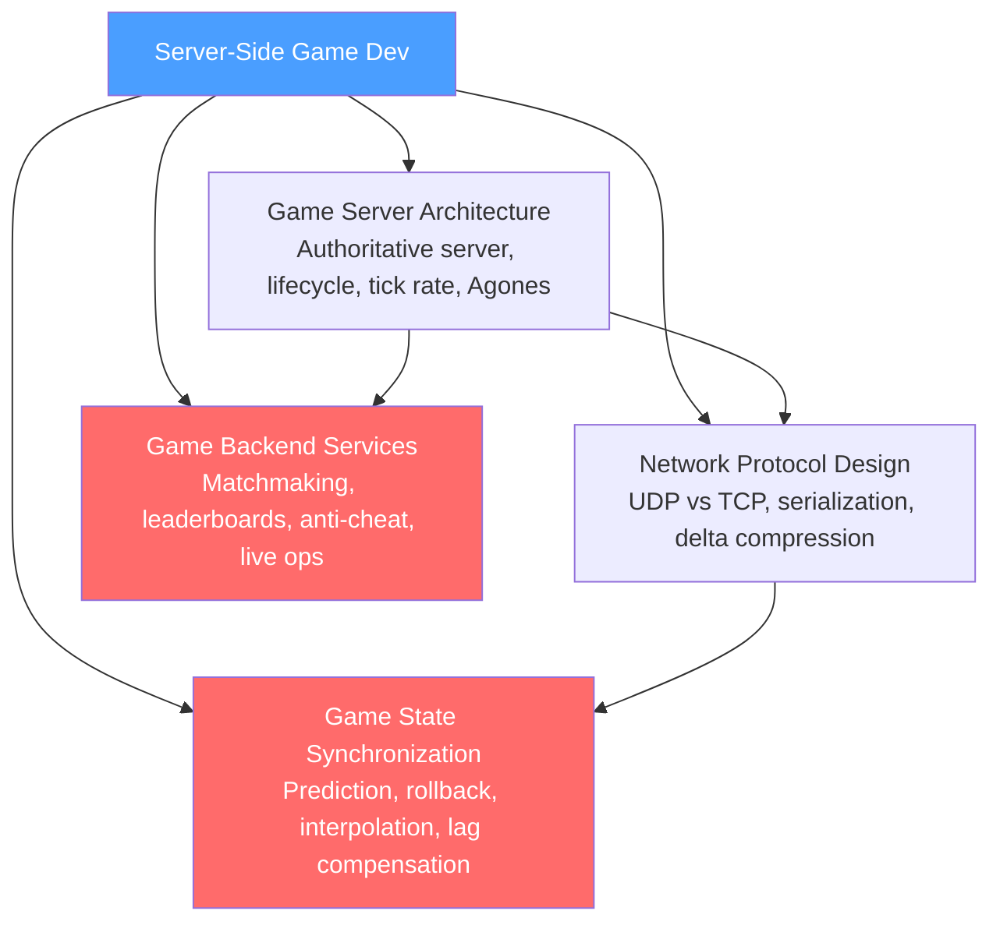

# Server-Side Game Development — Section MOC

> [!info] About this section
> 4 notes covering the back-end of online multiplayer games: authoritative server architecture (dedicated server vs P2P, tick rate, Agones), network protocol design (UDP vs TCP, custom reliability, delta compression), game state synchronization (client-side prediction, rollback netcode, snapshot interpolation), and backend services (matchmaking, leaderboards, anti-cheat, live ops).

## Concept Map

## Notes in This Section

| Note | Core Idea | Key Concepts |
|------|-----------|--------------|
| [[Game_Server_Architecture]] | Authoritative server model (server validates all state), dedicated vs P2P vs relay, match server lifecycle, tick rate (20/64/128Hz), Agones Kubernetes orchestration | Authoritative server, tick rate, Agones, fleet scaling |
| [[Network_Protocol_Design]] | UDP over TCP (no head-of-line blocking), custom reliability layer (ACK bitfield), Protobuf serialization, delta compression, interest management | UDP, reliable UDP, Protobuf, interest management |
| [[Game_State_Synchronization]] | Client-side prediction + server reconciliation (shooters), rollback netcode (GGPO, fighting games), snapshot interpolation with rendering delay, lag compensation | Rollback netcode, client prediction, lag compensation, GGPO |
| [[Game_Backend_Services]] | ELO/MMR matchmaking with bracket expansion, Redis Sorted Set leaderboards, JWT session management, analytics pipeline, anti-cheat (statistical + server-side), live ops with feature flags | ELO, Redis ZSet, matchmaking, anti-cheat |

## Learning Path

1. [[Game_Server_Architecture]] — understand why authoritative servers exist and how game servers differ from web servers
2. [[Network_Protocol_Design]] — learn the protocol layer: UDP, reliability, serialization, bandwidth optimization
3. [[Game_State_Synchronization]] — master the hardest problem: making distributed clients feel responsive
4. [[Game_Backend_Services]] — complete the backend: matchmaking, leaderboards, analytics, anti-cheat

## Related Notes (in this vault)

- [[Game_Networking]] — *05 Game Systems* note: higher-level multiplayer networking concepts
- [[AI_Pathfinding]] — server-side AI systems in authoritative game servers
- [[Game_Development_Overview]] — context on online games, genres, dedicated server usage

#MOC #GameDev #ServerSide
