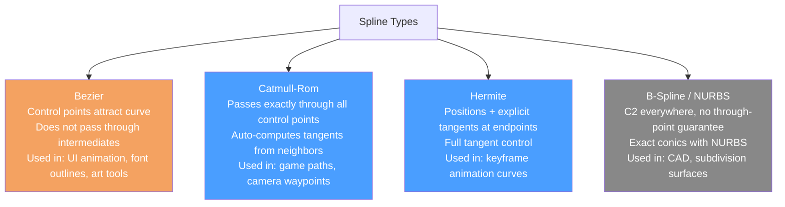

# Curves and Splines

> [!abstract] TL;DR
> Curves and splines define smooth paths through control points — used for character animation, camera paths, projectile trajectories, and road/rail systems. Bezier curves (used in UI and art tools) are defined by control points that attract the curve. Catmull-Rom splines pass exactly through control points, making them ideal for game paths. Hermite splines give direct tangent control. B-splines trade through-point accuracy for guaranteed smoothness.

## Why Curves Matter in Games

A straight line between two positions produces mechanical, robotic motion. Splines produce smooth, organic-looking motion with minimal data — three or four control points can describe a graceful arc that would otherwise require hundreds of keyframes.

Think of a curve as a recipe: the control points are the ingredients, and the parameter `t ∈ [0, 1]` is how far along the recipe you follow. At t=0 you have the starting ingredient; at t=1 you have the finished dish. What happens in between depends on which type of curve you choose.

Game uses of splines:
- **Camera paths**: cinematic camera flythroughs following a Catmull-Rom spline through waypoints
- **Animation curves**: Unity's AnimationCurve, Unreal's Curve Assets — Bezier segments between keyframes
- **AI patrol routes**: NPC paths through a level
- **Projectile trajectories**: grenade arcs, guided missiles
- **Road/rail systems**: procedural road geometry extruded along a spline
- **UI tweening**: easing functions as Bezier curves

## Bezier Curves

A Bezier curve of degree n is defined by n+1 **control points**. The curve passes through the first and last control points but is only *attracted toward* intermediate control points (they act as magnets, not waypoints).

**Linear Bezier (degree 1)**: a straight line between P0 and P1.
`B(t) = (1-t)*P0 + t*P1`

**Quadratic Bezier (degree 2)**: one control point P1 attracts the curve.
`B(t) = (1-t)²*P0 + 2(1-t)t*P1 + t²*P2`

**Cubic Bezier (degree 3)**: two control points P1, P2 — the most common in game tools (Unity AnimationCurve, SVG paths, font outlines).
`B(t) = (1-t)³*P0 + 3(1-t)²t*P1 + 3(1-t)t²*P2 + t³*P3`

The cubic form can be written as a matrix multiplication:

```
[P0]
B(t) = [t³  t²  t  1] × M_bezier × [P1]
[P2]
[P3]
```

```csharp
// Cubic Bezier evaluation in C#
public static Vector3 EvaluateCubicBezier(
    Vector3 p0, Vector3 p1, Vector3 p2, Vector3 p3, float t)
{
    float u  = 1f - t;
    float u2 = u * u;
    float u3 = u2 * u;
    float t2 = t * t;
    float t3 = t2 * t;
    return u3 * p0 + 3f * u2 * t * p1 + 3f * u * t2 * p2 + t3 * p3;
}

// Tangent (first derivative) — for velocity and orientation along the curve
public static Vector3 CubicBezierTangent(
    Vector3 p0, Vector3 p1, Vector3 p2, Vector3 p3, float t)
{
    float u = 1f - t;
    return 3f * u * u * (p1 - p0) + 6f * u * t * (p2 - p1) + 3f * t * t * (p3 - p2);
}
```

**Spline from multiple Bezier segments**: a smooth path through many points uses a sequence of cubic Bezier segments. Smoothness at junctions requires the tangents to be **C1 continuous** (matching direction and magnitude) or at minimum **G1** (matching direction only).

## Catmull-Rom Splines

A Catmull-Rom spline passes exactly through all control points (interpolating rather than approximating). Given four consecutive points P0, P1, P2, P3, the segment from P1 to P2 is:

`P(t) = 0.5 * [(2P1) + (-P0 + P2)t + (2P0 - 5P1 + 4P2 - P3)t² + (-P0 + 3P1 - 3P2 + P3)t³]`

```csharp
// Catmull-Rom evaluation — automatically generates tangents from adjacent points
public static Vector3 CatmullRom(
    Vector3 p0, Vector3 p1, Vector3 p2, Vector3 p3, float t)
{
    float t2 = t * t;
    float t3 = t2 * t;
    return 0.5f * (
        (2f * p1) +
        (-p0 + p2) * t +
        (2f * p0 - 5f * p1 + 4f * p2 - p3) * t2 +
        (-p0 + 3f * p1 - 3f * p2 + p3) * t3
    );
}

// Follow a path through N waypoints using Catmull-Rom
public class SplinePath : MonoBehaviour {
    public Transform[] waypoints;  // path control points

    // Get position at normalized path parameter s ∈ [0,1]
    public Vector3 GetPositionAt(float s) {
        int n = waypoints.Length;
        float scaledT = s * (n - 1);      // map [0,1] to [0, n-1]
        int i = Mathf.FloorToInt(scaledT);
        float t = scaledT - i;            // local t within segment

        // Clamp indices with reflection for endpoint tangents
        Vector3 p0 = waypoints[Mathf.Max(i - 1, 0)].position;
        Vector3 p1 = waypoints[i].position;
        Vector3 p2 = waypoints[Mathf.Min(i + 1, n - 1)].position;
        Vector3 p3 = waypoints[Mathf.Min(i + 2, n - 1)].position;

        return CatmullRom(p0, p1, p2, p3, t);
    }
}
```

**Why Catmull-Rom for game paths**: because it passes through every control point, designers can place waypoints visually in the editor and know the path goes exactly through them. Bezier curves require additional tangent handle adjustment.

## Hermite Splines

A Hermite curve is defined by its **start/end positions and start/end tangent vectors**. Unlike Catmull-Rom (which infers tangents from neighbors) or Bezier (control points attract the curve), Hermite gives the artist direct control over both position and velocity at each point.

`P(t) = h00(t)*P0 + h10(t)*T0 + h01(t)*P1 + h11(t)*T1`

Where the basis functions are:
- `h00(t) = 2t³ - 3t² + 1` (blends P0)
- `h10(t) = t³ - 2t² + t` (blends T0)
- `h01(t) = -2t³ + 3t²` (blends P1)
- `h11(t) = t³ - t²` (blends T1)

Unity's `AnimationCurve` uses Hermite splines internally — each keyframe stores a time/value pair plus in/out tangent slopes. This is why you can create sharp corners or smooth transitions at any keyframe independently.

## B-Splines (Basis Splines)

B-splines do not pass through control points (except at the endpoints, if "clamped"). Instead, they guarantee **C2 continuity** (smooth curvature changes) everywhere along the curve, including at control point junctions. This makes them ideal for smooth surfaces and when continuity must be guaranteed globally.

**NURBS** (Non-Uniform Rational B-Splines) extend B-splines with weights per control point, allowing exact representation of conic sections (circles, ellipses) — impossible with polynomial curves. NURBS are the standard in CAD/CAM software and 3D modeling packages.

In games, B-splines appear in:
- Subdivision surface algorithms (Catmull-Clark subdivision uses B-spline limit surfaces)
- High-quality camera rig systems requiring smooth second derivatives
- Cloth/hair simulation constraint curves

## Curve Types at a Glance



## Uniform vs Arc-Length Parameterization

A key problem with polynomial splines: uniform parameter steps `t` do not produce uniform **distance** steps along the curve. A parameterized spline moves quickly in high-curvature regions and slowly in low-curvature regions. A camera moving at constant `dt` steps will appear to slow down on gentle curves and speed up on sharp turns.

**Arc-length reparameterization**: sample the curve at many `t` values, compute cumulative arc lengths, and build a lookup table `s → t` (where `s` is total distance). To move at constant speed, look up the `t` value for the desired arc-length position.

```csharp
// Build arc-length lookup table
public float[] BuildArcLengthTable(int samples) {
    float[] table = new float[samples + 1];
    table[0] = 0;
    Vector3 prev = GetPositionAt(0);
    for (int i = 1; i <= samples; i++) {
        float s = (float)i / samples;
        Vector3 curr = GetPositionAt(s);
        table[i] = table[i - 1] + Vector3.Distance(prev, curr);
        prev = curr;
    }
    return table;  // table[i] = total arc length at uniform parameter (i/samples)
}
```

## Trade-offs

| Curve Type | Through-Point | Continuity | Tangent Control | Complexity |
|-----------|---------------|------------|-----------------|------------|
| **Linear** | Yes (all points) | C0 (corners) | None | Trivial |
| **Bezier (cubic)** | Start/end only | C1 (with care) | Via control points | Low |
| **Catmull-Rom** | Yes (all points) | C1 everywhere | Auto from neighbors | Low |
| **Hermite** | Yes (endpoints) | C1 per segment | Explicit tangents | Medium |
| **B-Spline** | Endpoints only | C2 everywhere | Via control points | High |
| **NURBS** | Endpoints only | C2, exact conics | Via weights | High |

## Common Pitfalls

- **Using uniform t instead of arc-length**: a camera flying along a Catmull-Rom spline with uniform `t` steps jerks through tight bends and crawls through gentle curves. Always reparameterize by arc length for speed-correct traversal.
- **Sharp corners from C0-only junction continuity**: if two Bezier segments meet with matching positions but mismatched tangent directions, there is a visible sharp corner. For smooth joins, enforce C1: `outTangent_i = -inTangent_{i+1}`.
- **Catmull-Rom at endpoints**: the standard Catmull-Rom formula needs P0 and P3 for the P1→P2 segment. At the path start, P0 is undefined. Either duplicate the first point (`p0 = p1 - (p2 - p1)`) or clamp to an available neighbor.
- **Evaluating curves every frame for moving objects**: re-evaluating a Catmull-Rom spline per frame is fine for single objects. For many objects (AI convoy), precompute waypoints at a fine step interval and lerp between them instead of calling the spline formula per frame.
- **Forgetting to normalize the tangent for orientation**: `CubicBezierTangent()` returns a velocity vector, not a unit direction. For object orientation along the curve (facing direction), always `normalize(tangent)` before computing the look-at rotation.

## Review Questions

1. What is the key difference between a Bezier curve and a Catmull-Rom spline in terms of which control points the curve passes through?
2. A camera moving along a spline at uniform `dt` steps appears to speed up on straight sections and slow down on curves. What is the root cause, and how does arc-length reparameterization fix it?
3. Unity's `AnimationCurve` uses Hermite splines internally. What data does each keyframe store, and what does the in/out tangent control?
4. Why does B-spline continuity guarantee C2 while a chain of Catmull-Rom segments only guarantees C1?
5. You are building a racing game with a procedural track. The track centerline is defined as a spline. List three distinct uses of spline evaluation needed for the game to work.

## Related Concepts

- [[_MOC_Game_Development_Master|↑ Game Development MOC]]
- [[Game_Math_Fundamentals|Game Math Fundamentals]]
- [[Spatial_Partitioning|Spatial Partitioning]]

#GameDev
