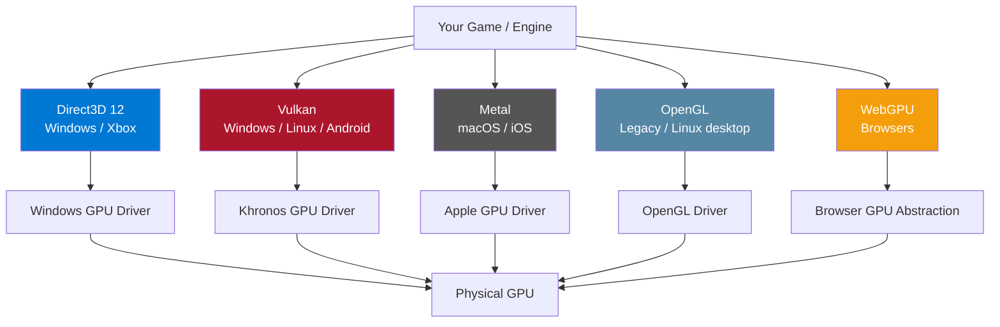

# DirectX and OpenGL

> [!abstract] TL;DR
> Graphics APIs are the software layer between your code and the GPU. OpenGL (1992) is the mature, high-level, driver-managed API — easy to start but with unpredictable overhead. DirectX 12, Vulkan, and Metal are modern "explicit" APIs that expose raw GPU control for lower overhead and better multithreading. WebGL brings OpenGL ES to browsers. Engines abstract all of this — but understanding the API layer explains rendering performance and porting constraints.

## Why APIs Exist

The GPU is a piece of hardware with its own instruction set, memory, and execution model. Writing raw GPU commands would require knowing the exact hardware — NVIDIA, AMD, Intel, Apple, Qualcomm — each has a different internal architecture. Graphics APIs (Application Programming Interfaces) provide a **hardware abstraction layer**: you call `DrawIndexed(...)` and the driver translates that into whatever the specific GPU requires.

Think of a graphics API like a restaurant where the customer (your code) orders off a menu (the API), the waiter (the driver) takes the order to the kitchen (the GPU), and the GPU cooks (executes shaders). Older APIs (OpenGL) are full-service restaurants — the waiter handles everything. Modern APIs (Vulkan, DX12) are more like a commissary where you must coordinate your own supply chain, but you get exactly what you need with no overhead.

## OpenGL

OpenGL (Open Graphics Library, 1992) is the oldest widely-used API, now maintained by Khronos Group. It uses a **state machine model**: you set global state (which texture is bound, what blend mode is active, which shader is active), then issue draw calls. The driver reads all that state when the draw call arrives and figures out what the GPU needs.

**Key characteristics:**
- Single-threaded by design — all calls go to one context on one thread
- Driver does heavy lifting: validates parameters, manages GPU memory, synchronizes CPU/GPU automatically
- Mature, well-documented, runs on Windows/Linux/macOS (deprecated on macOS post-10.14)/Android
- Core profile (modern, no deprecated features) vs Compatibility profile (legacy compatibility)

```c
// OpenGL draw call — state machine style
glUseProgram(shaderProgram);          // bind shader
glBindVertexArray(vao);               // bind vertex layout
glBindTexture(GL_TEXTURE_2D, tex);    // bind texture to texture unit 0
glUniformMatrix4fv(mvpLocation, 1, GL_FALSE, &mvpMatrix[0][0]); // upload uniform
glDrawElements(GL_TRIANGLES, indexCount, GL_UNSIGNED_INT, 0);  // draw!
```

**OpenGL ES** is the embedded subset for mobile (Android, iOS pre-Metal) and WebGL. OpenGL ES 3.0/3.1/3.2 add compute shaders, geometry shaders, and other modern features.

## DirectX (Direct3D)

**DirectX** is Microsoft's suite of multimedia APIs for Windows (and Xbox). **Direct3D** is the 3D graphics component:

- **Direct3D 9 (2002)**: the "classic" API, still used for legacy support and some indie games
- **Direct3D 11 (2009)**: shader model 5.0, compute shaders, deferred contexts — still widely used in Unity
- **Direct3D 12 (2015)**: explicit, low-level API — see Vulkan section for the philosophy

Unity uses Direct3D 11 by default on Windows (with DX12 opt-in). Unreal Engine uses Direct3D 12 by default on Windows for modern hardware.

```hlsl
// HLSL shader entry points are named explicitly
// The CPU side specifies "VSMain" and "PSMain" when creating the PSO
VertexOutput VSMain(VertexInput input) { ... }  // vertex entry
float4       PSMain(PSInput input) : SV_TARGET { ... }  // pixel entry
```

## Vulkan

Vulkan (2016, Khronos Group) is the explicit, cross-platform successor to OpenGL. It targets Windows, Linux, Android, and (via MoltenVK translation layer) macOS and iOS. Vulkan exposes raw GPU control — you manage memory, synchronization, command recording, and resource state transitions manually.

**Why Vulkan exists:** OpenGL drivers had accumulated enormous complexity to manage GPU state on behalf of applications. This driver work happened unpredictably (at draw call time), causing stutters. Vulkan moves all that responsibility to the developer, making behavior predictable and eliminating driver overhead.

## Metal

**Metal** (Apple, 2014) is Apple's low-level graphics API for macOS, iOS, and tvOS. It has the same explicit philosophy as Vulkan but is Apple-proprietary. Unreal Engine and Unity both target Metal for Apple platforms. MoltenVK translates Vulkan calls to Metal, enabling Vulkan-based code to run on Apple Silicon.

## WebGL

**WebGL** (Khronos) runs in browsers and is essentially OpenGL ES 2.0 (WebGL 1) or ES 3.0 (WebGL 2) exposed via JavaScript. **WebGPU** (2023) is the modern, Vulkan/Metal-inspired browser API offering compute shaders and better performance. Unity's browser export targets WebGL; Three.js and Babylon.js are JavaScript WebGL frameworks.

## API Comparison



| Property | OpenGL | DirectX 12 | Vulkan | Metal | WebGL 2 |
|----------|--------|------------|--------|-------|---------|
| **Year** | 1992 | 2015 | 2016 | 2014 | 2017 |
| **Platforms** | Win/Linux/macOS† | Win/Xbox | Win/Linux/Android | macOS/iOS | All browsers |
| **Abstraction level** | High | Low (explicit) | Low (explicit) | Low (explicit) | High |
| **Driver overhead** | High | Minimal | Minimal | Minimal | High |
| **Multithreaded recording** | No | Yes | Yes | Yes | No |
| **Validation layer** | Built-in (slow) | Debug layer | Validation layers | Xcode GPU capture | Browser devtools |
| **Learning curve** | Low | Very high | Very high | High | Low |
| **Best for** | Learning, tools, Linux desktop | Windows AAA games | Cross-platform AAA | Apple platforms | Browser games |

†macOS deprecated OpenGL in 2018; minimum supported version is 4.1.

## Command Buffers

Modern APIs (DX12, Vulkan, Metal) use **command buffers** instead of immediate-mode calls. You record GPU commands into a buffer on any CPU thread, then submit the buffer to a queue for execution. This enables:
- **Multithreaded rendering**: record commands on many threads simultaneously
- **Pre-recorded commands**: record static scene geometry once, replay every frame
- **Explicit GPU synchronization**: you control when the GPU starts and finishes work

```cpp
// Vulkan command buffer recording
VkCommandBufferBeginInfo beginInfo{};
beginInfo.sType = VK_STRUCTURE_TYPE_COMMAND_BUFFER_BEGIN_INFO;
vkBeginCommandBuffer(commandBuffer, &beginInfo);

// Begin render pass
vkCmdBeginRenderPass(commandBuffer, &renderPassInfo, VK_SUBPASS_CONTENTS_INLINE);

// Bind pipeline (shader + render state)
vkCmdBindPipeline(commandBuffer, VK_PIPELINE_BIND_POINT_GRAPHICS, graphicsPipeline);

// Bind descriptor sets (textures, uniform buffers)
vkCmdBindDescriptorSets(commandBuffer, VK_PIPELINE_BIND_POINT_GRAPHICS,
    pipelineLayout, 0, 1, &descriptorSet, 0, nullptr);

// Bind vertex buffer
VkBuffer vertexBuffers[] = {vertexBuffer};
VkDeviceSize offsets[]   = {0};
vkCmdBindVertexBuffers(commandBuffer, 0, 1, vertexBuffers, offsets);

// Draw!
vkCmdDrawIndexed(commandBuffer, indexCount, 1, 0, 0, 0);

vkCmdEndRenderPass(commandBuffer);
vkEndCommandBuffer(commandBuffer);

// Submit to GPU queue for execution
VkSubmitInfo submitInfo{};
submitInfo.commandBufferCount = 1;
submitInfo.pCommandBuffers    = &commandBuffer;
vkQueueSubmit(graphicsQueue, 1, &submitInfo, inFlightFence);
```

## Render Targets and Swap Chains

The **swap chain** is a series of framebuffer images that alternate between being displayed on screen and being rendered into. The most common setup is **double buffering** (one being displayed, one being rendered to) or **triple buffering** (one displayed, one queued, one being rendered — reduces GPU stalls at the cost of 1 frame of latency).

**Present mode** controls V-Sync behavior:
- `IMMEDIATE`: no V-Sync, no tearing prevention, potentially torn frames
- `FIFO`: V-Sync on, GPU waits for next vertical blank — limits to monitor refresh rate
- `MAILBOX` (Vulkan): triple buffer — replaces pending image if a new one is ready; reduces latency vs FIFO

## Common Pitfalls

- **Implicit synchronization in OpenGL killing performance**: OpenGL's `glGetError()` and `glReadPixels()` force the CPU to stall until the GPU completes all queued work. This synchronization bubble can halve GPU utilization. Use `GL_ARB_debug_output` callbacks instead, or switch to Vulkan for profiling.
- **Forgetting image layout transitions in Vulkan**: Vulkan textures exist in layout states (UNDEFINED, COLOR_ATTACHMENT_OPTIMAL, SHADER_READ_ONLY_OPTIMAL, etc.). Using a texture for sampling without transitioning it from its previous layout causes validation errors and undefined behavior. Use pipeline barriers correctly.
- **One PSO per material, not per draw call**: Pipeline State Objects (PSOs) are expensive to create and contain all shader + render state. Create them at load time, not mid-frame. Cache PSOs keyed on material type, not per-object.
- **Resizing the swap chain on window resize**: when the window is resized, the swap chain must be recreated to match the new dimensions. Failing to handle `VK_ERROR_OUT_OF_DATE_KHR` causes rendering to fail or produce stretched output.
- **Not enabling the Vulkan validation layer during development**: Vulkan does virtually no parameter validation in release mode for performance. Enable validation layers (`VK_LAYER_KHRONOS_validation`) during development — they catch nearly every API misuse with clear error messages.

## Review Questions

1. What fundamental problem with OpenGL's driver model motivated the creation of Vulkan and DirectX 12?
2. What is a command buffer, and why does it enable multithreaded rendering while OpenGL's immediate mode does not?
3. What is a swap chain, and what is the difference between FIFO and MAILBOX present modes?
4. An image layout transition in Vulkan is implemented with a pipeline barrier. What are you actually synchronizing between, and why is this necessary?
5. If you are writing a cross-platform 3D game targeting Windows, Linux, Android, and macOS, which graphics API would you choose as primary and why?

## Related Concepts

- [[_MOC_Game_Development_Master|↑ Game Development MOC]]
- [[Rendering_Pipeline|Rendering Pipeline]]
- [[HLSL_and_GLSL|HLSL and GLSL]]
- [[Vulkan_Basics|Vulkan Basics]]

#GameDev
