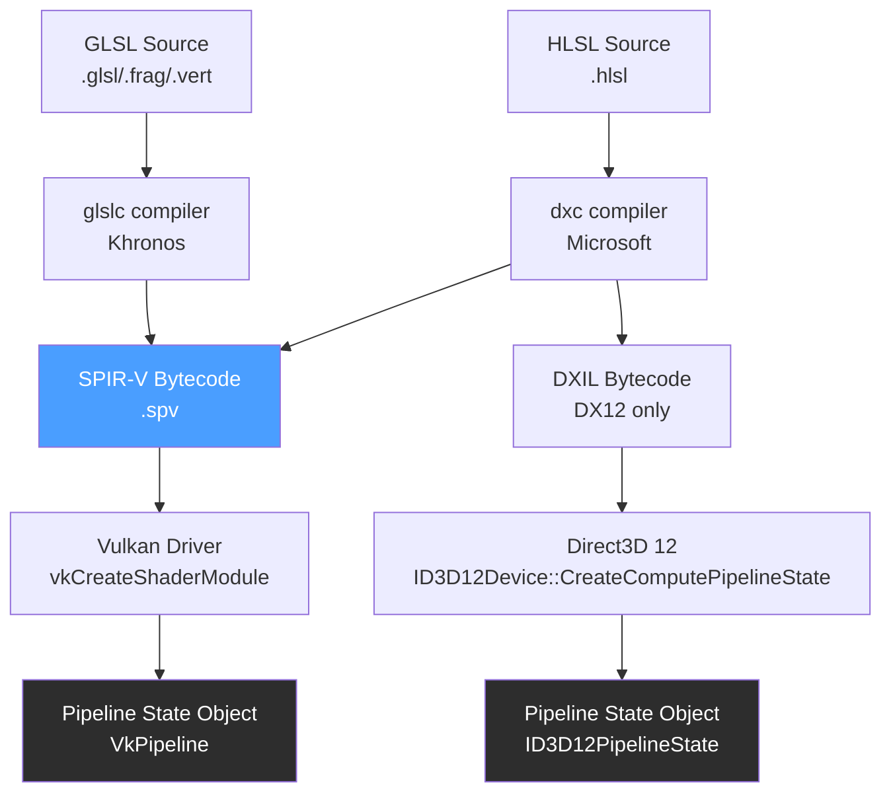

# HLSL and GLSL

> [!abstract] TL;DR
> HLSL (DirectX) and GLSL (OpenGL/Vulkan) are C-like languages that run on the GPU. Both have vertex and fragment shaders with near-identical conceptual models: transform vertices in the vertex stage, shade pixels in the fragment stage. Key differences are naming conventions, binding models, and compiler toolchains. SPIR-V bytecode bridges GLSL/HLSL to Vulkan.

## Shader Languages Overview

Think of shaders as small C programs that execute in extreme parallel — one invocation per vertex or per fragment, with thousands running simultaneously on GPU cores. HLSL and GLSL share the same underlying model: you write a function that receives per-vertex or per-fragment data, performs math, and outputs a result. The GPU executes this function millions of times per frame.

**HLSL** (High-Level Shader Language) is Microsoft's shader language, used with Direct3D (DirectX). It is also supported in Vulkan via SPIR-V compilation (using DXC — DirectX Shader Compiler). Unity's ShaderLab compiles to HLSL; Unreal Engine's material graph generates HLSL.

**GLSL** (OpenGL Shading Language) is the shader language for OpenGL and Vulkan (compiled to SPIR-V). Godot uses GLSL for custom shaders. WebGL runs a subset of GLSL (GLSL ES 1.00 and 3.00).

**SPIR-V** is the intermediate bytecode that Vulkan consumes. Both HLSL and GLSL can be compiled to SPIR-V. This means you can write shaders in either language for Vulkan — `glslc` compiles GLSL, `dxc` compiles HLSL.

## Vertex Shaders

The vertex shader's contract: receive one vertex's data, output its clip-space position plus any per-vertex data to interpolate toward fragment shaders.

```glsl
// GLSL vertex shader (Vulkan / OpenGL)
#version 450

// Input attributes — layout(location) must match the vertex buffer binding
layout(location = 0) in vec3 inPosition;
layout(location = 1) in vec3 inNormal;
layout(location = 2) in vec2 inUV;

// Uniform buffer object — read-only data shared by all vertices in a draw call
layout(set = 0, binding = 0) uniform Matrices {
    mat4 model;
    mat4 view;
    mat4 projection;
} mvp;

// Outputs to rasterizer — rasterizer interpolates these across the triangle
layout(location = 0) out vec3 vNormal;
layout(location = 1) out vec2 vUV;
layout(location = 2) out vec3 vWorldPos;

void main() {
    vec4 worldPos = mvp.model * vec4(inPosition, 1.0);
    vWorldPos     = worldPos.xyz;
    vNormal       = normalize(mat3(transpose(inverse(mvp.model))) * inNormal);
    vUV           = inUV;
    gl_Position   = mvp.projection * mvp.view * worldPos;
}
```

```hlsl
// HLSL vertex shader (DirectX 12 / Unity)
struct VertexInput {
    float3 position : POSITION;  // POSITION semantic maps to IA slot
    float3 normal   : NORMAL;
    float2 uv       : TEXCOORD0;
};

struct VertexOutput {
    float4 clipPos  : SV_POSITION;  // SV_ = System Value semantic
    float3 normal   : NORMAL;
    float2 uv       : TEXCOORD0;
    float3 worldPos : TEXCOORD1;
};

cbuffer MatrixBuffer : register(b0) {
    float4x4 model;
    float4x4 view;
    float4x4 projection;
};

VertexOutput VSMain(VertexInput input) {
    VertexOutput output;
    float4 worldPos   = mul(model, float4(input.position, 1.0));
    output.worldPos   = worldPos.xyz;
    output.normal     = mul((float3x3)model, input.normal);
    output.uv         = input.uv;
    output.clipPos    = mul(projection, mul(view, worldPos));
    return output;
}
```

## Fragment (Pixel) Shaders

The fragment shader runs once per rasterized fragment. It receives the interpolated outputs from the vertex shader and writes color to the render target.

```glsl
// GLSL fragment shader
#version 450

layout(location = 0) in vec3 vNormal;
layout(location = 1) in vec2 vUV;
layout(location = 2) in vec3 vWorldPos;

// Textures are sampled via combined image samplers in GLSL / Vulkan
layout(set = 1, binding = 0) uniform sampler2D albedoMap;
layout(set = 1, binding = 1) uniform sampler2D normalMap;

layout(push_constant) uniform PushConstants {
    vec3 lightDir;    // world space, normalized toward light
    float time;
} pc;

layout(location = 0) out vec4 outColor;  // output to render target

void main() {
    vec3 albedo = texture(albedoMap, vUV).rgb;

    // Normal mapping: decode tangent-space normal from texture, transform to world
    vec3 tangentNormal = texture(normalMap, vUV).rgb * 2.0 - 1.0;  // [0,1] → [-1,1]
    vec3 N = normalize(vNormal);                          // use vertex normal as approximation

    float NdotL  = max(dot(N, normalize(pc.lightDir)), 0.0);
    vec3 diffuse = albedo * NdotL;
    vec3 ambient = albedo * 0.08;

    // Simple gamma correction: convert linear to sRGB for display
    vec3 color = pow(ambient + diffuse, vec3(1.0 / 2.2));
    outColor   = vec4(color, 1.0);
}
```

```hlsl
// HLSL pixel shader (DirectX 12)
Texture2D albedoMap : register(t0);
SamplerState linearSampler : register(s0);

struct PSInput {
    float4 clipPos  : SV_POSITION;
    float3 normal   : NORMAL;
    float2 uv       : TEXCOORD0;
    float3 worldPos : TEXCOORD1;
};

float4 PSMain(PSInput input) : SV_TARGET {
    float3 albedo = albedoMap.Sample(linearSampler, input.uv).rgb;
    float3 N      = normalize(input.normal);
    float3 L      = normalize(float3(1, 1, 1));     // directional light direction
    float NdotL   = max(dot(N, L), 0.0);
    float3 color  = albedo * (0.08 + NdotL);
    // Gamma correction
    color = pow(color, 1.0 / 2.2);
    return float4(color, 1.0);
}
```

## Uniforms and Push Constants

Uniforms are read-only values shared across all invocations of a shader within a draw call. They are uploaded by the CPU before the draw call and read by every vertex and fragment shader invocation.

**GLSL uniform blocks** and **HLSL constant buffers (cbuffer)** serve the same purpose — grouping related scalars/vectors/matrices into a GPU-visible buffer. In Vulkan, these are backed by `VkBuffer` objects bound via descriptor sets.

**Push constants** (Vulkan) / **root constants** (DirectX 12) are a small, extremely fast path for per-draw-call scalars. Typically 128 bytes (guaranteed minimum). Use for: draw index, material ID, transform index (with bindless rendering). They bypass descriptor sets entirely for minimal overhead.

```glsl
// Push constants in GLSL (Vulkan)
layout(push_constant) uniform PushConstants {
    uint materialIndex;
    uint transformIndex;
    float time;
    float padding;
} pc;
```

## Varyings and Interpolation Qualifiers

Varyings are the per-vertex outputs from the vertex shader that the rasterizer interpolates across the triangle for each fragment. By default, interpolation is **perspective-correct linear**. You can modify this with interpolation qualifiers:

| GLSL Qualifier | HLSL Semantic Modifier | Effect |
|---------------|----------------------|--------|
| `smooth` (default) | (default) | Perspective-correct linear interpolation |
| `flat` | `nointerpolation` | No interpolation — use provoking vertex value |
| `noperspective` | `noperspective` | Linear interpolation without perspective correction |
| `centroid` | `centroid` | Samples at centroid of coverage, prevents aliasing at edges |

Use `flat` for integer data (material IDs, object IDs) since integers cannot be meaningfully interpolated. Use `centroid` for UV coordinates near triangle edges to prevent texture sampling outside the triangle.

## Shader Compilation Pipeline



**Key points:**
- Shader source is compiled to an intermediate representation (SPIR-V or DXIL), not directly to machine code.
- The GPU driver performs the final compilation from SPIR-V/DXIL to GPU machine code at pipeline state object (PSO) creation time.
- **PSO creation is expensive** (hundreds of milliseconds) — pre-compile and cache PSOs to prevent stutter when a new combination is first encountered in-game (shader compilation stutter).
- Unity compiles shader variants at build time via its ShaderLab system. Unreal uses its own material shader compiler.

## Common Pitfalls

- **Swizzling confusion between HLSL and GLSL**: `float4(1,0,0,1)` is the same in both. Swizzle syntax is identical: `.rgba` and `.xyzw`. But matrix multiplication order differs: HLSL uses row-major convention (`mul(vec, matrix)`), GLSL uses column-major (`matrix * vec`). Mixing these conventions produces incorrect transforms.
- **Precision loss in mediump**: mobile GPUs support `lowp`, `mediump`, and `highp` float precision. Using `mediump` for world-space positions causes visible quantization artifacts because `mediump` has only ~3 decimal digits of precision. Always use `highp` for positions; `mediump` is fine for colors.
- **Undefined behavior from uninitialized outputs**: if a vertex shader output (varying) is conditionally assigned inside a branch, fragments outside that branch receive undefined values. Initialize all varyings before the branch.
- **Not accounting for UV origin differences**: GLSL and DirectX use opposite Y axis conventions for UV space — in GLSL (OpenGL), UV (0,0) is the bottom-left; in HLSL (DirectX), it is the top-left. Textures appear vertically flipped when moving between APIs. Fix: flip V with `uv.y = 1.0 - uv.y`.
- **Shader variant explosion**: each `#ifdef` keyword doubles the number of shader variants needed. Unity and Unreal compile all keyword combinations at build time. 20 boolean keywords = 1,048,576 variants. Use `multi_compile` sparingly and prefer branching on uniform values at runtime for rarely-used paths.

## Review Questions

1. What is the difference between a uniform buffer and a push constant? When would you choose each?
2. Why does a GLSL fragment shader use `layout(location = 0) in vec3 vNormal` rather than declaring a fresh `vec3`? What does the rasterizer do to this value between the vertex and fragment stages?
3. What does SPIR-V provide that raw GLSL source does not? Why does this matter for Vulkan's portability?
4. Why does matrix multiplication order differ between HLSL and GLSL, and how do you correctly port a transform between the two languages?
5. What is PSO creation stutter, and what is the correct strategy to avoid it in a shipped game?

## Related Concepts

- [[_MOC_Game_Development_Master|↑ Game Development MOC]]
- [[Rendering_Pipeline|Rendering Pipeline]]
- [[DirectX_and_OpenGL|DirectX and OpenGL]]
- [[Vulkan_Basics|Vulkan Basics]]
- [[Lighting_and_Shadows|Lighting and Shadows]]

#GameDev
