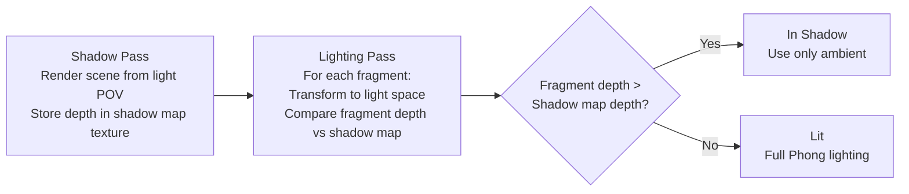

# Lighting and Shadows

> [!abstract] TL;DR
> Lighting in real-time graphics approximates physics with cheap math. The Phong/Blinn-Phong model breaks light into ambient, diffuse, and specular components. Shadow maps project the scene from the light's perspective to determine what is in shadow. Cascaded shadow maps solve shadow resolution scaling for large worlds. SSAO cheaply approximates contact shadows and ambient occlusion.

## The Lighting Problem

Real-world light bounces infinitely — a photon from the sun reflects off a wall onto a floor into your eyes, illuminating areas that have no direct line-of-sight to the sun. Simulating this perfectly in real-time is impossible. Real-time rendering uses **approximations**: models that look plausible while being computed in microseconds per pixel.

Think of real-time lighting like painting stage scenery: a skilled scene painter can paint a flat surface that looks convincingly three-dimensional from the audience's perspective, even though the light is "baked in" to the paint. The eye accepts the illusion because the cues (shadows, highlights, gradients) are consistent with what we expect.

## Light Types

**Directional Light**: simulates the sun — an infinitely distant light source casting parallel rays in one direction. No position, only direction. Every point in the scene receives light from the same direction. Cheap to compute: one direction vector shared by all fragments.

**Point Light**: emits light in all directions from a single position (like a light bulb). Intensity falls off with distance. Attenuation formula: `attenuation = 1.0 / (constant + linear*d + quadratic*d*d)`.

**Spot Light**: a point light with a cone constraint. Two cone angles: `innerCutoff` (full brightness within this angle) and `outerCutoff` (linear falloff between inner and outer). Computed using `dot(lightDir, spotDir)` vs cosine of cutoff angles.

**Area Light**: emits from a surface (rectangle, disk). Expensive to compute accurately — approximated in real-time via Linearly Transformed Cosines (LTC) or pre-baked lightmaps.

## Phong Lighting Model

The Phong model decomposes light into three independent terms:

**Ambient**: a flat, uniform illumination that approximates indirect/bounced light. Prevents unlit faces from being pure black. `ambient = ambientStrength * lightColor * albedo`

**Diffuse**: light scattered uniformly in all directions from a matte surface. Intensity depends on the angle between the surface normal and the light direction. `diffuse = max(dot(N, L), 0.0) * lightColor * albedo`

**Specular**: mirror-like reflection toward the camera. Intensity depends on the angle between the reflected light direction and the view direction. `specular = pow(max(dot(R, V), 0.0), shininess) * lightColor * specularColor`

Where `R = reflect(-L, N)` is the reflection vector.

```glsl
// Phong lighting in a GLSL fragment shader
#version 450

layout(location = 0) in vec3 fragWorldPos;
layout(location = 1) in vec3 fragNormal;
layout(location = 2) in vec2 fragUV;

layout(set = 0, binding = 1) uniform sampler2D albedoTex;

layout(push_constant) uniform Light {
    vec3  lightPos;
    vec3  lightColor;
    vec3  viewPos;
    float shininess;
} light;

layout(location = 0) out vec4 outColor;

void main() {
    vec3 albedo  = texture(albedoTex, fragUV).rgb;
    vec3 N       = normalize(fragNormal);
    vec3 L       = normalize(light.lightPos - fragWorldPos);
    vec3 V       = normalize(light.viewPos  - fragWorldPos);
    vec3 R       = reflect(-L, N);               // reflection of -L around N

    // Ambient
    vec3 ambient  = 0.1 * light.lightColor * albedo;

    // Diffuse
    float NdotL   = max(dot(N, L), 0.0);
    vec3 diffuse  = NdotL * light.lightColor * albedo;

    // Specular (Phong)
    float RdotV   = max(dot(R, V), 0.0);
    vec3 specular = pow(RdotV, light.shininess) * light.lightColor;

    outColor = vec4(ambient + diffuse + specular, 1.0);
}
```

## Blinn-Phong Improvement

The Blinn-Phong model replaces `dot(R, V)` with `dot(N, H)` where `H` is the **halfway vector**: `H = normalize(L + V)`. This is:
- **Faster**: avoids computing `reflect()`
- **More physically plausible**: the specular highlight doesn't cut off abruptly when the view angle exceeds 90° to the reflection
- **Better behaved at grazing angles**

```glsl
vec3 H       = normalize(L + V);           // halfway vector
float NdotH  = max(dot(N, H), 0.0);
vec3 specular = pow(NdotH, shininess) * light.lightColor;
```

Blinn-Phong is the basis for countless game engine material systems and remains the foundation even for physically-based rendering (PBR replaces it with a microfacet BRDF, but Blinn-Phong is the conceptual starting point).

## Shadow Maps

Shadow maps answer: "Is this fragment in shadow?" The answer comes from rendering the scene from the **light's point of view** to produce a depth map, then comparing each fragment's depth (from the light's perspective) to the stored depth.



**Shadow map lookup in fragment shader:**
```glsl
// Light-space transform applied in vertex shader
layout(location = 3) in vec4 fragLightSpacePos;

layout(set = 0, binding = 2) uniform sampler2DShadow shadowMap;

float computeShadow(vec4 lightSpacePos) {
    // Perspective divide → NDC, then to [0,1] texture range
    vec3 projCoords = lightSpacePos.xyz / lightSpacePos.w;
    projCoords      = projCoords * 0.5 + 0.5;

    // PCF: sample 9 nearby texels and average — softens shadow edges
    float shadow   = 0.0;
    vec2 texelSize = 1.0 / textureSize(shadowMap, 0);
    for (int x = -1; x <= 1; ++x) {
        for (int y = -1; y <= 1; ++y) {
            vec2 offset = vec2(x, y) * texelSize;
            // sampler2DShadow automatically compares depth and returns [0,1]
            shadow += texture(shadowMap, vec3(projCoords.xy + offset, projCoords.z - 0.005));
        }
    }
    return shadow / 9.0;  // 0 = fully in shadow, 1 = fully lit
}
```

**Shadow acne**: a self-shadowing artifact caused by the shadow map's limited precision. The surface partially shadows itself due to numerical errors. Fix: apply a **depth bias** — push the comparison value slightly (`projCoords.z - bias`). Too much bias causes **Peter Panning** (shadows detached from their casters).

**Percentage Closer Filtering (PCF)**: sample multiple neighboring shadow map texels and average the comparison results. Produces soft shadow edges without true soft shadows. Hardware `sampler2DShadow` performs this comparison automatically.

## Cascaded Shadow Maps (CSM)

A shadow map covers a frustum's depth range linearly, but most of the shadow map resolution is wasted on distant objects. Close-up shadows look pixelated because nearby geometry only occupies a small fraction of the shadow map.

**CSM** divides the view frustum into distance bands (cascades) and renders a separate shadow map for each cascade. Near cascades use a tight frustum → high shadow resolution. Far cascades use a wide frustum → lower resolution, but distant shadows don't need as much detail.

| Cascade | Distance range | Shadow map texels per world unit | Visual quality |
|---------|---------------|----------------------------------|----------------|
| Cascade 0 | 0 – 10m | High (tight frustum) | Sharp, detailed |
| Cascade 1 | 10 – 50m | Medium | Good |
| Cascade 2 | 50 – 200m | Low (wide frustum) | Acceptable |
| Cascade 3 | 200 – 1000m | Very low | Coarse but distant |

The fragment shader selects which cascade to sample by comparing the fragment's view-space depth to the cascade split distances.

## Screen-Space Ambient Occlusion (SSAO)

Ambient occlusion approximates how much ambient light reaches a surface point based on local geometry. Crevices, corners, and concave surfaces receive less ambient light (they are partially occluded by nearby geometry). This darkening provides crucial depth cues and contact shadow effects.

**SSAO** computes this cheaply in screen space using the G-Buffer depth and normal. For each fragment:
1. Sample N random points in a hemisphere oriented along the surface normal
2. Project each sample point to screen space and look up its depth in the G-Buffer
3. Count how many sample points are "occluded" (their depth is behind the G-Buffer depth at that screen position)
4. The occlusion factor scales the ambient lighting term

```glsl
// SSAO fragment shader sketch
uniform sampler2D gPosition;   // world-space positions
uniform sampler2D gNormal;     // world-space normals
uniform sampler2D texNoise;    // random rotation vectors (tiled 4×4)
uniform vec3 samples[64];      // hemisphere samples in tangent space

float computeSSAO(vec2 uv) {
    vec3 fragPos = texture(gPosition, uv).rgb;
    vec3 normal  = normalize(texture(gNormal, uv).rgb);
    vec3 randomVec = texture(texNoise, uv * noiseScale).rgb;

    // Build TBN matrix to transform samples from tangent to view space
    vec3 tangent   = normalize(randomVec - normal * dot(randomVec, normal));
    vec3 bitangent = cross(normal, tangent);
    mat3 TBN       = mat3(tangent, bitangent, normal);

    float occlusion = 0.0;
    for (int i = 0; i < 64; ++i) {
        vec3 samplePos = TBN * samples[i];       // tangent → view space
        samplePos      = fragPos + samplePos * radius;
        // Project to screen and sample G-Buffer depth at that location
        vec4 offset = projection * vec4(samplePos, 1.0);
        offset.xyz /= offset.w;
        offset.xyz  = offset.xyz * 0.5 + 0.5;
        float sampleDepth = texture(gPosition, offset.xy).z;
        float rangeCheck  = smoothstep(0.0, 1.0, radius / abs(fragPos.z - sampleDepth));
        occlusion += (sampleDepth >= samplePos.z + bias ? 1.0 : 0.0) * rangeCheck;
    }
    return 1.0 - (occlusion / 64.0);  // 1.0 = fully lit, 0.0 = fully occluded
}
```

**Blur pass**: SSAO output is noisy due to random sampling. Always apply a bilateral blur (edge-preserving blur) pass afterward to smooth results while preserving shadow edges.

## Common Pitfalls

- **Shadow acne without bias, Peter Panning with too much bias** — shadow bias must be tuned per-light and per-scene scale. A directional light at a steep angle needs more bias than one directly overhead. Use a combination of constant bias and slope-scaled bias (`gl_FragDepth -= max(0.05 * (1.0 - NdotL), 0.005)`).
- **Forgetting shadow map frustum for spot/point lights** — directional light shadows use an orthographic projection. Point lights need a cubemap shadow map (6 faces). Spot lights use perspective projection. Using the wrong projection type produces wildly incorrect shadow lookups.
- **SSAO bleeding across edges** — without a range check, SSAO samples from fragments far behind the current surface, causing dark halos around objects placed in front of walls. The `rangeCheck = smoothstep(...)` in the code above prevents this.
- **Too many dynamic lights in forward rendering** — each additional light requires another full-scene pass (or an O(lights × fragments) inner loop). Switch to Forward+ (clustered light culling) or deferred rendering when lights exceed ~8 per frame.
- **Light leaking in shadow cascades** — at cascade boundaries, lighting transitions abruptly. Blend results from adjacent cascades over a 10–20% overlap zone to hide the seam: `mix(cascade0shadow, cascade1shadow, blendFactor)`.

## Review Questions

1. What is the difference between the Phong and Blinn-Phong specular models? Why is Blinn-Phong generally preferred?
2. Explain shadow acne: what causes it, how does depth bias fix it, and what does too much bias cause?
3. Why do cascaded shadow maps produce better shadow quality than a single shadow map covering the entire view frustum?
4. SSAO samples a hemisphere of random points around each fragment and checks whether those points are occluded. What G-Buffer data does it require, and what post-processing step is essential after the SSAO pass?
5. A point light needs a different shadow map setup than a directional light. What is the difference and why?

## Related Concepts

- [[_MOC_Game_Development_Master|↑ Game Development MOC]]
- [[Rendering_Pipeline|Rendering Pipeline]]
- [[HLSL_and_GLSL|HLSL and GLSL]]
- [[Physically_Based_Rendering|Physically Based Rendering]]

#GameDev
