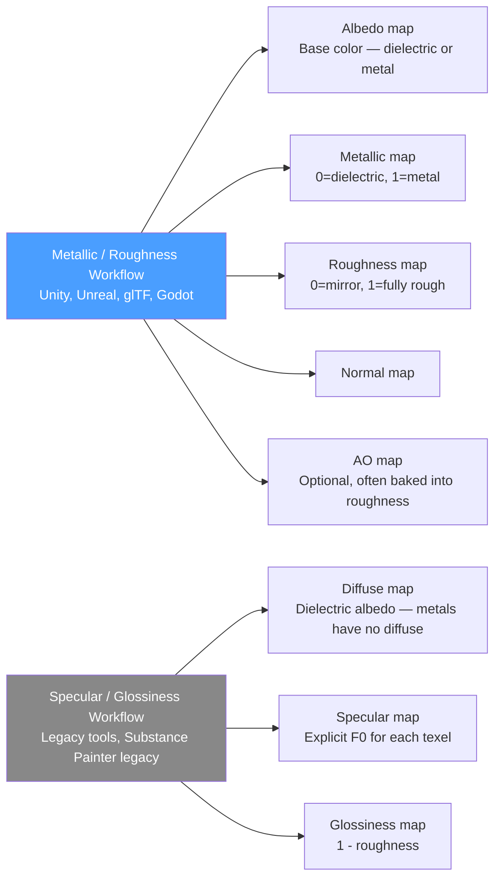

# Physically Based Rendering

> [!abstract] TL;DR
> PBR (Physically Based Rendering) replaces ad-hoc Phong shading with a physically grounded model: the Cook-Torrance microfacet BRDF. Two workflows exist — metallic/roughness (Unity, Unreal, glTF) and specular/glossiness (legacy). Image-Based Lighting (IBL) captures real-world illumination in a cubemap for plausible ambient and reflective lighting. Tone mapping converts HDR linear light to the SDR display's gamma-encoded range.

## Why PBR?

The Phong model is a convenient approximation but violates several physical laws: it doesn't conserve energy (specular + diffuse can exceed incident light), metallic materials don't have separate specular colors from their albedo, and the shininess exponent has no physical meaning.

PBR solves this by grounding rendering in the physics of light-surface interaction. Think of PBR like a legal contract: Phong is a handshake deal that works most of the time, but breaks down in edge cases (grazing angles, metallic surfaces, area lights). PBR is a formal contract built on physics, guaranteeing consistent, artist-predictable results across all lighting conditions.

The payoff: PBR assets look correct under any lighting — move a prop from a dark cave to bright sunlight and it still looks plausible, because the model's energy conservation and physical parameters don't change meaning with lighting intensity.

## Microfacet Theory

Every surface, at the microscopic level, is a collection of tiny mirrors called **microfacets**. Each microfacet is a perfect mirror, but they are randomly oriented around the surface's macro normal. The roughness of a material determines the spread of microfacet orientations:
- **Smooth surface**: microfacets nearly all aligned → tight, mirror-like specular highlight
- **Rough surface**: microfacets spread in many directions → broad, diffuse-looking specular highlight

The Cook-Torrance BRDF models this statistically. For a single light direction L and view direction V, the reflected radiance is:

`f(L, V) = kd * f_lambert + ks * f_cook-torrance`

Where:
- `f_lambert = albedo / π` — Lambertian diffuse (flat, view-independent)
- `f_cook-torrance = (D × F × G) / (4 × dot(N,L) × dot(N,V))` — microfacet specular
- `kd + ks = 1` — energy conservation (reflected cannot exceed incident)

## The DFG Terms

The cook-torrance specular has three factors:

**D — Normal Distribution Function (NDF)**: what fraction of microfacets are oriented to reflect L toward V? Uses the GGX/Trowbridge-Reitz distribution, which produces the characteristic long-tailed specular falloff seen in real materials.

**F — Fresnel Term**: at grazing angles, all surfaces become highly reflective (even matte paper reflects at 90°). Schlick's approximation: `F = F0 + (1 - F0) * pow(1 - dot(H, V), 5)`. `F0` is the reflectance at normal incidence — 0.04 for dielectrics (non-metals), the albedo color for metals.

**G — Geometry / Masking-Shadowing**: at grazing angles and high roughness, microfacets shadow and mask each other. The Smith-GGX term models this attenuation.

```glsl
// PBR Cook-Torrance BRDF in GLSL
float DistributionGGX(vec3 N, vec3 H, float roughness) {
    float a      = roughness * roughness;  // perceptually linear roughness
    float a2     = a * a;
    float NdotH  = max(dot(N, H), 0.0);
    float NdotH2 = NdotH * NdotH;
    float denom  = (NdotH2 * (a2 - 1.0) + 1.0);
    return a2 / (PI * denom * denom);
}

float GeometrySchlickGGX(float NdotV, float roughness) {
    float r = roughness + 1.0;
    float k = (r * r) / 8.0;   // direct lighting remapping
    return NdotV / (NdotV * (1.0 - k) + k);
}

float GeometrySmith(vec3 N, vec3 V, vec3 L, float roughness) {
    float ggx1 = GeometrySchlickGGX(max(dot(N, V), 0.0), roughness);
    float ggx2 = GeometrySchlickGGX(max(dot(N, L), 0.0), roughness);
    return ggx1 * ggx2;
}

vec3 FresnelSchlick(float cosTheta, vec3 F0) {
    return F0 + (1.0 - F0) * pow(clamp(1.0 - cosTheta, 0.0, 1.0), 5.0);
}

vec3 CookTorranceBRDF(vec3 N, vec3 V, vec3 L, vec3 albedo, float metallic, float roughness) {
    vec3 H  = normalize(V + L);
    vec3 F0 = mix(vec3(0.04), albedo, metallic); // dielectric F0=0.04, metal=albedo

    float D    = DistributionGGX(N, H, roughness);
    float G    = GeometrySmith(N, V, L, roughness);
    vec3  F    = FresnelSchlick(max(dot(H, V), 0.0), F0);

    vec3 numerator   = D * G * F;
    float denominator = 4.0 * max(dot(N,V),0.0) * max(dot(N,L),0.0) + 0.0001;
    vec3 specular    = numerator / denominator;

    vec3 kS = F;
    vec3 kD = (1.0 - kS) * (1.0 - metallic); // metals have no diffuse
    vec3 diffuse = kD * albedo / PI;

    float NdotL = max(dot(N, L), 0.0);
    return (diffuse + specular) * lightRadiance * NdotL;
}
```

## Metallic/Roughness vs Specular/Glossiness Workflows



**Metallic/roughness** is the industry standard. Two scalar maps (metallic, roughness) + albedo map fully define the material. Albedo stores: the diffuse color for dielectrics (non-metals) OR the specular tint for metals (metals have zero diffuse).

**Specular/glossiness** was more common in older DCC tools. The specular map stores the actual F0 reflectance value explicitly — more control but less artist-friendly. `glossiness = 1 - roughness`.

Converting between workflows: `roughness = 1 - glossiness`. Specular → metallic conversion is lossy and non-trivial.

## Image-Based Lighting (IBL)

IBL captures the real-world lighting environment in a cubemap (360° panoramic HDR photo or procedurally generated sky) and uses it as the light source for PBR materials. This provides plausible ambient lighting and environment reflections without per-light computation.

**Diffuse IBL**: the diffuse contribution from the environment is the average of all incoming radiance from the hemisphere. Pre-computed once by **convolving** the environment cubemap — each texel stores the average radiance over a hemisphere. This convolved cubemap is called the **irradiance map**.

**Specular IBL**: reflections depend on roughness. A mirror (roughness=0) shows a sharp reflection; a rough material sees a blurry average. Solved with:
- **Prefiltered environment map**: cubemap with multiple mip levels, each blurred for a different roughness value. Sample the mip level matching the material's roughness.
- **BRDF integration LUT**: a 2D lookup texture (indexed by NdotV and roughness) that stores the pre-integrated Fresnel scale and bias, avoiding per-pixel integration overhead.

At runtime: `iblSpecular = samplePrefiltered(R, roughness) * (F0 * brdfLUT.r + brdfLUT.g)`

## Tone Mapping

PBR works in **linear HDR** light values — the sun might output a radiance value of 100,000 while a lamp outputs 800. Display devices output SDR (Standard Dynamic Range) values in the range [0,1]. **Tone mapping** is the operator that compresses HDR → SDR while preserving as much perceptual information as possible.

| Tone Mapping Operator | Characteristics |
|-----------------------|-----------------|
| **Reinhard** | `c / (c + 1)` — simple, compresses all values, can look washed out |
| **ACES Filmic** | Industry standard (Unreal, Unity). S-curve with toe (shadows) and shoulder (highlights). Rich, film-like contrast |
| **Uncharted 2 (John Hable)** | Configurable filmic curve, similar to ACES but cheaper |
| **AgX** | Recent alternative with better hue preservation in saturated colors |

```glsl
// ACES Filmic tone mapping (simplified approximation)
vec3 ACESFilm(vec3 x) {
    float a = 2.51;
    float b = 0.03;
    float c = 2.43;
    float d = 0.59;
    float e = 0.14;
    return clamp((x*(a*x+b))/(x*(c*x+d)+e), 0.0, 1.0);
}

// Full pipeline: linear HDR → tone mapped → gamma corrected
vec3 hdrColor = computePBRLighting();          // returns linear HDR
vec3 mapped   = ACESFilm(hdrColor * exposure); // exposure: artist-controlled
vec3 srgb     = pow(mapped, vec3(1.0/2.2));    // gamma correct for display
outColor      = vec4(srgb, 1.0);
```

**Exposure**: multiply the HDR value by an exposure scalar before tone mapping. Controls how bright/dark the image appears — equivalent to a camera's exposure time. Auto-exposure adjusts this dynamically based on average scene luminance (eyes adapt entering dark/bright areas).

## Common Pitfalls

- **Authoring textures in sRGB instead of linear** — albedo and emission maps are stored sRGB (gamma-encoded) for perceptual uniformity. They must be sampled with sRGB decode (GPU hardware handles this with `VK_FORMAT_R8G8B8A8_SRGB`). Normal maps, roughness, and metallic are linear data — use `VK_FORMAT_R8G8B8A8_UNORM` and never sRGB decode them. Mixing these up produces incorrect lighting.
- **Metallic between 0 and 1** — in reality, materials are either dielectric (metallic=0) or metallic (metallic=1). Values in between represent mixed texels (e.g., rusty metal). Avoid using 0.5 metallic as a creative choice — it produces unphysical results. Use 0 or 1 for pure materials.
- **Non-zero roughness for mirrors** — roughness=0 produces a perfect mirror with a singularity in the GGX distribution formula. Always clamp roughness to at least 0.05 to avoid numerical infinities.
- **Forgetting gamma correction** — if you tone map but forget the final `pow(color, 1/2.2)` step, colors look washed out on standard (non-HDR) displays that expect gamma-encoded input.
- **Using Phong normals instead of normal maps** — vertex normals are too coarse for PBR. Without normal maps, metallic surfaces show faceting artifacts at low polygon counts. Always use a normal map combined with tangent-space TBN matrix for convincing PBR results.

## Review Questions

1. What is the physical motivation for the Fresnel term in PBR? What real-world phenomenon does it model, and what is the standard F0 value for dielectric materials?
2. What does roughness control in the microfacet model? How does it affect the D term (Normal Distribution Function)?
3. What is an irradiance map, and why is it pre-computed rather than computed per-frame?
4. A material with `metallic=1` has no diffuse contribution (kD=0). Explain this physically — why don't metals scatter diffuse light?
5. What is the difference between the prefiltered environment map and the BRDF LUT in the split-sum IBL approximation? What does each component provide?

## Related Concepts

- [[_MOC_Game_Development_Master|↑ Game Development MOC]]
- [[Lighting_and_Shadows|Lighting and Shadows]]
- [[Rendering_Pipeline|Rendering Pipeline]]
- [[HLSL_and_GLSL|HLSL and GLSL]]

#GameDev
