# Rendering Pipeline

> [!abstract] TL;DR
> The GPU rasterization pipeline transforms 3D geometry into 2D pixels through a sequence of programmable and fixed-function stages. Vertex shaders transform positions; the rasterizer interpolates fragments; fragment shaders compute per-pixel color. Understanding this pipeline is the foundation for writing shaders and debugging rendering artifacts.

## What Is the Rendering Pipeline?

Think of the rendering pipeline as an assembly line in a factory. Raw materials (vertices — positions in 3D space) enter one end, and finished products (colored pixels on screen) emerge from the other. Each station on the line performs one specific transformation. Some stations are **programmable** (you write shader code that runs there), others are **fixed-function** (the GPU handles them automatically, you only configure parameters).

Modern GPUs implement the **rasterization pipeline** — a deterministic, parallelized process for converting triangles into pixels. This is distinct from ray tracing (which traces individual rays per pixel) — rasterization is far faster for real-time rendering because it processes all triangles in a scene front-to-back rather than sampling the scene from each pixel.

Every frame your game renders goes through this exact pipeline — tens or hundreds of times per second across potentially millions of triangles.

## Pipeline Stages

```mermaid
flowchart LR
    A[CPU\nDraw Call] --> B[Input Assembler\nFixed-function]
    B --> C[Vertex Shader\nProgrammable]
    C --> D[Hull Shader\nOptional]
    D --> E[Tessellator\nFixed-function]
    E --> F[Domain Shader\nOptional]
    F --> G[Geometry Shader\nOptional]
    G --> H[Rasterizer\nFixed-function]
    H --> I[Fragment Shader\nProgrammable]
    I --> J[Output Merger\nFixed-function]
    J --> K[Framebuffer\nScreen]

    style C fill:#ff6b6b,color:#fff
    style I fill:#ff6b6b,color:#fff
    style D fill:#f4a261,color:#fff
    style F fill:#f4a261,color:#fff
    style G fill:#f4a261,color:#fff
```



### Input Assembler (Fixed-Function)

The Input Assembler reads vertex buffers and index buffers from GPU memory and assembles them into geometric primitives — typically triangles. An index buffer allows vertices to be shared between triangles, reducing memory usage significantly: a quad (two triangles) needs 4 vertices with indices `[0,1,2, 0,2,3]` instead of 6 separate vertices.

### Vertex Shader (Programmable)

The vertex shader runs once per vertex. Its primary responsibility is the **MVP transform**: converting a vertex from **M**odel space (local to the mesh) → **V**iew space (relative to the camera) → **C**lip space (ready for the rasterizer). This is a cascade of matrix multiplications:

```
clip_position = Projection × View × Model × vertex_position
```

Vertex shaders also pass data to the fragment shader via **varying** (GLSL) or **interpolated** (HLSL) outputs — values like UV coordinates, world-space normals, and tangents that the rasterizer will interpolate across each triangle.

### Rasterizer (Fixed-Function)

The rasterizer answers one question for every pixel on screen: "Does this triangle cover this pixel?" It performs:
- **Triangle coverage test**: which pixels fall inside the triangle's projected silhouette
- **Perspective-correct interpolation**: linearly blending vertex attributes across the triangle in a way that corrects for the distortion introduced by perspective projection
- **Depth buffering setup**: computing each fragment's depth value for later depth testing
- **Culling**: backface culling discards triangles facing away from the camera (clockwise vs counter-clockwise winding order convention)

The rasterizer outputs one **fragment** per covered pixel — a candidate for a final framebuffer pixel, carrying interpolated attributes from the three covering vertices.

### Fragment (Pixel) Shader (Programmable)

The fragment shader runs once per fragment and outputs a color (and optionally a depth value). This is where all visual shading happens: texture sampling, lighting calculations, normal mapping, transparency blending. The fragment shader receives the interpolated varyings from the vertex shader and produces the final RGBA output.

This is the most frequently-executed shader — a 1080p frame has 2,073,600 pixels, and many pixels are covered by multiple overlapping triangles (before depth testing eliminates losers).

### Output Merger (Fixed-Function)

The output merger decides which fragments actually write to the framebuffer:
- **Depth test**: discard fragments whose depth is behind the current depth buffer value (hidden surface removal)
- **Stencil test**: discard fragments based on a stencil buffer mask (used for effects like portals, outlines, shadow volumes)
- **Alpha blending**: blend transparent fragments with existing framebuffer content using configurable blend equations (`src_color * src_alpha + dst_color * (1 - src_alpha)` for standard transparency)

## Render Passes and Framebuffers

A **render pass** defines what the pipeline is rendering into. Rather than drawing directly to the screen, modern renderers write to one or more off-screen **render targets** (textures), then combine them in subsequent passes. This multi-pass approach is called **deferred rendering** or **Forward+ rendering** depending on how lighting is handled.

**Framebuffer attachments:**
- **Color attachment**: the RGBA texture being written to
- **Depth attachment**: stores per-pixel depth values for depth testing
- **Stencil attachment**: bit mask for stencil operations

**G-Buffer (Deferred Rendering):** The first render pass (geometry pass) stores material properties in multiple color attachments:
- Attachment 0: Albedo (base color)
- Attachment 1: World-space normals
- Attachment 2: Metallic, roughness, ambient occlusion (packed into RGB channels)
- Attachment 3: Emissive

A second lighting pass then reads these G-Buffer textures and computes lighting in screen space — lighting calculations only run once per pixel regardless of how many overlapping geometry triangles cover it.

## GPU Architecture

The GPU is a massively parallel processor designed specifically for running thousands of small programs (shader invocations) simultaneously. Understanding its architecture explains both why shaders must avoid certain patterns and why modern games can run at 60 FPS with millions of triangles.

**Compute Units / Shader Processors:** GPUs contain hundreds or thousands of small cores grouped into Compute Units (AMD) or Streaming Multiprocessors (NVIDIA). Each core can execute shader instructions, but cores in the same group execute the same instruction simultaneously (SIMD execution). A group of shader invocations running in lockstep is called a **warp** (NVIDIA) or **wavefront** (AMD).

**Warp divergence:** If a conditional branch (`if/else`) causes different threads in the same warp to take different paths, the GPU must execute *both* paths and mask off the results for threads that didn't take each path. This **warp divergence** wastes execution capacity. Minimize branching in shaders — or ensure entire warps take the same branch (uniform conditions).

**Memory hierarchy:** Registers (fastest, per-thread) → Shared/LDS memory (fast, per-compute-unit) → L1 cache → L2 cache → VRAM (slow, global). Accessing textures repeatedly triggers the texture cache; random VRAM access is expensive. Design shaders to maximize cache coherence.

## Code Demo: Minimal Forward Rendering Pass

```glsl
// ---- VERTEX SHADER (GLSL 450) ----
#version 450

layout(location = 0) in vec3 inPosition;   // per-vertex position (model space)
layout(location = 1) in vec3 inNormal;     // per-vertex normal (model space)
layout(location = 2) in vec2 inTexCoord;   // per-vertex UV

// Uniform block — same for all vertices in one draw call
layout(set = 0, binding = 0) uniform UBO {
    mat4 model;       // model → world
    mat4 view;        // world → camera
    mat4 projection;  // camera → clip
} ubo;

// Outputs passed to the rasterizer (interpolated per fragment)
layout(location = 0) out vec3 fragWorldPos;
layout(location = 1) out vec3 fragNormal;
layout(location = 2) out vec2 fragTexCoord;

void main() {
    vec4 worldPos = ubo.model * vec4(inPosition, 1.0);
    fragWorldPos  = worldPos.xyz;
    // Normal matrix = transpose(inverse(model)) — avoids non-uniform scale artifacts
    fragNormal    = mat3(transpose(inverse(ubo.model))) * inNormal;
    fragTexCoord  = inTexCoord;
    gl_Position   = ubo.projection * ubo.view * worldPos;
}

// ---- FRAGMENT SHADER (GLSL 450) ----
#version 450

layout(location = 0) in vec3 fragWorldPos;
layout(location = 1) in vec3 fragNormal;
layout(location = 2) in vec2 fragTexCoord;

layout(set = 0, binding = 1) uniform sampler2D albedoTex;
layout(set = 0, binding = 2) uniform LightUBO {
    vec3 lightDir;    // world-space, pointing toward light
    vec3 lightColor;
    vec3 cameraPos;
} light;

layout(location = 0) out vec4 outColor;

void main() {
    vec3 albedo  = texture(albedoTex, fragTexCoord).rgb;
    vec3 N       = normalize(fragNormal);
    vec3 L       = normalize(light.lightDir);
    float NdotL  = max(dot(N, L), 0.0);          // diffuse term
    vec3 diffuse = albedo * light.lightColor * NdotL;
    vec3 ambient = albedo * 0.1;
    outColor     = vec4(ambient + diffuse, 1.0);
}
```

## Trade-Offs

| Approach | Strengths | Weaknesses |
|----------|-----------|------------|
| **Forward rendering** | Simple, great transparency support, low memory bandwidth | Expensive with many lights (O(geometry × lights)) |
| **Deferred rendering** | O(lights) not O(geometry × lights), great for many dynamic lights | Expensive G-Buffer memory, bad transparency support, MSAA difficult |
| **Forward+** (clustered) | Handles many lights without full deferred overhead | More complex implementation, culling CPU overhead |
| **Tile-based rendering** (mobile) | GPU reads/writes tile-internal data in on-chip memory — saves VRAM bandwidth | Fixed tile architecture limits some techniques |
| **Ray tracing (hybrid)** | Physically accurate reflections, shadows, GI | Very expensive, requires RTX-class GPU, not real-time for full scenes |

## Common Pitfalls

- **Forgetting the normal matrix for non-uniform scale** — transforming normals with the model matrix only works if the model has uniform scale. With non-uniform scale, use `transpose(inverse(model))` as the normal matrix or the normals will point in wrong directions, corrupting lighting.
- **Alpha sorting order** — transparent objects must be drawn back-to-front after all opaque objects. The depth buffer cannot be used for transparency because depth writes block later fragments. Forgetting this causes incorrect blending (objects appear to clip through each other).
- **Overdraw in forward rendering** — drawing opaque geometry front-to-back enables early-Z rejection, where the depth test discards fragments before the (expensive) fragment shader runs. Drawing back-to-front for opaques wastes GPU time running fragment shaders whose output is immediately overwritten.
- **Accessing textures outside [0,1] UV range** — clamping vs. repeating wrap modes produce visually different results. Mipmaps also behave differently at UV discontinuities (seams). Set wrap modes explicitly per texture.
- **Warp divergence in fragment shaders** — complex conditional logic in fragment shaders stalls warps. When possible, convert `if/else` to `mix(a, b, step(threshold, value))` or similar branchless equivalents.

## Review Questions

1. Explain the difference between a vertex shader and a fragment shader. What data does each receive, and what does each produce?
2. Why is the normal matrix `transpose(inverse(model))` rather than just the model matrix? Give a concrete example where using the model matrix would produce wrong normals.
3. What is warp divergence, and why does it matter for shader performance?
4. Deferred rendering separates geometry from lighting into two passes. What specific rendering problems does this solve, and what problems does it introduce?
5. Why must transparent objects be rendered after opaque objects and in back-to-front order?

## Related Concepts

- [[_MOC_Game_Development_Master|↑ Game Development MOC]]
- [[HLSL_and_GLSL|HLSL and GLSL — Shader Languages]]
- [[DirectX_and_OpenGL|DirectX and OpenGL — Graphics APIs]]
- [[Lighting_and_Shadows|Lighting and Shadows]]
- [[Physically_Based_Rendering|Physically Based Rendering]]

#GameDev
