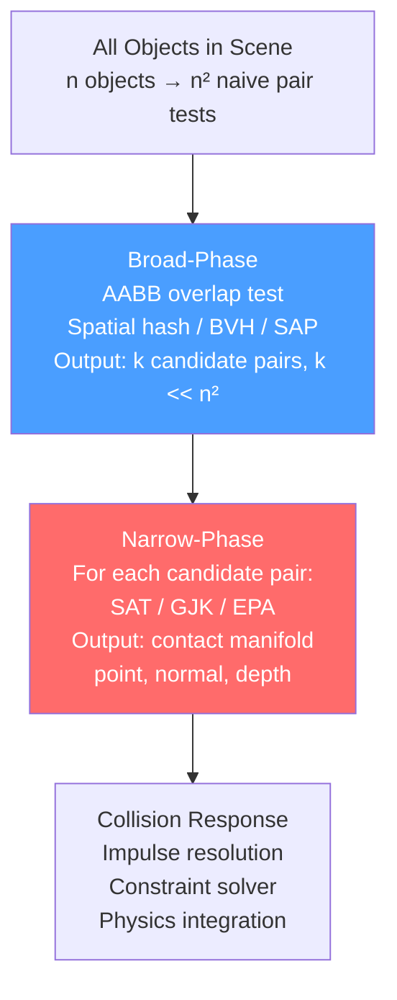

# Spatial Partitioning

> [!abstract] TL;DR
> Spatial partitioning structures divide 3D space to accelerate proximity queries — "which objects are near point P?" or "does ray R hit anything?" Testing every object against every other object is O(n²). Spatial hierarchies reduce this to O(n log n) or O(log n) per query. BVH (Bounding Volume Hierarchies) are the standard for both ray tracing and collision detection. Octrees partition space uniformly. BSP trees partition by planes. Broad-phase finds candidate pairs cheaply; narrow-phase resolves exact collisions precisely.

## The n² Problem

Imagine 1000 enemies in an open world. Checking every enemy against every other enemy for collision is 1,000,000 pair tests per frame — and checking every enemy against every static mesh for raycasts is worse. Spatial partitioning solves this by answering: "given a query region (a frustum, a sphere, a ray), which objects could possibly overlap it?" — without testing all objects.

The analogy: spatial partitioning is like a library's card catalog (now a search index). Instead of opening every book to find the one on quantum mechanics, you look at the catalog, go to the right shelf, and scan only a few books. The structure does the organizing work once; queries are then fast.

## Broad-Phase vs Narrow-Phase Collision

Collision detection is split into two phases to avoid expensive exact computation on all object pairs:

**Broad-phase**: quickly find pairs of objects whose bounding volumes overlap. Output: a list of candidate pairs. Uses simple, conservative shapes (AABBs, spheres) and spatial structures to prune non-overlapping pairs. Does not produce collision contact data — just "these two might be touching."

**Narrow-phase**: take each candidate pair from the broad phase and compute the exact collision: contact point, contact normal, penetration depth. Uses expensive algorithms (SAT, GJK, EPA) on the actual mesh geometry. Only runs on the small set of candidate pairs from broad-phase.



## Axis-Aligned Bounding Boxes (AABB)

Every physics object carries an **AABB** — the tightest axis-aligned box enclosing its geometry. AABB overlap tests are trivially fast: two AABBs overlap if and only if they overlap on all three axes simultaneously.

```csharp
public struct AABB {
    public Vector3 min, max;

    // O(1) overlap test — just 6 comparisons
    public bool Overlaps(AABB other) {
        return min.x <= other.max.x && max.x >= other.min.x &&
               min.y <= other.max.y && max.y >= other.min.y &&
               min.z <= other.max.z && max.z >= other.min.z;
    }

    // Merge two AABBs into the smallest enclosing AABB
    public static AABB Merge(AABB a, AABB b) => new AABB {
        min = Vector3.Min(a.min, b.min),
        max = Vector3.Max(a.max, b.max)
    };

    // Surface area — used as BVH split cost heuristic (SAH)
    public float SurfaceArea() {
        Vector3 e = max - min;
        return 2f * (e.x*e.y + e.y*e.z + e.z*e.x);
    }
}
```

## Bounding Volume Hierarchy (BVH)

A BVH is a binary tree where:
- Each **leaf** node contains one or a few triangles/objects with their AABB
- Each **internal** node contains the AABB that encloses all its children's AABBs
- The root's AABB encloses the entire scene

**Query algorithm**: start at the root. If the query (ray, sphere, frustum) doesn't intersect the root AABB, nothing in the scene can intersect it → done. Otherwise, recurse into both children that overlap the query. Prune branches whose AABB doesn't intersect. Complexity: O(log n) per query for balanced, non-degenerate geometry.

```csharp
public class BVHNode {
    public AABB bounds;
    public BVHNode left, right;   // null for leaf nodes
    public List<Triangle> triangles; // non-null only in leaf nodes

    // Ray-BVH intersection
    public bool Raycast(Ray ray, out RaycastHit hit) {
        hit = default;
        if (!bounds.IntersectsRay(ray)) return false; // prune: AABB miss

        if (triangles != null) { // leaf: test actual geometry
            bool any = false;
            foreach (var tri in triangles) {
                if (tri.MollerTrumbore(ray, out var triHit)) {
                    if (!any || triHit.distance < hit.distance) {
                        hit = triHit;
                        any = true;
                    }
                }
            }
            return any;
        }

        // Internal node: recurse into children
        bool hitLeft  = left?.Raycast(ray, out var leftHit)  ?? false;
        bool hitRight = right?.Raycast(ray, out var rightHit) ?? false;
        if (hitLeft && hitRight)
            hit = leftHit.distance < rightHit.distance ? leftHit : rightHit;
        else if (hitLeft)  hit = leftHit;
        else if (hitRight) hit = rightHit;
        return hitLeft || hitRight;
    }
}

// Build BVH using Surface Area Heuristic (SAH)
public BVHNode BuildBVH(List<Triangle> triangles) {
    if (triangles.Count <= 4) // leaf threshold
        return new BVHNode { bounds = ComputeAABB(triangles), triangles = triangles };

    // Find best split axis and position using SAH:
    // cost = (leftCount * leftSA + rightCount * rightSA) / parentSA
    var (axis, splitPos) = FindSAHSplit(triangles);
    var left  = triangles.Where(t => t.Centroid()[axis] < splitPos).ToList();
    var right = triangles.Where(t => t.Centroid()[axis] >= splitPos).ToList();

    return new BVHNode {
        bounds = ComputeAABB(triangles),
        left   = BuildBVH(left),
        right  = BuildBVH(right)
    };
}
```

**DBVT (Dynamic BVH Tree)**: standard BVH is static — built once for static geometry. Dynamic objects (moving characters, vehicles) need a structure that supports insertion, deletion, and efficient update. The DBVT (used in Bullet physics) maintains a BVH with "fat" AABBs — each AABB is expanded by a margin, so small object movements don't require tree restructuring.

## Octree

An octree recursively subdivides a cubic region of space into 8 equal sub-cubes. Objects are stored in the deepest node whose AABB contains them.

**Strengths**: simple to implement; good for uniformly distributed, relatively static objects; O(log n) queries for spatially coherent queries (frustum culling).

**Weaknesses**: works poorly when objects span multiple cells (must be stored at a higher level); tree depth is scene-scale dependent; dynamic object updates require reinsertion.

```csharp
public class OctreeNode {
    public AABB bounds;
    public OctreeNode[] children; // 8 children, null if leaf
    public List<GameObject> objects = new();
    private const int MAX_OBJECTS = 8;
    private const int MAX_DEPTH   = 8;

    public void Insert(GameObject obj, int depth = 0) {
        if (children == null) {
            objects.Add(obj);
            if (objects.Count > MAX_OBJECTS && depth < MAX_DEPTH) Subdivide();
            return;
        }
        // Insert into all children whose AABB overlaps the object's AABB
        foreach (var child in children)
            if (child.bounds.Overlaps(obj.GetAABB())) child.Insert(obj, depth + 1);
    }

    public List<GameObject> Query(AABB queryAABB) {
        if (!bounds.Overlaps(queryAABB)) return new();
        var result = new List<GameObject>(objects.Where(o => o.GetAABB().Overlaps(queryAABB)));
        if (children != null)
            foreach (var child in children) result.AddRange(child.Query(queryAABB));
        return result;
    }

    private void Subdivide() {
        Vector3 center = (bounds.min + bounds.max) * 0.5f;
        children = new OctreeNode[8];
        // Generate 8 sub-cubes from center
        for (int i = 0; i < 8; i++) {
            Vector3 childMin = new Vector3(
                (i & 1) == 0 ? bounds.min.x : center.x,
                (i & 2) == 0 ? bounds.min.y : center.y,
                (i & 4) == 0 ? bounds.min.z : center.z);
            children[i] = new OctreeNode { bounds = new AABB { min = childMin, max = childMin + (center - bounds.min) }};
        }
        var toReinsert = objects;
        objects = new();
        foreach (var obj in toReinsert) Insert(obj, 1);
    }
}
```

## BSP Trees

A BSP (Binary Space Partitioning) tree divides space with arbitrary planes (not axis-aligned splits). Each internal node is a plane; objects on one side go into the front child, the other side into the back child.

**Main uses in games:**
- **Visibility determination (VIS)**: classic Quake/Doom BSP — precompute which "leaves" (convex regions) are visible from each other. The engine only draws visible leaves, achieving aggressive culling without per-frame raycasts.
- **Static geometry collision**: store level geometry in a BSP for fast "point vs solid" queries (is this position inside a wall?) and moving sphere/capsule sweep tests.

BSP trees are less common in modern games (replaced by BVH for ray tracing and octrees for culling), but are still used in tools, mesh boolean operations, and some physics engines for convex decomposition.

## Spatial Data Structures Comparison

| Structure | Build | Query | Dynamic Update | Best Use Case |
|-----------|-------|-------|---------------|---------------|
| **Brute force** | O(1) | O(n) | O(1) | n < 100 objects |
| **AABB tree / BVH** | O(n log n) | O(log n) | O(log n) DBVT | Ray tracing, collision, frustum cull |
| **Octree** | O(n log n) | O(log n) | Medium (reinsertion) | Uniform scenes, frustum culling |
| **BSP tree** | O(n log n) slow | O(log n) | Very slow (rebuild) | Static indoor levels, VIS |
| **Spatial hash** | O(n) | O(1) avg | O(1) | Uniform objects, broad-phase |
| **KD-tree** | O(n log n) | O(√n) worst | Very slow | Point clouds, ray tracing (static) |
| **Sort and Sweep (SAP)** | O(n log n) | O(n+k) | O(log n) | Dense, coherent broad-phase |

## Common Pitfalls

- **Not using broad-phase before narrow-phase**: running GJK on every object pair in a scene with 500 objects is 125,000 GJK calls per frame — a guaranteed performance collapse. Always use an AABB broad-phase to filter to a small candidate set first.
- **Static BVH for dynamic objects**: a standard BVH built at load time becomes incorrect as objects move. Either use DBVT (with fat AABBs) or rebuild the dynamic subtree every frame (acceptable if objects are few). Never raycast against a stale BVH — you get silent misses and false hits.
- **SAH imbalanced splits**: a naive median split can degenerate to O(n) if objects cluster spatially (all on one side of the median). SAH (Surface Area Heuristic) splits at the position minimizing the cost function and prevents degenerate trees.
- **Octree cells too small at boundaries**: an object straddling the boundary between 4 or 8 octree cells must be stored in the parent node (or duplicated). If many objects align with cell boundaries, the octree degenerates to storing everything at the root.
- **Forgetting ray-AABB test for BVH pruning**: the dominant cost in BVH traversal is the AABB overlap tests, not the leaf geometry tests. A slow ray-AABB test (e.g., using `Physics.Raycast` inside a loop) negates the BVH's benefit. Use the slab method: `tmin = max(tmin_x, tmin_y, tmin_z); tmax = min(tmax_x, tmax_y, tmax_z); hit = tmin <= tmax`.

## Review Questions

1. What is the difference between the broad-phase and narrow-phase in a physics engine? Why is separating them important?
2. Explain how a BVH query prunes branches. What information does each internal node carry, and what is the pruning condition?
3. An AABB-based spatial hash has O(1) average query time but an octree is O(log n). When would you prefer the spatial hash over the octree?
4. What is DBVT and how does its "fat AABB" margin reduce the cost of dynamic object updates?
5. BSP trees are rarely used for dynamic object queries in modern games. What structure has replaced them for real-time rendering culling, and what advantage does it have for GPU-driven pipelines?

## Related Concepts

- [[_MOC_Game_Development_Master|↑ Game Development MOC]]
- [[Physics_and_Collision|Physics and Collision]]
- [[Game_Loop_and_Architecture|Game Loop and Architecture]]
- [[Rendering_Pipeline|Rendering Pipeline]]

#GameDev
