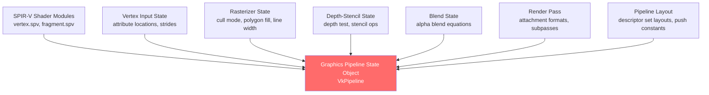

# Vulkan Basics

> [!abstract] TL;DR
> Vulkan is an explicit, low-overhead graphics API that exposes raw GPU control. You manage memory allocation, command recording, render passes, pipeline state objects, descriptor sets, and synchronization manually. The payoff: predictable performance, zero hidden driver overhead, and true multithreaded rendering. Vulkan's learning curve is steep — but every modern AAA engine and cross-platform renderer is built on it (or its close cousin Metal/DX12).

## Vulkan's Philosophy

Vulkan treats the developer as an expert who knows what they are doing. Unlike OpenGL, which validates every call, tracks state, and synchronizes automatically, Vulkan does almost nothing implicitly. You are the traffic controller, scheduler, and memory manager for the GPU.

The analogy: OpenGL is like hiring a contractor who manages all subcontractors, schedules, and materials — you just describe the desired outcome. Vulkan is like being the general contractor yourself: you hire each trade (the GPU queues), manage the supply chain (GPU memory), write detailed work orders (command buffers), and coordinate when each crew can start and stop (synchronization primitives).

## Instances and Devices

**Instance** is the first object you create — it represents the Vulkan library itself and stores per-application state. You specify which validation layers and instance extensions to enable here.

**Physical Device** is an enumerated GPU. Vulkan can see all GPUs in the system. You query each physical device for its capabilities (supports geometry shaders? what maximum texture size? which queue families?).

**Logical Device** is your application's handle to a physical device. You specify which queue families and device features you need, and the driver creates the device and its queues.

```cpp
// 1. Create instance
VkApplicationInfo appInfo{};
appInfo.sType              = VK_STRUCTURE_TYPE_APPLICATION_INFO;
appInfo.pApplicationName   = "MyGame";
appInfo.applicationVersion = VK_MAKE_VERSION(1, 0, 0);
appInfo.apiVersion         = VK_API_VERSION_1_3;

VkInstanceCreateInfo createInfo{};
createInfo.sType                   = VK_STRUCTURE_TYPE_INSTANCE_CREATE_INFO;
createInfo.pApplicationInfo        = &appInfo;
createInfo.enabledLayerCount       = (uint32_t)validationLayers.size();
createInfo.ppEnabledLayerNames     = validationLayers.data();
createInfo.enabledExtensionCount   = (uint32_t)extensions.size();
createInfo.ppEnabledExtensionNames = extensions.data();
vkCreateInstance(&createInfo, nullptr, &instance);

// 2. Enumerate + pick physical device
uint32_t deviceCount = 0;
vkEnumeratePhysicalDevices(instance, &deviceCount, nullptr);
std::vector<VkPhysicalDevice> devices(deviceCount);
vkEnumeratePhysicalDevices(instance, &deviceCount, devices.data());
// (score devices by properties.deviceType, limits, feature support)
physicalDevice = pickBestDevice(devices);

// 3. Create logical device with required queues
float queuePriority = 1.0f;
VkDeviceQueueCreateInfo queueInfo{};
queueInfo.sType            = VK_STRUCTURE_TYPE_DEVICE_QUEUE_CREATE_INFO;
queueInfo.queueFamilyIndex = graphicsQueueFamilyIndex;
queueInfo.queueCount       = 1;
queueInfo.pQueuePriorities = &queuePriority;

VkDeviceCreateInfo deviceCreateInfo{};
deviceCreateInfo.sType                = VK_STRUCTURE_TYPE_DEVICE_CREATE_INFO;
deviceCreateInfo.queueCreateInfoCount = 1;
deviceCreateInfo.pQueueCreateInfos    = &queueInfo;
vkCreateDevice(physicalDevice, &deviceCreateInfo, nullptr, &device);
vkGetDeviceQueue(device, graphicsQueueFamilyIndex, 0, &graphicsQueue);
```

## Queue Families

A **queue family** is a group of queues that support the same set of operations. Typical families:
- **Graphics queue**: draws geometry, runs vertex/fragment shaders, begins render passes
- **Compute queue**: runs compute shaders, no rasterization
- **Transfer queue**: copies data between CPU and GPU memory (DMA engine)
- **Present queue**: outputs to the swap chain (often the same family as graphics)

You can submit command buffers to queues from multiple CPU threads simultaneously. This is the foundation of Vulkan's multithreaded rendering model.

## Render Passes

A **render pass** describes the structure of a rendering operation: which framebuffer attachments are used, in what format, how they are loaded and stored, and how subpasses relate to each other.

**Subpasses** allow the GPU to keep intermediate data in tile-local memory (crucial for mobile GPUs with tiled architectures). For example, a deferred renderer's geometry pass and lighting pass can be expressed as two subpasses sharing the G-Buffer attachments in tile memory rather than writing/reading from VRAM — dramatically reducing bandwidth.

```cpp
// Attachment description — what happens to this attachment
VkAttachmentDescription colorAttachment{};
colorAttachment.format         = swapChainImageFormat;
colorAttachment.samples        = VK_SAMPLE_COUNT_1_BIT;
colorAttachment.loadOp         = VK_ATTACHMENT_LOAD_OP_CLEAR;   // clear on start
colorAttachment.storeOp        = VK_ATTACHMENT_STORE_OP_STORE;  // keep result
colorAttachment.initialLayout  = VK_IMAGE_LAYOUT_UNDEFINED;
colorAttachment.finalLayout    = VK_IMAGE_LAYOUT_PRESENT_SRC_KHR; // ready to present

VkAttachmentReference colorRef{};
colorRef.attachment = 0;
colorRef.layout     = VK_IMAGE_LAYOUT_COLOR_ATTACHMENT_OPTIMAL;

VkSubpassDescription subpass{};
subpass.pipelineBindPoint    = VK_PIPELINE_BIND_POINT_GRAPHICS;
subpass.colorAttachmentCount = 1;
subpass.pColorAttachments    = &colorRef;

VkRenderPassCreateInfo renderPassInfo{};
renderPassInfo.sType           = VK_STRUCTURE_TYPE_RENDER_PASS_CREATE_INFO;
renderPassInfo.attachmentCount = 1;
renderPassInfo.pAttachments    = &colorAttachment;
renderPassInfo.subpassCount    = 1;
renderPassInfo.pSubpasses      = &subpass;
vkCreateRenderPass(device, &renderPassInfo, nullptr, &renderPass);
```

## Pipelines

A Vulkan **graphics pipeline** bundles together: vertex/fragment shaders, vertex input layout, primitive topology, rasterizer settings, depth/stencil state, blend state, and render pass compatibility. All of this is compiled into a single GPU object.



Creating a PSO takes 100–500ms on first creation. **Always pre-compile PSOs at load time** using a `VkPipelineCache` to serialize/deserialize compiled machine code across sessions, eliminating first-frame stutter from shader compilation.

## Descriptors and Descriptor Sets

**Descriptors** are handles to GPU resources (textures, uniform buffers, storage buffers, samplers) that shaders access. They are grouped into **descriptor sets** and bound to the pipeline before draw calls.

Unlike OpenGL where you `glBindTexture(unit, tex)` and the driver tracks active bindings, Vulkan requires you to:
1. Allocate descriptor sets from a **descriptor pool**
2. Write resource handles into the descriptor set
3. Bind the descriptor set before drawing

```cpp
// Describe what resources are in this descriptor set
VkDescriptorSetLayoutBinding samplerBinding{};
samplerBinding.binding         = 0;
samplerBinding.descriptorType  = VK_DESCRIPTOR_TYPE_COMBINED_IMAGE_SAMPLER;
samplerBinding.descriptorCount = 1;
samplerBinding.stageFlags      = VK_SHADER_STAGE_FRAGMENT_BIT;

VkDescriptorSetLayoutCreateInfo layoutInfo{};
layoutInfo.bindingCount = 1;
layoutInfo.pBindings    = &samplerBinding;
vkCreateDescriptorSetLayout(device, &layoutInfo, nullptr, &descriptorSetLayout);

// Write actual resource into the descriptor set
VkDescriptorImageInfo imageInfo{};
imageInfo.imageLayout = VK_IMAGE_LAYOUT_SHADER_READ_ONLY_OPTIMAL;
imageInfo.imageView   = textureImageView;
imageInfo.sampler     = textureSampler;

VkWriteDescriptorSet descriptorWrite{};
descriptorWrite.sType           = VK_STRUCTURE_TYPE_WRITE_DESCRIPTOR_SET;
descriptorWrite.dstSet          = descriptorSet;
descriptorWrite.dstBinding      = 0;
descriptorWrite.descriptorType  = VK_DESCRIPTOR_TYPE_COMBINED_IMAGE_SAMPLER;
descriptorWrite.descriptorCount = 1;
descriptorWrite.pImageInfo      = &imageInfo;
vkUpdateDescriptorSets(device, 1, &descriptorWrite, 0, nullptr);
```

**Bindless rendering** (using `VK_EXT_descriptor_indexing`) allows binding thousands of textures in one descriptor set and indexing them dynamically in shaders — eliminating per-draw-call descriptor set binding overhead. Used in virtually all modern AAA engines.

## Synchronization

Vulkan's most complex aspect is **synchronization** — coordinating CPU/GPU and GPU/GPU operations to ensure correct execution order.

**Fences** (`VkFence`): CPU waits for GPU work to complete. Block CPU thread until GPU finishes a submitted batch.

**Semaphores** (`VkSemaphore`): GPU-to-GPU synchronization across queue submits. "Don't start pass B until pass A's queue submit signals this semaphore."

**Pipeline Barriers** (`vkCmdPipelineBarrier`): within a command buffer, stall certain pipeline stages until prior stages complete. Used for image layout transitions and buffer read-after-write hazards.

```cpp
// Image layout transition: UNDEFINED → COLOR_ATTACHMENT_OPTIMAL
VkImageMemoryBarrier barrier{};
barrier.sType               = VK_STRUCTURE_TYPE_IMAGE_MEMORY_BARRIER;
barrier.oldLayout           = VK_IMAGE_LAYOUT_UNDEFINED;
barrier.newLayout           = VK_IMAGE_LAYOUT_COLOR_ATTACHMENT_OPTIMAL;
barrier.srcQueueFamilyIndex = VK_QUEUE_FAMILY_IGNORED;
barrier.dstQueueFamilyIndex = VK_QUEUE_FAMILY_IGNORED;
barrier.image               = image;
barrier.subresourceRange    = {VK_IMAGE_ASPECT_COLOR_BIT, 0, 1, 0, 1};
barrier.srcAccessMask       = 0;                               // no prior access
barrier.dstAccessMask       = VK_ACCESS_COLOR_ATTACHMENT_WRITE_BIT;

vkCmdPipelineBarrier(
    commandBuffer,
    VK_PIPELINE_STAGE_TOP_OF_PIPE_BIT,            // wait after: nothing
    VK_PIPELINE_STAGE_COLOR_ATTACHMENT_OUTPUT_BIT, // before: color write stage
    0, 0, nullptr, 0, nullptr, 1, &barrier
);
```

## Trade-offs: Vulkan vs OpenGL vs DX11

| Concern | OpenGL / DX11 | Vulkan / DX12 / Metal |
|---------|---------------|----------------------|
| **Setup complexity** | Low — 50 lines to triangle | Very high — 1000+ lines to triangle |
| **Driver overhead** | High (implicit sync, validation) | Minimal (explicit, zero-overhead) |
| **Multithreaded command recording** | No (single context/thread) | Yes (one cmd buffer per thread) |
| **Stutter predictability** | Poor (driver can compile shaders mid-frame) | Good (PSOs pre-compiled, explicit sync) |
| **Memory control** | None (driver manages VRAM) | Full (manual heap allocation with `VkDeviceMemory`) |
| **Debugging** | Easy (glGetError, GL debug output) | Complex (validation layers + tools like RenderDoc) |
| **Best use case** | Prototyping, tools, embedded | AAA games, engines, GPU-bound apps |

## Common Pitfalls

- **Accessing a VkBuffer before GPU upload is complete**: when you write data to a staging buffer and copy it to a device-local buffer, you must use a pipeline barrier (or fence) before using the device-local buffer in a shader. Skipping this causes reading stale/garbage data.
- **Creating descriptor pools too small**: when you `vkAllocateDescriptorSets` from a pool with no remaining space, Vulkan returns `VK_ERROR_OUT_OF_POOL_MEMORY` — a hard error. Pre-size pools generously or implement pool growth.
- **Forgetting to handle swapchain invalidation**: window resize or minimize triggers `VK_ERROR_OUT_OF_DATE_KHR` on present. You must recreate the swapchain (and framebuffers that reference its images) entirely. Failing to handle this crashes the app on any window resize.
- **Recording commands into command buffers that are still in flight**: if the GPU is still executing frame N's commands and you reset/rerecord the command buffer for frame N+1 on the CPU, you corrupt in-flight GPU work. Use per-frame command buffers and fences to ensure the GPU has finished before reuse.
- **Implicit synchronization with validation layers on**: with validation layers enabled, Vulkan inserts implicit synchronization that makes many bugs silently work. Always test a release build (validation off) to expose sync hazards that validation was masking.

## Review Questions

1. What is a descriptor set, and why does Vulkan require explicit descriptor management instead of OpenGL's `glBindTexture` model?
2. What is the difference between a VkFence and a VkSemaphore? Give a concrete usage scenario for each.
3. A Vulkan pipeline barrier specifies `srcStageMask` and `dstStageMask`. What do these represent, and why is specifying them correctly critical for performance?
4. Why does creating a VkPipeline take so much longer than most other Vulkan object creation operations?
5. What is a render pass's `loadOp` and `storeOp`, and how do they save bandwidth on mobile tile-based GPUs?

## Related Concepts

- [[_MOC_Game_Development_Master|↑ Game Development MOC]]
- [[Rendering_Pipeline|Rendering Pipeline]]
- [[DirectX_and_OpenGL|DirectX and OpenGL]]
- [[HLSL_and_GLSL|HLSL and GLSL]]

#GameDev
