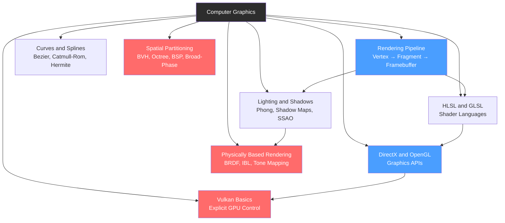

# Computer Graphics — Section MOC

> [!info] About this section
> 8 notes covering the real-time rendering pipeline that powers every game engine: GPU architecture and the rasterization pipeline, shader languages (HLSL/GLSL), low-level graphics APIs (DirectX 12, OpenGL, Vulkan, Metal, WebGL), physically-based rendering (PBR/IBL/BRDF), lighting models and shadow techniques, mathematical curves for animation and paths, and spatial data structures for collision detection and culling.

## Concept Map

## Notes in This Section

| Note | Core Idea | Key Concepts |
|------|-----------|--------------|
| [[Rendering_Pipeline]] | Rasterization pipeline stages from vertices to pixels, GPU architecture, render passes, deferred vs forward | Vertex shader, fragment shader, rasterizer, G-Buffer, depth buffer |
| [[HLSL_and_GLSL]] | HLSL (DirectX/Unity) and GLSL (OpenGL/Vulkan) shader languages, uniforms, varyings, SPIR-V compilation | Vertex shader, fragment shader, uniforms, push constants, SPIR-V |
| [[DirectX_and_OpenGL]] | DirectX 12 vs OpenGL vs Vulkan vs Metal vs WebGL — API philosophy, command buffers, swap chains, render targets | Command buffers, PSO, swap chain, descriptor sets, present modes |
| [[Vulkan_Basics]] | Vulkan instances/devices/queues, render passes, pipeline state objects, descriptor sets, fences/semaphores | VkDevice, VkPipeline, descriptors, pipeline barriers, synchronization |
| [[Lighting_and_Shadows]] | Phong/Blinn-Phong model, point/spot/directional lights, shadow maps, PCF, cascaded shadow maps, SSAO | Ambient/diffuse/specular, shadow maps, PCF, CSM, SSAO |
| [[Physically_Based_Rendering]] | Cook-Torrance BRDF, metallic/roughness workflow, IBL (irradiance map + prefiltered env), tone mapping | BRDF, DFG terms, Fresnel, IBL, ACES tone mapping |
| [[Curves_and_Splines]] | Bezier, Catmull-Rom, Hermite, B-splines — mathematical curves for paths, animation, and procedural geometry | Bezier, Catmull-Rom, arc-length reparameterization, C1/C2 continuity |
| [[Spatial_Partitioning]] | BVH (Bounding Volume Hierarchies), DBVT, Octree, BSP trees — broad-phase vs narrow-phase collision detection | BVH, SAH, DBVT, Octree, broad-phase, narrow-phase, SAP |

## Learning Path

1. [[Rendering_Pipeline]] — start here to understand how the GPU processes geometry into pixels; the foundation for all other notes
2. [[HLSL_and_GLSL]] — learn the shader languages used to write programs that run on each pipeline stage
3. [[DirectX_and_OpenGL]] — understand the API layer that mediates between your code and the GPU driver
4. [[Vulkan_Basics]] — dive into the explicit low-level API that modern engines use for maximum control
5. [[Lighting_and_Shadows]] — implement the classical shading models and shadow algorithms that make scenes believable
6. [[Physically_Based_Rendering]] — graduate from Phong to physically grounded BRDF-based shading used in all modern AAA engines
7. [[Curves_and_Splines]] — learn the mathematical curves that power animation, camera paths, and procedural generation
8. [[Spatial_Partitioning]] — understand the data structures that make real-time collision detection and scene culling tractable at scale

## Related Notes (in this vault)

- [[Game_Math_Fundamentals]] — vectors, matrices, and quaternions underlie every transform and projection in graphics
- [[Physics_and_Collision]] — narrow-phase collision algorithms (SAT, GJK) build on the spatial partitioning broad-phase
- [[Unity_Optimization]] — GPU draw call batching, LOD, and profiling connect directly to rendering pipeline knowledge
- [[Unreal_AI_and_Polish]] — Niagara VFX and Lumen GI are advanced applications of the rendering pipeline concepts here

#MOC #GameDev #ComputerGraphics
