# Game Development — Map of Content

> [!info] About this vault
> 26 notes across 6 sections — covering game math, Unity, Unreal Engine 5, Godot 4, reusable game systems (AI pathfinding, networking, audio, UI/UX), and server-side game development (authoritative servers, netcode, matchmaking).
> Start with **01 Foundations** to build engine-agnostic skills, then branch into whichever engine section fits your goals. Use the Learning Paths below to stay oriented.

---

## Concept Map

```mermaid
graph TD
    MASTER["Game Development\nMaster MOC"]

    S1["01 — Foundations"]
    S2["02 — Unity"]
    S3["03 — Unreal Engine 5"]
    S4["04 — Godot 4"]
    S5["05 — Game Systems"]

    S6["06 — Server Side"]

    MASTER --> S1
    MASTER --> S2
    MASTER --> S3
    MASTER --> S4
    MASTER --> S5
    MASTER --> S6

    S1 --> GDO["Game Dev Overview"]
    S1 --> GMF["Game Math Fundamentals"]

    S2 --> UF["Unity Fundamentals"]
    S2 --> UO["Unity Optimization"]

    S3 --> UBP["Unreal Blueprints"]
    S3 --> UCP["Unreal C++ Basics"]

    S4 --> GF["Godot Fundamentals"]
    S4 --> GDS["GDScript Programming"]

    S5 --> AIP["AI Pathfinding"]
    S5 --> GN["Game Networking"]

    S6 --> GSA["Game Server Architecture"]
    S6 --> NPD["Network Protocol Design"]
    S6 --> GSY["Game State Synchronization"]
    S6 --> GBS["Game Backend Services"]

    style MASTER fill:#2d2d2d,color:#fff
    style S1 fill:#4a9eff,color:#fff
    style S2 fill:#4a9eff,color:#fff
    style S3 fill:#4a9eff,color:#fff
    style S4 fill:#4a9eff,color:#fff
    style S5 fill:#4a9eff,color:#fff
    style S6 fill:#4a9eff,color:#fff
    style UO fill:#ff6b6b,color:#fff
    style UCP fill:#ff6b6b,color:#fff
    style GN fill:#ff6b6b,color:#fff
    style GSY fill:#ff6b6b,color:#fff
    style GBS fill:#ff6b6b,color:#fff
```

*(Blue = section entry points, Red = advanced notes, arrows = "leads to")*

---

## Sections at a Glance

| # | Section | Notes | Entry Point | Difficulty |
|---|---------|-------|-------------|------------|
| 01 | Foundations | 5 | [[Game_Development_Overview]] | Beginner |
| 02 | Unity | 5 | [[Unity_Fundamentals]] | Beginner → Advanced |
| 03 | Unreal Engine 5 | 4 | [[Unreal_Engine_Fundamentals]] | Beginner → Advanced |
| 04 | Godot 4 | 3 | [[Godot_Fundamentals]] | Beginner → Intermediate |
| 05 | Game Systems | 4 | [[AI_Pathfinding]] | Intermediate → Advanced |
| 06 | Server Side | 4 | [[Game_Server_Architecture]] | Intermediate → Advanced |

---

## Learning Paths

### Path A — Unity Developer

*Best for: C# developers, beginners wanting a large ecosystem, mobile/XR projects.*

1. [[Game_Development_Overview]] — understand disciplines, genres, and the big picture
2. [[Game_Math_Fundamentals]] — vectors, matrices, and quaternions underpin every engine
3. [[Game_Loop_and_Architecture]] — fixed timestep, ECS, and object pooling patterns
4. [[Physics_and_Collision]] — rigid body dynamics and collision detection theory
5. [[Input_and_Game_Feel]] — input abstraction, coyote time, and juice techniques
6. [[Unity_Fundamentals]] — GameObjects, Components, lifecycle methods, and prefabs
7. [[Unity_Scripting_CSharp]] — attributes, ScriptableObjects, Coroutines, and UnityEvents
8. [[Unity_Physics_and_Input]] — PhysX Rigidbody, New Input System, and raycasting
9. [[Unity_UI_and_Scenes]] — Canvas/uGUI, UI Toolkit, and scene management
10. [[Unity_Optimization]] — Profiler, draw call reduction, object pooling, Jobs/Burst

---

### Path B — Unreal Developer

*Best for: C++ developers, AAA-quality visuals, Nanite/Lumen projects.*

1. [[Game_Development_Overview]] — understand disciplines, genres, and the big picture
2. [[Game_Math_Fundamentals]] — vectors, matrices, and quaternions underpin every engine
3. [[Game_Loop_and_Architecture]] — fixed timestep, ECS, and object pooling patterns
4. [[Physics_and_Collision]] — rigid body dynamics and collision detection theory
5. [[Input_and_Game_Feel]] — input abstraction and game feel techniques
6. [[Unreal_Engine_Fundamentals]] — Actors, Components, UWorld/GameMode, Nanite, Lumen
7. [[Unreal_Blueprints]] — visual scripting, Event Graphs, Blueprint Interfaces
8. [[Unreal_Cpp_Basics]] — UCLASS/UPROPERTY/UFUNCTION macros, TArray, Enhanced Input
9. [[Unreal_AI_and_Polish]] — Behavior Trees, NavMesh, Animation Blueprints, Niagara

---

### Path C — Indie Developer

*Best for: solo developers, open-source stack, 2D/3D indie games.*

1. [[Game_Development_Overview]] — understand disciplines, genres, and the big picture
2. [[Game_Math_Fundamentals]] — vectors, matrices, and quaternions underpin every engine
3. [[Game_Loop_and_Architecture]] — fixed timestep, ECS, and object pooling patterns
4. [[Input_and_Game_Feel]] — input abstraction and game feel techniques
5. [[Godot_Fundamentals]] — Nodes, Scenes, Signals, and MIT license advantages
6. [[GDScript_Programming]] — Python-like syntax, @export, @onready, autoloads
7. [[Godot_Game_Systems]] — CharacterBody2D, TileMapLayer, AnimationPlayer, state machines
8. [[AI_Pathfinding]] — A*, navmesh, steering behaviors, and Behavior Trees
9. [[Audio_and_SFX]] — spatial audio, FMOD/Wwise, diegetic sound, compression
10. [[Game_UI_and_UX]] — HUD design, accessibility, diegetic UI, save systems
11. [[Game_Networking]] — authoritative servers, client prediction, and rollback netcode

---

## Section MOC Index

| Section | One-Line Description |
|---------|----------------------|
| **[[01_Foundations]]** | Engine-agnostic fundamentals: math, game loop, physics, and input — required reading before any engine track |
| **[[02_Unity]]** | Full Unity 6 pipeline from GameObjects to C# scripting, physics, UI, and performance profiling |
| **[[03_Unreal_Engine]]** | UE5 from editor basics through Blueprint visual scripting, C++ macros, and AI/animation polish |
| **[[04_Godot]]** | Godot 4 from Node/Scene architecture through GDScript and complete 2D game system patterns |
| **[[05_Game_Systems]]** | Engine-agnostic, reusable systems: AI pathfinding, multiplayer netcode, audio pipelines, and UI/UX patterns |
| **[[_MOC_Server_Side_GameDev]]** | Server-side multiplayer: authoritative game servers, network protocols, state synchronization, matchmaking, and backend services |

---

## All Notes in This Vault

### 01 — Foundations

| Note | Core Idea | Difficulty |
|------|-----------|------------|
| [[Game_Development_Overview]] | Disciplines (design, art, audio, code, production), game genres, indie vs AAA, coordinate systems | Beginner |
| [[Game_Math_Fundamentals]] | Vectors, dot/cross products, TRS matrices, quaternions, and LERP/SLERP for animations | Beginner |
| [[Game_Loop_and_Architecture]] | Fixed vs variable timestep, ECS data separation, object pooling, and spatial partitioning | Intermediate |
| [[Physics_and_Collision]] | Rigid body integration methods, broad/narrow-phase collision (AABB, SAT, GJK), impulse resolution | Intermediate |
| [[Input_and_Game_Feel]] | Device abstraction via action maps, coyote time, input buffering, screen shake, and hit stop | Beginner |

### 02 — Unity

| Note | Core Idea | Difficulty |
|------|-----------|------------|
| [[Unity_Fundamentals]] | GameObject/Component architecture, MonoBehaviour lifecycle, prefab system, left-handed Y-up coordinates | Beginner |
| [[Unity_Scripting_CSharp]] | Attributes ([SerializeField], [Header]), ScriptableObjects, Coroutines, and UnityEvents for decoupling | Intermediate |
| [[Unity_Physics_and_Input]] | PhysX Rigidbody/Collider, MovePosition for kinematic movement, Physics.Raycast, New Input System | Intermediate |
| [[Unity_UI_and_Scenes]] | uGUI Canvas render modes, UI Toolkit, SceneManager.LoadSceneAsync, additive scenes, DontDestroyOnLoad | Intermediate |
| [[Unity_Optimization]] | Profiler-first workflow, draw call batching, GPU instancing, no-alloc Update patterns, LOD, Jobs/Burst | Advanced |

### 03 — Unreal Engine 5

| Note | Core Idea | Difficulty |
|------|-----------|------------|
| [[Unreal_Engine_Fundamentals]] | Actor/Component hierarchy, UWorld/UGameMode/APlayerController, Nanite geometry, Lumen GI | Beginner |
| [[Unreal_Blueprints]] | Event Graph vs Function Graph, Blueprint Interfaces for decoupling, breakpoints, and C++ migration triggers | Beginner |
| [[Unreal_Cpp_Basics]] | UCLASS/UPROPERTY/UFUNCTION reflection macros, TArray/TMap containers, FString/FName/FText, Enhanced Input | Intermediate |
| [[Unreal_AI_and_Polish]] | NavMesh, Behavior Trees + Blackboards, Animation Blueprint state machines, Niagara VFX, MetaSounds | Advanced |

### 04 — Godot 4

| Note | Core Idea | Difficulty |
|------|-----------|------------|
| [[Godot_Fundamentals]] | Everything is a Node; games are Node trees organized into Scenes; Signals for decoupled events; MIT license | Beginner |
| [[GDScript_Programming]] | Python-like indentation, @export/@onready annotations, static typing, built-in Vector types, autoloads as singletons | Intermediate |
| [[Godot_Game_Systems]] | CharacterBody2D + move_and_slide, TileMapLayer for levels, AnimationPlayer, Tween, GDScript state machines | Intermediate |

### 05 — Game Systems

| Note | Core Idea | Difficulty |
|------|-----------|------------|
| [[AI_Pathfinding]] | A* on weighted graphs, navmesh for 3D, steering behaviors (seek/arrive/flocking), Behavior Trees for NPC logic | Intermediate |
| [[Game_Networking]] | Authoritative server model, client-side prediction, rollback netcode (GGPO), UDP vs TCP, lag compensation | Advanced |
| [[Audio_and_SFX]] | Spatial 3D audio attenuation, dynamic music systems, FMOD/Wwise middleware, diegetic sound, audio compression | Intermediate |
| [[Game_UI_and_UX]] | HUD information hierarchy, diegetic UI integration, colorblind/subtitle accessibility, save system design | Intermediate |

### 06 — Server Side

| Note | Core Idea | Difficulty |
|------|-----------|------------|
| [[Game_Server_Architecture]] | Authoritative server model (server validates all state), dedicated vs P2P vs relay, match server lifecycle, tick rate (20/64/128Hz), Agones Kubernetes orchestration | Intermediate |
| [[Network_Protocol_Design]] | UDP over TCP (no head-of-line blocking), custom reliable UDP (ACK bitfield), Protobuf serialization, delta compression, interest management | Advanced |
| [[Game_State_Synchronization]] | Client-side prediction + server reconciliation (shooters), rollback netcode GGPO (fighting games), snapshot interpolation with rendering delay, lag compensation | Advanced |
| [[Game_Backend_Services]] | ELO/MMR matchmaking with bracket expansion, Redis Sorted Set leaderboards, JWT session management, analytics pipeline, statistical anti-cheat, live ops feature flags | Advanced |

---

## Key Questions This Vault Answers

- What math do I actually need to understand game engines — vectors, matrices, or quaternions?
- When should I use a fixed timestep vs a variable timestep, and why does it matter for physics?
- What is the difference between Unity's component model and Unreal's Actor/Component hierarchy?
- When should I use Blueprints vs C++ in Unreal Engine 5?
- How does Godot's Node/Scene system differ from Unity's GameObject/Prefab system?
- How do authoritative servers, client-side prediction, and rollback netcode work together?
- What techniques make a game feel responsive and satisfying beyond just correct mechanics?
- How do I profile and fix performance problems in Unity?
- Which engine should a solo indie developer choose?

---

## Connections to Other Topics

- [[AI-ML/_MOC_AI_ML_Master|AI/ML Master MOC]] — game AI (Behavior Trees, pathfinding) overlaps with reinforcement learning and search algorithms
- [[DSA/_MOC_DSA_Master|DSA Master MOC]] — A* is a graph algorithm; game networking uses queues, ring buffers, and spatial data structures
- [[Audio_Speech/_MOC_Audio_Speech_Master|Audio & Speech Master MOC]] — audio signal processing, compression formats, and spatial audio theory underlie game audio middleware
- [[Computer_Graphics/_MOC_Computer_Graphics_Master|Computer Graphics Master MOC]] — rendering pipelines, shaders, and rasterization are the foundation of what game engines abstract

#MOC #GameDev #MasterMOC
