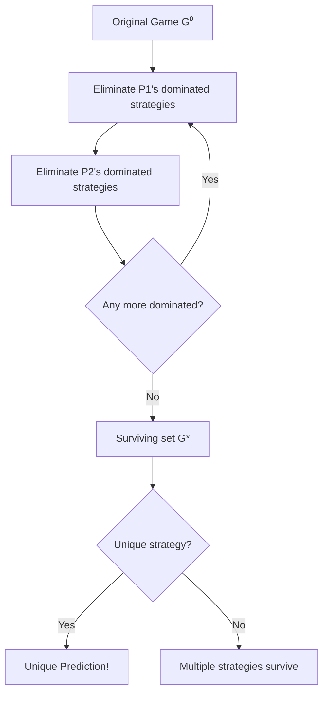

# 🧠 Dominance and Rationality

> [!abstract] TL;DR
> A strategy sᵢ **strictly dominates** s'ᵢ if uᵢ(sᵢ, s₋ᵢ) > uᵢ(s'ᵢ, s₋ᵢ) for all s₋ᵢ — rational players never play strictly dominated strategies. **Iterated Elimination of Dominated Strategies (IEDS)** applies this logic repeatedly under **Common Knowledge of Rationality (CKR)**: everyone is rational, everyone knows everyone is rational, ad infinitum. Strict IEDS is order-independent (surviving set same regardless of elimination sequence); weak IEDS is order-dependent. **Rationalizability** (Bernheim/Pearce 1984) uses iterated elimination of never-best-responses and is the exact epistemic counterpart of CKR; in 2-player games rationalizability = strict IEDS survivors.

---

## Intuition — analogy FIRST

In a **sealed-bid art auction**, imagine you're bidding against one other bidder whose valuation you don't know. If your value is $100, bidding $101+ is dominated (you'd pay more than it's worth). If your value is $100, bidding $0 is dominated (you'd definitely lose). Rational competitors progressively eliminate absurd bids. After enough rounds of "they wouldn't bid X, so I shouldn't respond to X," you've rationalized a range of reasonable bids — that's iterated dominance in action.

---

## How It Works

### Strict Dominance

**Definition**: Strategy sᵢ **strictly dominates** s'ᵢ for player i if:
$$u_i(s_i, s_{-i}) > u_i(s'_i, s_{-i}) \quad \forall s_{-i} \in S_{-i}$$

**Pure over pure**: sᵢ beats s'ᵢ in every opponent profile.

**Mixed over pure**: A mixed strategy σᵢ can strictly dominate a pure strategy even if no single pure strategy does:

$$\sum_{s_i} \sigma_i(s_i) u_i(s_i, s_{-i}) > u_i(s'_i, s_{-i}) \quad \forall s_{-i}$$

This is critical — iterated elimination must include mixed strategies to find all survivors.

### Weak Dominance

**Definition**: sᵢ **weakly dominates** s'ᵢ if:
$$u_i(s_i, s_{-i}) \geq u_i(s'_i, s_{-i}) \quad \forall s_{-i}$$
with strict inequality for at least one s₋ᵢ.

Weak dominance: order-dependent! Different elimination sequences can yield different surviving sets.

---

### IEDS — Iterated Elimination of Dominated Strategies

**Algorithm (Strict)**:
1. Find all strictly dominated strategies (by pure or mixed strategies)
2. Eliminate them from all players' strategy sets
3. Repeat on the reduced game until no dominated strategies remain
4. Surviving strategies = **rationalizable** set (in 2-player games)

**Order-independence theorem**: For strict dominance, the set of surviving strategy profiles G* is the same regardless of the order in which strategies are eliminated.

**Proof sketch**: If sᵢ is strictly dominated in the original game by σᵢ, it remains dominated in any subgame (fewer opponent strategies can only make the domination easier to maintain — if σᵢ beats sᵢ against all opponents including eliminated ones, it still beats sᵢ against the remaining subset).

---

### Worked Example: Prisoner's Dilemma

| | C | D |
|--|:--:|:--:|
| **C** | (3,3) | (0,5) |
| **D** | (5,0) | (1,1) |

- For P1: u₁(D,C) = 5 > 3 = u₁(C,C) and u₁(D,D) = 1 > 0 = u₁(C,D) → **D strictly dominates C for P1**
- By symmetry: **D strictly dominates C for P2**
- IEDS: eliminate C for both → unique survivor (D,D)

Result: (D,D) is the unique rationalizable outcome and the unique NE. Yet it's Pareto-dominated by (C,C)! This is the central tragedy of the Prisoner's Dilemma.

---

### Worked Example: Beauty Contest (Keynesian)

N players simultaneously choose integers in [0, 100]. Winner = player closest to 2/3 of the mean.

- Round 1: Any value > 66.7 is dominated (even if everyone plays 100, 2/3 × 100 = 66.7)
- Round 2: After eliminating [67, 100], 2/3 × 66.7 ≈ 44.5 — eliminate [45, 66]
- Round 3: 2/3 × 44.5 ≈ 29.7 — eliminate [30, 44]
- ... → Converges to 0

**IEDS prediction**: All play 0. NE prediction: all play 0. Empirical observation: people play ~25-35 (limited rounds of reasoning ≈ cognitive hierarchy model).

---

## Key Concepts / Details

### Common Knowledge of Rationality (CKR)

**Levels of knowledge**:
- **Level 0** (Rationality): Each player maximizes their own payoff
- **Level 1** (Common Knowledge): "I know you're rational, so I can eliminate your dominated strategies"
- **Level 2**: "I know you know I'm rational, so I eliminate strategies dominated given your elimination"
- **Level k**: k rounds of mutual reasoning
- **CKR**: Infinite tower — complete common knowledge of rationality

**Epistemic foundation**: IEDS (strict) under CKR yields exactly the rationalizable set.

### Rationalizability (Bernheim 1984, Pearce 1984)

A strategy sᵢ is **rationalizable** if it survives iterated elimination of never-best-responses:

**Never-best-response (NBR)**: sᵢ is an NBR if there is no belief σ₋ᵢ ∈ Δ(S₋ᵢ) such that sᵢ ∈ BRᵢ(σ₋ᵢ).

**Rationalizability algorithm**:
1. Eliminate all NBRs for all players
2. Update beliefs to have support only on surviving strategies
3. Repeat until no more NBRs

**Key theorem**: In finite two-player games, rationalizability = iterated strict dominance survivors (Pearce 1984). In n > 2 player games, rationalizability can be a strictly larger set (because beliefs over opponents need not be independent).

### Dominant Strategy Equilibrium

A **dominant strategy equilibrium** is a profile (s*₁, …, s*ₙ) where each s*ᵢ strictly dominates all other strategies for player i:

$$u_i(s^*_i, s_{-i}) > u_i(s_i, s_{-i}) \quad \forall s_i \neq s^*_i, \forall s_{-i}$$

This is the strongest equilibrium concept — players' optimal strategies don't depend on beliefs at all.

**Examples**: Prisoner's Dilemma (D,D); Second-price auction (truthful bidding).

### Summary Table

| Concept | Requirement | Order Dependent? | Epistemic Basis |
|---------|------------|-----------------|----------------|
| Strict dominance | Always worse | — | 1 round rationality |
| Strict IEDS | Survive all rounds | **No** | CKR |
| Weak dominance | Never better, sometimes worse | — | — |
| Weak IEDS | Survive all weak rounds | **Yes** | Stronger than CKR |
| Rationalizability | Always a best response to some belief | No | CKR (exact) |

---

## Real-World Notes

- **Algorithmic game theory**: IEDS can reduce large games before computing NE. In extensive-form games, backward induction IS IEDS applied to the normal form.
- **Ad auctions**: In second-price auctions, truthful bidding dominates all other strategies — no iteration needed.
- **Behavioral economics**: Experiments show 1–3 levels of iterated reasoning in humans (Camerer's cognitive hierarchy model). IEDS to completion is rarely observed.
- **Trading**: In limit order books, submitting orders far from the market price is dominated — market microstructure exploits this to design efficient matching.

---

## Common Pitfalls

1. **Forgetting mixed dominance** — A pure strategy might not be dominated by any pure strategy but IS dominated by a mixed strategy. Full IEDS must consider mixed dominators.
2. **Weak order dependence** — Running weak IEDS in different orders can leave different surviving sets. Always state which order you used.
3. **CKR ≠ rationality** — CKR is a much stronger assumption than each player being individually rational. In one-shot games, CKR is often empirically violated.
4. **Rationalizability ≠ NE** — Every NE strategy is rationalizable, but not every rationalizable profile is a NE. NE adds the mutual best-response condition.

---

## Related Concepts

- [[_MOC_GT_Fundamentals|↑ Fundamentals MOC]]
- [[Players_Strategies_and_Payoffs|Players, Strategies & Payoffs]]
- [[Information_in_Games|Information in Games]]
- [[../02_Static_Games/Nash_Equilibrium|Nash Equilibrium]]
- [[../02_Static_Games/Minimax_Theorem|Minimax Theorem]]

---

## Review Questions

1. In the 3×3 game with payoff matrix for P1 [[3,0,1],[2,1,4],[1,2,0]] and for P2 [[1,2,3],[4,1,2],[2,3,1]], run IEDS (strict). What survives?
2. Show that the mixed strategy σ₁ = (½, ½, 0) can strictly dominate a pure strategy that no single pure strategy dominates. Give an explicit 3×3 example.
3. Why does order-independence fail for weak IEDS? Construct a 2×2 example where different orders of weak elimination produce different outcomes.

---

## Sources

- Bernheim, D. (1984) — "Rationalizable Strategic Behavior," *Econometrica*
- Pearce, D. (1984) — "Rationalizable Strategic Behavior and the Problem of Perfection," *Econometrica*
- Osborne & Rubinstein — *A Course in Game Theory*, Ch. 4

#Game_Theory #Fundamentals #DominanceRationality
