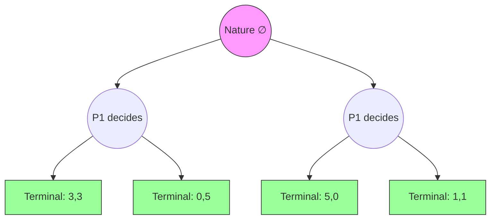

# 📋 Game Representations

> [!abstract] TL;DR
> A game can be represented in three equivalent but complementary forms: the **normal (strategic) form** G = (N, {Sᵢ}, {uᵢ}) encodes simultaneous choice as a payoff matrix; the **extensive form** encodes sequential decisions as a rooted tree with decision/chance/terminal nodes and information sets capturing what players observe; the **mixed extension** lifts pure strategies to probability distributions σᵢ ∈ Δ(Sᵢ) with expected payoffs uᵢ(σ) = Σₛ σ(s)·uᵢ(s). Converting between forms is possible but information can be lost when collapsing an extensive form to normal form.

---

## Intuition — analogy FIRST

Think of a **chess match program stored on a USB drive**. The extensive form is the full game tree — every possible board state, every branching choice, every chance event (like who goes first in variants). The normal form is like handing each player a sealed envelope with their complete strategy written down before any move is made. The payoff matrix is just the scorecard: given what was in both envelopes, who won?

The same strategic situation wears different clothes for different analyses: normal form for static equilibrium computation, extensive form for backward induction and sequential rationality, the mixed extension for existence proofs.

---

## How It Works

### Normal (Strategic) Form

A **normal-form game** is a triple:

$$G = (N,\ \{S_i\}_{i \in N},\ \{u_i\}_{i \in N})$$

- **N** = {1, 2, …, n} — finite set of players
- **Sᵢ** — finite pure strategy set for player i (may be infinite in continuous games)
- **uᵢ: S → ℝ** — payoff function where S = ×ᵢ Sᵢ is the strategy profile space

**Bimatrix Form** (2-player): Rows = Player 1's strategies, Columns = Player 2's strategies, entries = (u₁, u₂).

**Prisoner's Dilemma:**

|  | **Cooperate** | **Defect** |
|--|:---:|:---:|
| **Cooperate** | (3, 3) | (0, 5) |
| **Defect** | (5, 0) | (1, 1) |

*R=3 (reward), T=5 (temptation), S=0 (sucker), P=1 (punishment). Ordering: T > R > P > S.*

---

### Extensive Form

An **extensive-form game** is a rooted tree with:

**Formal components:**
1. **Decision nodes** — owned by some player iᵥ ∈ N ∪ {Nature}
2. **Chance nodes** — Nature moves with fixed probabilities over branches
3. **Terminal nodes** — end states with payoff vectors (u₁(z), …, uₙ(z))
4. **Actions** A(v) — set of available moves at decision node v
5. **Information sets** Iᵢ — partition of player i's decision nodes; player cannot distinguish nodes in the same information set

**Information set constraint**: A(v) = A(v') whenever v, v' ∈ Iᵢ — you must have the same action choices at indistinguishable nodes.

---

### Strategies in Extensive Form

A **pure strategy** for player i is a **complete contingent plan**: a function assigning an action to every information set of player i, even those that would never be reached given the strategy itself.

> This is subtle and crucial. A strategy must specify what you would do *even at histories you prevent yourself from reaching* — these off-path specifications determine equilibrium selection.

**Example**: In a 2-stage game where Player 1 moves first (L or R) and Player 2 moves second:
- Player 2's strategy must specify an action after both L and after R, even if Player 1 plays L (making the R-history unreachable).

---

### Mixed Extension

The **mixed extension** of a normal-form game replaces pure strategies with probability distributions:

$$\sigma_i \in \Delta(S_i) = \left\{ \sigma_i: S_i \to [0,1]\ \Big|\ \sum_{s_i \in S_i} \sigma_i(s_i) = 1 \right\}$$

**Expected payoff** under a mixed profile σ = (σ₁, …, σₙ):

$$u_i(\sigma) = \sum_{s \in S} \left(\prod_{j \in N} \sigma_j(s_j)\right) u_i(s)$$

*(Assumes independence of mixing across players — a key assumption.)*

**Behavioral strategies** (for extensive form): at each information set, independently randomize over available actions. By **Kuhn's Theorem**, for games with perfect recall, behavioral strategies are equivalent to mixed strategies — every mixed strategy has a payoff-equivalent behavioral strategy.

---

## Key Concepts / Details

### Converting Between Forms

**Extensive → Normal**: Enumerate all complete contingent plans. A 2-player game with 3 information sets for P2 (binary actions each) produces 2³ = 8 pure strategies for P2. The payoff matrix can become exponentially large.

**Normal → Extensive**: Not always meaningful; the normal form loses information about the temporal structure. However, we can represent any normal-form game as a simultaneous-move tree (all players act at a single root node).

### Zero-Sum vs General-Sum

| Property | Zero-Sum | General-Sum |
|----------|---------|-------------|
| Payoff relation | u₁(s) + u₂(s) = 0 ∀s | No constraint |
| Minimax theorem | Applies (von Neumann 1928) | Does not apply |
| Value concept | Unique saddle-point value | Multiple NE possible |
| Cooperation | Impossible | May be beneficial |

### Representation Choice Matters

- **Static games** (simultaneous) → normal form sufficient
- **Sequential games** → extensive form needed for backward induction, SPE
- **Repeated / stochastic games** → extensive form with stage structure

---

## Real-World Notes

- **AI game playing** (AlphaGo, AlphaZero): The extensive form tree of Go has ~10¹⁷⁰ nodes — far too large to enumerate. Monte Carlo Tree Search exploits the tree structure without full enumeration.
- **Poker solvers** (PioSOLVER): Solve imperfect-information extensive-form games by computing Nash strategies over information sets.
- **Mechanism design**: Normal form sufficient to characterize truthful mechanisms via the revelation principle — the full extensive-form interaction is collapsed to a one-shot report.
- **Board game complexity**: Checkers solved (perfect play = draw); chess determined by Zermelo but value unknown; Go determined but no solved value.

---

## Common Pitfalls

1. **Strategy ≠ Action** — A strategy is a complete plan; an action is a single move at one node. Confusing these breaks SPNE analysis.
2. **Information set must be closed**: If v ∈ Iᵢ and v' is a successor of v, then v' ∉ Iᵢ — information sets cannot contain nodes of different depths on the same path.
3. **Independence assumption in mixed extension** — σᵢ and σⱼ are drawn independently. Correlated deviations require correlated equilibrium (not captured by Δ(Sᵢ) product).
4. **Extensive form → normal form loses refinements** — Two different extensive forms can produce the same normal form but have different SPE sets.

---

## Related Concepts

- [[_MOC_GT_Fundamentals|↑ Fundamentals MOC]]
- [[Players_Strategies_and_Payoffs|Players, Strategies & Payoffs]]
- [[Dominance_and_Rationality|Dominance & Rationality]]
- [[../03_Dynamic_Games/Extensive_Form_and_Game_Trees|Extensive Form & Game Trees (Deep Dive)]]
- [[../02_Static_Games/Nash_Equilibrium|Nash Equilibrium]]

---

## Review Questions

1. Write the normal form of the Battle of the Sexes game and identify all pure strategy Nash equilibria by inspection of the bimatrix.
2. A 3-player game has 2, 3, and 4 information sets respectively, each with 2 actions. How many cells are in the full normal form? Is this feasible to enumerate?
3. Construct an extensive-form game where two different pure strategies for Player 1 yield identical outcomes in all terminal nodes, and explain what this implies for the normal form.

---

## Sources

- Osborne & Rubinstein — *A Course in Game Theory* (MIT Press, free online)
- Fudenberg & Tirole — *Game Theory* (MIT Press, 1991)
- Kuhn, H.W. (1953) — "Extensive Games and the Problem of Information"

#Game_Theory #Fundamentals #GameRepresentations
